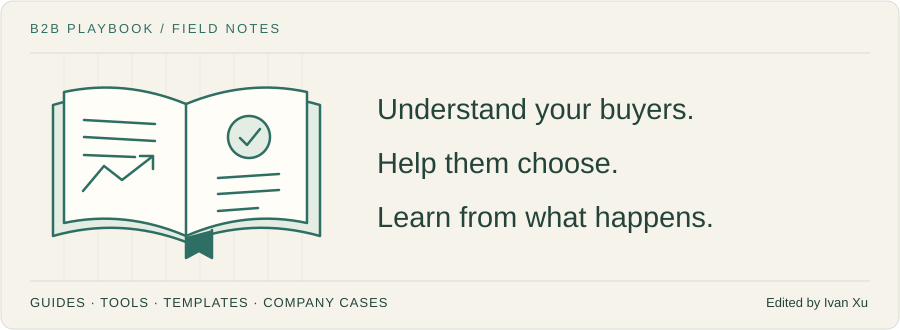

# B2B Playbook

Practical guides for finding customers, explaining your product, and building a B2B marketing team that learns.



**[Read the library on Mintlify](https://b2-b-playbook.mintlify.app)** · [中文简介](README.zh.md) · [Browse the playbooks](playbooks/)

**Current coverage:** 77 published playbooks · 56 working files · 43 curated tools · 20 reading sources · 9 domain guides

**Last reviewed:** 2026-09-06

## Start with the work in front of you

| Your question | Start here |
|---|---|
| Who should we sell to first? | [ICP: a 10-minute field test](playbooks/01-strategy-and-buyers/icp.md#10-minute-field-test) |
| How do we explain why someone should choose us? | [Positioning](playbooks/02-product-marketing/positioning.md) |
| What should we say in a cold email? | [Cold email](playbooks/05-outbound-and-prospecting/cold-email.md) |
| Is this event worth attending? | [Event marketing](playbooks/06-account-field-and-partner/event-marketing.md) |
| What should the founder post on LinkedIn? | [Founder story](playbooks/03-brand-story-and-content/founder-story.md) → [LinkedIn organic](playbooks/04-channels-and-distribution/linkedin-organic.md) |
| Which marketing work is bringing customers? | [Measurement model](playbooks/09-operations-pipeline-and-measurement/measurement-model.md) |

## What you will find

| Collection | What is inside |
|---|---|
| [Playbooks](playbooks/) | Step-by-step guides, examples, checklists, metrics, and further reading |
| [Working files](TEMPLATES.md) | 56 briefs, scorecards, worksheets, and planning files to copy privately |
| [Tools](TOOLS.md) | 43 modern products across 14 categories, with fit and limitations |
| [Company cases](use-cases/index.md) | 3 specific stories from PostHog, Buffer, and Zapier, with dated primary sources |
| [Reading sources](RESOURCES.md) | 20 newsletters, publications, and practitioners worth exploring |
| [Agent Skill](#agent-skill) | The same guidance available to Claude, Codex, and other agents |

## Read it like a book

Pick a short path or jump straight to the guide you need.

- **First customers:** [Idea discovery](playbooks/01-strategy-and-buyers/idea-discovery.md) → [validation](playbooks/01-strategy-and-buyers/idea-validation.md) → [ICP](playbooks/01-strategy-and-buyers/icp.md) → [first ten customers](playbooks/01-strategy-and-buyers/first-ten-customers.md).
- **A clearer offer:** [Positioning](playbooks/02-product-marketing/positioning.md) → [messaging](playbooks/02-product-marketing/messaging.md) → [homepage](playbooks/07-website-and-conversion/homepage.md) → [demo](playbooks/02-product-marketing/demo.md).
- **A repeatable plan:** [Channel strategy](playbooks/04-channels-and-distribution/channel-strategy.md) → [content strategy](playbooks/03-brand-story-and-content/content-strategy.md) → [GTM planning](playbooks/09-operations-pipeline-and-measurement/gtm-planning.md) → [measurement](playbooks/09-operations-pipeline-and-measurement/measurement-model.md).

## The nine chapters

| Chapter | Topics |
|---|---|
| [01 · Strategy & buyers](playbooks/01-strategy-and-buyers/) | Ideas, ICP, buying committees, first customers, product-market fit |
| [02 · Product marketing](playbooks/02-product-marketing/) | Positioning, messaging, pricing, launches, demos |
| [03 · Brand, story & content](playbooks/03-brand-story-and-content/) | Content strategy, founder stories, case studies, white papers |
| [04 · Channels & distribution](playbooks/04-channels-and-distribution/) | LinkedIn, SEO/AEO, community, creators, paid media |
| [05 · Outbound & prospecting](playbooks/05-outbound-and-prospecting/) | Research, buying signals, cold email, cold calls, sequences |
| [06 · Account, field & partner](playbooks/06-account-field-and-partner/) | ABM, account plans, events, trade shows, dinners, partners |
| [07 · Website & conversion](playbooks/07-website-and-conversion/) | Homepage, comparisons, pricing pages, landing pages, forms |
| [08 · Lifecycle & customer](playbooks/08-lifecycle-and-customer-marketing/) | Onboarding, nurture, customer success, renewals, expansion |
| [09 · Operations, pipeline & measurement](playbooks/09-operations-pipeline-and-measurement/) | Planning, budgets, CRM, measurement, AI workflows, team routines |

## Agent Skill

```bash
npx skills add weilun88313/B2B-Playbook
```

Try this task:

```text
Use $b2b-playbook to review these five target accounts.
Explain who fits, what is still unknown,
and one sensible next step for each.
```

The Skill provides guidance. It does not send messages or change your CRM. [Read the instructions](SKILL.md).

## About this library

I am Ivan Xu. Lensmor is my product. I maintain this library for founders and B2B marketing teams who want practical help with their work.

- English is the main language. [README.zh.md](README.zh.md) is a separate Chinese introduction, updated alongside this page.
- Read comfortably on [Mintlify](https://b2-b-playbook.mintlify.app). GitHub holds the source and revision history.
- Illustrative examples are labelled. Company cases link to dated primary sources; reported results have not been independently audited.
- Tools are not paid placements. Lensmor is my product, and its entry says so.
- Third-party links use `ref=b2b-playbook` to identify the referral source. It is not an affiliate code.
- New articles are added as they are ready. Planned topics are not empty pages.

You can make a private working copy of the templates. Republishing the content requires permission; see the [copyright and reuse terms](LICENSE).

If a page helps, **star the repository** to save it, or share that specific page with someone facing the same problem.
