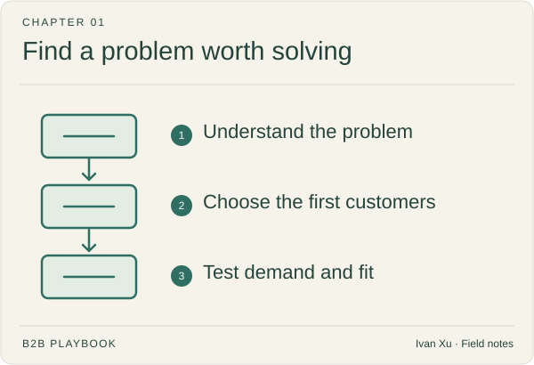

# 01 · Strategy & buyers

Before choosing channels or writing copy, get clear on the customer. These guides help you investigate a problem, choose the first buyers, and test whether the product is worth paying for.

**Status:** Domain guide published · 8 tactic playbooks published

**Last reviewed:** 2026-09-06

## Start here

- [Idea discovery](idea-discovery.md) — notice a problem.
- [Ideal customer profile (ICP)](icp.md) — check the fit.
- [First ten customers](first-ten-customers.md) — existing trust.

## Playbook map

| Guide | What it helps you do |
|---|---|
| [Idea discovery](idea-discovery.md) | Where did this idea come from, and is it even a candidate? |
| [Idea validation](idea-validation.md) | Does this idea have pain and pull, or is it still polite interest? |
| [Ideal customer profile](icp.md) | Which accounts deserve attention, and which should be excluded? |
| [Wedge](wedge.md) | Which audience and use case do we win first—and how do we expand without a cold start? |
| [Buying committee](buying-committee.md) | Who participates in the decision, and what does each role need? |
| [First ten customers](first-ten-customers.md) | How do you find and win the first ~10 companies that match the ICP? |
| [Product-market fit](product-market-fit.md) | Has a real company loved it, paid, and started to pull—before you scale a channel? |
| [Four Fits](four-fits.md) | Do market, product, channel, and model still describe the same company? |

## Coming later

These topics are on the writing list. There is no article to open yet.

| Planned topic | Question to cover |
|---|---|
| Market research | What is true about the market beyond internal opinion? |
| Segmentation | Which groups differ enough to require a distinct strategy? |
| Buyer journey | How does a buying situation move from trigger to decision and adoption? |
| Jobs to be done | What progress is the buyer hiring a solution to make? |
| Category entry points | Which situations should make the company come to mind? |
| Competitive alternatives | What will buyers do if they do not choose this product? |

## Where to go next

Pick a guide above for the task you are working on, or browse [Product marketing](../02-product-marketing/) for a related part of the work.

[Back to the playbook index](../README.md)

---

Copyright © 2026 Ivan Xu. All rights reserved. See the [copyright and reuse terms](../../LICENSE).

Canonical source: [github.com/weilun88313/B2B-Playbook](https://github.com/weilun88313/B2B-Playbook)
