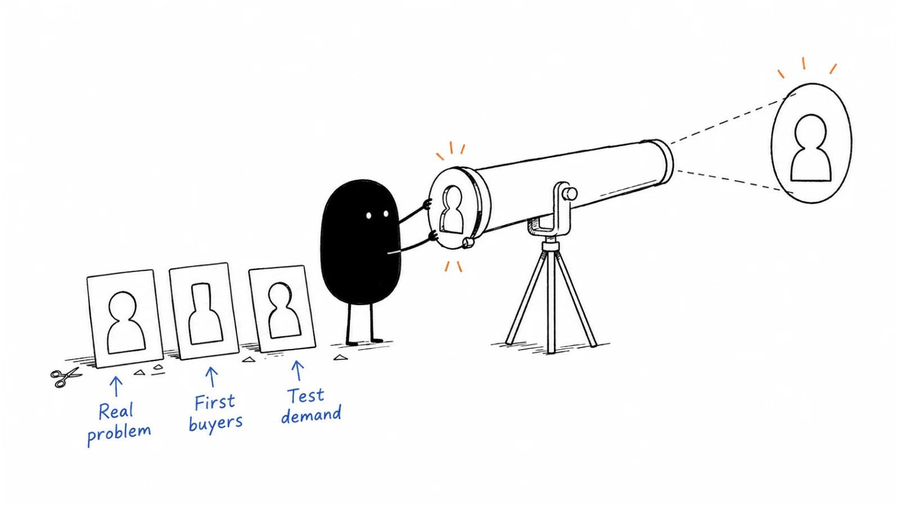

# 01 · Strategy & buyers

You have an idea, a few encouraging conversations, and more possible customers than you can serve. Start by understanding the problem and choosing whom to learn from. The guides here help you make that choice with real conversations and a small, manageable test.

**Last reviewed:** 2026-09-06 · **Reading edit:** 2026-09-12

## Start here

1. [Explore a problem](idea-discovery.md) — Turn a recurring frustration into a question you can investigate.
2. [Choose whom to approach](icp.md) — Compare a few companies and explain why each might fit.
3. [Start the conversations](first-ten-customers.md) — Find a sensible route to the people you want to learn from.

## Playbook map

| Guide | What it helps you do |
|---|---|
| [Idea discovery](idea-discovery.md) | Is this recurring problem worth exploring as a business? |
| [Idea validation](idea-validation.md) | What would show that people want to try or buy the proposed solution? |
| [Ideal customer profile](icp.md) | Which customers are likely to benefit from what we can deliver? |
| [Wedge](wedge.md) | Which customer and task should we focus on first? |
| [Buying committee](buying-committee.md) | Who is involved in the purchase, and what does each person need? |
| [First ten customers](first-ten-customers.md) | How do we start useful conversations with our first potential customers? |
| [Product-market fit](product-market-fit.md) | Are customers getting enough value to keep using and paying for the product? |
| [Four Fits](four-fits.md) | Do the product, customers, selling approach, and economics work together? |
| [Market research](market-research.md) | What do we need to learn before choosing a market to pursue? |
| [Segmentation](segmentation.md) | Which customer differences should change our offer or approach? |
| [Buyer journey](buyer-journey.md) | What does the buyer need to do before deciding and getting started? |
| [Jobs to be done](jobs-to-be-done.md) | What is the person trying to accomplish behind a feature request? |
| [Category entry points](category-entry-points.md) | Which situations should remind people that our product could help? |
| [Competitive alternatives](competitive-alternatives.md) | What would the buyer do if they did not choose us? |

## Try one thing

Choose one possible customer. Write the task they struggle with, how they handle it today, and the question you would ask them next.

## Where to go next

Pick a guide above for the task you are working on, or browse [Product marketing](../02-product-marketing/) for a related part of the work.

[Back to the playbook index](../README.md)

**Status:** Domain guide published · 14 tactic playbooks published

---

Copyright © 2026 Ivan Xu. All rights reserved. See the [copyright and reuse terms](../../LICENSE).

Canonical source: [github.com/weilun88313/B2B-Playbook](https://github.com/weilun88313/B2B-Playbook)
