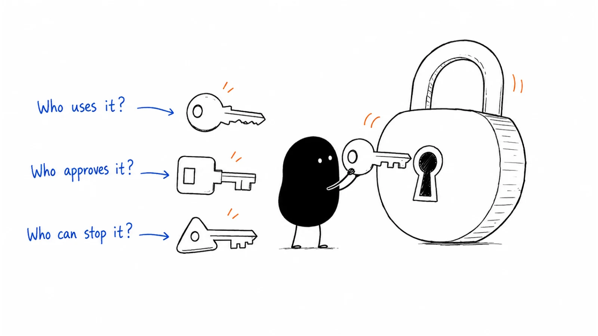

**Last reviewed:** 2026-09-07 · **Reading edit:** 2026-09-07

The demo went well. Your contact asked good questions, described a real problem, and said the product could help. You sent the proposal.

A week later, the reply arrives: “Still discussing internally.”

That sentence can mean several different things. A manager may be deciding whether the problem deserves a budget. An engineer may be checking what the product can access. Someone may be comparing it with a tool the company already owns. Your contact may simply be struggling to explain the idea to colleagues who were not on the call.

Sending another feature list will not necessarily help.

A buying committee is the group of people whose decisions, work, or approval matter to a purchase. It does not have to be a formal committee, and its members may never meet together. Your job is to understand the decision they are making and help them evaluate it—not to collect as many senior names as possible.



This guide follows an interested contact through a practical buying conversation. Read in order, or jump to [the worked example](#how-a-filled-committee-map-reads), [the forwardable brief](#help-your-contact-explain-the-decision), or [the copyable map](#committee-map-copy).

## Use this when

Use this when an account appears relevant but you cannot explain how interest becomes a decision. Perhaps you know the daily user but not who approves the expense. Perhaps the budget owner is enthusiastic while the people who must implement the product have not seen it.

It also helps when opportunities repeatedly stall at the same point. If security questions arrive after you have promised a start date, or a pilot succeeds but nobody owns the rollout, the missing information may concern the buying process rather than the product.

For marketing teams, this work explains why a good landing page and a persuasive demo are not enough. Your materials may need to help several people answer different questions about the same purchase.

## Do not use this when

If the account clearly cannot benefit from your current offer, a detailed relationship map will not make it a better [ICP](https://b2-b-playbook.mintlify.app/playbooks/01-strategy-and-buyers/icp) match. If fit is unknown, investigate the workflow alongside the buying process.

Lack of urgency is different from lack of fit. You can learn how a suitable company buys without treating it as an active opportunity. Record the timing honestly instead of inventing a deadline to justify the account.

Do not turn this exercise into speculative notes about personalities or private relationships. You need relevant responsibilities, stated concerns, and observable actions. You do not need a theory about who secretly dislikes whom.

## Start with the decision, not the org chart

“Buy our product” is usually too broad a description of the next decision.

The immediate question might be whether to spend half an hour reviewing a sample, permit a trial with company data, fund a limited pilot, sign an annual agreement, or expand an existing deployment. Those decisions can involve different people and different requirements.

An operations manager may approve time for a demonstration but lack permission to upload customer records. A department head may fund a small pilot but need another approval for a recurring subscription. A legal reviewer may approve contract language without deciding whether the product is worth buying.

Write the next decision in a sentence:

**“Decide whether this team can run a paid, limited evaluation using an approved dataset, with an engineering reviewer assigned.”**

Now you have something specific to investigate. Who can authorize the spending? Who approves the data use? Who can allocate the reviewer's time? What must be true before work begins?

Do not assume these checks happen in a neat sequence. Some can run together; others depend on a completed assessment. Ask the customer how the process works for this particular scope.

## Core seats

The following roles are useful prompts, not required boxes. One person may hold several responsibilities. A larger organization may divide one responsibility among several people.

| Responsibility | What you need to understand | Evidence to look for |
|---|---|---|
| Daily user or operator | Whether the workflow improves their actual work | They attempt the task and describe what changes |
| Business owner | Whether the result matters enough to prioritize | They connect the problem to a team commitment |
| Budget approver, often called the economic buyer | Who can authorize this level and type of spending | The approval path is explained or confirmed |
| Internal advocate, often called the champion | Who will help colleagues evaluate and coordinate the change | They organize a relevant conversation or advance an agreed action |
| Technical or risk reviewer | Whether the proposed use meets the company's requirements | They identify applicable checks and review the evidence |
| Procurement or legal | How the organization can enter the agreement | The request, contract, and signing process are understood |
| Implementation owner | Who will make adoption work after approval | They accept a concrete setup and handover plan |

“Can stop the deal” is not a personality type. It may describe someone's formal responsibility, a resource constraint, or a requirement your offer cannot meet. Record the actual issue: “Customer data cannot leave the approved environment” is more useful than “Security is a blocker.”

Keep influence and authority separate. An experienced operator may have no purchasing authority and still determine whether colleagues trust the tool. A senior executive may support the idea while another person controls the relevant budget. Titles help you ask a question; they do not settle the answer.

## A friendly contact is a useful beginning

You do not have to decide on the first call whether someone is a “real champion.” Relationships develop, and people reasonably want evidence before they spend their credibility recommending an unfamiliar vendor.

Start by understanding what they want. Are they trying to reduce their own workload, solve a team problem, explore a possible future project, or prepare a recommendation for someone else? Each can be a legitimate conversation.

Then watch what happens after a small, relevant request. They might correct your description of the problem, explain how a similar purchase worked, invite a reviewer, or arrange for someone to test the output. These actions tell you more than an enthusiastic comment.

A contact who sends your proposal to a manager has helped. That does not prove the manager supports it, the funding exists, or a decision is scheduled. Record the action at the level you can substantiate.

Avoid making access to executives a test of someone's worth. Some organizations expect vendors to work through a designated contact. You can still ask for clarification, written feedback, or an approved joint conversation. The goal is a reliable path to a decision, not unrestricted access to everyone involved.

<a id="operating-method"></a>

## How to do it

### Step 1: begin with the decision

Write the proposed change, current alternative, next approval, and reason the customer might act. Separate the customer's target date from your preferred closing date.

Ask what happens if they keep the existing approach for another month. Sometimes the answer reveals a genuine consequence. Sometimes it reveals that the problem is tolerable, or another project matters more. Both answers help you plan.

Clarify the boundaries of the offer before discussing participants. A browser-based demonstration with synthetic data is different from connecting a production database. A small preparation service is different from software authorized to execute changes.

If scope changes, revisit the approval path. Permission for the earlier version is not automatically permission for the new one.

### Step 2: map seats, not only titles

Begin with the people you already know. For each, record what they do in this decision, what they have said matters, and what remains uncertain.

A natural way to learn the process is to ask about a comparable purchase:

**“When your team last brought in a tool that handled similar data, what had to happen between choosing it and using it?”**

Follow the account's answer. If your contact mentions an IT intake form, ask when it is submitted and what information it needs. If they say their manager handles budget, ask whether the manager has seen the proposed scope. You do not need to recite every possible role.

A previous purchase is a starting point, not a guarantee. Different spending, integrations, data, or contract terms may change the requirements. Confirm which parts apply now.

### Step 3: separate fact from hypothesis

A map should make uncertainty visible, especially when information comes through another person.

| What you know | How to record it |
|---|---|
| A reviewer explained their own responsibility | “Engineering manager confirmed ownership of reviewer allocation in Tuesday's call.” |
| Your contact described someone else's authority | “Ops lead reports that the department head approves this expense; not yet confirmed.” |
| You inferred a role from a title | “Possible budget approver; title only, no account-specific evidence.” |
| A similar customer used a particular process | “Research prompt only; this account's process is unknown.” |

Keep dates and scope with meaningful approvals. “Approved” could refer to a sample, a budget range, a contract revision, or deployment. Without that context, a later reader can mistake one person's agreement for permission to proceed.

You do not need to demand formal proof for every routine statement. Use proportionate verification. Before spending significant delivery effort or handling company data, however, resolve the approvals that affect that action.

### Step 4: identify the missing path

Choose the unknown most likely to change the next step. If the product needs a reviewer and nobody has time to review it, another pricing conversation may be premature.

Make the introduction request specific:

**“Could we ask whoever owns the engineering review whether this packet includes the information they need? We can send a redacted example first, so they can decide whether a call is worthwhile.”**

That request has a purpose, a manageable cost, and an alternative to another meeting. It also gives your contact something reasonable to forward.

Agree who will make the introduction and what you may send. Do not go around the contact, imply their endorsement without permission, or start contacting everyone you found on LinkedIn. More conversations help only when they contribute to the customer's decision.

### Step 5: update after every material interaction

Update the map when someone clarifies a requirement, takes ownership, withdraws support, changes the scope, or explains a timing constraint. A new name alone may not be meaningful progress.

End a useful conversation with an agreed action: what will happen, who owns it, and when it is reasonable to check back. The action can be “pause until the engineering planning meeting,” not just another sales meeting.

Distinguish an agreed action from a seller's plan. “We will send the sample Friday” is yours. “The reviewer agreed to compare it with the current form next Tuesday” includes a customer commitment.

If the commitment does not happen, ask what changed. Correct the map and timing rather than leaving an optimistic next step in the CRM indefinitely.

## How a filled committee map reads

The following is a **fictional continuation** of the record-correction example in [idea validation](https://b2-b-playbook.mintlify.app/playbooks/01-strategy-and-buyers/idea-validation), [ICP](https://b2-b-playbook.mintlify.app/playbooks/01-strategy-and-buyers/icp), and [wedge](https://b2-b-playbook.mintlify.app/playbooks/01-strategy-and-buyers/wedge). The people, dialogue, and proposed decisions below are invented to demonstrate the method. They are not customer research or a reported company result.

The proposed offer prepares correction requests for an engineer to review. It does not change production records. Earlier, five approved, redacted past requests were prepared with manual assistance: three were review-ready, while two still lacked information from another department. An improved existing form might explain part of the benefit.

The operations lead wants to try another batch. That is encouraging, but the next decision is not “roll out an automation platform.” It is whether a bounded evaluation is useful, permitted, and worth the work.

### The first conversation: interest becomes a concrete request

**Founder:** “If we prepare another batch, what would need to be arranged on your side?”

**Operations lead:** “I can choose the requests, but someone in engineering has to review them. Their manager decides who has time.”

**Founder:** “Would a sample and a short description of the review work help them decide?”

**Operations lead:** “Yes. Please make it clear you are not connecting to production. They thought the demo included automatic corrections.”

That misunderstanding changes the next action. The founder does not send a bigger product deck. They prepare one redacted before-and-after example, state the exact boundary, and ask the operations lead to check it before sharing.

The contact has now taken a useful advocacy action: correcting the internal explanation and offering to involve the relevant reviewer. Budget authority is still unknown.

### The second conversation: the supposed blocker has a useful question

The engineering manager joins a short review.

**Engineering manager:** “I am not worried about the packet format. I am worried that my team will spend time checking packets and then ask operations for the same missing details.”

**Founder:** “That happened in two of the five examples. We should include those in the evaluation, not hide them. Could we compare the preparation approach with an improved version of your current form?”

**Engineering manager:** “Yes, if we keep the sample small. I also want the operator's preparation time included. Otherwise you could make our work easier by creating more work for them.”

The concern improves the test. It does not prove the product will win it.

The founder asks what review time the manager can actually allocate and how sample data must be approved. They do not translate willingness to discuss the test into authorization to start.

### The third conversation: a paid pilot has another owner

The operations lead then says a department head would need to approve any paid evaluation.

**Department head:** “What would we know at the end that we do not know now?”

**Founder:** “Whether this preparation step reduces avoidable clarification across the whole workflow, compared with the revised form, and whether the benefit remains after counting setup and review effort.”

**Department head:** “And if the form is good enough?”

**Founder:** “Then the evaluation should say so. We would not recommend a subscription on the evidence we have.”

That answer gives the buyer a decision, including a reason not to proceed. A pilot designed only to generate a success story is less useful to the company than a test that can resolve a genuine choice.

Commercial terms, the final scope, and any purchasing requirements still need to be checked. No purchase has been approved in this example.

### The map after those conversations

| Person or responsibility | What is known | What happens next |
|---|---|---|
| Operations lead | Wants another batch and offered to coordinate a reviewer | Check the written scope and identify suitable requests |
| Engineering manager | Raised the comparison and total-effort questions | Confirm reviewer availability and acceptable evaluation design |
| Daily operator | Will do preparation work; has not yet evaluated the proposed process | Include their effort and feedback in the test |
| Department head | Asked what the paid evaluation would establish | Review the final proposal and confirm spending authority |
| Data-use reviewer | Required permission and owner are not yet confirmed | Ask the customer's designated contact for the applicable process |
| Purchasing and signing | Still unknown for this scope | Confirm requirements before agreeing a start date |

Notice what the map does not contain: a guaranteed close date, a fully validated champion, or a claim that the department head can sign the contract. It contains enough information to choose the next responsible actions.

## Help your contact explain the decision

Your contact may have fifteen minutes between other work to explain the purchase. They should not have to reconstruct an hour-long demo, translate your terminology, and defend claims you have not established.

Give them a short decision brief they can edit in their own voice. Lead with the situation their colleagues recognize, explain the proposed change, show the relevant evidence, and state the unresolved questions.

For the fictional example, a forwardable note could look like this:

```text
Subject: Decision needed — limited request-preparation evaluation

We are considering a small evaluation of a service that prepares
one type of correction request for engineering review.

Today, some requests need extra clarification before review.
We do not yet know how much of this a better form could solve.

The service would prepare packets only. It would not connect to
production or execute changes. The proposed test would compare
it with our revised form and count preparation and review effort.

In five assisted examples, three packets were review-ready and
two still needed information. This is preliminary evidence,
not a demonstrated saving or a rollout recommendation.

Before starting, we need to agree:
- who can allocate review time;
- which inputs and data handling are permitted;
- the comparison, acceptance criteria, price, and test boundaries;
- the required purchase and signing approvals.

The end-of-test decision is whether to stop, revise the approach,
or consider a further commitment. An annual rollout is not
included in this request.

Please correct anything that does not match your understanding.
```

The brief is intentionally unfinished where the account has not decided. Replace the open questions with agreed details as they become available; do not fill them with plausible guesses.

Use a shareable document or email format the customer accepts. Keep private customer data out of public links. If the document includes sensitive commercial or security information, agree the appropriate recipients and access controls.

A useful brief should remain understandable without you in the room. Ask your contact which part a colleague would challenge first. That answer can reveal a missing comparison, unsupported benefit, or implementation cost.

## Different questions need different evidence

Keep one consistent account of what the product does. Adapt the supporting material to the question, not the truth of the claim.

| Question someone needs answered | A useful supporting item |
|---|---|
| Will this improve my daily work? | A realistic task example, including exceptions |
| Is the benefit worth prioritizing? | A comparison with the current approach and explicit assumptions |
| What would our team need to implement? | Setup responsibilities, dependencies, and ongoing effort |
| What happens to our data? | An accurate description of access, processing, storage, and applicable controls |
| What exactly are we buying? | A scoped offer with price, boundaries, and proposed terms |
| What happens if we stop? | The actual cancellation, access-removal, and data-return or deletion process |

This is a practical content agenda for B2B marketing. A comparison page can help someone explain why the existing option may not be enough. A worked example can make the promised result understandable. A concise implementation guide can reveal whether adoption is realistic.

You do not need a large asset library before speaking to customers. Make the item that resolves the next recurring question, then improve it as you learn. Track which questions it answers and which still require a conversation.

Be careful with business cases. Hours released are not automatically cash saved, and a possible benefit is not observed revenue. Ask the customer which assumptions they accept and how they value the change. Keep ranges, exclusions, and uncertainty visible instead of producing a precise return figure from guessed inputs.

## What a real procurement process makes visible

GitLab's public procurement handbook, reviewed here on **September 7, 2026**, requires procurement involvement before covered purchases or work begin, with stated exceptions. Its intake options include no-cost contract reviews for demos and trials. A free evaluation therefore should not be assumed to sit outside the customer's purchasing process. This is a description of GitLab's published process, not a rule for every company. [GitLab procurement handbook](https://handbook.gitlab.com/handbook/finance/procurement/?ref=b2b-playbook).

Its legal collaboration guide also separates legal review from other approval nodes: the legal procurement team does not control the privacy, security, or buyer-negotiation approvals described there. Finishing one review does not establish that all reviews are complete. [GitLab legal procurement guide](https://handbook.gitlab.com/handbook/legal/procurement-guide-collaborating-with-gitlab-legal/?ref=b2b-playbook).

These documents describe responsibilities and procedures. They do **not** report a particular vendor's sales result, reveal a private buying committee, or prove that following a process causes a faster sale.

The practical question for your account is: **“Which approvals apply to this proposal, who owns each one, and what do they need from us?”** Use the customer's own answer rather than importing another company's workflow.

## When people disagree, make the tradeoff concrete

Suppose operations wants faster turnaround while engineering wants fewer interruptions. The two goals may be compatible, but a proposal that merely moves work from one team to the other will not resolve the disagreement.

Return to a shared task. Walk through who provides the input, who checks it, who handles an exception, and where time is spent. Ask what result each participant would consider acceptable. If the criteria conflict, say so before launching the evaluation.

A useful joint conversation has a specific question. “Can we agree how to compare the two preparation methods?” is easier to answer than “Can everyone align on the platform?”

Summarize the disagreement fairly. Do not tell the budget owner that engineering is resisting change when the actual issue is unsupported access or unavailable staff. Ask the responsible person to confirm that your summary reflects their concern.

Sometimes the disagreement cannot be resolved with your current offer. The customer may need a capability, deployment model, or implementation commitment you cannot provide. Narrow the scope only if the smaller version remains useful and is acceptable to the customer. Otherwise, pause or decline.

<Accordion title="What if my contact will not introduce anyone else?">

First ask how they prefer to coordinate the decision. They may be following policy, protecting colleagues' time, or waiting until they can answer a basic question.

Offer a lower-effort route: a short written question, a forwardable sample, or feedback through the designated contact. Agree what information would let the evaluation move forward.

If the approval path remains unclear, record it as unknown and limit commitments accordingly. Do not label the contact dishonest or manufacture urgency. You can maintain a useful relationship without forecasting an imminent purchase.

</Accordion>

<Accordion title="Does an AI product change the buying committee?">

It may change the questions or required reviewers, depending on the proposed use. Clarify which data enters the product, which providers process it, what is retained, whether inputs are used for training, and what actions the system can take.

Distinguish a generated suggestion from an action performed in another system. Explain review, permissions, failure handling, and the limits of controls that actually exist. Do not claim that a human approval button eliminates every risk.

Use your own current technical and contractual documentation, reviewed by the responsible people. If you cannot meet an account's requirement, disclose the gap. Calling the product an assistant rather than an agent does not change its access or behavior.

</Accordion>

## Keep the process proportionate

A founder buying a low-cost tool for their own small company may be the user, budget owner, and implementation owner. You can confirm the relevant permissions and terms without building a seven-person account plan.

For a larger purchase, the responsibilities may be distributed. More people can be necessary, but the number alone does not measure deal quality. Six attendees who cannot approve the next step may be less useful than one contact who can explain and coordinate the process.

The same account may become more complex later. An individual subscription can turn into a team deployment with shared data, administration, integrations, or a larger commitment. Revisit the decision at that point rather than assuming the original user's purchase settled company-wide approval.

Match your selling effort to the opportunity and uncertainty. A complicated buying process may be reasonable for the customer and still be too expensive for your business to serve at the proposed price.

## A yes to buying is not a yes to successful adoption

Before treating the purchase as ready, ask who owns the first working result. “The customer will handle setup” is not a plan if nobody has agreed to do it.

Confirm the first users, required access, available time, training, and the person who handles exceptions. Keep these commitments consistent with the scope and price. A service-heavy rollout should not appear for the first time after a software-only agreement.

Give the implementation owner the same boundaries the buyer accepted. If the sale promised preparation only, the handover should not imply automatic execution. Keep open questions visible so customer success or delivery colleagues do not inherit an unexplained promise.

A signed agreement is one milestone. Continued use, renewal, and expansion require their own evidence and sometimes their own decisions. Return to the map when responsibilities or scope change.

## Copyable template

Use the map as a working note, not a form that must look complete. Keep account-specific information in your own approved system; do not commit filled customer maps to this public repository.

### Decision context

Start with the account, proposed change, present alternative, and next decision. Add the customer's timing, scope boundaries, current evidence, and the most important unanswered question.

For an early conversation, a few sentences may be enough. Add detail when it changes what someone needs to do.

### Committee map (copy)

```text
ACCOUNT / TEAM:
UPDATED:
NEXT DECISION:
PROPOSED SCOPE AND EXCLUSIONS:
CURRENT ALTERNATIVE:
CUSTOMER'S REASON TO ACT:
CUSTOMER'S TARGET DATE, IF KNOWN:

Repeat for each relevant responsibility:

PERSON OR ROLE:
RESPONSIBILITY IN THIS DECISION:
WHAT THEY NEED TO ESTABLISH:
WHAT THEY HAVE SAID OR DONE:
EVIDENCE SOURCE AND DATE:
DIRECTLY CONFIRMED / REPORTED BY CONTACT / ASSUMED / UNKNOWN:
AUTHORITY OR APPROVAL SCOPE, IF CONFIRMED:
OPEN QUESTION:
AGREED NEXT ACTION / OWNER / DATE:

CHECK THE PATH:
- Business priority:
- Spending approval:
- Evaluation and data-use permission:
- Required technical, security, or other reviews:
- Purchasing and contract process:
- Authorized signing process:
- Implementation ownership:

NEXT CUSTOMER-AGREED STEP:
WHAT WOULD MAKE US PAUSE OR CHANGE THE PROPOSAL:
```

### Relationship questions

Choose the question that fits the conversation. Asking all of them at once will feel like an intake interview rather than help.

- Who will do the work differently if this goes ahead?
- Who owns the result we are trying to improve?
- How did your team approve the last comparable purchase?
- What can you approve directly, and what needs another review?
- Who can confirm the permitted data and implementation scope?
- What would a colleague need to see before recommending this?
- Is there an existing option we should compare with?
- Who will take responsibility for setup if the purchase is approved?

<a id="pre-flight-checklist"></a>

## Before you start

Before offering a start date or committing significant work, check the essentials:

- [ ] The next decision and proposed scope are explicit.
- [ ] Important role assignments distinguish evidence from assumptions.
- [ ] Spending, data-use, signing, and implementation permissions are not being treated as interchangeable.
- [ ] Required unknowns have a sensible discovery action.
- [ ] The customer can understand and edit the decision brief.
- [ ] The evaluation includes a real alternative and an acceptable way to stop.
- [ ] The next action is agreed, or clearly labeled as your proposal.

Not every box must be resolved before the first conversation. The point is to know what remains unresolved before taking the action it affects.

## Metrics

Use measures to locate confusion, not reward busywork. An early founder can review individual opportunities without building a dashboard.

For a repeatable sales motion, define which opportunities belong in each measure and compare similar scopes. Otherwise a self-serve purchase and a company-wide deployment will make the same metric mean different things.

| Diagnostic | What it can tell you | What it cannot establish |
|---|---|---|
| Active evaluations with an agreed next decision and owner | Whether the work has a customer-side purpose | That approval is likely |
| Material approvals still unknown | Where you need clarification | That every named reviewer supports the purchase |
| Opportunities dependent on one contact | Where continuity may be fragile | That more contacts would automatically help |
| Required reviews first discovered after a promised start date | Where scoping or qualification missed a dependency | That the reviewing team caused the problem |
| Purchases without a confirmed implementation owner | Where handover may fail | That naming an owner guarantees adoption |

For small samples, inspect the notes behind the numbers. If three opportunities stalled, write down why each stalled before announcing a trend. The issue might be one missing document, an unsupported requirement, or three unrelated priorities.

## Common mistakes

**Treating positive feedback as an internal commitment.** A good demo earns a next conversation. Look for agreed actions before treating it as an advancing purchase.

**Assuming seniority equals authority.** Ask what the person can approve for this scope. A recognizable title is not a substitute for the answer.

**Making the advocate do your explanation work.** Provide an editable brief, a relevant example, and honest answers. Keep them involved without requiring them to become your unpaid salesperson.

**Calling a legitimate requirement an objection to overcome.** Clarify whether you can meet it. A genuine constraint may mean the offer is unsuitable.

**Holding one more meeting without a decision to make.** Ask what information is missing and whether a written answer would be enough.

**Celebrating a complete map while ignoring the product.** Understanding how the company buys does not demonstrate that your offer is worth buying. Keep testing value alongside the approval path.

## What to read next

If you need to find and approach relevant accounts, continue to [first ten customers](https://b2-b-playbook.mintlify.app/playbooks/01-strategy-and-buyers/first-ten-customers). If the main problem is explaining why your offer deserves consideration, read [positioning](../02-product-marketing/positioning.md).

Use [account planning](../06-account-field-and-partner/account-planning.md) when an opportunity deserves coordinated work across several people. Return to [product-market fit](https://b2-b-playbook.mintlify.app/playbooks/01-strategy-and-buyers/product-market-fit) when you need to distinguish successful selling from evidence that customers repeatedly value and use the product.

## Sources and evidence boundary

This article is an owner-maintained operating synthesis. The role definitions, questions, and templates are practical suggestions, not a universal purchasing model or a validated scoring system.

The real-process illustration uses GitLab's [procurement handbook](https://handbook.gitlab.com/handbook/finance/procurement/?ref=b2b-playbook) and [legal procurement guide](https://handbook.gitlab.com/handbook/legal/procurement-guide-collaborating-with-gitlab-legal/?ref=b2b-playbook), accessed September 7, 2026. Both pages displayed an August 27, 2026 last-modified date at review; that is a page-maintenance date, not the date every policy was introduced. Follow the live documents for GitLab's current process, and confirm any other customer's requirements directly.

The record-correction story, conversations, and brief are illustrative. They do not describe a real customer's private buying process, establish a sales outcome, or demonstrate product-market fit.

---

Copyright © 2026 Ivan Xu. All rights reserved. See the [copyright and reuse terms](https://github.com/weilun88313/B2B-Playbook/blob/main/LICENSE).

Canonical source: [github.com/weilun88313/B2B-Playbook](https://github.com/weilun88313/B2B-Playbook)
