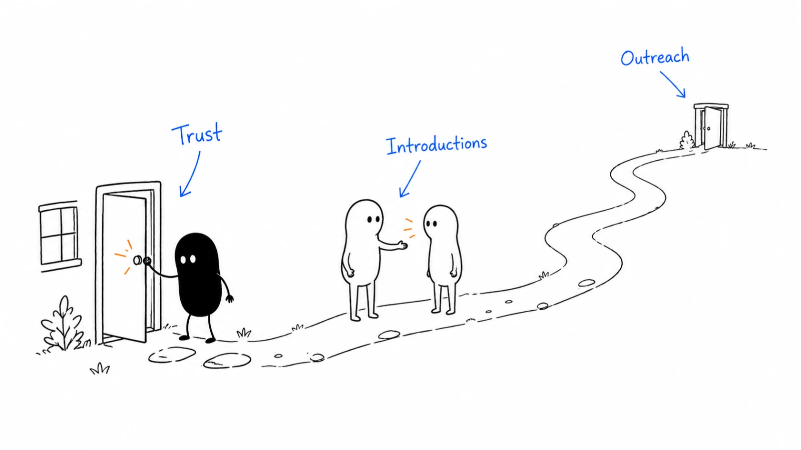

**Last reviewed:** 2026-09-07 · **Reading edit:** 2026-09-07

You have a product people can try. You can describe who it is for. A few people have said it looks interesting.

Now you need someone to make room for it in an ordinary working week.

That is a different problem from collecting feedback. A customer has to choose your offer over another use of their money and time. Someone must arrange access, do the setup, attempt the task, and decide whether the result was worth the effort.

The first few customers make those steps visible. You learn which explanation earns a conversation, what the buyer needs before committing, where the product disappoints, and how much help you are really selling.

“First ten” is a useful way to keep the work concrete. It is not a scientific threshold, a promise that ten customers establish product-market fit, or a reason to turn away an eleventh conversation. The aim is to build a small base of genuine customers and understand how to serve more people like them.



Read in order for the full path, or jump to [outreach examples](#step-3-make-an-invitation-someone-can-answer), [the worked example](#how-a-filled-trust-map-reads), or [the weekly review](#weekly-hunt-card).

## Use this when

Use this when you have a specific offer to test with a provisional [ICP](icp.md), but acquiring and serving a customer is still unfamiliar work.

You may have no paying customers, a handful of assisted pilots, or an audience that has not turned into purchases. The same method can help an established company introduce a genuinely new offer, although its existing reputation changes the starting conditions.

Expect to be involved personally, or to have someone on the founding team closely involved. Early conversations often change the offer itself. You want those lessons to reach the people who can act on them.

## Do not use this when

If you cannot describe the person, task, and proposed result, return to [idea discovery](idea-discovery.md). If the offer cannot yet be evaluated, use [idea validation](idea-validation.md) to design a smaller test.

You do not need a perfectly proven ICP before approaching anyone. Research and selling can develop together. Be explicit about whether you are asking for advice, offering an experiment, or selling something you can already deliver.

If customers already arrive, buy, and succeed through a reasonably repeatable process, your main question may be [channel strategy](../04-channels-and-distribution/channel-strategy.md) or scaling delivery. Do not keep describing a mature acquisition problem as “finding our first customers.”

## If you keep it extremely simple

Choose a small group of people who may have the same problem. Make an honest, specific invitation. Help the interested ones evaluate a bounded offer, ask for the appropriate commitment, and stay close enough to understand the result.

Then compare what happened. Why did one company proceed while another declined? Which parts of the experience could you offer again without reinventing the business?

That loop is more useful than opening five channels at once. You can expand the search when you know what you are trying to improve.

## Decide what you are counting

A company on a waitlist is not the same as a company using the product. A free user is not the same as a paying customer. A paying customer who never gets started is still a commercial fact, but not evidence of successful adoption.

Keep the distinctions visible rather than choosing whichever definition produces the largest number.

| Status | What happened | What is still unproven |
|---|---|---|
| Research participant | Shared information about the work | Willingness to try or buy |
| Interested prospect | Asked about the offer or agreed to a next step | Actual commitment |
| Free evaluator | Tried a defined version without paying | Willingness to pay |
| Paid pilot customer | Bought a bounded evaluation or initial project | Ongoing use or a larger purchase |
| Paying customer in use | Paid and is using the offer for the intended job | Retention beyond the observed period |
| Returning or renewing customer | Made another relevant commitment | Repeatability across a larger market |

Count companies separately from seats, and explain when several teams belong to the same buyer. Five users in one department do not become five independent customer decisions.

Keep commercial records accurate when someone leaves. Do not erase churned accounts from the historical count to improve the story. Report active customers, former customers, pilots, and refunds separately where relevant.

For a subscription product, continued use and renewal matter. For a one-off service, completion and a worthwhile result may be the appropriate first evidence; repeat purchases depend on whether the need actually recurs. “In production” is not a useful universal definition for every B2B business.

<a id="operating-method"></a>

## How to do it

<a id="step-1-start-with-the-people-who-already-trust-you"></a>

### Step 1: choose a first result you can deliver

Start from your [wedge](wedge.md). Describe one job for one plausible type of customer, including what they need to provide and what you will not do.

“An AI platform for operations” leaves the buyer to invent the use case. “Prepare one supported type of correction request so an engineer can review it with fewer avoidable clarification questions” gives both sides something to inspect.

The second promise still needs evidence. It also has a boundary: preparing a request is not executing a production change. Keep the boundary visible in outreach, the demo, and the offer.

Write down the minimum customer conditions. In this example, the task must recur, the current preparation process must have a meaningful gap, and a reviewer must be available. The customer must also be able to use an acceptable data-handling arrangement.

A famous logo that cannot meet those conditions may be a poor first customer. A smaller team with a real problem and a workable setup may teach you much more.

<a id="step-2-go-cold-but-get-more-targeted-if-it-is-not-working"></a>

### Step 2: build a short list with reasons, not just names

Choose a batch you can research and follow through personally. If you can only support two evaluations, a huge prospect list will not fix the delivery constraint.

For each account, record why it might fit, how you learned about it, what remains unknown, and a reasonable route to a conversation. A job posting or a public discussion can suggest relevant work. It does not prove that the company has your exact problem or budget.

You might begin with a dozen candidates because that is manageable this week. That is a planning choice, not a required sample size or a prediction of how many will buy.

Use separate columns for **possible fit** and **existing relationship**. They answer different questions. Someone may trust you but have no use for the offer; someone else may fit well and never have heard of you.

#### People who already know your work

Former colleagues, customers from an unrelated role, and professional acquaintances may be willing to hear what you are building. Ask whether the problem exists in their current context, not whether they will help you reach a milestone.

Give them an easy way to decline. Do not treat a friendship as an obligation to buy, or a favorable comment as independent demand evidence.

A warm customer can still provide valuable evidence. Record the relationship, the actual usage, the terms, and the reason for buying. Later, compare that experience with accounts that did not begin with personal trust.

<a id="step-3-mine-investor-and-accelerator-networks-yourself"></a>

#### Introductions and professional networks

Make an introduction request easy to assess. Describe the work you help with, the type of team, and the question you want to explore. Provide a short note the introducer can forward after checking with the recipient.

An investor, accelerator, former manager, or industry association may help you reach suitable people. None is a prerequisite for getting started.

Use directories and communities according to their rules. Membership is not permission to export private contact lists or solicit everyone. An introduction is also not evidence that the recipient needs the product.

#### People you do not know yet

Cold outreach can test whether the problem and offer make sense without a personal relationship. Start with account-specific reasons for contact and a modest request.

Research enough to avoid an obvious mismatch. You do not need to manufacture a personalized compliment or pretend to have read someone's entire career history.

If responses are poor, check the assumptions separately: are you reaching the right role, describing a recognizable situation, offering a reasonable next step, and using a suitable contact route? Sending more of an unclear message may only make the result harder to interpret.

<a id="step-4-show-up-where-the-icp-already-isand-give-first"></a>

#### Communities where the work is discussed

Look for places where people describe the task, ask for help, or compare existing approaches. That could be a professional group, a small event, a specialist forum, or a local association rather than a large startup community.

Contribute something useful on its own: an explanation, a worked example, or help with a question you understand. Follow the community's promotion rules and disclose your connection when mentioning your product.

Do not treat participation as a transaction in which two helpful comments earn permission to pitch. If someone shows relevant interest, ask whether a separate conversation would be useful.

### Step 3: make an invitation someone can answer

An early message should explain why you are contacting this person, what you are exploring or offering, and what you want them to do next.

Avoid asking someone to “pick your brain” when you intend to run a sales demo. Research is a reasonable request when it is genuinely research. A commercial invitation can also be reasonable when it is clear.

Here is an illustrative note to a former colleague. Replace the background with something true:

```text
Hi [name] — we used to work together on [actual shared context].

I'm testing a small service that prepares correction requests
for engineering review. It does not execute the changes.

I don't know whether this is a problem for your current team.
Do requests still come back because information is missing,
or is your existing process working well?

If it is relevant, I can send a short example. No need to try
the service just to help me out.
```

For a person you do not know, the opening needs an honest basis. A public description of the workflow may be enough, as long as you do not turn it into a claim about their private problems:

```text
Hi [name] — your team's public [post/job description] mentions
[the specific workflow it actually describes].

I'm building a service that prepares [supported request type]
for engineering review. I wondered whether preparation causes
extra back-and-forth on your team, or whether that is already
handled well.

Would a short example be useful? It shows the input, the
prepared packet, and what the engineer still has to check.

If this is not relevant, let me know and I won't follow up.
```

These are examples of tone and structure, not a complete compliance template or a guaranteed response formula. Check the rules that apply to your channel and recipients before running outreach.

A clear refusal ends the outreach. For silence, a short follow-up can be reasonable if the context and channel permit it. Add something useful or close the loop; do not invent deadlines, imply a prior relationship, or keep nudging indefinitely.

When someone replies, respond to their answer. If they ask for an example, send the example. Requiring a meeting before answering a simple question can create unnecessary work for both sides.

### Step 4: use the first conversation to choose a next step

A productive first conversation can end with a decision not to proceed. That is better than a friendly demo followed by an evaluation nobody needs.

Begin with a recent instance of the work. Ask how the task started, what the person did, who else became involved, and what happened when something went wrong. Clarify what the existing approach already does well.

Then show the part of the offer that relates to what you heard. You do not need to tour every feature. Ask the person to explain where the example would fit and where it would fail.

End with one of a few clear outcomes:

- The problem is not important enough: stop or agree an appropriate future check-in.
- The workflow is relevant but a key fact is unknown: investigate that fact.
- The offer is plausible and can be evaluated: agree the smallest useful evaluation.
- The buyer is ready for a clear, deliverable purchase: discuss the offer without inventing an unnecessary pilot.

Before arranging an evaluation, confirm who needs to approve it. The [buying committee](buying-committee.md) guide explains why interest, data-use permission, spending authority, and signing authority are different things.

### Step 5: make the first commercial offer understandable

An early buyer is taking a chance on a small supplier. Make the commitment easy to understand: the result, scope, inputs, responsibilities, timing, price, and what happens if the work does not proceed as expected.

A paid pilot can be appropriate when both sides need a bounded evaluation. It is not automatically better than a free trial, and neither should be the default for every offer.

A low-friction, self-serve tool may not need a negotiated pilot. A complex workflow may need an agreed test before a wider commitment. Choose based on the uncertainty and the cost of evaluating it.

Discuss money before providing weeks of customized work. “If this comparison shows a useful improvement, what would you need to decide whether to buy?” opens a commercial conversation without pretending the improvement is already established.

A discount can reduce the initial commitment, but it also changes what you learn. Record the standard offer, the actual terms, and what the concession covers. A heavily assisted, discounted customer has not validated an unassisted offer at a higher price.

Be especially careful with “design partner.” Define what the customer receives and what participation involves. Feedback access is not an unlimited claim on your roadmap, and a design-partner agreement is not automatically recurring revenue.

### Step 6: help them reach the first useful result

The sale does not finish the learning. Stay close enough to see whether the customer can do the intended job and whether the result survives ordinary working conditions.

Agree who will provide inputs, handle setup, review the output, and resolve exceptions. If you are doing work manually, say so. Record the time and judgment involved so you can distinguish product capability from founder assistance.

Do not remove controls to make onboarding look effortless. Use appropriate permissions, approved data, and the customer's agreed process. A demo that works only because you took access the product should not have is not a successful implementation.

Once the first result arrives, ask the customer to compare it with the alternative. What became easier? What new work appeared? What would make them use it again?

Then arrange the appropriate next decision. That may be another task, a subscription, a broader evaluation, or stopping. Continued free work without a decision can hide a lack of willingness to buy.

<a id="step-5-publish-then-see-who-raises-a-hand"></a>

## Content can start a conversation before you have an audience

You do not need to become a full-time creator before finding customers. One useful piece can help a specific person understand the problem or evaluate your approach.

For the request-preparation offer, that might be an annotated example showing a request before and after preparation, with the remaining reviewer work made explicit. It could also be a short explanation of why requests get returned and when a better form is enough.

Share it where the topic is welcome, or send it in response to an interested prospect. Include an appropriate next step: inspect a sample, ask a question, or evaluate the offer.

Measure what happens after reading. A relevant reply or a customer using the example is different from impressions. Keep the piece useful even for readers who do not buy.

Content that helps an internal decision is useful early, too. You do not have to wait for a mature marketing team to create the [decision brief](buying-committee.md#help-your-contact-explain-the-decision) your first buyer needs.

<a id="step-6-treat-press-as-a-lottery-ticket-not-a-plan"></a>
<a id="step-7-sometimes-you-just-ship"></a>

## A launch can help, but prepare the next day

A public launch can put a usable product in front of suitable people. It is not inherently wrong to launch before ten customers, and publicity is not proof that customers will stay.

Choose a venue whose audience can evaluate the offer. Prepare an explanation, a working path to try it, and a way to respond when someone gets stuck. If you have limited support capacity, make that visible rather than accepting commitments you cannot serve.

Think about the day after the launch. Who will review the inquiries? How will suitable accounts get started? How will you separate curiosity from intended use? What will you do with a report that the product failed?

**Segment provides a useful historical example.** In a September 6, 2018 founder interview, Peter Reinhardt described launching the analytics.js library on Hacker News and attracting early customers largely from small companies whose founders wanted better application instrumentation. He also described why a hosted version was useful: changing destinations with the library required rebuilding and redeploying. The reported result was a relevant early audience and demand for the hosted experience, not simply attention on a launch post. [Y Combinator's interview with Peter Reinhardt](https://www.ycombinator.com/blog/peter-reinhardt-on-finding-product-market-fit-at-segment?ref=b2b-playbook).

That retrospective does not establish the payment status or retention of each first user, or show that the same channel would work for a different buyer. The practical lesson here is to connect distribution with a usable next step and pay attention to what adoption requires.

## Free adoption and paid demand are different questions

Free access can help you learn, especially when the user can try the product with little coordination. It can also attract people who value the offer only at a zero price.

Neither outcome is inherently bad. The important question is whether your learning matches the business you intend to build.

**PostHog's founder described both sides of this transition.** In his June 20, 2024 retrospective, James Hawkins wrote that early sales came from conversations with existing users and from a pricing page that listed paid features and offered a booking link. Both worked, but he reported that new users arriving through the pricing page were easier to sell to than the existing community. The team iterated toward public pricing and self-serve payment. The account also reports reaching 1,000 users in May 2020; that is a user milestone, not a claim of 1,000 paying customers. [PostHog: How we got our first 1,000 users](https://newsletter.posthog.com/p/how-we-got-our-first-1000-users?ref=b2b-playbook).

This is one founder's retrospective, not a controlled comparison of pricing strategies. It illustrates why free usage, commercial interest, and payment should remain distinct in your own notes.

If you begin free, define what you are learning and when you will discuss the paid offer. Do not surprise users by treating informal feedback as agreement to become a customer.

## How a filled trust map reads

This is a **fictional continuation** of the record-correction example in the earlier chapters. The accounts, dialogue, and outcomes below are teaching examples, not Ivan's customer records or reported company results.

The founder's first offer prepares one supported request type for engineering review. It does not execute changes. Earlier assisted examples showed a possible preparation benefit, but missing information and an improved existing form remain important alternatives to investigate.

The founder starts with several different routes, without assuming that a warm account is good or a cold one is better.

| Candidate | How the conversation starts | What the founder needs to learn |
|---|---|---|
| Account A | A former colleague knows the operations lead | Is the preparation gap meaningful, and can the team evaluate it? |
| Account B | A permitted introduction from a professional contact | Does their existing internal tool already solve the task? |
| Account C | A reply to a public worked example | Is there a current project or only general interest? |
| Account D | A targeted conversation about the relevant workflow | Can the offer meet their deployment and data requirements? |
| Account E | A community member asks a related question | Is this recurring work or a one-off incident? |

The founder does not need five different products for five conversations. The comparison is useful precisely because the proposed first job stays reasonably consistent.

### A warm introduction is not a reason to skip discovery

**Operations lead at A:** “Our mutual contact said you are working on this. Happy to help.”

**Founder:** “Thank you. I would rather learn that the offer is unnecessary than have you try it as a favor. Could we look at the last request that needed clarification?”

**Operations lead:** “There was one last week. But the wait was partly because engineering was handling an incident.”

**Founder:** “Then we should separate preparation from reviewer availability. The service would not fix the incident queue.”

That distinction prevents a misleading promise. The founder investigates the part they can change instead of claiming responsibility for the entire delay.

After the bounded evaluation and approvals described in [Buying Committee](buying-committee.md), suppose Account A purchases a limited pilot and uses a later batch. This is the same illustrative paid-pilot situation used in the ICP chapter, not a claim that an annual subscription has been secured.

### A polite no can save a week of work

**Operations lead at B:** “We already have an internal form that checks the required fields.”

**Founder:** “Where does it still break down?”

**Operations lead:** “It mostly does not. We occasionally change the form, but that is manageable.”

**Founder:** “It sounds like this would add another tool without solving much for you. I will leave it there.”

There is no need to rescue the opportunity with a discount. Account B may resemble A by company size and job title while having a much better current alternative.

The founder records why the account declined. That information improves the next list: look for an unresolved preparation problem, not merely an operations team.

### A promising reply still needs a buying decision

**Contact at C:** “The example is useful. Could we test it sometime?”

**Founder:** “What would you want to compare, and when would someone be able to review the result?”

**Contact:** “Probably after our current migration. Nobody has time before that.”

**Founder:** “Would it be useful to revisit it after your migration review, or should I leave it with you?”

The account is not lost simply because it cannot act now. It is also not an active pilot. The founder records the agreed timing, if any, and does not reserve delivery capacity based on an indefinite possibility.

For Account D, the required deployment arrangement is beyond the current offer, so the founder declines that scope. For E, recurrence and fit remain unknown. Neither becomes an invented success to complete the story.

### What the founder can honestly say afterward

The result is one paid pilot account with later use that still needs assistance, one account well served by its existing tool, one interested account without current capacity, one unsupported requirement, and one unresolved research lead.

That is not five customers. It is a more useful understanding of where the first offer can work.

The next move is to find more accounts with A's relevant workflow conditions, improve the expensive parts of delivery, and see whether the offer works beyond the original relationship. It is not to declare the warm-introduction channel proven from one purchase.

## What to do when everyone likes it and nobody buys

First locate where progress stops. “People are interested” groups together several different problems.

| Where things stop | A question worth asking |
|---|---|
| Few relevant replies | Are the recipients suitable, and is the invitation understandable? |
| Good conversations, no evaluation | Is the problem important enough to justify the work? |
| Evaluation agreed, no start | Are inputs, ownership, permissions, and time actually available? |
| Product used, no purchase | Did it produce enough value, and was a paid decision ever discussed? |
| One payment, no continued use | Was the result repeatable, or did the customer buy an exceptional service? |

Ask for concrete feedback without bargaining against every answer. A buyer who says “too expensive” may be comparing you with a sufficient existing tool, facing a budget constraint, or politely declining. Clarify the context rather than assuming a lower price will solve it.

Silence has limits as evidence. You may never learn why someone did not reply. Record what you know, improve the next test, and avoid turning a guessed reason into an ICP rule.

Change one important part of the approach at a time where practical. If you change the audience, offer, price, and message together, you may get a different result without knowing why.

<Accordion title="What if I have no network, investors, or audience?">

Start with a task you understand and public places where suitable people discuss it. Build a small, researched list or contribute a useful example in a relevant community.

A direct, honest invitation can be enough to begin learning. Explain why the work appears relevant and offer a small next step. You do not need an invented introduction or an impressive customer list.

Keep the time horizon realistic. A low-trust start may take more effort, and poor response alone does not tell you whether the problem or the message is wrong. Use what you learn to improve the next small batch.

</Accordion>

<Accordion title="Should I build the feature a prospect says they need before buying?">

Find out which job the feature enables and whether the current offer can be evaluated without it. Ask what else would need to happen before purchase; a feature request is not a commitment.

Consider whether the capability fits your chosen direction, is useful to similar customers, and can be supported at the proposed price. If you accept custom work, describe it and price it as such rather than hiding it in a standard subscription.

You can choose to learn through a small custom project. Just keep its evidence separate from demand for a repeatable product, and do not promise delivery dates you cannot support.

</Accordion>

## The second purchase teaches you something new

After the first useful result, ask what the customer wants to do next and why. Do they want to repeat the same task, bring in a colleague, purchase a wider scope, or stop because the need is satisfied?

For recurring work, see whether the next use happens with less prompting and a realistic amount of help. For an occasional task, use the appropriate time horizon; lack of daily activity does not automatically mean abandonment.

Ask for a referral only when it makes sense. “Do you know another operations team with this preparation problem?” is clearer than “Can you introduce us to five founders?”

Make the introduction optional and provide a forwardable description. Obtain permission before using names, logos, quotes, or customer results publicly. Paying for the product does not mean the customer has agreed to appear in your marketing.

A second account that buys a similar offer under similar conditions is another piece of evidence. Keep observing support cost, outcome, and continued use instead of treating the referral itself as proof of repeatability.

## Learn what you can repeat before adding more activity

Review what stayed the same across your early customers: the task, reason to act, offer, buyer, required proof, setup, price, and support.

If the only common factor is that you personally rescued every implementation, focus on understanding the rescue work. Some assistance may be a sensible part of the business; some may reveal a product gap or an unsustainable promise.

Write a usable first sales process from what actually happened. Include the account conditions, sample outreach, questions, demo path, common concerns, offer boundaries, and first-result checklist. Keep it short enough for someone else to follow.

There is no universal customer count at which hiring a seller becomes correct. The important question is what work you are asking the person to do. Repeating an understood process is different from expecting a new hire to discover the market, redesign the product, and invent the pitch alone.

Likewise, you can test another channel before reaching ten customers if there is a reason. Define the question, effort, and capacity available. Avoid expanding activity simply because the current work feels uncomfortable.

## Copyable templates

### Trust map (copy)

Use this as a working account note. The relationship field helps interpret the evidence; it is not a ranking of someone's personal worth.

```text
ACCOUNT / TEAM:
PROPOSED JOB AND RESULT:
WHY THIS ACCOUNT MAY FIT:
EVIDENCE SOURCE AND DATE:
WHAT IS STILL UNKNOWN:

HOW WE CAN REACH THEM:
EXISTING RELATIONSHIP, IF ANY:
WHY THIS INVITATION IS RELEVANT:
NEXT ASK: research / example / evaluation / purchase

CURRENT STATUS:
WHAT THE CUSTOMER ACTUALLY AGREED TO:
SCOPE / PRICE / SPECIAL TERMS, IF DISCUSSED:
REQUIRED APPROVALS:
NEXT ACTION / OWNER / AGREED DATE:

FIRST RESULT, IF OBSERVED:
ASSISTANCE AND DELIVERY EFFORT:
PAYMENT / CONTINUED USE / REFUND STATUS:
REASON TO CONTINUE, PAUSE, OR STOP:
```

Keep filled customer records in your approved private system, not this public repository. The blank example does not require collecting personal information unrelated to the work.

### Weekly hunt card

Review a small set of actual accounts once a week. The schedule is a useful operating habit, not a promise of a seven-day sales cycle.

Write down:

1. **New evidence:** What did a suitable account say, do, use, or buy?
2. **Where progress stopped:** Was the issue fit, timing, clarity, approval, value, or delivery?
3. **Next commitments:** Which actions did customers agree to, and what do we owe them?
4. **Capacity:** How many evaluations and customers can we support responsibly?
5. **One adjustment:** What will we change in the next batch, and what result would inform the following decision?

Keep wins and inconvenient outcomes together. If one customer paid but needed extensive assistance, record both facts in the same review.

For a first week, a reasonable output may be a clear offer, a researched list, a few invitations, and better knowledge of the workflow. For another business it may be a purchase. Judge the work against the customer's process and the evidence obtained, not a borrowed timetable.

<a id="pre-flight-checklist"></a>

## Before you start

- [ ] The first offer describes a specific result and its boundaries.
- [ ] Each candidate has a reason for possible fit, with unknowns visible.
- [ ] The invitation accurately distinguishes research from selling.
- [ ] The customer has an easy way to decline or stop outreach.
- [ ] Evaluation, price, responsibilities, and approvals are discussed at the appropriate stage.
- [ ] We can support the commitments we are asking customers to make.
- [ ] Free users, paid pilots, active customers, and former customers remain distinguishable.

## Metrics

Track the path in your own context. Useful records include relevant conversations, evaluations that actually started, first results achieved, paying companies, later use, renewals where applicable, and delivery effort.

When calculating conversion, name the denominator and period. “Two purchases from six completed evaluations” is different from “two purchases from twenty people contacted.” Neither is a reliable benchmark for another business.

Separate source from proof of cause. A customer may read an article, receive an introduction, and then book a call. Record the known sequence instead of assigning the entire sale to whichever link was clicked last.

For a small early sample, short account explanations are often more informative than percentages. Review who bought, who did not, what changed, and how much work the result required.

## Common mistakes

**Treating ten as a finish line.** Ten unrelated custom projects may teach less about a repeatable offer than a smaller set of comparable customers.

**Using friendship as a substitute for fit.** Warm access helps you start; the workflow, purchase, and result still need to be real.

**Hiding the commercial conversation inside endless research.** Be clear when you are ready to make an offer and what it costs.

**Offering a free pilot with no decision at the end.** Define what will be evaluated and what happens afterward.

**Adding channels before fixing the first-result problem.** More interested people can make a delivery failure more expensive.

**Making every prospect the product manager.** Learn from requests, but make explicit choices about the business you are building.

**Waiting for a perfect self-serve flow before speaking to anyone.** Manual help can reveal what to build, provided it is disclosed and its cost is understood.

## What to read next

Use [buying committee](buying-committee.md) when interest is stuck inside an account, [pricing and packaging](../02-product-marketing/pricing-and-packaging.md) when the offer is hard to buy, and [sales enablement](../02-product-marketing/sales-enablement.md) when the explanation or materials need work.

For a targeted outbound approach, continue with [account research](../05-outbound-and-prospecting/account-research.md) and [cold email](../05-outbound-and-prospecting/cold-email.md). For evidence beyond early sales, read [product-market fit](product-market-fit.md). [Four Fits](four-fits.md) helps examine whether the product, market, channel, and business model work together.

## Sources and evidence boundary

This is an owner-maintained practical synthesis, not a guaranteed acquisition sequence or a statistical model. The account examples, messages, dialogues, and worksheets are original teaching material; they do not describe actual outreach or Ivan's customer outcomes.

Two dated primary accounts support the historical examples: Peter Reinhardt's [September 6, 2018 Y Combinator interview](https://www.ycombinator.com/blog/peter-reinhardt-on-finding-product-market-fit-at-segment?ref=b2b-playbook) and James Hawkins's [June 20, 2024 PostHog retrospective](https://newsletter.posthog.com/p/how-we-got-our-first-1000-users?ref=b2b-playbook). Both were checked on September 7, 2026. Reported adoption and founder interpretations are not audited causal evidence, and user counts are not relabeled as paying-customer counts.

For further reading, Lenny Rachitsky's [September 5, 2023 founder-interview collection](https://www.lennysnewsletter.com/p/how-to-win-your-first-10-b2b-customers?ref=b2b-playbook) informed the earlier edition's channel discussion. This revision uses its own acquisition-to-delivery structure and does not reproduce the collection's extended company anecdotes or subscriber-only material.

---

Copyright © 2026 Ivan Xu. All rights reserved. See the [copyright and reuse terms](../../LICENSE).

Canonical source: [github.com/weilun88313/B2B-Playbook](https://github.com/weilun88313/B2B-Playbook)
