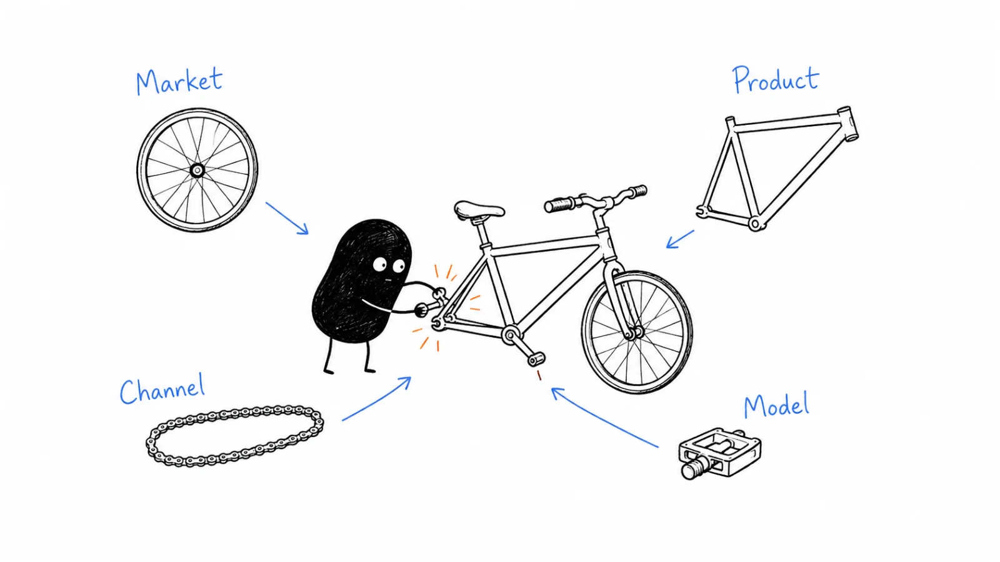

**Last reviewed:** 2026-09-07 · **Reading edit:** 2026-09-07

A customer likes the product. The pilot goes well. You decide to find more customers.

Then the new prospects need three calls instead of one. Their setup takes a week. A partner wants a commission. The price that felt reasonable during founder-led pilots no longer seems to cover the work.

You raise the price. Now buyers want a different approval process, more reassurance, and a larger commitment from your team.

What looked like a marketing problem has become a product, pricing, and delivery decision.

Four Fits is a way to examine those connections. It helps you ask whether the business works as a whole—not just whether one part looks promising.



Read in order, or jump to [the economics example](#calculate-the-path-from-attention-to-a-paying-customer), [the worked scenario](#worked-example-illustrative), or [the change-review card](#copy-a-change-review-card).

## Use this when

Use this before a change that could alter how customers find, evaluate, buy, or use the offer. Common examples include moving upmarket, adding a free plan, introducing a partner, changing the pricing unit, or offering a service alongside software.

It also helps when each team appears to be doing reasonable work but the overall result is disappointing. Marketing generates leads, sales closes some of them, and delivery serves the customers—yet the business still consumes more time and money than expected.

You can use it early. A hypothesis about the whole path can expose a costly assumption before you have enough customers to build a dashboard.

## Do not use this when

If the customer problem itself is unclear, return to [idea discovery](https://b2-b-playbook.mintlify.app/playbooks/01-strategy-and-buyers/idea-discovery) and [idea validation](https://b2-b-playbook.mintlify.app/playbooks/01-strategy-and-buyers/idea-validation). This framework does not prove demand because four sentences sound coherent.

If you need a channel execution plan or a pricing page, continue to [channel strategy](../04-channels-and-distribution/channel-strategy.md) or [pricing and packaging](../02-product-marketing/pricing-and-packaging.md). This article helps decide which assumptions those plans must address.

You do not need to declare [product-market fit](https://b2-b-playbook.mintlify.app/playbooks/01-strategy-and-buyers/product-market-fit) complete before considering distribution or economics. Investigate them together while distinguishing evidence from guesses.

<a id="words-you-will-use"></a>

## A few useful terms

Brian Balfour's [Four Fits framework](https://brianbalfour.com/four-fits-growth-framework?ref=b2b-playbook) connects four relationships: market–product, product–channel, channel–model, and model–market. His [September 25, 2025 update](https://blog.brianbalfour.com/p/the-four-fits-a-growth-framework?ref=b2b-playbook) revisits them in an AI context. The names and connected framing come from that work; the exercises and illustrative numbers below are this guide's application.

| Relationship | The practical question |
|---|---|
| Market–product | Does this offer solve a worthwhile problem for the intended customer? |
| Product–channel | Can someone arriving through this path understand, evaluate, and adopt it? |
| Channel–model | Can the value kept from customers support the cost of acquiring them? |
| Model–market | Do the payment model, buying conditions, and reachable market support the business you intend to build? |

The original series emphasizes venture-scale growth. Here, the exercise applies equally to a smaller company with a different ambition. Its revenue thresholds are not requirements for your business.

“Model” means more than the price on the website. It includes what is charged for, when payment occurs, what is included, the work required to deliver, and how the customer relationship might continue.

<a id="one-rule"></a>

## Keep this in mind

A promising change deserves a check of its consequences.

That does not mean you must redesign everything before trying a new channel. It means you should know what the test assumes about the rest of the experience.

A public tutorial may require little change to the product. A self-serve trial with real customer data may require substantial work on permissions, onboarding, limits, support, and payment.

Start with the smallest complete experience you can test responsibly. A channel experiment that attracts people to an unusable next step mostly tests their patience.

## Separate discovery, evaluation, purchase, and use

“LinkedIn works for us” is incomplete. Does it introduce the problem, generate inquiries, help buyers evaluate, or produce purchases that remain valuable after delivery?

A person might discover you through a founder's post, read a detailed comparison, try a sample, involve a manager, and purchase after a sales conversation. Each step has a different job.

The same distinction applies to events, communities, search, and partners. An event can create the introduction without being the entire sales process. A search page can answer a late-stage question rather than acquire a new visitor.

Map the path as the customer experiences it:

| Moment | What the customer needs | What you must make possible |
|---|---|---|
| Discovery | A reason to pay attention | A recognizable situation and honest promise |
| Evaluation | A way to judge whether the promise applies | A relevant example, trial, comparison, or conversation |
| Purchase | A commitment the organization can approve | Clear scope, terms, price, and responsibilities |
| First use | A workable route to the result | Inputs, permissions, setup, and support |
| Continued use | A reason to keep choosing the offer | Reliable value at acceptable effort and cost |

Now you can ask where the mismatch occurs. If people understand the product but cannot get approved data into it, more awareness may not solve the immediate problem.

Do not classify a channel as unsuitable solely because it cannot close a purchase on its own. Judge its contribution to the complete path and the cost of the work that follows.

## Product–channel fit is often an onboarding question

Consider two people interested in the same workflow.

One arrives through a colleague who explains the context and offers to help. Another arrives from search with no prior relationship. The first person can tolerate a missing explanation because someone fills the gap; the second may leave without understanding the offer.

If you want the second path to work, identify what the relationship previously supplied: trust, examples, setup assistance, a clear next step, or permission to ask a basic question.

You might need better documentation, a safe sample environment, a guided evaluation, or a brief sales conversation. “Make it self-serve” does not necessarily mean removing every human interaction.

Equally, an invitation feature does not automatically create a growth loop. Does collaboration make the job better? Who receives the invitation? Can that person participate usefully? Do permissions and the free/paid boundary allow the workflow to happen?

Avoid adding sharing only to acquire users. A private operations task may have no useful reason to be shared outside the account.

### A real hybrid: Slack's self-service and direct sales

Slack's April 26, 2019 S-1 described a web-based self-service approach alongside direct sales and customer success. Sales could build on existing adoption within organizations and pursue larger deployments. The filing reported more than 88,000 paid customers as of January 31, 2019. [Slack's 2019 registration statement](https://www.sec.gov/Archives/edgar/data/1764925/000162828019004786/slacks-1.htm?ref=b2b-playbook).

The important distinction is that self-service adoption and a sales-assisted organizational purchase could serve different parts of the journey. They were not mutually exclusive identities.

The filing does not show that this combination caused all reported growth, that it was profitable for every segment, or that a small startup should copy Slack's staffing. It is a historical example of a mixed approach, not a current recommendation about Slack or a universal sales model.

## Calculate the path from attention to a paying customer

A cheap click can lead to an expensive customer. A costly event can lead to a worthwhile customer. Neither conclusion can be reached from the top-of-funnel cost alone.

Begin with the actual work: research, content or campaigns, outreach, calls, evaluation support, commercial review, and the attempts that do not lead to a sale.

Then separate acquisition from delivery. Setup, recurring support, infrastructure, model usage, and exception handling can consume the revenue you expected to use to recover acquisition cost.

Keep the units consistent. Cost per qualified conversation is not customer acquisition cost. Annual contract value is not monthly contribution. Revenue is not profit.

### An illustrative customer economics calculation

The following is an invented planning example, not a benchmark or a description of the workflow customer's actual pricing.

Suppose a defined acquisition effort costs **&#36;12,600** and produces **10 new paying accounts** over an appropriate observation period. The cost includes the assigned labor, tools, and unsuccessful attempts for that effort. Estimated acquisition cost is **&#36;1,260 per account**.

Each account then needs seven hours of setup at an assigned labor cost of &#36;60 per hour: **&#36;420**. Setup is separate here, so it is not counted twice.

Assume an account pays &#36;300 per month and requires &#36;90 per month in recurring delivery costs.

| Item | Amount per account |
|---|---:|
| Acquisition cost | &#36;1,260 |
| Initial setup cost | &#36;420 |
| Monthly revenue | &#36;300 |
| Monthly recurring delivery cost | &#36;90 |
| Monthly contribution before acquisition recovery and fixed overhead | &#36;210 |
| Acquisition plus setup to recover | &#36;1,680 |

At a constant &#36;210 contribution per month, the simple economic payback is **eight months**: &#36;1,680 divided by &#36;210.

If the account stays only six months, it contributes &#36;1,260 and leaves **&#36;420 unrecovered**, before fixed overhead. That is why observed retention matters to a model that looks attractive on a single invoice.

Now suppose support is heavier than expected, increasing recurring delivery cost to &#36;180. Contribution falls to &#36;120, and the same acquisition-plus-setup amount takes **fourteen months** to recover.

You have not changed the channel or the price. A delivery assumption changed the apparent affordability of acquisition.

These simplified calculations assume constant revenue and costs, no expansion, and no further adjustments. They are not a lifetime-value forecast or a statement of company profitability. Cash timing can differ from economic payback, especially when labor is estimated rather than newly paid, invoices are delayed, or customers pay annually upfront.

### Avoid making the denominator do the work

Match acquisition costs with the customers that the effort could reasonably have produced. This month's spending divided by this month's wins may be misleading if the wins came from work started months earlier.

Include losses and unsuccessful attempts in the relevant scope. Counting only the hours spent on closed deals underestimates the work required to win them.

Document allocation choices for shared content, brand work, and employees who do several jobs. You will not always have a perfect attribution model, but you can avoid presenting a rough allocation as an exact fact.

For a small sample, show the range across accounts. One fast referral and one long security review should not disappear into an average that nobody recognizes.

### Keep the return assumptions honest

Do not solve an expensive channel by assuming that every account will expand next year. Expansion belongs in a scenario until you have evidence for it.

Do not solve an expensive product by setting the price to the number your spreadsheet needs. Test whether the market accepts that price for a clearly defined offer.

A useful model shows which assumption changes the decision. If one additional support call makes the offer unattractive, investigate support and scope before increasing acquisition volume.

## Model–market fit starts with the customer's buying conditions

A pricing unit can make commercial sense on your side and still be difficult for the customer to use.

Per-seat pricing may be understandable when people receive individual access. But if only a few people operate a product while many need occasional visibility, charging every observer can discourage the workflow you want to support.

Usage pricing can follow consumption, but buyers may need limits, forecasts, or approval rules. Outcome pricing requires an agreed definition of the outcome, how it is verified, and what happens when the result is disputed.

A project fee can suit a bounded job. A subscription can suit recurring access or service. Neither becomes appropriate merely because comparable software companies use it.

Ask the buyer to explain how they would budget for the offer. Who owns the expense? Is the amount predictable enough? Which commitment needs approval? What work must happen before the organization can use it?

### A documented packaging change: HubSpot

In a January 30, 2024 announcement, HubSpot described a seat-based pricing change scheduled for March 2024, including removal of Sales Hub and Service Hub seat minimums and the introduction of Core and View-Only seats. The announcement distinguished editing access from free viewing access in paid portals. [HubSpot's pricing announcement](https://ir.hubspot.com/news-releases/news-release-details/upcoming-changes-hubspots-pricing?ref=b2b-playbook).

This is a documented packaging proposal with a stated rollout date, not evidence here that the changes improved conversion or retention. It illustrates how pricing can define who participates and what they can do. Consult current terms for today's product; the example describes the 2024 announcement.

For your own offer, investigate whether the paid boundary makes the intended workflow easier to buy or creates a new obstacle.

## Market size is a set of assumptions, not a rescue number

A directory of two thousand companies does not establish two thousand buyers. Some will lack the problem, prefer an existing tool, need an unsupported deployment, or never be reachable through your chosen path.

Build the estimate from the relevant conditions. Separate the possible market, the part you can currently serve, and the customers you could realistically reach and support over the planning period.

Capacity matters alongside demand. If you can onboard only five accounts per month, a forecast that assumes fifty monthly starts needs a different delivery plan. A larger market estimate does not supply that capacity.

Use scenarios instead of hiding uncertainty in one percentage. Explain what would have to be true for the lower and higher cases: suitable account count, reachable demand, purchase rate, price, retention, and delivery capacity.

Match the conclusion to your ambition. A focused business can be attractive without supporting venture-scale growth. Conversely, a useful niche product does not automatically justify the much larger opportunity in a fundraising narrative.

<a id="operating-method"></a>

## How to do it

<a id="step-1-write-four-sentences-not-a-strategy-deck"></a>

### Step 1: describe the current business before the proposed one

Choose one customer group and one offer. Write how people currently arrive, what they buy, what the company does for them, and what happens after the first result.

Use actual examples where available. Label assumptions when the offer is new. Do not mix the economics of a hypothetical enterprise plan with the onboarding effort of today's small-team product.

The [existing four-fits working file](../../templates/four-fits.md) is a compact starting point. Treat its price-versus-path-cost fields as prompts: add delivery costs, retention, and time units before drawing an economic conclusion. Its sales-model warnings are questions to investigate, not fixed price bands that forbid a channel.

<a id="step-2-refuse-the-silo"></a>

### Step 2: choose the proposed change and trace its consequences

Name the action: add a guided trial, charge by completed job, introduce a partner, or sell to a larger account type.

Ask what the change affects before and after purchase. A partner may bring trust while adding commission and coordination. A free plan may simplify evaluation while increasing usage costs. A higher price may support assistance while requiring a stronger business case.

Include the people who own those consequences. A small team can do this in one conversation; a larger team may need product, marketing, sales, finance, and delivery input. The useful output is a shared set of assumptions, not a meeting in which every function presents a separate plan.

<a id="step-3-plot-the-danger-zone"></a>

### Step 3: identify the assumption that could reverse the decision

Calculate the proposed path under a plausible range. Which input changes the conclusion most: purchase rate, price, support effort, customer duration, or the number of suitable opportunities?

Choose a test that can inform that input. If buyers will not pay for the proposed scope, a more precise acquisition forecast will not settle the issue.

Use observed ranges when possible. If you have only one customer, state that limitation. Do not borrow a conversion rate from an unrelated product to turn an uncertain plan into a confident forecast.

### Step 4: test a complete but bounded experience

A complete test connects arrival, evaluation, purchase, and first value at the scope you can responsibly support.

For a partner route, that may mean a small set of permitted introductions, an agreed explanation of the offer, clear responsibilities, and a review of both conversion and delivery effort.

For a self-serve route, it may mean a limited sample environment with an understandable next step. It does not require opening unrestricted access or promising support you cannot provide.

Agree the limits, observation period, success criteria, and reasons to stop. The result can be “the partner finds suitable accounts, but the handover is too costly in its current form.” That is more useful than calling the channel a success because it generated meetings.

<a id="step-5-one-change-then-re-check-the-other-three"></a>

### Step 5: review the whole result before expanding

Compare the expected experience with what actually happened. Did the same people who expressed interest buy? Did the product deliver the advertised result? How much assistance was required? What did you learn about the next purchase?

Keep the costs of the experiment separate from estimates for a repeatable version. Early setup work may not recur for every account, while a difficult exception may recur more often than you hoped. Explain the distinction.

Choose whether to continue, revise, or stop the proposed change. You can make a limited investment without declaring every fit proven.

<a id="teaching-fill-inventednot-a-customer"></a>

## Worked example (illustrative)

This continues the **fictional request-preparation scenario** from the earlier chapters. The people, proposed offers, and conversations are invented; they are not Ivan's customer data or a reported company case.

Account A bought a bounded assisted pilot and used a later batch. The work prepares one supported type of correction request for engineering review. It does not execute production changes.

The [PMF review](https://b2-b-playbook.mintlify.app/playbooks/01-strategy-and-buyers/product-market-fit) revealed an important detail: the customer valued the founder's help gathering missing information, not only the packet software. Another account already had an adequate form, and an enterprise prospect required an unsupported deployment arrangement.

The founder is considering three routes:

| Route | What the customer would receive | Main uncertainty |
|---|---|---|
| Defined assisted offer | Preparation plus a specified amount of follow-up | Can the team deliver comparable value at acceptable effort and price? |
| Smaller self-serve product | Software that helps the operator prepare the packet | Does it remain valuable when the customer does the follow-up? |
| Enterprise offer | A broader arrangement with additional controls and implementation | Is there enough suitable demand to justify capabilities not yet available? |

These are not three different landing pages for the same business. They could involve different work, buyer expectations, price structures, and ways of selling.

### Conversation 1: a successful service is not automatically a self-serve product

**Founder:** “We want to let teams start without a call. What would you need to do the next batch yourselves?”

**Operations lead:** “We can enter the requests. We would still need to get the missing information from the other department.”

**Founder:** “Would the packet software alone justify another tool?”

**Operations lead:** “Possibly for some requests. Not necessarily on the terms of the assisted pilot.”

The founder has a product–channel question and a model question. Removing the call does not remove the work. Someone must still perform it.

A reasonable next test is an agreed, limited evaluation of the smaller offer. The customer should know what assistance is included, what changes, and what decision the test supports.

The founder should not count the original assisted pilot as proof that this new self-serve version will retain customers. Nor should they remove promised help from the existing customer without agreement.

### Conversation 2: a partner can improve access and complicate delivery

An operations consultant offers to introduce similar teams.

**Consultant:** “I could include your service in the process work I do with clients.”

**Founder:** “Who would identify suitable requests and handle missing information?”

**Consultant:** “My team could do the initial preparation. We would need clear boundaries, training, and an agreed commercial arrangement.”

**Founder:** “Then we should test the handover as well as the introductions.”

The partner might supply relevant access and some of the work that made direct delivery expensive. It might also introduce training, revenue share, support, and disagreements about ownership.

The founder records the proposed division of work: who sells, contracts, prepares inputs, supports the account, and handles exceptions. Client permission and confidentiality still apply; the partner's involvement does not authorize unrestricted data sharing.

The first pilot should show whether the whole arrangement works. A partner who generates many introductions but sends unsuitable or unprepared accounts may increase workload without improving the business.

### Conversation 3: a larger contract asks for a different promise

**Enterprise prospect:** “We would consider a larger agreement if it ran in our required environment.”

**Founder:** “That deployment option is not part of the current product. What evaluation and rollout would you need if we offered it?”

**Enterprise prospect:** “A technical review, a supported implementation plan, and someone responsible for ongoing operations.”

**Founder:** “We need to assess that as a separate offer. I cannot promise it based on the existing pilot.”

A larger price does not by itself make the enterprise route attractive. The founder must account for building and maintaining the deployment, longer evaluation, support obligations, and the number of other suitable buyers.

The inquiry is evidence of interest under stated conditions, not a signed commitment. It does not justify assigning enterprise revenue to the current product's forecast.

### What the founder should do next

The nearest evidence concerns the assisted offer. The founder can make its boundaries clearer, record delivery effort, and test it with another suitable account.

The consultant route may deserve a small test if responsibilities and terms can be agreed. The self-serve version needs its own value test. The enterprise version remains a separate investment decision with important unknowns.

This is not a rule that the founder must always choose the smallest option. It is a way to compare options using the work and evidence each actually requires.

## Moving upmarket changes more than the sales conversation

Larger customers may need different administration, deployment, purchasing, accessibility, integration, or support arrangements. Do not assume every large account has the same requirements, but investigate the ones relevant to your offer.

Ask which are required before evaluation, which before purchase, and which before rollout. A useful pilot that cannot become an acceptable production arrangement can leave both sides with an expensive dead end.

Keep the product promise, price, and delivery capacity consistent. If a proposal includes implementation help and ongoing support, those commitments must appear in the model, not only in a salesperson's notes.

Moving downmarket has a corresponding challenge. A lower price may require simpler setup and less coordination, but smaller customers are not automatically cheap to support. Test what the actual customer can do independently.

You can serve more than one segment. Make the distinctions explicit enough that the team knows which offer, path, and service level apply, and does not subsidize one group unintentionally through promises made to another.

## A free plan needs a job and a budget

Free access can let people experience value, support collaboration, or build a relevant audience. Define which purpose matters to your business.

Then ask what turns that experience into a sustainable relationship. Who becomes a paying customer, what changes for them, and why would they pay rather than remain on the free offer?

Measure the cost of serving people who do not convert, including support and variable infrastructure. A free plan is not free distribution if the business pays substantially for every attempt.

Limits should be understandable and aligned with the offer. Do not hide essential conditions until a user has invested time or use arbitrary obstacles to manufacture a reason to upgrade.

If sharing or invitations matter, check the whole workflow. A colleague needs a useful role, appropriate access, and a clear distinction between participation and purchasing authority. An invitation is not permission to market to an entire company.

<Accordion title="Can a lower-priced product use sales assistance?">

Yes, if the complete economics and customer experience support it. Assistance might be brief, shared across many accounts, partner-delivered, or reserved for cases where it changes adoption meaningfully.

Measure the work and outcomes. A short call that prevents recurring support may be worthwhile; a long bespoke evaluation may not be. There is no universal annual price that answers the question.

Keep the supported service level clear. Do not promise every low-priced account the same attention you provided during an exceptional early pilot.

</Accordion>

<Accordion title="Can a high-priced product use social content or a community?">

Yes. Those paths may create awareness, trust, or a useful introduction while evaluation and purchasing happen elsewhere.

Ask whether the audience is relevant and whether the contribution to the full path justifies the effort. A large number of views does not establish qualified demand, and a small audience is not necessarily a failure if it reaches suitable buyers.

Do not force every touchpoint to close the sale by itself. Equally, do not use vague brand value to avoid examining whether the work helps the intended business.

</Accordion>

<a id="step-4-treat-ai-as-a-simultaneous-shock"></a>

## Recheck the offer when AI changes the work

An AI capability can change what the customer does, what you deliver, and what it costs. Investigate the actual change rather than assuming every AI feature requires a new business model.

If fewer people need to operate the workflow, per-seat revenue may behave differently. If the system performs more tasks, usage costs may rise. If it produces unreliable output, human review may consume the apparent efficiency gain.

Measure the cost per useful completed job, including failed attempts, checks, and exceptions. A cheaper model call is not necessarily a cheaper customer result.

Be precise about outcome-based charging. Define the billable outcome, who verifies it, what is outside your control, and how disputes or incomplete work are handled. A label such as “resolved” should not hide a disagreement between the product's event log and the customer's experience.

AI can also affect discovery, but do not declare your current channels obsolete without evidence from your audience. If buyers arrive through generated answers or a new platform, inspect what they need next and whether your material explains the offer accurately. [SEO and AEO](../04-channels-and-distribution/seo-and-aeo.md) addresses that channel work.

Revisit permissions and purchasing when a feature gains access or can take action. A buyer who approved a drafting tool has not automatically approved an agent that changes records in another system.

## Know what would make the arrangement fragile

A path can work today and still depend heavily on one source of access, one partner, one large account, or one founder's availability.

Name those dependencies. What happens if the platform raises costs, a partner changes priorities, the founder is unavailable, or a customer stops expanding?

You do not need to eliminate every dependency immediately. Decide which ones deserve a limit, a backup, better documentation, or another test.

Also examine whether today's apparently cheap acquisition uses an asset built elsewhere: the founder's reputation, years of content, an existing community, or a previous customer relationship. Those advantages are real, but a newly hired team may not reproduce them at the same cost.

Use the model to plan a transition rather than pretending the advantage does not exist or assuming it lasts indefinitely.

## Copy a change-review card

Use this alongside the [four-fits working file](../../templates/four-fits.md) when evaluating a particular change. Keep filled customer and financial records in your approved private system, not this public repository.

```text
REVIEW DATE:
CHANGE WE ARE CONSIDERING:
CUSTOMER GROUP / CURRENT OFFER:

CURRENT PATH
Discovery:
Evaluation:
Purchase:
First useful result:
Continued use:

WHAT THE CHANGE REQUIRES
Customer problem and buying conditions:
Product capabilities and permissions:
Acquisition and evaluation work:
Price, billing unit, and payment timing:
Setup, support, and ongoing delivery:

EVIDENCE
Observed facts / source / date:
Assumptions:
What differs from the current customer experience:
Assumption most likely to reverse the decision:

TEST
Smallest complete experience:
Participants and required approvals:
Owner / duration / effort limit:
What we will measure:
Continue / revise / stop conditions:
Existing commitments we must protect:
```

## Keep a simple economics note

Use consistent periods and units. The note is not a substitute for accounting; it makes the assumptions behind the growth decision inspectable.

```text
OFFER AND CUSTOMER GROUP:
PERIOD / COHORT:

Acquisition effort and costs included:
New paying accounts attributable within this scope:
Estimated acquisition cost per account:
Setup costs counted separately:
Recurring revenue per account per period:
Recurring delivery costs per account per period:
Contribution before fixed overhead:
Observed customer duration / evidence limits:
Cash collection timing:

Base case:
More support / slower sales / shorter retention case:
What must be tested before relying on the estimate:
```

If you cannot estimate an input yet, mark it unknown and choose how to learn it. An honest gap is more useful than a precise number inserted to make the model balance.

<a id="pre-flight-checklist"></a>

## Before you start

- [ ] The customer group and current offer are specific.
- [ ] Discovery, evaluation, purchase, and delivery are not being treated as one event.
- [ ] Costs include relevant failed attempts, setup, and recurring support without double-counting.
- [ ] Revenue, contribution, cash timing, and retention use consistent units.
- [ ] The proposed change has clear consequences and unresolved assumptions.
- [ ] The test fits the team's capacity and preserves existing customer commitments.
- [ ] The business ambition is explicit rather than borrowed from a famous company.

## Metrics

Choose measurements for the question you are testing, not a universal Four Fits score.

| Question | Useful evidence |
|---|---|
| Are the right people arriving? | Suitable accounts, reasons for fit, and source history |
| Can they evaluate? | Starts, completion, required assistance, and reasons for stopping |
| Can they buy? | Purchase decisions, scope, approval time, and actual terms |
| Does the result last? | Useful outcomes, repeat use, renewal, and customer feedback |
| Can this path support the offer? | Acquisition, setup, delivery cost, contribution, and observed duration |
| Can the arrangement expand responsibly? | Comparable-account results, capacity, concentration, and sensitivity to changes |

Look at differences between customer groups and paths. A blended average may hide a successful self-serve offer and an expensive custom service.

Separate channel attribution from a causal claim. A customer can encounter several touchpoints, and the last recorded source does not necessarily explain why they purchased.

## Common mistakes

**Treating product-market fit as permission to ignore economics.** Customers can receive value from an offer the supplier cannot sustain.

**Judging a channel by its cheapest event.** Clicks and meetings matter only in relation to the work and results that follow.

**Raising price only to repair a spreadsheet.** Test whether the customer accepts the new offer and what expectations the price changes.

**Using an enterprise inquiry as an enterprise strategy.** Investigate the full requirements and whether other suitable accounts exist.

**Assuming self-serve means no work.** Customers may need documentation, safe setup, support, and a coherent paid boundary.

**Forecasting expansion as if it already happened.** Keep future upside separate from observed contribution and retention.

**Making every change at once.** Some changes require coordinated adjustments, but keep the test focused enough to interpret the result.

## What to read next

Use [product-market fit](https://b2-b-playbook.mintlify.app/playbooks/01-strategy-and-buyers/product-market-fit) to examine customer-value evidence, [positioning](../02-product-marketing/positioning.md) to make the offer understandable, and [pricing and packaging](../02-product-marketing/pricing-and-packaging.md) to test the commercial structure.

Continue to [channel strategy](../04-channels-and-distribution/channel-strategy.md) when selecting and testing acquisition paths. Use [GTM planning](../09-operations-pipeline-and-measurement/gtm-planning.md) to connect the resulting assumptions with targets, resources, and capacity.

## Sources and evidence boundary

The four named relationships are attributed to Brian Balfour's [Four Fits series](https://brianbalfour.com/four-fits-growth-framework?ref=b2b-playbook) and [September 25, 2025 AI-era update](https://blog.brianbalfour.com/p/the-four-fits-a-growth-framework?ref=b2b-playbook), checked September 7, 2026. This guide does not reproduce the series' extended cases, diagrams, venture-scale thresholds, or proprietary course material.

The Slack example uses its [April 26, 2019 S-1](https://www.sec.gov/Archives/edgar/data/1764925/000162828019004786/slacks-1.htm?ref=b2b-playbook). Reported customer figures and the described sales approach are historical disclosures, not causal evidence or current product information.

The packaging example uses HubSpot's [January 30, 2024 announcement](https://ir.hubspot.com/news-releases/news-release-details/upcoming-changes-hubspots-pricing?ref=b2b-playbook). It reports announced changes and their intended rollout, not measured commercial results. Both company sources were checked September 7, 2026.

The workflow story, conversations, economic calculations, and review cards are original teaching examples. They are not actual customer records, validated benchmarks, or a forecast for Ivan's business.

---

Copyright © 2026 Ivan Xu. All rights reserved. See the [copyright and reuse terms](https://github.com/weilun88313/B2B-Playbook/blob/main/LICENSE).

Canonical source: [github.com/weilun88313/B2B-Playbook](https://github.com/weilun88313/B2B-Playbook)
