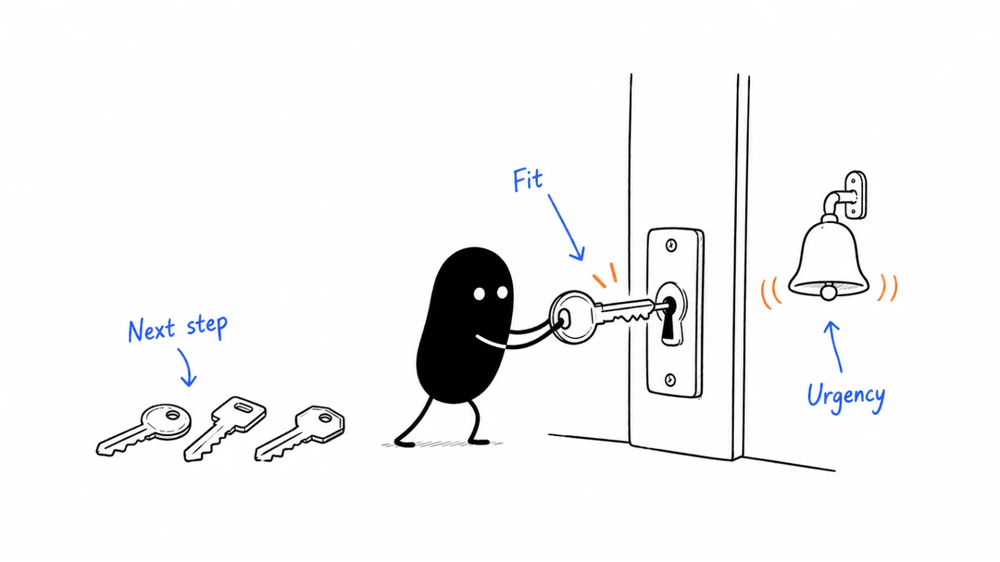

**Last reviewed:** 2026-09-07 · **Reading edit:** 2026-09-07

You have had encouraging conversations. Perhaps a team has finished a pilot, another wants a demo, and a larger company has sent a long list of requirements. All three could become customers. You do not have enough time to build three products or run three different sales motions.

Who gets your attention next?

An ideal customer profile helps you make that choice. It describes **the companies or teams for which your current offer is a good match, and the conditions that make it work.** It should explain why those customers benefit, what adopting the product requires, and whether you can serve them sustainably.

A headcount range is not enough. Neither is a portrait of an ambitious marketing manager. You need a working explanation you can test against actual accounts—and use when an attractive opportunity asks you to go in a different direction.



Start with the [10-minute field test](#10-minute-field-test) if you have an account to review. For the reasoning, read the full guide. The [five-account walkthrough](#compare-five-accounts-without-inventing-a-market) shows how the profile changes; the [ICP canvas](#icp-canvas) gives you a version to copy.

## Use this when

You have a candidate problem and some evidence from conversations, evaluations, or customers. You need to decide whom to investigate, approach, or serve next.

This is also useful when marketing attracts people sales cannot help, when every customer requests a different roadmap, or when your best customers have something in common that the current targeting misses.

You do not need a large customer base to begin. With little evidence, call it a provisional ICP and keep the next research questions beside it. A useful hypothesis is better than pretending you have already identified a proven segment.

## Do not use this when

If you cannot describe a person doing a specific job, begin with [idea discovery](https://b2-b-playbook.mintlify.app/playbooks/01-strategy-and-buyers/idea-discovery). If you have a candidate but do not know whether the offer produces a useful result or earns commitment, use [idea validation](https://b2-b-playbook.mintlify.app/playbooks/01-strategy-and-buyers/idea-validation) alongside this guide.

An ICP cannot prove a market exists, estimate demand from a list of company names, or substitute for permission to contact people. It also should not become a reason to abandon existing customers without considering your commitments to them.

## Separate the company, the people, and the next decision

Several different questions often end up inside one document called “ICP.” Keeping them distinct makes the result easier to use.

| Question | What answers it | Example |
|---|---|---|
| Which organizations can benefit from our offer? | ICP: company or team context, job, constraints. | Operations teams with recurring approval gaps in correction requests. |
| Who uses, supports, or approves the change? | User understanding and a buying-committee map. | An operator prepares the request; an engineer reviews it; a manager approves spend. |
| Why would this account act now? | Timing and a specific decision. | A scheduled process review with an owner who wants to evaluate alternatives. |
| How much attention should we give it? | Account priority and available capacity. | Research a missing fact, offer a pilot, or provide a self-serve path. |

These are related, but one answer cannot stand in for another. A senior title does not prove a budget. A deadline does not make an unsupported use case suitable. A company that fits well may have no reason to replace its current process this month.

For a self-serve product, the user and purchaser may be the same person. You still need the context: what work they do, why the product helps, what they can adopt, and whether the arrangement supports your business. You do not need to invent a six-person buying committee where none exists.

## 10-minute field test

Choose one account you are considering. Use information you already have, not a research sprint disguised as a quick exercise. Write down the job, current alternative, relevant operating conditions, timing, and any known limitation of your offer.

Beside each statement, add the source and date. Distinguish something the customer told you from a public signal or your interpretation. If the important fact is missing, write “unknown” and decide whether learning it is worth the effort.

At the end, choose one next action: investigate, offer a relevant evaluation, revisit at an agreed time, or decline this version of the work. Ten minutes is enough to expose gaps, not to certify an account.

### How a filled field test reads

**Fictional example:** an operations lead has asked about the request-preparation workflow used in the previous two guides.

- **Job:** prepare recurring correction requests for engineering review.
- **Current approach:** a request form, followed by clarification in chat.
- **Evidence:** the lead described a recent batch and offered a redacted walkthrough.
- **Timing:** a process review is planned; the evaluation date is not agreed.
- **Adoption:** the engineer who reviews requests has not yet joined.
- **Unknowns:** whether a better form is sufficient, who approves spend, and whether the proposed workflow can handle the exceptions.
- **Next action:** ask for a joint walkthrough with the reviewer before proposing a build.

This account is worth investigating. It is not “high intent” merely because someone replied, and missing budget information is not evidence that no budget exists.

<a id="full-operating-method"></a>

## The full process

### Step 1: compare accounts, not just your favorite customers

Start with the evidence you have: customers who got a useful result, people who tried and stopped, opportunities that stalled, and accounts you declined. Include the inconvenient examples. A list of happy customers alone cannot explain why the offer fails elsewhere.

For each account, record the job, prior approach, adoption effort, people involved, commercial terms, and observed result. The result might be repeat use, a purchase, a failed evaluation, or simply an unresolved conversation. Do not compress those into the same “interested” label.

Look beyond contract size. A large customer may pay well and require a service model you cannot repeat. A smaller customer may adopt quickly, get value, and need little support. Neither is automatically better; compare them against the business you are trying to build.

If you have no paying customers, use the discovery and validation notes without promoting them into sales evidence. A team that agreed to review a prototype has shown something useful, but not the same thing as a customer that renewed.

Also ask how the accounts reached you. If every conversation came through one founder community, shared geography or funding stage may reflect your access rather than product fit. You can start there while making that limitation visible.

<a id="step-2-define-four-observable-filters"></a>

### Step 2: find the conditions behind the result

Suppose the customers who progress are all software companies with around a hundred employees. Before using that range as a hard filter, ask what changes at that scale. Is there a dedicated operator? Enough recurring work? A system your product integrates with? Someone authorized to purchase without a long implementation project?

Those conditions may explain the result better than employee count. A smaller team can have the same workflow, while a much larger company may contain an independently managed team you can serve.

Write your hypothesis in ordinary language: “This works when the request recurs, the necessary approvals can be identified, and a reviewer is available.” Then ask which parts you can discover before outreach and which require a conversation.

Some attributes help you find candidates; others establish fit. A job posting can help you locate an operations function. It does not prove the team is struggling, has approved a software budget, or wants to replace its current tool.

Use a small number of meaningful filters. Every condition should either explain why the result is valuable, identify an adoption requirement, or describe a delivery constraint. If nobody can explain why a field matters, leave it out of the decision rule until you have a reason.

<a id="1-apply-disqualifiers"></a>
<a id="step-1-start-with-exclusions"></a>

### Step 3: distinguish an exclusion from an unanswered question

A hard exclusion means you know something that makes the current offer unsuitable. Perhaps the customer requires a deployment model you do not provide, needs a job outside the product's scope, or cannot use the integration the workflow depends on.

Record the reason and the evidence. “Requires on-premise deployment; confirmed by the technical reviewer” is actionable. “Enterprise is difficult” is an impression.

Do not manufacture five exclusions to complete a worksheet. A short list of genuine limits is more useful than rejecting accounts because they lack a familiar job title or because your first contact is junior.

There are other reasons not to pursue an account now. An adequate incumbent may leave no compelling reason to change. An evaluation may be blocked by another project. Those conditions can change; record the current decision and what would justify revisiting it.

Unknown is a separate state. Not knowing the buyer does not mean the company cannot buy. An expensive missing fact can still justify limiting research, but the honest reason is “not enough evidence to prioritize,” not “confirmed poor fit.”

<a id="step-3-map-the-buying-committee-separately"></a>

### Step 4: understand how this customer would adopt and buy

Find out how a similar change happened before. Who started it, who evaluated it, who supplied the data, and who approved the cost? You are trying to understand a process, not collect impressive names.

For the correction workflow, a supportive operations lead may still depend on engineering. The engineer may care about review quality rather than the convenience of the interface. A budget owner may prefer updating an existing form to buying another application. These are different questions to resolve.

Map the relevant people in the [buying-committee guide](https://b2-b-playbook.mintlify.app/playbooks/01-strategy-and-buyers/buying-committee). Keep that account-specific map separate from the reusable profile. The ICP might say a participating reviewer is necessary; it should not assume every company calls that person “VP Engineering.”

Consider the support you can provide, too. If adoption requires a lengthy migration or ongoing specialist work, include it in your assessment. A company can have a real need and still be a poor match for your current delivery model. Offering a smaller, explicit engagement may be possible; promising the full product before you can support it is a different decision.

<a id="step-4-pressure-test-the-rules"></a>

### Step 5: test the profile on accounts you have not used to write it

Apply the draft to a small set of additional accounts before judging their outcomes. Keep the original classification and date so that later results cannot quietly rewrite what you predicted.

For each apparent match, ask what you would need to learn next and what would contradict the fit. For each exclusion, look for a plausible counterexample. If you rejected a company only because it is slightly outside the headcount band, check whether the actual workflow differs.

Compare judgments with a colleague when possible. If one person calls an account a strong fit and another rejects it, discuss the evidence and definitions before averaging scores. “Uses an internal tool” can mean a working solution, an abandoned prototype, or a list of planned work.

With a small sample, the goal is to expose weak rules, not establish a precise win probability. Check that you gave accounts reasonably comparable offers and support. If the favored group got founder-led onboarding and the other group got an unattended demo, the difference may not come from the profile.

### Step 6: choose a focus and keep the exceptions visible

Finish with a current priority, not a catalogue of everyone you might serve. Name the customer context you will emphasize, why the evidence supports it, and which uncertainties still deserve a bounded test.

A good exception has an owner, a reason, a limit on effort, and a review point. You might investigate a larger company because it has the same job and can use the current product. That is different from letting its requested roadmap become an unannounced company strategy.

A declined opportunity can still be treated respectfully. Explain what the current offer can and cannot do. If appropriate, leave a clear condition for reconnecting. “Not our focus today” is a resource decision, not a judgment about the customer's business.

## Two company stories: what changed when the audience became clearer?

### PostHog: the profile shaped more than the prospect list

In its January 25, 2024 newsletter, PostHog described a focus on high-growth B2B startups with product-market fit and engineers making decisions. It connected that choice to engineering-oriented content, transparent usage-based pricing, and a developer-tool interface.

The team also reported that customers within its profile activated and retained better than those outside it. The article does not provide a controlled comparison or enough cohort detail to independently assess that difference. [PostHog company account, January 25, 2024](https://newsletter.posthog.com/p/defining-our-icp-is-the-most-important?ref=b2b-playbook).

**Our takeaway:** a profile should help explain product and distribution choices, not just a search filter. This is a historical description of PostHog's approach at that time, not a recommendation to copy its audience or an assertion about its current strategy.

### Superhuman: look for the benefit shared by a responsive group

Rahul Vohra's account describes segmenting Superhuman's early users by how disappointed they would be without the product, then studying the groups that valued it most. The team used that feedback to sharpen its customer focus and product priorities.

He reports a survey score of 33% after segmentation and 58% after three quarters of subsequent product work. Those figures are the company's reported survey results, not retention rates or a controlled estimate of the effect of targeting alone. [Superhuman founder account, company publication November 27, 2018](https://blog.superhuman.com/how-superhuman-built-an-engine-to-find-product-market-fit/?ref=b2b-playbook).

**Our takeaway:** investigate why a group benefits before turning its job titles into targeting rules. An individual-user pattern still needs an organizational buying context when you sell to teams. The survey thresholds in this story are not pass marks for your ICP.

## Compare five accounts without inventing a market

This is a **fictional continuation** of the [Idea validation pilot](https://b2-b-playbook.mintlify.app/playbooks/01-strategy-and-buyers/idea-validation#follow-one-hypothesis-through-a-pilot). The accounts, sizes, conversations, and outcomes below are invented. They are not Ivan's customer research or results from the companies above.

Suppose further evaluations have taken place. You still offer request preparation for engineering review—not autonomous database changes. You now have five account notes and want to decide which companies deserve the next round of research.

| Account | What happened | Question it raises |
|---|---|---|
| A: 90-person software company | Paid for a bounded pilot and used the workflow on a later batch; support was still needed. | Can it keep working with less help? |
| B: 130-person software company | Said its existing internal tool was adequate and declined. | What gap, if any, would justify switching? |
| C: 500-person software company | Saw a useful result but paused during another system project. | Is this a timing problem rather than a fit problem? |
| D: 1,500-person company | Requested deployment and data handling you cannot provide. | Is the current offer unsuitable despite the interest? |
| E: 30-person software company | Has the relevant operations role; no workflow observed yet. | Is there a need, or only a promising public signal? |

### The first shortcut: copy the size of the account that paid

Account A looks like the answer. You could declare the ICP to be software companies with 50–150 employees. Account B fits that description too, but does not need your approach. Account C may have the right work at a different scale. Account E may or may not share the problem.

The employee band is useful for building a search list. It is not yet an explanation of why A bought. You also do not know whether A will keep using the workflow without your assistance.

Return to the work. A had recurring requests, unresolved preparation steps, an available reviewer, and a reason to try an alternative. B had already handled those steps. The difference worth testing concerns the workflow gap and ability to adopt, not simply size.

### The second shortcut: treat a delayed purchase as rejection

Account C paused because another project took priority. That does not establish demand, but it also does not erase the useful evaluation. Ask what must finish, whether the need will remain afterward, and whether the customer wants a later review.

If there is no agreed next step, record the account as inactive rather than keeping a fictional close date. If there is a concrete revisit condition, preserve it. Your ICP can describe C as an apparent fit while your sales plan gives it little attention today.

Account D presents a different situation. Its requirements are outside the current offer. Another demo is unlikely to change that. You can record it as unsuitable for this version and reconsider only if your capabilities or its requirements change.

### The third shortcut: turn missing information into a negative score

You know less about E because you have not spoken to it. That is not evidence it has less need than A. It may deserve a small amount of research if the role and business context make it a plausible candidate.

The next question is modest: how are corrections handled today? You do not need to infer a budget from its funding news or write an email asserting it is overwhelmed. If the research is not worth your limited time, leave the account unassessed.

This is why “unknown” needs to survive the journey from a research note into the CRM. When enrichment software fills every field, the apparent completeness can hide how little you have actually learned.

### The revised profile is a hypothesis, not a victory

You might now prioritize software teams with recurring correction requests, a gap in request preparation that an existing template does not adequately solve, and an available engineering reviewer. The proposed workflow must also fit their data and deployment requirements.

That description is narrower in the way that matters: it predicts a reason to try the offer. It is not a proven segment. Only one account in the example has paid and repeated the workflow, with support still required.

Next, find other teams with those conditions and test the same bounded offer. Keep accounts with adequate alternatives in the comparison. If most candidates can solve the problem by improving a form, the right conclusion may be a service offering, a different product, or no further investment in this version.

## Turn the profile into a researchable list

You cannot search a database for “has an unresolved approval gap and will buy our workflow.” Split the work into a public candidate filter and private qualification.

The candidate filter uses observable information that plausibly relates to the job: business type, a relevant function, supported systems where disclosed, or a documented change. Its purpose is to decide where to investigate. It should not contain claims about internal pain that you have not verified.

Qualification adds what you learn from the account: the recent incident, current approach, consequence, adoption requirements, and decision process. Preserve which source supports each conclusion. A customer statement and an analyst's inference deserve different labels.

For example, an operations job posting might justify a question about how work is organized. It does not justify “Your team is struggling with manual corrections.” Good research makes the next conversation more relevant without pretending you already know the answer.

<Accordion title="Using AI or enrichment tools without inventing the customer">

Use tools to locate public sources, extract relevant statements, suggest candidates, and organize notes. Require a source and date for material claims, then check the source before using the claim in qualification or outreach.

Keep a separate field for interpretation. A model may infer likely software use, budget, or organizational structure; that does not make the information verified. If a source does not support a required field, leave it unknown.

A model can help find contradictions across notes, but it should not invent a buyer or silently turn a weak signal into high intent. Avoid sending confidential customer material to external services without appropriate permission.

Before expanding an automated list, inspect examples from both accepted and rejected accounts. Otherwise, an early assumption can be repeated across thousands of records without becoming more reliable.

</Accordion>

<a id="2-score-five-dimensions"></a>

## Use five evidence questions before adding a score

For each account, ask: **Does the job fit? Is there a meaningful gap in the current alternative? Can the account adopt our approach? Is the commercial arrangement plausible? Is there a reason to act now?**

Write a short answer and the missing evidence for each. These questions do not need equal weight. An unsupported deployment requirement cannot be canceled out by a famous logo and an enthusiastic contact.

If a numerical score helps your team prioritize, define its inputs, treatment of unknowns, and intended use before adopting it. Compare it with later outcomes and keep the underlying evidence visible. A score that mostly rewards complete public profiles will favor easy-to-research companies, not necessarily better customers.

A sum is not a purchase probability. Avoid universal cutoffs such as “seven points means qualified.” Use explicit hard constraints for genuine incompatibilities, separate missing evidence from negatives, and reserve the score for the decision it actually helps you make.

<a id="3-assign-the-default-action"></a>

## Assign the next action separately from the resource tier

First record the account's state. Then decide the attention you can justify.

| Account state | A reasonable next action |
|---|---|
| Apparent fit, with an active relevant decision | Offer a scoped next step and identify the participants needed. |
| Apparent fit, but no current decision | Provide useful material or revisit when an agreed condition changes. |
| Important fit evidence missing | Research one question, or leave unassessed if the effort is not justified. |
| Current offer cannot meet a confirmed requirement | Explain the limitation and stop active pursuit of that offer. |

For accounts that fit, T1/T2/T3 can describe resource allocation, consistent with the [ABM strategy guide](../06-account-field-and-partner/abm-strategy.md): T1 receives a staffed one-to-one plan; T2 receives coordinated work for a small group with a shared problem; T3 receives an appropriate one-to-many or self-serve approach.

**T3 does not mean disqualified.** Keep exclusions and unknown fit outside that resource-tier decision. Record timing separately, too: a lower-touch customer can be ready to buy, while a promising large account has no current evaluation.

The tier should reflect the work you can support. Assigning fifty accounts to a one-to-one program does not create fifty available owners. Nor should a resource label imply permission to contact someone or override your communication preferences and consent requirements.

<a id="step-5-if-you-have-more-than-one-icp-rank-maturitydo-not-spend-equally"></a>

## If you have several profiles, give each an explicit role

Account tiers allocate effort within a profile. Profile maturity answers a different question: how much confidence do you have in that segment?

Emily Kramer's planning exercise distinguishes proven, scaling, testing, and not-currently-priority audiences, then asks teams to allocate effort deliberately. This guide uses **core** for the established focus, **scaling** for a segment with promising repeatable results, **testing** for a hypothesis, and **not a priority** for work deliberately deferred. [MKT1 planning exercise, October 2, 2024](https://newsletter.mkt1.co/p/marketing-strategy-exercises?ref=b2b-playbook).

You do not need a profile in every bucket. Set an owner, an effort limit, and a review question for each active one. The [marketing strategy inputs](../../templates/marketing-strategy-inputs.md) working file records that allocation.

Keep existing customer obligations visible when changing focus. A newly attractive segment is not automatically ready to absorb the resources needed to support the current business.

<a id="step-6-pick-the-wedge-you-will-actually-win-first"></a>

## Make the choice visible in your marketing

An ICP has not become useful until it changes something a customer encounters.

**On the website,** describe the job and situation the product addresses. In the fictional example, request preparation is the current offer; promising autonomous operations would attract people expecting a different product.

**In content,** answer the questions that block the customer's work or decision. An explanation of how to prepare a review-ready request may be more relevant to this offer than a broad article about the future of AI. Educational readers do not all need to be near-term buyers.

**In outreach,** use public signals to establish relevance, then ask rather than assert. The aim is a useful conversation about the actual process, not a message padded with personal details.

**In demos and onboarding,** show the supported workflow and the effort required to adopt it. If someone must supply approved examples or involve a reviewer, make that visible early.

**In product decisions,** ask whether a request improves the chosen job for similar customers or starts another business. Either choice can be deliberate, but the difference should be explicit.

To define the first audience-and-use-case combination you will emphasize and how it may support later expansion, continue to [wedge](https://b2-b-playbook.mintlify.app/playbooks/01-strategy-and-buyers/wedge). Do not make the homepage list every possible future customer while your current evidence supports one narrow offer.

## When should the profile change?

Review the profile when outcomes repeatedly differ from your expectations or when a material product change removes a previous constraint. A single surprising win deserves investigation; it does not necessarily deserve a new strategy.

Ask what explains the difference. Did the customer get unusual pricing, founder access, or a custom feature? Has a different group found a valuable use you had overlooked? Are lost deals really mismatches, or are suitable customers struggling with onboarding?

Preserve old profile versions and account classifications. Otherwise, each revision can make historical results appear to support the latest belief. Name what changed, the evidence behind it, and when you will review the new rule.

A larger market is a possibility to test, not a reason to broaden every filter at once. Change the assumption you can investigate while maintaining a stable enough offer to learn from the results.

<a id="4-leave-six-outputs"></a>

## Copyable templates

Leave six things someone else can use: a profile statement, its evidence, the current exclusions, open questions, an account-level next action, and a review date. The templates below keep these together.

### How a filled ICP canvas reads

**Fictional teaching example, still provisional:** We prioritize software operations teams preparing recurring correction requests for engineering review, where the current preparation process leaves a meaningful gap, a reviewer can participate, and our current delivery model is acceptable.

- **Evidence:** the mixed five-account exercise above; only one paid pilot with repeat use and continued support.
- **Why the result may matter:** fewer avoidable clarifications, still to be tested against improving the existing form.
- **Search clues:** a relevant operations function and software business context.
- **Confirm in conversation:** recurrence, current alternative, reviewer involvement, adoption requirements, and purchasing process.
- **Exclude this offer:** unsupported deployment or a job requiring capabilities we do not provide.
- **Do not exclude automatically:** small headcount, junior first contact, or an unknown budget owner.
- **Next research:** compare the same bounded offer across additional teams and retain contrary results.
- **Maturity:** testing, not proven.

### ICP canvas

Copy this into your own notes and keep the unknowns intact.

```text
ICP working version
Date / owner / review date:
Offer this profile applies to:
Profile maturity:

Company or team context:
Recurring job / desired result:
Current alternative / remaining gap:
Conditions needed for adoption:
Commercial and support requirements:

Evidence:
- Account / source / date / result:
Contrary evidence:
What remains unknown:

Public clues for finding candidates:
Questions to confirm with the account:
Hard exclusions / reasons:
Temporary reasons to defer:
What would change our mind:

Current marketing and product focus:
Next test / owner / effort limit:
```

### Account decision

Use a separate record for each company. Do not overwrite the profile to accommodate a single opportunity.

```text
Account / date:
ICP version used:
Job and current alternative:
Fit: apparent / unknown / unsuitable
Evidence / source dates:
Unanswered questions:
Timing / active decision:
Relevant people / approval gaps:
Delivery constraints:
Next action / owner / review date:
Resource tier, if fit supports it:
Exception, if any / reason / effort limit:
Later outcome:
```

## Completion checklist

- [ ] The profile names a job and the conditions that make the offer useful.
- [ ] Company size and titles are clues with reasons, not automatic proof.
- [ ] Evidence includes stalled, declined, or unsuccessful accounts where available.
- [ ] Unknown facts are separate from confirmed mismatches.
- [ ] Timing, people, fit, and resource allocation are recorded separately.
- [ ] Exclusions reflect real limits of the current offer.
- [ ] The rules have been tested against additional accounts, or that test is planned.
- [ ] The profile changes a concrete marketing or product decision.
- [ ] There is an owner, review point, and a way to record exceptions.

## Metrics

Track whether the profile helps you choose better, not whether it makes the list look cleaner.

Compare meaningful activation, continued use, purchasing outcomes, and delivery effort across candidate groups. Use comparable observation windows and state the denominators. A recently acquired cohort has not had the same chance to renew as one that has used the product for a year.

Keep outcomes from excluded and unassessed accounts where you have them. They can reveal missed opportunities or research bias. You do not need to pursue every account to acknowledge that your classification was uncertain.

Record reasons for stalled evaluations and lost deals. No budget this period, unsuitable deployment, insufficient value, and an adequate incumbent suggest different changes. Do not hide them inside one “bad fit” category.

There is no target percentage of accounts you must disqualify. A profile that excludes few candidates may be accurate, or your sourcing may already be narrow. Judge its usefulness through customer outcomes and resource decisions, not the volume of rejection.

## Common mistakes

- **Turning the first customer into the whole market.** Investigate the conditions behind the result and test them elsewhere.
- **Using headcount as a budget confirmation.** Ask how the specific purchase would be funded and approved.
- **Rewarding data completeness instead of fit.** Unknown is not the same as no.
- **Changing rules to rescue a preferred logo.** Record an explicit exception and its cost instead.
- **Treating a buying delay as a permanent mismatch.** Separate current timing from the underlying job.
- **Updating the document without changing the work.** Connect the profile to the website, content, offer, and supported customer journey.

## What to read next

Return to [idea validation](https://b2-b-playbook.mintlify.app/playbooks/01-strategy-and-buyers/idea-validation) when demand or the offer is still uncertain. Map the actual decision participants with [buying committee](https://b2-b-playbook.mintlify.app/playbooks/01-strategy-and-buyers/buying-committee), then approach suitable prospects with [first ten customers](https://b2-b-playbook.mintlify.app/playbooks/01-strategy-and-buyers/first-ten-customers).

Use [wedge](https://b2-b-playbook.mintlify.app/playbooks/01-strategy-and-buyers/wedge) to select the initial audience-and-use-case focus, [positioning](../02-product-marketing/positioning.md) to explain why it matters against alternatives, and [ABM strategy](../06-account-field-and-partner/abm-strategy.md) when qualified accounts need coordinated attention. [Product-market fit](https://b2-b-playbook.mintlify.app/playbooks/01-strategy-and-buyers/product-market-fit) addresses the later question of sustained demand.

## Sources and evidence boundary

Sources were checked on September 7, 2026. The PostHog and Superhuman sections use dated company-published accounts linked beside the claims. They are historical, self-reported examples, not independent audits or universal benchmarks.

The profile-maturity distinction is adapted from Emily Kramer's publicly readable planning exercise, linked above. Paid worksheets are not reproduced. The evidence questions, account states, templates, and five-account walkthrough are editorial guidance; the walkthrough is explicitly fictional.

This page does not prescribe a validated score, mandatory number of exclusions, or minimum customer count. Fit, timing, evidence quality, and account resource tiers serve different decisions and should remain distinguishable in your own records.

---

Copyright © 2026 Ivan Xu. All rights reserved. See the [copyright and reuse terms](https://github.com/weilun88313/B2B-Playbook/blob/main/LICENSE).

Canonical source: [github.com/weilun88313/B2B-Playbook](https://github.com/weilun88313/B2B-Playbook)
