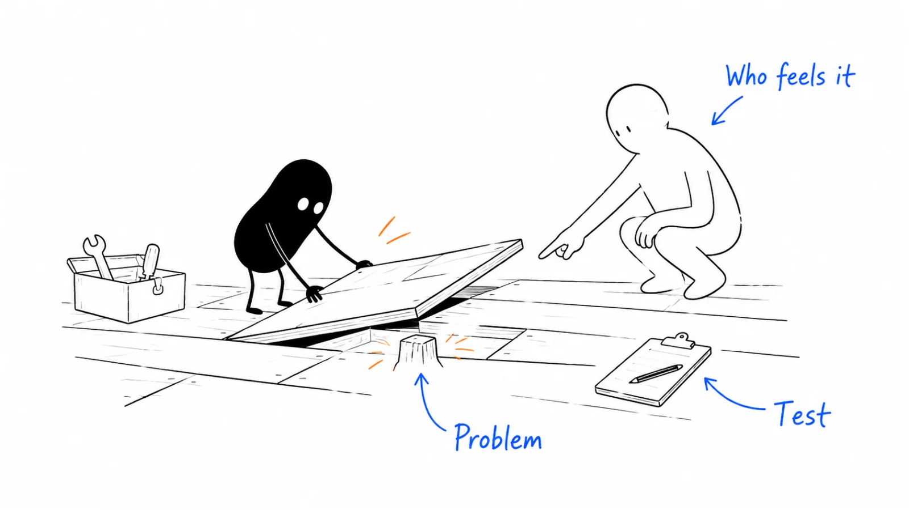

**Last reviewed:** 2026-09-06 · **Reading edit:** 2026-09-06

You have noticed a frustrating task. Perhaps your team keeps rebuilding the same spreadsheet, or customers keep asking for something your product does not do. Is there a business in it?

You do not need to answer that yet. First, make the problem specific enough to investigate: **who has it, what they do today, and what you need to learn next.** By the end of this guide, you should have one problem card and a practical next step—not a business plan.

The difficult part is rarely producing a list of ideas. It is learning which frustrating moments belong to a wider problem, which are peculiar to one company, and which already have a perfectly adequate solution. That takes more than a clever product description. It takes following the work closely enough that your initial explanation can change.



Read this from start to finish for the reasoning and examples. If you are already investigating something, jump to the [conversation walkthrough](#follow-one-idea-through-three-conversations), [choosing between ideas](#when-several-ideas-look-promising), or the [problem card](#problem-card-to-copy).

## Use this when

You are looking for a B2B idea, choosing between several possibilities, or wondering whether a side feature deserves more attention. Bring observations from work, customer conversations, or a field you want to understand.

## Do not use this when

If you can already name the customer and problem, move to [idea validation](https://b2-b-playbook.mintlify.app/playbooks/01-strategy-and-buyers/idea-validation). If you have customers and need to choose which ones to pursue, use [ICP](https://b2-b-playbook.mintlify.app/playbooks/01-strategy-and-buyers/icp). This guide is for deciding what to investigate first.

## What makes a business problem worth investigating?

A complaint is a starting point, but it leaves a lot unanswered. Someone can dislike a task without wanting to change it. They may complete it twice a year, trust the current process, or consider the available alternatives more troublesome than the work itself.

Imagine a finance manager spending an afternoon preparing a monthly report. You see repetitive copying and think “automation.” The manager may see a useful checkpoint: the manual review is where they catch mistakes before the numbers reach the board. A faster export would not necessarily replace that work. You need to understand what the apparent inefficiency is doing for them.

For B2B discovery, follow three connections. **Who experiences the problem? Who cares about its consequences? Who can authorize a change?** These may be three different people. A coordinator loses time, a department head misses a deadline, and IT controls access to the system. A product that helps only the first person may still be difficult to adopt. The [buying committee guide](https://b2-b-playbook.mintlify.app/playbooks/01-strategy-and-buyers/buying-committee) goes deeper once you have a candidate.

Frequency matters, but so does the consequence of being wrong. A rare migration can justify substantial help; a daily annoyance may remain too minor to command attention. Neither automatically implies a recurring software business. Some problems are better served by a one-off service, a process change, or an existing product configured properly.

You are looking for a situation you can investigate honestly. The answer may be “there is a product here,” but it can also be “this is a consulting project” or “the current solution is good enough.” Discovering that early is useful work.

## Three paths

Start with whichever route gives you access to real work. You do not need a dramatic founder story.

<a id="path-1-past-pain-40-in-that-sample"></a>

### 1. A problem you have experienced

Look for a task you have had to repeat or rebuild. Write down the last specific occasion, not just your opinion of the software. Then ask who else encounters it. Your experience is a useful lead; it is not evidence that other companies will buy.

<a id="path-2-ponder-and-probe"></a>

### 2. A field you want to understand

Choose a narrow role and workflow, such as finance managers reconciling invoices. Ask people to walk you through recent work. Starting with “finance” or “AI” alone leaves too much room to imagine problems nobody prioritizes.

<a id="path-3-present-pull"></a>

### 3. Something people already use or request

A side feature, internal tool, or manual service may attract more interest than the main product. Find out what people return for and what they would do without it. Enthusiastic comments are a reason to investigate, not a reason to pivot immediately.

These starting points are adapted from [Lenny Rachitsky's founder-interview synthesis, August 8, 2023](https://www.lennysnewsletter.com/p/how-the-most-successful-b2b-startups?ref=b2b-playbook). They describe routes taken by selected successful companies, not their odds of success. The exercise below is this library's suggested way to explore a candidate.

## Where to look when you do not have an idea yet

Pick a role you can reach and follow a recurring job from beginning to end. Where does a request arrive? What gets copied into another system? Who checks it? Where does it wait? You can start with a colleague's explanation; you do not need access to a company's entire operation.

Look especially at handoffs. A task that looks simple inside one team may become awkward when another team needs different information or permission. A marketer has a list of event contacts, for example, but sales wants account matches, conversation notes, ownership, and a reason to follow up. “The list is messy” might be a data problem, a handoff problem, or both. Find out which before naming a product.

Other useful places to look include repeated support questions, implementation checklists, job descriptions that describe substantial coordination work, and public discussions of workarounds. Treat them as leads for questions. A job posting is not proof that a company needs your software, and a forum complaint is not a buying commitment.

Use internal tickets or recordings only when you have permission. In your research notes, preserve the sequence and the lesson without copying private customer details. A redacted example is usually more useful than a large collection of records you do not yet know how to interpret.

Start a small observation list. For each entry, write the role, task, observed difficulty, source, and one person you could ask about it. Avoid naming the solution yet. “An AI copilot for procurement” quietly commits you to a product; “a purchaser re-enters an approved order into three systems” leaves room to discover what would actually help.

## Turn an observation into a problem worth testing

### Step 1: describe one recent incident

Replace the category name with an event someone could recognize.

| Too broad | Specific enough to investigate |
|---|---|
| AI for operations | An operations manager waits for an engineer whenever a customer needs a record corrected. |
| Better event marketing | After a trade show, a marketer spends two days matching scanned contacts to CRM accounts before sales can follow up. |
| Sales productivity | A sales manager checks three systems before deciding which stalled deals to review. |

These are illustrative problem statements, not verified opportunities. Pick one and record where it came from. If you cannot recall an incident, label it a hypothesis and find someone who does the work.

### Step 2: ask how the work gets done today

Start with a recent occurrence rather than pitching your solution:

- “Can you walk me through the last time this happened?”
- “What did you use, and who else got involved?”
- “Where did you have to wait, repeat work, or check something manually?”
- “What happened because of that?”
- “Have you tried changing the process? What got in the way?”

With permission, ask for a redacted example or a walkthrough using dummy data. You want to understand the workflow, not collect confidential records.

Keep the person's account separate from your interpretation. “We wait for engineering every Friday” is an observation. “They will pay for an AI agent” is still your guess.

### When the answer is vague, stay with the incident

“It is a nightmare” sounds promising, but it gives you little to work with. Ask what happened most recently. If the person cannot remember, that is worth noting rather than repairing with your own example.

Here is a **fictional interview exchange**, written to show the difference between a complaint and a usable observation:

**Researcher:** You mentioned the corrections queue is slow. Can you remember the last request that caused a problem?

**Operations manager:** On Tuesday, a customer needed a record fixed. We did it on Friday.

**Researcher:** What happened between Tuesday and Friday?

**Operations manager:** Support assigned it to us, then we asked engineering. They batch those requests.

**Researcher:** Did the delay prevent the customer from doing something, or was it mainly extra follow-up?

**Operations manager:** Mostly follow-up in this case. I cannot tell you how often it blocks someone.

That final answer makes the idea less exciting and the research more useful. You now know there was a delay, but its business impact remains unclear. Asking “Would you use a tool that fixes records instantly?” would have skipped that distinction.

Do not force every conversation through the whole question list. When someone describes a surprising workaround, follow it. At the end, summarize what you think you heard and invite a correction: “It sounds like the waiting matters more than the update itself. Have I understood that correctly?”

<a id="three-ingredients"></a>

### Step 3: decide whether to spend more time on it

Use these questions to find gaps in your understanding—not to manufacture a score.

| Question | Useful evidence | If you do not know yet |
|---|---|---|
| Does it matter enough? | A recent delay, expense, lost sale, or repeated effort the person can describe. | Ask what happens if nothing changes. |
| Why is the current approach insufficient? | A workaround and a concrete reason it remains painful. | Ask why an existing product or process change has not solved it. |
| Can we keep investigating? | Access to people doing the work, plus genuine interest in the details. | Find an introduction or a narrower workflow you can reach. |

Separate the person doing the task from the person who could approve a purchase. “Budget owner unknown” is a useful answer. You do not need to invent a price or a market-size forecast to fill the card.

Be careful with time-saving claims. If a task takes two hours, that does not mean a product can save two hours, or that the company will pay for two hours of saved time. Some of the task may be necessary judgment. Setup, review, exceptions, and maintenance may consume part of the saving. Ask what the person would do differently if the task became easier.

The same care applies to existing software. A spreadsheet can be flexible, familiar, and easy to share. Replacing it may require permission, training, historical data, and agreement across teams. The relevant comparison is not your best demo against their worst afternoon; it is the full cost of adopting your approach against continuing with theirs.

If you are enthusiastic about AI, write down the specific change it could enable: interpreting varied documents, reducing a particular review step, or handling a previously uneconomic task. Then ask where errors would go and who would check the result. “We can build it now” addresses feasibility. It does not establish that a buyer wants to change how the work gets done.

### Step 4: choose one next action

Make the action answer a specific uncertainty. For example: “Ask another operations manager to walk through their last record correction, so we can learn whether the engineering dependency exists outside our team.”

Start with a couple of conversations to improve the question. That is a scheduling suggestion, not a validation threshold. Move to [idea validation](https://b2-b-playbook.mintlify.app/playbooks/01-strategy-and-buyers/idea-validation) when you have a clear customer/problem hypothesis and are ready to test demand more deliberately.

## Two company stories, and what to take from them

### Retool: the problem and the audience are different questions

Before Retool, David Hsu's team was building a payments business. Keeping it running required internal software for tasks such as identity checks and verification queues. Looking back through that work, he noticed the same interface building blocks recurring: forms, tables, and controls. That suggested a way to help developers build such applications faster.

The observation did not immediately identify the right audience. In his account, outreach to users of legacy tools such as FileMaker attracted very few replies, all negative. Developers building internal applications, including React developers, proved a better audience. Retool describes the early shifts as changes in market and messaging, not just product. [Retool founder account, February 21, 2023](https://retool.com/blog/retool-founding-story-david-hsu?ref=b2b-playbook).

**Our takeaway:** keep the observed task, customer hypothesis, and proposed solution separate in your notes. A rejection should prompt you to examine all three. This retrospective story does not prove that better wording alone will fix demand.

### Vanta: look for the consequence behind the task

Vanta's recap of Christina Cacioppo's 2021 talk connects her work on Dropbox Paper with an enterprise-sales obstacle: large customers wanted tangible evidence of product security. The problem was more specific than “security is hard”—buyers needed a way to establish trust before adopting a product. [Vanta founder-talk recap, August 30, 2021](https://www.vanta.com/resources/five-principles-for-building-a-secure-product?ref=b2b-playbook).

**Our takeaway:** follow the inconvenience to the decision it affects. A tedious task may matter because it blocks a purchase. That does not establish that every security workflow is a business opportunity.

There is more to the story than identifying an important topic. In a later interview, Cacioppo describes founders who cared about security but struggled to prioritize it against product development, revenue, and retention. Early security checklists did not generate the response the team wanted. Helping companies prepare for compliance requirements connected the work to a more immediate commercial need. [Founder interview with Unusual Ventures, March 9, 2023](https://www.unusual.vc/how-vanta-found-product-market-fit-christina-cacioppo-on-startup-compliance/?ref=b2b-playbook).

For your own research, that suggests a follow-up to “Is this important?” Ask what would make someone work on it **this month**. A customer request, an upcoming renewal, or a recurring operational failure could explain urgency. Do not supply the trigger yourself; listen for a recent decision and what actually changed its priority.

Retool and Vanta are useful together because they expose different gaps. You can see a real problem and still misunderstand who needs help. You can also find people who agree that a problem matters, while missing the circumstance that makes them act. Both are reasons to keep investigating before treating a positive conversation as validation.

## Follow one idea through three conversations

The following sequence is **entirely fictional**. It extends the record-correction example to show how research can change an idea. These are not customer interviews conducted by Ivan, and the findings are not claims about real operations teams.

### The starting idea: an AI assistant for operations

Suppose you want to build an assistant that lets operations staff request database changes in plain English. The demo is easy to imagine: type a request, approve it, and watch the record update. You know people complain about waiting for engineers, so the idea feels plausible.

Before building, write the assumptions that make the demo valuable. The delay must matter. The change must be safe to delegate. Someone must trust the proposed approval process. Existing tools must leave a gap. You may discover that generating the update is the easiest part of the problem.

### Conversation one: the waiting is real; the impact is unclear

The operations manager describes Tuesday's request being completed on Friday. Support chased it twice. They would prefer a faster process, but cannot say how often the delay stops a customer from working.

The tempting note is “customer confirmed the pain.” A more useful note is narrower: one incident involved several days of waiting and repeated follow-up. You still need to understand frequency, consequences, and why engineering batches the requests. That is the snapshot captured in the filled card below.

### Conversation two: the update is not the bottleneck

In this imagined continuation, the engineer says the update itself takes little time. The difficult part is confirming who authorized it, what else could be affected, and how to reverse it. They batch requests because the approval information often arrives incomplete.

Now the original product idea deserves scrutiny. Turning a sentence into an update may not remove the delay. A structured request, explicit permissions, or a safer correction workflow could be more relevant. You have not proved that any of these is a product; you have learned why a plausible demo might solve the wrong part of the job.

### Conversation three: another team has already solved it

A second operations team, in the same fictional exercise, uses an existing internal-tool builder for routine corrections. They report that it handles the work adequately. They do not want another application.

Keep that answer. Do not discard it as “the wrong customer” just because it weakens the pitch. Compare the conditions: are their changes simpler, their permissions clearer, or their engineering resources different? If there is no meaningful difference, the existing solution may be sufficient for the first team too.

### The revised idea is smaller—and more useful

Your question is now: “Do teams with recurring, low-risk corrections get stuck because they lack a safe way to delegate them?” That is narrower than an AI assistant for all operations. It is also easier to test and easier to reject.

The next action might be a redacted walkthrough of request approval, followed by a discussion of what existing tools cannot handle. It is not yet a full build. If the problem turns out to be missing configuration or unclear ownership, say so. Discovery earns its keep when it changes your decision, including the decision not to create another product.

## When several ideas look promising

Do not compare a well-researched small problem with an imagined large market as if they were equally understood. Put the evidence and the next uncertainty beside each candidate. A simple table is enough.

This is an **illustrative comparison**, not a ranking of actual markets:

| Candidate | What you know | What you need to learn next |
|---|---|---|
| Customer-record corrections | One team described waiting; you can speak to its engineer. | Why does the request wait, and could existing tools handle it? |
| Trade-show lead handoffs | You have heard general complaints but seen no recent handoff. | Can a marketer walk through the last event's follow-up process? |
| Board-report preparation | You have seen a spreadsheet but do not know why each review exists. | Which steps are repetitive, and which are deliberate checks? |

You might investigate corrections first because the next learning step is accessible, not because the table proves it is the largest opportunity. Keep the other candidates and record why you deferred them. This prevents a practical sequencing decision from quietly becoming a claim about market quality.

Set a modest research budget in time or effort, then review what changed. The budget should fit your circumstances; it is not an interview quota that makes an idea valid. If conversations keep producing broad enthusiasm but no specific incidents, change the question or the role you are approaching before simply collecting more answers.

Personal interest belongs in this decision too. You will need patience for exceptions, implementation details, and unglamorous customer work. Being excited about the launch is different from being willing to learn the job. Choose a direction you can keep examining when the first explanation turns out to be wrong.

## Keep investigating, park it, or move forward?

**Keep investigating** when the problem is specific but the uncertainty is still basic. You may have one clear incident and access to the people involved, yet not know whether it recurs. Name that gap and the next person or artifact that could clarify it.

**Park the idea** when you cannot reach the relevant people, the timing is wrong, or a critical assumption cannot currently be tested. Record what would make it worth revisiting. “Revisit if we can observe an actual handoff” is more useful than leaving the idea permanently marked as promising.

**Walk away from this version** when repeated investigation shows an adequate existing solution, negligible consequences, or a workflow that does not need what you want to build. You do not need to prove the entire market is unattractive. It is enough to conclude that your present hypothesis does not justify more investment.

**Move to validation** when you can state a customer, a recurring situation, an unmet need, and the evidence behind that description. You should also know what remains unproven—especially willingness to adopt, ability to pay, and the practical cost of switching. Those are the next tests, not boxes this discovery exercise has already checked.

## Copyable templates

<a id="how-a-filled-idea-card-reads"></a>

### A filled problem card

**Illustrative example only.** The observations and conversation below are invented to show how to record uncertainty; they are not Ivan's customer research or a Retool case study.

| Field | Example |
|---|---|
| Person and situation | Operations manager at a small software company, handling customer-record corrections. |
| Recent incident | A correction waited until Friday because an engineer needed to run it. |
| Current workaround | Send a support ticket, then ask engineering to update the database. |
| Consequence | The customer waited; support followed up twice. Frequency and cost have not been measured. |
| Evidence we have | In this hypothetical exercise: one conversation describing one incident. No workflow observed yet. |
| What we suspect | A controlled self-service correction flow might reduce waiting. |
| What could make this unattractive | Corrections may be rare, require engineering judgment, or already be possible with existing tools. |
| Buyer | Unknown. The operations manager may not control a software budget. |
| Next action | Speak to another operations manager and request a redacted walkthrough. |
| Decision today | Keep investigating. Do not claim demand or begin a full build. |

<a id="idea-card-copy"></a>

### Problem card to copy

Copy this into your own notes. Leave unknowns visible rather than filling every line with a confident answer.

```text
Problem card
Date / owner:

Person and situation:
Most recent incident:
Current workaround:
Consequence / frequency:

Evidence:
- Who described it / date:
- What we observed:
Our interpretation:
What is still unknown:
Possible budget owner:
Reasons this may not work:

Next action:
Question this should answer:
Decision (choose one):
- Investigate
- Park
- Move to validation
Review date:
```

<a id="path-questions-pick-one-list"></a>

<Accordion title="Extra questions for your starting path">

- **Experienced problem:** Did it happen at another company? How did they handle it? What makes your situation unusual?
- **New field:** Which role can you reach? What recurring task can someone show you? Who already sells a solution?
- **Existing interest:** Who comes back without prompting? What exactly do they use? Does anyone outside your own team need it?

</Accordion>

<a id="pre-flight-checklist"></a>

## Before you start

Before booking the next conversation, check that:

- [ ] You can describe one person, one task, and one recent incident.
- [ ] You have written down the current workaround, not only your proposed product.
- [ ] Evidence and assumptions are separate.
- [ ] You have named a reason the idea might not work.
- [ ] Your next action answers one unresolved question.

## Metrics

Track what you are learning: roles you have spoken to, recurring problems, observed workarounds, and contradictions. Keep dates so you can revisit your interpretation. Conversation count tells you how much research you did; it does not show that anyone will buy.

## Common mistakes

- **Starting with a technology label.** “AI for finance” does not identify a person or a task. AI may become part of the solution after you understand the work.
- **Treating complaints as buying intent.** Ask what someone has done to solve the problem and why they stopped.
- **Writing only supporting evidence.** A customer who already has an adequate solution belongs in your notes too.
- **Copying a famous company's path.** Founder stories suggest questions to ask; they do not predict your outcome.

## What to read next

Have one clear candidate? Continue to [idea validation](https://b2-b-playbook.mintlify.app/playbooks/01-strategy-and-buyers/idea-validation). Need to narrow the customer? Use [ICP](https://b2-b-playbook.mintlify.app/playbooks/01-strategy-and-buyers/icp). Ready to approach potential early customers? Read [first ten customers](https://b2-b-playbook.mintlify.app/playbooks/01-strategy-and-buyers/first-ten-customers).

## Sources and evidence boundary

Sources were checked on September 6, 2026. The discovery paths are adapted from Lenny Rachitsky's dated interview synthesis, linked above. The company stories draw on company-published accounts and a founder interview; these are not independent assessments of results. The exercise, problem-card format, and labelled examples are editorial guidance, not a validated scoring model.

For more origin stories, read [Lenny's original article](https://www.lennysnewsletter.com/p/how-the-most-successful-b2b-startups?ref=b2b-playbook). Percentages from that selected sample and venture-scale revenue targets are not requirements for your idea.

---

Copyright © 2026 Ivan Xu. All rights reserved. See the [copyright and reuse terms](https://github.com/weilun88313/B2B-Playbook/blob/main/LICENSE).

Canonical source: [github.com/weilun88313/B2B-Playbook](https://github.com/weilun88313/B2B-Playbook)
