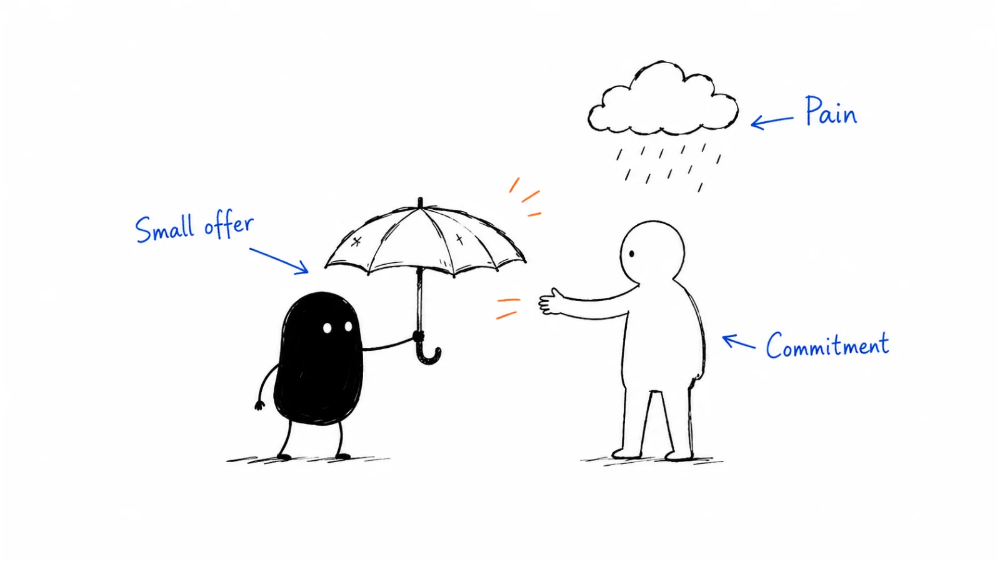

**Last reviewed:** 2026-09-06 · **Reading edit:** 2026-09-06

You have found a problem worth investigating. People recognize it, describe their workarounds, and say your idea sounds useful. You leave the calls encouraged. A week later, nobody has sent the example they promised, the demo has no repeat users, and you are unsure whether to build more or ask different questions.

This is where validation becomes useful. The question is no longer just “Does this problem exist?” It is **“Will a particular customer change what they do for the offer we can actually deliver?”**

You will not settle the future of a company in one experiment. You can make the next decision less speculative: whether to build a small prototype, run another pilot, change the offer, or stop pursuing this version. This guide walks through those decisions, including the awkward middle where feedback is encouraging but commitment is unclear.



Read in order for the full process, or jump to [choosing a test](#pick-one-path), the [worked pilot](#follow-one-hypothesis-through-a-pilot), or the [copyable validation card](#validation-card-copy).

## Use this when

You can name a customer, a recurring situation, and a reason the current approach may be inadequate. You may have interview notes, a mockup, or an early product. What you lack is evidence that the proposed change deserves more investment.

Bring the problem card from [idea discovery](https://b2-b-playbook.mintlify.app/playbooks/01-strategy-and-buyers/idea-discovery), including the uncomfortable unknowns. “The operations manager likes it; the buyer is unknown” is a better starting point than a confident statement that operations teams need your product.

## Do not use this when

If the problem is still “AI for sales” or “better collaboration,” return to discovery. A broad category gives you too many ways to reinterpret any answer as support.

If customers already buy and use the product, validation continues, but the questions become more specific: which customers to focus on, how to reach more of them, and whether they stay. The [ICP](https://b2-b-playbook.mintlify.app/playbooks/01-strategy-and-buyers/icp), [first ten customers](https://b2-b-playbook.mintlify.app/playbooks/01-strategy-and-buyers/first-ten-customers), and [product-market fit](https://b2-b-playbook.mintlify.app/playbooks/01-strategy-and-buyers/product-market-fit) guides cover those next steps.

## Start with the decision, not the experiment

It is easy to announce a landing page, a survey, and ten interviews because they all look like progress. Before choosing an activity, write the decision it should inform.

Suppose you are considering a month of engineering work on a record-correction tool. The decision is not whether people like efficient operations. It is whether a small group of suitable teams has enough reason to adopt a correction workflow that you can realistically provide.

Break that into questions. Does the delay cause a consequence they care about? Can the proposed workflow remove the delay? Will someone approve its use? Can you deliver it without spending more effort than the arrangement can support?

These questions need different evidence. A conversation can reveal an approval requirement. It cannot show that your implementation works reliably. A successful demonstration can show a task is possible. It cannot show that the budget owner will prioritize it.

Choose the uncertainty most likely to change your next decision. If no team is willing to let the workflow into its process, improving the dashboard may teach you very little. If teams want to try it but the task cannot be performed safely, another round of demand interviews will not resolve that problem.

Write down the cost of being wrong, too. A reversible afternoon spent on a mockup does not require the same confidence as a long build or an expensive integration. You are trying to justify the next commitment, not earn a permanent “validated” label.

<a id="what-actually-counts-as-legs"></a>

## What counts as evidence of demand?

An expression of interest tells you someone reacted to an idea. Evidence becomes more relevant when it shows the behavior your business depends on. The important distinction is what happened, under what conditions, and what it still leaves unproven.

| What happened | What it helps you learn | What it does not establish |
|---|---|---|
| Someone describes a recent costly incident. | The problem has a concrete example. | They want your approach or can buy it. |
| A suitable user completes a task with the prototype. | The workflow may be usable. | They will return when the researcher leaves. |
| A team supplies an approved sample and assigns an owner. | They are investing effort in evaluation. | The purchase is approved. |
| The buyer pays for a defined pilot. | This offer earned a purchase under these terms. | Repeat demand or profitable delivery. |
| The team uses it again when the job recurs. | It may fit an ongoing need. | Retention across other customers or seasons. |

Do not turn this into a rigid ladder. An enterprise team may need a security review before a paid pilot. A small business may pay quickly but never use the product. Both situations need interpretation.

Listen to emotion without requiring a performance. A calm buyer describing a missed deadline can be more informative than an enthusiastic founder complaining about software. Strong frustration can help you find the problem; it does not reveal purchasing authority or willingness to switch.

Similarly, a warm introduction does not invalidate a customer, and cold outreach does not purify a test. Record the relationship and any special treatment. Then ask whether the customer would still choose the offer without the personal favor, unusually low price, or unlimited founder assistance. Seek people outside your immediate circle when you can, while keeping the target customer consistent.

## Turn the problem into an offer someone can evaluate

“Would you use an AI operations assistant?” asks the other person to invent the product for you. They can imagine perfect accuracy, no setup, and a price that suits them. You may leave with agreement about a product neither of you can describe.

A testable offer specifies a job, an outcome, a boundary, and what the customer must contribute. It also says what is unfinished. For the running example, an initial offer could be:

**Illustrative offer:** We will help your operations team prepare one type of routine record-correction request for engineering review. You provide approved, redacted examples and a person who knows the current process. We return a structured request packet and review it together. We will not access or change production records.

This is narrower than the imagined product. It tests whether better request preparation helps before testing autonomous execution. If customers only want the latter, that is important to learn; success with the former would not establish demand for an AI agent.

Include the commercial expectation before someone invests substantial time. A free research session, a paid service, and a prototype evaluation are different arrangements. Tell the participant which one you mean, what happens afterward, and whether there is any obligation to continue.

When the offer is hard to explain without a long feature list, return to the recent incident. What would have changed in that situation? If you cannot answer without assuming several unbuilt capabilities, reduce the scope or acknowledge that the test cannot yet represent the promise.

## Pick one path

The options below are ways to answer different questions, not four stages everyone must complete. Choose the smallest credible test of the current uncertainty. You can change methods as the question changes.

<a id="path-1-do-it-by-hand-problem-unclear-or-maybe-unsolvable"></a>

### Path 1: deliver a narrow result manually

Use a manual service when you need to learn what a useful result looks like or what it takes to produce one. Prepare the report, organize the request, or complete the analysis with the customer's permission. Explain where people are doing the work; do not present human assistance as functioning automation.

Watch what the recipient does with the output. Do they use it in the next meeting, send it to a colleague, correct it, or leave it unopened? “This looks great” is a different result from “We used this to make the decision.”

Track your own effort. If every output requires hours of specialist judgment and a unique data-cleaning process, you may have discovered a valuable service rather than a repeatable software workflow. Neither outcome is inherently bad, but they imply different products and costs.

A manual test also has limits. It cannot demonstrate the speed, reliability, or economics of automation. Record the steps that would need to change before making that promise.

<a id="path-2-listen-first-default-unless-you-already-know-what-to-build"></a>

### Path 2: investigate the adoption decision

Use conversations when the unanswered question concerns the buyer, urgency, or a blocked change. Move beyond repeating the discovery interview. Ask about a previous attempt to solve the problem, who joined the decision, and why it did or did not proceed.

Bring the specific offer after understanding that context. Then ask what would have to happen for a real evaluation. A useful answer might identify an internal owner, a suitable upcoming task, or a requirement you cannot meet.

“Send me a deck” may simply be a courteous ending. Ask whether there is a decision the deck would support. If there is not, record interest without an active evaluation. Avoid turning a research conversation into pressure to buy; an honest refusal is useful.

There is no universal interview count that establishes demand. Keep going while conversations are changing your understanding of the decision. If the same uncertainty persists, change whom you approach or what you ask rather than collecting more similar calls.

<a id="path-3-prototype-with-a-few-design-partners-you-already-know-the-space"></a>

### Path 3: test a workflow with design partners

A design partner is a customer working with you while the product is unfinished. Choose partners who encounter a similar problem and can participate in a specific test. Their reputation matters less than access to the work you need to understand.

Agree on the task, participant, available support, review date, and limits of the prototype. During the session, let the user attempt the work before explaining every step. When assistance is necessary, record it. A completed task with continuous coaching is different from independent use.

Feature requests need context. Ask what the missing feature prevented, how the team handled that situation before, and whether fixing it would allow a concrete next step. Some requests remove genuine blockers; others expand the product into a different customer's workflow.

Avoid promising every partner their preferred roadmap. You can learn from a request without accepting it. Tell them what you are testing now and what lies outside the current scope.

<a id="path-4-just-launch-desperate-or-the-vision-is-already-sharp"></a>

### Path 4: put a clear offer in front of new people

A landing page or small launch is useful when you need to test whether suitable people understand the offer and take a next step. Name that step before attracting traffic: request an evaluation, join a clearly labelled waitlist, or try a working product.

A waitlist tests willingness to leave contact information. It does not test successful use. A pricing-page click shows someone explored a price; it is not a payment. Keep the claim close to the behavior.

If the product is unavailable, say so before requesting a commitment. Do not invent customers, hide that a demo is simulated, or imply that a purchase will deliver capabilities you have not built.

Interpret silence carefully. The audience may be wrong, the explanation unclear, or the offer unimportant. Confirm that appropriate people actually encountered it before treating an empty inbox as a verdict on the idea. For a usable product, follow launch-day activity through to the next occasion when the customer needs the job done.

## Two company stories: different tests, different conclusions

### Buffer: interest, price exploration, then an actual purchase

Joel Gascoigne describes starting Buffer with a two-page site, sharing the concept on Twitter, and collecting email addresses and feedback. He then inserted a pricing page to see which plans people explored before leaving their details. Some clicked paid plans, which encouraged him to build a working version.

In his February 16, 2011 account, he reports the first paying customer within four days of the product launch. The important sequence is that the initial pages and the subsequent purchase were separate events. The early click did not itself transfer money. [Buffer founder account, February 16, 2011](https://buffer.com/resources/idea-to-paying-customers-in-7-weeks-how-we-did-it/?ref=b2b-playbook).

**Our takeaway:** test the commitment available at the current stage, then move to the next unresolved question. This is a retrospective account of a self-serve product, not evidence that an enterprise buying process can be reduced to a landing page. Its timeline is not a deadline for your experiment.

### Linear: a small release can answer a product question

Karri Saarinen's January 21, 2021 account describes early versions of Linear's Cycles and Projects reaching the team and private beta users in the first week, with feedback and fixes following. He reports roughly two weeks of design and development for the initial versions; both later became major features.

The same article argues for understanding the problem behind feature requests and choosing feedback from relevant users. [Linear founder account, January 21, 2021](https://linear.app/now/building-at-the-early-stage?ref=b2b-playbook).

**Our takeaway:** scope a release so that someone can attempt meaningful work with it. Its result can justify another product iteration without proving willingness to pay or company-wide product-market fit. This account describes Linear's development approach, not a controlled comparison of validation methods.

## Follow one hypothesis through a pilot

This is a **fictional continuation** of the record-correction example in [idea discovery](https://b2-b-playbook.mintlify.app/playbooks/01-strategy-and-buyers/idea-discovery#follow-one-idea-through-three-conversations). The teams, conversations, counts, and outcomes below are invented for teaching. They are not Ivan's customer research or results from Buffer or Linear.

### First, make sure there is enough to test

In discovery, an operations manager described waiting for engineering, an engineer pointed to incomplete approvals, and another team said an existing tool worked adequately. That evidence did not establish demand.

Suppose further investigation now finds recurring requests where the same approval information is missing. The team agrees that reducing this back-and-forth is worth trying. Your revised hypothesis is that a structured preparation workflow can help these requests reach review with fewer clarifications.

Notice what disappeared: automatic database changes, a general-purpose AI assistant, and a claim that all operations teams need it. The idea has become testable because it asks less of the evidence.

### Define the test before doing the work

You and the operations lead agree to review five suitable, redacted past requests. You will prepare the packets manually. The engineer will compare them with the team's existing request template and identify missing information. No live record changes are involved.

Before the exercise, write a provisional decision rule: continue only if the reviewer finds the packets usable with less clarification than the current approach and the operations lead can identify an upcoming batch worth testing. If the existing template works just as well, investigate whether a process fix is enough.

Five is an illustration of a small exercise, not a validation threshold. Historical examples also cannot show actual future time saved. The test can reveal whether the proposed packet covers the work and whether anyone wants a next evaluation.

### The first result is useful, but mixed

Imagine the engineer considers three packets ready for review. Two are missing information that the operations team cannot obtain without another department. A revised version of the existing template would have handled one of the three successful requests equally well.

You did not get “three successes out of five, therefore build.” You learned which requests the approach handles and which still depend on another team. The comparison also weakened the assumption that a separate product is necessary.

Keep all five results. If you narrow the scope to requests with readily available approvals, say that the hypothesis changed. Do not silently remove the difficult examples and report a better completion rate.

### Now ask for a real next step

The operations lead likes the packets and says the team would use a tool. Instead of interpreting that as a purchase, discuss the next evaluation.

**Founder:** Is there an upcoming batch where trying this would be useful?

**Operations lead:** We have one next month, but I would need the engineering manager to agree.

**Founder:** What would that manager need to decide? Could we review the proposed scope together before I build anything else?

**Operations lead:** They will want to know why this is better than updating our request form.

That answer gives you a comparison to address, not an objection to talk around. If a form change solves the problem adequately, the team may not need your product. If it does not, the manager can explain the remaining gap.

### A second team changes the interpretation

In the fictional continuation, another suitable team declines an evaluation. Its existing internal tool already handles the approval packet. It offers a feature suggestion but has no reason to switch.

This does not cancel the first team's experience. It does limit what you can conclude. Your potential customer may be a team lacking a workable internal configuration, rather than any company that makes record corrections.

Before accepting that narrower segment, check whether you can find similar teams and deliver the same result without custom work each time. Otherwise, you may be building a bespoke improvement for one customer. A request for a feature is not an agreement to adopt it.

### End with a decision you can defend

A reasonable decision here is to continue a bounded evaluation with the first team while testing the existing-form alternative. Do not claim a market, a validated subscription business, or reliable autonomous execution.

The next build, if justified, might only help prepare and review the narrow request type. Payment, repeat use, and delivery effort remain open questions. If the team can get the same result by updating its form, you can stop this version with a useful explanation.

That is what a good validation cycle produces: a clearer decision and a smaller set of unknowns. It does not need to end in a launch to have been worthwhile.

## Make the pilot produce a decision

A pilot can become indefinite when nobody agrees what happens at the end. Before starting, name the workflow, the owner on each side, the support you will provide, the comparison, and the review date. Give the customer a way to stop.

Choose an outcome close enough to the work that both sides can observe it. “Transform productivity” leaves too much room for disagreement. “Prepare this request type with fewer clarification rounds, without losing required information” gives you something to examine.

Compare like with like where possible. Easier tasks, unusually attentive users, or constant founder help can make a new workflow look better. In a small pilot, you may not be able to isolate every cause. Document those differences instead of presenting the result as a precise performance estimate.

Separate waiting time from hands-on work. A task can move through the queue faster while requiring more review effort. Record the tradeoff; the customer may still value it, but they should know what improved.

If the offer is paid, agree on scope and price before the work begins. If it is free, explain when and how a paid continuation would be discussed. A research participant should not discover halfway through that you expected them to become a customer.

<Accordion title="If the product uses AI, what else should the pilot test?">

A convincing output is not enough. Include representative messy inputs, missing information, and cases where the system should decline to proceed. Track the review work needed to make results usable.

Use dummy or appropriately approved data. Confirm which data may be processed and by which services before involving an external model. A model's availability does not establish that customer data can be sent to it.

Keep consequential actions behind the approvals appropriate to the workflow. In the record-correction example, preparing a draft request is distinct from executing a change. Do not let a successful drafting test become a claim that autonomous execution is safe.

Track delivery effort beyond model cost: setup, human review, corrections, support, and ongoing maintenance. A heavily assisted pilot may be valuable while leaving automation quality and economics unproven.

</Accordion>

## Read the awkward answers without inventing certainty

**“We would buy it if you added this feature.”** Ask what job the feature enables and whether it is the only remaining blocker. A conversation with the actual decision-maker and an agreed next step are more informative than a growing wishlist. The request may be sincere without constituting a commitment.

**“It is useful, but there is no budget.”** Find out whether the issue is timing, ownership, or priority. Someone may genuinely want the result and still be unable to buy it. Record the concrete constraint and any agreed revisit date; do not count hypothetical future budget as revenue.

**“We paid, but nobody is using it.”** Payment proves a transaction happened. Ask whether the relevant work occurred, whether onboarding blocked it, or whether someone bought on behalf of users who did not want the change. A yearly task should not be judged by daily usage.

**“Everyone stopped replying.”** Make a reasonable follow-up that makes declining easy, then record the evaluation as stalled. Do not assume secret enthusiasm or universal rejection. Check the audience, timing, and request before deciding whether to retry. Repeated silence after clear, appropriate invitations can justify stopping that approach without explaining the entire market.

<a id="when-to-go-all-in"></a>

## Decide how much to commit next

Review the result against the decision you wrote before the test. Ask what changed and whether the result would look the same under a simpler explanation. Perhaps people wanted your consulting help, a temporary free service, or a better form rather than software.

**Continue with a bounded next step** when the result supports the current hypothesis and the remaining uncertainty can be tested. State the scope and review point. “Build the request-preparation flow for this task” is clearer than “go all-in.”

**Change one important assumption** when evidence points to a different buyer, job, or delivery model. Write a new hypothesis and keep the old result attached. This makes it possible to distinguish learning from repeatedly redefining success.

**Pause or stop this version** when the outcome is not valuable enough, the existing alternative is adequate, adoption is impractical, or the required delivery model is one you cannot support. You need not prove that no company could ever buy such a product.

Personal commitment and product evidence are different decisions. A founder can choose to pursue a difficult problem despite uncertainty. That choice should not make weak evidence stronger in the notes. Repeated purchases, continued use, and workable delivery across suitable customers justify broader confidence over time; a single successful pilot does not establish product-market fit.

## Copyable templates

### How a filled validation card reads

This card summarizes the **fictional pilot above**. Its mixed result is intentional.

| Field | Example |
|---|---|
| Decision | Whether to build a small request-preparation prototype. |
| Hypothesis | Structured packets reduce clarification for recurring corrections. |
| Test | Review five approved, redacted past requests against the current template. |
| Rule set in advance | Packets need less clarification; the team identifies a next batch. |
| Observation | Three review-ready packets; two still need another department. One ready packet is equally served by an improved template. |
| Commitment | Operations lead proposes a future batch; manager approval is unresolved. |
| Contrary evidence | A second team has an adequate existing tool and declines. |
| Decision now | Compare with the form improvement before a further build. |
| Still unknown | Live workflow benefit, purchase approval, repeat use, delivery cost. |

<a id="validation-card-copy"></a>

### Validation card to copy

Fill this before the test, then append results. Keep the original rule visible if you revise it.

```text
Validation card
Date / owner:
Decision this test informs:
Customer / workflow:
Hypothesis:
Current alternative:

Test / scope:
Customer contribution:
Offer / price / support:
Data permissions:
Expected observation:
What would contradict us:
Review date / effort limit:

Observed result:
- Who / when:
- What they did:
- Assistance or special terms:
- Missing or contrary evidence:

Interpretation:
What remains unknown:
Decision:
Next test / owner / date:
```

<a id="listening-log-one-line-per-call"></a>

### Listening log

Keep one short entry per conversation or evaluation. Record the participant's role, company context, relationship to you, recent incident, and current alternative. Add the exact next action agreed, who owns it, and whether it actually happened.

Separate observation from interpretation. “Introduced us to the engineering manager” is an action. “Ready to buy” is your conclusion and may still be wrong. Note refusals, missed follow-ups, and changes in scope alongside positive responses.

<a id="pre-flight-checklist"></a>

## Before you start

- [ ] The test informs a named decision, not just a desire for encouraging feedback.
- [ ] The customer, task, and current alternative are specific.
- [ ] Participants understand what is manual, simulated, free, paid, or unfinished.
- [ ] Data access and any external processing are appropriately approved.
- [ ] The expected observation and a contradictory result are written down.
- [ ] Someone owns the evaluation and its next decision.
- [ ] There is a review date and a limit on the effort you will invest.

## Metrics

Use counts with context. “Two of three eligible teams scheduled a pilot after seeing the same scope and price” says more than “67% conversion.” Keep the small denominator visible and do not turn it into a market forecast.

Track the sequence appropriate to your offer: suitable people reached, evaluations agreed, evaluations actually started, tasks completed, repeat use when the task recurs, and purchases or continuations. These are separate events, not interchangeable signs of success.

Record support effort and reasons for stopping. A customer who never started because data access was unavailable should not be described as having rejected the output. A customer who completed the test and preferred the existing method should not disappear into an “inactive” category.

## Common mistakes

- **Changing the success rule after seeing the result.** A new hypothesis is fine; rewriting what the old test was supposed to show is not.
- **Counting an agreement instead of the action.** Track the scheduled review separately from the review that actually happened.
- **Ignoring founder assistance.** Keep helping early customers, but record how much the result depends on you.
- **Adding features before understanding the refusal.** The blocker may be priority, ownership, or a sufficient existing alternative.
- **Treating every failed test as a failed market.** First establish what the test actually exposed to whom, and what it could answer.

## What to read next

If the problem itself remains unclear, return to [idea discovery](https://b2-b-playbook.mintlify.app/playbooks/01-strategy-and-buyers/idea-discovery). If one type of customer responds differently from another, refine your [ICP](https://b2-b-playbook.mintlify.app/playbooks/01-strategy-and-buyers/icp) and map the [buying committee](https://b2-b-playbook.mintlify.app/playbooks/01-strategy-and-buyers/buying-committee).

When suitable customers are ready to engage, use [first ten customers](https://b2-b-playbook.mintlify.app/playbooks/01-strategy-and-buyers/first-ten-customers). For the cost of changing an established workflow, see [change friction](../02-product-marketing/change-friction.md). For commercial terms, continue to [pricing and packaging](../02-product-marketing/pricing-and-packaging.md). Look to [product-market fit](https://b2-b-playbook.mintlify.app/playbooks/01-strategy-and-buyers/product-market-fit) for the later question of sustained demand.

## Sources and evidence boundary

Sources were checked on September 6, 2026. The Buffer and Linear sections use dated, company-published founder accounts linked beside the claims. They are not independent assessments of results or representative studies of startups.

For broader founder interviews, see [Lenny Rachitsky's original validation article, August 15, 2023](https://www.lennysnewsletter.com/p/how-to-validate-your-b2b-startup?ref=b2b-playbook). Its selected-company observations are further reading, not interview quotas or guaranteed thresholds for this guide.

The experiment design, dialogue, decision rules, and templates here are editorial guidance. The record-correction pilot is explicitly fictional. Its counts illustrate interpretation, not a validated scoring method, market estimate, or customer outcome.

---

Copyright © 2026 Ivan Xu. All rights reserved. See the [copyright and reuse terms](https://github.com/weilun88313/B2B-Playbook/blob/main/LICENSE).

Canonical source: [github.com/weilun88313/B2B-Playbook](https://github.com/weilun88313/B2B-Playbook)
