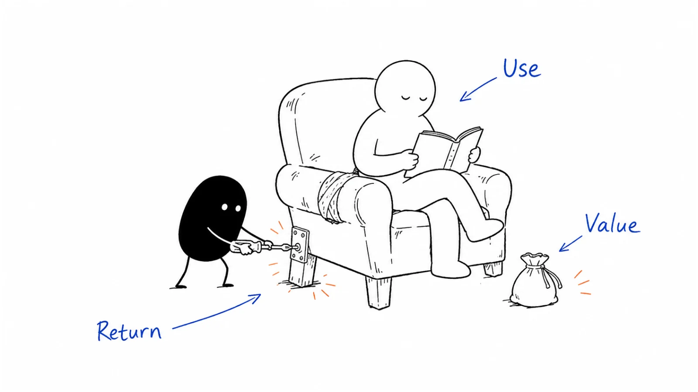

**Last reviewed:** 2026-09-07 · **Reading edit:** 2026-09-07

A customer pays. Another asks for a feature. Revenue goes up. Someone on the team says, “Maybe we have product-market fit.”

Then the first customer stops using the product, the second needs a version you cannot build, and the revenue increase turns out to come from one unusually large account.

None of the earlier progress was imaginary. It just answered fewer questions than you hoped.

Product-market fit means that a particular product serves a particular market well enough to sustain meaningful customer demand. In practice, you build confidence by looking at several kinds of evidence: whether customers achieve the intended result, keep choosing the product, pay under workable terms, and resemble other customers you can reach and serve.

There is no single certificate at the end. The useful question is **what the evidence supports doing next**. Should you improve onboarding, deepen a promising use case, revisit the customer group, or invest more in acquisition?



This guide turns that discussion into a working review. Jump to [the retention example](#read-retention-by-cohort-not-only-in-total), [revenue retention](#revenue-can-grow-while-customers-leave), [the PMF survey](#use-a-pmf-survey-as-a-question-not-a-verdict), or [the decision card](#ladder-card-copy).

## Use this when

Use this when you have some customer evidence but are unsure how much confidence it deserves. You may have successful pilots, early subscriptions, or growth that looks stronger than the underlying usage.

It is also useful before a larger commitment: hiring, increasing acquisition spend, entering another segment, or building an adjacent product. Specify which commitment you are considering so the discussion has a purpose.

A small team can begin with account notes. You do not need a sophisticated dashboard before asking whether someone received value and chose to return.

## Do not use this when

If nobody has attempted the proposed job, begin with [idea validation](https://b2-b-playbook.mintlify.app/playbooks/01-strategy-and-buyers/idea-validation). You can investigate demand before a finished product exists, but hypothetical interest is not the same as evidence from use.

If your immediate problem is finding suitable people to approach, read [first ten customers](https://b2-b-playbook.mintlify.app/playbooks/01-strategy-and-buyers/first-ten-customers). Acquisition and product learning can happen together; you do not have to complete one perfectly before starting the other.

Do not use “we have not found PMF” as a substitute for a specific diagnosis. It does not tell you whether the issue is an irrelevant audience, missing capability, confusing setup, poor reliability, or a price the business cannot support.

## Name the product and market before judging the fit

“We have PMF with operations teams” leaves a great deal unspecified.

Which teams? What job? What version of the offer? How much assistance? At what price and under which deployment conditions?

An assisted preparation service for one recurring request type can work well even when an autonomous operations platform would not. A product may be valuable to a small team but unsuitable for an enterprise that requires a different implementation.

Write the scope in a sentence:

**“We are evaluating whether operations teams with recurring request-preparation gaps will repeatedly buy and use our bounded preparation offer, with an available engineering reviewer and an acceptable data arrangement.”**

That sentence is deliberately less impressive than “operations platform PMF.” It gives you a group of accounts whose experiences you can compare.

Also name the business you intend to build. A focused, profitable service does not need the same market size or growth profile as a venture-funded platform. Market size, customer value, and the economics of serving customers are related questions, not interchangeable ones.

<a id="the-ladder"></a>

## Read several kinds of evidence together

The questions below are not rungs that every company climbs in order. A self-serve product may have substantial usage before a sales conversation. A service may earn payment before its delivery process is repeatable.

Keep the answers separate. Strong evidence in one area should not conceal a gap in another.

<a id="step-1-one-company-loves-it-keeps-using-it-and-you-would-be-ashamed-to-let-them-fail"></a>

### Does the customer get the result?

Start with the task the customer wanted to accomplish. Watch a realistic attempt or inspect an appropriate record of the outcome, with permission.

A login tells you the product was opened. A generated draft tells you something was produced. Neither necessarily tells you the work was completed or useful.

For a preparation product, the result might be a packet the reviewer can use without avoidable clarification. For an analytics tool, it might be a decision supported by trustworthy data. Define the event around the job, not the easiest button to instrument.

Compare with the existing approach, including its strengths. Count new work introduced by your product: checking output, fixing errors, setting up access, or maintaining another system.

Then ask whether the improvement matters enough to justify switching. A technically successful test can still produce too little value for the customer.

### Do they choose it again when the need returns?

Continued use is more persuasive than a good first impression. It suggests the product has a place in the customer's workflow rather than only in the demo.

Use the task's natural rhythm. A weekly operating process, a quarterly planning exercise, and an annual filing should not all be judged by daily activity.

Find out what brought the customer back. Did a new task arise? Did a colleague request the output? Did your team remind them repeatedly? Reminders and customer success can be legitimate parts of the service, but record their role.

Also understand why an account stays. Satisfaction is one explanation; a prepaid contract, migration effort, or lack of an available alternative is another. Continued payment is useful evidence, but it does not by itself describe the quality of the experience.

<a id="step-2-one-company-pays-a-meaningful-amount"></a>

### Will the buyer support the offer commercially?

Payment adds information because the buyer has made a tradeoff. It does not erase uncertainty about outcomes, retention, or delivery cost.

There is no universal minimum annual contract value for PMF. A low-priced product with a suitable distribution and support model can have real demand. A six-figure contract can still be a bespoke project that would be difficult to repeat.

Record the actual offer: price, discount, free services, custom work, contract length, and payment status. Distinguish a paid evaluation from a recurring subscription, and an agreement from collected payment.

For products with different users and buyers, understand both sides. An operator may value the workflow while the budget owner sees too little benefit to justify the expense. That could reflect the wrong buyer, incomplete value, poor packaging, or an adequate existing alternative—not automatically a pricing problem.

<a id="step-3-more-than-one-company-loves-it-and-pays"></a>

### Does the result appear in comparable accounts?

One successful customer is a useful place to start. It is not evidence that every company with the same job title needs the product.

Compare accounts with similar workflow conditions. Which have the problem, receive the intended result, and make a relevant commitment? Which do not, and why?

Avoid defining the segment only after seeing the winners. You can discover a promising pattern in early outcomes, but write the resulting hypothesis down and test it with another suitable group. Otherwise, “our ICP” can become a retrospective label for whoever happened to buy.

Keep failures and unknowns in view. An account that never completed setup may reveal an onboarding problem. An account waiting for a project may be too early to judge. They should not quietly disappear from the analysis.

<a id="step-4-push-becomes-pull"></a>

### Can you find more demand without reinventing the story?

Useful signs include customers bringing relevant colleagues, referrals that lead to real evaluations, repeat purchases, or prospects arriving with a recognizable problem and a reason to act.

None requires completely passive acquisition. A product can serve a market well and still need sales, partnerships, marketing, or a long procurement process.

Record how the opportunity developed. A prospect who submits a form after an event is still inbound through that form, with event influence in the history. Calling them a stranger does not improve the evidence.

Feature requests also need interpretation. A request connected to repeated valuable use may point to a worthwhile improvement. A long wishlist from someone who has never used the product may describe an entirely different business.

<a id="step-5-growth-that-does-not-need-a-special-week"></a>

### Can you deliver the value on workable terms?

Early delivery can be deliberately inefficient while you learn. The important distinction is between understood assistance and an invisible subsidy.

Track the work required to sell, set up, support, and deliver the offer. Include human review, exceptions, third-party costs, and the time spent repairing failures.

Do not assume that today's service effort will disappear because the roadmap includes automation. Identify which work could realistically become cheaper and what evidence would demonstrate that improvement.

You can have promising product value before the business model is fully resolved. Describe both facts. Strong demand does not make unlimited support affordable, and a healthy margin on a product nobody wants does not establish fit.

<a id="another-naming-levels-not-a-switch"></a>

## Frameworks help when they lead to a decision

First Round's public **Levels of PMF** framework distinguishes satisfaction, demand, and efficiency, and describes fit as developing rather than simply switching on. It is a useful reminder that enthusiastic users and an economical business are not the same question. [First Round: Levels of PMF](https://www.firstround.com/levels?ref=b2b-playbook).

Use the vocabulary if it helps your team. Do not import another company's funding stage, customer count, or revenue milestones as your own passing grade.

A more useful summary than “Level 2” is: “The result is repeatable for this workflow, renewal evidence is immature, and onboarding still requires two kinds of assistance we need to understand.”

That statement tells you what to investigate. A label alone does not.

## Read retention by cohort, not only in total

A cohort is a group that starts under a defined condition during a defined period. Looking at comparable groups at the same age helps distinguish continued use from a constant supply of new arrivals.

For B2B, decide whether the unit is a person, team, or paying company. User-level retention can change when employees move roles even if the account still receives value. Account-level retention can look healthy while only one person remains active.

Define four things before reading the chart:

1. **Entry:** What puts an account in the group?
2. **Return:** What useful behavior counts as continued use?
3. **Interval:** Over what period would that behavior reasonably recur?
4. **Maturity:** Has each account had enough time to reach the interval you are measuring?

Your analytics settings matter. Amplitude's documentation distinguishes retention based on particular return windows from broader return definitions and flags incomplete observations. Record your own event and time-window choices rather than comparing unlike charts. [Amplitude retention documentation](https://amplitude.com/docs/analytics/charts/retention-analysis/retention-analysis-interpret?ref=b2b-playbook).

### A small example with the denominator left visible

The following numbers are invented for teaching and are separate from the five-account story later in this guide.

Suppose the offer supports recurring monthly work. A cohort starts when an account receives usable access under the agreed setup. A return means completing the defined job during the relevant monthly interval. The observations below are all from completed intervals.

| Cohort | Starting accounts | Month 1 | Month 2 | Month 3 |
|---|---:|---:|---:|---:|
| Earlier batch | 6 | 5 of 6 | 4 of 6 | 4 of 6 |
| Recent batch | 4 | 3 of 4 | Not yet observable | Not yet observable |

The earlier batch has four accounts doing the job in Month 3. That is useful evidence, but two unchanged observations in a small group do not establish a durable retention plateau.

The recent batch is not failing Month 2. It has not reached Month 2. Treating unavailable observations as zero would invent churn; treating them as success would invent retention.

Do not add both cohorts into a Month 3 percentage. Only the earlier group has reached that age.

Now inspect the accounts behind the numbers. In this fictional example, one earlier account never completed its first task and another stopped after trying the product. Those situations suggest different investigations.

You can also analyze retention among accounts that activated successfully. Label it as such and show the activation rate separately. Removing setup failures from every chart would make the overall experience look better without improving it.

### Separate renewal evidence from contract duration

An account three months into a twelve-month contract has not yet made its annual renewal decision. It may be using the product well, which is encouraging, but “has not canceled” is not the same as “has renewed.”

Show renewal eligibility and outcomes. For example, if only two accounts have reached renewal and both renewed, say two out of two—not that the entire customer base has demonstrated annual retention.

Follow usage and customer feedback while waiting for renewal evidence. These can support nearer-term decisions, but they do not make the unobserved period disappear.

## Revenue can grow while customers leave

For a recurring subscription business, customer retention and revenue retention answer different questions.

**Customer retention** asks how many accounts from the starting group remain. **Gross revenue retention**, or GRR, looks at recurring revenue kept from that group after losses, without credit for expansion. **Net revenue retention**, or NRR, also includes expansion from the existing group.

New-customer revenue does not belong in either retention numerator. Keep one-off fees separate from recurring revenue. Specify the period, cohort, and treatment of reactivations and other adjustments. [ChartMogul's gross and net retention explanation](https://chartmogul.com/blog/net-and-gross-retention-rates/?ref=b2b-playbook) and [NRR calculation notes](https://help.chartmogul.com/article/143-chart-net-mrr-retention?ref=b2b-playbook).

Here is an invented, simplified example with no reactivations, currency changes, or other adjustments:

| Movement over the period | Monthly recurring revenue |
|---|---:|
| Starting revenue from 10 accounts | &#36;10,000 |
| Lost when 2 accounts leave | −&#36;2,000 |
| Lost through smaller subscriptions | −&#36;1,000 |
| Added through expansion in remaining accounts | +&#36;4,000 |
| Ending revenue from the original group | &#36;11,000 |

Customer retention is **8 of 10, or 80%**. GRR is **70%**: the original &#36;10,000 minus &#36;3,000 of losses, divided by the original &#36;10,000. NRR is **110%** after including expansion.

If new accounts add another &#36;3,000, total MRR reaches &#36;14,000. NRR remains 110% for the original group; new sales do not repair its lost accounts.

These are arithmetic examples, not targets. They show why “revenue is up” is not a complete account of customer health.

Look at concentration, too. If one expansion explains the improvement, ask whether it reflects a repeatable opportunity or a special circumstance. Keep the aggregate and the underlying customer stories together.

## Use a PMF survey as a question, not a verdict

A survey can reveal which users would miss the product, what they value, and where the experience falls short. It adds a stated preference to your behavioral and commercial evidence; it does not replace either.

**Superhuman offers a well-known example.** In Rahul Vohra's account, published on the company blog on November 27, 2018, the team asked recently active users how they would feel without the product. He reported an initial 22% selecting the strongest disappointment response, 33% after narrowing the target group, and 58% after subsequent product work. The article discusses the 40% heuristic associated with Sean Ellis. [Superhuman's PMF account](https://blog.superhuman.com/how-superhuman-built-an-engine-to-find-product-market-fit/?ref=b2b-playbook).

Those are reported survey results, not retention rates or a controlled estimate of improvement. The composition of the surveyed group changed, which matters when interpreting the scores. The company's publication notes an earlier November 13, 2018 appearance in First Round Review.

For your own survey, define eligibility before sending it. Users need enough experience to answer the question, but surveying only the happiest regular users will not explain why other people never got started. Study those groups separately.

Report invitations, responses, customer roles, and the time period. Ten answers from two companies are not ten independent buying decisions. Four favorable answers out of ten can become three out of ten with one changed response; a threshold does not remove that uncertainty.

Ask follow-up questions about an actual recent task, the alternative, and the main benefit. In B2B, speak to the buyer as well as users when their responsibilities differ.

Use the findings to form a hypothesis, then look for evidence in subsequent use and purchase decisions. Do not keep redefining the audience until the score becomes flattering.

<a id="how-a-filled-ladder-card-reads"></a>

## A worked review of the early customer evidence

The example below continues the **fictional record-correction scenario** from [ICP](https://b2-b-playbook.mintlify.app/playbooks/01-strategy-and-buyers/icp), [wedge](https://b2-b-playbook.mintlify.app/playbooks/01-strategy-and-buyers/wedge), and [first ten customers](https://b2-b-playbook.mintlify.app/playbooks/01-strategy-and-buyers/first-ten-customers). It is not a real customer case or Ivan's operating data.

Account A bought a limited, assisted preparation pilot and used a later batch. Account B already had an adequate internal tool. C was interested but occupied with another project. D required an unsupported deployment arrangement. E's workflow remained uncertain.

The tempting summary is: “One customer pays, people like the idea, and there is a pipeline.”

A more useful review asks what each fact establishes.

| Evidence | What it supports | What remains open |
|---|---|---|
| A paid for a bounded pilot | Willingness to buy that scope on those terms | A subscription at the intended standard terms |
| A used a later batch | Some repeat use in the observed period | Whether the benefit persists without exceptional help |
| B declined because its tool was adequate | A relevant alternative can be sufficient | Whether another workflow condition distinguishes suitable accounts |
| C expressed interest but could not allocate time | Possible relevance, with a timing constraint | Actual evaluation or payment |
| D needed unsupported deployment | A limit of the current offer | Demand for a different version, which would need separate evaluation |
| E asked a related question | A reason for research | Recurring need, suitability, and intent to buy |

This is promising evidence around one specific offer, with substantial uncertainty. It does not become broad PMF because the founder can name five companies.

### Conversation 1: what would the customer actually miss?

**Founder:** “You used the service again. What made it worth bringing back for the next batch?”

**Operations lead:** “Having the requests ready before the review meeting. But you also chased the missing information for us.”

**Founder:** “If we supplied the packet software without that follow-up, would it still solve enough of the problem?”

**Operations lead:** “Some of it. I am not sure I would buy it on the same terms.”

That answer does not invalidate the pilot. It clarifies what the customer bought.

The founder now has a delivery question: is gathering missing information a repeatable part of a valuable service, a product capability they can support, or an expensive custom dependency?

They should not relabel the assisted outcome as software-only value. Nor should they abruptly withdraw assistance the customer was promised just to run an experiment. Agree any change before testing it.

### Conversation 2: a usage event is not yet a useful result

**Founder:** “The dashboard shows that every packet was opened. Did the packets reduce the clarification work?”

**Engineering reviewer:** “Opening them was part of the test. Some were ready, but others still needed information from another team.”

**Founder:** “Then packet opens are not a good success measure. Could we distinguish packets accepted for review from those returned for more information?”

**Engineering reviewer:** “Yes. Include the work operations did before sending them, too.”

The revised measure follows the job more closely. It still needs judgment: a reviewer accepting a packet does not prove the underlying record is correct, and preparation does not include executing the change.

The founder keeps the scope intact and compares the whole preparation-and-review process with the revised existing form. They do not claim to have eliminated a delay caused by engineering availability.

### Conversation 3: the buyer is deciding what to buy next

**Founder:** “Would you want to continue after this pilot?”

**Business owner:** “Possibly, if the benefit lasts and we know what support is included.”

**Founder:** “We should separate the result from the extra work we did. I can propose a defined next scope, with the assistance and price written down.”

**Business owner:** “That would help. We are not ready to commit the whole department.”

The next step is a scoped commercial decision and a delivery test, not an announcement of company-wide adoption.

The founder can also look for another account with the same preparation problem. That tests whether the useful pattern extends beyond the original relationship. It does not require solving D's enterprise requirements first.

## If you are stuck

Begin with the point where evidence weakens. “We need more PMF” is too broad to choose a sensible experiment.

| Pattern you observe | Investigate first | A useful next test |
|---|---|---|
| Suitable people do not understand the offer | Explanation and scope | Show a concrete example and ask where it fits |
| People understand but do not prioritize it | Importance, timing, and alternatives | Examine a recent instance and the consequence of leaving it unchanged |
| Customers agree to try but cannot get started | Setup, ownership, access, or coordination | Observe one onboarding attempt end to end |
| Customers use it once and stop | Result quality, recurrence, or total effort | Review the next occurrence of the task and the alternative chosen |
| Users value it but buyers decline | Business value, approval path, packaging, or price | Hold a specific purchase discussion with the relevant owner |
| A few customers thrive while similar accounts struggle | The conditions behind the difference | State a narrower hypothesis and test it prospectively |
| Customers stay but delivery is too expensive | Assistance, exceptions, scope, and costs | Test one delivery improvement while preserving the promised result |

These are investigation prompts, not diagnoses from a chart. Two accounts can stop using a product for completely different reasons.

Make the experiment address the uncertainty. If the problem is a missing approval, changing the homepage may not help. If the output is not useful, another sales sequence will not repair it.

Write the expected observation before you change something. “A new operator can complete the first task with the documented setup” is more informative than “onboarding gets better.”

Include a reason to stop or revise. If an improved form performs equally well with less effort, that should affect your decision. A fair comparison must be allowed to favor the alternative.

## When should you narrow, improve, or rethink the offer?

**Narrow** when a coherent group gets value for an identifiable reason and other accounts lack that condition. Describe the condition in terms you can investigate before the sale.

**Improve the experience** when suitable customers want the result but a specific, addressable obstacle prevents it. Fixing permissions, reliability, or a confusing handoff may be more valuable than adding another use case.

**Reconsider the offer** when the customer values something different from what you thought you were selling. The preparation example might support a service, a different workflow, or a smaller software offer. Evaluate the tradeoffs explicitly.

**Reconsider the problem or market** when repeated, well-run tests show that suitable people can achieve the result but do not value it enough, or the existing approach is consistently sufficient.

These choices can be uncomfortable because several may require admitting that earlier work answered the wrong question. Keep the evidence rather than rewriting the history. What you learned can improve the next decision even if the current offer does not survive.

Do not pivot because of one quiet week, and do not continue indefinitely because one customer once paid. Review the quality and consistency of the evidence, the remaining uncertainty, and the resources needed to learn more.

<a id="how-long-this-usually-takes-survivor-sample"></a>

## Give the next test a time horizon, not the company a borrowed deadline

A story about a famous company taking two years does not tell you how long your own search should take. Such stories often select survivors and combine different products, customer cycles, and definitions of success.

Set a time horizon around the thing you need to observe. A weekly task may provide several opportunities to learn in a month. An annual renewal cannot provide annual evidence after six weeks.

Long observation windows do not require waiting passively. You can investigate first value, usage, buyer expectations, implementation cost, and intent to continue while labeling the ultimate outcome as unobserved.

For each next test, specify what it costs, when relevant evidence could arrive, and what you will do if it does not. Respect the customer's normal process; your review date is not permission to invent their urgency.

A responsible stopping decision can also reflect resources or an unattractive business model. You do not need to prove that no possible customer anywhere would want the idea before deciding not to pursue it.

## AI products need evidence beyond the impressive first output

A first AI-generated result can make a demo feel successful. The more useful question is whether people can rely on the product for the intended task after checking, correcting, and integrating the output.

Track accepted results and completed jobs, not only generations, prompts, or time inside the interface. More attempts may mean exploration, but they may also mean the user is struggling to get an acceptable answer.

Include review effort, rework, latency, model and infrastructure cost, and escalation to a person. If a workflow appears cheaper only because someone checks the output for free, the economics are incomplete.

For an agent that can take actions, evaluate the agreed action boundaries, permissions, recovery, and operational consequences. A high task-completion rate is not enough if an unacceptable failure mode remains hidden in the average.

Separate exploratory use from intended ongoing work. Early curiosity can be useful for discovery, but it should not be mistaken for recurring demand. Similarly, a fall in prompt volume can be good if the same job now completes with fewer attempts.

<Accordion title="What if the product is used only once a quarter or for a single project?">

Choose an observation window that matches the need. For quarterly work, investigate whether customers return at the next relevant cycle and whether the prior result was useful. Do not interpret low weekly activity as failure by default.

For a one-off project, examine completion, customer value, commercial terms, and demand from other suitable buyers. Repeat use may not be the right requirement.

Be careful not to use infrequency as an excuse for missing evidence. If the next cycle has arrived and the customer chooses another method, investigate that choice.

</Accordion>

<Accordion title="What if customers would be angry if we disappeared?">

Ask what would be disrupted and why. The answer may reveal real dependence, but it may also reflect inaccessible data, migration cost, a contractual expectation, or an urgent unresolved task.

Do not deliberately create an outage, remove access, or threaten a customer's workflow to test attachment. Use ordinary feedback, observed use, voluntary renewal decisions, and agreed evaluations.

A calm customer who consistently receives value and renews can be stronger evidence than a dramatic complaint. Emotional intensity is not a required PMF metric.

</Accordion>

## Turn the review into a limited decision

End the review with a statement someone outside the founding team could understand:

**“We have evidence that this assisted offer helps one type of team. We do not yet know whether the standard version retains customers at the intended price. We will test that scope with suitable accounts before increasing acquisition substantially.”**

You can make progress without resolving every uncertainty. A promising pattern might justify improving the product and running another bounded acquisition test, while not yet justifying a large expansion.

Keep guardrails with the decision. Decide what result would make you pause, how much support capacity you have, and which customer commitments must remain protected.

Revisit the scope when you change the market, price, delivery model, or core capability. Evidence from the original offer is relevant background, not automatic proof that the new version will work.

## Copyable templates

<a id="ladder-card-copy"></a>

### PMF evidence card

Use this card to compare evidence and choose the next test. Unknowns are useful entries; you do not need to fill every line with a positive result.

```text
REVIEW DATE:
DECISION WE ARE CONSIDERING:

CUSTOMER GROUP AND WORKFLOW:
PRODUCT VERSION / SCOPE:
PRICE / SPECIAL TERMS:
ASSISTANCE INCLUDED:
CURRENT ALTERNATIVE:

For each evidence area:
- Customer result:
- Continued use at the relevant interval:
- Payment and renewal:
- Comparable-account outcomes:
- Additional demand:
- Delivery effort and economics:

Record:
- What happened / source / date:
- Accounts observed and eligible denominator:
- Observation window:
- Confirmed / reported / inferred / not yet observable:
- Plausible alternative explanation:
- What would change our interpretation:

STRONGEST SUPPORTED CONCLUSION:
IMPORTANT LIMITS:
NEXT TEST / OWNER / EXPECTED OBSERVATION DATE:
EFFORT OR COST LIMIT:
CONTINUE / REVISE / STOP CONDITIONS:
CUSTOMER COMMITMENTS TO PROTECT:
```

Keep actual customer records and commercially sensitive information in your approved private system. Do not commit a filled version to this public library.

### Weekly founder split

Review the work against the uncertainty you chose, rather than forcing a universal ratio between talking and building.

Ask what you learned from customers, what you changed, and whether the change produced the expected result. A week of interviews without acting can stall progress; a week of coding without checking the underlying assumption can do the same.

Use this brief review:

```text
THIS WEEK'S MAIN UNCERTAINTY:
CUSTOMER / TASK / COHORT WE OBSERVED:
WHAT THE EVIDENCE CHANGED:
WHAT WE BUILT OR ADJUSTED:
WHAT HAPPENED AFTERWARD:
WHAT IS STILL TOO EARLY TO KNOW:
NEXT WEEK'S MOST USEFUL ACTION:
```

The appropriate cadence depends on the job and decision cycle. Keep contact and observation proportionate; customers do not owe you a weekly research meeting.

<a id="pre-flight-checklist"></a>

## Before you start

- [ ] The customer group, product scope, commercial terms, and assistance are named.
- [ ] The outcome measure follows a useful customer job.
- [ ] Cohort entry, return behavior, interval, and eligibility are explicit.
- [ ] New accounts and immature observations are not inflating retention.
- [ ] Payment, usage, renewal, and customer sentiment are kept distinct.
- [ ] Unsuccessful accounts and alternative explanations remain visible.
- [ ] The next investment is tied to a bounded test or supported conclusion.

## Metrics

Choose a small set that addresses your current decision. You do not need every metric below in every business.

| Question | Useful evidence | Interpretation to avoid |
|---|---|---|
| Do customers get value? | Completed jobs, outcome quality, effort versus the alternative | Equating logins or generated output with success |
| Do they return? | Cohort retention at a relevant interval | Counting customers who have not reached that interval |
| Will they keep paying? | Renewal outcomes, GRR, NRR, actual commercial terms | Letting expansion conceal losses or treating prepaid time as renewal |
| Can the pattern repeat? | Outcomes in prospectively defined comparable accounts | Naming only the winners as the segment |
| Is more demand available? | Suitable opportunities, referrals, purchases, and acquisition effort | Treating attention or a lead source as sufficient proof |
| Can delivery work? | Setup, support, variable costs, and exceptions | Assuming founder labor is free or future automation is certain |

Use benchmark comparisons only when the customer type, price, product rhythm, definitions, and observation period are reasonably comparable. A number from a different business can prompt a question without becoming your target.

## Common mistakes

**Turning a milestone into a verdict.** One payment, ten logos, a funding round, or a survey percentage does not settle the entire question.

**Treating customer happiness as permission to ignore retention.** Combine what people say with what they do and the conditions under which they pay.

**Removing inconvenient accounts.** Keep historical failures visible even when you refine the target segment. Test the new segment on subsequent accounts.

**Confusing high price with strong fit.** The relevant question is whether the actual offer creates value and can be acquired and delivered on workable terms.

**Automating before understanding the service.** First identify which human work creates the result, which is avoidable, and which must remain.

**Scaling the acquisition of an unreliable outcome.** More demand can amplify a problem you have not yet resolved.

**Treating fit as permanent.** A competitor, customer workflow, price change, or new product version can change the relationship you previously understood.

## What to read next

Return to [ICP](https://b2-b-playbook.mintlify.app/playbooks/01-strategy-and-buyers/icp) if the useful pattern belongs to a narrower customer group, or [wedge](https://b2-b-playbook.mintlify.app/playbooks/01-strategy-and-buyers/wedge) if the initial job needs a clearer boundary.

Use [customer onboarding](../08-lifecycle-and-customer-marketing/customer-onboarding.md) when suitable accounts struggle to start, [customer success](../08-lifecycle-and-customer-marketing/customer-success.md) when value does not persist, and [pricing and packaging](../02-product-marketing/pricing-and-packaging.md) when commercial terms need testing.

Continue to [Four Fits](https://b2-b-playbook.mintlify.app/playbooks/01-strategy-and-buyers/four-fits) to examine how the product, market, channel, and business model work together. A promising product-market relationship is an important part of that picture, not the whole business.

## Sources and evidence boundary

This is an owner-maintained operating synthesis. The account conversations, cohort counts, revenue example, and templates are original teaching material, not actual customer records or promised outcomes.

The Superhuman case uses Rahul Vohra's [company publication dated November 27, 2018](https://blog.superhuman.com/how-superhuman-built-an-engine-to-find-product-market-fit/?ref=b2b-playbook), checked September 7, 2026. Its reported survey changes are not presented as retention rates or causal estimates.

Measurement references, checked September 7, 2026, are [Amplitude's retention documentation](https://amplitude.com/docs/analytics/charts/retention-analysis/retention-analysis-interpret?ref=b2b-playbook), [ChartMogul's gross/net retention explanation](https://chartmogul.com/blog/net-and-gross-retention-rates/?ref=b2b-playbook), and its [NRR calculation notes](https://help.chartmogul.com/article/143-chart-net-mrr-retention?ref=b2b-playbook). Tools can implement different settings; verify the definitions in your own analysis.

[First Round's Levels of PMF](https://www.firstround.com/levels?ref=b2b-playbook) supplies the explicitly attributed three-dimension framing. Lenny Rachitsky's [September 12, 2023 founder-interview collection](https://www.lennysnewsletter.com/p/finding-product-market-fit?ref=b2b-playbook) informed the earlier edition and remains further reading. This revision does not reproduce those sources' extended cases, paid material, or benchmark tables, and does not treat survivor timelines as operating deadlines.

---

Copyright © 2026 Ivan Xu. All rights reserved. See the [copyright and reuse terms](https://github.com/weilun88313/B2B-Playbook/blob/main/LICENSE).

Canonical source: [github.com/weilun88313/B2B-Playbook](https://github.com/weilun88313/B2B-Playbook)
