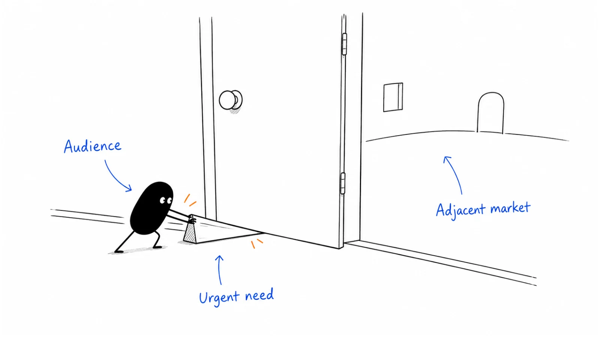

**Last reviewed:** 2026-09-07 · **Reading edit:** 2026-09-07

Your ICP says which customers you can serve well. It does not settle what you should help them do first.

An operations team may need better request preparation, fewer approval delays, cleaner records, and visibility into unfinished work. Your product could eventually address all four. Today, each promise means different software, evidence, onboarding, and conversations with buyers.

A wedge is the starting point you choose: **a specific audience and job where you can deliver a result worth adopting, with a plausible route to further opportunities.** It makes the next build and the next sales conversation concrete without requiring you to shrink the company's ambition forever.

The difficult part is choosing something narrow enough to do well but complete enough that someone cares. This guide walks through that choice, shows how it affects marketing and product work, and explains how to evaluate the next move.



Read in order for the reasoning, or jump to [the worked example](#worked-example-illustrative), [expansion decisions](#test-the-next-move-before-you-fund-it), or the [wedge card](#copy-wedge-card-fill).

## Use this when

You have a provisional [ICP](icp.md) and more possible workflows than you can pursue. Your website may describe an entire platform while prospects keep asking what they can actually do with it today.

You can also use this before your first customers. A proposed wedge helps you focus [validation](idea-validation.md) and early outreach. Call it a hypothesis until customers provide evidence; you do not need ten paying logos before making a starting choice.

For an established product, the same exercise helps evaluate a new market or a new use case. The question becomes what you can carry forward from the existing business and what you must learn again.

## Do not use this when

If the customer and problem remain vague, return to [idea discovery](idea-discovery.md). Narrowing a sentence does not establish demand.

Do not use a wedge to justify a major expansion from one enthusiastic inquiry. And do not mistake selecting a focus for proving [product-market fit](product-market-fit.md). You can make a careful choice and still discover that the offer is not valuable enough.

<a id="words-you-will-use"></a>

## A few useful terms

| Term | The decision it helps you make |
|---|---|
| ICP | Which company or team conditions make the offer a good match? |
| Wedge | Which audience-and-job combination will we emphasize first? |
| Current alternative | What would the customer use or do if they did not choose us? |
| Complete first result | What can the customer finish with the initial offer? |
| Expansion | Which additional job or audience might benefit from what we have already learned or built? |

The audience-plus-use-case framing is also used in [Emily Kramer's wedge strategy article, March 14, 2024](https://newsletter.mkt1.co/p/wedge-marketing-strategy?ref=b2b-playbook). Here it is a planning lens, not a universal formula. The exercises below ask you to examine the value, delivery requirements, and evidence for your own starting point.

You may encounter “pitch TAM” and “GTM TAM” in planning materials. Keep their purpose clear: a long-term market estimate is not the same as the group you can realistically serve and reach now. Neither becomes revenue merely because you put company names in a spreadsheet.

<a id="one-rule"></a>

## Keep this in mind

A useful wedge should make two things easier: delivering the first worthwhile result and learning where to go next.

That does not mean every business must become a broad platform. A focused product or service can be the intended destination. Nor does it mean a later unrelated opportunity is forbidden. If the second opportunity requires a substantially different product, buyer, and distribution approach, evaluate it as a new bet rather than assuming the first success makes it low-risk.

The benefit of focus is practical. People should be able to understand the offer, try it under realistic conditions, and explain what changed. You should be able to support that result without rebuilding the business for each customer.

## Narrow the promise, not the usefulness

Consider an imagined tool that formats one field inside a request. That is narrow, but it may save too little effort to justify another application. The buyer still has to find the missing approvals, coordinate with engineering, and track the response.

At the other extreme, “automate every operations workflow” asks customers to trust capabilities you may not have. It also leaves your team with no clear stopping point for the first version.

Between them is a complete result: prepare one supported type of correction request so that an engineer can review it without avoidable back-and-forth. The product need not execute the database change, manage every approval policy, or replace the support system. It does need to handle enough of preparation that the customer can use the output.

To find that boundary, follow the task through to its recipient. What must the operator provide? What does the reviewer need? What happens to exceptions? Where does your responsibility end? A narrow feature set is useful only if the remaining work does not swallow the benefit.

A wedge can include manual assistance while you learn. Make the assistance explicit and record its cost. If the customer is really buying your judgment, that may be a valuable service—but it is different from a software product that works independently.

## What makes the result worth switching for?

You do not need to claim “10× better” to choose a starting point. You do need a credible reason that a particular customer would prefer the complete experience over the alternative.

The advantage might be less review work, a shorter delay, a task that becomes possible for the first time, or a simpler way to meet an existing requirement. It may involve a tradeoff: faster preparation but more setup, or better coverage with a higher price.

Compare the full workflow. A demo that produces a draft quickly can still create more work if someone must inspect every line. Include setup, error correction, permissions, and the effort of maintaining another tool. Ask which changes matter to the customer rather than deciding on their behalf.

Use measured claims only when you have suitable evidence. If you observed one assisted pilot, describe that pilot and its limits. If the benefit is still a hypothesis, state what you plan to test. A large multiplier without a defined measure does not make an offer more convincing.

The alternative can be an incumbent product, an improved form, a specialist service, or choosing not to do the task. Be specific. “Doing nothing” is only accurate when the customer really leaves the problem unresolved rather than handling it in a way you have overlooked.

<a id="operating-method"></a>

## How to do it

<a id="step-1-name-the-10-pair-not-the-vision"></a>

### Step 1: write a small set of candidate starting points

Begin with the customer context from your ICP. List the jobs that appeared in discovery and validation, then describe each as an offer someone could evaluate. Two or three candidates are usually enough for a useful comparison; the number is a convenience, not a rule.

For each candidate, write the audience, recent situation, desired result, current alternative, required inputs, and what your offer would leave out. Include the evidence you have and the most important unknown.

Do not rank candidates only by how easy they are to build. A small feature can be easy because it does not address the difficult part of the job. Equally, a difficult implementation may be justified if the result matters and you can support it. The comparison needs both customer value and delivery reality.

Also ask whether the same offer could serve another similar account. If every promising conversation requires a different recipient, dataset, or approval process, you may be comparing several businesses under one feature name.

### Step 2: choose the uncertainty that could change the decision

One candidate may have demonstrated value but uncertain adoption. Another may attract requests while relying on a capability you cannot yet deliver. A third may already be handled well by an existing product.

Name what you need to learn before committing more effort. You might compare the output with the incumbent workflow, ask a reviewer to attempt a task, or discuss a bounded paid evaluation. Choose a test that can address the actual uncertainty.

Write down what would make you choose another starting point. “Stop if the improved form works equally well” is more useful than “keep going if people like the demo.” Preserve inconvenient outcomes instead of narrowing the definition of success afterward.

You can test a proposed wedge before deciding whether to build the full workflow. Return to [idea validation](idea-validation.md) for the test design. Wedge selection decides where to concentrate that learning; it does not replace it.

<a id="step-2-put-the-wedges-gtm-tam-in-the-crm"></a>

### Step 3: identify a reachable first audience

Separate the people who might fit from the people you can reasonably reach. Public company information, existing relationships, relevant communities, and customer referrals can help you find candidates. Qualification still requires evidence about their work.

For a sales-led offer, a short researched account list may be enough. A self-serve product might begin with a relevant search query, integration audience, or community where people discuss the task. You do not have to enumerate every future customer before testing demand.

Write where the next useful conversations could come from and why those people encounter the job. “We will post online” is too vague to evaluate. “We will ask operators who maintain correction queues to review the request packet” identifies both a participant and a useful action.

Keep the distinction from ICP intact: unknown need is not poor fit, and a public signal is not purchasing intent. A list should help you investigate; it should not turn guesses into confident outreach claims. Use [ABM strategy](../06-account-field-and-partner/abm-strategy.md) when suitable accounts require coordinated attention.

<a id="step-3-make-fuel-and-engine-for-that-pair-only"></a>

### Step 4: align the first customer experience

Write one plain-language offer and follow it through the customer journey. Does the page promise the same result the demo shows? Does onboarding ask for the inputs needed to achieve it? Does the product deliver the result to the person who needs it?

Build the minimum useful set of material around that journey. It might include a concrete workflow example, a comparison with the current approach, a sample output, and an explanation of what is unsupported. You do not need a large content library to begin.

Then choose a way to reach the audience that fits how the offer is evaluated. Targeted conversations can work for a complex pilot. A useful task-specific guide may support self-serve discovery. A service provider may introduce you when the problem arises in its work. These are options to test, not permanent pairings of channel and business model.

In the older worksheet, “fuel” means the material people use to understand the offer, and “engine” means how it reaches them. Keep the work concrete: a named page, demonstration, or guide, and a specific distribution method. See [content strategy](../03-brand-story-and-content/content-strategy.md) and [channel strategy](../04-channels-and-distribution/channel-strategy.md) for deeper planning.

### Step 5: review the result before widening the promise

Look at what customers actually completed, what they continued to use, and how much help they needed. Compare that with the alternative and the expectations you set.

A sale may justify another delivery cycle without proving that the offer is repeatable. A request for another feature may identify a blocker, an adjacent job, or a different product entirely. Keep those interpretations separate.

Choose a bounded next step. You may improve the current result, change the starting audience, or investigate a neighboring job. Do not expand simply because a broader headline sounds more ambitious. Equally, do not keep defending the original niche if repeated evidence shows a more useful starting point.

<a id="teaching-fill-inventednot-a-customer"></a>

## Worked example (illustrative)

This is a **fictional continuation** of the account comparison in [ICP](icp.md#compare-five-accounts-without-inventing-a-market). All requests, conversations, and decisions in this walkthrough are invented for teaching. They are not Ivan's customer research.

Your provisional audience is software operations teams with recurring correction requests, a preparation gap, and an available engineering reviewer. The ICP exercise included one paid pilot with repeat use and ongoing assistance. That is a reason to investigate further, not proof of a scalable market.

Now suppose the team is choosing what to offer in its next cycle.

### Three plausible offers, three different commitments

| Candidate | First result for the customer | What makes the choice difficult |
|---|---|---|
| Prepare review-ready requests | A packet for one supported correction type, with missing information flagged. | An improved form may be sufficient; founder help is still required. |
| Execute routine corrections automatically | A completed change after appropriate approval. | Requires execution reliability, permissions, recovery, and much more trust. |
| Show every operations queue in one dashboard | A shared view of unfinished work. | The team has not shown that visibility is the main problem or who would own it. |

The first candidate looks less impressive in a product announcement. It also sits closest to the work already observed. The second reaches further into a sensitive workflow. The third may be useful, but the evidence so far does not justify treating it as the customer's priority.

You choose request preparation as the next hypothesis because its remaining uncertainty is accessible: can it produce a better result than improving the form, with support you can realistically provide?

This does not establish that preparation is the best long-term market. It explains why you are testing it next.

### Define what the offer includes and leaves out

The initial scope covers one request type. The operator supplies approved information, the system organizes it and flags gaps, and an engineer reviews the packet. Unsupported cases go back to the existing process.

It does not execute changes, invent missing approvals, or decide that a request is safe. Those boundaries belong in the demo and onboarding, not only in an internal note.

The complete first result is a usable review packet. If the engineer still has to reconstruct it from the chat history, the product has not delivered that result even if every screen worked.

Before the next test, record the comparison with the existing form and the assistance allowed. Otherwise, an unusually hands-on founder can make a weak workflow appear finished.

### Let the narrow promise change the website

A broad headline might say “The AI platform for modern operations.” It leaves readers guessing whether the product manages tasks, executes changes, or analyzes performance.

An **illustrative headline** for this specific offer is: “Prepare correction requests for engineering review.”

Supporting copy can explain the current scope: organize the required information, flag missing inputs, and hand a packet to the reviewer. The next step is to evaluate one supported request type—not to connect production systems and hope the product handles everything.

You can still describe a broader direction separately. Make the distinction between available functionality and future plans explicit. Customers should not have to discover the difference during implementation.

### Handle the request that would pull you elsewhere

Imagine the customer asks for automatic execution during the next review.

**Customer:** Preparing the packet helps, but could you just make the correction too?

**Founder:** What work remains after the packet is ready? Is the delay still in approval, or in carrying out an approved change?

**Customer:** Some requests wait for approval. For others, the engineer has approved them but has not run the change.

**Founder:** Those sound like different situations. Let us separate them before deciding what to test next.

The conversation reveals a possible adjacent job. It does not make execution a small addition. You would need to examine the action, authorization, error handling, and responsibility for recovery.

Record the request without promising a release date. Continue testing preparation where it helps, while deciding whether a separate investigation of execution is worthwhile. A customer's broader ambition should inform the roadmap without silently rewriting the current agreement.

### Finish with a decision and a next question

For this cycle, you keep the preparation offer narrow and compare it with a better form. You measure usable outputs, clarification work, and your own support effort. You do not claim autonomous execution or reduced queue time until the evidence supports those outcomes.

If the form is adequate, stop or change this version. If customers repeatedly benefit and choose to continue under workable terms, investigate what they need next. Either result is more useful than adding the dashboard because the original message felt small.

## Two company stories: what can transfer into the next product?

These are historical examples of related product expansion, not claims that every early-stage company should follow the same sequence.

### Figma and FigJam: a neighboring activity needed its own space

In its April 21, 2021 launch account, Figma described people using its design environment for brainstorming and other informal collaboration. The team explored those behaviors and decided they needed a dedicated space. FigJam was introduced for designers to ideate with their extended teams, with connections to the existing Figma workflow.

The company reported pre-launch use by teams including Stripe, Netflix, and Salesforce. That is reported usage, not evidence of paid adoption. [Figma launch account, April 21, 2021](https://www.figma.com/blog/introducing-figjam/?ref=b2b-playbook).

A later interview describes a shared feedback channel with hundreds of alpha testers and decisions about what had to ship before launch versus later. [Figma product-team interview, February 8, 2022](https://www.figma.com/blog/jamming-on-figjam-a-journey-from-beta-to-ga/?ref=b2b-playbook).

**Our takeaway:** an existing collaboration context can give you a useful starting point for a related job. It does not remove the need to design and test a distinct experience. These company accounts do not establish how much growth came from that connection.

### Stripe Connect: a specific job within a much broader ambition

Stripe's April 28, 2022 retrospective describes Connect as a way for platforms to embed payments, onboard businesses, manage payments between parties, and pay out earnings. The job was more specific than “financial infrastructure”: a platform needed to support money movement for the businesses using it.

At that date, Stripe reported more than 10,000 software companies, marketplaces, and enterprises using Connect. The account describes adoption across several kinds of platform. [Stripe company retrospective, April 28, 2022](https://stripe.com/blog/connect-ten-years?ref=b2b-playbook).

**Our takeaway:** a clear operational job can remain recognizable while the audience broadens. This retrospective does not prove that each new segment had the same buying process or that expansion was easy. The figures are historical company reports, not independently audited outcomes here, and this case is not a reconstruction of Stripe's entire founding strategy.

## When a small offer is only a feature

A narrow result can be useful without supporting a standalone business. Ask how often the work occurs, how much it matters, and whether customers can reasonably buy and adopt another product for it.

Perhaps they want the capability inside an existing tool and will not maintain a separate workflow. An integration or partnership may be more plausible than a standalone application. Perhaps the job happens once and requires expert judgment; a service may fit better than a subscription.

Do not answer those concerns with an expansion slide alone. If the first offer is uneconomic, explain what the customer is buying now and how you will deliver it. Future cross-selling should not be the only reason the current arrangement appears viable.

Nor is a wedge automatically a durable competitive advantage. An incumbent may add a similar feature. Consider what customers would still value: a better workflow, specialized expertise, reliable integrations, trusted delivery, or another benefit you can actually maintain. Treat those as questions to test, not defenses that appear simply because you started first.

You can decide that a modest, focused business is worthwhile. The point is to understand the choice, including its limits.

<a id="step-4-plan-the-expansion-before-you-are-stuckand-do-not-expand-on-a-wish"></a>

## Test the next move before you fund it

An adjacent opportunity is promising when something useful carries over—not merely because the next buyer appears in the same organization chart.

Write the proposed move in two parts: what remains the same, and what changes. Then identify the evidence or capability you can reuse and what requires fresh validation.

| Proposed move | What might carry over | What needs a new answer |
|---|---|---|
| Same team, a neighboring job | Relationships, some inputs, familiarity with the workflow. | Does the team need the new result, and can it approve and use it? |
| Same job, a different audience | Core functionality, demonstrations, some implementation knowledge. | Are the alternatives, constraints, and buying process similar enough? |
| Different team and different job | Possibly reputation or a technical component. | Much of demand, delivery, pricing, and distribution may need retesting. |

These are starting questions, not automatic expansion paths. Even the first row can require a different budget owner or a substantial product change.

### Look for concrete reuse, not just a shared logo

In the fictional request-preparation business, an existing customer may introduce you to another operations team. That introduction improves access. It does not prove the other team has the same approval process or can use the same inputs.

Likewise, historical examples may help you design a new evaluation, but permission to use one customer's data does not extend to another customer or purpose. Reuse the learning without assuming you can reuse the records.

Ask what the first foothold actually saves: fewer discovery questions, a working integration, an established relationship, or a credible demonstration of a similar result. If the answer is only “they know our brand,” the new bet may still be worthwhile, but much of the work remains.

### Decide what evidence the new investment needs

A bounded expansion test might involve a walkthrough of the neighboring job, a clearly labelled prototype, and a comparison with the new audience's alternative. Agree in advance what would justify another iteration and how much effort you will spend.

Track the new segment separately from the original one. A strong combined usage number can hide weak adoption in the expansion. Note any discounts or founder assistance that differ from the established offer.

If customers want the new result but it requires a different delivery model, make that tradeoff explicit. You are choosing whether to build a new capability, not discovering that the existing product already serves the market.

### Protect the result that brought you here

Before redirecting people, identify what the current customers still need: maintenance, support, reliability work, or onboarding improvements. Expansion has a cost even when the new opportunity looks attractive.

You do not need to wait until every problem is solved. You do need a realistic plan for continuing to deliver the existing promise. A small test with a named owner and effort limit can coexist with the current focus; an unbounded second roadmap may not.

If the original segment still depends on repeated custom fixes, distinguish deliberate exploration from scaling. Use the profile maturity categories in [ICP](icp.md#if-you-have-several-profiles-give-each-an-explicit-role) to keep that difference visible.

## How to recognize useful expansion signals

**An existing customer asks for a related job.** Explore the recent situation behind the request. Determine whether it is a recurring need shared by other suitable accounts or a one-off exception. A request is a lead for research, not an automatic roadmap commitment.

**A new audience starts using the product without a special build.** Observe what it does, what value it gets, and whether the current support model holds. Do not assume its usage means it will buy under your existing terms.

**A partner sees the same problem in its clients.** Ask for concrete examples and a small evaluation. The partner may understand demand while underestimating implementation work or overestimating its clients' willingness to adopt.

**The first segment feels slow.** Check whether the constraint is awareness, evaluation, product usefulness, or market size. If the current offer fails to deliver value, adding another audience can multiply the same problem rather than solve it.

These signals help you choose the next investigation. None requires you to broaden the homepage immediately.

<Accordion title="What if prospects outside the wedge want to buy?">

Focus does not require turning away every unexpected customer. If the current product serves the job and you can meet the obligations, you can provide an appropriate path without making that audience the new marketing priority.

Be explicit about limitations and support. Do not imply that a purchase includes a custom roadmap. If you make an exception, record the reason, owner, and effort limit.

Keep these accounts visible in your learning. Repeated successful adoption outside the focus may reveal an expansion opportunity; repeated custom requests may reveal an expensive distraction.

Continue honoring existing customer commitments even when your preferred audience changes. A shift in marketing focus is not permission to stop delivering what you agreed.

</Accordion>

## Decide whether to deepen, expand, or change course

**Deepen the current wedge** when customers value the result but encounter avoidable friction in the supported workflow. Improving onboarding or reliability may be more useful than adding a neighboring job.

**Test an expansion** when you can name a plausible new need, explain what carries over, and investigate the remaining unknowns without losing the current delivery plan. Keep the investment proportional to the evidence.

**Change the wedge** when repeated tests show that the selected job is not valuable enough, the alternative is adequate, or the delivery model does not work for you. Preserve what you learned; do not require the new idea to look adjacent merely to make the story neater.

**Stay focused by choice** when the existing niche supports the business you want. Expansion is an option, not a graduation requirement. A roadmap should follow the opportunity and your objectives, not a belief that every product must become a platform.

## Copy: wedge card (fill)

This card is a decision record, not a promise that the strategy is proven. Copy it before the next test and append results afterward.

```text
Wedge decision
Date / owner / review date:
ICP version:
Audience + job:
Recent situation:
Current alternative:

Complete first result:
Required inputs and participants:
What we include:
What we do not provide:
Why a customer might switch:
Evidence / source / date:
Unknowns and contrary evidence:

How we can reach suitable people:
First page / demo / sample output:
Evaluation and onboarding:
Delivery effort and support:
Next test / effort limit:
What would change our choice:

Possible next audience or job:
What carries over:
What requires fresh validation:
Current customers we must support:
Decision now:
- Deepen / test expansion / change / stay focused
```

The separate [working file](../../templates/wedge.md) can also hold your notes. Its older “10×” field is a prompt to explain the advantage, not a requirement to invent a multiplier. Record an observed benefit or a clearly labelled hypothesis; use the more detailed card above when you need explicit evidence and decision boundaries.

<a id="pre-flight-checklist"></a>

## Before you start

- [ ] The audience and job are specific enough for someone to recognize the situation.
- [ ] The offer delivers a complete first result, not just an isolated feature.
- [ ] The current alternative and adoption effort are understood or named as unknown.
- [ ] The page, demo, onboarding, and delivery promise agree.
- [ ] Unsupported capabilities are visible to customers.
- [ ] The next test can change a named decision.
- [ ] Any expansion has a clear reuse hypothesis and fresh questions to validate.
- [ ] Current customer obligations and the effort limit are recorded.

## Metrics

Track the customer result first. Did the supported task get completed, with what assistance, and how did the experience compare with the alternative? Follow repeat use when the job recurs rather than assuming daily activity is appropriate.

Track the commercial and delivery picture alongside it: evaluations that started, purchases or continuations, setup effort, support work, and reasons for stopping. A new logo is useful context, but does not show whether the intended wedge is working.

For expansion, separate the new audience or job from the original one. Record which relationships, components, or distribution paths were actually reused. Compare the effort of acquiring and serving the new accounts without assuming a small sample gives a stable forecast.

Keep denominators, dates, and offer versions visible. Otherwise, a revised product and a changing audience can create a positive aggregate number that nobody can explain.

## Common mistakes

- **Choosing a niche by company size alone.** The starting job and why it matters still need to be clear.
- **Confusing narrow with incomplete.** A tiny feature is not enough if the customer cannot finish anything useful.
- **Using “10×” instead of evidence.** Specify the measure and comparison, or label the advantage as a hypothesis.
- **Changing only the headline.** If onboarding and delivery still expect a different customer, the experience remains broad and confusing.
- **Treating a familiar logo as proof of adjacency.** A neighboring team can have a different job, budget, and technical environment.
- **Expanding to avoid a weak result.** Diagnose the current offer before reproducing its problems in another segment.
- **Calling focus a permanent constraint.** Keep an explicit review point and let new evidence change the choice.

## What to read next

Use [ICP](icp.md) to refine the customer context and [idea validation](idea-validation.md) to test the offer. [Buying committee](buying-committee.md) helps identify who must participate in the decision, and [first ten customers](first-ten-customers.md) helps you find early accounts.

For the message and customer experience, continue to [positioning](../02-product-marketing/positioning.md), [homepage](../07-website-and-conversion/homepage.md), and [channel strategy](../04-channels-and-distribution/channel-strategy.md). Use [product-market fit](product-market-fit.md) to examine sustained demand before committing to a much larger growth effort.

## Sources and evidence boundary

Sources were checked on September 7, 2026. The audience-plus-use-case framing is attributed to Emily Kramer's publicly readable article linked above. Paid worksheets and subscriber-only expansion guidance are not reproduced.

The Figma and Stripe sections use dated company publications with links beside the claims. Reported usage and adoption are historical company accounts, not independently audited outcomes or proof that a wedge caused growth. They illustrate related product moves rather than reconstructing each company's full strategy.

The request-preparation example, dialogue, comparisons, test suggestions, and decision card are editorial guidance. The example is explicitly fictional. There is no universal “10×” requirement, customer-count threshold, or obligation to expand beyond a focused business.

---

Copyright © 2026 Ivan Xu. All rights reserved. See the [copyright and reuse terms](../../LICENSE).

Canonical source: [github.com/weilun88313/B2B-Playbook](https://github.com/weilun88313/B2B-Playbook)
