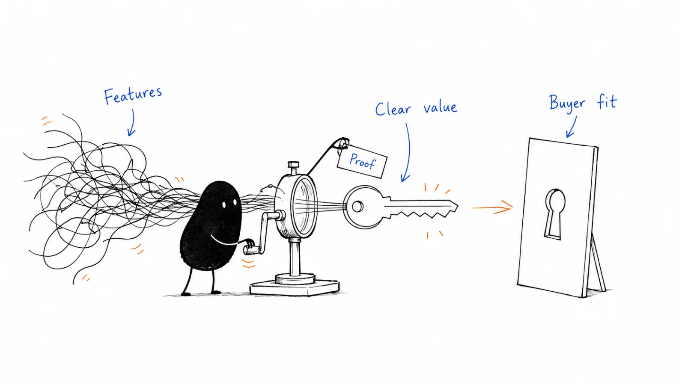

# 02 · Product marketing

Turn what you know about customers into a clear offer. Work through positioning, messaging, pricing, and the material people need to make a buying decision.

**Status:** Domain guide published · 10 tactic playbooks published

**Last reviewed:** 2026-09-06 · **Reading edit:** 2026-09-12

## Start here

- [Positioning](positioning.md) — current alternative.
- [Messaging](messaging.md) — one main promise.
- [Sales enablement](sales-enablement.md) — explain the problem.

## Playbook map

| Guide | What it helps you do |
|---|---|
| [Positioning](positioning.md) | How should the product be framed against the buyer's alternatives, and what is actually being positioned? |
| [Messaging](messaging.md) | How should positioning become a hierarchy of audience-specific messages? |
| [Competitive intelligence](competitive-intelligence.md) | What should teams know and do when alternatives enter the decision? |
| [Pricing and packaging](pricing-and-packaging.md) | How should the offer convert differentiated value into a number the champion can defend? |
| [Product launch](product-launch.md) | How should a product change become a coordinated market event—and when should it not? |
| [Sales enablement](sales-enablement.md) | How should positioning become a first meeting that helps the buyer choose? |
| [Demo](demo.md) | What must the product walk prove after the pitch, and how do we score it? |
| [Change friction](change-friction.md) | When value is prevention or a crowded stack, how do we qualify the fix? |

| [Value proposition](value-proposition.md) | What valuable outcome is promised, for whom, and why is it credible? |
| [Proof and claims](proof-and-claims.md) | Which evidence is strong enough to support each commercial claim? |

## Coming later

All topics in this chapter's original writing list now have published guides above. Further additions will follow reader questions and new evidence.

## Where to go next

Pick a guide above for the task you are working on, or browse [Brand, story & content](../03-brand-story-and-content/) for a related part of the work.

[Back to the playbook index](../README.md)

---

Copyright © 2026 Ivan Xu. All rights reserved. See the [copyright and reuse terms](../../LICENSE).

Canonical source: [github.com/weilun88313/B2B-Playbook](https://github.com/weilun88313/B2B-Playbook)
