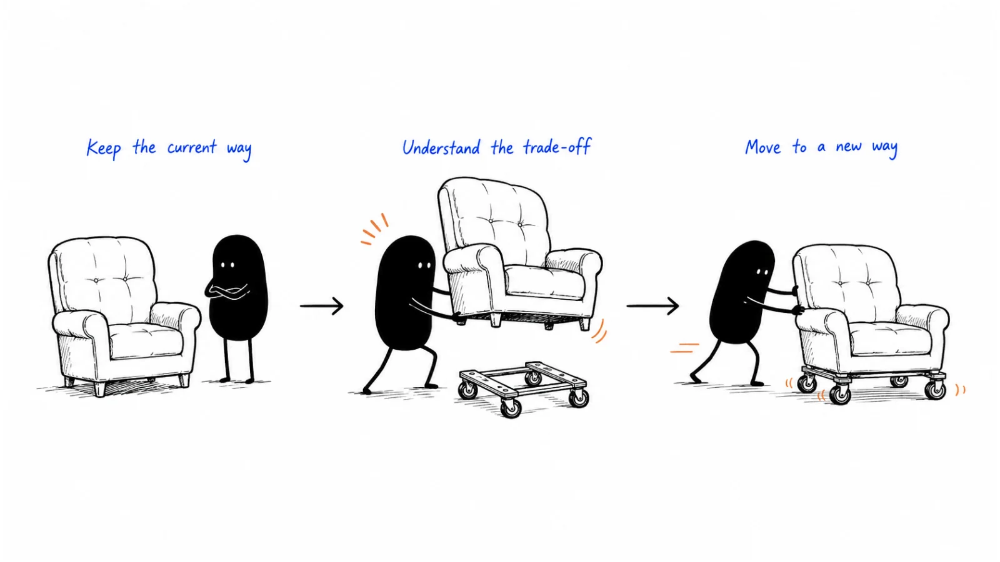

**Last reviewed:** 2026-09-07 · **Reading edit:** 2026-09-07

“I believe this would save us time. I just cannot ask the team to change another process this month.”

The seller hears a contradiction. If the problem matters and the solution looks useful, why wait?

The operations lead sees a different picture. Someone must check the data, explain the new process, answer questions, and keep requests moving while people learn. The person who benefits from a better handoff may not be the person doing that preparation. A successful purchase could still make next week harder.

That is the work this article is about.

Change friction is the effort, uncertainty, and disruption involved in adopting a different way of working. Some of it can be reduced. Some of it is necessary. Some of it reveals that your offer is not a good choice for this buyer right now.

Your job is not to make every concern disappear in a persuasive sentence. Help the buyer understand what changing would actually involve, compare it with realistic alternatives, and choose a next step they can responsibly take.



*Compare the current routine with the transition and the ongoing work—not just the promised destination.*

**Jump to:** [the running example](#worked-example-illustrative) · [finding the real obstacle](#find-the-part-of-the-change-that-is-hard) · [comparing the effort](#compare-staying-changing-and-improving-the-current-way) · [choosing a transition](#choose-a-transition-that-fits-the-risk) · [migration details](#make-data-migration-inspectable) · [AI adoption](#make-the-human-work-in-an-ai-offer-visible) · [copyable plans](#copy-change-card-fill).

## Use this when

A buyer likes the product but cannot see how to introduce it. A trial works for the enthusiastic administrator while everyone else returns to the old process. A proposal promises savings but says little about who will do the setup. Or the customer wants a new capability without replacing the system they already depend on.

This also applies to service businesses. Hiring outside help can introduce a new briefing format, approval step, communication channel, or dependency. No software migration does not mean no change.

Start with one real workflow. Ask what people would do differently on the first ordinary working day, not just what they would gain after a perfect rollout.

## Do not use this when

Do not relabel a missing capability as resistance to change. If the product cannot meet a necessary requirement, acknowledge the gap. If the buyer has not seen a relevant benefit, more implementation planning will not create one.

A polite “not now” is not permission to keep investigating someone's organization. Offer a useful next step, respect a refusal, and leave the conversation when there is no shared reason to continue.

You do not need finished positioning or a large buying committee before considering adoption. A solo user choosing a small tool may need only a clear import path and a way to recover their work. A consequential company-wide change needs more coordination.

This guide helps make the decision and transition legible. It is not a technical migration runbook, a substitute for security review, or a complete organizational change program. Use [customer onboarding](../08-lifecycle-and-customer-marketing/customer-onboarding.md) for the ongoing work of helping a customer reach useful results.

<a id="words-you-will-use"></a>

## A few useful terms

**Adoption** means using the new approach for relevant work. Creating an account, attending training, or signing a contract can support adoption without establishing it.

**Switching** means moving some responsibility away from an existing approach. Adoption can also be additive: a new analysis layer may be valuable while the existing system remains necessary.

**Transition effort** is the temporary work of getting from one approach to another. **Ongoing effort** is the work that remains afterward. Free setup changes who pays for part of the transition; it does not necessarily remove the work.

**Reversibility** describes what can actually be undone, by whom, and at what cost. Turning a feature off is not the same as reversing messages already sent or restoring overwritten data.

**Readiness** is specific to a proposed step. A team can be ready to review a sample but not ready to connect production data. Avoid reducing that difference to a permanent label of “good” or “bad” prospect.

<a id="one-rule"></a>

## Keep this in mind

A reasonable objection can point to a better design.

“We cannot train everyone this month” might suggest a smaller scope. “We need the old reports” might reveal a dependency your migration plan missed. “The reviewer is already overloaded” might show that your automation shifts work instead of reducing it.

But a smaller pilot is not always the answer. If there is no available owner, no permitted data path, or no meaningful benefit at a smaller scale, pausing can be the responsible decision.

Listen for what would need to be true for the proposed change to make sense. Then separate what you can deliver, what the buyer can arrange, and what neither side knows yet.

<a id="teaching-fill-inventednot-a-customer"></a>
<a id="worked-example-illustrative"></a>

## The change we will work through

This is a fictional continuation of the assisted request-preparation example. All organizations, conversations, quantities, and outcomes in the running story are invented for teaching. They are not Lensmor customer results.

The service helps an operations team prepare one supported type of record-correction request for engineering review. It organizes information and helps follow up on missing details. Engineers still decide whether and how to execute the change. The service does not change production records.

Earlier exercises produced useful handoffs, a paid bounded pilot, and repeat use at one company. Human assistance remained substantial. That is not proof that a self-serve product can do the same work independently.

Now imagine a different prospective customer. They use an existing request queue, shared instructions, and messages between operations and engineering. The operations lead likes the prepared handoff but worries about adding a second place to maintain each request.

The question is not “How do we convince them to abandon the queue?” It is “Can this preparation service improve a meaningful part of the work without creating more coordination than it removes?”

<a id="operating-method"></a>

## How to do it

### Find the part of the change that is hard

Begin with the last time the current process handled a relevant task. Follow it through the people, systems, and exceptions.

Who receives the request? Who notices missing information? Where is the authoritative status? How does an engineer know the request is ready? What happens when the requester answers late or sends a correction after review has begun?

Ask what works well too. The existing queue may have useful permissions, familiar notifications, or a trusted reporting history. Treating all of it as waste makes the seller less credible and the proposed transition less accurate.

Then ask which part of introducing your offer worries the buyer. Do not jump from “migration” to “we have an importer.” They might mean a reporting dependency, an overloaded administrator, or uncertainty about who fixes errors.

| What you hear | What may need clarification | A useful next piece of work |
|---|---|---|
| “Moving the data will be painful” | Fields, history, relationships, access, or cleaning effort? | Review a permitted sample and identify what transfers, changes, or stays behind |
| “Nobody will use another tool” | Extra steps, poor fit, missing training, or an unnecessary destination? | Walk through an ordinary task with an affected user |
| “We cannot take the risk” | Which failure, who is affected, and what recovery is possible? | Define the boundary, checks, and response with the responsible owner |
| “We do not have time” | No capacity now, too much scope, or too little expected benefit? | Estimate customer work and compare a smaller step with waiting |
| “We are already paying for something” | Remaining commitment, budget timing, or satisfactory existing capability? | Compare incremental cost and an appropriate decision window |
| “The team is not convinced” | Different needs, unresolved evidence, or a decision that has not been discussed? | Ask which question remains and who can help answer it |

These are questions, not a script for diagnosing people from a sentence. Several obstacles can coexist. A team can lack both capacity and confidence in the benefit.

**Seller:** “When you say another process, which part would your team have to maintain twice?”

**Operations lead:** “The engineer still works from our queue. If your service has a separate status, someone will be copying updates all day.”

**Seller:** “Could the queue remain authoritative, with a prepared packet attached only when it is ready for review?”

**Operations lead:** “Possibly. But late corrections must still reach the engineer. Show me how that handoff would work.”

The conversation has moved from a vague adoption concern to a concrete coordination problem. The seller has not solved it by suggesting an attachment. They have identified something to design and test.

<a id="step-1-classify-the-buyer-beyond-title"></a>

### Find the people who carry the change

The contact who wants a better result may not control the resources needed to introduce it.

In this example, the operations lead can nominate requests. An administrator may approve access. An engineer defines an acceptable handoff. Requesters supply missing information. Someone must cover the process when the usual owner is away.

Write down what changes for those people. Keep the list proportionate; you are not building a department chart for its own sake. The [buying committee](../01-strategy-and-buyers/buying-committee.md) guide helps with approval relationships. Here the focus is on work and responsibility.

Look for uneven costs. Operations might spend less time organizing requests while engineering spends more time correcting generated summaries. An aggregate time-saving estimate can hide that transfer.

Ask about capacity in terms of tasks. “Can someone help with implementation?” is easy to agree with and hard to schedule. “Who can review the sample field mapping and test one incomplete handoff?” is more concrete.

Do not volunteer the customer's colleagues on their behalf. A name in a plan is not acceptance. If the contact needs to check availability, mark the task as unconfirmed and leave the date conditional.

For a one-person business, the same person may approve, configure, learn, and use the tool. The constraint may be uninterrupted time rather than organizational consensus. A short setup guide can be more useful than a formal joint plan.

<a id="step-2-match-the-value-argument-to-that-buyer"></a>

### Understand what each person is protecting

People can support the same outcome and disagree about how to reach it.

The operations lead wants less chasing. The engineer wants a trustworthy request. An administrator wants controlled access and maintainable configuration. A manager wants the queue to keep moving during the transition.

Describe the benefit in terms each person can assess, without inventing a different product promise for each audience. “Less preparation work” cannot quietly become “no engineering review” in the budget conversation.

Also ask what must remain stable. A report, identifier, approval rule, or familiar escalation route may be important even when the interface changes. Preserving a useful convention can reduce learning without recreating every limitation of the old tool.

Avoid treating reluctance as a personality flaw. Someone who managed the previous failed rollout may have relevant information. Ask what failed and what would need to be different this time.

If people disagree about the goal itself, pause the implementation detail. A technically elegant migration cannot settle whether the organization wants a centralized process or independent team ownership. The responsible people need to make that choice.

## Compare staying, changing, and improving the current way

The alternative to buying is rarely an empty space where nothing happens.

The buyer can keep the process, improve its instructions, hire help, use an existing feature, or choose another provider. Compare your proposal with the plausible alternatives, not only with the worst version of the status quo.

Use the same scope and time period on both sides. Separate what has been observed from what is estimated. If you have measured current preparation time but only guessed future review time, keep the guess visible.

Include transition effort, ongoing work, and costs that remain. A retained system should not count as a retired subscription. Time saved is capacity, not automatically reduced payroll or additional revenue.

### Work through the numbers without manufacturing urgency

Suppose, for this invented comparison, the team handles 40 supported requests per month. Current preparation averages 30 minutes each, or 20 hours.

For planning, assume the assisted service leaves 12 minutes of customer preparation and review per request, or eight hours per month, plus two hours of ongoing coordination. That would leave ten hours of monthly customer work and release ten hours relative to the current routine.

Those are hypotheses to test, not results from the earlier fictional pilot. They concern preparation and associated coordination only. Engineering approval and execution still exist and are not counted as savings.

Now suppose the customer's initial setup and learning take 18 hours. Over the first three months, the current approach uses 60 hours. The proposed approach uses 18 setup hours plus 30 ongoing hours: 48 hours. The difference is 12 hours over that period, before considering service fees or other consequences.

If setup takes 30 hours instead, the first three months use 60 hours under either approach. Under the original 18-hour setup assumption, the setup effort is offset after 1.8 months at ten hours released per month, assuming the workload and estimates hold. That is an effort comparison, not financial payback.

The picture changes again if only 20 requests arrive each month. Current work would be ten hours. Proposed work would be four hours on requests plus the same two hours of coordination, releasing four hours per month. Offsetting 18 setup hours would take 4.5 months.

This is why “saves 60% on each request” is not a complete adoption case. Volume, coordination, setup, and the period that matters to the buyer change the decision.

Ask what the released time would make possible. It might reduce backlog, allow coverage during leave, or simply make a difficult routine less frustrating. Use the buyer's answer; do not assign a revenue value to every spare minute.

### Compare the risk of staying fairly

There may be meaningful consequences to leaving the current process unchanged: repeated rework, delays, missed obligations, or continued dependency on one person.

Use evidence tied to this workflow. Describe what happened, how often it was observed, and how confident the team is about the cause. A delayed request does not by itself prove lost revenue or an impending customer departure.

Where the concern is prevention, the absence of an incident does not prove that a product caused safety. Nor does a dramatic industry incident establish this buyer's probability of loss. Ask the responsible specialists to assess consequential risk rather than filling an ROI calculator with invented probabilities.

Include the risk of changing too. New permissions, unfamiliar controls, data mapping errors, or an overloaded reviewer can matter more than a modest time saving.

Sometimes improving the current checklist wins this comparison. That is useful information for your product and qualification, not a reason to exaggerate the inconvenience of staying.

<a id="step-3-write-the-three-hypothesis-pitch"></a>

### Describe what stays, what changes, and what remains unknown

Replace a vague promise of transformation with a short working description.

For the fictional offer: the existing queue remains the source of request status. The assisted service helps prepare one supported request type. Operations attaches the reviewed packet to the queue. Engineering retains approval and execution. Handling late corrections remains an unresolved design question.

That description makes an additive offer legitimate without pretending it removes a tool. It also makes the extra attachment and review work visible.

Identify what can stop if the new approach works. Perhaps operations no longer assembles the same packet manually. Do not remove a control merely because it looks like duplicate work; first understand why it exists and who can authorize a replacement.

Keep unknowns explicit. “We need to confirm whether attachments preserve the required history” is more useful than “migration should be straightforward.” Assign the next check instead of turning uncertainty into confidence for the proposal.

## Choose a transition that fits the risk

A transition can be small, broad, immediate, gradual, or unnecessary. Choose its shape around the work and consequences, not a universal rollout formula.

| Approach | When it may help | What to account for |
|---|---|---|
| Observe or shadow | You need to compare proposed output without changing the live workflow | Duplicate effort, permitted data, and the fact that observation does not test independent use |
| Bounded live use | One supported task or team can produce meaningful evidence | Selection bias, exception handling, and the boundary with work outside the scope |
| Staged rollout | Different groups can move at different times | Dependencies, inconsistent practices, and support across stages |
| Parallel operation | Continuity or comparison justifies temporary overlap | Conflicting updates, reconciliation effort, and which system is authoritative |
| Coordinated cutover | The workflow cannot sensibly be split, and preparation supports a single transition | Rehearsal, recovery, support capacity, and the consequences of failure |
| Keep or improve the current way | Change does not yet offer enough benefit for its cost | The unresolved problem, any interim improvement, and whether a future review is useful |

This is not a ladder every customer must climb. A simple tool may need a direct import and a short orientation. A high-consequence workflow may require a formal plan approved by people with the relevant expertise.

### Make a pilot answer a particular question

A pilot is useful when its scope can resolve uncertainty that matters to the next decision.

For the running example, a question might be: “Can operations prepare complete packets for this request type without creating conflicting status information or increasing engineering review work?”

Choose permitted inputs, a realistic mix of cases, and a way to record assistance and exceptions. Include incomplete requests if they are ordinary work, not just clean examples that make the service look good.

Explain what the pilot will not test. A few assisted handoffs cannot establish performance across every request type, independent use by every team, or long-term reliability.

Define the decision at the end: expand within an agreed scope, change the design and test a specific uncertainty again, continue a bounded service, or stop. Avoid “successful pilot” meaning whatever would justify the next sales stage.

Set a review point that fits request volume and the business calendar. Two weeks with no relevant requests may produce almost no evidence. A fixed deadline can still be useful for controlling the commitment; distinguish the end of the agreed window from completion of the learning.

### Avoid indefinite double work

Running old and new approaches together can reduce some risks while creating others.

In the example, keeping the queue is a deliberate boundary, not a temporary promise to replace it. Maintaining a second authoritative status inside the service would introduce a different problem.

Decide where updates belong. If a request changes after the packet is prepared, who notices, which version is reviewed, and how is the old packet marked? A shared identifier can help connect the work, but it does not reconcile conflicting information on its own.

If two systems must overlap temporarily, identify the reason for the overlap and what would allow it to end. Keep the reconciliation effort in the estimate. “We will sync everything” is not a plan until the supported fields, directions, exceptions, and failure handling are understood.

Do not force a cutover just to make the adoption dashboard look cleaner. If the overlap reveals that a necessary dependency has no safe replacement, resolve it or reconsider the move.

### A documented example: import is not the same as sync

Linear's public Jira guide distinguishes a one-time import from an ongoing connection. The two paths do not carry all information in the same way. The guide also states that Jira roles and permissions do not transfer and must be configured separately in Linear. Checked September 7, 2026. [Linear: Jira import & sync](https://linear.app/switch/jira-guide?ref=b2b-playbook)

For this article, the useful lesson is the shape of the disclosure: explain the transition options and the work that remains. A migration capability is not a promise that every field, access rule, and working convention moves unchanged.

This is a documented product-process example, not evidence that a particular rollout improved adoption or revenue. Confirm the current guide and the customer's configuration before making a migration commitment.

## Make data migration inspectable

“Bring your data” can conceal most of the work.

For the actual systems involved, identify the records and fields needed for the proposed scope. Check identifiers, relationships, attachments, dates, history, permissions, and downstream uses where relevant. Decide what should stay in the old system and how authorized people will find it later.

Do not assume copying everything is safer. Unnecessary historical data can introduce cost, confusion, and avoidable exposure. Equally, do not recommend abandoning history merely to simplify a sale. The customer needs to decide what their work and applicable obligations require.

Use an approved sample to inspect the mapping before committing to a broader move. “Owner” in one tool might mean relationship manager; in another it might mean the person assigned the next action. A matching column label does not establish matching meaning.

Check the path from import to actual use. Can the right user find the record? Does the report count it correctly? Are the necessary relationships intact? Is restricted information still restricted? An import completion message does not answer these questions.

### A documented example: a file needs matching rules

Attio's CSV guide requires attention to unique attributes when matching records, provides mapping and preview steps, and explains that empty values do not overwrite existing data. It also distinguishes CSV's capabilities from other migration routes: notes and tasks are not imported through that CSV path. Checked September 7, 2026. [Attio: Import data via CSV](https://attio.com/help/reference/imports-exports/csv-imports/import-data-into-attio-via-csv?ref=b2b-playbook)

The practical inference is narrow: naming a supported format is not enough to describe a migration. The buyer needs to know how identity, updates, and unsupported content are handled.

These are documented behaviors for this route, not a claim that Attio cannot move notes by any method, or that its importer guarantees a successful organizational transition.

### Explain recovery without promising a magic undo

Before a consequential change, establish the applicable backup, recovery, and verification process with the responsible technical owner. Keep it specific to the system. This article does not supply commands for moving or deleting customer data.

Ask what an undo would restore and what it would leave behind. A copied record might be removable while a notification, downstream automation, or external action cannot simply be unsent.

Preserving the old system can help recovery, but only if it remains usable and its relationship to new changes is understood. A stale backup does not automatically include work completed after the transition.

In the fictional service, pausing preparation is straightforward. Recovering a request whose outdated packet was already reviewed requires finding the affected work and notifying the responsible people. “No production write access” limits one risk; it does not make every consequence reversible.

<Accordion title="What if the buyer asks for a zero-effort migration?">

Ask which work they want your team to take on. File preparation, configuration, training, and verification are different services with different access and judgment requirements.

You may be able to provide substantial help. State the scope, cost, permissions, and customer decisions that remain. The seller cannot independently decide what a private field means or whether an approval rule can disappear.

If setup is included in the price, say so. Do not translate “we perform the setup” into “your team has nothing to do.” Someone may still need to authorize access, validate results, learn the workflow, and maintain it later.

Where the required assistance exceeds your delivery capacity, offer a narrower commitment or decline it. A reassuring promise that the delivery team cannot keep simply moves friction to the worst possible moment.

</Accordion>

## Help people learn the work, not just the interface

A training session can explain where to click while leaving the real adoption question unanswered.

Teach the task people will do: receiving an incomplete request, finding the source, preparing a handoff, responding to a correction, or escalating something outside the supported scope. Use appropriate sample material and let users ask about the cases that make their work difficult.

Make ordinary questions easy to ask. A named support route, a short task guide, and a clear escalation boundary may matter more than a large resource library.

Do not equate training attendance with readiness. Ask whether a person can complete the relevant task with the intended level of support. If assistance is part of the paid service, supported completion can be a valid outcome. Label it honestly.

Consider what happens after the launch advocate is absent. Who answers a new employee's question? Who notices that a checklist no longer matches the product? Who can change the configuration?

### Respect the work people have already built

Users may have developed templates, shortcuts, or informal coordination that the new offer overlooks. Understand their function before asking people to give them up.

Sometimes a workaround is compensating for a genuine gap. Sometimes it is no longer needed. Watching one ordinary task can distinguish the two better than describing the old process as outdated.

Explain changes to responsibility directly. If the new approach means operations checks a field that engineering previously checked, that is a workflow decision. It needs agreement and support, not a quiet rewrite of the setup instructions.

When a product changes job content, do not promise that nobody's role will be affected. That is an organizational decision the seller may not control. Explain the actual work the product changes and let the customer's responsible leaders address staffing and role decisions honestly.

## Make the human work in an AI offer visible

An AI feature can reduce drafting effort while adding verification, exception handling, and monitoring. The adoption plan needs to include that work.

Specify what the system produces and what it is allowed to do. Drafting a packet, recommending a status, and changing a live record carry different consequences. Start from the intended use and necessary permissions, not from the broadest capability available.

For the running example, generated text is a proposed summary. A person checks it against the source. The customer's engineer still approves and executes any record correction. Neither a polished paragraph nor a confidence indicator replaces that review.

Check whether the designated reviewer has enough context and time to catch a plausible error. A human approval button is not meaningful oversight if the person cannot inspect the basis for the suggestion or is expected to approve faster than they can read.

**Engineer:** “If the summary looks complete, people may stop checking the original request.”

**Seller:** “Then we need to make the source and unresolved fields visible at review. We should not label a packet ready just because the text was generated.”

**Operations lead:** “That could still add another check. We need to measure my preparation time and the engineer's review time together.”

**Seller:** “Agreed. If the work simply moves to engineering, we should record that rather than call it a saving.”

The proposal becomes more useful by admitting this possibility. It gives the team something concrete to assess.

Record manual interventions during evaluation. If the vendor quietly repairs difficult outputs, the customer cannot tell what normal use would require. Assisted delivery can be valuable; undisclosed assistance makes the evidence misleading.

Define what happens when the output is wrong, the service is unavailable, or an input falls outside the agreed scope. The fallback should preserve necessary controls, not invite people to bypass them because the new tool is down.

If the model, prompt, integration, or workflow changes materially, revisit the relevant checks. A past evaluation describes the conditions tested, not every future version. Keep that maintenance work in the ongoing ownership plan.

<a id="step-4-qualify-readiness-on-the-fix-not-the-fear"></a>

## Agree on a step the team can actually support

Readiness is a conversation about a specific commitment.

For the fictional service, the team might be ready to inspect a sample handoff now, prepare access next month, and consider a bounded live evaluation after the engineer returns from leave. Those are different commitments, not one yes-or-no attitude toward change.

Write a short shared plan when coordination warrants it. Include the desired result, scope, tasks, owners, dependencies, review point, and stopping conditions. Mark proposed dates as proposed until the people doing the work accept them.

Separate evaluation approval from purchase approval and production approval. A contact willing to try a sample may have authority for none of the other two.

Avoid turning the plan into a list of dates chosen to match the seller's quarter. A renewal or operational deadline can be relevant if real. An invented deadline does not create implementation capacity.

**Operations lead:** “We can review the packet this week, but engineering cannot support live requests until next month.”

**Seller:** “Then the current step can be a sample review. We should not start a live trial that depends on their availability.”

**Operations lead:** “Send the field list and the questions they need to answer. I will confirm whether the proposed review date works.”

**Seller:** “I will mark access and live evaluation as unapproved. After the review, we can decide whether a next step is worth scheduling.”

The seller has preserved momentum where it is real without pretending the team has agreed to more.

### Make the commitment commercially clear

If an evaluation or migration service is paid, state what the payment covers and what happens afterward. If it is free, still explain its limits and the work expected from the customer.

A discount can address a budget constraint or overlap cost. It does not provide an unavailable engineer, make an unsupported integration work, or establish that the new routine is worthwhile.

Do not conceal a broader recurring commitment inside a small-looking pilot. Equally, do not promise open-ended assistance without considering delivery capacity. Work from the actual [pricing and packaging](pricing-and-packaging.md), with appropriate review of consequential terms.

<Accordion title="What if the customer wants to wait until the existing contract ends?">

Find out whether the timing is about cash, attention, satisfactory current service, or a combination. Do not assume an existing contract is merely an objection to overcome.

A useful next step might be a limited requirements review before their planning window. It might also be no work at all until they are ready. Ask whether a future follow-up would be welcome rather than creating repeated reminders for them.

If overlap support or a commercial concession is available, explain its actual terms. It can change the cost comparison, but it does not remove migration effort or make an unnecessary switch valuable.

Use real dates supplied by the customer and avoid giving legal interpretations of their current agreement. When there is no shared next step, record the pause accurately and stop treating the opportunity as an active rollout.

</Accordion>

## Hand the promise to the people who will deliver it

Before a customer starts, the delivery owner should understand what was promised and what remains conditional.

Transfer the agreed scope, relevant evidence, open questions, customer responsibilities, assistance level, and exception path. Include the items deliberately left unchanged. Otherwise the onboarding team may try to migrate something the buyer was explicitly told could stay.

Give the customer a usable summary too. A plan stored only in the seller's CRM does not help the person introducing the process.

As work begins, update the plan with actual effort and discoveries. If a dependency makes the original date unrealistic, explain the change. Do not quietly reduce verification or training to preserve the appearance of an on-time launch.

The handoff is not complete merely because another team has been introduced. Confirm that the next owner has accepted the work and that the customer knows where to go with the first problem.

For a founder doing sales and delivery, the same discipline still helps. A written boundary prevents an optimistic conversation from becoming an unlimited personal commitment.

<a id="copy-change-card-fill"></a>

## Copy: a change decision note

Keep the note short enough for the people doing the work to correct it. “Unknown” is useful when paired with a next check. Do not fill gaps with guesses just to make the document look complete.

```text
CHANGE DECISION NOTE

Task and proposed scope:
Current routine and what already works:
Problem observed, with source and date:
Alternatives, including improving the current way:

What stays:
What changes:
What work can stop, if validated:
New work and who carries it:

Expected benefit:
Evidence versus assumptions:
Customer transition effort:
Ongoing effort, fees, and retained costs:
Risks of staying and changing:

Unresolved question:
Smallest useful next step:
Required people, capacity, and permissions:
Who has accepted the work:
What is not approved:

Decision: proceed / investigate / pause / stop
Reason and review point, if wanted:
Owner and last updated:
```

## Copy: a bounded transition plan

Use this after there is a shared reason to do the work. For a small adoption, several lines may be enough. For a consequential migration, link to the approved technical and operational plans rather than treating this outline as a substitute.

```text
BOUNDED TRANSITION PLAN

Desired result and decision this work supports:
Included tasks, users, data, and period:
Explicitly excluded:
Current authoritative system:
Where new work and corrections are recorded:

Preparation task -> owner -> dependency -> agreed date:
Data mapping and access checks:
Practice task and intended assistance level:
Support and exception route:

Evidence to collect:
Baseline and comparison scope:
Customer and vendor effort:
Quality, rework, and unresolved cases:
Manual assistance to disclose:

Conditions for starting:
Conditions for pausing:
Recovery owner, method, and limits:
Review point and decision owner:
Criteria for expanding, changing the plan, or stopping:

Ongoing owner and handoff:
Open questions:
Last confirmed by the relevant owners:
```

<a id="pre-flight-checklist"></a>

## Before you start

Take one request through the proposed routine with the people who understand it. Can they tell where work happens, who checks it, and what to do when something changes?

Confirm the permissions and sample suitability before handling customer data. Confirm capacity before putting an owner's name next to a date. Confirm recovery limits before describing the change as reversible.

Check the comparison for retained costs, shifted work, and optimistic assumptions. Make sure the customer can choose to wait or stop without your summary turning that decision into a failure of courage.

Then choose a next action that resolves something real. It can be small. It should not imply approval for a larger commitment.

## Metrics

Measure whether the change supports useful work and what it costs to get there. Keep the unit, period, and population visible.

| Measure | What it can help diagnose | What it does not establish |
|---|---|---|
| Time from agreed start to first useful task | Setup delays and time to an initial result | Repeat use, independence, or full rollout success |
| Relevant tasks completed through the new routine | Use within the intended scope | Universal adoption if some tasks were excluded or had not occurred |
| Customer and vendor effort | Setup burden, support needs, and work shifted between teams | Cash savings unless the financial effect is separately established |
| Rework, exceptions, and incorrect outputs | Quality problems and places the process needs support | Reliability across untested conditions from a small sample |
| Continued use when relevant work recurs | Whether the routine survives beyond the first demonstration | Causal retention improvement without an appropriate comparison |
| Pauses and stops, with reasons | Capacity constraints, missing capability, or an unsuitable plan | Bad qualification in every case, or failure by the customer |

For example, suppose 20 eligible requests arrive during a fictional evaluation. Twelve use the new path, six remain in the old queue because their users have not been introduced to it, and two pause because required permission is missing.

Usage among all eligible requests is 12 out of 20, or 60%. If someone reports 100% because all twelve started requests finished, they are describing completion among starters, not adoption across eligible work. Both denominators can be useful; neither should conceal the other.

If all twelve needed vendor assistance, label that result assisted. Compare effort and quality for a suitable set of tasks rather than assuming the cleanest completed cases represent the entire workload.

Do not label every onboarding delay a sales qualification failure. Capacity can change, products can fail, and new requirements can emerge. Investigate the cause before changing the qualification rule.

## Common mistakes

**Treating every pause as fear.** Sometimes the buyer has a better use for their time. Ask enough to understand the decision, then respect it.

**Calling an additive product worthless unless it removes a tool.** Added capability can justify added complexity. Show the full trade-off instead of inventing a replacement.

**Selling the future routine without the transition.** The destination may be attractive while setup is unaffordable this quarter. Put temporary and ongoing work next to each other.

**Promising effortless migration because an importer exists.** Mapping, access, exceptions, verification, and learning still need owners.

**Removing safeguards to show faster adoption.** Permission checks, appropriate review, and recovery preparation are not clutter merely because they slow a rollout.

**Using a pilot as a disguised purchase commitment.** State the boundary, decision, costs, and what happens if the result is disappointing.

**Counting shifted labor as saved labor.** Include the reviewer, administrator, and vendor assistance, not only the person whose task became faster.

**Calling a shared document a shared plan.** Agreement comes from the people accepting the work, not from sending them a link.

## What to read next

Use [Demo](demo.md) to make the proposed work inspectable before asking for commitment. Use [Buying committee](../01-strategy-and-buyers/buying-committee.md) to understand who can approve the necessary steps, and [Pricing and packaging](pricing-and-packaging.md) to make the commercial commitment clear.

Continue with [Customer onboarding](../08-lifecycle-and-customer-marketing/customer-onboarding.md) for delivery and first-use support. If a partner carries part of the transition, use [Ecosystem](../06-account-field-and-partner/ecosystem.md) to clarify the joint responsibilities rather than assuming a partner logo means implementation is covered.

## Sources and evidence boundary

This is an owner-maintained educational synthesis. The request-preparation story, conversations, calculations, and templates are original teaching material, not customer research or a validated universal change-management framework.

Primary sources checked September 7, 2026:

- [Linear: Jira import & sync](https://linear.app/switch/jira-guide?ref=b2b-playbook) supports the specific distinction between migration paths and the separate configuration of permissions. It does not establish a commercial outcome.
- [Attio: Import data via CSV](https://attio.com/help/reference/imports-exports/csv-imports/import-data-into-attio-via-csv?ref=b2b-playbook) supports the matching, preview, update, and content-limit examples for that import route. Check current documentation for an actual migration.
- [Insight Revenue: Selling Cyber 2026](https://www.insightrevenue.com/insights-posts/selling-cyber-2026?ref=b2b-playbook), published April 17, 2026, informed the earlier edition's attention to implementation effort and shared planning. Its cybersecurity context is not a universal qualification rule. This guide does not reproduce its training framework or claim affiliation.

The operational suggestions around these examples are editorial reasoning, not reported vendor results. No customer system was accessed or migrated to produce this article.

---

Copyright © 2026 Ivan Xu. All rights reserved. See the [copyright and reuse terms](../../LICENSE).

Canonical source: [github.com/weilun88313/B2B-Playbook](https://github.com/weilun88313/B2B-Playbook)
