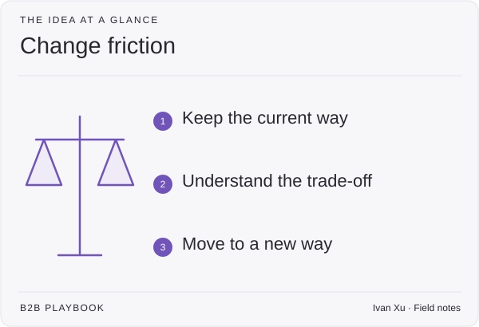

**Last reviewed:** 2026-08-30 · **Reading edit:** 2026-09-06

A buyer can agree that your product is better and still decide to stay put. Switching takes time, creates risk, and affects other people. Make those costs visible so the buyer can compare the effort of changing with the cost of doing nothing.

*Reading guide: keep the current way · understand the trade-off · move to a new way.*

## Use this when

- The stack is already full and every vendor claims the same threat.
- Buyers nod at the problem and stall on implementation.
- Value is “nothing bad happened,” so Finance asks if they overspend.
- You sell into a buying group that includes security, infra, legal, finance, and users who hate friction.

## Do not use this when

- Positioning is empty. Complete [positioning](positioning.md) first.
- The first meeting still has no insight. Write [sales enablement](sales-enablement.md).
- You need clocks for launch vs value. That is [customer onboarding](../08-lifecycle-and-customer-marketing/customer-onboarding.md).
- You need partner economics. That is [ecosystem](../06-account-field-and-partner/ecosystem.md).

## A few useful terms

| Word | Meaning here |
|---|---|
| **Reduce** | Risk, exposure, incidents, hours—named, not “better security.” |
| **Replace / simplify** | Which tool, process, or effort goes away. If nothing leaves, you are noise. |
| **Cost of inaction** | What a miss costs *this* buyer (revenue, trust, coverage)—not a global breach statistic. |
| **Friction of the fix** | Time, owners, other teams, workflow change the purchase imposes. |
| **Joint success plan** | Shared path: objectives, obstacles, owners—before papering. |

## Keep this in mind

**Lead with the implementation conversation.** A nod on the problem is not a buying signal when they have six thousand alternatives. If they will not imagine a different way of working, they are not qualified—even if the need is obvious. Slow down to find out, or you will win a deal that cannot adopt.

## How to do it

### Step 1: classify the buyer beyond title

Maturity (basics vs architecture). Operating philosophy (how they already designed the stack). Decision style (check-the-box vs prioritized risk). Whether the category is cost or advantage. The buying group is still [buying committee](../01-strategy-and-buyers/buying-committee.md). This step is *how they decide in this category*, not another persona worksheet.

### Step 2: match the value argument to that buyer

Risk reduction, operational impact, business enablement—pick the one this room can defend. Preferences move. Find the mobilizer and who they must bring for budget. Do not recite a 24-role website.

### Step 3: write the three-hypothesis pitch

Before the proposal:

1. What does this **reduce** (for them)?
2. What does this **replace or simplify** in the current stack?
3. What happens if they **do not** change—in a number they own?

If you cannot answer (2), you are adding a tool. If you cannot answer (3) without a vendor-global stat, you do not have insight.

### Step 4: qualify readiness on the fix, not the fear

Name the other teams the change will touch (infra, HR, DevOps, users). Ask whether they will staff the new working rhythm. If they want point-in-time theater and you sell continuous flow, that is a no. Put the obstacles in a **joint success plan** in the proposal—not in a post-sale surprise. [Customer onboarding](../08-lifecycle-and-customer-marketing/customer-onboarding.md) inherits that plan.

A partner motion still needs a crisp proposition the partner can run and a joint plan with metrics—not a logo slide. Detail stays in [ecosystem](../06-account-field-and-partner/ecosystem.md).

## Worked example (illustrative)

Sales-assist “security questionnaire” product. Not a 6,000-vendor industry fact.

| Field | Fill |
|---|---|
| Reduce | Hours from request to packed answer; missed-audit risk the CFO already named. |
| Replace | Spreadsheet + shared drive + two engineers on every deal. |
| Inaction | Two enterprise renewals delayed last quarter waiting on packs—AE-sourced, not a headline. |
| Friction | Security must accept a new owner; sales ops must stop the shared folder. If they will not, we stop. |
| Joint plan | Kickoff owners, first pack date, what “done” looks like—attached to the proposal. |

## Copy: change card (fill)

- Buyer type (maturity / philosophy / risk vs compliance / cost vs advantage):
- Mobilizer and who they need for budget:
- Reduce:
- Replace or simplify:
- Cost of inaction (their number):
- Friction of the fix (teams, time, workflow):
- Ready to change? (yes / not this year):
- Joint success plan (objectives · obstacles · owners):

## Before you start

- [ ] The first-meeting insight still matches [sales enablement](sales-enablement.md).
- [ ] Replace/simplify is named; we are not “and also.”
- [ ] Inaction uses their evidence, not a global incident list.
- [ ] Implementation is in the proposal.
- [ ] A nod is not a stage move.
- [ ] We did not paste a cyber report’s 6,000-vendor line as our market.

## Metrics

| Metric | Diagnostic use |
|---|---|
| Proposals with a joint success plan | Whether the fix is sold |
| Wins that stall in onboarding | Qualification failure |
| Deals killed for unreadiness | Honesty |
| “Replace” named vs feature bake-off | Context vs noise |

Do not count webinars attended, or resemblance to a Challenger-adjacent PDF, as change selling.

## Common mistakes

- Feature bake-off in a prevention category.
- Deferring implementation until after signature.
- Global breach stats as their cost of inaction.
- 24 personas, no decision style.
- Channel logos without a joint plan.
- Treating a vertical report as the only motion this library serves.

## What to read next

The meeting story is [sales enablement](sales-enablement.md). The walk is [demo](demo.md). The committee is [buying committee](../01-strategy-and-buyers/buying-committee.md). The work after they sign is [customer onboarding](../08-lifecycle-and-customer-marketing/customer-onboarding.md). Partners are [ecosystem](../06-account-field-and-partner/ecosystem.md).

## Sources and evidence boundary

This is an owner-maintained operating synthesis. It is not Insight Revenue training, not a Gartner Challenger license, and not a cybersecurity market map.

Buyer-type lenses, value matched to the room, leading with implementation (“friction of the fix”), three questions (reduce / replace / inaction), and a joint success plan before papering are distilled from a public buyer-intelligence essay on selling in a crowded prevention category ([Insight Revenue, *Selling Cyber 2026*](https://www.insightrevenue.com/resources/selling-cyber-2026?ref=b2b-playbook); long form also at [their insights post](https://www.insightrevenue.com/insights-posts/selling-cyber-2026?ref=b2b-playbook)). That report is a **method prompt**, not a source to copy. Vendor counts, named incidents, B.R.I.D.G.E.™, training offers, and cyber-only claims are **not** this library’s facts or a requirement to buy advisory.

---

Copyright © 2026 Ivan Xu. All rights reserved. See the [copyright and reuse terms](../../LICENSE).

Canonical source: [github.com/weilun88313/B2B-Playbook](https://github.com/weilun88313/B2B-Playbook)
