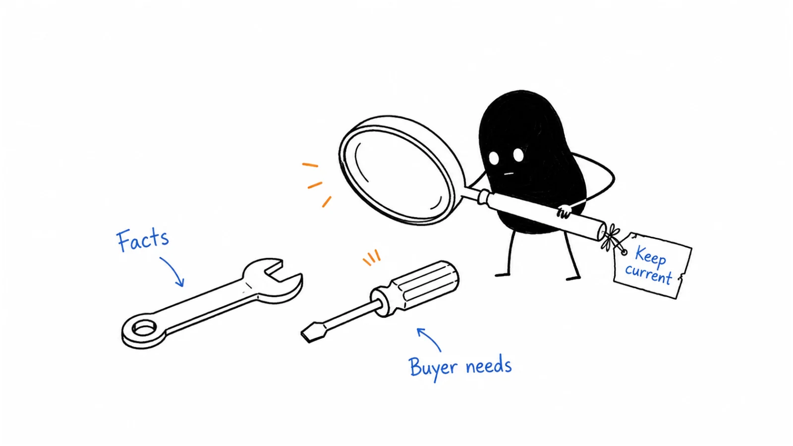

**Last reviewed:** 2026-09-07 · **Reading edit:** 2026-09-07

“Can we still say they don't support approvals?”

The question arrives just before a customer call. The sales card says no. Someone has posted a screenshot of the other supplier's release notes saying yes. The comparison page has not been checked in months.

There are several possible answers. The feature might be available only in a different plan. It might be a preview with a narrower scope. It might now meet the customer's requirement perfectly well.

What you cannot safely do is keep repeating the old sentence because it helped in the last deal.

Competitive intelligence helps a team make decisions about alternatives using information it can inspect. Sometimes the result is a better sales explanation. Sometimes it is a product question, a pricing correction, a partnership opportunity, or a decision to stop pursuing an account.

The useful output is not a complete picture of every competitor. It is an answer to an important question, with enough context to know when that answer applies and what remains uncertain.



*Follow a buyer's actual decision from the first mention of an alternative to a checked comparison and a useful next action.*

**Jump to:** [the running example](#worked-example-illustrative) · [what to research](#how-to-do-it) · [checking evidence](#step-3-use-sources-that-survive-a-spot-check) · [the sales card](#step-4-write-the-card-sales-will-paste) · [learning from losses](#investigate-the-decision-after-the-deal) · [copyable records](#copy-alternative-card-fill).

## Use this when

Buyers keep mentioning alternatives and the team answers differently each time. A comparison page contains claims nobody can trace. A competitor announces something important and you are not sure whether to respond. Or product planning is being driven by screenshots of whatever another company shipped last week.

This guide also applies before you have many sales conversations. You may need to understand a category, evaluate a new segment, or investigate an emerging substitute. Those questions are legitimate; they just need to stay distinct from evidence about current deals.

Start with one decision you need to improve. It is much easier to build a useful research habit around a real question than around the instruction to “keep an eye on everyone.”

## Do not use this when

If you need the details of one prospective customer's business, start with [account research](../05-outbound-and-prospecting/account-research.md). If you need to decide how your offer fits a market, use [positioning](positioning.md) alongside this work.

Competitive research cannot determine whether your own product works. It also cannot substitute for learning why customers use it or whether your economics are sustainable.

A competitor's success is not proof that you should copy their product, price, or channel. You may be observing a different customer base, delivery model, or stage of business.

<a id="words-you-will-use"></a>

## A few useful terms

An **alternative** is an option the buyer could use to address the task. It may be a vendor, an internal tool, a service provider, or the current process.

A **signal** is something worth checking: a changed page, a buyer comment, a release announcement. A **finding** states what the evidence supports. An **interpretation** explains why that might matter. A **recommendation** proposes what to do next.

A **battlecard**, called a sales card here, is a short internal aid for a specific comparison. It should help someone ask better questions and explain supported differences. It is not automatically suitable to forward to a customer.

A **watchlist** holds developments relevant to future decisions. A **complement** helps deliver or distribute an offer rather than necessarily replacing it. The same company can be a complement in one situation and an alternative in another.

<a id="one-rule"></a>

## Keep this in mind

Keep the observation separate from the conclusion.

“The pricing page now mentions an enterprise plan” is an observation about a page. “They are moving upmarket” is an interpretation. “We should lower our price” is a proposed response that needs much more reasoning.

When those statements get collapsed into one confident alert, a team can spend days reacting to something it has not actually established.

Keep unknowns visible too. “Not found in the documentation we checked” does not mean “not supported.” A blank field needs a label and, when the question matters, an owner who will resolve it.

<a id="teaching-fill-inventednot-a-customer"></a>
<a id="worked-example-illustrative"></a>

## The buying situation we will follow

The running example is fictional. It continues the request-preparation business from the previous articles. No supplier behavior, customer interview, or outcome in this scenario is a claim about Lensmor or a real competitor.

The business provides assisted preparation of one supported type of record-correction request. It organizes the information and helps follow up on gaps. The customer's engineers review the request and decide how to execute the change. The service does not make production changes.

Earlier exercises produced some usable handoffs, and one company paid for a bounded assisted pilot and used it again. Human involvement remained significant. The software's independent contribution has not been established.

Now imagine an operations lead considering three approaches: improving the existing form, buying a workflow tool from another supplier, or paying for the assisted service.

The founder initially wants a list of features that makes the service look strongest. The buyer wants to know who will collect missing information, whether engineering receives a usable request, what setup is required, and how much work remains with the team.

Those questions change the research.

An approval button matters only in the context of the work it supports. A low subscription price may not include setup or follow-up. Human assistance may be valuable, but it also has boundaries and a cost. The existing form may already be sufficient.

A useful comparison needs to leave room for all of those possibilities.

<a id="operating-method"></a>

## How to do it

Build a small loop: define the decision, collect relevant evidence, check its scope, write the implication, and put the result where someone can use it.

Keep research notes separate from public copy. Private notes may contain buyer-specific context, unresolved hypotheses, or licensed material that does not belong on a comparison page.

<a id="step-1-steal-the-list-from-deals-not-from-a-radar-slide"></a>

### Step 1: Choose the questions that deserve attention

Use current buying conversations to identify immediate comparisons. Ask what the buyer actually considered, what they already use, and what they would do if your offer were unavailable.

Do not require a fixed number of mentions before investigating a consequential question. One large evaluation with an unfamiliar alternative may warrant research. Equally, a competitor that attracts attention on social media may have little relevance to the decision in front of you.

Separate the work into three practical groups.

| Research group | Why it belongs here | Appropriate output |
| --- | --- | --- |
| Active comparison | It affects an evaluation, renewal, or current sales claim | A checked answer or short sales card |
| Strategic watchlist | It could affect a segment, business model, or future product decision | A dated hypothesis and evidence to watch for |
| Adjacent or complementary offer | It may help deliver the workflow or reach customers | A partnership or integration question |

The groups can change. A watchlist company may appear in a real deal. A partner may introduce an overlapping offer. Reclassify it based on the situation, not loyalty to the old spreadsheet.

For the fictional service, the existing form belongs in the active comparison. A newly announced workflow tool might belong on the watchlist until the buyer says they are evaluating it. Once they do, it deserves a focused check.

An engineering consultancy could be an alternative if it prepares the same requests, or a complement if it implements the internal workflow. Find out which role it plays before writing the card.

### Set a stopping point for the research

Write the decision and the facts needed to make it.

“Research this company” can expand indefinitely. “Check whether the offer includes human follow-up for missing request information, and under what conditions” has a useful boundary.

For a small team, start with the unresolved comparison that is most likely to change a live conversation. Add strategic questions when there is a decision they could inform. There is no universally correct number of cards.

If the question cannot be resolved from the available material, say so. Decide whether a transparent inquiry, an authorized evaluation, or a narrower claim is worth the effort. Do not keep gathering unrelated facts to make an incomplete answer look substantial.

<a id="step-2-separate-research-from-the-card"></a>

### Step 2: Make a record another person can inspect

For each important finding, keep the source, the date you checked it, the relevant product or plan, and a short explanation of what the material establishes.

Where practical and permitted, retain a dated excerpt or snapshot with enough surrounding context to understand it. A URL can change after you open it. Keep publication dates, access dates, and the date of the event distinct.

A useful entry in the fictional research notes might read:

“Public release note, checked today: the supplier announces an approval step for a limited preview. The note describes routing to an approver. It does not establish whether the tool gathers missing request information or provides human follow-up.”

That is an invented record for teaching. It shows why “approvals: yes” would lose important information.

Research sources answer different questions:

| Source | Useful for | Important limitation |
| --- | --- | --- |
| Official product documentation | Described capabilities, setup, limits, supported versions | May omit edge cases or lag the product |
| Official pricing and terms | Published plans, billing units, inclusions and conditions | May not match a negotiated or regional offer |
| Release notes and announcements | What the supplier says changed and when | Announcement is not proof of general availability or customer results |
| Authorized hands-on evaluation | What happened under recorded test conditions | One configuration does not represent every customer |
| Buyer interview or account notes | What mattered in a particular decision | Recall, incentives, and incomplete visibility affect the account |
| Independent reviews or discussions | Problems and language worth investigating | Selection bias, age, and uncertain product versions limit conclusions |

An official page is a primary source for what a company says. It is not independent verification of every performance claim on the page.

A buyer's account of their experience may be the best available source for a decision you are investigating. Keep it attributed internally and avoid turning it into a universal product judgment.

### Preserve conflicting evidence

Suppose the homepage says approval workflows are available, the documentation describes a preview, and a buyer says they could not enable the feature.

Do not silently choose whichever version supports your pitch. Record the conflict and check the date, plan, account configuration, and rollout conditions. The statements may refer to different situations.

Until resolved, a usable internal answer is:

“The supplier advertises approval workflows. Availability for the plan and workflow under evaluation remains unverified.”

That sentence gives sales something accurate to work with. It also gives the researcher a clear next question.

Avoid false precision in confidence scores. “High confidence” is not useful unless readers know why. A dated, relevant document plus a matching authorized test is more informative than an unexplained 92% label.

<a id="step-3-use-sources-that-survive-a-spot-check"></a>

### Step 3: Check the claim at the level the buyer needs

Research often fails at the last step: the source is real, but the conclusion is broader than the source.

Before using a finding, ask whether it refers to the right product, plan, region, deployment model, date, and task. You do not need to investigate every dimension for every claim. You do need to check the ones that could change the answer.

For the fictional workflow tool, “supports approvals” might mean someone can approve a submitted form. The buyer may need a particular reviewer to check a prepared correction request, with missing information handled before that point.

Those are related capabilities, but not interchangeable descriptions.

**Operations lead:** The other tool has approvals now. Does that make your service unnecessary?

**Founder:** It may cover part of the workflow. The question is what happens before the approval step. Who collects the missing information today?

**Operations lead:** Usually me. I haven't checked whether their tool helps with that.

**Founder:** Then let's compare that part explicitly. We should not assume the approval feature does or does not solve it.

The dialogue is fictional. Its purpose is to show how a checked limitation becomes an evaluation question rather than an attack.

### Be careful with negative claims

“They do not support this” is harder to establish than “we found documentation describing this.”

You may have searched the wrong product, missed a paid add-on, or checked an older page. A competitor's sales representative may also describe a custom arrangement that is not documented publicly.

Use wording that matches the evidence. “Not available in the plan we tested on this date” is narrower than “not available.” “We have not verified this requirement” is an open question, not a disadvantage to score against the other offer.

If a decision depends on the negative claim, investigate further through permitted sources or a transparent inquiry. If you cannot resolve it, do not publish a red cross as though you had.

Apply the same standard to yourself. A feature on your roadmap is not an available capability. A founder-assisted demonstration is not evidence of unattended operation. If the comparison requires capabilities you cannot demonstrate either, correct your own column.

### Compare the whole job and the actual purchase

Feature counts can hide who performs the work.

For the example, compare preparation, missing-information follow-up, review, execution, setup, and maintenance. Mark which party handles each step. A tool may support a step while leaving the work with the customer; a service may perform the work but only within a defined scope.

Price needs the same care. Record the billing unit, plan, minimum commitment, usage allowances, relevant add-ons, and whether assistance is included. A monthly equivalent on an annual contract is not a month-to-month purchase.

When showing a hypothetical cost comparison, label it as a scenario and use the same workload and time horizon for all options. Include material setup and customer effort where you have a defensible estimate. Do not assign zero effort to your own implementation while counting every minute on the other side.

If negotiated pricing is confidential or unknown, do not infer it from the public list price. State what you can compare and what would require a quote.

The current process also has advantages worth recording: familiarity, existing access, established ownership, and no new supplier relationship. It may still require maintenance or consume valuable time. “Already paid for” and “costless” are different claims.

<a id="step-4-write-the-card-sales-will-paste"></a>

### Step 4: Give sales a useful answer and a next question

A sales card should be brief enough to consult before a call and specific enough to prevent a misleading answer.

Start with the situation in which it is useful. Then explain the meaningful tradeoff, the evidence, and what the seller should ask or show next. Link to the research record for detail.

For the fictional service, an internal card could read:

**Use when:** The buyer is comparing assisted preparation with improving an existing internal form.

**Why the internal approach may fit:** The team already has access, an owner, and a process that can be changed. If requests arrive complete, external assistance may add little.

**Where our offer may help:** Preparation and defined follow-up remain recurring work that the buyer wants help performing. This is a hypothesis to evaluate in the buyer's workflow, not a proven advantage for every account.

**Ask next:** What still happens after the form is submitted and before engineering can review the request?

**Show:** A clearly labeled example of the prepared handoff, including unresolved gaps and the human work involved.

**Do not claim:** Guaranteed time savings, autonomous execution, or that an internal form cannot solve the problem.

**Evidence limit:** The existing assisted-pilot observations do not isolate the contribution of software. The buyer's current process has not yet been compared under matched conditions.

This is not a card that automatically declares a winner. It helps sales determine whether there is a useful evaluation to conduct.

A named-vendor card follows the same logic but adds the relevant product, plan, sources, and date. It should explain a real decision, not recite the competitor's company history.

### Separate the internal card from the public page

Internal material can contain open questions, deal-specific notes, or hypotheses. A public comparison needs claims suitable for publication and evidence a reader can inspect where possible.

Do not paste an internal card into a customer email without reviewing what it contains. Keep confidential commercial information, private quotes, and unresolved allegations out of public material.

A public comparison can be useful for a recurring decision or as a deliberate test of a new audience question. It does not need to wait for an arbitrary number of losses. It does need enough substance and maintenance capacity to be worth publishing.

Explain when each approach fits, how the work differs, what switching requires, and which conditions change the comparison. Use the [comparison-page guide](../07-website-and-conversion/comparison-page.md) for the page itself.

<a id="step-5-refuse-two-superstitions"></a>

### Step 5: Route the finding to the right decision

Not every finding belongs in a battlecard. Not every announcement deserves a product response.

Ask what changes because of the information and who needs to decide.

| Finding | Decision to consider | Useful next action |
| --- | --- | --- |
| An active sales claim is no longer supported | Whether the wording must be withdrawn or revised | Correct the claim and notify people using it |
| A relevant capability becomes available elsewhere | Whether our differentiation or product priorities change | Check fit, demand, implementation and evidence |
| A plan changes its billing unit | Whether a current comparison is still fair | Recalculate the defined purchasing scenario |
| Buyers repeatedly choose an internal approach | Whether our value exceeds the change and delivery cost | Investigate the workflow and offer |
| An adjacent service takes on a missing step | Whether partnership is more useful than competition | Explore responsibilities and economics |
| A page changes but the buyer decision does not | Whether anything needs to happen now | Record it and leave current work alone |

Sometimes the right conclusion is “no action.” That is a legitimate output when it follows a reasoned check.

For the fictional service, an approval release may require removing an obsolete comparison line. It does not, by itself, establish that the service's preparation work has become unnecessary.

It could still expose a real gap. If the other tool reliably reduces the preparation burden and is easier to adopt, the team should investigate that evidence rather than protect the old story.

**Product lead:** Should we build approvals because the other supplier launched them?

**Founder:** Which customer problem would our version solve that the current handoff does not?

**Product lead:** We do not know yet. We have two requests for reviewer routing, but they came from different workflows.

**Founder:** Let's separate those requirements and estimate the work before moving the roadmap. The announcement gives us a question, not the answer.

These are invented dialogue turns. In a real team, the product decision would also consider strategy, demand, technical effort, and the cost of delaying other work.

## Investigate the decision after the deal

Win/loss research should help you understand what happened, including cases that never reached a purchase. It should not be a search for a quote that makes the team's preferred explanation sound true.

Start by distinguishing the outcome from the reason.

“Selected another supplier” is an outcome. “Required a supported deployment model” is a possible reason. “They were cheaper” may be a seller's interpretation, a buyer's description, or a conclusion based on comparable quotes. Record which one it is.

Include wins too. A customer may have chosen you for a reason the team underestimates, or despite a weakness the sales story ignores. Winning once does not establish a general advantage.

### Reconstruct the sequence

When someone agrees to discuss the decision, ask for the events in order:

- What started the evaluation?
- Which options were seriously considered?
- What criteria mattered initially?
- What changed during the evaluation?
- Which people influenced the final choice?
- What made the selected option acceptable?
- What happened after the decision, if they can discuss it?

Ask about the alternative they chose before defending your offer. A research conversation becomes less useful when it turns into another attempt to close the sale.

Use a neutral interviewer when practical, particularly if the buyer may soften criticism in front of the seller. In a small business, the founder may still need to ask. Explain that the purpose is learning, make participation optional, and avoid treating the conversation as a commitment to reopen the deal.

### Check what “too expensive” meant

In this fictional follow-up, a buyer declined the assisted service:

**Researcher:** You mentioned price in the decision. What were you comparing?

**Buyer:** The service fee, but also the time we would spend approving data sharing and teaching another team our process.

**Researcher:** Was there a lower-priced supplier you selected?

**Buyer:** No. We decided our internal form was adequate for now.

A note that says “lost to a cheaper competitor” would misclassify both the outcome and the reason.

The finding is narrower: this buyer chose the existing process and considered the total change effort unattractive. That could suggest better qualification, a simpler engagement, clearer onboarding, or a different offer. It does not automatically imply a price reduction.

Keep the buyer's explanation, the seller's view, and your interpretation in separate fields. If they conflict, preserve the disagreement and investigate where it matters.

### Do not erase uncertainty from the record

A buyer who stops responding has not confirmed a competitor selection. A postponed project has not necessarily rejected your product. A deal marked lost in the CRM may represent an administrative closure rather than a fully understood decision.

Use outcome categories that preserve those distinctions. Keep unknown reasons unknown. If a buying team mentions several influences, record the important ones rather than forcing every case into a single clean label.

In the running example, an account requiring unsupported deployment may be outside today's service scope. Several otherwise suitable accounts making the same request could justify investigating a new delivery model. The research should inform that choice without pretending the capability already exists.

<Accordion title="What if the seller and buyer give different reasons?">

Keep both accounts attributed and dated. Neither becomes automatically complete because of the person's role.

The seller may know the sequence of commercial events but not the buyer's internal discussion. The buyer may explain the final decision while forgetting earlier tradeoffs or avoiding an uncomfortable detail.

Look for evidence that can clarify the difference: evaluation criteria, agreed requirements, the proposal version, or a permitted follow-up question. Do not seek confidential material the buyer is not authorized to share.

If the disagreement remains unresolved, report it. A qualified explanation is more useful than a single reason selected to make the dataset tidy.

</Accordion>

## Turn monitoring into a manageable routine

Choose sources and review intervals based on the claims you depend on.

Pricing, availability, and important product limitations may need checking before an active evaluation or public comparison is used. Broader strategy questions can often wait for a scheduled review. A fixed ninety-day interval is not a guarantee that a claim remains accurate.

For each monitored source, define what counts as a meaningful change. A moved button, a new testimonial, and a changed usage allowance do not have the same significance.

A useful update says what changed, where it was observed, who it affects, and what action is proposed. “Competitor updated its website” makes everyone reopen the research.

Do not silently replace old observations. Preserve enough history to explain a correction. If an outdated claim reached sales or a public page, update the affected material and tell its users what changed.

Before automating this routine, agree on the scope, access method, owner, and notification rules. Reserve alerts for changes someone needs to evaluate, so the team can distinguish an important update from routine page edits.

### A documented example: GitLab put resources into field communication

GitLab's public [Field Flash edition sent on April 6, 2021](https://handbook.gitlab.com/handbook/sales/field-communications/field-flash-newsletter/edition-2021-04-06/?ref=b2b-playbook) announced an analysis of GitHub's free offering and five comparison pages organized around business and technical decision-maker problems. It also directed questions and feedback to a competition channel.

The reported result here is the creation and distribution of those resources. The source does not establish that they improved win rates, and this guide has not accessed the linked internal analysis.

**The practical lesson I take from it:** research needs a route into the work people are doing and a route for questions to return. A folder alone does neither.

The edition's April 2021 send date is distinct from the page's displayed April 30, 2026 maintenance date. Neither makes the historical product comparisons current.

## Use AI for collection and drafting, with a visible evidence trail

An assistant can help find relevant public pages, extract changed passages, group buyer questions, and draft a first comparison. It can also confidently confuse products, plans, companies, and dates.

Give it a bounded question and an approved set of sources. Ask it to return the observed statement, source location, access date, applicability, and unresolved questions separately from its interpretation.

Emily Kramer's [May 6, 2026 research playbook](https://newsletter.mkt1.co/p/state-of-marketing-report-part-3-how-to-research-in-claude-code?ref=b2b-playbook) discusses testing collection methods, maintaining source URLs, and checking automated research for errors. It is useful background for this workflow, not evidence that any generated result is correct. Her reported dataset is not a benchmark for your market.

Before scaling a method, try it on a small number of known examples, including your own product. If it misreads your plan structure, an attractive twenty-company table will not fix the method.

Review the underlying source for consequential claims. Sampling can help assess a collection process; it should not leave a public claim about security, pricing, or product availability unverified.

Treat competitor pages and uploaded documents as research material, not instructions to the assistant. Content asking it to ignore its task, reveal private information, or run unrelated actions should not become part of the workflow.

Keep private account notes and restricted material out of unapproved tools. Do not turn an internal research automation into an automatic publisher: a detected change still needs interpretation and review.

<Accordion title="What if AI cannot read a page or the sources disagree?">

Record the access problem separately from the product finding. A failed page fetch does not establish that a feature, price, or policy is absent.

Use another permitted source or a supported browser view if appropriate. Keep the date and method so someone can reproduce the check. Do not bypass access controls or invent the missing result.

When sources disagree, compare their dates, product versions, plans, and scope. If the conflict remains, return an unresolved question and identify what would settle it.

The assistant's confidence in its own summary is not a replacement for evidence. A narrower answer with a clear limit is often enough to keep a conversation accurate.

</Accordion>

## Keep the research defensible

Use public material, authorized product access, and voluntary conversations with an accurate explanation of who you are and why you are asking.

Do not impersonate a customer, invent a company to obtain confidential information, or ask someone to breach an obligation to their employer. If a document appears restricted or was shared accidentally, stop using it and seek appropriate guidance.

Follow applicable access and reuse conditions. A publicly reachable page is not blanket permission to republish its contents. Keep relevant evidence proportionate and distinguish a short attributed reference from copying another team's assets.

Avoid collecting personal information unrelated to the business question. Keep confidential interview notes restricted to the people who need them, and establish how they will be retained or removed.

These are research guardrails for this playbook, not a jurisdiction-specific legal opinion. If a proposed method raises contractual, privacy, or legal questions, resolve them before proceeding.

## Copy: alternative card (fill)

Use one card for a defined comparison. Keep sources close enough that the next person can check an important claim.

```text
ALTERNATIVE CARD

Alternative / relevant product or approach:
Buyer situation:
Why we are researching it:
Active evaluation / strategic watchlist / adjacent offer:
Owner / version / next review:

The decision:
- What is the buyer trying to accomplish?
- What options are they actually considering?
- Which requirements could change the choice?

What we know:
- Finding:
- Source and date checked:
- Relevant plan, version, region, or scope:
- What remains unverified:

Tradeoffs:
- When the alternative may fit:
- When our offer may fit:
- Customer effort and switching requirements:
- Evidence behind any claimed advantage:

Use in conversation:
- Question to ask:
- Example or evidence to show:
- Claim we must not make:
- What to do if the requirement is unresolved:

Publication:
Internal only / reviewed for customer use:
Approved comparison page, if any:
Review trigger:
```

A separate decision note helps prevent an alert from becoming a recommendation without any reasoning in between.

```text
COMPETITIVE FINDING AND DECISION NOTE

Question / owner / date:
Decision this research could inform:

Observation:
Source location and date:
Product, plan, and conditions:
What the source establishes:
What it does not establish:
Conflicting evidence or access limitations:

Interpretation:
Why might this matter for our buyers?
Other plausible explanations:
Confidence and its basis:

Proposed response:
Correct a claim / investigate / change an artifact /
evaluate a product decision / explore a partner / no action:

Affected people and materials:
Evidence still needed:
Decision owner:
Next step and review date:
```

The existing [alternative-card working file](../../templates/competitive-intelligence.md) provides a compact layout. Treat its “live short list only” instruction as a focus for a sales-use card, not a ban on strategic research. Label watchlist work explicitly. “Where we win” can remain an unproven hypothesis until there is relevant evidence.

A blank should mean a named unknown rather than a forgotten task. Keep existing filled notes; you do not need to replace them with a new template to use this method.

<a id="pre-flight-checklist"></a>

## Before you start

Choose the decision first, then the alternative and the research scope. Confirm which sources you can use, who owns the result, and where the conclusion will go.

Check your own current claims before making a comparison. The researcher should have the same access to your product scope and limitations that you expect when evaluating someone else's offer.

Start with the smallest useful deliverable: one resolved requirement, one corrected claim, or one short card for an active comparison. Expand when more research would change a decision, not because another column can be filled.

## Metrics

Measure whether the work is accurate, current enough for its use, and helpful in decisions. Card views and research volume can provide context, but they are not proof of commercial impact.

Track important claims without usable sources, time taken to correct known errors, unanswered evaluation questions, and examples of decisions the research informed. Review whether sellers can find and explain the relevant evidence.

Do not optimize a “blank rate” downward. That can reward fabricated completeness. A labeled unknown may be the right output; the useful question is whether consequential unknowns get resolved or handled honestly.

### Keep win-rate denominators visible

Consider an invented set of twelve closed evaluations: five chose your offer, three chose another supplier, and four made no purchase.

Among the eight supplier selections, your win rate is 5 / 8, or 62.5%. Across all twelve closed evaluations, the purchase outcome in your favor is 5 / 12, or about 41.7%.

Neither figure is automatically wrong. They answer different questions. Define the measure, include the counts, and show the no-purchase group separately. This small teaching sample is not a performance benchmark.

For a competitor-specific rate, define what counts as a meaningful head-to-head evaluation. Being mentioned casually on a call is not the same as making the final shortlist. Explain how multi-competitor opportunities are counted so readers do not mistake overlapping groups for independent deals.

A higher win rate after introducing cards does not establish that the cards caused it. Audience mix, pricing, product changes, seller experience, and which deals received support may all differ. Use the metric as a signal to investigate and pair it with specific evidence of how the material helped.

## Common mistakes

**Waiting for repeated losses before investigating anything.** Active sales comparisons matter, but a consequential new requirement or strategic decision can justify early research.

**Assuming official marketing proves a result.** It proves what the supplier published. Outcome claims need appropriate supporting evidence.

**Writing “no” when the answer is unknown.** Missing documentation is not a verified limitation.

**Counting features without comparing the work.** Include setup, human effort, operating responsibility, and the purchase conditions.

**Turning every launch into a roadmap request.** Check the customer problem and opportunity cost before proposing a response.

**Explaining every loss as bad fit.** Some losses expose a meaningful product or delivery gap. Others reflect timing or a decision not to change.

**Forwarding internal research without review.** Private notes and unresolved hypotheses need different treatment from public claims.

**Treating AI output as independent confirmation.** Several generated summaries may all repeat the same unverified source.

## What to read next

Use [positioning](positioning.md) to turn the findings into a market decision and [messaging](messaging.md) to express supported differences. Apply them in a conversation through [sales enablement](sales-enablement.md).

For public comparisons, continue to the [comparison-page guide](../07-website-and-conversion/comparison-page.md). For how those pages are discovered, see [SEO and AEO](../04-channels-and-distribution/seo-and-aeo.md).

Research a specific buyer through [account research](../05-outbound-and-prospecting/account-research.md), and evaluate complementary businesses through [ecosystem](../06-account-field-and-partner/ecosystem.md).

## Sources and evidence boundary

This is an owner-maintained practical synthesis. The request-preparation business, supplier announcement, dialogue, records, and win-rate arithmetic are explicitly fictional teaching examples. No real competitor's capabilities, price, or customer outcomes are asserted through them.

Emily Kramer's [June 12, 2024 positioning guide](https://newsletter.mkt1.co/p/positioning-guide?ref=b2b-playbook) provides background on research versus positioning; her May 6, 2026 research article is linked where its relevance is discussed. Their paid templates and extended research instructions are not reproduced.

GitLab's dated Field Flash documents the creation and distribution of competitive resources, not a measured sales effect. Source dates and evidence limits are stated beside the example. Linked sources were checked on September 7, 2026.

---

Copyright © 2026 Ivan Xu. All rights reserved. See the [copyright and reuse terms](../../LICENSE).

Canonical source: [github.com/weilun88313/B2B-Playbook](https://github.com/weilun88313/B2B-Playbook)
