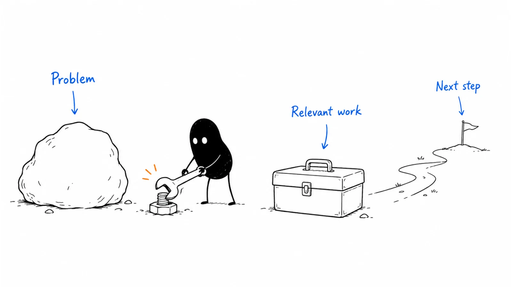

**Last reviewed:** 2026-09-07 · **Reading edit:** 2026-09-07

“Where did that missing information come from?”

The presenter has opened a beautifully prepared request. Every field is complete. The handoff looks ready for engineering review.

But the operations lead remembers that their real requests rarely arrive like this. Someone has usually forgotten a reference, another department has not answered, and the engineer needs to know which details can be trusted.

The presenter can click through the interface. The buyer is asking whether the work behind the interface will hold up.

A useful demo makes that work inspectable. It shows what the product or service actually does, what the customer still does, and what remains to be tested. It does not have to answer every buying question in one meeting.

You are helping someone decide whether the proposed approach deserves a next step. A clear reason not to proceed can be a useful result too.



*Follow one task from its input to a useful result, including the limits and handoffs that a polished happy path can hide.*

**Jump to:** [the running example](#worked-example-illustrative) · [choosing the format](#choose-the-format-for-the-question) · [planning the scenes](#plan-what-each-scene-needs-to-establish) · [safe preparation](#prepare-an-environment-you-can-responsibly-show) · [live delivery](#step-3-show-the-strongest-proof-first) · [unexpected behavior](#when-something-goes-wrong) · [copyable plans](#copy-demo-one-pager-fill).

## Use this when

People can describe your features but still do not understand how the product would fit their work. Demos get compliments without resolving important questions. A technical reviewer asks something the standard tour cannot answer. Or a self-serve visitor needs to see a representative task before deciding whether to try the product.

Start with the question the demonstration should help answer. “Show them the platform” is too broad. “Show how an incomplete request becomes a reviewable handoff, and where human work remains” gives you a useful task.

## Do not use this when

A demo cannot prove a capability you do not have. If the buyer requires an unsupported deployment, showing another feature will not resolve that requirement.

A demo also cannot establish production reliability, security suitability, implementation effort, or commercial value merely by going smoothly. Some decisions need technical evidence, an approved evaluation, or a conversation with the responsible specialist.

You do not need a separate discovery meeting before every demonstration. A short example can help someone understand the category well enough to ask better questions. State the assumptions when you have not yet learned their context.

For a pricing negotiation, work from the actual [offer](https://b2-b-playbook.mintlify.app/playbooks/02-product-marketing/pricing-and-packaging). For first-use guidance after purchase, use [customer onboarding](../08-lifecycle-and-customer-marketing/customer-onboarding.md). A sales demo and a training session have different jobs.

<a id="one-rule"></a>

## Keep this in mind

Distinguish what the buyer has seen from what they have been told.

Seeing a prepared handoff shows its structure. Watching preparation on a sample shows how that sample was handled. Neither proves that all of the buyer's requests will work, that the output is correct, or that their team can use it without assistance.

Make those boundaries part of the explanation. They help the buyer understand what a later evaluation would need to establish.

<a id="teaching-fill-inventednot-a-customer"></a>
<a id="worked-example-illustrative"></a>

## The task we will demonstrate

The running example is fictional. It continues the assisted request-preparation offer from the previous articles. All conversations, sample records, outcomes, and proposed evaluations here are invented for teaching, not claims about Lensmor customers.

The service helps operations teams prepare one supported type of record-correction request for engineering review. It organizes information and helps follow up on missing details. The customer's engineers still decide whether and how to execute the change. The service does not change production records.

Earlier exercises produced some useful handoffs, and one company paid for a bounded assisted pilot and used it again. Human involvement remained substantial. We have not established that software alone can deliver the same result.

For this demo, suppose an operations lead and an engineer want to see how the approach handles incomplete inputs. The seller proposes an invented request with one missing reference, a completed example for comparison, and the point where the engineer takes over.

The objective is not to impress them with a complete workspace. It is to help them judge whether the preparation process is relevant enough to examine using an agreed, permitted sample of their own work later.

<a id="operating-method"></a>

## How to do it

### Name the decision before you build the path

Write one sentence describing what the audience should be able to assess afterward.

For this example: “Can the operations lead and engineer explain how the assisted service identifies missing information, prepares the handoff, and leaves approval and execution with engineering?”

That is a comprehension objective. A later pilot might test the quality of handoffs on representative requests. Keep those distinct so a clear explanation does not become a claimed performance result.

Ask what prompted the demonstration. If the buyer has already used the product, find out where they got stuck. If they are comparing approaches, identify the comparison. If they are new to the category, a simple orientation may be more useful than an account-specific deep dive.

Choose the amount of preparation accordingly. You can reuse a well-designed sample for a common task. A custom environment is worth building when it helps answer a meaningful question that the standard example cannot address.

Do not mistake cosmetic personalization for relevance. Replacing a sample logo with the buyer's logo changes little if the workflow, roles, and constraints remain unrelated.

<a id="step-1-decide-who-must-be-in-the-room"></a>

### Invite the people needed for this question

Different people inspect different parts of an experience.

The operations lead can judge whether preparation resembles the work they do. The engineer can assess the handoff and identify technical questions. A budget owner may need a concise explanation of the proposed evaluation and its commitment rather than every screen.

You do not need the entire buying committee at every demo. Ask who needs to participate for the current question and what can be shared afterward. Respect the contact's context rather than independently inviting senior colleagues to create pressure.

If someone important cannot attend, decide what you can still resolve. You might proceed with workflow exploration and leave technical approval open. Or you might reschedule because the unavailable person is essential to the proposed test.

Attendance is not agreement. Silence can mean many things: limited relevance, uncertainty, distraction, or a preference to review later. Ask for the needed input without putting a person on the spot merely to make the room appear engaged.

If several people from your team attend, give them jobs too. One person can drive the product, another track questions, and a specialist answer within their area. In a small company, one person may do all three; leave enough space in the plan to do them well.

## Choose the format for the question

A live meeting is one format, not the definition of a demo.

| Format | Useful when | What the buyer should not infer |
|---|---|---|
| Short recorded walkthrough | Someone needs a quick orientation or a shareable explanation | That every step is live, unedited, or performed at the shown speed |
| Guided live demo | Questions and context are likely to change what you show | That one successful path establishes reliability on other inputs |
| Interactive tour | People want to explore a limited path at their own pace | That a simulated interface is a fully functioning product |
| Sample-data sandbox | People need to inspect behavior without first supplying their own data | That sample results describe their business or prove integration |
| Scoped technical evaluation | A material requirement needs evidence in agreed conditions | That a limited test establishes every production or commercial claim |

A recorded walkthrough may be enough for a small task. A complex evaluation may need several steps. Do not make a buyer attend a meeting solely because the sales process expects one.

When an early conversation reveals a question you cannot answer in the chosen format, say what another format would add. A screenshot may explain an audit-history layout; it cannot demonstrate the behavior of a permission boundary.

### A documented example: sample data as an exploration aid

PostHog's public [Creating Sandboxes for Demos handbook page](https://posthog.com/handbook/growth/sales/sandboxes?ref=b2b-playbook), checked on **September 7, 2026**, describes an internal tool that generates realistic invented event data for tailored demonstrations and take-home projects. The page distinguishes those sandboxes from evaluating the product with the prospect's own instrumentation.

This documents a way to make exploration possible before a full setup. It does not prove that sample-data access produces better commercial results. No internal tool or customer project was accessed for this article.

The useful distinction for our example is similar: a sample handoff can make the preparation process understandable, but a representative evaluation is still needed to learn whether it works for the buyer.

## Plan what each scene needs to establish

A demo plan is easier to adapt when it describes evidence, not just clicks.

For each scene, write the question, what you will show, and the limit of what that establishes. Then decide which scenes belong in this session.

| Buyer question | Scene in the fictional demo | Evidence boundary |
|---|---|---|
| What do we receive? | A prepared handoff beside the original request | Shows the output format, not the quality of every future handoff |
| What if information is missing? | An invented request with a missing reference | Shows how this gap is identified and handled |
| Who supplies or checks the information? | The input source and human review step | Makes responsibility visible; does not prove another department will respond |
| Where does engineering take over? | The handoff and review point | Shows the boundary; no production execution is demonstrated |
| Would this fit our request mix? | A discussion of an agreed evaluation sample | Defines a next test; it is not a result from that test |

You do not need a separate customer story after every scene. Use a relevant, permitted proof item when it helps answer a question. If you only have invented data or an early assisted result, label it rather than borrowing the authority of an unrelated customer logo.

### Show the result early when it helps orientation

For this audience, opening the prepared handoff can help them understand what they are evaluating. Then you can return to the incomplete input and show how the work gets there.

Another audience may need the input first to understand the problem. There is no universal winning order. Choose a sequence that makes the task easy to follow without concealing important work.

Write a short explanation before each transition: what we are looking at, who uses it, and why it matters to the question. “This is the request your engineer receives” is more useful than “Now I will click the blue button.”

Cut paths that do not help the current decision, but do not hide relevant constraints because the buyer did not know to ask about them. Setup effort, access requirements, and human review may matter even if they were absent from the initial request.

## Prepare an environment you can responsibly show

Use a dedicated environment and data appropriate for the demonstration. A screen share should not reveal another customer's records, private messages, credentials, or notifications.

Check the actual account and role you will use. An administrator view can make a task look easier than it is for the intended user. If you demonstrate an administrative action, identify that role rather than implying every user can do it.

Map the actions that could leave the environment: emails, notifications, payments, record changes, integrations, or automation triggered by a button. Confirm that test destinations are controlled and that the demonstration cannot accidentally affect live customer work.

A “sandbox” label is not a substitute for checking the system's boundaries. A test workspace connected to a live messaging integration can still have real effects.

Stripe's [sandbox documentation](https://docs.stripe.com/sandboxes?ref=b2b-playbook), checked on **September 7, 2026**, describes isolated testing and simulated payments without real money movement. That is a product-specific example of an explicit boundary, not a guarantee about any environment you call a sandbox.

### Use realistic inputs without pretending they are customer data

For the fictional request, include enough detail to make the task recognizable: a request type, an intended reviewer, the fields needed to understand the change, and a deliberately missing reference.

Keep names and records clearly invented. If you use approved redacted material instead, check the output too; removing a name from the input does not ensure it disappears from a generated summary or a linked record.

Do not create an unrealistically perfect sample and then imply that the product made it complete. If you prefilled fields, prepared an output, or shortened a waiting period, explain what was prepared.

A realistic negative case is useful when it answers a relevant question. You might show an unsupported request being declined or an incomplete input remaining unresolved. The point is not to make the product look unreliable; it is to show what users should expect when the happy path does not apply.

### Rehearse the path and its recovery

Run the demo with the account, permissions, data, and connection you expect to use. Check loading, text size, screen sharing, sound if needed, and the links you will send afterward.

Prepare a recovery option for a known failure point. It may be a previously captured output, a short recording, or a diagram of the handoff. Label it accurately when you use it. A fallback preserves the explanation; it does not prove that the failed live action worked.

Know how to stop safely. If an unexpected dialog asks for production credentials or a real recipient, do not improvise through it to keep the meeting moving.

Keep the preparation proportional. The purpose is a reliable, honest view of the relevant work, not a theatrical production that consumes days for a question a short example could answer.

<a id="step-2-set-the-stage-in-their-language"></a>

## Open with a shared question

Before sharing the product, recap the intended task and give the participants room to correct it.

“You asked to see what happens when a request arrives with missing information. I will use an invented example, show the preparation and handoff, and keep the engineering execution step outside the demo. Is there another question we need to resolve first?”

This establishes scope without turning the opening into a long speech. It also makes the sample and its limitations visible before anyone mistakes them for customer evidence.

**Presenter:** “I planned to start with the completed handoff, then show how the missing reference is handled.”

**Operations lead:** “Can we start with the incomplete request? That is where our team spends time.”

**Presenter:** “Yes. The gap in this sample is deliberate. I will show what gets flagged and where a person still has to supply the answer.”

**Operations lead:** “Good. I need to know whether it reduces the chasing or just makes the missing information easier to see.”

That change of order improves the demonstration. It does not mean the preparation was wasted; the plan made the relevant scenes available when the buyer needed them.

<a id="step-3-show-the-strongest-proof-first"></a>

## Let the buyer inspect the work

Slow down at the point where the buyer needs to understand something. Move quickly through navigation that adds no information.

For the fictional request, orient the room before opening a panel. Explain which information came from the original input, which field is missing, and what the service has done so far. Show the unresolved state rather than narrating a future answer as if it were already available.

Then show the handoff. Point to the information the engineer can inspect and the part that still needs a human decision. If the service merely organizes a request, do not describe the screen as evidence that the change is safe to execute.

A useful question at this point is: “What would your reviewer still need before they could decide what to do?” The answer may expose a gap in the product, the sample, or your understanding of the workflow.

### Distinguish output, correctness, and usefulness

A generated document is an output. Whether its statements match the underlying information is a correctness question. Whether it helps the engineer perform the task is a usefulness question.

Those questions require different evidence. A polished layout does not establish correctness. A correct summary may still omit a field the buyer needs. A useful handoff may still depend on more manual effort than the offer can sustain.

Name what you have shown and ask about what remains. For example: “We have shown how the missing reference is flagged. We have not established how often your inputs contain gaps the process fails to recognize.”

That is not an apology for the demo. It is a precise account of its limits.

### Let questions change the path

When someone asks about a capability, first establish why it matters. You may be able to answer briefly, show a relevant scene, or record a question for another person.

Do not dismiss a question just because it was not in discovery. Buyers can learn enough during a demonstration to notice a new requirement.

Equally, you do not need to follow every question through an unrelated branch. Explain the trade-off: “I can show that setting now, or we can finish the incomplete-request path and return to it. Which is more useful?”

If the requested behavior is unsupported, say so. Avoid turning “we can investigate” into a roadmap promise. The appropriate result may be a narrower evaluation or a decision not to proceed.

## Demonstrate AI behavior without staging certainty

An AI-enabled workflow needs more explanation than a sequence of deterministic clicks.

Describe the source of the input, the relevant context available to the system, and the human checks involved. Identify whether the result is being generated live, replayed from a prior run, or shown as a prepared example.

A live response can vary. A prepared response can be useful. Neither format excuses implying that every input will receive the same correct answer.

For our example, suppose the workflow includes a generated summary of the request. The presenter should compare the summary with the source and show how uncertainty or missing information is handled. If a person corrected the text before the meeting, that correction is part of the explanation.

Do not imply that the system knows a fact merely because it produces a plausible sentence. Let a relevant reviewer inspect the source, then describe what would need testing across a representative set of inputs.

### Show the boundary between suggestion and action

A draft recommendation is different from a tool action. An action in a test environment is different from a production change.

If an agent can send messages, update records, or call external systems, make the approval and execution boundaries visible. Demonstrate them only within an appropriate, verified test setup.

For the request-preparation service, the production-execution boundary is simple: the service does not perform it. You can show the handoff without staging a production action to make the demonstration seem more complete.

If the product has several operating modes, specify which one is being shown. A manually reviewed workflow should not be described as fully autonomous, and a prototype path should not be presented as generally available.

### Keep timing and cost claims honest

If a step normally waits on another person, do not compress it silently into a few seconds. You can skip the wait, but say what would happen in ordinary use.

Likewise, a fast response on a small sample does not establish performance on a large workload. If speed or cost is a buying requirement, define the conditions for a separate test.

A buyer may ask whether the demonstration used a premium configuration, extra credits, or special support. Answer from the actual setup. If you do not know, check rather than making a claim about the standard package.

<Accordion title="Should we accept an unexpected live input from the buyer?">

First check whether the input is appropriate to share, within the supported task, and safe to process in the environment you are using. A spontaneous test is not permission to ingest sensitive records or connect a live system.

If the input is suitable, explain that this is an exploratory run and what it can establish. If it is not, use an invented equivalent or agree on a reviewed evaluation later. Declining an unsafe live test is not the same as avoiding scrutiny.

Keep the outcome visible either way. If the system fails or produces a wrong answer, record that result and its conditions. Do not keep rerunning until one answer looks good and then present only that answer as representative performance.

</Accordion>

## When something goes wrong

A failure becomes harder to understand when the presenter keeps talking as if the planned result happened.

Stop, describe what is visible, and separate what you know from what you suspect. “The result has not loaded” is an observation. “It is just the Wi-Fi” is a diagnosis that may not be established.

For a display or connection problem, you may be able to recover safely and continue. For an incorrect output, discuss the error. For a possible access or data issue, stop the affected action and involve the responsible owner.

**Engineer:** “That summary says the reference was verified. The input only says somebody needs to check it.”

**Presenter:** “You are right. This output turned an open check into a completed one. We should not treat it as a review-ready handoff.”

**Engineer:** “Then human review is still necessary before it reaches our team.”

**Presenter:** “Yes. I will record this sample and the incorrect statement. We can inspect the review step, but this run does not establish that the generated summary is reliable enough.”

The presenter has preserved the evidence. There may still be a useful conversation, but the product has not passed the question it just failed.

### Use the fallback without hiding the failure

If you switch to a recording or saved output, identify it and explain what it can help show.

“I have a previously captured example of the handoff layout. It can help us discuss the structure, but it does not resolve the failed generation we just saw.”

Do not quietly replace a live result with a prepared one. Do not edit the recording afterward in a way that makes the failure disappear from an evaluation summary.

If the failure is central to the buyer's decision, a technical investigation may be more useful than finishing the remaining scenes. Agree on the evidence needed and a realistic route to follow up.

You can still finish a session well by acknowledging what remains unresolved. A smooth ending is less important than an accurate account of the product.

## Make room for more than one viewpoint

In a mixed audience, people may be evaluating different questions at once.

The operations lead may care about preparation effort. The engineer may care about traceability and correctness. The person approving spend may need to understand the evaluation commitment and the uncertainty it will reduce.

Keep the current question visible, and invite input from the relevant person at the relevant moment. “Would this include what you need to review?” is more specific than asking everyone to react to the whole product.

If a late participant joins, offer a brief recap of the task and what has been shown. Do not assume the original explanation reached them. If their question changes the purpose of the session, make that change explicit.

Avoid reading enthusiasm or body language as approval. Someone may find the product interesting and still consider it unsuitable. Someone who speaks little may be carefully reviewing it.

A useful comprehension check asks the participant to describe a consequence in their own context: “If you tried this next week, which part of your current process would stay the same?” That gives you more information than a simple request for praise.

## Build a self-guided version people can finish

A self-guided demo needs to carry the context that a presenter would otherwise supply.

State the audience, task, starting conditions, and what the person can explore. Use a short path to a meaningful result, then let them inspect related detail if useful.

For the fictional service, a self-guided version might show an incomplete invented request, the missing-information check, and the prepared handoff with the human review step labeled. It should not suggest that visitors have evaluated their own request quality merely by clicking through the sample.

Explain the format. If clicks advance between prepared screenshots, call it an interactive tour. If the visitor is using a working product with synthetic data, identify the sample environment and its limits.

Make the path readable without sound, with legible text, useful captions where appropriate, and clear controls. Do not rely on a tiny cursor movement to explain a crucial step. Check that the experience works on the devices your intended readers are likely to use.

### Give exploration a useful ending

At the end, offer a next action that matches what the person has seen: read the scope, inspect a relevant help page, ask a question, or request a bounded evaluation.

Do not force an account creation or meeting simply to reveal a basic limitation. Let people assess fit before they invest more time.

If you offer take-home access, explain the sample data, permitted actions, access duration, and where to get help. Confirm that one prospect cannot see another's material. Remove or expire access according to the agreed process rather than leaving temporary environments unmanaged.

You can observe where people stop, but do not assume every exit means confusion. They may have answered their question. Use analytics as a clue and feedback as additional evidence, not as a substitute for understanding the task.

<a id="step-4-end-with-a-next-meeting-not-a-vibe"></a>

## End with what was learned and what remains open

Summarize the specific questions, not the list of features shown.

For this example, a useful close could distinguish the handoff structure, the handling of missing information, and the still-unproven quality on the buyer's request mix. Confirm what the buyer understood and what they would need before considering a pilot.

**Presenter:** “We have shown the preparation and handoff using invented data. What would you still need to assess before trying this on your work?”

**Buyer:** “Our engineer wants to check the required fields. We do not need another full demo yet.”

**Presenter:** “I can send the field list and responsibility boundary for that review. Should we wait for those comments before discussing a pilot?”

**Buyer:** “Yes. Send those two items, and I will come back after the review.”

That is a legitimate next step. Another calendar invitation would not necessarily improve it.

“Any questions?” can be a useful invitation, but it is not a strong comprehension test by itself. Ask about the unresolved task, then leave room for questions you did not anticipate. You do not need to ban ordinary conversational language to run a thoughtful meeting.

### Keep evidence separate from commercial progress

A buyer may understand the product and choose not to buy. They may want an evaluation but lack approval to begin. They may accept the approach while needing an unsupported requirement.

Record those states separately. A demo is not successful merely because it creates another meeting, and it is not necessarily a failure because it reveals a mismatch early.

If the next step is an evaluation, define what it will test, who participates, what information can be used, and how the result will be reviewed. Agreement to discuss a pilot is not the same as agreement to its scope or payment.

If the next step is to stop, capture the reason accurately. Do not convert “our current form is sufficient” into “lost on price” because the CRM offers fewer choices.

## Send a follow-up someone else can understand

A concise follow-up should identify the task, the evidence shown, important limitations, open questions, and the next action actually agreed.

For the running example, distinguish the synthetic sample from any future customer evaluation. Link to the relevant field list or scope page, not every asset in the sales folder.

If you share a recording, have the appropriate permission and check what it contains. Internal notifications, incidental customer data, or unsupported statements may need handling before it can be distributed. Do not circulate a private meeting as general marketing material without authorization.

Mark a recorded demonstration's relevant product version or date. A buyer revisiting it later should not mistake retired behavior or a preview capability for the current offer.

When a question needs another owner, make the handoff explicit. A promise to “ask engineering” should become an owned question with enough context for engineering to answer.

<a id="step-5-score-the-recording-then-coach-one-drill"></a>

## Review the demonstration as a piece of work

Choose a few observable criteria related to the session's objective. Do not score charisma, accent, or similarity to the founder's style as if they were product understanding.

| Area | Evidence to inspect | Useful coaching question |
|---|---|---|
| Purpose and context | The task and assumptions were stated and checked | Did the presenter establish what this audience needed to assess? |
| Demonstration | The relevant path and its inputs were visible | Could a buyer distinguish product behavior from prepared or manual work? |
| Limits and questions | Unknowns and errors were handled accurately | Was a material uncertainty clarified, recorded, or quietly turned into a promise? |
| Understanding | The buyer's response addressed the actual task | What showed comprehension beyond politeness or enthusiasm? |
| Follow-through | The summary and next action match the discussion | Could another person continue without reconstructing missing context? |

Use notes when a recording is not available or appropriate. If you review recordings, follow the relevant permissions and data-handling practices. Do not record secretly for coaching.

Write one specific improvement to try. “Explain the source of the generated summary before calling it complete” is actionable. “Be more compelling” is not enough to practice.

The existing [demo scorecard](../../templates/demo-scorecard.xlsx) remains available as a working aid. Keep any filled observations intact. A rubric should support judgment about the session, not force a score for something that was irrelevant or not observable.

If you use ratings, define what each level means and label missing evidence or not-applicable items separately. An average of different criteria can conceal a serious unsupported claim. Inspect important failures even when the overall score looks good.

<Accordion title="Can AI review the demo recording for us?">

It can help locate moments, organize permitted notes, and draft feedback. Check the evidence before accepting a score or recommendation.

A transcript may capture words but miss a wrong value on screen, a permission error, or an unlabeled switch to a recording. An automated summary may also turn a proposed next step into an agreed one.

Ask for the specific moment supporting each observation and verify it. Use an approved tool for customer material and keep sensitive information out of general training examples. Treat automated feedback as a review aid, not a final verdict on the seller or a substitute for the buyer's own response.

</Accordion>

## Metrics

Measure whether the demonstration resolved the question it was intended to address. Then track what happened afterward without attributing every result to the demo alone.

For a live workflow session, useful observations might include whether the intended path was shown, whether the buyer correctly understood the responsibility boundary, and which material questions remain unresolved.

For a self-guided tour, look at whether people reached the key result, used the relevant next action, or reported confusion. A completed tour does not establish successful product use.

For a technical evaluation, use the agreed test conditions and acceptance criteria. Keep unsupported cases and failed runs visible; they should not disappear from the denominator because they were inconvenient.

If you report a next-step rate, define what counts and which sessions were eligible. Separate another demo, asynchronous review, a technical evaluation, a pause, and a decision not to proceed. More scheduled meetings can simply mean more work required to reach the same answer.

Compare similar sessions when reviewing changes. Audience, product readiness, account fit, and commercial terms can all affect what happens after a demo. A higher conversion rate after a new recording does not by itself prove the recording caused the improvement.

<a id="copy-demo-one-pager-fill"></a>

## Copy a plan and an evidence note

Use the plan to prepare a demonstration you can adapt. Keep the note for what actually happened.

```text
DEMO PLAN

Audience and roles:
Question this demo should help answer:
What we know and where it came from:
Assumptions to check:
Format and why it fits:

ENVIRONMENT

Product / offer version:
Account, role, and permission checks:
Sample data and its label:
External actions disabled or safely controlled:
Prepared material and what must be disclosed:
Failure point and honest fallback:

SCENES

Buyer question:
What we will show:
What this establishes:
What it does not establish:
Question to check relevance or understanding:
Repeat for the few scenes that matter.

ENDING

Material uncertainties to revisit:
Possible next step and what it would resolve:
Who can answer technical or commercial questions:
Shareable material and access conditions:
```

```text
DEMO EVIDENCE AND FOLLOW-UP

Date / participants / purpose:
Environment and product version:
Synthetic, redacted, or customer-approved inputs:
Live, recorded, simulated, and manually assisted steps:

WHAT HAPPENED

Relevant paths actually shown:
Output or behavior observed:
Buyer response, distinguished from our interpretation:
Errors, omissions, and unresolved questions:
Claims that need correction or further evidence:

NEXT ACTION

Action actually agreed:
Suggested actions not yet accepted:
Owner and expected timing:
Information or approval required:
What the next evaluation would test:
Reason for a pause or decision not to proceed:

REVIEW

What to keep:
One specific improvement to practice:
Evidence for that feedback:
Material or environment that needs updating:
```

<a id="pre-flight-checklist"></a>

## Before you start

- [ ] The session has a specific question and an appropriate format.
- [ ] The necessary participants and missing perspectives are understood.
- [ ] Inputs, product status, manual work, and prepared outputs are labeled honestly.
- [ ] The account and environment cannot accidentally affect live customer work.
- [ ] The chosen scenes expose relevant limits as well as the useful path.
- [ ] An error can be acknowledged and handled without inventing a result.
- [ ] The closing questions check understanding and unresolved needs.
- [ ] Follow-up and coaching will reflect what actually happened.

## Common mistakes

**Treating every demo as a product tour.** Navigation is not evidence that the buyer's task can be handled.

**Making discovery a rigid gate.** Some people need to see a small example before they can explain what matters. Use it to learn without pretending you already know their situation.

**Showing only polished output.** The input, preparation, review, and exception path may contain the buyer's real concern.

**Confusing a sample with validation.** A synthetic environment can explain behavior without proving customer-specific fit, reliability, or value.

**Concealing a failed live step.** A fallback can continue the explanation, but it cannot erase the result.

**Measuring excitement and meetings alone.** A useful demo improves understanding and the quality of the next decision.

## What to read next

Use [sales enablement](https://b2-b-playbook.mintlify.app/playbooks/02-product-marketing/sales-enablement) for the broader conversation and reusable supporting material. Keep [pricing and packaging](https://b2-b-playbook.mintlify.app/playbooks/02-product-marketing/pricing-and-packaging) consistent with the scope and assistance shown.

Next, continue with [change friction](https://b2-b-playbook.mintlify.app/playbooks/02-product-marketing/change-friction): a buyer can understand the product and still hesitate because adopting it means changing a working process.

For a multi-person decision, use [buying committee](../01-strategy-and-buyers/buying-committee.md). If the buyer proceeds, connect the handoff to [customer onboarding](../08-lifecycle-and-customer-marketing/customer-onboarding.md).

## Sources and evidence boundary

This is an owner-maintained operating synthesis, not a licensed demonstration methodology or a guarantee of a sale. The request-preparation scenario, dialogue, scene plan, and copyable records are original fictional teaching material. No Lensmor customer outcome is implied.

The earlier short version used an operator scorecard as a method prompt. That working aid is preserved, but its sample phrasing, scoring scale, and meeting rules are not treated as universal requirements.

PostHog's linked public handbook documents generated-data demos and distinguishes exploration from use with actual instrumentation. Stripe's linked documentation describes its own isolated testing boundary. Both were checked September 7, 2026; neither is used as evidence of improved sales outcomes.

GitLab's [Solutions Architects Processes handbook](https://handbook.gitlab.com/handbook/solutions-architects/processes/?ref=b2b-playbook), displaying a May 8, 2026 modification date, provides additional preparation context around intended outcomes, infrastructure, challenges, and evaluation metrics. That is a page-maintenance date, not a measured program result. Its internal qualification requirements are not imposed on every demo in this guide.

No internal company systems, demo-generation tools, or customer data were accessed. Product behavior and access requirements can change; check the actual environment and responsible owners before demonstrating them.

---

Copyright © 2026 Ivan Xu. All rights reserved. See the [copyright and reuse terms](https://github.com/weilun88313/B2B-Playbook/blob/main/LICENSE).

Canonical source: [github.com/weilun88313/B2B-Playbook](https://github.com/weilun88313/B2B-Playbook)
