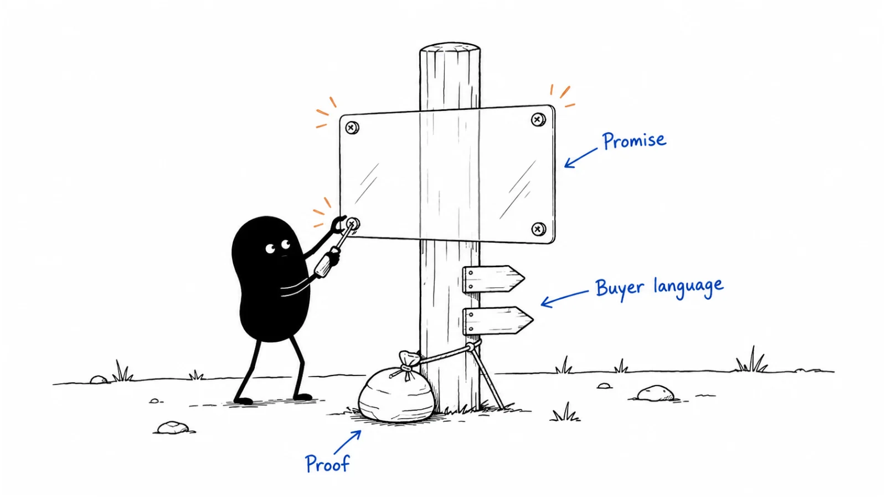

**Last reviewed:** 2026-09-07 · **Reading edit:** 2026-09-07

The call went well. The operations lead understood the offer, asked sensible questions, and said they would share it with their manager.

Two days later, the reply arrives: “We already have an automation tool. We're going to pass.”

You read the note they forwarded. Your service prepares requests for engineering review. Their summary says it automates the changes.

The explanation worked while you were in the room. It changed as soon as someone had to carry it into another conversation.

This is one of the practical jobs of messaging: helping the right information survive the journey from a first impression to a considered decision. The website, the follow-up email, the demo, and the internal summary all need to help. Each has a different amount of space and a different reader.

You do not need a perfect slogan before you begin. You need an understandable account of what you offer, reasons to believe it, and enough guidance that the next person can explain it without accidentally selling a different product.



*Use this guide to move from an internal positioning decision to words a buyer can understand, investigate, and pass along.*

**Jump to:** [the running example](#worked-example-illustrative) · [building the message](#how-to-do-it) · [writing across channels](#step-5-ship-copy-only-from-a-filled-row) · [voice and editing](#make-it-sound-like-someone-who-understands-the-work) · [copyable templates](#copy-messaging-hierarchy-fill) · [testing](#metrics).

## Use this when

You know roughly who the offer serves and what it does, but the explanation changes depending on who wrote it.

Perhaps the homepage is full of broad benefits, while the demo is a list of features. Perhaps prospects understand the product only after a long call. Perhaps your sales team has useful explanations that never make it onto the website. Or perhaps you have just changed the offer and old promises are still circulating.

This guide is for building a small, usable set of messages. It covers the main explanation, supporting claims, evidence, audience variations, and the words on a few important touchpoints.

The goal is not to make every sentence identical. It is to make the experience coherent enough that people can make a sound decision without repeatedly asking what you actually mean.

## Do not use this when

If the team cannot agree on what is currently available or which problem it is trying to solve, return to [positioning](positioning.md). You can draft messages while investigating those questions, but mark the assumptions. Attractive copy will not settle an unresolved product decision.

If you need a full meeting structure, use [sales enablement](sales-enablement.md). If you need a publishing plan, use [content strategy](../03-brand-story-and-content/content-strategy.md). Both can use the messages developed here.

Brand voice matters too. It helps people recognize how you speak and how you treat them. It should develop alongside an accurate description of the offer, rather than becoming a reason to postpone one.

<a id="words-you-will-use"></a>

## A few useful terms

Think of these as working distinctions, not a vocabulary test.

**Positioning** is the decision about how the offer fits a buying situation and why someone might choose it. **Messaging** is the set of ideas and supporting explanations you want to communicate. **Copy** is the actual wording in a particular place.

A **claim** is something the reader could reasonably understand you to be asserting: a capability, result, comparison, or commitment. **Evidence** is what lets someone check that assertion. A screenshot can show a feature; it does not automatically establish a business outcome.

A **message hierarchy** is simply an order of importance. What should the reader understand first? What explanation should follow? Which details belong nearby, and which deserve a separate page?

You may also hear people talk about a **perception**. Here, that means an understanding you want the reader to take away. It is useful only when you can describe it plainly and check whether the reader actually got it.

<a id="one-rule"></a>

## Keep this in mind

A reader should not have to reconstruct the offer from disconnected claims.

If the headline says “fully automated,” the demo requires a human reviewer, and the proposal includes substantial service work, those are incompatible expectations. Repeating the same brand vocabulary across all three will not fix the problem.

On the other hand, an engineer may need a detailed explanation of permissions while an operations lead needs to understand the handoff. Different emphasis is appropriate. Keep the underlying facts compatible.

Writing also produces feedback. If every clear version of the message sounds unconvincing, the problem may be the offer, evidence, or buying situation. You are allowed to revisit positioning. It does not become untouchable because a workshop has ended.

<a id="teaching-fill-inventednot-a-customer"></a>
<a id="worked-example-illustrative"></a>

## The offer we will use throughout

The example is fictional and continues the request-preparation business from the previous articles. The dialogue and draft copy are invented teaching material, not Lensmor customer research or messages that have been sent.

The business provides assisted preparation of one supported type of record-correction request. It organizes information and helps follow up on gaps before engineering review. The customer's engineers remain responsible for reviewing and executing changes. The service does not make production changes.

In earlier exercises, a few approved, redacted past requests became ready for review; others still lacked information. One company paid for a bounded assisted pilot and used it for another batch. Founder involvement remained material. These observations do not prove that the software independently saves time or that every similar company will benefit.

The position under investigation is narrow: helping an operations owner with recurring preparation and follow-up work, where the existing internal process is not sufficient.

Messaging now has to explain that offer in several situations. Someone browsing the site needs orientation. An interested operations lead needs to evaluate the work. An engineering manager needs to understand responsibilities. A budget owner needs a defined purchase and an evaluation plan.

They are not all asking the same question.

<a id="operating-method"></a>

## How to do it

Start with one offer and a small number of important touchpoints. Gather the positioning brief, current product or service scope, recent customer questions, and examples of what a buyer actually receives.

Also collect the words already in use. Look at the website, a real proposal, onboarding instructions, and explanations from customer conversations. When they disagree, identify whether the disagreement is about wording or delivery. Delivery questions need an answer from the person responsible for the work.

Emily Kramer's [June 12, 2024 positioning guide](https://newsletter.mkt1.co/p/positioning-guide?ref=b2b-playbook) distinguishes product research, positioning, and its adaptation into messaging. That distinction is useful background. The workflow below is an original practical extension focused on carrying an accurate offer through different reading and buying situations.

<a id="step-1-lock-the-core-from-positioning-not-from-a-brainstorm"></a>

### Step 1: Write the explanation you would give without a slide

Imagine a relevant buyer asking, “What would you actually help us do?”

Answer in ordinary sentences. Include the task, the part you take on, what they receive, and anything that would materially change their decision.

For the example:

“We help operations teams prepare supported record-correction requests before engineering review. The engagement includes help collecting missing information and organizing the handoff. Your engineers still decide whether and how to make the change.”

This is deliberately plain. It is a starting explanation, not a requirement to put every detail in a headline.

Now test the nouns and verbs. What counts as a supported request? Who collects the information? What does “ready for review” mean? When is the work considered complete? If the team gives conflicting answers, record the gap before polishing the sentence.

The main explanation needs enough specificity to distinguish the offer. It does not have to name a competitor in every version. A buyer unfamiliar with your category may first need to understand the task. A buyer comparing two named tools may need the comparison immediately.

Keep a short set of facts that all versions must preserve. For the fictional offer, these include the supported scope, assisted delivery, the review handoff, and the customer's execution responsibility.

Treat these as current facts, with an owner and a review date. If the product changes, update them. “Consistent” should not mean continuing to repeat something that stopped being true.

### Find words close to the work

Customer conversations can help you hear how people describe the task, but a phrase needs context.

Suppose an operations lead says, “I'm the person chasing everyone before engineering will even look at it.” That could be a useful clue. Ask what they mean by chasing, which information is missing, and how often it happens. Do not turn one colorful complaint into a claim that every target account has the same problem.

Keep the original wording in a private research note, with the situation and source. Mark paraphrases as paraphrases. Public quotes and company attribution need appropriate permission; an anonymized note is not automatically suitable for publication.

Then translate carefully. “Improve operational efficiency” loses the scene entirely. “Help collect the missing details before engineering review” keeps the work visible.

You can still use technical language when it is the clearest term for the audience. The problem is unexplained terminology, not expertise. A buyer should not have to understand your internal project names to understand the offer.

<a id="step-2-name-the-three-value-lines-each-with-proof"></a>

### Step 2: Put evidence beside the claim

A message document becomes much more useful when someone can follow a claim to the material supporting it.

Start with the claim as a reader would interpret it, not as you privately intend it.

“Requests prepared with human assistance” is a delivery statement. “Less back-and-forth” is a comparative outcome. “Your engineers save five hours every week” is a specific performance claim. They require different kinds of evidence.

For each one, record where the evidence lives, what it actually shows, and the limitations that affect use.

| Draft claim | What would support it | What would not be enough |
| --- | --- | --- |
| Preparation includes human follow-up | The actual service scope and delivery process | A feature mockup showing a reminder |
| The output is ready for review | A defined review standard and relevant acceptance records | A generated draft that nobody reviewed |
| There is less back-and-forth | A meaningful comparison with the prior process | One enthusiastic comment without context |
| Engineering retains execution responsibility | Product behavior and engagement terms that match | A disclaimer contradicted by the main promise |
| The service works for this request type | Evidence from that supported workflow | Results from a different task with different requirements |

A working demonstration is useful evidence for how something operates. A customer result is evidence about an observed outcome in a particular setting. A certification, testimonial, or familiar logo does not substitute for evidence of every claim beside it.

Keep quantitative claims especially narrow. Include the unit, time period, population, comparison, and method. If people with difficult implementations were excluded from a measurement, that can change what the result means.

For this fictional business, “AI cuts preparation time by 80%” has no support. The team has not separated the effect of software from human help or the improved intake process. It should not publish that claim.

It can show a labeled example of the output, describe the service, and invite a scoped evaluation. Being early does not require being vague; it requires choosing claims that match the evidence available.

### How many supporting messages do you need?

Enough to answer the important questions without repeating yourself.

Three is a convenient layout, not a law. Two distinct reasons may be sufficient for a simple offer. A complex purchase may require more explanation, divided into sections.

For the example, “Organize the request” and “Help follow up on missing information” explain two parts of the service. “Engineering keeps control of execution” describes a boundary that may matter to the decision. They are not three independent, proven business outcomes.

Allyson Letteri's [May 20, 2024 messaging essay](https://newsletter.mkt1.co/p/messaging-mistakes-allyson-letteri?ref=b2b-playbook) discusses audience specificity, benefits, credibility, and consistency. This guide retains those concerns without imposing a fixed number of value lines or a minimum lifespan for a claim.

If a competitor could also truthfully say “easy to use,” adding a more elaborate synonym will not create differentiation. Explain the particular work, choice, or evidence that makes the benefit relevant. Some baseline capabilities still deserve explanation even when they are not unique.

<a id="step-3-ladder-every-message-to-a-perception"></a>

### Step 3: Decide what this reader needs to understand next

Give each piece of communication a practical job.

A first-time visitor might need to recognize the supported task. A prospective evaluator might need to understand the output and effort required. A budget owner might need to understand what is included and how the team will judge the engagement.

Write the intended takeaway as a sentence the reader could say. For example:

“This service prepares the request; our engineers still make the change.”

Then identify the likely misunderstanding:

“I thought it was going to execute the change for us.”

That pair gives the writer a useful test. A headline may be attractive while failing the basic task.

Avoid assigning an abstract brand perception to every sentence. An implementation instruction may simply need to tell someone which information to provide. A pricing note may need to explain what happens when the scope changes. Those are legitimate communication jobs.

A message can also change a belief about the problem. Perhaps the buyer assumes preparation is negligible, while the actual coordination is substantial. Show the work and let them examine it. Do not inflate the pain with invented costs or suggest that a functioning internal process is irresponsible.

For the fictional offer, a useful educational piece could walk through an incomplete request and explain why an engineer cannot review it yet. It should still be useful to a reader who chooses to improve their own form instead of buying the service.

<a id="step-4-branch-the-hierarchy-do-not-rewrite-the-core"></a>

### Step 4: Adapt to the question, not just the job title

A job title is a clue about responsibilities. It is not a complete description of what someone knows or cares about.

An engineering manager may initiate the purchase. An operations lead may be the person most concerned about data handling. Ask which decision they need to make rather than assigning everyone a script by title.

For the example, the same offer can support several explanations:

| Reader's question | Useful emphasis | Facts that stay compatible |
| --- | --- | --- |
| “Will this take preparation work off my plate?” | The steps included and remaining customer work | Assistance is bounded; information still has to come from authorized sources |
| “Who can change production data?” | Review and execution responsibilities | The service prepares requests and does not execute changes |
| “What are we paying for?” | Scope, deliverables, terms, and evaluation plan | The purchase is an assisted engagement, not unlimited automation |
| “How do I start using it?” | Required inputs, access conditions, and handoff | The onboarding process matches the sold scope |

A different landing page may be useful when the audience has substantially different needs. It is not automatically necessary for every committee member. A clear main page with well-labeled supporting information may be enough.

Likewise, different segments can genuinely have different alternatives. An internal process may be the relevant comparison for one segment and an external service for another. If the delivery model, capability, or buying decision changes materially, check whether you need a separate positioning decision rather than calling everything a minor copy variation.

Within a single evaluation, however, the parties should be able to bring their explanations together without discovering contradictory promises.

### Let the buyer correct the explanation

A fictional conversation shows what that looks like.

**Operations lead:** Can I tell my manager you take care of the correction requests?

**Founder:** I would make the scope more specific: we help prepare the supported requests for your engineers to review. We do not make the changes.

**Operations lead:** The part I need help with is getting the missing details from people.

**Founder:** Then let's make that explicit in the summary, including what follow-up is included and what still needs your team's access or judgment.

The goal is not to police the customer's phrasing. It is to keep a consequential distinction from disappearing.

The buyer may also find a clearer expression than yours. Keep useful language when it is accurate. Consistency should make explanations easier to reuse, not make the team ignore what customers are telling them.

<a id="step-5-ship-copy-only-from-a-filled-row"></a>

### Step 5: Write the few versions people actually need

Start with the surfaces already involved in a purchase. For a small team, this might be the homepage, a follow-up email, the opening of a demo, and a forwardable summary.

For each, write down the reader's situation, the immediate question, the evidence to show, and the next step. Then draft. An incomplete brief is a reason to investigate a gap, not a prohibition on writing a useful first version.

Here is how the fictional offer could travel across those surfaces.

### The homepage: help a stranger orient themselves

**Headline:** Get correction requests ready for engineering review.

**Supporting copy:** Assisted preparation for operations teams handling our supported record-correction workflow. We organize the request and help follow up on missing information before your engineers review it.

**Scope note:** Your team reviews and executes changes. We do not make production changes.

**Next step:** Check whether your request fits.

The page would need to define the supported workflow, show a representative handoff, and explain the engagement. “Supported” is not an excuse to hide every detail behind a form.

This is a teaching draft, not copy for an actual live service. Before using it, a team would need to check that the delivery process and commercial terms support every sentence.

### The follow-up email: connect the offer to what was discussed

Imagine a call in which the operations lead described recurring requests being returned for missing information. A useful follow-up could say:

“Thanks for walking me through how requests reach engineering. The part worth investigating seems to be the missing-information follow-up, rather than the execution of changes.

“Our assisted engagement covers preparation within an agreed request scope. Your engineers still review and execute. As a next step, we could review a redacted, approved example and check whether the missing-information work fits our service.”

The first paragraph belongs only in a conversation where that problem was actually discussed. Do not recycle it into outreach that implies knowledge you do not have.

For a first contact, state a relevant reason for reaching out and ask about the task without claiming a diagnosis. Keep outreach examples distinct from messages that refer to an existing relationship.

The follow-up also needs a real next step. If a sample could contain sensitive information, explain the approved sharing method and redaction requirements before requesting it. A convenient call to action should not create an unnecessary data exposure.

### The demo: make the promise visible

Open with the part of the workflow the buyer wants to evaluate.

**Engineering manager:** What does my team get at the end?

**Founder:** A prepared request containing the information we agreed your reviewer needs, with unresolved gaps identified. We can walk through a synthetic example first.

**Engineering manager:** And does the system apply the correction?

**Founder:** No. Your team decides whether the request is valid and how to execute it. The demonstration ends at that handoff.

Show both a complete example and a case with missing information. Explain which work is done by software, which is done by a person, and which remains with the customer.

A demo that only shows the happy path can create a stronger claim than the words on the slide. Treat screenshots, animations, labels, and implied automation as part of the message.

### The internal summary: make it possible to discuss without you

Give the buyer something they can edit, rather than a glossy pitch they have to translate.

For the fictional engagement, a concise summary might read:

“We are evaluating an assisted service for preparing our supported record-correction requests. The proposed scope includes organizing information and defined follow-up on missing details. Engineering retains review and execution responsibility.

“The comparison is our current preparation process, including the option of improving the internal form. Before committing, we need an agreed scope, data-sharing approach, price, and success criteria. The evaluation should record output quality and the effort required from both sides.”

This summary does not announce a purchase or pretend the budget owner has agreed. It preserves the decision still to be made.

**Budget owner:** Does this replace the work engineering does today?

**Operations lead:** No. It may help with preparation and follow-up before their review. We still need to see whether that relief is worth the price.

**Budget owner:** What would we use to judge that?

**Operations lead:** A bounded evaluation of the supported requests, including whether the handoff is usable and how much work remains with us.

These are invented exchanges. They show the distinctions a message should preserve; they are not validated conversion scripts.

<Accordion title="What if we have two products or several buyer segments?">

Separate the shared company introduction from the explanation of each purchase.

You may have a common mission and voice, while individual products serve different tasks, have different alternatives, and require different evidence. Give readers a clear route to the offer relevant to them.

Do not force every product under a single benefit that becomes meaningless. Also do not imply a connected suite when the products require separate setup or cannot share information.

For variations of one offer, keep a record of what changes and why. If a segment needs a materially different delivery model, price structure, or set of capabilities, revisit the underlying offer before treating it as a landing-page experiment.

</Accordion>

## Make it sound like someone who understands the work

Natural writing comes partly from knowing what you mean.

“We enable seamless operational excellence through intelligent orchestration” is difficult to improve by changing the adjectives. The reader still cannot picture the task.

“Send engineering a request with the required information in one place” gives the reader something to inspect. It may not be the final headline, but it names an action and an output.

Do not confuse plain language with eliminating detail. “We help with operations” is short and easy to read, but too broad to be useful. A slightly longer sentence can reduce the reader's work.

Read drafts aloud. Where do you need to pause and explain a term? Where does a sentence sound more confident than the evidence? Where are you repeating an idea because you have not decided which version to keep?

Then edit for the job of the passage. An introductory line can be inviting. A limitation should be direct. Instructions should tell people what to do and what happens next. A problem report should not sound like a launch announcement.

### Two public writing guides worth studying

Mailchimp's [Voice and Tone guide](https://styleguide.mailchimp.com/voice-and-tone/?ref=b2b-playbook) distinguishes a relatively stable voice from a tone adapted to the reader's situation. It places clarity ahead of entertainment and cautions against forced humor. The page was checked on September 7, 2026; it does not show a publication date.

**The useful application here:** a friendly brand can still give a serious, specific explanation of scope. You do not have to make a limitation charming before making it understandable.

Microsoft's [brand-voice guidance](https://learn.microsoft.com/en-us/style-guide/brand-voice-above-all-simple-human?ref=b2b-playbook), displaying a last-updated date of October 18, 2022, emphasizes conversational wording, clear priorities, and helpful next steps.

**The useful application here:** after reading a passage, someone should know what matters and what they can do next. A message can have personality without making the reader decode it.

These are examples of published editorial guidance, not evidence that a particular style caused either company's commercial results. The dates describe the sources, not the start of the companies' practices.

### Keep a small voice note with examples

“Human, confident, innovative” gives a writer very little direction. Show what those choices mean in use.

For the fictional offer:

- Explain the work with concrete verbs: prepare, collect, review.
- Use a calm tone when describing missing information or limits.
- Say who does what; avoid implying that software performs human service work.
- Use technical terms when the audience needs them, with enough context to avoid ambiguity.
- Leave out claims of inevitability, effortless setup, and universal results unless they are genuinely supportable.

This is a working editorial note, not a list of universally banned words. “Seamless” is not a defect by itself; an unexamined promise is.

## Use AI to make variations, not to manufacture evidence

An assistant can help shorten a draft, find conflicting promises, or adapt an explanation for a reader with different background knowledge. Give it the approved facts and boundaries before asking for creative versions.

Useful instructions include: preserve the delivery model; do not invent customer names or metrics; identify claims requiring evidence; show where meaning changed; and keep unknown information marked as unknown.

Review the result against the source, especially small words that enlarge a promise. “Helps prepare” can become “prepares.” “Selected requests” can become “every request.” “During an assisted pilot” can disappear entirely. These edits often make copy smoother while making it less accurate.

Use synthetic or approved, appropriately redacted material when testing drafts. Do not upload private customer notes to a tool without checking that the use is permitted.

Generated buyer reactions can help you brainstorm questions. They cannot tell you what actual buyers understood or whether the message changed a purchase decision. Ten simulated personas are still a writing exercise.

## Copy: messaging hierarchy (fill)

Keep the working document short enough that someone will consult it before writing. Link to supporting material rather than pasting every research note into it.

```text
MESSAGE BRIEF

Offer / version / owner / review date:
Positioning decision or current hypothesis:

Main explanation:
- Who and what situation:
- Work we take on:
- What the buyer receives:
- What remains their responsibility:
- Important limits:

Supporting messages:
- Claim:
- Evidence location and date:
- What the evidence actually shows:
- Limits on how we can use the claim:

Reader and touchpoint:
- What do they already know?
- What question are they trying to answer?
- What should they understand afterward?
- What misunderstanding must we prevent?
- What can they do next?

Facts every version must preserve:
Language we can adapt:
Open questions and who will resolve them:
```

Use a separate review record for a particular draft. It gives feedback somewhere more useful to go than a long thread of suggested adjectives.

```text
DRAFT REVIEW AND TEST NOTE

Touchpoint / draft version / date:
Intended reader and situation:
Communication job:

Exact draft:
Relevant source facts:
Evidence links:
Expected interpretation:
Potentially misleading implication:

Review:
- Does the offer match what we deliver?
- Is each material claim supported?
- Is the next step accurate and available?
- What changed from the previous version?

Reader check:
- How was the reader recruited?
- What context did they receive?
- What did they think we offered?
- What would they expect next?
- What was unclear or unconvincing?

Decision:
Keep / revise / investigate:
Reason:
Owner and next review:
```

The existing [messaging working file](../../templates/messaging.md) is a compact starting layout. Its three value-line slots are prompts, not a requirement to invent a third benefit. Treat “positioning is locked” as “use an explicit current decision or hypothesis,” not as a ban on learning. A named alternative can be an internal process rather than a vendor.

You can leave a field unresolved and assign someone to investigate it. Do not overwrite a filled working copy merely to match this article's layout.

<a id="pre-flight-checklist"></a>

## Before you start

Check that you have a current offer description, a buyer situation worth investigating, and a way to inspect the claims you want to make.

Pick one communication failure to address first. If prospects mistake preparation for execution, fix that distinction. If they understand the offer but cannot evaluate its value, work on the evidence and explanation. If the scope changes between the website and the proposal, resolve the delivery inconsistency.

Choose the few surfaces involved in that failure and name their owners. A solo founder can own them all. The value is in knowing which versions must change together.

## Metrics

Separate comprehension, relevance, credibility, and action.

A reader may understand the offer perfectly and have no need for it. Another may be excited by a promise you cannot deliver. Both reactions matter, but neither should be summarized as “the message worked.”

Ask a reader to explain the offer in their own words before revealing the intended answer. Ask what they would expect after taking the next step. Then ask what seems useful, doubtful, or missing in their situation.

Avoid “Do you like this?” as the main test. Preference can help with style, but it tells you little about whether someone understood the scope or trusted the claim.

| Question | Useful observation | Interpretation to avoid |
| --- | --- | --- |
| Did they understand? | Their description of the offer and responsibilities | Treating a repeated slogan as comprehension |
| Is it relevant? | Where it would fit in their actual workflow | Treating politeness as demand |
| Is it credible? | Claims they question and evidence they request | Treating an attractive page as proof |
| Can they carry it forward? | An accurate summary for another decision-maker | Requiring them to memorize your exact wording |
| Does it support action? | A relevant next step completed, with context | Counting every click as qualified interest |

Keep early tests descriptive. If two of six relevant readers expected autonomous execution, record that specific misunderstanding, the sample, and the draft they saw. Do not turn a small convenience sample into a reliable estimate of the whole market.

A commercial experiment needs more care. Traffic source, audience, offer, price, and sales follow-up can all affect conversion. Decide what you are testing, the outcome that matters, and the amount of evidence needed before calling a winner.

Lower meeting volume could reflect clearer qualification or weaker communication. Check who stopped booking and what happened to relevant evaluations. Higher click-through could reflect curiosity created by an inflated promise. Look beyond the first action.

<Accordion title="What if we do not have enough traffic for an A/B test?">

Begin with direct comprehension checks and appropriate real conversations. They can reveal serious misunderstandings without requiring a high-volume website.

Use people familiar with the target task, record how they were recruited, and avoid teaching them the answer before they read. Keep the draft and their wording together so you can see what changed.

When possible, use fresh readers for a revised version. Someone who saw the first draft may now understand because of the discussion rather than the new copy.

These checks help diagnose and improve communication. They do not provide a statistically reliable estimate of conversion lift. If the sample is small, describe what you observed instead of claiming a percentage improvement.

</Accordion>

## Keep the message useful after launch

A message brief becomes stale when nobody owns the relationship between claims and product changes.

Choose one owner for the current version. Ask the people responsible for delivery, technical facts, and commercial terms to review the claims that concern them. A small team can do this in one short review; it does not need an approval committee for every sentence.

When something material changes, search for the old promise across active pages, decks, emails, help content, and templates. Correct the consequential versions first. Record what changed and why so people do not restore an outdated line from an old document.

If an existing customer was sold a promise you can no longer meet, changing the homepage alone does not resolve the issue. Handle that commitment directly through the appropriate customer process.

Feedback from sales and support should be specific. “Buyers hate the messaging” is difficult to act on. “Three recent evaluators expected execution because of this sentence” gives the owner a clear place to look.

## Common mistakes

**Turning a message hierarchy into mandatory arithmetic.** Three benefits can be a useful format. They are not evidence that three distinct benefits exist.

**Using the same headline everywhere.** A first-time visitor and a buyer preparing an internal evaluation need different amounts of context.

**Removing scope while shortening.** If the shorter version implies unsupported capabilities, keep the qualifier or change the sentence.

**Presenting features as proof of every outcome.** A reminder feature can be demonstrated. Reduced coordination time needs its own evidence.

**Assuming every segment compares the same alternatives.** Investigate the buying situation and revisit positioning when the difference is material.

**Treating natural language as casual language.** A precise explanation can sound human. Forced jokes and slang can make it harder to trust.

**Letting visual demonstrations overpromise.** A diagram, screenshot, or button label can create expectations the written disclaimer never repairs.

**Counting agreement inside the team as validation.** Internal review checks accuracy and consistency. Buyers still have to understand and evaluate the offer.

## What to read next

Apply the brief to the [homepage](../07-website-and-conversion/homepage.md) and the first meeting through [sales enablement](sales-enablement.md). Keep comparisons grounded with [competitive intelligence](competitive-intelligence.md) and the [comparison-page guide](../07-website-and-conversion/comparison-page.md).

Use [content strategy](../03-brand-story-and-content/content-strategy.md) to decide which questions deserve ongoing coverage. For a coordinated announcement, continue to [product launch](product-launch.md); for the founder's personal narrative, see [founder story](../03-brand-story-and-content/founder-story.md).

If the same misunderstanding returns across several drafts, revisit [positioning](positioning.md). The message may be exposing an unresolved decision about the offer.

## Sources and evidence boundary

This is an owner-maintained practical synthesis. The fictional offer, dialogue, draft copy, worksheets, and review approach are teaching material. They are not real customer interviews, validated scripts, or claims about Lensmor.

Emily Kramer's positioning guide and Allyson Letteri's messaging essay provide attributed background on the relationship between positioning, audience-specific messages, benefits, and evidence. Their fixed formats are not treated as universal rules, and paid templates or extended teardowns are not reproduced.

Mailchimp and Microsoft provide public editorial guidance, linked where discussed. Their inclusion illustrates writing principles, not measured commercial outcomes. All linked sources were checked on September 7, 2026. Live claims still require evidence appropriate to the offer, audience, and version being described.

---

Copyright © 2026 Ivan Xu. All rights reserved. See the [copyright and reuse terms](../../LICENSE).

Canonical source: [github.com/weilun88313/B2B-Playbook](https://github.com/weilun88313/B2B-Playbook)
