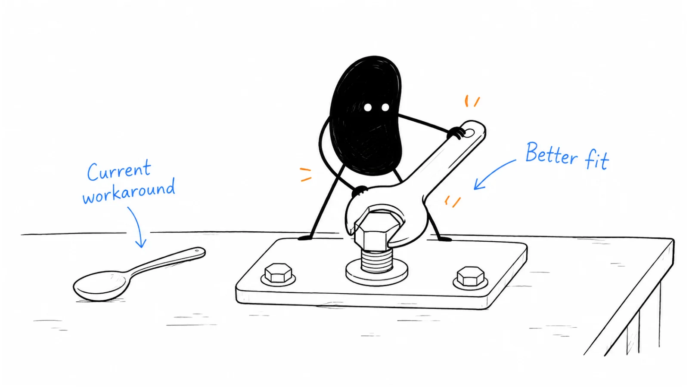

**Last reviewed:** 2026-09-07 · **Reading edit:** 2026-09-07

The prospect seems interested. They have read the website, brought an engineering manager to the call, and prepared a list of questions.

Then the first question lands: “Can it make changes in our production database?”

Your product does not do that. It helps operations teams prepare requests for an engineer to review. You spend the next fifteen minutes explaining what it does not do. By the time you reach the useful part, the buyer is wondering why they booked the meeting.

The headline that brought them here was “The autonomous operations platform.”

Nothing broke in the demo. The trouble started before the call.

Positioning helps a buyer understand what they are considering, when it might be useful, and why they would choose it over their other options. A good position gives the conversation somewhere productive to start. It also gives you a way to recognize the meetings you should not be booking.



*Follow one offer from a misleading first impression to a position the team can actually deliver.*

**Jump to:** [the working example](#one-offer-three-different-expectations) · [choosing a position](#how-to-do-it) · [homepage and demo](#step-6-run-the-homepage-10-second-test) · [copyable briefs](#copyable-templates) · [testing and measurement](#metrics).

## Use this when

You have something people can evaluate, but explaining it takes too much repair work.

Perhaps prospects keep comparing you with a product you do not replace. Perhaps a few customers understand the value immediately, while everyone else asks for unrelated features. Or perhaps the founder sells a hands-on service while the website promises self-service software.

This guide is also useful before a launch, when entering a new segment, or when several products need a coherent introduction. Early teams can use it to write a position worth testing. Established teams can use it to check whether their story still describes the offer customers buy.

By the end, aim to have one working decision brief, a matching first conversation, and a small test that could show you where the position is wrong.

## Do not use this when

Changing the words will not resolve an unsupported deployment requirement, an unreliable output, or a buyer who has no reason to act.

If you cannot yet describe a real task and the people dealing with it, start with [idea discovery](../01-strategy-and-buyers/idea-discovery.md). If the task is clear but you have little evidence that someone will commit to a solution, use [idea validation](../01-strategy-and-buyers/idea-validation.md) alongside this work.

You do not need a finished [ICP](../01-strategy-and-buyers/icp.md) document before writing anything. You do need to distinguish what you have observed from what you hope is true. “We think this is useful for these teams” is an acceptable starting point. Quietly turning that belief into “trusted by teams like yours” is not.

## One offer, three different expectations

The running example is fictional. It continues the request-preparation business from the Strategy & Buyers articles; it is not a Lensmor customer story or a report of interviews.

The offer helps operations staff prepare one supported type of record-correction request for engineering review. It organizes the request, identifies missing information, and includes human help following up on gaps. Engineers retain responsibility for reviewing and executing changes. The offer does not execute anything in production.

In an initial exercise with five approved, redacted past requests, three became ready for review. Two were still missing information from another department. A better intake form might explain some of that improvement; software has not been isolated as the cause.

A 90-person software company later paid for a bounded assisted pilot and used it for another batch. Founder help was still involved. Another company already had an adequate internal process and declined. A larger company wanted deployment arrangements the team could not support.

That evidence supports exploring a narrow assisted offer. It does not establish an autonomous product, broad product-market fit, or a repeatable enterprise business.

Now imagine three introductions to the same offer:

| Introduction | A reasonable expectation | The likely problem |
| --- | --- | --- |
| “An autonomous operations platform” | Software will carry out operational work | The team must retract the implied execution promise |
| “An AI assistant for your operations team” | A broad assistant for many everyday tasks | The supported request type and human service remain unclear |
| “Assisted preparation of record-correction requests for engineering review” | Help producing a specific handoff, with people involved | Less exciting at first glance, but close enough to evaluate honestly |

The third version is a working description, not a finished headline. Its job is to make the next question useful: “What do you need from us to prepare a request?”

That is a much better place to start.

## How to do it

Work with a small set of real materials: recent conversations, an actual demo, the offer or contract, onboarding instructions, and examples of outputs. Include a customer who bought, someone who declined, and someone who stopped progressing when those records exist.

Do not remove awkward evidence to make the story cleaner. Keep an unanswered question visible rather than filling it with a confident sentence.

For a small team, the founder, someone close to product delivery, and someone close to customer conversations can do this together. One person may hold all three roles. What matters is that the discussion can check both the promise and the work required to keep it.

April Dunford's [positioning primer](https://www.aprildunford.com/post/a-quickstart-guide-to-positioning?ref=b2b-playbook), published March 15, 2021, connects alternatives, capabilities, customer value, best-fit customers, and market category. It is a useful foundation. The exercises below are this playbook's own working approach, with particular attention to assisted offers, expectation errors, and evidence that is still incomplete.

### Step 1: Name the alternative as the prospect would

Ask about the last time the task happened.

“Which vendors are you evaluating?” can be useful, but it skips a lot of the decision. The person may be choosing between asking engineering to improve a form, assigning someone to chase missing details, buying a service, or tolerating the current process for another quarter.

Try:

- “Walk me through the last request that got stuck.”
- “What did you use to get it moving again?”
- “What have you already tried changing?”
- “If this offer were unavailable, what would you do next?”
- “Who would have to agree to that?”

Write down what they describe before translating it into a category.

In the fictional example, the founder might regard every AI workflow startup as competition. The operations lead might be comparing the offer with an internal form that costs no additional subscription budget. Those are different sales conversations.

Keep an alternatives record with three fields: what the buyer actually considered, why that option was credible, and the unresolved tradeoff.

For the internal form, the advantages may be familiarity, control, and an existing owner. The weakness may be that someone still has to collect missing information. A service with follow-up could be relevant there. If the form already produces complete requests reliably, the service may add little.

A lost deal is not automatically evidence of a better competitor. Record “project deferred” separately from “selected another supplier.” If you do not know what happened, mark it unknown. An unanswered email is not permission to invent a loss reason.

You can keep a broader market watchlist, including possible future competitors. Use observed buying situations to guide the current story, and label any new comparison you want to test as a hypothesis.

### Step 2: Write the trigger, not the feature

A buyer can have an imperfect process for years without wanting to replace it.

The relevant question is what has made the imperfection worth discussing now. Maybe the request backlog is holding up a migration. Maybe the person who coordinated the work has left. Maybe a new approval process makes incomplete requests more expensive to handle.

In the example, “a software company with 90 employees” describes an account. “An operations lead with recurring correction requests that engineering keeps sending back for missing information” describes a situation the offer could help.

Neither statement proves willingness to buy. Together they make a more useful hypothesis.

Avoid putting every possible trigger into the headline. Choose the situation you can currently investigate and serve. Keep other situations in the research notes until you understand their requirements.

A helpful draft is:

“When this task happens, this person gets stuck at this point. Today they work around it this way. The consequences are serious enough that they are considering a change.”

If you cannot fill in the consequences, do not reach immediately for a large financial estimate. “The engineer cannot review the request until the account owner responds” may be the most accurate description available. You can investigate frequency and cost later.

<a id="step-3-complete-one-positioning-sentence"></a>

### Step 3: Choose the expectation you can support

Before writing a positioning sentence, decide what you are asking someone to buy.

For the example, the team has several plausible directions: assisted request preparation, self-service preparation software, or a broader enterprise workflow product. These are different offers with different delivery obligations. Choosing one for today's conversation does not prove the others are impossible.

The current evidence is closest to the assisted offer. The founder can explain which request type is supported, who follows up, what the buyer receives, and what remains engineering's responsibility.

A useful internal description might be:

“For operations teams whose supported correction requests repeatedly arrive at engineering incomplete, we provide assisted request preparation. We help collect the agreed information and organize it for review. Your engineers decide whether and how to make the change.”

Notice what is still missing: a demonstrated advantage over the best internal process. That belongs in the brief as a question to test, not a superlative to add.

Category language creates expectations about functionality, service, pricing, and ownership. Try the category with people in the target situation and ask what they expect to receive. If “managed service” suggests end-to-end execution, qualify it or choose a clearer description.

You can use familiar terms without claiming to replace everything in that category. “Request preparation for engineering review” may be more useful than inventing a new acronym. A new category can be a deliberate strategy, but it creates an additional job: helping buyers understand the category before they can evaluate the offer.

<a id="step-4-run-the-so-what-ladder-then-stop"></a>

### Step 4: Connect the capability to a result you can show

“AI extracts the request details” explains a mechanism. It does not yet explain what improves for the buyer.

Follow the work far enough to identify a result, then check the evidence at each handoff.

| Part of the claim | Example | Evidence needed |
| --- | --- | --- |
| Capability | The service checks for agreed required information | A defined checklist and an example of the check |
| Immediate effect | Missing information is identified before engineering review | A traceable before-and-after request |
| Customer result | The engineer can review the prepared request without another information round | Reviewer acceptance, including remaining gaps |
| Broader impact | The team spends less time coordinating correction work | Comparable observations that include service and customer effort |

The last row is not automatically true because the first row works.

A founder might spend an hour collecting details that previously took an employee twenty minutes. The output could be better while the total effort rises. The customer could still value the service because it takes the work off their plate, but that is a different claim from reducing total labor.

Use the most meaningful result your evidence can support. If the only observation is that a request became ready for review, say that. Do not stretch it into faster revenue growth or guaranteed engineering productivity.

Also check what contributes to the result. In this example, the form, software, and founder follow-up are all involved. Claiming the software independently solved the problem would misrepresent delivery.

Reliability, implementation effort, and cost can be central value when those are important buying criteria. They are not automatically secondary objections. The question is whether they materially affect this buyer's choice and whether your advantage is demonstrable.

<a id="step-5-keep-the-room-on-why-you-already-win"></a>

### Step 5: Describe where the offer fits—and where it does not

The team needs a reason to recommend the offer without pretending it is the best answer for every account.

For the fictional service, a promising fit would have recurring supported requests, an operations owner who can obtain the relevant information, an engineering reviewer, and permission to use the agreed materials. It would also have enough coordination pain to justify paying for help.

A poor fit might already have a reliable internal process. Another might require production execution, unsupported data handling, or a deployment model the team cannot provide.

Those boundaries belong in qualification and onboarding. The most consequential ones also belong near the public promise. “For engineering review; no production execution” is too important to leave in a contract appendix.

Do not turn each objection into a new position. When a prospect wants something you cannot deliver, the right response may be a clear decline. But do not dismiss all losses as bad fit either. If multiple otherwise suitable buyers reject the same limitation, that is evidence for a product or business decision.

<Accordion title="What if the feature customers want is on the roadmap?">

Describe today's offer and the planned capability separately. Avoid including the planned capability in a list of benefits that appears available now.

If a buyer's purchase depends on the future feature, record that dependency explicitly. A conditional expression of interest is not evidence that the current offer has won.

A design-partner arrangement can involve future development, provided the buyer understands the uncertainty, responsibilities, and scope. Position that arrangement honestly as a development collaboration rather than presenting unfinished work as an established product.

</Accordion>

You should leave this step with a fit boundary, a plausible reason to choose the offer, and the largest remaining uncertainty. The uncertainty is often more useful than another polished phrase.

### Step 6: Run the homepage 10-second test

Treat ten seconds as a quick diagnostic, not a scientifically established pass mark. A complex product may need more explanation. The useful question is whether the first impression sends the reader in the right direction.

Show a draft to someone familiar with the target task. Let them look briefly, then hide it and ask:

“What do you think this company offers?”

“Who would use it?”

“What would you expect to happen after signing up?”

Record their answer before explaining yours. If they say “it updates records automatically,” your small disclaimer has not corrected the main impression.

For the fictional service, a first draft could look like this:

**Headline:** Get correction requests ready for engineering review.

**Supporting copy:** Assisted preparation for operations teams handling our supported record-correction workflow. We organize the request and help follow up on missing information, so your engineering reviewer receives a clear handoff.

**Scope note:** Your engineers review and execute changes. We do not access production systems to make changes.

**Primary action:** Check whether your request fits.

This is a teaching draft, not a claim about a live service. Before publishing, the team would need to replace “our supported workflow” with a precise description or a prominent link to the scope.

The rest of the page should answer the questions that introduction creates: what information is needed, what the output looks like, how human help works, which requests are excluded, and how the initial engagement is priced.

Show a representative output with permission and appropriate redaction, or label it as a synthetic example. If you show an idealized mockup, do not present it as a completed customer result.

The website does not have to explain every purchasing detail above the fold. It should make the central promise understandable and give readers a clear route to the details that could change their decision.

### Step 7: Build comparisons only for real decisions

A comparison is useful when it helps someone choose an approach. A page full of checks and crosses often hides the actual decision.

For the fictional offer, the first useful comparison might be assisted preparation versus improving an internal form. The buyer needs to consider recurrence, missing-information follow-up, ownership, data access, and ongoing effort. A feature count would not settle those questions.

An honest explanation might say:

“If your requests already arrive complete and an internal owner maintains the process, an improved form may be enough. Our assisted offer is worth evaluating when the preparation and follow-up work remains a recurring burden.”

That sentence does not give away the sale. It identifies the sale worth pursuing.

When comparing named products, check the specific product, plan, and date. Link to the source behind material claims. “Does not support” requires stronger evidence than failing to find a feature on a homepage. If you cannot verify a detail, say so or remove the comparison.

You can test a proposed comparison before it appears repeatedly in deals. Label it as exploratory and ask whether the buyer sees those options as substitutes. Do not invest in a library of comparison pages simply because a keyword tool lists competitors.

<a id="comparison-page-outline"></a>

**A useful comparison-page outline**

Start with the decision the reader is making. Explain when each option fits, the work involved in moving from one to the other, and the evidence available for important differences. Include a date for facts that can change.

Finish with a proportionate next step: inspect an example, check a requirement, or discuss a specific workflow. “Book a demo” is not the only useful ending.

### Step 8: Position the way you sell

Check the unit of purchase.

Are customers buying a product, a service, a bundle, or a company-wide agreement? The answer affects what the first page should explain.

A company with several independently purchased products may need an umbrella introduction followed by product-specific positions. A suite sold to one buying group may need to explain the combined workflow. A business with one current product can still have a broader company narrative, provided readers can distinguish present capabilities from future direction.

April Dunford discusses this present-versus-future distinction in [Positioning vs Strategy vs Vision](https://www.aprildunford.com/post/positioning-vs-strategy-vs-vision?ref=b2b-playbook), published November 16, 2021. Her discussion is useful when an investor story has drifted into the customer pitch.

For the example, a future ambition to support more operational workflows can sit in an “Our direction” section. It should not make the current purchase look like a general-purpose automation subscription.

Likewise, calling several products a platform does not demonstrate that they share data, permissions, support, or billing. Explain which parts actually work together and which require separate setup. Buyers may discover the distinction during implementation; it is better to make it clear while they are choosing.

You can revisit the position as the business changes. Keep a dated record of the offer, intended buyer, evidence, and reason for revision. Otherwise, teams end up debating a mix of last year's product, this quarter's service, and next year's plans.

### Step 9: Synchronize the spoken version

The homepage, demo, proposal, and onboarding instructions should describe compatible promises. They do not need identical wording.

Here is the difference in a fictional first conversation.

**Founder:** We are an AI-native platform that transforms operations.

**Operations lead:** Could you automate the changes our team sends to engineering?

**Founder:** Not the changes themselves. We help with the requests.

**Engineering manager:** Then why does the page say autonomous?

The conversation is now about a credibility problem the team created.

A more useful opening could be:

**Founder:** We help prepare one type of record-correction request before it reaches engineering. The engagement includes help collecting missing information. Your engineers still review and execute the change.

**Operations lead:** We already have a form. Where would you help?

**Founder:** Does the form usually produce a complete request, or does someone have to follow up before engineering can review it?

**Operations lead:** Follow-up is the part that takes time.

**Founder:** Then let's look at an approved example of that handoff. We can check whether our scope fits before discussing a pilot.

These lines are invented teaching dialogue. They illustrate a conversation structure, not proven sales copy.

The buyer has now identified a relevant task. They have not agreed to buy, confirmed the problem's cost, or accepted the service's value. The next step is specific enough to investigate those questions.

In the demo, show the incomplete request, the preparation work, the remaining gaps, and the review-ready handoff. If a person performs part of the work, show that part too. A polished demonstration that hides the service would recreate the same expectation error under a better headline.

## Two published examples worth studying

These are dated examples of product communication, not claims that a particular headline caused either company's growth.

### Figma: explain the technical choice in the context of the work

In [Building a professional design tool on the web](https://www.figma.com/blog/building-a-professional-design-tool-on-the-web/?ref=b2b-playbook), published December 7, 2015, Figma co-founder Evan Wallace described a browser-based collaborative interface design tool. The article explained why professional editing quality and consistent operation mattered, alongside the engineering involved.

**My reading:** the interesting lesson is the connection between the delivery choice and the standard the product needed to meet. Being browser-based would not excuse a poor professional editing experience.

For your own offer, ask the equivalent question: what must remain good when you change the way the work gets done? An AI-generated handoff still has to contain information the reviewer can trust.

This source documents Figma's explanation at that time. It does not establish positioning-test results, prove a growth effect, or describe the complete current product.

### Linear: make the intended working environment recognizable

Linear's [June 30, 2020 public launch announcement](https://linear.app/now/practices-for-building-linear-is-now-open-for-all?ref=b2b-playbook), written by Karri Saarinen, focused on software-building teams. It discussed the friction of slow tools and work practices, and connected the product with the team's emerging Linear Method.

**My reading:** the specificity of the audience and working environment gives the broader ambition something concrete to attach to. The announcement makes more sense once the reader recognizes the work being discussed.

For your offer, identify the recurring scene your audience knows: the returned request, the unresolved handoff, or the meeting needed to clarify information. Use that scene to make your explanation understandable.

The announcement reports public availability and describes the team's approach. It is not independent evidence of customer outcomes or proof that this communication caused adoption. Neither example provides a universal template to copy.

## Copyable templates

Use these as working records. Blank fields are allowed. A brief containing three unresolved questions is more useful than a finished page of unsupported claims.

<a id="how-a-filled-positioning-worksheet-reads"></a>

### How the example's decision brief reads

**Offer:** Assisted preparation of one supported record-correction request type.

**Promising situation:** An operations owner has recurring incomplete requests that engineering cannot review without more information.

**Credible alternative:** Improve the current form and retain an internal follow-up owner.

**Possible reason to choose us:** The buyer wants preparation and follow-up help within a defined scope, rather than assigning all that work internally.

**Evidence so far:** A small initial exercise and a paid assisted pilot used for another batch. Human involvement remains material. The independent contribution of software is unresolved.

**Boundary:** No production execution; no claim to support every request type or deployment model.

**Next uncertainty to investigate:** Does the assisted engagement produce enough useful relief, at an acceptable total cost, to justify a repeat purchase?

This brief leaves room for the answer to be no. That is part of its value. If the internal process is sufficient, the team can learn that before turning every objection into a product requirement.

### Positioning worksheet

```text
POSITIONING DECISION BRIEF

Owner:
Version / date:
Offer being evaluated:
Current availability and delivery model:

Buyer situation:
- Who owns the task?
- What happened recently?
- What makes a change worth considering?

Current approach and other credible options:
- What did the buyer actually use or consider?
- Why is each option reasonable?
- Which alternatives are only our hypotheses?

Our proposed role:
- What work do we take on?
- What does the buyer receive?
- What remains the buyer's responsibility?
- What do we explicitly not provide?

Reason to choose this offer:
- Relevant capability or service:
- Observable effect:
- Customer result:
- Evidence and limitations:

Fit boundary:
- Conditions we can serve:
- Requirements we cannot meet:
- Cases where the current approach may be sufficient:

Working description:
Largest unresolved assumption:
Next test, owner, and review date:
```

<a id="so-what-ladder-copy"></a>

### Claim and expectation check

```text
CLAIM AND EXPECTATION CHECK

Draft claim:
Where it will appear:
Who will read or hear it:

What might the buyer reasonably infer?
- Product capabilities:
- Human service included:
- Setup and customer effort:
- Data access:
- Expected output:
- Timing or performance:

What is actually available today?
Evidence for the claim:
Known exceptions:
Anything implied but not supported:

Rewrite:
What example will make it understandable?
What question will test comprehension?
What response would make us revise the claim?
```

### Homepage checklist

Read the page alongside an actual proposal and onboarding flow.

Can a buyer tell what they are considering? Is the intended situation recognizable? Does the output example match the service they would receive? Can they find the requirement most likely to disqualify their use case? Does the primary action lead to the next step you can actually support?

Check the less obvious details too. A “Start free” button creates a different expectation from “Discuss a scoped pilot.” A screenshot of an automated workflow can contradict a paragraph about human approval. A customer logo may imply an endorsement that the company has not authorized.

Fix contradictions before testing which headline sounds more appealing.

## Metrics

Start with comprehension and expectation errors. Then follow the effect through qualification, evaluation, purchase, and use.

If visitors book fewer meetings after you clarify the scope, that is not automatically a failure. You may have reduced unsuitable requests. If the same change also turns away qualified buyers who previously understood the offer, investigate rather than declaring the lower volume a success.

Keep the buyer situation, source of the conversation, offer version, and outcome together. A change in the mix of incoming prospects can make an apparent positioning improvement misleading.

| What to observe | What to record | What it can tell you |
| --- | --- | --- |
| First interpretation | The buyer's own description before you explain | Whether the opening creates the intended expectation |
| Scope correction | Which promise you had to retract or clarify | Where the story is misleading or incomplete |
| Qualification | Fit conditions, unmet requirements, and unknowns | Whether the position attracts situations you can serve |
| Evaluation progress | A specific next step and whether it happened | Whether interest becomes a meaningful investigation |
| Buying decision | Chosen option, confirmed reason, and uncertainty | How the offer compares in an actual decision |
| Delivery experience | Promised output versus received output and effort | Whether the position survives contact with the product |

These are diagnostic observations, not universal benchmarks.

For small samples, report the cases themselves: “Three of five relevant readers expected production execution.” Keep the denominator, recruitment method, and exact draft. That is more informative than presenting a 60% result as a stable market estimate.

For larger experiments, choose the decision metric and required sample before interpreting a winner. Avoid declaring a headline successful from a handful of clicks or attributing a conversion change to positioning when pricing, traffic, and the offer changed at the same time.

<Accordion title="How to run a small comprehension check without leading the reader">

Recruit people who understand the target task and record how you found them. Colleagues can catch obvious confusion, but they already know more about the product than a new buyer.

Show the draft without an introduction that gives away the answer. Ask what they think it offers, who it is for, what they would compare it with, and what they would expect after taking the next step.

Write down their language. Ask what on the page led them to that interpretation. Do not explain the intended answer until you have captured their first response.

Then discuss relevance: where would this fit in their current process, and what would they need to investigate? A correct summary establishes comprehension, not purchase intent.

Revise the specific misunderstanding and check the new draft with fresh readers when possible. People who saw the earlier version have learned from the session; their improved understanding may not come entirely from your rewrite.

</Accordion>

## Common mistakes

**Writing the headline before agreeing on the offer.** The copy becomes a negotiation between several businesses the team might build. Resolve the current purchase and delivery scope first.

**Assuming the buyer shares your competitor list.** Ask what they actually used or considered, including internal work. Keep possible future competitors separate.

**Treating every lost deal as bad fit.** Some are. Others expose a missing capability, weak economics, or a poor explanation. Investigate before classifying.

**Using “AI” as the whole reason to choose.** Explain the work it changes and the evidence for the result. Also explain human review and limitations where they affect the purchase.

**Making the promise bigger at every level.** A useful operational result does not need to end in a revenue guarantee. Stop where you have a meaningful, supportable claim.

**Putting all practical concerns in the small print.** Implementation, reliability, service effort, and data handling may be decisive. Let the buying situation determine their prominence.

**Giving every stakeholder a different product story.** People can care about different consequences while evaluating the same offer. The operations lead should not hear “done for you” while engineering hears “your team runs everything.”

**Confusing internal agreement with external evidence.** A workshop can produce a testable position. It cannot establish that buyers understand, value, or choose it.

<a id="operating-method"></a>

## A manageable first pass

Start with one offer and one buying situation. Gather the recent evidence, draft the decision brief, and mark the uncertain fields.

Next, read the website, spoken opening, demo, and proposal against that brief. Correct the biggest contradiction. You do not need a full rebrand to stop implying a capability you do not provide.

Then run a small comprehension check and use the revised explanation in an appropriate real conversation. Record both the interpretation and the next step. Return to the brief when evidence challenges it.

For the fictional service, the immediate goal is modest: a buyer should understand that the offer prepares a specific request with human help, see how it might compare with their internal process, and know that engineering retains execution responsibility.

If that conversation reveals that the existing form is sufficient, you have learned something important. If it reveals a recurring follow-up burden the buyer will pay to remove, you have a clearer next investigation.

Either result moves the business further than another week of debating whether the headline should say “modern,” “intelligent,” or “next-generation.”

## What to read next

Turn the decision brief into a consistent set of messages with [messaging](messaging.md). Apply it to a real meeting through [sales enablement](sales-enablement.md), and keep important comparisons current with [competitive intelligence](competitive-intelligence.md).

If the offer itself remains unclear, revisit [four fits](../01-strategy-and-buyers/four-fits.md) and [pricing and packaging](pricing-and-packaging.md). If the intended buyer is still too broad, return to [ICP](../01-strategy-and-buyers/icp.md) and [wedge](../01-strategy-and-buyers/wedge.md).

For publishing the resulting story, continue to [product launch](product-launch.md) and [content strategy](../03-brand-story-and-content/content-strategy.md).

## Sources and evidence boundary

This is an owner-maintained practical synthesis. The running request-preparation business, dialogue, draft homepage, checklists, and worksheets are original teaching examples. They are not customer research, validated scripts, or claims about Lensmor.

The linked April Dunford articles provide conceptual background on positioning and its relationship to present capabilities and future direction. The Figma and Linear links document specific public explanations at the dates stated. Interpretations are labeled, and no growth effect is attributed to either example.

This guide does not reproduce paid positioning templates or present consulting observations as universal performance benchmarks. Source pages were checked on September 7, 2026. Your own claims still require evidence for the product version, service scope, buyer situation, and result you are describing.

---

Copyright © 2026 Ivan Xu. All rights reserved. See the [copyright and reuse terms](../../LICENSE).

Canonical source: [github.com/weilun88313/B2B-Playbook](https://github.com/weilun88313/B2B-Playbook)
