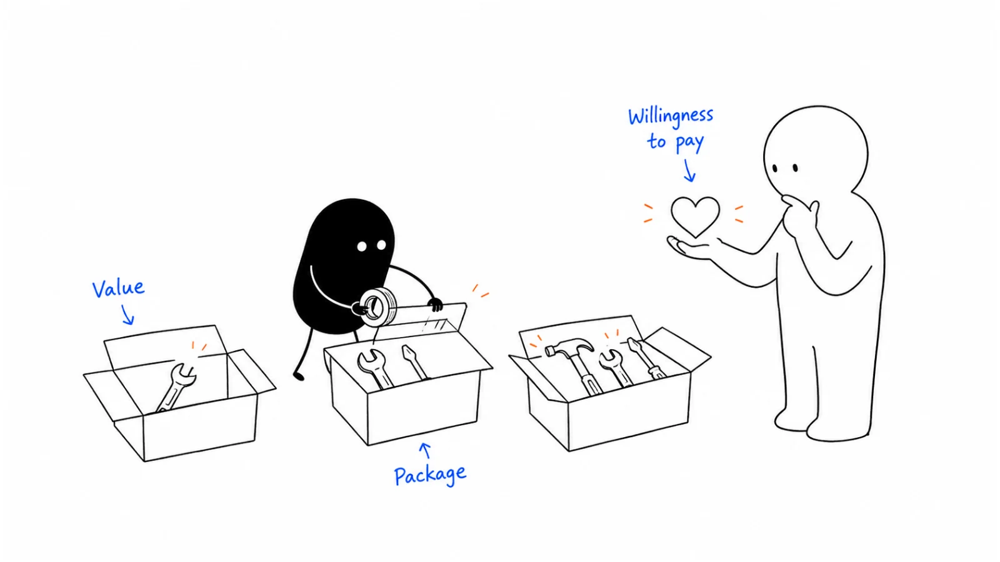

**Last reviewed:** 2026-09-07 · **Reading edit:** 2026-09-07

“Is that per person, per request, or for the whole team?”

The founder has just quoted a monthly price. It sounded straightforward until the buyer asked what happens when another department joins, a request needs rework, or the team has nothing to submit for two weeks.

The number was ready. The offer was not.

Pricing and packaging decide what someone is buying, how the bill changes, and what both sides are committing to. They also shape how people use the product and how much work your team must do to deliver it.

You do not need a perfect model before making an offer. You need a version that a buyer can understand, your team can deliver, and you can learn from without quietly changing the agreement afterward.



*Follow a concrete offer from its scope and billing unit to a quote, a buyer response, and a decision about what to change.*

**Jump to:** [the running example](#the-offer-we-will-price) · [finding a starting price](#how-to-do-it) · [choosing the unit](#utility-metric-test) · [packages](#build-packages-around-different-needs) · [the worked quote](#how-a-filled-price-card-reads) · [price objections](#find-out-what-too-expensive-means) · [copyable records](#copyable-templates).

## Use this when

You can explain the product but struggle to explain the bill. People use it without a clear path to payment. A few customers pay very different amounts for apparently similar work. Or a new AI capability has made the old relationship between seats, usage, and delivery cost less comfortable.

This guide also applies to an assisted service or a paid pilot. Calling something software does not remove the human effort needed to provide it.

Start with one offer for a recognizable buying situation. You can examine a larger portfolio later; beginning with every possible customer and every possible plan makes the basic decisions harder to see.

## Do not use this when

If you have no clear task or potential buyer, work on [idea validation](../01-strategy-and-buyers/idea-validation.md) alongside an early commercial hypothesis. You can discuss willingness to pay before an ICP is fully settled, but a number without a defined offer tells you little.

If you need tax treatment, revenue-recognition policy, jurisdiction-specific contract language, or regulated procurement terms, involve the qualified owner. This guide explains commercial design, not how to resolve those requirements.

If the immediate job is presenting an already decided offer, use [pricing page](../07-website-and-conversion/pricing-page.md). A polished table cannot resolve an unclear billable unit or an unprofitable delivery promise.

## The offer we will price

The running example is fictional. It continues the request-preparation business from the earlier articles. All prices, costs, quotes, and buyer conversations in this scenario are invented for teaching. They are not Lensmor pricing or actual customer results.

The business assists operations teams with preparing one supported type of record-correction request for engineering review. It organizes information and helps follow up on missing details. Customer engineers still decide whether and how to execute the change. The service does not alter production records.

Earlier exercises produced useful handoffs, and one company paid for a bounded assisted pilot and returned with another batch. Human involvement remained substantial. We have not established that self-serve software delivers the same result independently.

The current question is how to offer this work to another relevant team without promising unlimited preparation, unlimited support, or a guaranteed engineering outcome.

A workspace subscription, a fee per prepared request, and a fixed-price batch are all possible starting hypotheses. None becomes right merely because another software company uses it.

<a id="operating-method"></a>

## How to do it

### Separate the decisions before choosing a number

A **package** defines what is included: capabilities, capacity, service, support, and important limits. A **billing unit** defines what is counted, such as a paid user, workspace, request, or measured outcome.

The **rate** is the amount charged for that unit or package. The **term** defines the period of the commitment. **Payment timing** determines when money is due. A monthly price displayed under an annual commitment is not the same offer as a cancelable monthly subscription.

A **value driver** is a reason the customer cares about the result. It does not have to be identical to the billing unit. A product might save coordination work while charging per workspace because that makes the bill easier to understand.

Separating these decisions helps diagnose problems. If a buyer dislikes unpredictable charges, reducing the unit rate may not solve the issue. If a package includes work they do not need, a different scope may help more than a discount.

<a id="step-1-charge-sooner-than-feels-polite"></a>

### Learn about payment while the offer is still small

Positive feedback and willingness to buy are different observations.

Ask how the team currently pays for the work, which budget could cover an alternative, and what would have to be true for an evaluation to be worth funding. Then, when you can responsibly deliver a defined offer, make a real proposal.

An interview question is not an order. “That sounds reasonable” is not an approved budget. A signed pilot with a payment obligation is stronger commercial evidence, but still does not establish repeat demand or sustainable economics.

Free access can be a deliberate choice. You might be testing a workflow, building a collaboration network, or offering a limited self-serve entry point. Name the purpose, cost, and evidence that would justify continuing. You do not need to apologize for research; you do need to avoid treating free participation as proof of a paid business.

For the fictional service, asking a company to pay for a bounded batch can reveal whether preparation is valuable enough to buy. Offering an undefined “early access” month would mix together product learning, service work, and commercial expectations.

**Founder:** “Would you pay for help preparing these requests?”

**Operations lead:** “Possibly. What would you take off our plate, and what would we still do?”

**Founder:** “We would organize the agreed request information and assist with missing details. Your team supplies the permitted inputs, and your engineers still review and execute.”

**Operations lead:** “Then quote a small batch with those responsibilities. A general monthly subscription is harder for me to evaluate right now.”

The buyer has not accepted a price. They have helped define an offer that can receive a meaningful yes or no.

<a id="step-2-charge-more-than-the-founders-gut"></a>

### Build a starting range from three kinds of information

Look at the customer's alternatives, the importance of the result, and your delivery economics. Each answers a different question.

**Alternatives** tell you what the buyer could do instead. The current process may be a form and internal effort rather than another paid product. A competitor's list price is useful context only if you also understand its scope, service, commitment, and likely total cost.

**Value** tells you why a change might matter. Examine a recent task, its frequency, and what happens when it goes badly. Do not turn every hour of possible time savings into a guaranteed budget reduction. People may use saved time for other work without reducing cash spending.

**Cost** tells you what it takes to provide the offer. Include the work you would otherwise forget: setup, review, exception handling, support, infrastructure, model usage, and payment-related costs where relevant. Founder time may not appear as an immediate payroll outflow, but it is not unlimited free capacity.

These inputs give you a range to investigate, not a formula for the correct price. A cost estimate does not prove willingness to pay. A large theoretical benefit does not mean your product creates all of it or that the buyer will share a fixed percentage with you.

For an early assisted offer, inspect both an ordinary task and a difficult one. If difficult requests take several times longer, an average can hide a delivery commitment you should narrow.

You can test a higher price when the evidence supports it. You can also change scope, simplify the unit, improve delivery, or decide that the segment is not viable. Automatically raising the quote on every next deal confuses price learning with differences between buyers.

### Keep the experiment understandable

Record the offer version, who received it, the relevant conditions, and what happened. If you change price, scope, term, and onboarding together, a different response will be hard to interpret.

You do not need to run a statistical experiment before issuing an early quote. You do need to avoid concluding that one acceptance proves you underpriced or one refusal proves the offer is too expensive.

Surveys can help explore expectations and language. Hypothetical willingness to pay is still different from a purchase under actual constraints. A person may like a number and be unable to approve it.

Use interviews to learn why, proposals to test a real commitment, and delivery to discover whether the business can sustain what it sold. Keep all three in view.

<a id="step-4-pick-a-metric-that-matches-value-not-what-is-easy-to-count"></a>
<a id="utility-metric-test"></a>

## Choose a unit the buyer can understand and you can operate

A unit needs to do more than sound aligned with value.

Can the customer estimate the bill before committing? Can both sides inspect what was counted? Does the unit behave sensibly as use grows? Can your systems handle duplicates, corrections, and exceptions?

For the fictional service, compare a few possibilities before selecting one.

| Candidate unit | What might make it useful | What needs investigation |
|---|---|---|
| Paid user | Familiar when each person regularly uses the product | Occasional reviewers may add little work or value but create extra charges |
| Workspace or team | A predictable budget for a shared process | Different teams may generate very different delivery workloads |
| Submitted request | Easy to connect to visible activity | Duplicates, unsupported inputs, and incomplete requests can create disputes |
| Prepared handoff | Closer to the service's deliverable | “Prepared” needs a definition; engineering approval remains outside the offer |
| Fixed scoped batch | A bounded evaluation with a known commitment | Batch size, complexity, review rounds, timing, and excess work must be explicit |

None of these units is universally good or bad. Per-seat pricing can discourage inviting occasional collaborators, but it can also be understandable for a product whose value and service load grow with regular users. Usage pricing can support gradual adoption while creating uncertainty for a budget owner.

For this early example, a fixed scoped batch is a reasonable hypothesis because the work is still assisted and variability is not well understood. It is not a conclusion that every service should charge by batch.

### Define the event that creates a charge

“Per request” sounds clear until one request is submitted twice, reopened, split into three, or rejected as unsupported.

Write the rule using examples. Does a draft count? Does a failed attempt count? What happens when your team caused the error? How is rework distinguished from new scope? Who can inspect or challenge the count?

For a recurring product, also define the period and how changes during it are treated. A buyer should not need to infer whether a new user is billed immediately, at renewal, or according to a peak or average count.

Manual quoting can be useful while you learn, but manual does not mean arbitrary. Give the buyer a written scope and price, keep a record of the agreed count, and confirm changes before doing extra billable work.

### A documented example: Coda separates participant roles

Coda's [billing and pricing guide](https://help.coda.io/hc/en-us/articles/39555725230989-Billing-and-pricing-basics?ref=b2b-playbook), checked on **September 7, 2026**, describes Maker billing for its paid workspaces: Doc Makers are charged, while editors and viewers are free. The same page distinguishes bundled Superhuman subscriptions, which have a different billing-management route.

This is a documented role-based design, not evidence that the model causes growth or that every collaborator in every Coda-related bundle is free.

The useful question for your own product is whether different participant roles create sufficiently different value or workload to deserve different treatment. Answer that from your business rather than copying Coda's labels or prices.

## Treat AI outcome pricing as a definition problem

“Pay for results” is attractive language. It also raises difficult questions about what counts as a result and who can verify it.

An AI-generated response is not necessarily a completed customer task. A prepared handoff is not necessarily an approved production change. A lead that matches configured criteria is not necessarily a closed customer.

Choose a billable event you can describe honestly and observe reliably. Explain the role of human review, what happens after a retry or correction, and whether a later event reverses the charge. Keep a business outcome separate from a proxy used for billing.

Intercom's [Fin AI Agent outcomes documentation](https://www.intercom.com/help/en/articles/8205718-fin-ai-agent-outcomes?ref=b2b-playbook), dated **July 30, 2026** and checked September 7, distinguishes resolutions from other billable outcomes. Its resolution definition includes confirmed and assumed resolutions, with further rules about subsequent requests for help. It also describes configured procedure handoffs as a separate outcome type.

Those definitions illustrate why the label alone is insufficient. They are Intercom's published billing rules for the stated product context, not proof of customer satisfaction or a template to apply unchanged.

For the fictional request-preparation service, charging for “successful production corrections” would connect the bill to work the customer's engineers control and the service does not execute. A scoped preparation deliverable is easier to describe accurately at this stage.

### Make variable costs and budget control visible

An AI product can incur cost for work that never becomes a billable success. Retries, long inputs, additional checks, and human review all matter to delivery economics.

You do not have to expose every internal cost unit to the buyer. You do need a commercial model that can absorb the costs you expect and handle exceptional usage without surprise.

If you sell credits, explain what consumes them, how the customer sees the balance, and what happens when they run out. If rates differ by action or model, show a few realistic examples. A credit is not self-explanatory merely because it has a simple name.

Distinguish a usage alert from a hard spending limit. An email notification does not stop charges. A hard limit may interrupt work, so explain what pauses, what remains accessible, and who can authorize more usage.

<Accordion title="Should an AI product stop charging per seat?">

Not automatically. An AI capability can change the amount of work each person does, but it does not settle who receives value, how the buyer budgets, or what creates your delivery costs.

Compare seats, usage, fixed packages, and hybrids against the actual job. A seat model may remain understandable when people use the product regularly. A usage component may help when a small number of users can generate highly variable workload. A fixed allowance can provide some predictability while still limiting exposure.

Test realistic bills and behavior. Would people avoid inviting a necessary reviewer? Could a routine automated task create an unexpected charge? Would a more productive team reduce the very seat count on which the offer depends? Those are questions to investigate, not proof that one model has already won.

</Accordion>

<a id="step-3-keep-the-first-offer-stupid-simple"></a>

## Build packages around different needs

A package should let a buyer recognize a suitable offer, not force them to decode your internal feature taxonomy.

Start by asking whether you are seeing genuinely different needs. Some teams may want an occasional assisted batch. Others may have recurring work that justifies a standing service. A larger account may require a deployment or support arrangement you do not yet offer.

Those are different possibilities, not automatic instructions to create three public tiers.

For the fictional business, begin with the supported pilot. Treat ongoing service as something to design from observed recurrence and delivery effort. Treat an unsupported enterprise requirement as a product and operating decision, not a reason to invent a high-priced box on the website.

An entry package still needs to complete a useful job. Removing the capability needed to obtain any result may produce a cheap plan that nobody can meaningfully use.

At the same time, you do not need to include every costly service in a standard plan. Distinguish a repeatable product capability from bespoke implementation, dedicated assistance, or exceptional support. Explain the boundary before purchase.

### Decide what belongs in the core, an add-on, or a separate offer

Use the relationship to the customer's task.

If most suitable buyers need something to complete the basic job, it is a strong candidate for the core. If only some need a distinct extension, an add-on may be easier to understand. If the work changes the delivery model substantially, a separate scoped offer may be more honest.

Do not turn basic safety into a deliberately unsafe cheaper experience. Additional governance or administration can serve different organizational needs, but every supported offer still needs to meet its own security and service commitments.

An annual agreement, extra capacity, and a higher service level are also different changes. Avoid combining them into a single “Enterprise” label without explaining what the buyer receives.

A small business can have one standard offer and a clear process for exceptions. A business serving different needs can justify several packages early. The useful measure is whether the distinctions help people choose and whether you can maintain them, not whether you have reached a particular customer count.

<a id="how-a-filled-price-card-reads"></a>

## Walk through a quote and its economics

Here is an invented pilot proposal for the running example. It is a commercial teaching draft, not ready-to-sign contract language.

**Price:** &#36;900 for one scoped assisted batch of up to ten eligible requests, processed within an agreed twenty-working-day window after the agreed prerequisites are ready.

**Included:** One supported request type, a setup session, preparation of the agreed handoffs, one consolidated review round per request, and a closing review of the pilot.

**Customer responsibilities:** Supply permitted information, identify a reviewer, respond to required clarifications, and retain responsibility for approval and production execution.

**Not included:** Unsupported request types, production changes, unlimited revision rounds, or an open-ended service commitment.

**Change handling:** Extra requests or materially different work need a revised scope and written agreement before the work begins. The proposal must also state how delays, unused capacity, payment, cancellation, and any remedy are handled; those terms are not settled by the headline price.

The point is not that ten requests or &#36;900 is correct. It is that the buyer and delivery owner have something specific to evaluate.

### Check the work hidden inside the quote

Suppose the internal planning estimate is:

| Direct delivery item | Invented assumption | Estimated cost |
|---|---|---|
| Setup | 3 hours at &#36;60 per hour | &#36;180 |
| Request preparation | 10 requests, 30 minutes each, at &#36;60 per hour | &#36;300 |
| Pilot support and closing review | 1 hour at &#36;60 per hour | &#36;60 |
| Infrastructure and other direct delivery allowance | Estimate for this batch | &#36;60 |
| Total | Before acquisition and shared overhead | &#36;600 |

At a price of &#36;900, the difference is &#36;300, or about 33.3% of the price, before acquisition costs and shared overhead. This is a simplified contribution calculation, not net profit or an accounting classification.

Now suppose preparation takes one hour per request rather than thirty minutes. That adds &#36;300. The same offer produces no contribution before the excluded costs.

This does not tell you to double the price immediately. It tells you to investigate the request mix, rework, scope, process, and rate. Perhaps the package admits work that is too variable. Perhaps the delivery method needs improvement. Perhaps buyers will pay more. Those are different hypotheses.

Setup may not repeat for a later batch, but do not assume all later work becomes cheap. Continued support and exceptions can replace the initial effort. Measure them.

**Delivery lead:** “The pilot price works if each request takes about half an hour.”

**Founder:** “The last difficult one took more than an hour. Is that an exception we can identify before accepting it?”

**Delivery lead:** “Sometimes. We need a clearer eligibility check and a rule for work outside the agreed request type.”

**Founder:** “Then let's fix the scope and record the actual effort. A higher number would not, by itself, make unlimited work manageable.”

### Show the bill at more than one level of use

For a subscription or usage offer, write example invoices for a quiet period, an ordinary period, and a busy one. Include minimum commitments, included allowances, overages, and any separately charged service.

Be precise about tiered rates. Stripe's [tiered-pricing documentation](https://docs.stripe.com/subscriptions/pricing-models/tiered-pricing?ref=b2b-playbook) distinguishes **volume pricing**, which applies the selected band rate to the whole quantity, from **graduated pricing**, which prices each band separately.

In an independent invented example, the first ten units are listed at &#36;5 and units above ten at &#36;3. Twelve units would cost &#36;36 under an all-units volume rule, but &#36;56 under a graduated rule: ten times &#36;5 plus two times &#36;3. A table of rates without the rule is ambiguous.

Check the boundaries too. Under that volume example, eleven units cost less than ten. That may be intentional, but the billing behavior should not surprise either side. These are arithmetic illustrations, not recommended rates.

## Choose an evaluation offer deliberately

A free plan, a free trial, and a paid pilot answer different needs.

A **free plan** can provide continuing limited value. Decide who it serves, what it costs to support, and what might eventually justify a paid offer. Do not assume every free user is a failed sales opportunity.

A **trial** gives somebody a limited opportunity to evaluate the product. Explain what access ends, what happens to their work, and whether payment begins automatically. Give the customer a genuine chance to complete the task within the trial's conditions.

A **paid pilot** is a bounded commercial evaluation. Define the work, participants, useful result, cost, and decision at the end. Paying for it is not a promise to buy a larger contract, and finishing it is not automatic proof of success.

For the fictional assisted service, a paid pilot may cover genuine delivery work as well as learning. If you offer a free evaluation instead, estimate its cost and explain the reason. Do not hide the fact that the team is still doing manual work.

Some buyers will ask whether the pilot fee is credited toward a later purchase. You can agree to that when the economics and terms make sense. State the conditions rather than letting a casual sentence become an unlimited future credit.

Discounts, trials, and pilot fees also affect what your data means. A heavily assisted discounted pilot does not establish willingness to pay the standard subscription price for software-only delivery.

## Find out what too expensive means

A buyer may mean they have no budget, they do not see enough value, the commitment is too large, the bill is unpredictable, or another suitable option costs less.

Ask about the comparison without turning the question into a negotiation trick.

**Buyer:** “Nine hundred is more than we expected.”

**Founder:** “Is the issue the total commitment, the amount of work covered, or the comparison with doing it internally?”

**Buyer:** “We only have three relevant requests this month. I do not want to pay for ten.”

**Founder:** “Then the batch may be the wrong size. I can check whether a smaller scoped evaluation is viable, including the setup work that still needs to happen.”

The answer is not necessarily a discount on the same package. A smaller offer may be appropriate, but setup may make it uneconomic. You can explain that and decline rather than offering a low price you cannot support.

If the buyer believes the current process is adequate, ask what improvement they would need to justify switching. If there is no meaningful advantage, accept that result. A lower price does not make every workflow worth changing.

If the problem is uncertain spend, show a realistic bill or consider an allowance or limit. If the problem is the commitment period, consider whether a shorter evaluation is feasible. If the problem is trust, evidence and a bounded test may matter more than the number.

### Make concessions explicit

A concession changes the agreement. Record what changed, why, who approved it, how long it applies, and what happens afterward.

Reduced scope, a longer commitment, different payment timing, or a limited introductory rate can all be part of a negotiation. Do not assume that exchanging one for another automatically improves the deal; inspect the economics and the buyer's actual needs.

An annual prepayment can help cash timing while creating a delivery obligation. A discount can reduce contribution more than its percentage suggests. In the simplified pilot above, a 10% discount removes &#36;90 from the &#36;300 contribution, leaving &#36;210 if costs are unchanged.

Avoid invented deadlines, fake list prices, and a discount that is secretly the permanent default. They make learning harder and can undermine trust. A clear standard offer plus documented exceptions is easier to manage.

<Accordion title="Should we show a public price or require a sales call?">

Show enough information for a likely buyer to judge relevance and affordability. A standardized self-serve offer can often display a clear price and calculation. A genuinely variable implementation may require scoping before an exact quote is responsible.

“Contact us” should describe a useful process, not merely conceal a number. Explain what affects the quote, what the conversation will resolve, and any meaningful starting commitment you can state accurately.

You can combine public standard pricing with a separate route for unusual requirements. Be careful with a low “starting at” number that excludes work most customers will need. A buyer who cannot estimate the real commitment has not been helped by a technically accurate headline.

</Accordion>

<a id="step-5-put-a-revisit-on-the-calendar"></a>

## Change pricing without losing track of the agreement

A new offer for new customers and a change to existing customers are separate decisions.

For new quotes, give the offer a version and an effective date. Preserve quotes already issued and the terms under which they remain valid. Make sure the page, proposal, sales explanation, and billing setup agree.

For existing customers, inspect what they were promised and what their agreements allow. Work with the responsible commercial and legal owners on notices and transition terms. Do not silently apply a new rate to work already covered by another agreement.

You might retain the old offer for a period, migrate at an agreed renewal, or offer a choice of packages. There is no universal grandfathering policy that fits every business. Model the costs and explain the options clearly.

Design partners deserve an accurate account of what was temporary and what was committed. If early terms were ambiguous, resolve that ambiguity rather than treating the first customers as unimportant because future revenue might be larger.

### Test the transition as an experience

A migration is not finished when the pricing page changes.

Check the invoice preview, entitlements, seat or usage counts, alerts, and the behavior at a limit. Confirm what happens to saved work if a customer changes plans. Ensure support can explain the change and resolve mistakes.

Run test cases around the boundary: a mid-period change, an unused allowance, an overage, a duplicate event, a reversal, and an approved exception. Only implement the cases relevant to your model, but do not discover the obvious ones through a surprised customer's bill.

Keep the old and new definitions available to the people handling existing accounts. Retiring a public page should not erase the evidence of what somebody bought.

<a id="revisit-agenda-30-minutes"></a>

## Review one decision at a time

Choose a review point that fits the business and revisit sooner when something material changes: a different segment, a costly new workflow, repeated billing confusion, or delivery effort outside the assumptions.

Do not wait six months to investigate an obvious counting error. Conversely, do not redesign every package because one buyer negotiates.

A useful review asks what customers actually purchased, what they received, what it cost to deliver, and what happened when they had another relevant need. Include declined and stalled proposals, not only wins.

For the fictional service, an early review could focus on whether the batch definition predicts effort well enough to quote consistently. Another review might ask whether repeat customers need an ongoing arrangement. Those questions do not have to be settled together.

Write the change you will test and what you will hold constant. Keep a record of the old offer and a reason for the revision. “We felt cheap” is a hypothesis to investigate, not a complete pricing analysis.

## Metrics

Choose measures that distinguish buying, delivery, and billing clarity.

| Measure | What it can help you understand | What it does not prove alone |
|---|---|---|
| Accepted proposals among comparable proposals with decisions | Response to a defined offer | The optimal price or causal effect of the latest change |
| Realized price and documented concessions | What customers actually agreed to pay | Sustainable economics without delivery costs |
| Direct effort and cost by task or account | Variation hidden inside the package | Full profitability without acquisition and overhead |
| Repeated purchase or renewal when eligible | Continued willingness to buy | Why a customer stayed or left |
| Billing questions, corrections, and disputes | Whether the unit and rules are understood and working | That a low-priced offer is valuable |

Keep open proposals separate from decisions. A buyer still waiting for technical approval has not necessarily rejected the price. Compare like with like: scope, segment, term, service level, and offer version matter.

Distinguish booked value, invoiced amounts, collected cash, and recurring revenue. A one-time pilot does not become monthly recurring revenue because the work happens within a month. Payment timing can change cash flow without changing what the customer bought.

At small scale, show counts and inspect individual decisions. A couple of wins at a higher quote can be worth investigating without establishing a stable demand curve. Do not invent precision that the available evidence cannot support.

## Copyable templates

### Early price card

Use this before designing the public comparison table.

```text
OFFER AND PRICE CARD

Offer / version / owner / review date:
Buyer and task:
Current alternative:
What is included:
What remains with the customer:
Important exclusions:

BILLING

Unit and exact counting rule:
Rate / fixed fee / allowance:
Examples at low, ordinary, and high use:
What happens at a limit:
Rework, retries, duplicates, and corrections:
Commitment period:
Payment timing:
Terms source and approval owner:

ECONOMICS AND EVIDENCE

Expected direct delivery effort and cost:
Higher-effort scenario:
Acquisition and overhead not included:
Why the result may be worth buying:
Evidence behind that explanation:
What is still a hypothesis:

NEXT TEST

Who will receive this offer:
What we are changing:
What we are holding constant:
What response and delivery evidence we will collect:
Next decision and review point:
```

For a live conversation, preserve the actual proposal and response separately:

```text
QUOTE LEARNING RECORD

Account / date / offer version:
Relevant scope and buying conditions:
Quoted amount, unit, term, and payment timing:
Included service and customer responsibilities:
Evidence the buyer reviewed:

RESPONSE

Accepted / declined / still open:
What the buyer actually said:
Our interpretation, kept separate:
Budget, value, scope, predictability, timing, or other issue:
Concession requested:
Change agreed and approving owner:
Open approvals or questions:

AFTER DELIVERY, IF APPLICABLE

Actual work and assistance:
Costs and exceptions:
Useful result and unresolved issues:
Repeat need and purchase decision:
What this teaches us:
What it does not establish:
```

The [pricing-page working file](../../templates/pricing-page.md) is for presenting an offer after these decisions. Its plan-count prompt is a layout aid, not a reason to invent extra tiers or a universal limit on a product catalog. Do not overwrite an existing filled brief to run a pricing experiment.

<a id="pre-flight-checklist"></a>

## Before you start

- [ ] The buyer can identify what they receive and what they still do.
- [ ] The unit, term, and payment timing are distinct and understandable.
- [ ] A normal and a higher-effort delivery scenario have been considered.
- [ ] Example bills explain allowances, limits, and exceptional work.
- [ ] The commercial claim stays within the available evidence.
- [ ] Discounts and exceptions have an owner and a written boundary.
- [ ] Existing commitments are preserved and changes are communicated appropriately.
- [ ] The next review will use actual proposals and delivery observations.

## Common mistakes

**Choosing the number before defining the offer.** Price cannot make an undefined commitment clear.

**Assuming more expensive is always better.** Test the offer against buyers, alternatives, and economics rather than treating founder discomfort as a pricing model.

**Billing whatever is easiest to log.** A measurable event can still be confusing, unfairly counted, or unrelated to what the buyer thinks they purchased.

**Hiding service work inside software economics.** Human preparation and support need capacity and cost estimates even when the interface looks automated.

**Using discounts to repair every objection.** Scope, uncertainty, timing, and lack of value are different problems.

**Treating early agreements as disposable.** A future model does not erase the promises you already made.

## What to read next

Use [positioning](https://b2-b-playbook.mintlify.app/playbooks/02-product-marketing/positioning) to explain the relevant alternative and advantage, and [sales enablement](https://b2-b-playbook.mintlify.app/playbooks/02-product-marketing/sales-enablement) to handle the commercial conversation accurately. Use [pricing page](../07-website-and-conversion/pricing-page.md) to present the finished offer.

Next, continue with [demo](https://b2-b-playbook.mintlify.app/playbooks/02-product-marketing/demo): show the buyer enough of the actual experience to judge whether the proposed commitment makes sense.

For the broader relationship between price, acquisition, and delivery, see [four fits](../01-strategy-and-buyers/four-fits.md). For early paid evaluations, keep [first ten customers](../01-strategy-and-buyers/first-ten-customers.md) and [product launch](https://b2-b-playbook.mintlify.app/playbooks/02-product-marketing/product-launch) aligned with what you can deliver.

## Sources and evidence boundary

This is an owner-maintained operating synthesis. The assisted-service scenario, conversations, quotes, cost assumptions, calculations, and copyable records are original fictional teaching material. They are not benchmarks, actual Lensmor prices, or accounting advice.

The earlier short edition drew on founder interviews collected in [Lenny Rachitsky's Scaling your growth engines, October 24, 2023](https://www.lennysnewsletter.com/p/scaling-your-b2b-growth-engine?ref=b2b-playbook). That remains background, not evidence that every founder underprices or that every next quote should increase. Extended company anecdotes and borrowed pricing prescriptions are not reproduced here.

Coda and Intercom's linked documentation provide dated observations of published billing designs, not measured commercial-outcome cases. Coda's standalone Maker model is not generalized to its bundled offerings. Intercom's stated outcome rules are not treated as proof of customer satisfaction. Stripe's documentation supports the distinction between volume and graduated calculation; the numerical example here is our own.

Sources checked on September 7, 2026. Product-specific terms can change. Tax, invoicing, contract, and accounting decisions require the relevant current rules and qualified owners.

---

Copyright © 2026 Ivan Xu. All rights reserved. See the [copyright and reuse terms](https://github.com/weilun88313/B2B-Playbook/blob/main/LICENSE).

Canonical source: [github.com/weilun88313/B2B-Playbook](https://github.com/weilun88313/B2B-Playbook)
