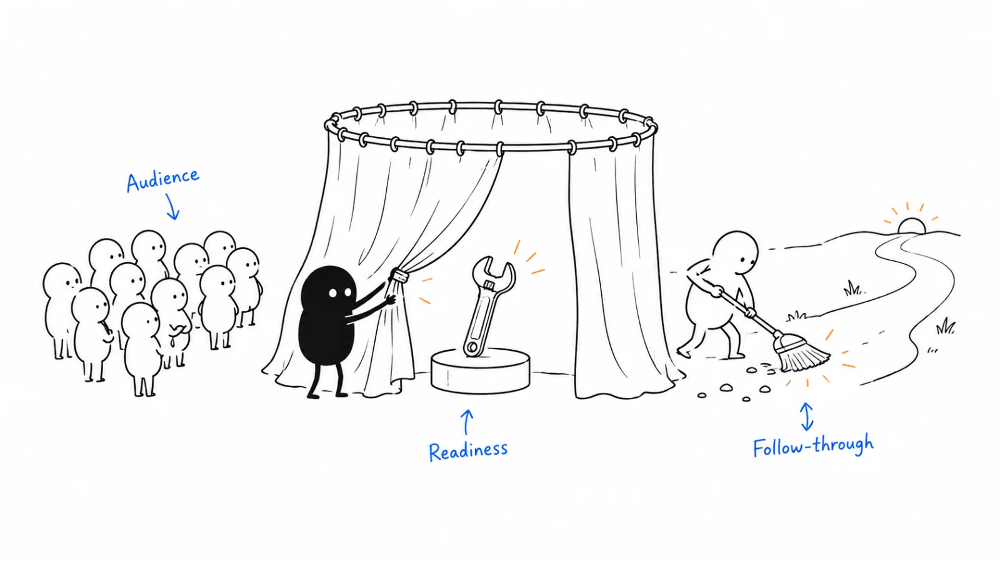

**Last reviewed:** 2026-09-07 · **Reading edit:** 2026-09-07

The announcement is ready. The founder has a post scheduled, the landing page looks good, and a few friendly people have agreed to take a look.

Then someone asks, “What happens if ten companies want to start tomorrow?”

One person thinks they will get a self-serve trial. Another expects to book a call. The person doing onboarding can take two new accounts this week. Nobody has checked what the confirmation email promises.

This is where a product launch becomes more than a piece of communication. You are inviting people into an experience. The announcement, the offer, and what happens after someone responds need to agree.

A useful launch makes a relevant change understandable and gives the right people a workable next step. It may be a small invitation to existing customers, a limited pilot, or a wider introduction. The size of the audience is a choice, not the definition of a launch.



*Work from the invitation backward: what are people being offered, who can use it, and can you deliver what they expect?*

**Jump to:** [the running example](#worked-example-illustrative) · [choosing the scope](#how-to-do-it) · [readiness](#check-the-whole-path-before-you-announce) · [launch day](#run-launch-day-around-the-customer-path) · [measurement](#metrics) · [copyable plans](#copy-launch-card-fill).

## Use this when

You are introducing a product, opening access to a service, releasing a meaningful capability, or bringing an existing offer to a new group of buyers.

Perhaps the product has already shipped and almost nobody knows about it. Perhaps customers know the feature exists but have never found a reason to use it. Or the launch plan is full of assets while the intended customer action is still vague.

Start with the change you want a particular audience to understand. Then follow that audience from discovery to the first useful result.

## Do not use this when

If you are still unsure what problem you are addressing, a large announcement is unlikely to resolve that uncertainty. Work through [idea validation](../01-strategy-and-buyers/idea-validation.md) and make a smaller invitation you can learn from.

You do not need ten paying customers, a complete brand strategy, or perfect positioning before inviting anyone in. An early pilot can have a launch. It needs an honest description of what is ready and what participants are helping you discover.

If the job is to notify customers of a required migration, a service interruption, or a contractual change, plan that communication around the actual obligation and operational risk. A promotional campaign is not a substitute. A cosmetic improvement may only need a changelog entry and updated documentation.

For the mechanics of a particular channel, use its guide: [Product Hunt](../04-channels-and-distribution/product-hunt.md), for example, is one possible distribution choice, not another name for launching.

<a id="words-you-will-use"></a>

## A few useful terms

A **release** makes a change available in the product. A **rollout** determines who receives it and when. A **launch** introduces that change to an audience and helps people act on it. These can happen on different dates.

**Early access**, **beta**, and **general availability** need explanations in your own offer. A label alone does not tell a buyer about eligibility, support, pricing, reliability, or what happens when the early period ends.

A **launch tier** is an internal agreement about effort and coordination. It does not certify product quality. An **activation event** is an observable step toward receiving value; it needs a definition appropriate to the product, not just an event named “activated.”

The **launch owner** keeps the overall plan coherent. That person may be the founder or product marketer. They do not have to perform every task, but somebody must be able to resolve conflicting promises.

<a id="one-rule"></a>

## Keep this in mind

Read your call to action as if you were the customer.

“Start today” sounds different from “Apply for an assisted pilot.” “Available now” sounds different from “Join the waiting list.” A polished page does not remove those differences.

Before asking more people to respond, make sure you understand what responding will get them. This is especially important when a product combines software with people doing work behind the scenes.

<a id="teaching-fill-inventednot-a-customer"></a>
<a id="worked-example-illustrative"></a>

## The small launch we will follow

The running example is fictional. It continues the request-preparation business from the earlier articles. Its conversations, capacity, plans, and results are teaching examples, not claims about Lensmor or another real company.

The business helps operations teams prepare one supported type of record-correction request for engineering review. It organizes information and helps follow up on missing details. The customer's engineers still review the request and decide how to execute the change. The service does not make production changes.

Earlier exercises produced usable handoffs, and one company paid for a bounded assisted pilot and returned with another batch. Human involvement remained substantial. That is a reason to investigate further demand for the assisted offer, not proof that self-serve software is ready.

For this launch exercise, suppose the founder can responsibly onboard two additional accounts during the first week. That is a staffing constraint we have invented for the scenario, not a recommended cohort size.

The invitation will go to operations leads dealing with this recurring request type. Interested companies will discuss fit, review the scope and pilot terms, and agree on a permitted way to supply the necessary information. Nobody gets asked to upload production credentials into a public form.

The goal is to find out whether new, relevant teams will pay for the bounded offer and obtain a useful first handoff under the stated delivery conditions. A large mailing list would be a different result.

<a id="operating-method"></a>

## How to do it

<a id="step-1-decide-if-it-is-launch-worthy-then-pick-a-tier"></a>

### Start with the change in the customer's working day

A list of shipped features is raw material. It is not yet a reason for someone to stop what they are doing.

For the fictional offer, “new request workspace, status view, and missing-field checks” describes components. An operations lead is more likely to care about assembling a request that an engineer can review without first hunting through several messages.

Even that description needs a boundary. The service can help organize missing information; it cannot guarantee another department will provide it. Launch copy should not turn a useful improvement into a promise to eliminate every delay.

Write down the old situation, the relevant change, and what the person could do next. If those sentences are difficult, spend time with the offer before commissioning a video.

For an existing feature, you might discover that the important change is simpler than expected. An administrator can now assign a reviewer without asking support. That may deserve a targeted message to administrators and an updated help page, even if it does not justify a company-wide campaign.

### Choose the audience and the amount of effort together

A launch for existing users has different work to do from a launch for people who have never heard of you. Existing users may need to know where a feature moved, whether it costs more, and how it affects their current process. New buyers may first need to understand the problem and trust the supplier.

Use the audience and the delivery risk to choose the scope.

| Situation | Sensible first invitation | Work that matters most |
|---|---|---|
| A small improvement for current users | Notify the people whose work changes | Accurate instructions, access, and support answers |
| A capability for an existing customer segment | Invite eligible accounts to try a relevant task | Entitlements, a task-specific example, and adoption follow-up |
| An assisted offer with limited capacity | Invite a manageable group to discuss fit | Honest scope, qualification, scheduling, and delivery |
| A new product ready for broader access | Introduce it through channels that reach likely users | Clear positioning, reliable onboarding, and operational coverage |
| A new enterprise deployment option | Approach accounts with that requirement | Technical evaluation, commercial terms, and implementation readiness |

There is no required number of “major” launches per year. A large company with several product lines and a small service business have different calendars.

If your team uses T1, T2, and T3, define what each means locally. Write the staffing, spending, and approval implications beside the label. Two people can agree that something is “T2” while imagining completely different budgets.

**Founder:** “Could we make this our big public launch? We have been working on it for months.”

**Operations lead:** “We can introduce it publicly. But we can only onboard two more accounts this week, and we still do part of the preparation ourselves.”

**Founder:** “Then the page should invite people into that offer, not imply instant software access.”

**Operations lead:** “Yes. We can accept inquiries beyond those places, explain the next available start date, and stop accepting starts we cannot support.”

This preserves the possibility of public attention without creating an imaginary unlimited service.

<a id="step-2-write-gaccs-and-launch-positioning-before-production"></a>

### Write the offer before the asset list

For this example, a working description might be:

**Assisted preparation for recurring record-correction requests.** We help your operations team assemble the information your engineers need to review one supported request type. Your engineers remain responsible for approval and execution. Start with a scoped paid pilot; we will confirm fit and the available start date before you commit.

This is a draft, not a universal headline. Its useful feature is that a buyer can see the job, the responsibility boundary, and the next step.

Before production, also resolve the questions that are easy to hide in a meeting:

- Which request types and customer environments are supported?
- What does the pilot include, and what would require a different agreement?
- Is access immediate, scheduled, or subject to a fit check?
- What is paid, free, or still undecided?
- What information will participants supply, through which approved route?
- Who will answer questions, and what response timing can they actually meet?

If the commercial terms are not ready, you can invite research conversations. Do not describe that as an offer someone can already buy.

The [product launch working file](../../templates/product-launch.md) uses GACCS: goals, audience, creative, channels, and stakeholders. You can use those fields as a short brief. “Creative” can mean the useful explanation or demonstration you will show; it does not require a large creative campaign.

The same file asks for a parent “perception.” Read that as the idea about your business this launch should reinforce. For the fictional offer, it could be that request preparation is a distinct job worth improving. You do not need to invent an annual narrative system before testing a small offer.

## Check the whole path before you announce

Imagine a qualified operations lead clicking through from a recommendation. They are not evaluating only your headline. They will encounter a page, a form, a confirmation, perhaps a conversation, and then a working process.

Test that sequence with the access level a new prospect actually has. Being logged in as the founder can conceal a broken permission or a missing onboarding step.

A useful rehearsal follows one realistic task. Submit a test inquiry without sensitive customer information. Check where it lands, who receives it, what the person is told, and whether the owner can deliver the next promised step. Remove the test record or label it so it does not inflate launch reporting.

| Part of the path | What to check | What would change the launch decision |
|---|---|---|
| Public page | Scope, eligibility, price or buying route, and availability agree | Copy promises a capability or start date you cannot provide |
| Inquiry or signup | A new visitor can complete it; confirmation arrives | Lost submissions, incorrect routing, or misleading confirmation |
| Access and permissions | The intended user receives only the intended access | Unauthorized access or exposure of customer information |
| First task | Instructions and help lead to a usable output | The core task fails without intervention you cannot supply |
| Commercial handoff | Buyers can inspect and accept the actual offer | Different teams quote incompatible scope or terms |
| Support and recovery | A named person can respond and pause intake if needed | Nobody can help affected users or correct a broken promise |

Not every imperfection blocks a launch. A missing decorative animation is different from a broken access boundary. Decide what must work for this specific invitation and who has the authority to stop it.

For the fictional assisted offer, human help is part of the agreed delivery, so human help is not itself a launch failure. Undisclosed human work, uncontrolled access to customer data, or an unmanageable queue would be different problems.

### Rehearse an exception, not just the happy path

What happens when a request is unsupported? When the buyer cannot share the necessary information? When a paid participant has no suitable task ready this week?

Write the answer before those situations arrive. It could be a fit conversation, a rescheduled start, a narrower scope, or declining the work. Any commercial remedy should follow the terms you have actually agreed, not a promise improvised by the person answering chat.

**Product lead:** “The request view works. I think we are ready.”

**Marketing lead:** “The sample works with your account. Can someone from another company reach it through the invitation we are sending?”

**Product lead:** “Their access still needs manual setup. The email currently tells them to start immediately.”

**Marketing lead:** “Let's change that email to the confirmed setup process and rehearse it with a fresh account before we send.”

The problem was not that the product needed every planned feature. The problem was that the next step described to the user did not exist yet.

For an AI-enabled product, inspect the handoff between generated output and human responsibility. Show what the system does when information is incomplete. Do not turn one successful demonstration into “handles any request.” If the launch depends on a particular integration or model configuration, check that the promised experience uses it.

<Accordion title="Should we delay the launch if part of the product is not ready?">

Ask whether the missing part is required for the offer you are making. If the invitation promises self-serve access and setup still requires a person, either make assisted setup explicit or wait. If a planned reporting view is absent but the agreed task works without it, the narrower launch may still be reasonable.

Separating release and announcement dates gives you options. You can roll out quietly, learn from permitted early users, and announce more widely later. You can also announce a future availability date, provided the status and uncertainty are clear and you can manage the commitment responsibly.

Delay or narrow the invitation when you cannot deliver the core task, protect the intended access boundary, or support the users you are inviting. When a delay affects someone who has already made plans, tell them directly what changed and what options they have. Silently editing the launch page is not enough.

</Accordion>

<a id="step-3-align-internally-use-the-ecosystem-not-a-press-prayer"></a>

## Give each channel a specific job

Choose channels by the people and decisions they can reach, not by how many finished assets they let you report.

For the fictional launch, the founder might begin with relevant people already in conversation, then publish a demonstration that those people can inspect or forward. A community post could be useful if the community welcomes this kind of contribution. A broad promotion is less useful if most of its audience cannot supply the supported request type.

That is a starting hypothesis about this example, not a rule that founders should always launch through personal contacts.

For each proposed channel, answer three questions: who is likely to encounter this, why would they care now, and what should happen after they respond? If you cannot answer, reduce the commitment until you have a way to learn.

An existing-customer email might invite eligible administrators to enable a feature. A founder post might explain the problem and link to a worked example. A partner demonstration might help buyers understand how two products work together. Those materials can share a promise without being identical copies.

### Prepare people who may help you explain the offer

If a customer, partner, or creator wants to participate, give them time to try the relevant experience and ask questions. Agree on what can be shared. A customer permitting a private reference call is not automatically permitting a public logo, quote, or screenshot.

Avoid writing an endorsement and presenting it as someone else's unprompted opinion. If there is a commercial arrangement, handle its disclosure appropriately. Do not ask people to manufacture engagement or coordinate votes to make a launch appear more popular.

You also do not need everyone to publish on the same morning. A useful explanation after the initial announcement may reach people who missed it. The important coordination is about truthful scope, working links, and an understood next step.

Press can matter when there is a story relevant to a publication's readers. It is not guaranteed distribution, and lack of coverage does not mean an otherwise useful customer launch failed. Treat any planned press work as one route with its own audience and uncertainty.

### Make a small set of assets work well

For our example, the first version could consist of a clear offer page, one representative walkthrough, an invitation, and answers to the questions raised in fit conversations.

The walkthrough should show a supported request before and after preparation. Use invented or properly approved redacted material. Identify where a person checks information, what remains unresolved, and where the customer's engineer takes over.

A separate glossy video is optional. A buyer who needs to forward the scope internally may benefit more from a readable page than an impressive animation. Use [messaging](messaging.md) to adapt the explanation to the medium.

AI can help turn an approved brief into drafts, but inspect every version against the source offer. It is easy for “helps prepare a request for review” to become “automates request resolution” after a few rewrites. Dates, eligibility, pricing, data handling, and unsupported capabilities deserve a deliberate final check.

## Make availability visible

A reader should not need to click three times to discover that the product is unavailable to them.

Put the status near the invitation: who can start, what kind of access they get, and whether a human will confirm timing. If you cannot give a dependable date yet, say what you will communicate next rather than inventing precision.

In the fictional example, “Apply for an assisted pilot” is a more accurate button than “Start free.” The confirmation should explain the fit review and how the person will hear back. It should not announce that their workspace is ready if no workspace has been created.

A waiting list needs a purpose too. Are people waiting for capacity, a supported integration, or a product that is still being built? Those are different groups with different expectations. Record the reason where useful, avoid collecting unnecessary information, and provide a way to stop hearing from you.

### A documented example: Copilot's two availability announcements

GitHub's announcement on **June 29, 2021** introduced Copilot as a technical preview and said places were limited. The published next step was to sign up for that preview. See the [original announcement](https://github.blog/news-insights/product-news/introducing-github-copilot-ai-pair-programmer/?ref=b2b-playbook).

On **June 21, 2022**, GitHub announced general availability to individual developers and provided a commercial access route. See the [general-availability announcement](https://github.blog/news-insights/product-news/github-copilot-is-generally-available-to-all-developers/?ref=b2b-playbook).

The documented change is in availability and the invitation being made. These pages do not establish that a waiting list caused adoption, or that another company should wait the same length of time.

The practical lesson I take from these artifacts is to describe the access people can actually receive at each stage. They are historical communication examples, not current buying guidance or an independently verified launch-performance case study.

## Run launch day around the customer path

A launch owner needs a short operating view: what is going live, who can confirm it works, who is watching responses, and who can change the plan.

For a small launch, that may be one shared document and a few scheduled checks. A larger, multi-region launch may need separate coverage and escalation. Choose the arrangement that fits the work rather than borrowing the ceremony of a much larger company.

Before publishing, check the public page, access route, confirmation, demonstration, and availability one more time. Confirm that the people responsible for inquiries and onboarding are available. Then release the planned messages and observe actual attempts to respond.

Keep a brief issue record with the symptom, affected people, owner, and next update. “Three inquiry confirmations have not arrived” is useful. “Launch is going badly” gives nobody a task.

When something breaks, distinguish between stopping promotion, pausing new access, and changing the product rollout. They are different actions with different owners. Marketing should not improvise a technical rollback, and engineering should not assume that disabling a feature tells customers what happened.

**Buyer:** “I applied this morning. Can our team use it for tomorrow's batch?”

**Founder:** “The application is a fit check, not confirmed access. Our next supported start is next week. I can review the request type with you today.”

**Buyer:** “Then we will use our current process tomorrow. Please send the scope before we book anything.”

**Founder:** “I will. I will also make the timing more prominent on the application page so the next person does not expect a same-day start.”

The useful response is to clarify the promise and repair the source of confusion. The buyer has told you something valuable even if they do not begin immediately.

### Decide in advance what happens if interest exceeds capacity

More inquiries are not automatically a reason to accept more customers. Separate receiving interest from committing to a start.

For an assisted offer, publish realistic availability, qualify fairly against the stated scope, and offer later dates only when you can support them. Avoid fake scarcity. Two available onboarding places should mean two places you can actually deliver, not a counter that resets every morning.

For a software product, the constraint might instead be infrastructure, support coverage, or access approval. Define the relevant limit and the person who can authorize expansion. A launch plan that depends on nobody noticing the product is not ready for a larger audience.

<a id="step-4-own-momentum-after-day-one"></a>

## Follow the first attempt to a useful result

The most useful work after an announcement often happens away from the announcement itself.

Someone has signed up but cannot find the relevant task. An account has agreed to a pilot but needs permission to share information. An existing customer has access to the feature but no reason to change a process that works.

Contact people about the point they have actually reached. A second “we launched” email does not help a participant who is waiting for a setup answer.

For the fictional service, track whether a new account has confirmed the supported scope, supplied permitted information, received a prepared handoff, and had its engineer review that handoff. An account may reach the last stage and still find that the preparation was not useful enough. Record that judgment rather than counting delivery as automatic success.

Ask about what happened, using the recent task as the reference:

“What did the engineer still need to ask you?”

“Which part of this did your team do outside our process?”

“What would you use for the next request if we were not involved?”

These questions leave room for an inconvenient answer. They are more useful than asking whether the customer liked the launch.

### Keep non-starters in the picture

People who never start can reveal an expectation problem, an access problem, or simply poor timing. Do not treat all of them as failed onboarding, and do not delete them from the result.

In a follow-up, make it easy to say “not relevant” or “not this quarter.” If the person is still interested, ask what prevents the next step. Record whether that is your interpretation or something they actually told you.

For an existing-customer feature launch, separate customers who were eligible to use it from those who were not. Then look at exposure, attempts, completion, and repeat use for the relevant group. A low adoption rate across every account can be meaningless if only a small subset has the required workflow.

<Accordion title="What if the announcement gets attention but almost nobody starts?">

Trace the gap before changing the headline. Were the visitors plausible users? Did the page explain the offer? Could they access it? Did they have the necessary permission, data, time, or budget? Was the task relevant now?

Inspect a few actual journeys and ask willing respondents about the point where they stopped. A broken confirmation calls for a routing fix. Unexpected pricing calls for a clearer offer or a commercial decision. An audience that wants a different use case may justify another hypothesis, but it does not make the current offer validated.

You can revise distribution, narrow the audience, improve the first task, or stop the campaign. Make the revision explicit and note when it happened. Otherwise you will combine results from materially different offers and be unable to explain what changed.

</Accordion>

## Metrics

Choose the business question before looking at the dashboard. Are you trying to find qualified demand, help existing customers adopt something, support an expansion decision, or learn whether a new offer can be delivered?

Then define a primary outcome and the intermediate steps needed to interpret it. “Get adoption” is not a definition. Name the unit, qualifying behavior, eligible population, and observation window.

For the fictional assisted pilot, one outcome could be a new account completing a paid, in-scope task that its engineer judges useful for review. Also record assistance time and unresolved work. That combination prevents the team from calling an expensive, founder-rescued handoff evidence of effortless software adoption.

Here is a separate invented launch report. The numbers are illustrative, not targets or results from the earlier exercises.

| Stage at the review date | Invented count | What it tells us |
|---|---|---|
| Companies that inquired | 20 | Interest arrived; fit is not yet established |
| Companies that fit the stated scope | 8 | A smaller group has the relevant task and conditions |
| Fit companies that agreed to a paid pilot | 3 | Some willingness to buy the bounded offer |
| Paying accounts whose scheduled start has arrived | 2 | These accounts have had the opportunity to begin |
| Those accounts receiving a handoff judged useful | 1 | One completed useful result; the other account needs investigation |

Three of eight fit companies agreed to a pilot: 37.5%. That is different from three of twenty inquiring companies: 15%. Both can be correct if the denominator is stated.

One of two accounts due to start has reached the defined result. The third paying account has a later agreed start and should not be called an onboarding failure. It should remain visible as pending. None of these small counts establishes a stable conversion rate or product-market fit.

Do not force every launch into this funnel. An existing-account feature might be judged by a different task, and an enterprise launch may need more time before a buying decision can be observed.

Traffic, impressions, and event attendance can help diagnose reach. They do not establish usage. Bookings and pipeline need definitions too: a meeting request is not a qualified opportunity, and an opportunity is not revenue.

Finally, distinguish activity after the launch from activity caused by it. A customer may already have been evaluating the product. Compare with prior patterns where helpful, ask how people found the offer, and retain uncertainty. Without a suitable comparison, describe the result as observed during the launch period rather than claiming all of it as incremental lift.

## Turn the review into a decision

A useful review ends with something the team will do differently.

For the example, the next decision might be to keep the same narrow scope while improving information collection. It might be to change the invitation because too many inquiries expect production execution. Or the founder may pause promotion because delivery effort is higher than the offer can support.

Look at what people expected, what they attempted, what they received, and what it cost to provide. Include customer effort as well as your own. A task completed only because a buyer spent hours repairing the input is not the same result as a smooth handoff.

Keep the offer version and material changes alongside the results. If you altered price, eligibility, or the onboarding process halfway through, do not silently combine everything into one conversion number.

Schedule the next check around the decision and the customer's working rhythm. A recurring monthly task needs enough time for a second opportunity to occur. A broken signup route needs attention immediately. There is no reason to wait for a standard thirty-day review to fix it.

If results support another invitation, widen deliberately: a larger group with the same use case, an additional channel, or a new segment. Changing all three at once can make learning harder. You can also keep a profitable narrow offer without turning every launch into a plan for expansion.

<a id="copy-launch-card-fill"></a>

## Copy a launch plan you can actually run

Keep the plan short enough that the person answering a new inquiry can find the current promise. Use links to detailed product, commercial, or support documents instead of duplicating them.

```text
LAUNCH DECISION

Offer and version:
Audience and supported use case:
What changes for this audience:
Available now:
Not included / not ready:
Access status and next possible start:
Price or route to agreed commercial terms:
Primary outcome, eligible population, and review date:

PUBLIC INVITATION

Main explanation:
Evidence or demonstration:
Call to action:
What happens after someone responds:
Where availability and limitations are stated:
Chosen channels and the job of each:
Channels we are not committing to:

DELIVERY

Launch owner:
Product / access owner:
Inquiry and onboarding owner:
Support owner and coverage:
Readiness checks still open:
Conditions for pausing promotion or new starts:
Who can make that decision:
Message and next update for affected people:

FOLLOW-THROUGH

First useful task:
How we will check the outcome:
How we will record assistance and unresolved work:
Next review and decision:
```

The separate [working file](../../templates/product-launch.md) remains available if you already use it. Its tier and GACCS fields are planning aids, not mandatory gates. The fiscal-close field is a reminder to check staffing and competing obligations, not a universal ban on launching that week. Mandatory customer communication may not be movable.

Its 30 / 60 / 90 fields can hold later follow-up if those intervals fit your business. Replace the timing in your own copy when a shorter or longer decision cycle is more appropriate. Do not fill the fields with three more promotional posts merely to complete the form.

Use a second record for the review:

```text
LAUNCH REVIEW

Offer version and observation dates:
Audience invited and channels used:
Eligibility definition:
People or accounts counted, with duplicates handled:

Inquiries / exposure:
Qualified interest:
Agreed next steps:
Accounts actually eligible and due to start:
Completed useful tasks:
Pending, blocked, and declined:
Repeat use when another relevant task occurred:

What users expected:
Where actual experience differed:
Customer effort:
Our delivery and support effort:
Unexpected costs or constraints:

Evidence behind these observations:
What is still unknown:
Changes made during this period:
What we will keep, change, pause, or investigate:
Owner, next action, and next review date:
```

<a id="pre-flight-checklist"></a>

## Before you start

Read the actual page and confirmation together, not only the planning document.

- [ ] A likely customer can tell what is available and whether it fits their task.
- [ ] The call to action matches the access and service they will receive.
- [ ] A fresh-user rehearsal reaches the promised next step.
- [ ] Product, commercial, and support answers agree.
- [ ] People responsible for responses and delivery know their capacity.
- [ ] Sensitive information is not requested through an inappropriate route.
- [ ] Someone can pause the invitation and explain a problem.
- [ ] The outcome, eligible population, and review timing are written down.

A checked box should point to something verified or an explicit decision. If nobody has tried the signup flow, “signup ready” is still an assumption.

## Common mistakes

**Announcing the roadmap as if it were available.** Separate what works now from what you intend to build. A planned integration should not appear in a list of supported integrations without qualification.

**Using a launch to hide an unclear offer.** If people cannot explain what they are buying, more distribution can produce more confused inquiries. Return to scope and positioning.

**Counting every response as the same kind of demand.** A curious creator, an existing user, and a buyer with an urgent supported task are different signals.

**Treating manual help as either shameful or free.** It may be an appropriate part of an assisted offer. Disclose its role and measure its cost.

**Stopping at the first useful result.** A launch can help someone begin. Continued usefulness, repeat demand, and sustainable delivery need further observation.

## What to read next

Use [positioning](positioning.md) to clarify the offer and [messaging](messaging.md) to explain it across the page, invitation, and follow-up. Use [pricing and packaging](pricing-and-packaging.md) when the commercial offer is still unresolved.

The next step for a team handling buyer conversations is [sales enablement](sales-enablement.md): make sure the person responding can explain the offer and help a buyer decide. Pair it with a [demo](demo.md) that proves the actual task.

For early assisted launches, keep [first ten customers](../01-strategy-and-buyers/first-ten-customers.md) nearby. For an ongoing marketing calendar, use [company cadence](../09-operations-pipeline-and-measurement/company-cadence.md) to check dependencies and capacity rather than treating every shipping date as a campaign deadline.

## Sources and evidence boundary

This is an owner-maintained operating synthesis, not a reproduced third-party launch framework. The running business, dialogue, planning records, staffing limit, and metric example are original fictional teaching material. They are not benchmarks or reported customer outcomes.

The earlier short version drew on Emily Kramer, Devon Watts, and Jenny Thai's [MKT1 / Dear Marketers Episode 11, July 25, 2025](https://newsletter.mkt1.co/p/product-launches-episode-11?ref=b2b-playbook). That discussion remains background for choosing launch effort and agreeing on a brief. GACCS is MKT1 terminology. Its paid templates and generator are not reproduced here.

The dated GitHub sources linked above document technical-preview and general-availability announcements. Their later page-update dates do not change the historical dates cited. They support the availability example, not a claim about the causal effect of a launch strategy.

Sources checked on September 7, 2026. Readiness, access, and communication advice must be adapted to your product and customer commitments; this article does not define legal disclosure or security-review requirements.

---

Copyright © 2026 Ivan Xu. All rights reserved. See the [copyright and reuse terms](../../LICENSE).

Canonical source: [github.com/weilun88313/B2B-Playbook](https://github.com/weilun88313/B2B-Playbook)
