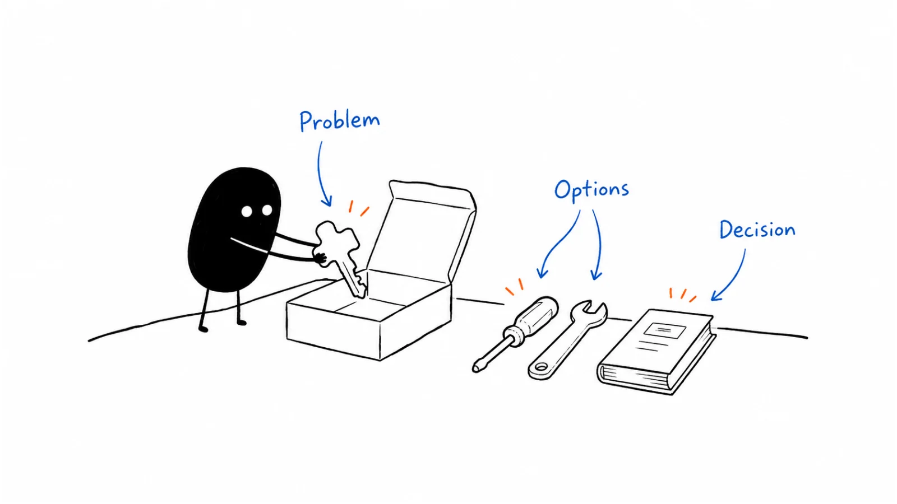

**Last reviewed:** 2026-09-07 · **Reading edit:** 2026-09-07

“Which version should I send?”

The seller has found three decks. One describes the new offer. One contains the customer example everyone likes, but an old price. The third says “final,” although nobody can remember who approved it.

The meeting is in twelve minutes.

A founder can often get through this because the missing context is in their head. They know which claim needs a qualification, which request needs an engineer, and which promise the team cannot make. The problem becomes visible when somebody else has to have the conversation.

Sales enablement is the work of making that judgment easier to repeat. It combines usable information, practice, feedback, and clear routes for getting help. A deck can be part of it. A folder full of decks is not the whole job.

The test is practical: can the person facing a buyer understand the situation, explain the relevant offer accurately, and help both sides decide what should happen next?



*Follow one buyer conversation from preparation to a useful explanation, a decision, and an accurate handoff.*

**Jump to:** [the running example](#the-business-we-will-follow) · [the first-call guide](#how-to-do-it) · [the material to build](#give-each-piece-of-material-a-job) · [handling objections](#answer-the-question-without-inventing-a-promise) · [practice](#practice-the-moment-that-is-going-wrong) · [copyable records](#copyable-templates).

## Use this when

You keep answering the same product questions in private messages. Sales conversations sound different depending on who attends. Buyers leave with an incorrect expectation. Or onboarding discovers an important promise that never appeared in the handoff.

This also applies when the founder is still the only seller. Writing down a recurring explanation can save you from reconstructing it before every call and make the next hire easier to support.

Start with a moment that is going badly. “We need enablement” is too broad to act on. “People cannot explain where the assisted service stops and engineering takes over” is a problem you can work on this week.

## Do not use this when

Enablement cannot make an unsupported capability real. If a deal requires a deployment option you do not offer, a better objection response is not a substitute for a product or commercial decision.

You do not need to finish all positioning work before improving a conversation. Use the best current explanation, mark what remains uncertain, and feed what you learn back into [positioning](https://b2-b-playbook.mintlify.app/playbooks/02-product-marketing/positioning).

A self-serve product may need comparison pages, helpful answers, and optional human assistance without making every buyer attend a sales meeting. Match the help to the decision.

Security, procurement, legal review, and implementation are not automatically late-stage objections. They can determine whether a buyer is able to evaluate the product at all. Bring the relevant people and evidence in when the situation requires them.

## The business we will follow

The example is fictional. It continues the assisted request-preparation offer from the previous articles. The sellers, buyers, conversations, and practice results below are invented teaching material, not Lensmor customer evidence.

The service helps operations teams prepare one supported type of record-correction request for engineering review. It organizes the necessary information and helps follow up on missing details. The customer's engineers still decide whether and how to execute a change. The service does not change production records itself.

Earlier exercises produced some useful handoffs, and one company paid for a bounded assisted pilot and used it again. Human involvement was substantial. This is limited evidence for the assisted offer, not proof that the software independently delivers the same result.

Suppose the founder now wants a colleague to help with buyer conversations. The colleague knows the product screens but has not handled the awkward questions yet.

The first enablement problem is not “create a more impressive presentation.” It is “help another person explain the offer, recognize a suitable request, and avoid promising production execution.”

That gives us something concrete to build and rehearse.

<a id="operating-method"></a>

## How to do it

<a id="step-1-remember-who-is-in-the-chair"></a>

### Prepare for the person and the decision

Before a call, find out what prompted it and what the person hopes to learn. A buyer responding to a launch invitation may have different expectations from an engineer reviewing an already agreed pilot.

Write down what you know, where it came from, and what you still need to ask. Do not turn a job title into a complete account of someone's authority. An operations lead might own the process without controlling the budget. An engineer might advise on feasibility without being the final approver.

For the fictional offer, the useful starting questions include the request type, current preparation process, recurring difficulties, and who reviews the work. You do not need every answer before meeting; you need enough context to avoid starting with an unrelated tour.

Look at the actual invitation or prior exchange too. If the prospect arrived through a page about assisted preparation, do not greet them with a pitch for an autonomous operations platform. If a previous colleague already promised an answer, make sure you know what is outstanding.

An internal preparation note might say: “Operations lead asked whether this could reduce missing information before engineering review. Request type not yet confirmed. They have not agreed to a pilot. Need to establish whether the work matches the supported scope.”

That is much more useful than “interested, good fit.” It tells the seller what to do and keeps an early inquiry from looking like a purchase commitment.

<a id="step-2-write-the-setup-conversation-not-a-monologue"></a>

### Give the first conversation a purpose

A simple opening can establish what you will cover and leave room for the buyer to change the order.

“I suggest we look at how these requests reach engineering today, check whether our supported scope fits, and show a relevant example if it does. What else do you need from this conversation?”

You are offering a plan, not requiring the buyer to sit through a sequence. They may need an answer about data access before a demonstration would be worthwhile.

Ask about a recent piece of work. Where did it start? Who prepared it? What was missing when it reached the reviewer? What did the team do next? Concrete events are easier to examine than broad statements about efficiency.

Listen for what works as well as what fails. The current form may already solve most of the problem. A buyer saying “we chase people” does not establish that your service can eliminate the chasing.

**Seller:** “Where does the request usually get delayed before engineering reviews it?”

**Operations lead:** “Usually we are waiting for another department. The form itself is fine.”

**Seller:** “Our service can help identify and follow up on missing information, but it cannot make that department answer. Would better preparation change enough of the work to be worth testing?”

**Operations lead:** “Possibly. I would need to separate the incomplete requests from the ones that are simply waiting for approval.”

This conversation has not failed because the buyer did not immediately agree. It has uncovered the distinction the next evaluation should examine.

### Use questions to understand, not to complete a script

A question is useful when the answer can change what you recommend.

If every possible answer leads to the same demonstration and the same proposal, you may be performing discovery rather than doing it. Keep a few prompts available, but follow the buyer's actual explanation.

For example, asking “What happens if you keep the current process?” can reveal that there is no compelling reason to change. It can also reveal an upcoming workload or a recurring cost worth investigating. Neither answer needs manufactured urgency.

When you quantify a problem, identify what has actually been observed. “This took three people an afternoon last Tuesday” is not the same as “this costs three people every afternoon.” A seller-ready note should preserve the period, frequency, and uncertainty.

A budget question can be relevant without turning the meeting into a qualification interrogation. Explain why you are asking: “The assisted pilot and a self-serve tool would involve different commitments. Is there an established route for funding an evaluation like this?”

If the person does not know, record that as an open question. Do not fill in the missing answer because the CRM field requires a value.

<a id="step-3-follow-through-only-on-that-perfect-world"></a>

### Agree on what is worth examining

Summarize what you heard before recommending a demonstration or evaluation.

“In the requests we discussed, the main issue seems to be incomplete preparation rather than execution speed. We would need to show that we can produce a handoff your engineer finds useful, without adding too much work for your team. Have I understood that correctly?”

The buyer might correct the task, the constraint, or your interpretation. That correction is part of the work.

Avoid turning agreement into a test of whether the person accepts your worldview. If they reject the proposed success criteria, investigate the difference. They may have another requirement, you may have misunderstood, or the offer may not fit.

Only the last of those necessarily means ending the evaluation. Sometimes a short explanation resolves the mismatch; sometimes a different person needs to join; sometimes declining to proceed is the sensible result.

April Dunford's [Sales-First Storytelling, November 29, 2023](https://aprildunford.substack.com/p/sales-first-storytelling?ref=b2b-playbook), connects positioning with an interactive sales conversation that helps buyers evaluate alternatives. That is useful background here. The operating examples in this guide are our own; they do not reproduce her full pitch structure.

<a id="setup-vs-walkthrough"></a>

### Show something that answers the question

For this buyer, start with a representative request and the prepared handoff. Point out what has been organized, what remains missing, and what the engineer still decides.

You can briefly show the product early if that makes the explanation easier to understand. There is no universal requirement to finish a market lecture before opening a screen. The important question is whether the demonstration helps this person evaluate something relevant.

Separate what the product did from what a person did. If a human checked the input or contacted somebody for missing information, say so. A demonstration of assisted delivery should not quietly become evidence of autonomous software.

Use a documented customer result only when it is accurate, permitted for this use, and relevant to the claim. A famous logo does not establish that the same outcome will occur in this account. If you have no comparable customer evidence yet, use a clearly labeled demonstration and propose an appropriate test.

A useful transition is: “This shows how the handoff is organized. It does not yet show whether the approach works for your request mix. We would need to test that with the agreed scope and permitted information.”

That keeps the demonstration valuable without making it carry more evidence than it contains.

## Give each piece of material a job

Build the smallest set of material that supports the conversations you actually have.

For the fictional business, the first version might be a call guide, an offer page, a sample handoff, a few checked answers, and a way to record the next step. That is enough to begin learning. There is no required library size.

Keep the material organized around the question someone is trying to answer.

| Buyer or seller question | Useful material | What it must make clear |
|---|---|---|
| Is this relevant to the work we do? | Use-case and fit note | Supported task, likely fit, and important exclusions |
| What would we actually receive? | Offer page and representative example | Deliverable, human involvement, responsibilities, and scope |
| Why consider this instead of our current approach? | Checked comparison | Relevant differences, trade-offs, and evidence limits |
| Can we evaluate this in our environment? | Approved technical and data-handling information | Current facts, open questions, and the responsible specialist |
| What must colleagues decide? | Buyer-shareable decision summary | Proposed scope, cost, work required, risks, and unresolved decisions |
| What happens if we proceed? | Evaluation plan and delivery handoff | Owners, success criteria, timing, dependencies, and commitments |

Do not create a new file every time a seller asks a slightly different question. Sometimes the existing answer needs a clearer title, a better example, or a paragraph that makes its boundary visible.

A sales deck can be useful when several people need to discuss the same decision together. A short page can be better for a single question. A clip can explain a workflow, but it should not be the only place to find pricing or an important limitation.

Consider the environment in which the material will be used. During a call, a seller needs to find an answer quickly. Afterward, a buyer may read on a phone or forward the page without context. Large tables, unexplained acronyms, and notes meant only for employees can get in the way.

### Separate internal guidance from shareable explanations

An internal comparison might include an uncertain observation, a coaching note, or a question to ask. A buyer-facing comparison should not accidentally include those as established facts.

Label the intended audience and sharing status. Link to a current, approved external version where one exists. Do not rely on sellers remembering which slide to delete before forwarding.

For the fictional offer, an internal note could say: “If the buyer expects production execution, correct that expectation before continuing. Ask whether preparation alone is worth evaluating.”

The shareable version should simply state the boundary: “Your engineers retain responsibility for approval and execution. The assisted pilot covers request preparation.”

Both are useful. They serve different jobs.

### Give examples an evidence label

A reusable proof item needs more than an attractive sentence. Record what happened, when, for whom, under what conditions, and what you have permission to share.

Distinguish a customer-reported result, a measured result, a demonstration, and a hypothetical example. Include relevant assistance and scope. A small pilot that required founder involvement may still be useful evidence, but it should not be presented as a mature self-serve deployment.

When evidence is missing, say what would establish the claim. Sellers should be able to propose a bounded evaluation instead of borrowing another company's result or inventing an ROI estimate.

This also makes updating easier. If the product, plan, or delivery model changes, you can see which proof items need review rather than searching every presentation for a sentence.

## Answer the question without inventing a promise

An objection is not always something to overcome. It may be a misunderstanding, a genuine requirement, a comparison, a timing problem, or a polite way to decline.

Start by understanding which one it is. The same words can hide very different decisions.

“We could build this ourselves” might mean the team already has a working internal tool. It might mean they are estimating a new project. Or it might mean they do not yet understand what the service includes.

A useful answer acknowledges the plausible alternative and narrows the comparison: “You may be able to. Are you comparing the request form, the ongoing preparation work, or both? We can look at what would remain with your team under each approach.”

You do not need to prove that the internal option is bad. You need to make the difference inspectable for this buyer.

### Make an answer card more than a comeback

For a recurring question, store the buyer wording, the likely interpretations, a clarifying question, the current supported answer, and the point at which someone else must help.

For “Does this make the change automatically?” the fictional answer is straightforward: it does not. The current offer prepares the request for engineering review. No amount of persuasive phrasing should turn that into “not yet, but probably soon” unless an authorized, specific commitment really exists.

**Engineer:** “Will your team need access to our production database?”

**Seller:** “The offer is request preparation, not production execution. I will confirm the information and access needed for your proposed evaluation with our delivery owner.”

**Engineer:** “We need that confirmed before anybody sends you an example.”

**Seller:** “Understood. Let's resolve the permitted data route first. We can use an invented sample to discuss the workflow in the meantime.”

The seller has answered what they know, identified what they do not know, and respected a prerequisite. They have not dismissed the engineer as an obstacle to a champion who is already convinced.

For pricing questions, clarify the offer and the comparison before offering a concession. If the buyer cannot afford the scope or does not value the result, a discount may not solve the issue. Know who can change terms, and record an approved exception where the delivery team can see it.

For unresolved product questions, set a realistic follow-up owner and timing. “I will check” becomes useful when somebody knows what to check and the buyer knows how the answer will reach them.

<Accordion title="What if the buyer disagrees with our explanation?">

First ask what differs. A buyer may agree that preparation is a problem but need a deployment option you do not support. They may understand the offer and prefer their current process. Or your explanation may have described the wrong task.

Those situations call for different responses. Correct an inaccurate explanation, investigate a material unknown, or acknowledge a genuine mismatch. You can stop a sales process without treating the person as a bad prospect, and you can keep learning from a disagreement without promising a new product.

Do not require the buyer to agree that every alternative is inferior. It is enough to establish whether there is a relevant advantage worth evaluating, under conditions both sides can support. If there is not, document the reason and avoid proposing another meeting simply to keep the opportunity open.

</Accordion>

## Help the buyer carry the decision internally

The person on the call may have to explain the offer to somebody who was not there. Do not assume that enthusiasm will survive that handoff unchanged.

Ask what those colleagues will need to decide. An engineering reviewer may need scope and data-flow information. A budget owner may need the cost and reason for the evaluation. The person doing the work may need to know what they must prepare and what changes in their routine.

Offer a short factual summary they can correct and share. Avoid describing the contact as your “champion” in material meant for their colleagues. Their job is to make a sound recommendation inside their company, not to repeat your pitch.

For the fictional offer, a summary might say:

**Proposed evaluation:** A bounded paid pilot for preparation of one supported record-correction request type. The service organizes the information and assists with missing details. Customer engineers remain responsible for review and execution.

**What we need to establish:** Whether the prepared handoff is useful for the selected requests, how much work remains with the operations team, and whether the result justifies the agreed cost.

**Before starting:** Confirm scope, price, permitted information-sharing route, reviewer, and start date. No production execution or unsupported request types are included.

This is an illustrative draft, not an approved proposal. Its purpose is to show how the decision can travel without losing the caveats.

If the buyer wants a business case, use their actual assumptions and distinguish savings from estimates. A vendor-generated number is not automatically the customer's financial justification. An honest “we have not measured this yet” can be more useful than a spreadsheet with invented precision.

## Agree on a next step that resolves something

A next meeting is useful when it has a purpose.

For our example, the next step might be a scope check with an engineer, a review of the permitted information flow, or agreement on a representative evaluation task. It might also be a pause because there is no relevant request to test.

Write what will be done, by whom, and when the other side should expect an update. Ask whether that is what the buyer wants; do not convert “send me something” into an agreed technical evaluation.

Keep proposed actions separate from accepted commitments in your notes. If you have suggested a date and nobody has confirmed it, record the proposal as pending. If a colleague joins later, they should not have to discover this distinction by apologizing to the buyer.

The same discipline applies after a purchase. A delivery handoff needs the agreed offer version, scope, success criteria, responsibilities, timing, dependencies, and exceptions. Include the unanswered questions, not just the sales summary.

Ask the delivery owner to acknowledge the handoff. They may spot a feasibility issue before the customer begins. Signing an agreement does not make an unclear or undeliverable promise disappear.

<a id="step-4-steal-the-shape-not-the-script"></a>

## Practice the moment that is going wrong

A seller can read a guide and still struggle to use it while somebody asks an unexpected question.

Choose one realistic situation and rehearse it. For the fictional business, the first exercise could be a buyer who assumes the service makes production changes. The seller's task is to correct the assumption, determine whether preparation still matters, and propose an appropriate next step.

Give the person playing the buyer enough context to respond plausibly. Do not make the exercise a trick contest in which the coach invents impossible objections until the seller fails. The aim is to reveal a gap you can work on.

Watch the behavior rather than the person's confidence or similarity to the founder. A quiet seller who checks a material uncertainty can be more reliable than a polished speaker who promises unsupported functionality.

| Moment to observe | Useful behavior | A specific coaching response |
|---|---|---|
| Opening the conversation | Establishes the purpose and checks what the buyer needs | Ask for the buyer's priority before starting the prepared explanation |
| Hearing a broad problem | Investigates a recent example and relevant conditions | Replace the general efficiency question with one about the last request |
| Explaining the offer | States what is included and who still does the work | Add the engineering responsibility boundary to the explanation |
| Facing an unknown | Separates known facts from an answer needing confirmation | Name the owner and information required instead of guessing |
| Ending the discussion | Records a mutually understood next action or pause | Distinguish the suggested follow-up from the buyer's actual agreement |

Use the same criteria when reviewing a relevant real conversation, with appropriate permission and handling of customer information. Do not record calls covertly or circulate sensitive clips as general training material.

### Give feedback that can be tried again

“Be more consultative” is hard to practice. “When they asked about production access, you answered before confirming the evaluation design” points to an observable moment.

Discuss what the seller was trying to do. They may have misunderstood the capability, lacked an answer, or felt pressure to keep the deal moving. Those require different fixes.

**Coach:** “You told the buyer we could fit their process. What did you mean by that?”

**Seller:** “That we would adapt the preparation. I can see that it sounded like we could also perform the change.”

**Coach:** “Try that answer again with the responsibility boundary, then ask whether preparation alone is worth evaluating.”

**Seller:** “We can discuss adapting the supported preparation work. Your engineers would still review and execute the change. Is that the part of the process you want help with?”

Now the seller can rehearse a concrete improvement. The guide may also need a clearer sentence so the next person does not make the same mistake.

Practice again after feedback, then observe whether the behavior holds when the context changes. Reciting the corrected line once is not the same as handling another buyer with a different constraint.

A formal certification may be useful in a larger team or a high-consequence selling environment. A founder and one colleague may need only a small set of practice scenarios and a clear escalation boundary. Neither arrangement should treat attendance as proof of readiness.

### A documented example: GitLab's training design

GitLab's public [Commercial Sales Enablement page](https://handbook.gitlab.com/handbook/sales/commercial/enablement/?ref=b2b-playbook), displaying a **June 27, 2024** last-modified date, lists training objectives covering meeting hosting, information capture, call notes, next steps, and use of a customer deck. It documents operational skills alongside presentation material.

Its [Field Accreditation Program page](https://handbook.gitlab.com/handbook/sales/training/field-certification/?ref=b2b-playbook), displaying a **January 4, 2025** last-modified date, describes both written and practical assessment and application in simulated and live situations.

These dates are page-maintenance dates, not claimed program-launch dates. The pages document a training approach; they do not establish a measured improvement in win rate, and linked internal course materials were not accessed.

The lesson I take from them is modest: check whether someone can use the information, not only whether they have encountered it. You do not need to copy GitLab's course names, schedule, or organizational structure.

<a id="step-5-build-it-with-the-same-room-that-built-positioning"></a>

## Keep the useful version easy to find

Once material exists, give it an obvious home and a named owner.

A seller looking for the current answer should not have to search a chat history or choose between attachments. Keep one current entry point for each recurring question, with links to the detailed sources. Mark draft, internal-only, approved-for-sharing, and retired material clearly.

For an important asset, record the intended use, relevant offer or product version, owner, evidence source, and last check. A review date is useful only if somebody actually checked the content.

Different changes need different responses. A new price can require immediate correction of shareable material. A revised product boundary may need both an updated answer and a short rehearsal. A cosmetic wording change may need no training session.

When retiring an answer, think about the copies already in circulation. Update links where possible, alert people to material changes, and give them replacement language. If a buyer received incorrect information that matters to their decision, correct it directly rather than hoping they reopen the page.

Sales, product marketing, product specialists, and delivery each see different failure points. Let them contribute to the same answer, but assign one person to resolve the final wording and route approvals. Shared involvement should not mean nobody owns the result.

### Turn requests into specific problems

“We need a one-pager” is a request for a format. Ask which buyer question it will answer and what is missing from the current material.

Sometimes the real issue is that the offer is unclear. Sometimes the seller cannot find an existing answer. Sometimes the required capability does not exist. Producing another document solves only some of those problems.

An intake note can be short: the recurring situation, the audience, a recent example, the current workaround, and the decision the new material should support. Prioritize by consequence and frequency, not only by who asked most loudly.

One serious unsupported promise may deserve attention before a frequently requested design improvement. Conversely, a repetitive low-risk question may be worth fixing because it consumes time across many conversations.

For a solo founder, the same process can be a small list reviewed after calls. Write the answer once, link it to the offer, and test whether it helps the next conversation. You do not need an enablement platform to begin.

<Accordion title="What if sellers keep ignoring the new material?">

Ask them to show you how they prepare for a real task. Is the material hard to find, too long, outdated, or difficult to adapt? Does it answer a question buyers actually ask? Are sellers avoiding it because part of the promise is wrong?

Fix the specific problem before interpreting non-use as resistance. A concise answer embedded in the seller's normal workflow may help more than another announcement that the library exists.

If the material is useful but unfamiliar, practice with it. If it conflicts with the way the product is sold or delivered, resolve that conflict with the relevant owners. If managers keep coaching the old approach, updating the document alone will not change the behavior.

Measure use as a diagnostic. Mandatory opening of a deck can raise view counts without improving a single buyer conversation.

</Accordion>

## Use AI for preparation, not unsupported certainty

AI can help organize permitted notes, retrieve relevant material, draft a summary, or play a buyer in a rehearsal. Those uses still need boundaries.

Keep actual buyer statements separate from inferred needs. If a note says “engineering will review,” an AI summary should not upgrade it to “engineering has approved.” Proposed dates, open questions, and conditional commitments are especially easy to flatten into false certainty.

For answer retrieval, require the source and relevant version. An answer assembled from a retired pricing page and a current capability guide may sound coherent while describing an offer that never existed.

Do not put private customer records into a tool that is not approved for that information. Use invented or properly sanitized situations for general role-play. Before sending a generated follow-up, check the names, claims, scope, commercial terms, and what was actually agreed.

Automated coaching can flag moments worth reviewing, but a score alone does not establish why a conversation went badly. Inspect the evidence and context. A seller who pauses to consult a specialist may be doing exactly the right thing.

## Metrics

Measure the problem you chose to solve, then look at broader outcomes without assuming that the enablement change caused all of them.

| Question | Possible measure | Important limitation |
|---|---|---|
| Can sellers find the current answer? | Time and errors in a realistic retrieval task | Fast access to an incorrect answer is not success |
| Can they use it accurately? | Observed handling of the target situation | A rehearsal is not a live customer conversation |
| Does the customer receive a clear next step? | Sampled follow-ups with accurate scope and agreed actions | More follow-ups do not necessarily mean better decisions |
| Are promises arriving intact at delivery? | Handoffs with missing or conflicting commitments | A clean form can still conceal an infeasible offer |
| Are commercial outcomes changing? | Defined conversion, no-decision, or cycle-time measures | Account mix, price, product, and market conditions also matter |

Here is an invented coaching check, separate from the running business's earlier customer examples. In ten sampled relevant conversations, the seller clearly stated the production-execution boundary in four. After a guide change and practice, the boundary was stated in eight of ten comparable sampled conversations.

That is a change from 40% to 80%, or **40 percentage points**, in the observed behavior. It does not show that win rate doubled. The samples are small, may involve different people or accounts, and are not a controlled experiment.

Use a consistent definition and inspect the underlying moments. Were all ten conversations situations where that boundary mattered? Did the seller explain it accurately, or merely say a keyword? Did the buyer still leave with the wrong expectation?

For no-decision outcomes, record why an evaluation stopped or paused. Budget, timing, risk, product fit, an adequate current process, and unclear communication are different explanations. Do not classify every delay as a teaching failure.

At an early stage, a few well-understood incidents may be more useful than a dashboard of unstable percentages. You can still report the counts, uncertainty, and next action honestly.

## Copyable templates

These are original working notes for adaptation. They are not a script to read word for word or a substitute for approved technical and commercial answers.

### Pitch one-pager

Use this as a preparation and conversation guide. Keep detailed evidence behind links so the live version remains readable.

```text
CONVERSATION GUIDE

Offer / version / owner / last checked:
Who this conversation is for:
What prompted it:
Known facts and their sources:
Important assumptions to check:
Decision this conversation should help with:

CURRENT SITUATION

Recent task to ask about:
Current approach and what works:
Difficulty, consequence, and supporting evidence:
People involved in doing, reviewing, and approving:
Constraints that may affect evaluation:

RELEVANT EXPLANATION

What we offer:
Supported scope:
What remains with the customer:
Relevant alternative and trade-off:
What to demonstrate or share:
What that evidence does and does not establish:

QUESTIONS AND NEXT STEP

Common question / clarifying question:
Supported answer and source:
Unknowns and specialist / approval route:
Proposed next action:
What the buyer actually agreed:
Owner and expected timing:
Reason to pause or decline:
```

Do not treat every blank as something you must extract from the buyer immediately. Some information is irrelevant to a small purchase, and some will only become available later. A useful note shows the state of knowledge without pretending the process is complete.

For the transition after a conversation or purchase, use a separate record:

```text
DECISION AND HANDOFF RECORD

Account / conversation date / people present:
Offer and proposal version:
Buyer-confirmed task:
Relevant scope and exclusions:
Definition of a useful result:

CONFIRMED

Actions and commitments actually agreed:
Price / commercial terms reference:
Start or review timing:
Our responsibilities:
Customer responsibilities:
Approved exceptions and approving owner:

OPEN

Unanswered questions:
Evidence or approvals still needed:
Proposed actions not yet accepted:
Dependencies and risks:
Owner for each open item:

HANDOFF

Material the buyer can share:
Internal-only notes kept separate:
Delivery owner:
Delivery owner's acknowledgment / questions:
Next update to the buyer:
Record of corrections made after the conversation:
```

If a commitment is unclear, resolve it rather than making the handoff sound tidier. The receiving team needs the truth more than a complete-looking form.

<a id="pre-flight-checklist"></a>

## Before you start

Choose one recurring situation and try the material with someone who did not write it.

- [ ] They can find the current explanation and its owner.
- [ ] They can describe the offer without expanding the promise.
- [ ] They know which buyer questions could change the recommendation.
- [ ] Relevant proof is distinguished from examples and assumptions.
- [ ] Internal notes cannot accidentally pass as approved customer material.
- [ ] Unknown technical or commercial questions have a route to an answer.
- [ ] Practice includes feedback and another attempt.
- [ ] The next step and delivery handoff preserve what was actually agreed.

A missing item gives you a concrete improvement to make. It does not necessarily mean you must build a full training program before the next call.

## Common mistakes

**Treating enablement as a slide-production service.** Start with the task a person needs to perform and choose the material afterward.

**Making the founder's delivery style the standard.** Preserve the accurate explanation and good judgment, not somebody's accent, confidence, or exact phrasing.

**Requiring agreement before allowing questions.** A disagreement may uncover a misunderstanding or a genuine product gap. It is not automatically a disqualification.

**Teaching confident answers to uncertain questions.** A reliable escalation is better than an invented capability, approval, or delivery date.

**Counting completion instead of competence.** Reading, attendance, and content views tell you about exposure. Observe whether the person can use the material.

**Improving the pitch while losing the promise at handoff.** The buying experience continues when another person begins delivering the work.

## What to read next

Use [messaging](https://b2-b-playbook.mintlify.app/playbooks/02-product-marketing/messaging) for the core explanation and [competitive intelligence](https://b2-b-playbook.mintlify.app/playbooks/02-product-marketing/competitive-intelligence) for checked comparisons. Use [buying committee](../01-strategy-and-buyers/buying-committee.md) when several people must evaluate or approve the decision.

Next, work through [pricing and packaging](https://b2-b-playbook.mintlify.app/playbooks/02-product-marketing/pricing-and-packaging) to make sure the commercial offer matches the value, scope, and delivery commitments being discussed. Use [demo](https://b2-b-playbook.mintlify.app/playbooks/02-product-marketing/demo) when the product demonstration needs a more deliberate structure.

If the barrier is the work or risk of changing, continue with [change friction](https://b2-b-playbook.mintlify.app/playbooks/02-product-marketing/change-friction). For new offers, keep [product launch](https://b2-b-playbook.mintlify.app/playbooks/02-product-marketing/product-launch) aligned with what the people handling inquiries can actually explain and deliver.

## Sources and evidence boundary

This is an owner-maintained operating synthesis, not a guaranteed closing script. The fictional request-preparation business, dialogue, templates, and coaching arithmetic are original teaching examples. No private buyer interview or actual Lensmor outcome is implied.

April Dunford's November 29, 2023 article linked above provides concise background on connecting positioning with a buyer-oriented sales conversation. The previous short edition drew more extensively on her pitch guidance; this revision does not reproduce her full framework or borrowed Help Scout and Postman scripts.

The two linked GitLab handbook pages document published training objectives and assessment design. Their displayed maintenance dates are distinguished from program dates. They are process examples, not independently verified commercial outcome studies. No internal courses, customer records, or private training resources were accessed.

Sources checked on September 7, 2026. Technical, security, contractual, and data-handling statements must come from the responsible people and current evidence in your own business.

---

Copyright © 2026 Ivan Xu. All rights reserved. See the [copyright and reuse terms](https://github.com/weilun88313/B2B-Playbook/blob/main/LICENSE).

Canonical source: [github.com/weilun88313/B2B-Playbook](https://github.com/weilun88313/B2B-Playbook)
