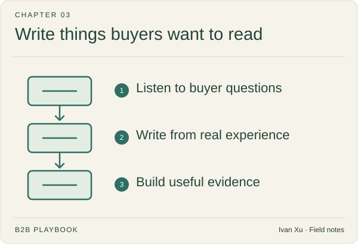

# 03 · Brand, story & content

Choose the questions worth answering and the stories you can genuinely tell. This chapter covers content planning, founder stories, customer case studies, and longer, sourced arguments.

**Status:** Domain guide published · 4 tactic playbooks published

**Last reviewed:** 2026-09-06

## Start here

- [Content strategy](content-strategy.md) — collect buyer questions.
- [Founder story](founder-story.md) — what you experienced.
- [Case study](case-study.md) — before the change.

## Playbook map

| Guide | What it helps you do |
|---|---|
| [Founder story](founder-story.md) | Which lived experience makes the founder's point of view relevant and credible? |
| [Content strategy](content-strategy.md) | Which audience questions deserve a durable page, and in what order? |
| [Case study](case-study.md) | How should a named customer's context, action, and result become forwardable proof? |
| [White paper](white-paper.md) | When does a sourced long argument deserve a URL—and when must it stay ungated? |

## Coming later

These topics are on the writing list. There is no article to open yet.

| Planned topic | Question to cover |
|---|---|
| Brand strategy | Which associations and memories should the company build over time? |
| Brand narrative | What durable story connects the market change, buyer problem, and company point of view? |
| Thought leadership | What original, defensible idea can help the market think differently? |
| Newsletter | What recurring editorial promise will make an audience choose to return? |
| Webinar | How can a live educational session create useful participation and reusable content? |
| Podcast | When can a recurring conversation format deepen authority and relationships? |
| Video | Which ideas become clearer or more memorable through visual explanation? |
| Community-led growth | When can an *owned* practitioner community create learning, trust, and market insight? Entering a room that already exists is [peer community](../04-channels-and-distribution/community.md). |

## Where to go next

Pick a guide above for the task you are working on, or browse [Channels & distribution](../04-channels-and-distribution/) for a related part of the work.

[Back to the playbook index](../README.md)

---

Copyright © 2026 Ivan Xu. All rights reserved. See the [copyright and reuse terms](../../LICENSE).

Canonical source: [github.com/weilun88313/B2B-Playbook](https://github.com/weilun88313/B2B-Playbook)
