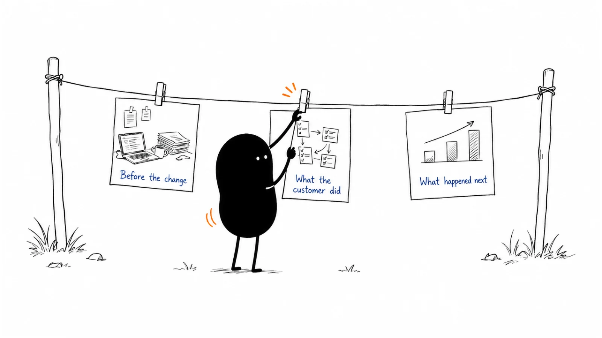

**Last reviewed:** 2026-09-08 · **Reading edit:** 2026-09-08

A customer says your product has made their team's work much easier.

That sounds like the beginning of a case study. Then you sit down to write it. Easier than what? Which part of the work changed? Who did the implementation? Is the improvement something the customer measured, something they estimated, or something your account manager remembers hearing?

Those questions are where the useful story begins.

A good case study lets another person understand a real decision and its consequences. It gives the customer room to explain what they were trying to do, what they changed, and what happened afterward. Your product has a role in that account, but it is not the only thing that happened.

The result should be more useful than a compliment and more readable than an implementation report. A prospective buyer should be able to recognize their situation, inspect the evidence, and see what they would still need to check for themselves.

This chapter takes you from choosing a customer to interviewing, checking numbers, writing, getting approval, and putting the finished story to work. You will also find a complete fictional example, including the calculation that keeps an attractive headline from becoming an exaggerated claim.



*Reading guide: choose a useful story → hear what happened → check the evidence → write the account → approve and maintain it.*

If you have an interview coming up, start with [the interview process](#step-2-steal-the-structure-from-the-deal-not-from-a-template-vendor). If the draft is full of impressive percentages, go to [the numbers](#step-3-label-every-number). For a complete example, read [the fictional customer account](#worked-example-illustrative). The two copyable records cover [the brief](#copy-case-study-brief-fill) and [publication approval](#before-you-start).

## Use this when

A prospect asks whether anyone with a similar problem has made the change. Your sales team repeatedly explains one customer's experience, but the details differ depending on who tells it. A customer has learned something useful during implementation and is willing to share it.

You may also want to show how a particular workflow works in practice, help a new audience recognize a problem, or give an existing customer a way to explain their team's work. Not every case study is a late-stage sales asset.

Start with the experience you can document. A small customer with a clear account can be more useful than a famous company that has only approved its logo. A narrowly scoped pilot can be worth writing about if you label it as a pilot rather than presenting it as a mature rollout.

## Do not use this when

You have only a signed contract or a launch announcement. Those are real milestones, but they do not establish an outcome from using the product.

Do not turn an unresolved support problem into a publicity request. Ask the account owner about the relationship first, and give the customer a genuine option to decline.

If there is no actual customer experience available, publish a [demo](../02-product-marketing/demo.md), a workflow explanation, or a clearly labeled teaching example. Those can be useful without pretending to be customer proof.

You do not need to finish every comparison page before writing a case study. Choose the asset that answers the current question. But do not expect a case study to replace a clear explanation of what your product does.

<a id="words-you-will-use"></a>

## A few useful terms

These distinctions help when the source material looks stronger than it really is.

| Material | What it can support | What it does not establish by itself |
|---|---|---|
| Testimonial | A person's stated experience or opinion | A measured business result |
| Customer case study | An account of a real situation, change, and outcome | That the same outcome is typical or guaranteed |
| Implementation story | What was deployed and how people used it | That a business metric improved |
| Customer-reported result | A result attributed to the customer's records or account | Independent verification by the publisher |
| Vendor-observed result | What your systems recorded within their coverage | What happened outside those systems |
| Illustrative example | How a method or calculation could work | That a customer actually did it |

A **baseline** is the earlier condition used for comparison. A **denominator** is what the reported number is out of: requests, active users, eligible accounts, conversations, or something else.

**Attribution** is the explanation of what contributed to a result. A story that describes improvement after adoption is not automatically a study that isolates the product's effect.

A **reference** is a customer who has agreed to some form of advocacy. Permission to be named on a page does not automatically mean permission to receive calls from every prospect.

<a id="one-rule"></a>

## Keep this in mind

Make the experience understandable and the claims traceable.

A reader does not need your entire evidence folder. They do need enough context to understand what a headline means, who is reporting the result, and where the comparison stops.

If you cannot support a number, remove or qualify that number. You may still have an excellent story about a new capability, a simpler handoff, or a difficult implementation. If you cannot support the central premise of the story, keep investigating rather than writing around the gap.

The question is not whether the customer will approve flattering language. It is whether the approved language accurately describes what happened.

<a id="operating-method"></a>

## How to do it

### Step 1: earn the right to name them

Start with two questions: is there a useful experience to document, and is there a workable path to sharing it?

For the first question, look beyond account size. What problem did the customer address? What alternative were they using? What did they actually adopt? What changed? What would another team learn from the choices they made?

For the second, identify who can participate in an interview, who can check the facts, and who can approve publication. These may be different people. An enthusiastic user may know the workflow well but have no authority to approve the company's name, logo, or metrics.

You can do private research before securing public naming permission, as long as everyone understands the purpose and use of the conversation. Agreeing to talk is not the same as approving a published story.

#### Select for relevance and substance

Imagine a buyer who is concerned about replacing an existing process without interrupting their team. A case about implementation, coexistence, and handoff might answer that concern better than a dramatic revenue number.

Another buyer may already believe the workflow is possible and want to understand the business value. That reader needs a different emphasis.

Use current questions to guide selection, but do not make existing sales conversations your only source. Customer success, implementation teams, support, product research, and customers themselves may know about useful experiences that never reached the sales deck.

Keep a small candidate list with the subject, evidence available, customer willingness, and reason it would help a reader. “Large logo” is not a complete reason. Neither is “they said yes.”

Selection is inherently partial. You are usually choosing a customer with something worth explaining, not drawing a representative sample of every customer. That is why one strong case cannot establish an average result.

#### Make the request specific and easy to decline

Tell the customer what you want to explore, what participation would involve, and where the finished piece might appear.

A first request might say: “We would like to document how your team changed the request-preparation handoff. Would you be open to a conversation about the old process, the rollout, and what you observed? We would send the draft for factual and publication review before using your name or quotes.”

That is clearer than asking them to “be a success story.” It does not tell them what the result must be.

Agree on recording and handling of interview material before recording. Explain who will see the notes. Ask about confidential topics and the review process. Do not promise a fixed publication date until you understand the approvals involved.

If you offer compensation, a discount, or another benefit connected to participation, document the arrangement and determine the appropriate disclosure. Do not make the reward depend on a positive account. Get qualified advice where the terms or disclosure requirements are uncertain; this chapter is not a publicity agreement.

#### Treat permission as specific, not universal

A useful approval record identifies the version, facts, quotes, company name, people, images, and intended uses that were approved. A public article, a paid advertisement, a conference talk, and a private reference call are different uses.

Ask about those uses rather than assuming that permission travels with a screenshot.

As one process example, [GitLab's public Growth Community Programs handbook](https://handbook.gitlab.com/handbook/marketing/growth-marketing/growth-community-programs/?ref=b2b-playbook), displaying an August 31, 2026 modification date, distinguishes several customer-reference formats and routes approved evidence through review. It also calls for written reference permission. This illustrates the value of a maintained approval record; its internal organization is not a staffing requirement for a small company.

A solo founder can keep a simpler record. What matters is knowing what was agreed, where that agreement lives, and who to contact if the piece changes.

<Accordion title="Can an anonymous customer case study be useful?">

Yes, if it describes a real experience, the facts can be supported, and the customer has agreed to the intended use.

Anonymity reduces what a reader can independently check. Say that the customer's identity is withheld by agreement, provide the relevant non-identifying context you are allowed to share, and explain the source of the claims.

Do not use a vague company description to imply a larger or more prestigious customer. Do not combine several customers into one supposed account. Removing a name also does not make an otherwise identifying incident safe to publish.

An anonymous public story and a privately approved reference conversation can coexist, but one does not authorize the other. If the customer has refused publicity, changing the name is not a workaround.

For this repository's separate Company Cases collection, the publishing standard remains named companies with dated primary sources. That editorial choice does not mean anonymous case studies have no legitimate use elsewhere.

</Accordion>

<a id="step-2-steal-the-structure-from-the-deal-not-from-a-template-vendor"></a>

### Step 2: interview the customer about the work

Prepare a short background note before the conversation. Read the agreed scope, implementation timeline, and available usage or outcome records. Ask the account team which details are known and which are still interpretations.

Do not send the customer a story whose ending has already been decided. Prepare questions that could reveal a smaller result, a different benefit, or an unsuccessful part of the change.

Start by reconstructing the old process. “What did request preparation involve before this?” is better than “How frustrating were your manual workflows?”

Stay close to ordinary work. Who received the request? What happened next? Where did information live? Who checked it? What did a difficult example look like? What was working well enough that they wanted to keep it?

Then ask what prompted action. Sometimes there was a deadline or failure. Sometimes a team simply had enough time and support to improve a persistent problem. Do not manufacture a crisis because the outline has a box labeled “trigger.”

#### Get past the flattering summary

*All dialogue in this chapter is invented for the teaching example. It is not an interview with Ivan, Lensmor, or a real customer.*

**Writer:** Your account manager mentioned that preparation is much easier now. What feels different?

**Customer:** We spend less time trying to work out whether a request has everything the reviewer needs.

**Writer:** Take me through the last request you prepared. What did you do, and what did the service do?

**Customer:** We gathered the source material. The service organized it and flagged gaps, and we followed up on those. Our engineer still reviewed the request and decided whether to make the correction.

The second question makes the product's role visible without erasing the customer's work. It also catches an important boundary: preparation is not approval, and approval is not execution.

A follow-up should ask where the account can be checked. Are there time records? A request log? A team lead who can confirm the handoff? If “easier” is an interview judgment rather than a measured result, keep it as that judgment.

#### Follow the sequence, including the awkward parts

Move from the old process to the choice, implementation, and observed outcome.

Ask what the customer considered, including doing nothing or improving the existing process. Ask who helped with setup, what had to be configured, and what people needed to learn. Find out whether the vendor performed work that a future customer would need to do themselves.

Then explore results. What changed first? What did not change? How do they know? Did volume, staffing, customer mix, or another system change during the same period?

“What surprised you?” and “What would you do differently?” often reveal useful detail without pressuring the customer to criticize someone. If there was little implementation friction, do not invent a problem to satisfy a formula. Explain the conditions that made the transition straightforward.

Keep the different perspectives visible. An executive may know the business objective. An operator may know what happens on a difficult day. An engineer may know the integration and review burden. One interview may be sufficient for a narrow account; a broader story may need more than one.

#### Keep the customer's voice without inventing a better quote

A quote should be traceable to an approved source: a recording, transcript, written response, or confirmed wording. Do not turn the account manager's paraphrase into the customer's direct speech.

You can propose a clearer edit for approval, but it must preserve the meaning. Removing a qualification such as “for this request type” can change the claim even if the sentence becomes easier to read.

Use paraphrase when it serves the reader better. A paragraph explaining the actual process may be more helpful than three enthusiastic quotes saying that the product is easy to use.

When people disagree, separate the questions. They may be describing different teams, time periods, or definitions rather than contradicting one another. Resolve important differences before publishing a single definitive account.

### Step 3: label every number

Give each material number a small evidence record before it becomes a headline.

What is being counted or timed? Who collected it? Which people, requests, or accounts are included? Which period does it cover? What was excluded? Is it an observation, estimate, projection, or customer opinion?

You do not have to publish raw confidential records. You should be able to check the calculation privately and provide an approved explanation that lets readers understand the claim. If even that explanation cannot be shared, a narrower qualitative account may be the better choice.

#### Distinguish the kind of evidence

| Evidence | Example | How to describe it |
|---|---|---|
| Recorded observation | Forty logged requests with start and finish records | State the definition, period, scope, and source |
| Retrospective estimate | A team lead recalls spending several hours each week | Attribute it as an estimate, not instrumented measurement |
| Modeled value | Estimated time difference multiplied by assumed volume | Publish the assumptions; do not call it realized savings |
| Reported experience | A user says the review handoff is easier to follow | Attribute the observation without adding a percentage |
| Causal claim | The product alone produced the improvement | Requires stronger evidence than an ordinary before/after account |

A signed approval does not turn an estimate into a measurement. A dashboard does not guarantee a useful comparison. A precise number may still describe the wrong population.

Suppose an AI feature resolves 60% of the conversations routed to it, but only half of all conversations are routed to it. That is not evidence that it resolves 60% of all support demand. Before multiplying those percentages, check that the periods and populations align and that the routing categories are defined consistently.

The same care applies outside AI: active users are not all licensed users, completed requests are not all requests received, and pipeline is not revenue.

#### Use words that match the arithmetic

A change from 30 minutes to 20 minutes is a ten-minute reduction, or one-third less time relative to the 30-minute baseline. “33% less preparation time” is clearer than “33% faster,” which leaves the reader to guess whether you mean time, throughput, or something else.

A rate increasing from 60% to 80% rises by **20 percentage points**. The relative increase is about 33.3%. Those are two descriptions of the same change, not interchangeable labels.

An average may hide uneven results. If a few difficult requests dominate the total, explain whether you are reporting the mean, median, or another summary. Keep the underlying cases available for review where permitted. Do not switch to whichever statistic makes the improvement look largest.

Report the sample size, even when it is small. Forty observations can support a description of those forty observations. They do not automatically establish a stable population-wide effect.

#### Count work that moved somewhere else

Automation stories often count the customer's visible task and ignore the new work around it.

Did someone maintain prompts, review outputs, correct errors, update the knowledge base, or handle exceptions? Was setup unusually hands-on? Did an external service perform the work that disappeared from the customer's spreadsheet?

You can report a reduction in customer effort without claiming a reduction in total system effort. Make the boundary explicit.

The cost of the service, the value of redeployed time, and cash savings are separate questions. A team that spends fewer minutes on one task may have more capacity without reducing payroll. Do not label capacity as realized financial savings unless the evidence supports that claim.

#### A conversation that repairs the headline

**Writer:** The draft headline says we cut the whole correction process by a third. Does the log support that?

**Customer:** It supports a change in our active preparation time. It does not include the engineer's review or the time waiting for a decision.

**Writer:** What about the work your service team did behind the scenes?

**Customer:** That is in a separate record. We should show it, because the preparation was assisted. We did not replace the entire process with software.

The revised headline may be narrower. The story becomes more useful because a reader can now compare the relevant part of their own workflow.

#### Read real customer stories with the same questions

In [PostHog's Supabase story, dated June 15, 2025](https://posthog.com/customers/supabase?ref=b2b-playbook), Aleksi Immonen describes fragmented data, adoption of PostHog, and recognizing AI-builder acquisition sources that led to partnership work. The account reports ten times as many weekly new users as a year earlier and also credits Supabase's product work.

The useful lesson is the mechanism: better visibility informed an action. This vendor-published customer account does not isolate how much of the growth was caused by analytics rather than partnerships, product development, or market demand. Do not retell it as evidence that installing an analytics tool causes tenfold growth.

[Intercom's March 13, 2025 RB2B interview page](https://www.intercom.com/blog/videos/creating-a-lean-scalable-support-system/?ref=b2b-playbook) attributes 65% automatic inquiry resolution and more than 132 hours saved monthly to RB2B's experience with Fin. Its summary also mentions knowledge-base improvement.

The published summary names a customer and speaker, but does not provide the complete denominator definition or time-savings calculation. Treat those as reported results, not independently reproduced measurements or a benchmark for another team. The text summary was reviewed here; this chapter does not claim a full audit of the embedded interview or underlying data.

Both examples are useful without being perfect causal studies. The discipline is to preserve their scope when you learn from them.

<a id="step-4-write-for-the-next-champion-not-for-the-customer-who-already-bought"></a>

### Step 4: write a story the next reader can use

The familiar problem–solution–result structure is a starting point, not a requirement to make the customer's past look terrible and your product inevitable.

A readable account usually gives the reader a situation, a reason for change, a sequence of actions, an outcome, and enough qualification to understand the outcome. You can arrange those elements differently depending on the story.

Lead with what is specific. “An operations team made request preparation easier to review” tells the reader more than “A forward-thinking company accelerated its digital transformation.”

Use the customer as the subject of sentences when they are doing the work. They evaluated, configured, trained, changed, checked, and learned. Your product supported particular parts of that sequence.

#### Build the page for different depths of reading

A short opening can summarize who the story concerns, the relevant workflow, and the result. Someone who only reads that opening should not leave with a stronger claim than the full article supports.

The body can then explain the old process, why a change was considered, how it was implemented, and what was observed. Add a compact evidence note beside the result instead of hiding every important qualification at the bottom.

A short quotation can give the reader a person's interpretation. A table can make a comparison easier to inspect. Neither should repeat the headline in a different format just to make the page look fuller.

Choose subheadings that reveal the sequence. “What the engineer still needed” is more informative than “The challenge.” “Where the preparation work moved” tells the reader more than “The solution.”

You do not need to make every case study the same length. A short adoption story and a detailed implementation account can both be complete for their purpose. Remove repeated praise before removing the context that makes the result understandable.

#### Show the work when you can do so safely

An approved screenshot, a redacted workflow, or a small before/after table can explain a change that prose struggles to convey.

Use an actual customer artifact only within the agreed permissions. If you recreate a screen with synthetic data, label it as a reconstruction. Do not make a mock chart look like a screenshot of the customer's analytics.

For quantitative charts, label the unit, time period, and source. Use comparable scales and explain exclusions. Do not crop away an inconvenient period or choose a scale that makes a modest difference look dramatic.

Provide meaningful alternative text and an accessible text explanation. Readers should not need to zoom into a screenshot to understand the central result. A diagram's job is to clarify the evidence, not decorate a weak claim.

#### Let the ending reflect what remains to be learned

A useful ending might explain the next rollout stage, a remaining limitation, or advice the customer would give another team. It does not have to declare that the partnership has transformed everything.

Choose a next link that fits the reader. Someone exploring the workflow may want a sample output or practical guide. Someone comparing vendors may want implementation details or a conversation about their constraints.

A related case can be the right next step. A demo can be the right next step. Neither is mandatory. The important question is what the reader is now ready to investigate.

<a id="step-5-put-it-where-sales-will-actually-send-it"></a>

### Step 5: approve the complete story and make it usable

Do not treat final approval as a formality after the writing is finished.

Send a version that includes the headline, summary, quotes, figures, images, captions, and qualifications. A customer may approve the body while missing that the headline claims something broader.

Ask the appropriate people to verify the facts and confirm the permitted publication uses. Keep the approved version and the permission record together. If you materially change a claim later, return it for review rather than assuming the original approval still covers it.

#### Handle a last-minute objection without losing the useful story

**Customer:** The result paragraph is accurate, but we cannot publish the team name or the internal request labels.

**Writer:** Would an anonymous account of the workflow be acceptable, with those identifiers removed and the same limits on the numbers?

**Customer:** Possibly. Our communications reviewer needs to approve that version. We are not agreeing to ads or reference calls.

**Writer:** Understood. We will send the revised page for approval and keep those other uses out of scope.

This is not a negotiation to get around a refusal. It is a way to understand whether there is an acceptable version. If the answer is no, keep the material private or stop the project.

Do not let a customer review quietly turn unsupported claims into stronger ones, either. If a reviewer proposes “industry-leading” or a new percentage, ask what supports it. Approval and evidence serve different purposes.

#### Create a small set of useful adaptations

After approval, a web page may become a short sales summary, a presentation slide, a newsletter excerpt, or a video clip. Adaptations should remain inside the permission granted and preserve the meaning of the source.

Keep the central qualification attached to the result. “33% less customer preparation time for one supported request type” should not become “33% more efficient operations” on a slide.

Give sales a short note explaining who the story is relevant to, which question it answers, what it does not prove, and where the current version lives. People will still add context when sending it. That is sensible use, not a sign that the case study has failed.

Place the story where a reader with that question would look: a relevant product page, an implementation guide, a comparison page, or a follow-up conversation. A large archive organized only by customer logo makes this harder than it needs to be.

#### Protect the relationship after publication

Send the customer the published version and thank them. Tell internal teams whether the customer has agreed to further requests, and coordinate those requests rather than having every salesperson approach them independently.

Track meaningful changes. A customer may leave, the product may change, an interviewee may move roles, or a number may become outdated. An accurately dated historical account can remain useful, but it should not imply a current relationship or current product capability that no longer exists.

If the customer raises a concern, investigate promptly and follow the applicable agreement. Correct errors clearly. A new date at the top of the page should reflect actual review, not merely a cosmetic refresh.

<a id="teaching-fill-inventednot-a-customer"></a>

## Worked example (illustrative)

Everything in this section is fictional: the customer, dates, records, and results. It extends the assisted request-preparation business used in earlier chapters. It is not a Lensmor customer case and must not be published as a real testimonial.

The service organizes information for **one supported type of record-correction request** and helps follow up on gaps. Customer engineers still approve and execute corrections. The service does not change production records.

Earlier teaching examples included a pilot and a paid repeat engagement with substantial human help. The invented measurement below explores that assisted workflow; it does not establish a self-serve product or broad product-market fit.

### The material the writer starts with

The customer says preparation has become easier. The account team wants a story about automation. The available records support something more specific.

The fictional baseline covers 40 consecutive requests of the supported type from April 6 to May 3, 2026. The follow-up covers 40 consecutive requests of the same type from June 1 to June 28, after setup in May.

Both windows use the same definition of active customer preparation time, including preparation rework. Engineer review, waiting time, and correction execution are outside that measure. The request groups are different observations, not a randomized or matched experiment; their complexity may differ.

The follow-up also includes service-provider effort that was not present in the old customer-only preparation process.

| Measure | Baseline window | Follow-up window |
|---|---|---|
| Requests observed | 40 | 40 |
| Mean active customer preparation time | 30 minutes per request | 20 minutes per request |
| Customer preparation time in total | 1,200 minutes / 20 hours | 800 minutes / 13 hours 20 minutes |
| Complete at first review under the agreed checklist | 24 of 40 / 60% | 32 of 40 / 80% |
| Additional provider preparation effort | None in this process | 12 minutes per request / 8 hours total |
| Engineer review, waiting, and execution time | Not measured here | Not measured here |

The customer also spent four hours on setup in May, outside both observation windows. That effort belongs in the implementation account even though it is not part of the per-request comparison.

### What the numbers support

The recorded customer preparation difference is ten minutes per request. Across the 40 follow-up requests, that is 400 minutes, or six hours and forty minutes, compared with applying the baseline mean to the same request count.

The relative reduction in mean customer preparation time is ten divided by thirty: approximately 33.3%.

That is a descriptive before/after comparison. It is not a guarantee that the service caused all of the difference or that another customer will observe it.

There is also a distribution-of-work question. Add the provider's eight preparation hours to the customer's thirteen hours and twenty minutes, and the measured follow-up preparation effort becomes twenty-one hours and twenty minutes. That exceeds the baseline's twenty customer-only hours, before setup or unmeasured review work.

The story can therefore describe less preparation effort for the customer. It cannot honestly claim less combined preparation effort across customer and provider, let alone less end-to-end correction time.

The first-review completeness rate rose from 60% to 80%, a twenty-percentage-point difference. That means more requests met the agreed preparation checklist at first review. It does not mean 80% of corrections were approved, executed, or correct in production.

### A complete illustrative customer account

*The following is example copy for a fictional story, not a publishable claim about a real company.*

**Less preparation work for the customer, with approval still owned by engineering**

The operations team needed a clearer way to prepare one recurring type of correction request. Information arrived in the request and follow-up messages, and the team often had to return to it after an engineer identified a missing item.

They did not want an outside service to decide which production records should change. Their first goal was narrower: make the request easier to prepare and review while keeping the existing approval responsibility.

The team introduced assisted preparation for the supported request type. They supplied the source material; the service organized it and flagged missing information; the customer followed up on those gaps. Engineers continued to review requests and approve and execute any corrections.

Setup took four hours of customer time. The team agreed on a checklist for a request to be complete at first review and continued tracking active customer preparation time, including rework.

Across two four-week windows containing forty requests each, recorded mean customer preparation time moved from thirty minutes to twenty minutes per request. The proportion meeting the checklist at first review moved from twenty-four of forty to thirty-two of forty.

The change did not remove the preparation work altogether. The service provider contributed an average of twelve additional minutes per request in the follow-up period. Engineer review, waiting time, and execution were not measured in this comparison.

These records describe an assisted workflow for one request type. The two request groups were not a controlled experiment, and the customer had not established whether the same approach would work for other types.

The next evaluation would examine request complexity and engineering review effort alongside the preparation records. For another team considering the approach, the useful starting point would be a sample request and a clear agreement about which decisions remain with its own engineers.

### Why this is stronger than the exciting headline

“Customer automates corrections and saves 33%” would suggest several things the evidence does not show: autonomous execution, end-to-end savings, and perhaps a financial result.

The longer account explains what changed, who did the work, and what was measured. Its limitation is not an apology added after the story. It is part of the information a buyer needs to assess whether the approach fits.

It also leaves room for a reasonable buyer to say no. A team that needs lower total delivery effort or autonomous execution may not find this attractive. Another team that wants help preparing requests while retaining decision authority may want to investigate.

That is a better outcome than attracting the wrong evaluation with a claim the team must later walk back.

## Copy: case-study brief (fill)

Use this privately before writing the public page. Link to evidence through approved storage; do not place confidential interview notes or customer exports in a public repository.

```text
CASE STUDY — INTERVIEW AND EVIDENCE BRIEF

Customer / agreed public identity:
Reader and question this story should help:
Workflow and scope:
Interview participants and their roles:
Permission to interview / record:
Publication reviewer:

BEFORE
What was the customer trying to do?
What process or alternative did they use?
What worked, and what was difficult?
What prompted the change?

CHANGE
What did the customer do?
What did the product, vendor, or partner do?
What stayed in place?
Setup, training, review, and exception work:

RESULT
Claim we want to investigate:
Metric definition, unit, and denominator:
Baseline period and population:
Follow-up period and population:
Source and person who can verify it:
Observed / estimated / modeled / reported opinion:
Exclusions, concurrent changes, and uncertainty:

STORY
Useful customer explanation or verified quote:
What this experience does not prove:
Next question a reader should investigate:
Owner and next action:
```

The existing [case-study working file](../../templates/case-study.md) remains available as a shorter brief. Its fields are prompts, not a requirement to invent a trigger, implementation problem, or numerical outcome. Use the fuller record above when you need to track the evidence in more detail; preserve any working copy you have already filled in.

<a id="pre-flight-checklist"></a>

## Before you start

Before scheduling a story, check that there is a real experience to investigate and a willing participant. Before writing the result, check the evidence. Before publishing, check the complete approved version.

Those are different moments. Trying to solve all three with one checkbox labeled “customer approved” creates avoidable confusion.

```text
CASE STUDY — PUBLICATION AND REUSE CHECK

Title / draft version:
Public URL or planned destination:
Evidence owner:
Customer factual reviewer:
Publication approver:

FACTS AND CLAIMS
Headline matches the supported result:
Customer, product, and provider roles are accurate:
Dates, units, denominators, and calculations checked:
Estimates and modeled values are labeled:
Concurrent changes and material limitations included:
Quotes traced to sources and approved:
Images are approved; synthetic reconstructions labeled:

PERMISSION
Company / person names:
Logo / screenshots / other materials:
Approved facts and quotes:
Approved channels and adaptations:
Reference calls permitted? If so, under what process?
Approval record and date:

AFTER PUBLICATION
Current source version:
Adaptations and where they are used:
Internal note on fit and limits:
Customer contact for corrections:
Next review date or trigger:
Owner:
```

### Use AI to organize source material, not to supply missing evidence

An AI assistant can help turn approved interview material into an outline, identify claims that need checking, compare a headline against a metric definition, or draft shorter versions.

Ask it to separate sourced statements from editorial suggestions. Require it to mark missing information rather than complete the story with plausible details.

Do not generate customer quotes, invented screenshots, or realistic-looking outcome charts to fill gaps. An AI-written paragraph should receive the same factual review as a human-written one.

Use only tools approved for the sensitivity of the material. A customer transcript or data export is not automatically appropriate input for every writing service. Where necessary, work from a sanitized summary and keep the supporting records in their approved location.

If you use AI to check arithmetic, independently verify the important calculations. Correct multiplication does not resolve an incorrect denominator or a misleading comparison.

<Accordion title="What if the customer has no usable before-and-after numbers?">

You may still have a useful implementation or customer-experience story.

Investigate what can be established: a workflow that is now possible, a specific handoff that changed, a system that was retired, or a participant's account of how the work feels different. Attribute those observations and state the limits.

If the customer offers a retrospective time estimate, label it as an estimate and explain how it was formed. Do not present a modeled annual value as realized savings.

You can also begin collecting a baseline for a later story. Do not reconstruct one from intuition and place it on a chart as historical data.

A modest, specific account is better than a fabricated result. If there is not yet enough substance even for that account, wait and publish a clearly labeled demonstration or guide instead.

</Accordion>

## Metrics

Measure whether the case-study program helps the right people understand and evaluate the work, as well as whether you can produce and maintain reliable stories.

A few pageviews do not tell you what someone learned. A salesperson sending a link does not tell you whether it was read. An opportunity that closed after receiving a case study does not tell you whether that case caused the sale.

These signals can still be useful when interpreted in context.

Ask sales and customer-facing teammates which questions the story helped answer and which questions remained. Ask a few relevant readers to explain what they think the customer achieved. If they consistently overstate the result, revise the summary or headline.

Track whether stories can be found by workflow, relevant customer context, and the question they answer. A smaller, searchable collection may be more useful than a long logo wall.

### Separate production health from commercial impact

For production, track the time between a willing participant, completed interview, evidence review, approval, and publication. If projects stall, identify the stage rather than pressuring customers to approve faster.

For usefulness, record relevant sends, engaged reading where measurable, reader questions, and accurate reuse. Downloads or pageviews can indicate reach when reach is an objective; they are not a complete program score.

For business impact, keep “associated with” separate from “caused.” Accounts receiving detailed case studies may already be more engaged or further along in evaluation. A higher close rate among those accounts can reflect selection rather than the effect of the content.

You do not need to run an experiment on every story. You do need to avoid presenting observational usage as proven incremental revenue.

### Maintain a collection with coverage, not just volume

Look for gaps in the questions you can answer: initial adoption, migration, a particular workflow, an unusual constraint, or sustained use. You do not need an arbitrary quota of stories in every industry.

Also look for concentration. If every result comes from the same unusually hands-on customer, say so internally and avoid treating the collection as broad evidence of fit.

Retire or update a story when it becomes inaccurate, misleading, or outside its permission. A reader from another segment is not, by itself, a reason to delete or hide it. Historical and exploratory readers can still find the account useful.

## Common mistakes

**Starting with a percentage and searching for a story to fit it.** Start with the customer's work and investigate the result. You may discover that the most useful outcome was not the one the account team remembered.

**Treating the customer as a background character.** Name the work the customer performed. Implementation decisions, operating discipline, and other investments may explain much of the outcome.

**Publishing a pilot as a full rollout.** State the actual scope, period, users, and assistance. A pilot can be credible without being a claim about the entire organization.

**Changing the denominator across formats.** A qualified result on the web page becomes misleading when a slide drops “among requests sent to the service.” Check adaptations against the evidence record.

**Using anonymous language to manufacture prestige.** An unidentified customer is not automatically an enterprise, a market leader, or a representative buyer. Use only context that is accurate and permitted.

**Making the story depend on a quote that cannot be verified.** A good paraphrase is enough. Do not invent speech to make the page feel human.

**Confusing permission with a permanent entitlement.** Maintain the agreed uses and review process. Coordinate new requests rather than treating the customer as an unlimited reference resource.

**Measuring success only by publication count.** A published page is an output. Whether it helps someone understand a relevant experience is a separate question.

## What to read next

Continue to [White Paper](https://b2-b-playbook.mintlify.app/playbooks/03-brand-story-and-content/white-paper) when the task is to develop a sourced argument across evidence rather than tell one customer's story.

Use [content strategy](https://b2-b-playbook.mintlify.app/playbooks/03-brand-story-and-content/content-strategy) to decide which questions deserve a case study, [sales enablement](../02-product-marketing/sales-enablement.md) to help teams use it accurately, and [demo](../02-product-marketing/demo.md) when a reader needs to inspect the workflow directly.

For the customer relationship after the sale, read [customer onboarding](../08-lifecycle-and-customer-marketing/customer-onboarding.md) and [customer success](../08-lifecycle-and-customer-marketing/customer-success.md). A request for publicity should fit that relationship, not replace work still needed to make the customer successful.

## Sources and evidence boundary

This chapter is an owner-maintained editorial synthesis. The workflow, interview questions, templates, conversations, fictional customer account, dates, and arithmetic are original teaching material, not records of a Lensmor engagement.

- [GitLab Growth Community Programs handbook](https://handbook.gitlab.com/handbook/marketing/growth-marketing/growth-community-programs/?ref=b2b-playbook), displaying an August 31, 2026 modification date: a public example of organizing customer-reference formats and approvals. Private trackers, internal presentations, and linked permission documents were not accessed or reproduced.
- [PostHog's Supabase customer story, June 15, 2025](https://posthog.com/customers/supabase?ref=b2b-playbook): a vendor-published account of a customer using data to inform growth work. Its reported acquisition result is not treated as an isolated product effect.
- [Intercom's RB2B interview summary, March 13, 2025](https://www.intercom.com/blog/videos/creating-a-lean-scalable-support-system/?ref=b2b-playbook): a named, dated report of AI-support outcomes. The underlying data and full interview were not independently audited.

Sources were checked on September 8, 2026. Neither the real-company examples nor the fictional calculations establish a typical customer outcome. Approval guidance is an editorial process, not legal advice about contracts, publicity rights, or endorsement disclosures.

---

Copyright © 2026 Ivan Xu. All rights reserved. See the [copyright and reuse terms](https://github.com/weilun88313/B2B-Playbook/blob/main/LICENSE).

Canonical source: [github.com/weilun88313/B2B-Playbook](https://github.com/weilun88313/B2B-Playbook)
