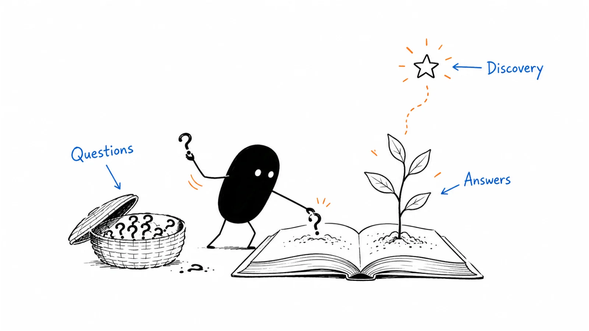

**Last reviewed:** 2026-09-07 · **Reading edit:** 2026-09-07

**Reading edited:** 2026-09-11

The team published three articles last week. The founder posted every day. There is a new template, a newsletter draft, and a spreadsheet full of keywords.

Then a prospective customer asks, “If we keep our existing queue, what exactly does your service do?”

Nobody has a useful link to send.

That is one kind of content problem. Another team has excellent product explanations but almost nobody encounters them. A third attracts readers who enjoy the articles and have no reason to care about the business behind them.

These teams do not necessarily need more content. They need to decide what their content is meant to do, for whom, and why their particular contribution is worth the reader's time.

Content strategy connects those choices to production, distribution, and maintenance. The calendar helps execute the choices. It cannot make them for you.



*Start with a reader's situation, decide what would help, and give the answer a place where people can find and use it.*

**Jump to:** [the running example](#the-library-we-will-build) · [different content jobs](#give-content-a-job-beyond-get-more-traffic) · [finding questions](#collect-questions-with-their-context) · [choosing priorities](#choose-the-next-piece-not-the-entire-year) · [a worked content map](#how-a-finished-map-reads) · [solo publishing](#build-a-cadence-you-can-maintain) · [AI-assisted writing](#use-ai-without-outsourcing-the-point-of-view) · [copyable briefs](#copyable-templates).

## Use this when

You have more ideas than writing time. Different people request articles for different reasons. The blog is busy but the business cannot explain what it contributes. Or a useful body of knowledge is scattered across messages, talks, product documentation, and the founder's head.

Use it before commissioning a large content program, and revisit it when the audience, offer, or available resources change.

It applies to more than blog posts. A comparison page, an implementation guide, a founder essay, a useful spreadsheet, and an explanatory video are all content. They may deserve different production processes and different measures of success.

## Do not use this when

Content cannot fix a product promise you cannot fulfill. If an integration does not exist, a better article should explain that boundary, not write around it.

Nor does a content plan replace talking with people. Publishing can help you find an audience and learn what matters, but reading analytics alone rarely explains why someone misunderstood an offer or rejected it.

You do not need a finished ICP document before writing anything. Start with a plausible audience and label the assumptions you are testing. The [ICP](../01-strategy-and-buyers/icp.md) and [positioning](../02-product-marketing/positioning.md) guides help refine that context; they are not permission slips for a first useful article.

If the immediate job is editing one page, use a brief proportionate to the task. A corrected setup instruction does not need a new annual strategy workshop.

## The library we will build

The running example is fictional. It continues the assisted request-preparation service from the previous articles. Conversations, audience observations, proposed content, and measurements here are teaching material, not Lensmor customer evidence.

The service helps operations teams prepare one supported type of record-correction request for engineering review. It organizes information and helps follow up on missing details. Engineers still approve and execute the change; the service does not change production records.

Earlier exercises produced useful handoffs, a paid bounded pilot, and repeat use with substantial human assistance. We have not established that software alone produces the same result.

Now suppose the founder wants a small content library. Some prospective users do not recognize request preparation as a separate problem. Others understand it but assume the service replaces their existing queue. An engineer wants to inspect the handoff. The founder also has observations about why polished summaries can hide unresolved work.

Those are different editorial opportunities. The useful plan should make room for discovery, explanation, evaluation, and a defensible point of view without pretending they are all the same page.

<a id="operating-method"></a>

## How to do it

### Give content a job beyond get more traffic

Start with the reader's situation and the business reason to help.

An operations lead encountering your work for the first time may need language for a familiar frustration. A returning visitor may want to compare options. An existing customer may need a reliable instruction they can use without contacting support.

A piece can serve more than one purpose, but identify the main one so you can judge whether it works.

| Reader situation | What the content helps them do | A plausible format |
|---|---|---|
| They experience a problem but have not named it | Recognize a pattern and decide whether it deserves attention | An observation-led essay, diagnostic example, or short talk |
| They want to understand an approach | Learn the mechanism, scope, and limits | An explainer with a worked example |
| They are choosing among options | Compare relevant trade-offs and requirements | A comparison, evaluation guide, or implementation note |
| They need to bring colleagues along | Explain the proposal accurately to another person | A shareable summary with evidence and open questions |
| They are trying to do the work | Complete a task and handle common exceptions | Documentation, tutorial, checklist, or working file |
| They want an informed perspective | Examine an argument and develop their own judgment | A founder essay, research note, interview, or white paper |

These are not mandatory funnel stages. People arrive in different places, return to earlier questions, and share pages with colleagues who know less or more than they do.

A thoughtful essay can introduce a new business to its first users. A precise implementation note can help close a current evaluation. Neither deserves automatic priority in every company.

Decide which job matters now. If people cannot find you, some effort may belong in discovery. If interested people misunderstand the offer, explanation may matter more. If existing users cannot complete a task, fixing the instruction may beat publishing another acquisition article.

### Define an editorial promise you can keep

An editorial promise explains what a reader can repeatedly expect from your work.

For the fictional service, “We explain the practical work between a messy request and an engineering decision” is more useful than “We cover the future of operations.” It names a territory the founder can investigate and a reader can recognize.

It should be wide enough to contain worthwhile questions and narrow enough to guide exclusions. Request completeness, handoffs, review responsibility, and late corrections fit. A generic roundup of every AI productivity tool probably does not, unless there is a specific connection to that work.

This is not a demand to write only about your product. An article can be useful to someone who never buys. The relationship is that the people, problems, or expertise overlap with the business you are building.

Choose a point of view you can defend rather than a provocative position selected only for attention. “A complete-looking summary can hide unresolved work” is a claim you can illustrate and examine. “All existing operations tools are broken” needs much more evidence and is unlikely to help someone make a careful decision.

As your understanding changes, revise the promise. Consistency means the work is recognizable, not that you must defend an early opinion forever.

<a id="step-1-steal-the-questions-from-live-deals-not-from-a-brainstorm"></a>

## Collect questions with their context

Useful questions come from sales conversations, support requests, onboarding, product usage, interviews, public discussions, and your own work. Search research can add language and indicate some forms of demand.

Do not use only live deals. That sample overrepresents people who already found you and were willing to speak. It may miss people who do not understand the category, cannot access a meeting, or chose another route without telling you.

Record enough context to interpret the question: who asked, what they were trying to do, what prompted it, and which part remained unanswered. Preserve the source privately where appropriate. Public content should not expose private customer details merely because the original question was useful.

An exact phrase can inform a title without becoming a published quotation. Get appropriate permission for attributable quotes. For a teaching scenario, invent it openly rather than disguising a real person's story with only a changed name.

**Founder:** “I keep hearing that people want automation. Should the next article be about automating operations?”

**Operations lead:** “My immediate problem is narrower. I do not know whether a request is ready to send to engineering.”

**Founder:** “What is usually missing when you reach that point?”

**Operations lead:** “A reference, someone else's confirmation, or an explanation of what changed. A clean summary can still miss all three.”

The topic is now more concrete. The founder can investigate request readiness rather than assembling another broad article about automation.

### Separate the question from your proposed answer

“Why our service is better than a spreadsheet” is a proposed argument. “When does a spreadsheet stop being enough for this task?” is a question you can examine.

Keep both in the notes, but do not let the answer silently determine the research. A spreadsheet may remain the best option for some readers. Your content becomes more credible when it explains those conditions.

Likewise, a requested feature is not always an article topic. If people repeatedly ask where a button is, the product may need a clearer interface. Writing a guide can help now while the underlying issue remains a product decision.

Cluster questions by the work they concern, not just shared keywords. “Who approves this?” and “Can the service change production data?” may belong together in an explanation of responsibilities even though the words differ.

You do not need exactly ten interviews or a fixed number of repetitions. A single important, well-understood question can justify a page. Repetition increases confidence that it is recurring, but a small sample does not establish how common it is across the market.

<Accordion title="What if we do not have customers to learn from yet?">

Use the experience and access you actually have. Study public workflows, try relevant tools where permitted, interview prospective users, or explain a problem you have directly encountered.

Label the basis for the writing. “Here is a fictional example of an incomplete request” can teach a useful method. “Our customers reduced rework” is a different claim and needs actual evidence.

An early article can also be a way to learn. Publish a clear argument or an unresolved question, invite relevant feedback, and record what changes your understanding. Do not treat positive comments as proof of willingness to buy.

You can start without customer case studies. You cannot responsibly fill that gap with invented customers, fabricated quotes, or AI-generated research presented as interviews.

</Accordion>

<a id="step-2-sequence-decide-then-educate"></a>

## Choose the next piece, not the entire year

Look at a short set of candidate topics and ask why each deserves time now.

Consider the significance of the reader's problem, the quality of evidence you can contribute, the likely use of the finished work, and the cost of producing and maintaining it. These are judgment inputs, not a universal scoring formula.

A frequently requested comparison can still be a poor next project if you cannot test the relevant alternatives or keep the details current. A less frequent question about the product's actual responsibility may be important enough to answer immediately.

Estimate effort beyond drafting. Research, specialist review, permissions, examples, illustrations, publication, distribution, and future corrections all use time. A “quick” article can be expensive if it makes claims that change every week.

Ask whether an existing page already answers the question. It may need a clearer title, a better example, or a more visible link. Another URL can make the library harder to use if it creates two incomplete answers that disagree.

### Keep urgent gaps and longer-term work visible

If a customer evaluation is blocked on a missing explanation, it can make sense to write that explanation first. But an endless queue of urgent sales requests can consume all the time meant for building an audience.

Make the trade-off explicit. A solo founder might keep one near-term customer question and one broader investigation in view, working on only one substantial piece at a time. Another business might need a different balance.

There is no mandatory ratio between education and evaluation content. The right allocation depends on the current business, audience, distribution access, and evidence available.

Use actual constraints. “We can produce one carefully reviewed guide this month and update two existing pages” is a workable plan. “We will cover every important topic” is a description of a future library, not a commitment you can schedule.

### Do not let search volume make every decision

Search demand can help you understand how some people look for information. It does not capture every worthwhile question.

A technical approval question may have little visible search volume and still matter in several evaluations. A new category may not have settled terminology. A founder's original observation may reach people through a conversation or an existing audience rather than a query.

Conversely, large search volume can belong to students, casual readers, job seekers, or users with needs your business does not serve. That does not make them bad readers; it changes the reason you would invest in that topic.

Use search research to refine the plan, not to pretend a list of popular phrases is already a strategy. The detailed channel work belongs in [SEO and AEO](../04-channels-and-distribution/seo-and-aeo.md).

## How a finished map reads

The following is an invented editorial queue for the request-preparation service. It shows decisions about work, not claims that these articles are already published or that real customers asked these exact questions.

| Candidate | Reader job | Current evidence | Editorial decision |
|---|---|---|---|
| What makes a request ready for engineering review? | Understand the task | The founder can explain the process with a clearly fictional example | Write a practical guide and a small reusable checklist |
| Can we keep our existing queue? | Evaluate fit | Current service scope and handoff responsibilities can be checked | Update the offer explanation; link to the guide rather than repeat it |
| How does this compare with a named platform? | Compare options | The team has not investigated that platform adequately | Research first; do not publish a confident comparison yet |
| Why a polished summary can hide unfinished work | Examine a point of view | A specific mechanism can be illustrated, but market-wide prevalence is unknown | Write an argument with limits, not an industry trend report |
| How do I submit a late correction? | Use the service | The delivery process still needs an agreed answer | Resolve the workflow, then publish the instruction |
| The state of AI operations this year | Understand a broad market | No original study or defensible coverage plan | Defer or narrow; a fashionable title is not enough |

The first two items support one another without needing to be the same page. The guide teaches the task. The offer explanation describes what the service actually does.

The fourth item is not forbidden until every comparison page exists. It has a distinct purpose and a plausible contribution. Whether it gets written now depends on capacity and how the founder expects the right readers to encounter it.

The late-correction instruction is important, but the missing answer is not primarily a writing problem. Publishing a plausible procedure before delivery agrees to it could create a promise the business cannot keep.

Keep the map as small as it needs to be for decisions. Archive ideas you are not considering rather than forcing an arbitrary eight-row limit or maintaining an enormous backlog that nobody reviews.

<a id="step-3-lock-34-perceptions-then-write-the-gaccs-brief"></a>

## Write a brief that prevents the likely mistake

A brief should help someone produce the right work and let a reviewer judge it. Its length should depend on the uncertainty and coordination involved.

For the request-readiness guide, useful inputs include the reader's situation, the question, the proposed answer, the example, the evidence boundary, and where the guide will be used. If the founder writes and reviews it alone, naming five departments adds nothing.

Describe the contribution in a sentence: “The guide helps an operations lead distinguish a complete-looking summary from a request whose required information has actually been checked.”

Then identify what would make the article fail. It might imply that the service approves engineering changes, turn a fictional example into a customer story, or offer a checklist without explaining how to handle missing information.

Those risks tell the writer what needs care. A broad direction such as “make it insightful and on-brand” does not.

### Use existing frameworks without turning them into gates

The existing [campaign brief](../../templates/campaign-brief.md) uses GACCS: goals, audience, creative, channels, and stakeholders. It can help coordinate a campaign or substantial asset. It is not a requirement to invent a formal campaign for every correction or short explanation.

Emily Kramer's public GACC introduction appeared on July 27, 2021; the public GACCS resource description dated July 24, 2025 includes stakeholders. These are practitioner planning tools, not a universal law of content production. [MKT1: GACC](https://newsletter.mkt1.co/p/the-gacc-marketing-brief-the-best?ref=b2b-playbook), [MKT1: GACCS](https://newsletter.mkt1.co/p/gaccs-brief-generator-and-template?ref=b2b-playbook)

If you use that working file, treat its perception and “only we can say” prompts as aids to clarity. A product instruction can be worthwhile because it accurately explains your product, even when the underlying concept is not unique. You do not need to manufacture three or four annual perceptions before writing it.

Filled working files remain your records. Adapt your own copy to the job; do not erase previous decisions just to fit the newest phrasing in a guide.

<a id="step-4-one-page-one-question"></a>

## Give each page a clear center, not an artificial limit

A reader should understand what a page will help them do. That does not mean the page may answer only one sentence-shaped question.

A useful guide to request readiness can cover required information, a worked example, common exceptions, and a copyable checklist. Splitting those into four thin pages may create more navigation than value.

Separate a topic when it has a distinct task, audience need, maintenance cycle, or access requirement. Keep related explanations together when readers need them to complete the same job.

One page can also serve multiple roles. Operations may read the whole guide while an engineer jumps to the review boundary. Use meaningful headings, short summaries, and links to help them find the relevant section.

### Choose the form around the work

A tutorial should let someone follow a task. A reference page should make a detail easy to retrieve. An opinion piece should explain an argument. A comparison should expose relevant differences rather than always arranging the evidence so your product wins.

A video can show a sequence that is hard to explain in prose. A table can make trade-offs easier to compare. A downloadable working file can help a reader apply the method. None is required simply to make the page feel more elaborate.

Think about maintenance too. A video of a frequently changing interface can become inaccurate sooner than a short text instruction. A spreadsheet with formulas needs testing. A research report needs a clear method and evidence trail.

Choose the smallest form that properly does the job, not automatically the shortest piece. Some subjects deserve depth.

### A documented example: different homes for different work

PostHog's public writing handbook distinguishes blogs, newsletters, tutorials, and documentation by their jobs. It describes documentation as structured reference and tutorials as task-oriented paths, while blog posts can include opinions, stories, guides, and comparisons. It also asks writers to consider how the work will reach its audience. Checked September 7, 2026. [PostHog: Writing blogs](https://posthog.com/handbook/content/blogs?ref=b2b-playbook)

The useful lesson here is organizational: content does not all have to live in one undifferentiated blog feed. This is a published editorial-process example, not proof that adopting PostHog's structure produces its business results.

Your own library may be much smaller. A clear distinction between learning, evaluating, and using can be enough without copying another company's teams or publishing volume.

## Make the piece worth reading even without the product pitch

The reader should leave with something more useful than the fact that your company exists.

That contribution could be an observed pattern, an explanation of a mechanism, a carefully tested comparison, an original calculation, a usable example, or a clearer way to make a decision. It does not have to be a claim nobody has ever made before.

For the fictional guide, the contribution is the difference between a well-written summary and a reviewable request. Show an incomplete packet, identify the missing reference and unresolved confirmation, and explain why fluent wording does not resolve either.

Then show what a prepared handoff would include and who still makes the decision. The product can appear where it genuinely helps. It should not replace the explanation.

### Build an evidence trail while writing

Separate facts, observations, interpretations, and teaching examples in your notes.

A product capability needs a current, checkable source. A customer outcome needs permission and an accurate description of what happened. A broader claim needs evidence that supports its scope. A fictional example needs a visible label.

Do not add a precise number merely because a headline feels stronger with one. If you measured something, explain what was measured, under which conditions, and what the result does not establish.

**Editor:** “The draft says teams cut review time in half. Where does that figure come from?”

**Founder:** “It was a number in the illustrative example, not a measured customer result.”

**Editor:** “Then it cannot be the headline claim. What can we actually show?”

**Founder:** “We can show how a missing confirmation survives a polished summary, and how the checklist makes that gap visible.”

The revised idea is narrower and more defensible. It can still be interesting.

Keep citations near the claims they support. A source list at the bottom should help readers inspect the argument, not camouflage unsupported statements in the middle.

When a source is a vendor's documentation, use it for the documented behavior. Do not turn it into independent evidence of customer satisfaction or comparative superiority.

### Write the difficult part, not only the introduction

Many thin articles spend most of their length defining the problem and very little helping the reader act.

For the request-readiness guide, the difficult part is what to do when a required detail is missing, two sources disagree, or a correction arrives after review begins. That is where examples and careful explanation earn their space.

A strong section might describe the situation, show the available information, walk through the decision, and explain a reasonable alternative. It does not need to end in a slogan.

Let the reader see your reasoning at a useful level. “Keep the original queue authoritative because two competing status records create reconciliation work” is more helpful than “Maintain a single source of truth” with no explanation.

You can be direct without sounding absolute. Name the conditions under which your recommendation changes.

## Design for someone who is actually reading

Start near the situation that made the reader open the page. Avoid a long introduction about how rapidly the world is changing unless that change is necessary to understand the argument.

Use headings that answer navigation questions. “Handling a late correction” is easier to find than “Unlocking the next level.” Put a short orientation near the top of a long guide and let readers jump to the part they need.

Give examples enough room to work. If a conversation matters, separate the speakers and their turns. If a table is wide, make it scroll on a phone rather than shrinking the text until it is unreadable.

Illustrations should explain or orient. Use a consistent visual language, meaningful alternative text, and legible English labels. A diagram of responsibility or a before-and-after packet can help; a decorative robot beside every AI paragraph usually does not.

Use an illustration when it explains a decision, relationship, or workflow more clearly than the text alone. Omit it when it merely repeats the heading.

### Make the next step fit the reader

An evaluation page may invite a scoped demo. A tutorial may link to the next task. An essay may invite a considered reply or point to supporting evidence. A reference page may simply let the reader get back to work.

Choose a clear primary next step when it helps. Related links can still be useful; you do not have to restrict every page to one possible action.

Do not interrupt a person who is trying to understand a basic concept with repeated sales prompts. If the content promises a useful answer, deliver it before asking for something else.

<Accordion title="Should we put the content behind an email form?">

Start with the exchange you are proposing. What will the reader receive, why is identification needed, and what communication will follow?

Basic product explanations and instructions are often easier to use and share without a form. A live workshop, tailored assessment, or recurring subscription may have a more obvious reason to collect contact details.

A gated report can be a legitimate choice, but the number of forms submitted is not the same as the number of people who want a sales conversation. Be clear about delivery and follow-up expectations rather than quietly treating access as agreement to unrelated outreach.

Consider an open explanation with an optional subscription or download where that serves the task. Test the actual experience and business objective; there is no universal rule that every white paper must be gated or every valuable asset must be free.

</Accordion>

<a id="step-5-name-the-working-artifact"></a>

## Give the content a route to the right people

Before substantial production, describe at least one plausible way the intended readers will encounter and use the work.

For the fictional guide, the founder might send it when someone asks how to judge readiness, link it from the offer explanation, and adapt one concrete example into a post for an existing relevant audience.

That is a route, not a guarantee. If the founder has no audience in the proposed channel, the plan needs to account for how they will earn attention there.

Emily Kramer's September 28, 2022 essay argues for planning distribution before production rather than treating publication as the finish. The practical application here is to connect the topic, audience, and available route—not to assume every asset needs a large launch. [MKT1: Content distribution](https://newsletter.mkt1.co/p/content-distribution?ref=b2b-playbook)

### Adapt the entry point without changing the claim

A social post needs enough context to make sense in a feed. An email follow-up should explain why this particular link answers the person's question. A community contribution should help in the discussion and respect its rules.

Do not turn every section into an identical promotional post. Select the part that suits the destination and keep its evidence boundary. A fictional example remains fictional when it becomes a slide or a short video.

A useful excerpt can stand on its own. Readers should not need to click through just to discover that the promised answer was withheld.

Keep a durable home for material that people will need again. Link to that home from related pages and update it when facts change. Distributed copies should not become competing versions of the product truth.

If the plan depends on a partner or creator, confirm their interest and the terms rather than naming them in a calendar as if distribution is already secured.

### Treat search and AI visibility as channels, not editorial authorities

Make the page understandable and technically accessible, with clear titles, useful internal links, and current information. Then evaluate whether the chosen discovery route brings the intended audience.

Google's current guidance for its generative search features says that content does not need to be split into tiny pages or rewritten into a special AI style. It also makes clear that meeting its requirements does not guarantee indexing or display. The page shows a July 10, 2026 update date; checked September 7, 2026. [Google Search Central: Generative AI search guidance](https://developers.google.com/search/docs/fundamentals/ai-optimization-guide?ref=b2b-playbook)

That is guidance for Google Search, not a promise about every AI product. Do not extrapolate a universal ranking formula from it.

For editorial planning, the implication is straightforward: do not create a near-duplicate page for every wording of a question merely to pursue citations. Preserve the context a person needs to understand the answer.

An AI citation can indicate visibility. It does not tell you by itself whether the answer represented you accurately, whether the right person saw it, or whether it helped the business.

## Build a cadence you can maintain

For a solo operator, the scarce resource is often the attention needed to research, decide, review, and finish—not the ability to produce a first draft.

Choose a small amount of work you can carry through publication and maintenance. If a substantial article needs several sessions, plan those sessions instead of promising a new long-form piece every day.

A plausible rhythm might include collecting questions during ordinary work, choosing the next piece, developing the example, reviewing the draft, publishing it, and checking what readers found confusing. Those are activities to fit around your capacity, not a mandatory weekly schedule.

Leave room for corrections and distribution. A calendar that allocates every available hour to new writing assumes the existing library never needs care.

### Reuse research, not just sentences

One investigated question can support several useful outputs.

The request-readiness research might become a long guide, a short explanation on the offer page, and a checklist used during a conversation. Each has a different job. They should share the same factual basis without forcing a reader through repeated copy.

Do not count those as three independent discoveries. Repurposing extends the usefulness of research; it does not create new evidence.

When you record an interview or demonstration for reuse, confirm the relevant permissions and publication scope. Editing a private conversation into a public clip is a different action from using it to understand the task internally.

For recurring content, describe what people can expect: a specific kind of practical observation, a well-chosen example, or a considered answer to a recurring question. A dependable editorial promise matters more than an ambitious frequency you repeatedly miss.

### Limit the work in progress

An unfinished research report, half-written newsletter, and six unreviewed drafts can consume more attention than one completed guide.

Choose what you will finish next and what you will deliberately pause. If a key source or approval is missing, move the piece out of active production rather than repeatedly polishing the introduction.

Set review responsibilities in advance. A technical reviewer should check the technical claim; they do not necessarily need to rewrite every sentence. A customer whose story is included should review the agreed use of their material.

When one person does everything, separate those review passes mentally or in time: first the argument, then the facts, then the reading experience. A checklist can help, but it cannot make an unsupported claim true.

## Use AI without outsourcing the point of view

AI can help organize permitted notes, suggest outlines, identify unanswered questions, and challenge a draft. It can also produce confident filler that sounds complete before the actual thinking has happened.

Give it a bounded job. “Find places where this draft makes a broader claim than these sources support” is more testable than “Make this thought leadership.”

Keep the inputs appropriate for the tool and its configured data handling. Do not paste private customer material into a service merely because it would make the draft more specific. Use approved material or a clearly fictional substitute where needed.

Check generated citations at the source. Verify numbers, product capabilities, quotations, and dates. A fluent explanation does not establish that the linked page says what the draft claims.

### Preserve the observation that makes the piece yours

Before asking for a rewrite, state the actual point in plain language.

For the founder: “People may mistake complete-looking text for completed verification. I want to show the difference using one request.” That is a useful editorial input.

Ask whether each section strengthens that explanation. Remove generic material that could appear unchanged in any article about AI. Add the detail that matters: the missing reference, the review handoff, or the consequence of an outdated packet.

Do not manufacture personal experience. If a draft says “We learned this after dozens of customer interviews,” that sentence needs real supporting history. A model's suggested anecdote is not a memory.

Natural writing comes from concrete thought, appropriate emphasis, and an honest voice. Adding slang, deliberate errors, or arbitrary first-person claims does not make an article more human.

The [AI workflow](../09-operations-pipeline-and-measurement/ai-workflow.md) and existing [AI teammate brief](../../templates/ai-teammate-brief.md) can help define the production boundary. Keep research assistance, drafting, approval, and publication distinct.

<a id="step-6-refuse-unfinished-pages"></a>

## Publish a useful scope, then maintain it

A page does not need to answer every possible question before publication. It does need to deliver the answer it promises and identify important limits.

A focused guide with a worked example can be ready while a broader research project remains unfinished. Publish the focused guide as such. Do not call it a comprehensive industry study because the larger title feels more impressive.

Check the actual page before release. Follow the links, inspect the phone layout, try the downloadable file or copy button, and verify that headings lead where readers expect.

Then give the page an owner and a reason to be reviewed. Product changes, broken links, repeated reader confusion, new evidence, or a shift in the offer can all trigger an update.

### Treat updates as editorial work

Not every update needs a new URL. If the task remains the same, improving the existing page can preserve useful links and reduce conflicting versions.

Keep a distinction between the date you checked factual sources and the date you edited the prose. Changing the introduction does not mean the comparison data was reverified.

If a material claim was wrong, correct it clearly enough that affected readers can understand the change. Do not silently replace a measured result with a different number and leave earlier promotional copies untouched.

Some pages should be merged or retired. Before removing one, check whether people still rely on it and provide an appropriate replacement or explanation. An old page may be valuable history if it is labeled as such, even when it should no longer guide current product use.

## Metrics

Choose measures that correspond to the content's job. Keep the observation window and definitions visible, and separate activity from results.

| Question | Useful evidence | Important limit |
|---|---|---|
| Can the intended audience find it? | Relevant discovery queries, referrals, distribution reach, or reader feedback | Reach does not establish usefulness or audience fit |
| Does it answer the question? | Comprehension checks, fewer repeated clarifications in a comparable setting, reported usefulness | Small or self-selected samples are not representative |
| Does it help an evaluation? | Documented use in a conversation and the question it helped resolve | A touched opportunity is not revenue caused by the page |
| Does it help someone do the task? | Task completion, errors, support needs, or observed use of the working file | Downloads and copy clicks do not prove successful application |
| Is the recurring promise working? | Appropriate return use, relevant subscriptions, replies, or continued engagement | Readers may benefit without returning on a fixed schedule |
| Is the library sustainable? | Production effort, review backlog, stale claims, and update time | More output is not automatically more value |

### Compare like with like

Suppose, in an invented reporting period, an evaluation guide receives 120 measured visits and six tracked inquiry starts. That is five inquiry starts per hundred visits.

A broader educational article receives 2,400 measured visits and 24 inquiry starts: one per hundred visits, but four times as many starts in total.

Neither result automatically tells you which piece is better. The pages have different jobs, audiences, distribution, and costs. An inquiry start is not a completed inquiry, a qualified opportunity, or a customer. Visits are not necessarily distinct people, and tracking can miss activity.

The figures describe the observed ratios under those definitions. They do not prove that either page caused the inquiries or that one format has a universally better conversion rate.

If the evaluation guide helped a small number of appropriate readers understand a difficult constraint, that may be useful. If the educational article reached many relevant people for the first time, that may also be useful. Compare each with its purpose and the resources invested.

### Use small-sample feedback without pretending it is a study

A founder may have little traffic and still learn something important.

Ask a relevant reader what they expected, what they understood, and where they got stuck. If they read a checklist, ask how they would use it. Avoid leading them toward the answer you hoped the page would communicate.

**Founder:** “The new guide has fewer visits than the broad AI post. Should I replace it?”

**Editor:** “What was the guide supposed to help people do?”

**Founder:** “Understand what makes a request ready. One reader still thought the service approves the change.”

**Editor:** “That misunderstanding gives us a concrete edit. It does not tell us that the whole topic is wrong.”

Fix the misleading boundary, then inspect whether the revised explanation is clearer. You do not need statistical confidence to correct a demonstrably ambiguous sentence.

At the same time, do not turn one enthusiastic reply into a claim of market demand. Keep qualitative learning, usage observations, and causal business evidence separate.

## Copyable templates

### Topic brief

Use this for a meaningful new piece or revision. Keep only the fields that help make the decision. It is an original working outline, not a reproduction of a paid third-party template.

```text
EDITORIAL DECISION BRIEF

Reader and situation:
Main job this piece should do:
Question or argument:
Why it matters now:
What already answers part of it:

Our useful contribution:
Evidence available, with sources and dates:
What remains an assumption:
Example: real and approved / explicitly fictional
Claims we cannot make:

Proposed scope and format:
Related questions to cover here:
Questions to link elsewhere:
What the reader can do afterward:

Where readers will encounter it:
Owner and necessary reviewers:
Research, production, and maintenance effort:
Decision: write / update / investigate / defer
What would change that decision:
```

### Decision-page map

Use the [worked map](#how-a-finished-map-reads) for the queue of proposed pieces. For a published page, keep this short review record alongside the map so updating existing work remains visible.

```text
CONTENT REVIEW RECORD

Page and owner:
Primary audience and job:
Publication date:
Last factual review:
Last reading edit:

How the page was used:
Observation period and definitions:
Quantitative evidence:
Qualitative feedback:
What we cannot infer:

Confusing, missing, or outdated material:
Claims and source links to recheck:
Related pages or distributed copies affected:
Reader task and interaction checks:

Decision: keep / improve / merge / retire
Reason:
Next action and responsible person:
Review trigger or agreed date:
```

<a id="pre-flight-checklist"></a>

## Before you start

Name the reader's situation and the useful contribution. Confirm that the promised scope is supported by the evidence you have or by a clearly identified research plan.

Check whether an existing page should be improved instead. Choose a format, a plausible route to readers, and review responsibilities that fit the work.

If you are using a fictional example, label it where people encounter it. If you are using real customer material, confirm the publication permission and factual boundaries.

Leave time to inspect the reading experience and maintain the result. A content strategy should help you make these decisions, not become another document that must be fed indefinitely.

## Common mistakes

**Making every article a sales objection handler.** Evaluation content matters, but it is not the only reason people choose to read a company's work.

**Treating education as automatically valuable.** A broad topic still needs a relevant audience, a useful contribution, and a reason to invest.

**Turning every query into a separate page.** Several wordings may belong to the same task. Fragmentation can make the answer harder to find and maintain.

**Publishing a comparison before doing the comparison.** A confident feature grid assembled from incomplete sources is not a substitute for careful investigation.

**Confusing a framework with the work.** A completed brief cannot compensate for a weak argument or unsupported claim.

**Using AI to manufacture experience.** Invented interviews and first-person lessons remain invented, however natural the prose sounds.

**Measuring only what is easiest to count.** Page views, posts, and downloads can be useful diagnostics. They do not answer every question about value.

**Leaving the old library behind.** New articles do not repair inaccurate instructions, duplicated explanations, or broken links in the pages readers already use.

## What to read next

Use [Founder story](founder-story.md) for a perspective grounded in actual experience, [Case study](case-study.md) for an approved customer's context and outcome, and [White paper](white-paper.md) for a longer sourced argument.

Keep product explanations consistent with [Messaging](../02-product-marketing/messaging.md) and [Sales enablement](../02-product-marketing/sales-enablement.md). Use [Comparison page](../07-website-and-conversion/comparison-page.md) when a fair comparison is the specific task.

For reaching readers, continue with [Channel strategy](../04-channels-and-distribution/channel-strategy.md), [SEO and AEO](../04-channels-and-distribution/seo-and-aeo.md), or [Peer community](../04-channels-and-distribution/community.md). Choose the route that fits the audience rather than adding every channel to the calendar.

## Sources and evidence boundary

This is an owner-maintained educational synthesis, not a universal content ROI model. The request-preparation story, dialogues, maps, arithmetic, and copyable records are original teaching material. No fictional reader or company is presented as a customer case.

Primary sources checked September 7, 2026:

- [PostHog: Writing blogs](https://posthog.com/handbook/content/blogs?ref=b2b-playbook) supports the narrow example of distinguishing editorial formats and planning how work reaches readers. It is process documentation, not a causal growth case.
- [Google Search Central: Generative AI search guidance](https://developers.google.com/search/docs/fundamentals/ai-optimization-guide?ref=b2b-playbook), displaying a July 10, 2026 update date, supports the Google-specific statements about page structure and non-guaranteed visibility. Other services may behave differently.
- Emily Kramer's public [GACC introduction, July 27, 2021](https://newsletter.mkt1.co/p/the-gacc-marketing-brief-the-best?ref=b2b-playbook), [GACCS description, July 24, 2025](https://newsletter.mkt1.co/p/gaccs-brief-generator-and-template?ref=b2b-playbook), and [distribution essay, September 28, 2022](https://newsletter.mkt1.co/p/content-distribution?ref=b2b-playbook) supply the brief and distribution background cited above.
- Kramer's [planning exercises, October 2, 2024](https://newsletter.mkt1.co/p/marketing-strategy-exercises?ref=b2b-playbook) informed the earlier edition's storyline planning. A fixed perception count is not required by this guide.

Only the publicly available material was consulted. Paid generators, templates, and subscriber-only sections were not accessed or reproduced. The recommendations surrounding the source examples are editorial reasoning, not measured outcomes attributed to those companies.

---

Copyright © 2026 Ivan Xu. All rights reserved. See the [copyright and reuse terms](../../LICENSE).

Canonical source: [github.com/weilun88313/B2B-Playbook](https://github.com/weilun88313/B2B-Playbook)
