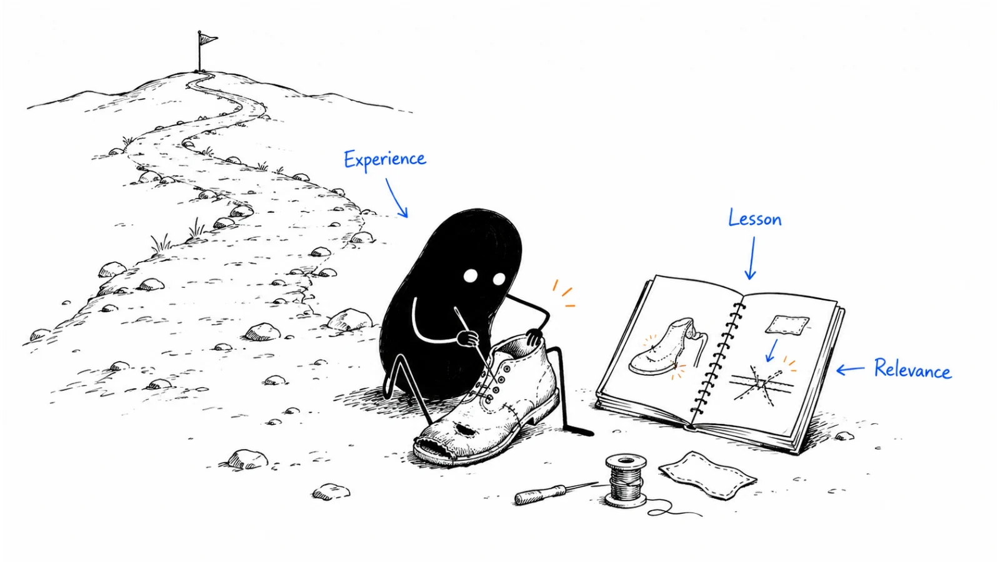

**Last reviewed:** 2026-09-07 · **Reading edit:** 2026-09-07

Someone asks why you started the company.

You mention your previous job, the size of the market, and how much time the industry wastes. You say you wanted to build something better. Everything is true. None of it explains why you chose *this* problem, or what you understand about it that a visitor would not learn from your product page.

That is usually the missing part of a founder story. It is not a more impressive biography. It is the connection between an experience, a judgment, and the company you are building now.

A useful story might begin with an ordinary piece of work: a request that kept coming back incomplete, a workaround people defended for good reasons, or a prototype that solved the wrong part of a problem. The interest comes from what you noticed and how it changed your choices. You do not need a dramatic resignation, a childhood destiny, or a villain.

This chapter helps you find that material, check it, and turn it into something another person would actually want to read. It also explains where a founder story stops being useful. Understanding your motivation is not the same as trusting your product with an important job.



*Reading guide: find a scene → examine what changed → connect it to a present choice → adapt it without rewriting history.*

If you are writing today, start with [the interview](#step-2-write-the-scene-before-the-bio), then read [the complete illustrative story](#worked-example-illustrative). If a draft already exists, go to [the editorial review](#step-5-refuse-the-costume). The two copyable templates cover [the factual record](#copy-founder-story-card-fill) and [publication review](#before-you-start).

## Use this when

Your About page lists credentials but gives no sense of the people behind the company. A founder gets asked the same origin question in interviews and improvises a slightly different explanation each time. A marketer has plenty of product facts but cannot explain why the team takes a particular approach.

It is also useful before you have a large audience. One thoughtful page can help a prospective customer, employee, partner, or journalist understand you. Whether you can distribute it widely is a separate question.

An early-stage founder can write down an honest account while the business is still changing. You need enough clarity to name the problem you are exploring; you do not need to pretend that your [ICP](../01-strategy-and-buyers/icp.md) and [positioning](../02-product-marketing/positioning.md) are final. Say what remains uncertain.

## Do not use this when

A buyer is asking for a specific answer about implementation, security, pricing, or results. Answer that question first. A warm personal introduction cannot substitute for a missing approval process or a product limitation.

If you need evidence of a customer's outcome, work on a [case study](https://b2-b-playbook.mintlify.app/playbooks/03-brand-story-and-content/case-study). If you need a clear product explanation, work on [messaging](../02-product-marketing/messaging.md). If the story is ready and you need to reach people, work on [channel strategy](../04-channels-and-distribution/channel-strategy.md).

Do not turn this exercise into a requirement that the founder become a public personality. Some founders prefer private conversations. Some cannot discuss former work. Some simply have more useful work to do than maintain a feed. A short, approved company account may be enough.

<a id="words-you-will-use"></a>

## A few useful terms

Several different writing jobs get called “the founder story.” Separating them makes the draft easier to edit.

| Piece | The reader's question | What belongs in it |
|---|---|---|
| Origin story | Why did you start working on this? | Relevant experiences, early attempts, and the decision to proceed |
| Founder perspective | How do you think about this problem? | A judgment, its reasoning, and the limits of that judgment |
| Biography | Who is this person? | Relevant roles, background, and responsibilities |
| Company history | How did the organization develop? | Milestones, contributors, changes, and dates |
| Personal brand | What do people associate with you over time? | The accumulated effect of work, behavior, communication, and reputation |
| Product or customer proof | Does this approach work for us? | Demonstrations, evidence, conditions, and attributable outcomes |

These can share material without becoming interchangeable. An About page might contain a short origin story and a biography. An interview might move between origin and perspective. Neither becomes product proof because the founder sounds convincing.

A **scene** is a particular situation you can describe: who was doing what, what was difficult, and what happened next. A **point of view** is the interpretation you draw from it. The distinction matters because the event can be accurate while the interpretation is too broad.

<a id="one-rule"></a>

## Keep this in mind

The reader should be able to follow the connection between what happened and what you now do differently.

“I encountered this problem” is only the beginning. What did you misunderstand? What did other people show you? Which choice became harder to avoid? How is that choice visible in the product, the service, or the way you work?

You can select a small part of a long history. You cannot improve the history by inventing a turning point, removing a cofounder, or giving your earlier self knowledge you acquired years later.

A useful test is to imagine someone who was there reading the draft. They may remember different details. They should not feel that you have replaced a shared experience with a story in which everyone else existed to recognize your brilliance.

<a id="operating-method"></a>

## How to do it

### Step 1: start from a perception, not from a timeline

Before opening an empty document, finish this sentence: “After reading this, I hope someone understands why we…”

For the fictional business used throughout these chapters, that might be: “…help prepare a request without taking over the customer's approval decision.”

The business assists with **one supported type of record-correction request**. It organizes the information and helps follow up on gaps. Customer engineers still approve and execute any correction. The service does not change production records. Earlier illustrative work included a pilot and a paid repeat engagement with substantial human assistance; it did not establish a self-serve product or broad product-market fit.

That boundary is interesting story material. Why would a founder deliberately stop short of the apparently exciting part—making the change? What did they learn about responsibility, context, and trust?

By contrast, “I want readers to think I am visionary” gives the writer almost nothing useful to investigate. It encourages impressive language instead of an explanation.

You may already have audience perceptions in your [content strategy](https://b2-b-playbook.mintlify.app/playbooks/03-brand-story-and-content/content-strategy). Use them as questions, not instructions to manufacture supporting memories. If the experience does not support the desired impression, change the impression or choose different material.

#### Choose the reader before choosing the opening

A prospective customer might wonder whether you understand their day-to-day work. A candidate might wonder how you respond when your first idea is wrong. A partner might want to know why you respect a boundary that other vendors ignore.

One experience could answer all three questions, but not with the same emphasis. Decide who the current piece is for. “Everyone who might encounter the company” is too broad to guide a first draft.

That does not mean every paragraph must end with a buying reason. People also read to understand a person's curiosity, taste, or way of working. A modest, specific observation can make a company feel more legible without being a conversion device.

Write the intended effect in ordinary language. “They understand why approval stays with their engineers” is useful. “Build differentiated founder-market-fit authority” is not an instruction a writer can act on.

#### Make a small pile of possible scenes

Look for occasions when something changed: a failed first attempt, an unexpected objection, an unglamorous task you kept doing manually, or a conversation that made you narrow the scope.

For each candidate, write a few factual sentences before deciding whether it is good material. What was the task? Who else was involved? What did you expect? What actually happened? What did you change afterward?

Do not rank the scenes by drama. Rank them by how much they explain. A memorable conference encounter may have had little effect on the product. A repeated difficulty assembling one request may explain the entire initial offer.

Keep more than one candidate. Otherwise, the first anecdote can become so precious that you start stretching it to explain decisions it did not cause.

### Step 2: write the scene before the bio

Interview the founder about the work before asking them to summarize the company's mission. Summaries are usually rehearsed. Specific questions make room for details that have not yet been turned into marketing language.

Start with a concrete request: “Take me through one time this happened.” Then stay with that occasion long enough to understand it.

What was on the screen? What were you trying to finish? Who needed the output? What information was missing? What did you do next? Which part of your current explanation would have surprised you at the time?

These are memory prompts, not permission to fill in scenery. If nobody remembers the room, weather, date, or exact wording, leave those details out.

#### A conversation that finds the real subject

*The following dialogue is invented for the running example. It is not an interview with Ivan or a customer.*

**Interviewer:** Why did you start working on request preparation?

**Founder:** We saw an opportunity to remove friction from operations.

**Interviewer:** Can you describe one request you helped prepare, before you had a product explanation for it?

**Founder:** I made a clean summary and thought it was ready to review. The engineer still needed a reference from the original request and confirmation of what was meant to change. I had made it easier to read, but I had not made it ready for a decision.

That last distinction is the beginning of a story. The opening answer could belong to almost any operations company. The later answer contains an expectation, a specific difficulty, and a revised understanding.

A good follow-up would ask how the founder responded. Did they add a missing-information section? Ask a better intake question? Change what they promised? If nothing changed, you may have an interesting observation rather than the origin of the present approach. That is fine; describe it accordingly.

Do not keep prompting until the speaker produces a cinematic revelation. Repeated small encounters can be the real explanation. “Over the next few requests, I kept seeing the same gap” is a perfectly serviceable sentence when it is true.

#### Ask about the people outside the frame

Who first identified the problem? Who had already built a workaround? Who explained why the obvious fix was unsafe or impractical? Who did the work that allowed the next attempt to happen?

Those questions improve both accuracy and readability. They give the founder something to react to, and they prevent customers or coworkers from becoming anonymous props.

A founder may have noticed the commercial opportunity while someone else understood the operational constraint. A cofounder may have developed the technical approach. An early employee may have turned a rough practice into something repeatable. Credit those contributions where they affect the explanation.

You do not need separate origin stories that assign every cofounder a unique revelation. A shared account can describe different roles in the same discovery.

#### Keep memory and evidence in separate columns

After the interview, check the important claims against available records: dated notes, a prototype, an email, a decision document, or another participant's recollection. You are not assembling a courtroom exhibit. You are finding places where confident prose might exceed what you actually know.

| Draft material | What to check | How to write when uncertain |
|---|---|---|
| A specific date | A contemporaneous record | Use an honest broader period if the exact date is unknown |
| A spoken sentence | Recording, transcript, or reliable notes | Paraphrase the substance rather than invent a quotation |
| A turning point | What changed afterward, and when | Describe it as one influence if several things contributed |
| Another person's work | Their role and recollection | Attribute the contribution and resolve important disagreements |
| A business result | The underlying evidence and scope | Omit an unsupported number; do not replace it with a vague superlative |

A recollection can still belong in a story. Phrases such as “I remember thinking…” make clear whose memory the reader is receiving. They are not a license to attach precise invented details.

When a story includes a former employer or customer, check what you are permitted to disclose. Removing a name may not make a distinctive incident anonymous. Ask for appropriate permission, remove identifying details, or choose another example. Do not assume that a founder's involvement makes other people's information theirs to publish.

### Step 3: decide whether this is an advantage

There are at least three separate questions here: Is the account credible? Is it relevant to the audience? Can you get it in front of that audience?

A founder can have useful experience and no existing following. Another founder can have a large following whose interests have little to do with the current product. Neither condition decides whether the story is worth writing.

[Emily Kramer and Kathleen Estreich's MKT1 discussion of marketing advantages](https://newsletter.mkt1.co/p/find-and-accelerate-your-marketing?ref=b2b-playbook) includes founder relationships and personal brand as potential sources of credibility and distribution. The practical point for this chapter is to examine what is actually available, including the founder's willingness to participate. It is not a requirement that every founder build an audience before publishing an origin story.

#### Relevant experience does not have to be exclusive

“Only I could tell this” can be a useful prompt for finding details. Taken literally, it becomes a bad publishing rule. Many people have experienced the same frustration. What matters is the accuracy and usefulness of your account, not proving that nobody else has ever had the problem.

You might have been the person doing the work. You might have built tools for that person. Or you might have entered the field from outside and learned through sustained observation and collaboration.

An outsider should not borrow an insider's identity. “I spent years running this process” and “I learned about this process while helping teams prepare requests” are different claims. The second can be credible on its own terms.

Credentials belong when they explain access, knowledge, or a choice. A previous role may be essential context. A degree may explain a technical starting point. Cut a credential when it is merely asking the reader to be impressed, not because biographies are forbidden.

#### Show the choice the experience produced

The strongest connection to the company is often a tradeoff.

Perhaps you narrowed the first workflow because the surrounding cases required different approvals. Perhaps you kept a human review step even though automatic completion would have made a better demo. Perhaps you changed your audience after discovering that the people who liked the idea were not the people who could use it.

Explain the tradeoff without portraying everyone who chose differently as careless. Your design may fit one situation and not another. A founder story becomes less credible when a local lesson expands into a verdict on an entire industry.

Then show where the choice exists now. If the story says you value clear responsibility, the product should make responsibility visible. If it says you learned to listen, a concrete changed decision is more useful than describing yourself as customer-obsessed.

#### Two real accounts worth studying

In [Figma's March 14, 2025 conversation with Dylan Field and Garry Tan](https://www.figma.com/blog/in-conversation-dylan-field-and-garry-tan/?ref=b2b-playbook), Field describes an exploratory beginning: conversations with Evan Wallace, WebGL expertise, and several ideas before the design direction took shape. It is useful here because the account leaves room for experimentation and another founder's contribution. It does not require an inevitable vision from the first day.

In [Retool's February 21, 2023 account featuring David Hsu](https://retool.com/blog/retool-founding-story-david-hsu?ref=b2b-playbook), Hsu describes moving away from an audience associated with legacy tools toward developers building internal applications. The editorial lesson is that a revised belief can belong in an origin account. You do not have to rewrite an early assumption as something you always knew.

These are company-published retrospective accounts, not independent verification of every event. Neither establishes that telling the story caused the company's growth. Study how the accounts explain decisions; do not copy their events, voices, or commercial outcomes into your own history.

<a id="step-4-pick-two-surfaces-not-a-content-engine"></a>

### Step 4: adapt the story to where people will read it

Treat “two surfaces” as a possible starting constraint, not a rule. One maintained About page may be enough. A founder who already speaks with the audience regularly may need a short introduction, a longer essay, and a talk version.

Keep the factual core stable while changing the amount of context. You are adapting the telling, not inventing different histories for different channels.

| Surface | What the reader needs | What to leave out |
|---|---|---|
| About page | Why the company exists, who is involved, and how that affects its work | Every milestone and every product detail |
| First-meeting introduction | A brief reason your experience is relevant to this conversation | A speech before you have heard the buyer's problem |
| Founder essay | A complete account, including uncertainty and a developed observation | A sales pitch attached to every paragraph |
| Podcast or talk | A scene the speaker can explain naturally, with useful follow-up detail | A memorized script that collapses when someone asks a question |
| Social post | One understandable episode or thought | A compressed autobiography with an exaggerated hook |

Word limits depend on the setting. As an editing exercise, try a short introduction of roughly a paragraph and a longer account of a few hundred words. If the short version becomes misleading, keep the qualification and cut something else.

#### Write a stable home before planning repetition

Put the approved account somewhere you can maintain. It gives interviewers, new teammates, and collaborators a consistent reference. It also reduces the temptation to reconstruct the facts from old social posts.

From there, publish new observations when you have them. You do not need to retell the founding moment every week. A later decision, an experiment, or a changed understanding can extend the perspective without pretending to be another origin story.

If you want recurring founder communication, choose an input the founder can genuinely sustain. That might be a periodic interview with an editor, occasional notes after customer conversations, or a small number of talks. Check the time required to review and approve the work, not just to generate drafts.

Writing help is legitimate. A good editor can structure an interview, remove repetition, and clarify a difficult explanation. The problem is not assistance; it is publishing facts, opinions, or a personality the named person has not approved.

<Accordion title="What if the founder does not want to become a public personality?">

Separate explaining the company from building an always-on personal presence.

Offer a bounded process: one interview, a factual review, and an approved page. The account can be written in the company's voice and credit the people involved. The founder does not have to write social posts, share private experiences, or appear on camera.

If they do not want an interview either, work from approved records and ask them to confirm a short factual account. Where no personal material is available for publication, explain the company's purpose and work without fabricating a first-person story.

Do not make employees imitate a reluctant founder or publish under that person's name without approval. Plan distribution around the people and formats actually available.

</Accordion>

#### Give each version somewhere sensible to go next

An About page can point to how the product works. An essay can link to a practical explanation of the problem. A meeting introduction can end with a question about the other person's situation.

The next step should fit the reader's reason for being there. Not every reader is ready for a demo, and not every story needs a sales call to justify its existence.

Use the [homepage](../07-website-and-conversion/homepage.md) to explain the offer directly. Let the origin account add context for people who want it. A visitor should not have to read the founder's history to discover what the company sells.

### Step 5: refuse the costume

Read the draft aloud with the founder. Mark phrases they would never use and claims they cannot explain without returning to the document.

The goal is not to preserve every hesitation from an interview. It is to make the edited version sound like a clearer version of the same person.

Replace broad self-description with observable details. “I am relentless” tells the reader how to judge you. Describing what you tried, what did not work, and why you continued gives them something to judge.

Be especially suspicious of sentences that make the founder uniquely wise while making everyone else foolish. They often hide the actual difficulty of the work.

#### Review the claim, not just the sentence

*This editorial conversation is invented. It continues the fictional request-preparation example.*

**Editor:** The draft says, “That was when I realized every operations team needed automated corrections.” Is that what you knew then?

**Founder:** No. I knew one request was still missing information. We had not even established that the same preparation steps would help with other request types.

**Editor:** Then the story should describe the narrower lesson. Can we say the engineer called it “a beautiful summary of an incomplete request”?

**Founder:** Not as a quote. That is how I describe it now. I do not have a record of those words being said.

That review changes more than tone. It removes a market-wide conclusion, preserves the product boundary, and avoids manufacturing a memorable customer line.

Editors should do this before polishing the opening. Otherwise, everyone gets attached to the sentence that turns out to be unsupported.

#### Keep the uncomfortable middle

Many drafts jump from problem to company: “We experienced the pain, so we built the solution.” The missing middle is where readers learn how you think.

What did you try first? Why was that inadequate? What did someone disagree with? What was the smallest next step you could actually take?

Include enough of that middle to make the decision understandable. You do not need a complete account of every false start. Nor do you need a confession to make the writing seem authentic.

Private hardship is not a marketing requirement. Share personal experiences only when you want to, when they belong in the piece, and when doing so does not expose someone else's private life. A work story can be interesting without turning vulnerability into a performance.

#### Check credit with the people involved

*This third conversation is also illustrative, not a record of a real team.*

**Editor:** The current version says you designed the review boundary after that request. Was that your decision alone?

**Founder:** No. The engineer explained what needed approval, and the person helping with preparation worked through the missing-information checklist with me.

**Editor:** Then we should say that. It still explains what you learned; it just does not make you the sole author of the process.

**Founder:** Agreed. And we should keep the sentence that says the service does not execute corrections. Otherwise the ending sounds like we automated the whole workflow.

If people remember a consequential event differently, resolve the difference before publishing a definitive version. Sometimes the honest account is that several conversations shaped the decision and no single meeting can be identified as the beginning.

That is less tidy than a revelation. It is often more believable.

<a id="teaching-fill-inventednot-a-customer"></a>

## Worked example (illustrative)

Everything in this section is invented for teaching. It extends the running fictional business; it is not Ivan's biography, Lensmor's history, a customer testimonial, or a claim about a real engagement.

### Start with the version that says very little

“We founded the company to transform operations with intelligent automation. After seeing how much time teams lost to fragmented workflows, we knew there had to be a better way. Our mission is to empower teams to focus on what matters.”

There may be a real company behind those sentences, but the reader cannot see it. “Fragmented workflows” does not name a task. “We knew” skips the learning. “Intelligent automation” leaves unclear what the product actually does.

The edit should not simply replace those phrases with more colorful language. First find the underlying event and the choice it explains.

### A fuller version for an About page

*Illustrative first-person copy; all events and participants below are fictional.*

I started by trying to make a request easier to read.

We were helping prepare one kind of record-correction request. The information was spread across the request and follow-up messages, so I gathered it into a cleaner summary. I thought the hard part was getting everything into one place.

The customer engineer still could not decide what to do. A reference was missing, and part of the intended change needed confirmation. The summary looked finished, but the request was not ready.

That distinction changed what I paid attention to. We worked through the gaps with the people preparing and reviewing the request. Instead of treating a polished document as the finish line, we began making missing information explicit.

It also changed the boundary of the service. We could help assemble the request and follow up on gaps. That did not give us the customer's context or authority to approve a correction. The customer's engineers would still make and execute that decision.

That is the work we are developing now: assisted preparation for one supported request type. The early pilot and a later paid repeat engagement have involved substantial human help. They have given us more to learn from, not proof that every team can use a finished self-serve product.

We want to make preparation more useful without making it look like a decision has already been made. If you work on this handoff, that is the part of the process we would like to understand with you.

### Why this version is doing more work

The opening names a modest intention. The next paragraphs reveal why that intention was incomplete. The reader learns what the founder thought, what another person needed, and which boundary followed.

The account does not ask a single incident to explain an entire market. It names the current offer and its limits. It credits other participants without interrupting the story with a roster.

Most importantly, the final product sentence is a consequence of the experience. You could disagree with the founder's approach and still understand how they reached it.

It is not a substitute for a product page. Someone considering the service would still need to inspect a sample output, understand the supported request type, and discuss how information and approvals are handled. The origin story has earned a more specific conversation, not completed the evaluation.

### A shorter version for a first conversation

*Illustrative adaptation of the same fictional account.*

“I started working on this after helping prepare a correction request that looked clear but still lacked information the engineer needed. That made me separate preparation from approval. We now help organize one supported request type and follow up on gaps; the customer's engineers still approve and execute corrections. It is an assisted service, not an autonomous correction tool. How does that preparation handoff work on your team?”

This version omits the extended narrative but retains the essential boundary. It also stops talking. The other person's experience can now become the subject of the meeting.

Do not memorize it as a speech. Use it to understand what must survive when time is short: the experience, the lesson, the current work, and the limit.

### What changes for an essay or social post?

An essay could spend more time on the difference between information that looks organized and information that supports a decision. It could explain how the founder's questions changed, using approved details from the work.

A social post could examine that distinction without retelling the entire company history. The observation is enough. It does not need a hook about nearly losing the company or a claim that nobody in the industry understands approvals.

Neither version should quietly turn “assisted preparation” into “autonomous operations.” Compression often removes qualifiers first because they look less exciting. In this example, the qualification is part of the story's meaning.

## Copy: founder-story card (fill)

Use this as a private source record before writing public prose. Leave unknown fields visibly unknown. Do not put confidential source material in a public repository.

```text
FOUNDER STORY — FACTUAL RECORD

Reader and question this piece should answer:
The experience we want to investigate:
Approximate period and role at the time:

What was the actual task?
What did we expect?
What happened instead?
What changed in our thinking?
What did we do differently afterward?

Who else contributed, and how?
What records support the important details?
Which details are recollections rather than verified facts?
Which quotations have a reliable record?
What needs permission or must remain private?

What present product or operating choice does this explain?
What does the experience NOT establish?
What is still uncertain about the current business?

Founder / participant factual reviewer:
Editor:
Approved factual version and date:
```

The existing [founder-story working file](../../templates/founder-story.md) is a shorter planning aid. Its prompts about uniqueness, an existing audience, and two surfaces are optional planning questions—not prerequisites for a credible story. You can use the fuller record above without overwriting a working file you have already filled in.

Keep source notes separate from the finished story. The public piece should read naturally; it does not need to expose every interview note. The private record lets an editor later check an attractive sentence without asking the founder to reconstruct the past again.

<a id="pre-flight-checklist"></a>

## Before you start

If the account is still vague, do one interview rather than drafting ten openings. If the facts are disputed, resolve them rather than testing which version gets more engagement.

Once a draft exists, review it in three passes. First check what happened. Then check what the story claims it means. Finally check whether the writing is clear and suited to its setting. Keeping those passes separate makes it harder for an elegant paragraph to escape scrutiny.

```text
FOUNDER STORY — PUBLICATION REVIEW

Piece / destination:
Intended reader:
Current draft date:
Named author or company voice:
Person approving that voice:

FACTS
Events and sequence checked:
Exact quotes checked, or converted to paraphrases:
Contributions credited:
Permissions confirmed:
Private or identifying details removed where necessary:

MEANING
The experience-to-decision connection is clear:
Local observations have not become unsupported market claims:
Current product scope is accurate:
Known limitations survive the short version:
Personal motivation is not presented as customer proof:

READING
The opening names something specific:
The founder can explain and endorse the wording aloud:
The reader can understand the piece without internal jargon:
The next link or question fits the setting:

Approved by:
Publication date:
Where the stable factual record lives:
Review again when:
```

### A manageable workflow for a small team

Start with one source conversation or a set of approved notes. Collect a few candidate scenes, then choose the one that best answers the reader's question. Draft the longer account before trying to compress it.

Have the founder review facts and voice in one deliberate pass. Ask other participants about consequential claims involving their work. Resolve those comments before adapting the piece for another surface.

Then publish the version you can maintain. Record what would trigger an update: a changed product boundary, a corrected date, a contribution that was missed, or an interpretation the founder no longer holds.

This does not need a weekly production schedule. For a solo founder, the same person may be interviewer, writer, and approver. Reading the draft after a break or asking one informed reader to challenge it can still expose gaps.

### Use AI for editing, not for remembering

An assistant can organize approved notes, identify abstract language, propose interview questions, or compare a short version against a factual record. Give it the source material and ask it to flag missing information rather than supply it.

Do not ask it to invent a moving founder anecdote and then publish the result as autobiography. A plausible detail is still invented. Be equally careful with generated quotes, composite customers presented as real people, and polished statements of beliefs the founder has not expressed.

Review any tool's handling of sensitive material before uploading interview transcripts or private work records. If you cannot appropriately share the source, work from a sanitized, approved summary.

The founder remains responsible for the published account even when someone else—or an AI tool—helped shape the sentences.

<Accordion title="What if the company has changed direction since the original story?">

Keep the historical event and update the interpretation honestly.

You can explain that the initial experience led you toward one problem, while later work changed the audience, scope, or approach. Use dates or clear sequence where that helps the reader distinguish the earlier company from the current one.

Do not retrofit today's positioning into a claim that this was the plan from the beginning. A revised account can say what you believed then, what you learned later, and why the current offer is different.

For a factual correction, fix the error and add an appropriate correction note when readers could otherwise be misled. For a meaningful change in perspective, preserve enough history that older posts and the current page do not appear to describe incompatible events.

</Accordion>

## Metrics

Start by asking whether the story helps people understand something accurately. Attention is useful, but it is not the same as understanding, and neither automatically becomes revenue.

An informal review with a few relevant readers can reveal problems before broad distribution. Ask what they think the company does, why the founder chose this approach, and what remains unclear. Do not show them your intended takeaway first.

If they remember the founder's struggle but misunderstand the product, the story may be emotionally effective and commercially confusing. In the running example, a reader who concludes that the service automatically changes production records has received the wrong message, however much they liked the writing.

| Signal | What it can help you notice | What it does not prove |
|---|---|---|
| A reader accurately explains the choice | The account is understandable and memorable | That the product is useful or the reader will buy |
| A relevant person asks a specific follow-up | The story opened a useful conversation | That the story alone created demand |
| A prospect mentions the founder or article | A self-reported part of their discovery or evaluation | A complete, independently verified attribution path |
| Qualified reach or audience growth | More potentially relevant people encountered the work | Trust, fit, or revenue by itself |
| Repeated confusion about scope | A sentence or adaptation may be misleading | That a longer version will necessarily solve it |
| Time spent producing and reviewing | Whether the chosen publishing process is sustainable | Whether the story deserves publication on its own merits |

Followers and impressions can matter when audience growth is an actual objective. Use them with context: who is being reached, whether the subject is relevant, and whether that attention leads anywhere useful. Do not dismiss them automatically or promote them into proof of business impact.

For a small company, a simple note after relevant conversations may be enough: what the person read, what they understood, and what they asked next. Record self-reported discovery as self-report. Avoid elaborate attribution claims based on a handful of conversations.

## Common mistakes

**Making the founder the customer expert by declaration.** Relevant experience helps, but its scope still matters. Explain what you have actually done and learned. Do not turn adjacent experience into a claim that you have lived every buyer's job.

**Using polish to hide an unfinished thought.** “We believe the future belongs to connected teams” might be sincere. It still does not explain a decision. Ask what you would build, decline, or do differently because of that belief.

**Making a former employer the villain.** A frustrating experience can have constraints you did not see at the time. Describe the problem fairly, respect confidentiality, and avoid borrowing another organization's difficulties for a dramatic opening.

**Treating the founding moment as permanent content inventory.** Repeating the same account with different hooks is not the only way to communicate a founder perspective. Later learning can be more useful than another retelling of the first day.

**Confusing vulnerability with disclosure.** You can admit uncertainty without exposing private health, family, financial, or interpersonal details. Nobody owes an audience a painful personal story to demonstrate authenticity.

**Ending with a different product from the one you sell.** Check the last paragraph against the current offer. If the business is assisted, bounded, or experimental, do not let a broad mission make it sound autonomous, universal, or proven.

**Using a story to settle an argument that needs evidence.** A founder can explain why they believe something. A buyer may still need a demonstration, a reference, or a controlled evaluation. Help them get that evidence.

## What to read next

Continue to [Case Study](https://b2-b-playbook.mintlify.app/playbooks/03-brand-story-and-content/case-study) when you need to move from the founder's explanation to evidence of a customer's experience and outcome.

Use [content strategy](https://b2-b-playbook.mintlify.app/playbooks/03-brand-story-and-content/content-strategy) to decide where the story belongs alongside other material, [messaging](../02-product-marketing/messaging.md) to clarify the offer, and [homepage](../07-website-and-conversion/homepage.md) to make the first visit understandable without requiring the full backstory.

For recurring distribution, read [LinkedIn organic](../04-channels-and-distribution/linkedin-organic.md) and [channel strategy](../04-channels-and-distribution/channel-strategy.md). Choose that work because you have something useful to share and a workable way to share it—not because every founder is supposed to become a creator.

## Sources and evidence boundary

This chapter is an owner-maintained editorial synthesis. The interviews, example business, story drafts, templates, and review process are original teaching material, not transcripts or verified customer outcomes.

- [Emily Kramer and Kathleen Estreich, MKT1, February 27, 2023](https://newsletter.mkt1.co/p/find-and-accelerate-your-marketing?ref=b2b-playbook): background on founder-related marketing advantages. The chapter separates credibility, relevance, and available distribution rather than treating an audience as a publishing prerequisite.
- [Emily Kramer, Jenny Thai, and Devon Watts, MKT1, February 19, 2025](https://newsletter.mkt1.co/p/episode-2-story?ref=b2b-playbook): background on audience perceptions and consistent company storytelling. Only the publicly available discussion was used; paid worksheets are not reproduced.
- [Figma, conversation with Dylan Field and Garry Tan, March 14, 2025](https://www.figma.com/blog/in-conversation-dylan-field-and-garry-tan/?ref=b2b-playbook): a limited retrospective example of an exploratory origin and shared contribution.
- [Retool, account featuring David Hsu, February 21, 2023](https://retool.com/blog/retool-founding-story-david-hsu?ref=b2b-playbook): a limited retrospective example of revising an early audience assumption.

The two company accounts illustrate ways to explain decisions. They do not establish a causal relationship between founder storytelling and growth. Suggested review practices and example lengths are editorial guidance, not research-backed benchmarks or legal advice about disclosure rights.

---

Copyright © 2026 Ivan Xu. All rights reserved. See the [copyright and reuse terms](https://github.com/weilun88313/B2B-Playbook/blob/main/LICENSE).

Canonical source: [github.com/weilun88313/B2B-Playbook](https://github.com/weilun88313/B2B-Playbook)
