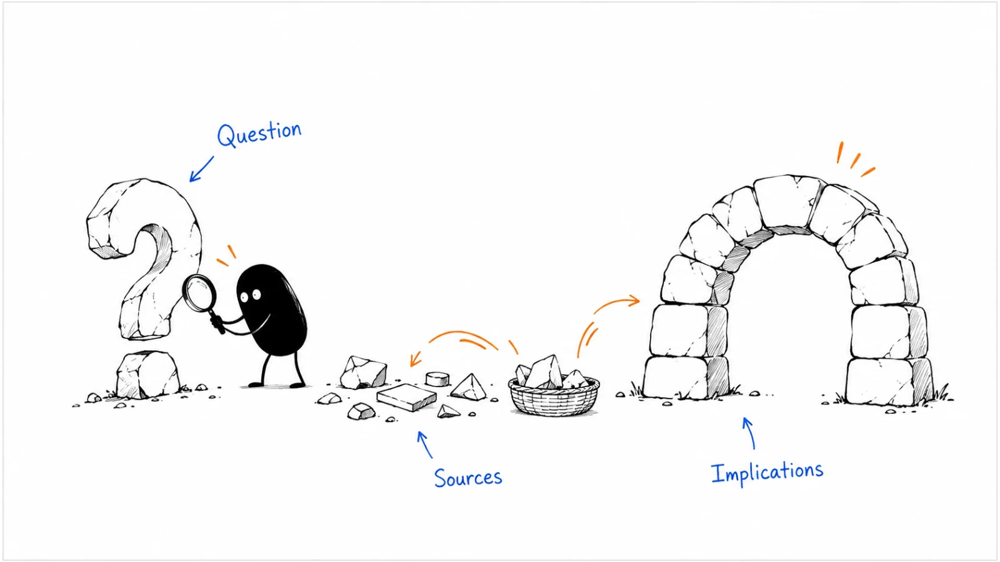

**Last reviewed:** 2026-09-08 · **Reading edit:** 2026-09-08

Someone on the team asks for a white paper. They want something substantial that prospects can share internally.

That is a reasonable request, but it leaves most of the work undefined. What should the reader understand afterward? Which question needs more investigation? What evidence do you have? And why would someone who does not yet trust your company spend time with it?

Putting a long article into a PDF does not answer those questions.

A useful white paper develops an explanation or argument that a reader can inspect. It might explain a technical approach, interpret research, compare ways of working, or help a team evaluate a complicated decision. It can have a commercial purpose without pretending that the publisher has no commercial interest.

The hard part is connecting the argument to evidence, then making that connection easy to follow. The reader should be able to tell what you observed, what other sources reported, what you inferred, and what you recommend.

This chapter covers that whole process: choosing a question, building a research plan, testing the argument, writing and designing the paper, choosing access, and using the finished work. The running example shows how a small team can publish something useful without manufacturing an industry study.



*Reading guide: choose a useful question → investigate it → build the argument → make it readable → publish and learn.*

Start with [the research plan](#step-3-cite-or-cut) if you already have a topic. Read [the worked example](#worked-example-illustrative) to see a proposed claim change as the evidence improves. The copyable records cover [the brief](#copy-white-paper-brief-fill) and [publication review](#before-you-start).

## Use this when

People need a considered explanation that connects several pieces of evidence. They may be evaluating a new operating model, preparing an internal recommendation, comparing technical approaches, or trying to understand a change in their market.

A white paper can also introduce a problem that buyers have not yet named. It is not limited to answering questions that already appear in sales calls. But you should have a reason to believe the question matters, and a way to find out whether your explanation helps.

The format is useful when the material benefits from a sustained argument, definitions, examples, exhibits, and a method note. None of those require a particular page count.

A founder with a small evidence base can write a narrowly scoped technical or analytical paper. A larger team might commission research or analyze a substantial dataset. Choose the promise to match the work you can actually perform.

## Do not use this when

The reader only needs a short answer, a product specification, or a straightforward implementation instruction. Those are worthwhile documents. They do not become more useful because the cover says “white paper.”

If your only material is one customer's experience, a [case study](https://b2-b-playbook.mintlify.app/playbooks/03-brand-story-and-content/case-study) may be the clearest format. You can include a customer example within a broader paper, but that example does not by itself establish an industry-wide conclusion.

If the central claim has already been chosen and nobody is allowed to question it, the research process is in trouble. You can write a clearly labeled product argument, but do not present predetermined advocacy as independent research.

Missing evidence is a reason to narrow, investigate, or postpone a claim. It is not a reason to generate plausible statistics.

You do not need to finish every category or comparison page before starting. Nor is lead generation an inherently invalid objective. The question is whether this paper is a useful response to the current opportunity, and whether the experience offered to readers is honest.

<a id="words-you-will-use"></a>

## A few useful terms

Publishers use these labels differently. Treat the distinctions as a way to set expectations, not as a naming standard enforced across the industry.

| Type of work | What the reader should receive | What needs particular care |
|---|---|---|
| Research report | Findings from a defined investigation | Sampling, measurement, analysis, and limits |
| Technical white paper | A detailed explanation of an approach or system | Assumptions, implementation conditions, and tradeoffs |
| Analytical white paper | A reasoned argument built from evidence and interpretation | The connection between sources and conclusions |
| Buyer's guide | Criteria and questions for evaluating choices | Fair alternatives and disclosed commercial interests |
| Thought-leadership essay | A perspective that helps readers interpret a subject | Separating opinion from factual claims |
| Customer case study | An account of a particular customer's experience | Permission, outcome definitions, and generalization |

A **research question** is what you want to find out. A **working thesis** is the answer you currently think the evidence may support. It should be allowed to change.

A **claim** is a statement readers might reasonably ask you to support. A paper can contain several related claims under a coherent central question.

A **methodology note** explains how evidence was collected and analyzed. A **limitation** tells the reader where the evidence or argument stops.

A **gate** asks the reader to provide information before access. It changes the distribution and trust tradeoff; it does not change the quality of the research.

## Keep this in mind

<a id="one-rule"></a>

Make a promise you can support, and let the reader inspect how you support it.

A paper does not need to be neutral about every approach. It does need to distinguish a supported finding from a recommendation, a model, or a commercial preference.

Your product may be central to a technical paper. Removing its name is therefore not a universal quality test. A better test is whether the document explains something useful about the approach, including conditions under which it would not fit.

Similarly, a short executive summary is not an excuse to hide material qualifications. Someone who reads only the summary should not leave believing a stronger claim than the full paper supports.

Keep the publisher, authors, date, and relevant sponsorship visible. Professional design should make the argument easier to evaluate, not make weak evidence look more authoritative.

<a id="operating-method"></a>

## How to do it

### Step 1: earn the format

Start with a reader and a situation, rather than a title containing “the future of.”

What are they trying to understand or decide? What do they currently believe? Which part of the problem is genuinely difficult? What could a well-researched explanation help them do?

You might be writing for an operations lead considering assistance with a recurring workflow. They are not necessarily asking whether AI is important. They may need to know which work can move to a service without losing responsibility for the final decision.

That is a more workable question than “How AI is transforming operations.”

#### Find a question with enough substance

Look at customer interviews, support discussions, implementation reviews, community questions, and changes in the environment. Sales conversations are one useful input, not the sole source of editorial permission.

Watch for disagreement about definitions. One person may call a workflow automated because a draft appears automatically. Another may reserve the word for a process that requires no human review. A paper that separates those meanings can be useful before it produces any new statistics.

Look for decisions with competing considerations. Reducing active work, shortening elapsed time, maintaining control, handling exceptions, and changing costs may point in different directions. That tension gives you something worth investigating.

Do not turn every broad topic into a white paper. Write down the specific question, the people affected, and what a better answer would change. If the result is still vague, conduct a little exploratory research before promising a publication.

#### Agree on what the paper is allowed to conclude

An editorial brief should include the commercial objective, but it should not prescribe the finding.

“Help relevant teams understand assisted request preparation” leaves room for a useful investigation. “Prove that every team needs our service” does not.

Agree in advance that the paper may find a smaller benefit, a narrower audience, a different mechanism, or a reason not to recommend the approach in some conditions.

All conversations in this chapter are invented teaching dialogue, not statements by Ivan, Lensmor, or an actual customer.

**Founder:** We need a white paper showing that AI eliminates the correction backlog.

**Editor:** Which part of the backlog have we measured?

**Founder:** We have records for preparation. Engineering review and execution are outside those records.

**Editor:** Then we can investigate preparation and explain what else a team must measure. We cannot make the backlog conclusion from that evidence.

The revised scope still has commercial value. It tells a prospective customer what the service does and how to evaluate it, without promising an outcome the team cannot defend.

#### Choose a realistic research route

You do not always need a new survey. A careful synthesis of existing sources can help readers connect ideas that are usually discussed separately. A technical explanation can make an operating method concrete. Interviews can reveal mechanisms and questions that a dashboard misses.

Original data can be valuable when it answers the question and can be analyzed responsibly. Collecting a dataset simply to attach “research” to the title adds work without necessarily adding insight.

For a small team, define the minimum credible scope. That might be a review of a bounded set of sources, an explained model, and a clearly labeled teaching example. It is better to publish a useful analytical paper than to call twelve convenient interviews a representative market study.

Decide who will review the work: a subject specialist for accuracy, someone competent in the method for empirical claims, and a reader who resembles the intended audience. One person can cover more than one role, but distinguish the questions each review should answer.

### Step 2: outline the argument before the design

An outline is a proposed route through the question. It should expose gaps before you invest in a cover, charts, or a launch campaign.

Begin with the question and your working answer. Under that, list the smaller claims the answer depends on. For each claim, identify the evidence needed and what might contradict it.

A paper about assisted preparation might depend on understanding the old workflow, which work the service performs, where human review remains, and how effort is measured. A collection of general AI adoption statistics would not fill those gaps.

#### Build a sequence a reader can follow

A practical sequence is: define the situation, explain the choices, inspect the evidence, work through the implications, and show what the reader could do next.

That sequence can change. A technical audience may need an architecture or definition early. A busy executive may need a short conclusion first, followed by the method and tradeoffs. An unfamiliar audience may need more explanation of the problem.

Use the executive summary to state the question, bounded answer, main evidence, and practical implication. Write it after the body is stable. It is a compact version of the argument, not a promotional teaser that withholds the answer.

Make sections carry distinct work. If three sections all say the environment is changing quickly, combine them and use the space to explain something the reader cannot already infer.

A useful outline also shows where an exhibit belongs. If a table makes the comparison easier, put it next to that comparison. Do not save all the evidence for an appendix that readers must constantly consult to understand the main text.

#### Include the strongest reasonable alternative

Ask what a knowledgeable reader would say against your recommendation.

They might prefer improving the current process, buying a different kind of tool, using a service temporarily, or leaving the workflow alone because its volume does not justify change.

Describe those alternatives in terms their users would recognize. Do not give your approach realistic benefits and give the alternatives only caricatured weaknesses.

Then explain the conditions that matter. An assisted service could reduce one team's workload while increasing combined effort. That may still be attractive if access to capacity is the constraint. It is less compelling if the reader's priority is minimizing total delivery cost.

This is where a white paper can do more than a product page: it helps the reader reason through an actual tradeoff rather than merely recognize a benefit.

#### Make room for a conclusion that changes

Keep the thesis provisional while researching. A useful finding may be that the evidence supports different answers for different circumstances.

That does not require ending every paragraph with “it depends.” Name what it depends on: request volume, exception rate, review burden, implementation effort, decision authority, or another relevant condition.

You can make a clear recommendation within those conditions. Precision is not the same as indecision.

<Accordion title="Does a white paper need original research or a minimum length?">

No universal definition requires a new survey or a fixed number of pages. A sourced analytical paper or a detailed technical explanation can be useful without collecting new data.

Be specific about the work. “An analysis of published evidence” sets a different expectation from “a survey of operations leaders.” A technical paper should explain its approach and assumptions rather than borrowing the authority of a research label.

Length follows the explanation. Include the context, evidence, method, and implications needed to understand the argument. Remove repetition, generic trend introductions, and pages that exist mainly to accommodate a layout.

If the question can be answered clearly in a short article, publish that article. If it takes a longer treatment, give readers summaries, section links, and useful exhibits. Neither the cover nor the word count establishes rigor.

</Accordion>

### Step 3: cite or cut

The useful version of this rule is not “put a link after every sentence.” It is: make material factual claims traceable, and do not keep a claim merely because it sounds plausible.

Create a source record as you work. Capture the author or organization, title, publication or data-collection date, relevant section, URL, what it supports, and what it does not support. Keep direct quotations distinct from your notes.

When a source reports someone else's research, follow the citation to the original where available. If you cannot inspect it, say you are relying on a secondary account or remove the claim. Do not cite the original as though you read it.

A search result or AI summary can help you find a source. It is not a substitute for checking the part that supports your sentence.

#### Match the evidence to the question

| Evidence available | A reasonable use | A conclusion it cannot establish alone |
|---|---|---|
| Interviews with selected operators | Explain experiences, mechanisms, and language | How common an experience is across the whole market |
| Product records from your customers | Describe activity within the recorded population | What noncustomers do or why an outcome occurred |
| A recruited survey | Describe responses under the stated method | A population estimate without a defensible sampling basis |
| A controlled evaluation | Compare outcomes under its tested conditions | Performance in every workflow or deployment |
| Published technical documentation | Explain documented behavior and requirements | Typical customer adoption or business impact |
| An illustrative model | Explore assumptions and tradeoffs | A measured customer result |

A large sample is not a cure for a poorly defined population. Hundreds of responses from your newsletter describe the people who chose to respond through that channel; they are not automatically a cross-section of the industry.

An interview can be strong evidence about how one person understands a process. It is weak evidence for a claim that most companies have the same experience. The issue is fit between evidence and claim, not a simple hierarchy in which numbers always beat conversations.

Your own data deserves the same scrutiny as an external source. State whose activity is included, what your system can observe, what is missing, and whether the data was collected for this question or repurposed afterward.

#### Make the method understandable

For interviews, explain how participants were selected, their relevant roles, the period, and how you identified themes. Separate the number of people from the number of organizations.

For a survey, report who was eligible, recruitment channels, collection dates, exclusions, question wording where needed, and the base for each result. A question answered by only part of the sample needs its own denominator.

For product records, explain the event definitions, units, time window, inclusion rules, missing data, and analysis. “We analyzed usage” is not enough to tell a reader what happened.

For a literature-based paper, explain the scope of the search and selection at a useful level. A focused editorial review is not a systematic review unless it actually follows an appropriate systematic method.

[Stack Overflow's 2025 survey methodology](https://survey.stackoverflow.co/2025/methodology?ref=b2b-playbook) is a useful public example. It states that 49,009 responses from 177 countries were used, gives the May 29–June 23 collection window, and explains recruitment largely through its own channels. It also notes that highly engaged users were more likely to see invitations. The lesson is disclosure, not that this sample represents every developer. The page also identifies a change in how some multi-select percentages were displayed, a reminder to check definitions before comparing years.

A method note does not need to become a statistics textbook. It needs to let a reader understand what the result describes and what questions remain. Bring in a qualified researcher when the design or inference exceeds your team's competence.

#### Check the number behind the headline

Identify the unit first. People, companies, sessions, requests, and answers to a multi-select question are different units.

Then inspect the comparison. Are you comparing the same definition across comparable periods? Are respondents matched or different groups? Did the product, workflow, customer mix, or measurement system change?

Keep observations, estimates, and modeled projections separate. A respondent estimating hours saved is not the same as a timed task study. A model multiplying estimated hours by a salary assumption is not a record of cash savings.

Do not average percentages from different groups without checking what the combined figure means. If one group has ten observations and another has a thousand, a simple mean of their rates gives them equal weight. That may be appropriate for a particular question, but it is not the overall observation-level rate.

Claims of causation require more than a sequence in time. An improvement after adoption may reflect adoption, other changes, selection, or a combination. Say what the study design permits; do not let the headline quietly upgrade it.

#### Read competing evidence before choosing a line

Sources can disagree because they study different populations, ask different questions, measure different outcomes, or examine different versions of a technology.

Build a small comparison note before declaring a contradiction. What exactly was measured? When? Under what conditions? Who participated? Was the outcome self-reported or observed?

If the disagreement remains, explain it. A useful paper can show why the available evidence does not yet settle a question.

**Writer:** These interviews suggest that preparation feels easier. Can we say most operations teams save time?

**Reviewer:** How were the interviewees selected?

**Writer:** They were volunteers from our existing contacts, and we did not time their work.

**Reviewer:** Then report their experiences and the selection method. Use them to improve the next investigation, not to estimate a market-wide time saving.

This does not make the interviews worthless. It gives them an appropriate role in the argument.

#### Keep attribution, permission, and independence separate

A citation identifies a source. It does not automatically grant permission to reproduce a chart, dataset, photograph, or long passage.

Prefer your own explanation of the relevant finding, with a direct citation. If you need to reuse an exhibit, check the applicable terms and obtain permission where required. Do not treat a downloadable report as a library of free design assets.

Likewise, anonymizing a record does not automatically make it appropriate to publish. Combinations of role, dates, volumes, and workflow details may still identify someone. Use approved material and disclose only what is needed for the argument.

State sponsorship and publisher involvement plainly. An external researcher can improve rigor, but an outside logo does not by itself establish independence. Explain who commissioned, conducted, and reviewed the work at a level relevant to the reader.

If an AI tool helps organize research, require it to distinguish sourced notes from proposed wording and missing evidence. Verify every cited passage yourself. Synthetic respondents, generated quotes, and simulated records cannot be passed off as collected research.

### Step 4: make the paper easy to read and access

<a id="step-4-publish-ungated-offer-a-file-not-a-prison"></a>

Write the argument before polishing the layout, but think about reading throughout. A paper can be rigorous and still use ordinary language.

Start with a situation the reader recognizes. Explain the question, why it matters, and what the document covers. Avoid an opening that spends a page announcing unprecedented disruption.

Use concrete subjects and actions. “The reviewer checks whether the request includes the source record” explains more than “stakeholders operationalize a robust validation framework.”

Define specialized terms when they first become necessary. Repeating an acronym does not make an argument more technical.

#### Give different readers a way through

Some readers want the conclusion, some want the method, and some need a particular exhibit for a discussion. Support those paths with a short summary, descriptive headings, section links, and captions that explain what a figure shows.

Do not force the reader to infer the takeaway from a chart. State the observation and its boundary in nearby text. A caption such as “Customer preparation time in two observed windows; provider effort shown separately” is more useful than “Exhibit 3: Efficiency.”

Keep important qualifications beside the claim. Put technical detail in an appendix when it helps, but do not relocate the condition that changes the meaning of the result.

A paper can include several related findings. Use a central question to hold them together instead of repeating a rigid slogan throughout the document.

#### Choose exhibits that explain something

An exhibit should make a relationship easier to understand: a process, a comparison, a distribution, a calculation, or a set of choices.

For a workflow, show who does what and where the handoff occurs. For a quantitative comparison, label units, periods, populations, and sources. For a model, label assumptions and distinguish them from observations.

Use consistent visual conventions. If blue means customer work in one figure, do not use it for provider work in the next. Maintain readable text at the size the reader will actually encounter, including a phone.

Do not use a generated dashboard screenshot to imply that research was conducted. A synthetic example can be excellent teaching material when it is labeled as such. A fake research artifact creates the wrong impression even if a small disclaimer appears elsewhere.

This Playbook uses original topic illustrations for orientation and tables where exact comparison matters. A commercial paper may use more exhibits, but each should earn its place.

#### Treat the reading version as a product

HTML can support search, linking to sections, responsive reading, and updates. A downloadable file can help with forwarding, printing, offline reading, or an internal review packet. You can offer both without making one a worse version of the other.

Keep the title, edition, key claims, and citations consistent across formats. A shortened document should say it is a summary and link to the full edition.

[DORA's 2025 report page](https://dora.dev/research/2025/dora-report/?ref=b2b-playbook) offers a full English report, abridged language versions, and a companion guide. It also exposes links to questions and errata. That is a useful example of organizing a publication as several related reading resources. This chapter reviewed the public page, not the full research dataset or every download; the example does not establish that this packaging caused readership or revenue.

For the web version, use real headings and meaningful structure, not merely text styled to look like headings. [W3C WAI's Page Structure Tutorial](https://www.w3.org/WAI/tutorials/page-structure/?ref=b2b-playbook), updated April 8, 2026, explains how logical headings and page regions help people navigate, including screen-reader and keyboard users.

If you create a PDF, check selectable text, heading structure, reading order, meaningful links, image descriptions, and the actual exported file. Do not assume the design tool's preview guarantees an accessible export. Ask for appropriate accessibility review when needed.

#### Decide what the gate is for

A form is a distribution choice, not a definition of a white paper.

Open access can make it easier for people to read, share, cite, and inspect the argument. A gate can support a deliberate exchange, such as receiving a research package or joining a relevant follow-up program. Either choice has consequences.

Ask what information you need and what the reader receives in return. A company may need contact details to deliver a requested briefing; that does not mean it needs ten qualification fields before someone can inspect a basic explanation.

If you gate the full document, show enough information to make the offer understandable: the question, scope, publisher, date, a useful summary, and what happens after submission. Avoid disguising a short product brochure as a large research report.

Do not equate a download with a sales conversation. Make additional communication expectations clear, and handle data and permissions through your applicable process. This chapter is not a legal guide to consent requirements.

**Marketer:** If we leave the paper open, how will we know who is interested?

**Founder:** We will not identify every reader. What follow-up would actually help them?

**Marketer:** We could offer the measurement worksheet and an optional discussion of their workflow, separately from the article.

**Founder:** Then make those offers clear. Reading the paper should not silently become a request for a sales call.

For this Playbook, an openly readable article fits the current publishing model. That is a context-specific choice, not proof that every gated program is ineffective.

### Step 5: publish it where the question comes up

<a id="step-5-put-it-on-the-map-as-education-not-as-row-1"></a>

Distribution starts with the question the paper answers, not with a list of social networks.

An operations paper might be useful in a relevant community discussion, an implementation guide, a partner conversation, a newsletter, a workshop, or a sales follow-up. Different readers may need different introductions.

Give each introduction a reason to open the document. “Our new white paper is live” describes your publishing activity. “How do you tell whether preparation work disappeared or moved to a service provider?” gives the reader a question to consider.

Do not require sales to be the only distributor. A research paper can build understanding among practitioners, influence how a problem is discussed, or support an ecosystem relationship before a purchase is imminent.

#### Prepare a small, accurate launch package

Start with the full reading page, a short description, a few useful excerpts or exhibits, and a note for people who may share it. Add more formats only when there is a plausible audience and someone can maintain them.

Keep the main qualification attached to each reused finding. An excerpt that drops the population or time window can turn a careful report into an exaggerated social post.

When sharing a chart, include enough context to interpret it outside the paper. Link to the relevant section, not just the homepage. Where reuse is permitted, tell readers how to attribute the work.

Partners may add a different perspective, but agree on the actual role and disclosures. Co-branding should not imply that both organizations independently verified every claim unless they did.

A webinar can examine the argument through questions. A workshop can help participants use the method. Neither needs to become a long product demonstration to justify the paper's commercial purpose.

#### Help internal teams use it appropriately

Give customer-facing teammates a short note: who it is for, which question it answers, the strongest supported finding, what it does not establish, and where the current version lives.

They can personalize the introduction to a reader's situation. They should not personalize the evidence.

If the paper explains evaluation criteria, connect it to a sample workflow, technical documentation, or an appropriate conversation. A demo may be a reasonable next step for someone ready to inspect the product. It is not automatically the right ending for every reader.

Use [content strategy](https://b2-b-playbook.mintlify.app/playbooks/03-brand-story-and-content/content-strategy) to decide the paper's role alongside shorter explanations, product pages, and [case studies](https://b2-b-playbook.mintlify.app/playbooks/03-brand-story-and-content/case-study). There is no fixed rule that education must always come after comparison content.

#### Plan for the second edition

Research and technical explanations age differently. A survey remains a historical account of its collection period. Product behavior may become inaccurate after a release. A recommendation may need review when its assumptions change.

Assign an owner and a review trigger. Keep an edition date and a place for substantive corrections. Do not quietly replace a number in a PDF while leaving older public copies with the same edition label.

When correcting an error, update affected excerpts and tell the people who distribute them. A changed chart can remain in a partner deck long after the web page is fixed.

You do not need to promise an annual report before you know whether you can sustain the work. One careful publication with an honest maintenance plan is enough to start.

<a id="teaching-fill-inventednot-a-customer"></a>

## Worked example (illustrative)

Everything in this example is fictional: the business situation, research notes, dates, records, and draft. It is not a Lensmor report, a customer study, or a market benchmark.

The example continues the assisted request-preparation business used in earlier chapters. The service organizes information and flags gaps for one supported type of record-correction request. Customer engineers approve and execute corrections. The service has no production-write capability and uses substantial human assistance.

In the previous chapter, the team turned a bounded customer account into a case study. Here the task is different: explain how another team could evaluate assisted preparation without confusing customer convenience with total workflow efficiency.

### Start with the question, not the desired headline

The proposed title is “The End of Manual Correction Work.”

It is memorable, but the team does not have evidence for it. The service does not perform the engineering decision or execution, and some preparation work moves to the provider.

The editor proposes a narrower question: **What should a team measure before expanding assisted request preparation?**

The working answer is that the team should separate customer effort, provider effort, elapsed time, review quality, and decision ownership. That answer can support an analytical guide with a model. It cannot support an industry claim about average savings.

The intended reader is an operations lead preparing an evaluation with engineering. The useful outcome is an agreed measurement plan, not immediate agreement to buy the service.

### Inspect the available material

The fictional team has two observation windows, a process description, and internal notes. It does not have a representative industry sample, a controlled experiment, or measurements of the whole correction cycle.

The earlier window covers forty requests from April 6 to May 3, 2026. The later window covers forty requests from June 1 to June 28. The request type and definition of active customer preparation time are consistent, but the requests are different observations and may differ in complexity.

The customer spent four hours on setup in May. That is outside both observation windows.

| Question | Fictional information available | What remains unknown |
|---|---|---|
| Did customer preparation effort differ? | Mean time moved from 30 to 20 minutes per request | How much of the difference was caused by the service |
| Was work transferred to the provider? | Later provider effort averaged 12 minutes per request | Whether that effort would change at a larger scale |
| Were requests complete at first review? | 24 of 40 before; 32 of 40 afterward | Downstream correctness and eventual approval |
| Did the whole correction cycle get shorter? | No complete cycle-time record | Waiting, engineering review, and execution time |
| Was the approach financially worthwhile? | Some effort records, but no complete cost model | Fees, opportunity cost, and value of released capacity |
| Could it work for other request types? | Only one type was observed | Generalization to other workflows |

The table is the beginning of an argument because it separates answerable questions from missing evidence. It is not a device for filling every empty cell with a favorable estimate.

### Work through the calculation

Customer preparation fell from thirty to twenty minutes per request. At forty requests, that is a difference of four hundred minutes, or six hours and forty minutes.

The relative reduction is ten divided by thirty: about 33.3%. It describes customer preparation under the recorded definitions, not the whole correction process.

The provider added twelve minutes per request in the later window: four hundred and eighty minutes, or eight hours. Combined customer and provider preparation therefore totaled 1,280 minutes, compared with 1,200 customer-only minutes in the earlier process.

That is eighty more minutes of combined preparation, about 6.7% above the baseline. Setup effort is additional. Review, waiting, and execution remain unmeasured.

This does not settle whether the service is worthwhile. It changes the question. A team may value releasing customer capacity even if more work is performed elsewhere, but that is a different rationale from reducing total effort.

Now use a clearly labeled planning model. Suppose customer preparation stays at twenty minutes. To get combined preparation below the earlier thirty-minute mean, provider effort would need to be **less than ten minutes per request**, before accounting for setup or other work.

At eight provider minutes, combined preparation would be twenty-eight minutes. Across forty requests, the modeled reduction would be eighty minutes. Recovering four hours of setup effort at that repeated volume would take three such forty-request periods in effort terms: 240 divided by 80.

That scenario is not an observed improvement. It assumes the lower provider effort is achievable, customer effort does not rise, quality is maintained, and volume remains comparable. It is an effort-offset calculation, not financial payback or a guarantee about three calendar months.

The first-review completeness rate also changes: 24/40 is 60%; 32/40 is 80%. That is an increase of twenty percentage points. It does not show that 80% of corrections were approved or correct in production.

A useful paper keeps these distinctions close to the figures instead of putting all the conditions in tiny print.

### A complete short-form illustrative paper

The following is original teaching copy for a miniature analytical paper. A real publication would need authorized evidence and supporting references; the fictional records here are not publishable customer proof.

**Evaluating assisted preparation without losing track of the work**

*An illustrative method note for operations and engineering teams*

**Summary**

Assisted preparation can change who performs the work without removing the work from the process. Before expanding an assisted workflow, separate customer effort, provider effort, elapsed time, and the quality of the handoff. Keep decision authority explicit.

A fictional comparison of two forty-request windows illustrates why this matters. Mean customer preparation time moved from thirty to twenty minutes, while the provider contributed twelve additional minutes per request. The customer did less preparation, but combined preparation effort increased. These observations do not measure the full correction cycle or establish a causal effect.

**The decision**

The operations team wants help preparing a recurring request type. Engineering still needs to decide whether each requested correction is appropriate and to execute approved changes. The evaluation should therefore test preparation assistance without assuming that decision-making has been automated.

Begin by describing the current handoff. What information does the preparer collect? What makes a request ready for review? Who identifies missing items? Who follows up? A product label such as “AI-powered” does not answer these operating questions.

**What to measure**

Record active preparation effort separately for the customer and provider. Include rework under a consistent definition. Also record the start and end points used for elapsed time; active minutes and waiting time answer different questions.

Track whether a request meets an agreed checklist at first review. Do not use that measure as a substitute for approval accuracy or correct execution. If those outcomes matter to the expansion decision, measure them separately.

Keep setup and ongoing work distinct. Setup may be a temporary burden, but excluding it from a per-request chart should not make it disappear from the evaluation.

**Reading the example**

Across the fictional observation windows, customer preparation totaled twenty hours before assistance and thirteen hours and twenty minutes afterward. Provider preparation added eight hours in the later window. The combined total was therefore twenty-one hours and twenty minutes, before setup and unmeasured work.

The comparison supports a description of reduced customer preparation under these definitions. It does not support a claim of lower combined preparation effort, lower total cost, or faster end-to-end corrections.

Different requests were observed in each window. Their complexity may differ, and other changes may have contributed. The figures are an illustration of measurement boundaries, not an estimate of typical performance.

**Practical implication**

Before expansion, agree which outcome matters most and collect the missing records. If the priority is releasing customer capacity, examine what that capacity enables and what the service costs. If the priority is lowering total effort, include provider work and setup. If the priority is cycle time, measure waiting and engineering stages.

A reasonable next step is a bounded evaluation with clear decision ownership and review criteria. The result may support expansion, a narrower scope, a change to the service, or keeping the current process. The measurement plan should leave all four answers possible.

### What makes this a paper rather than a longer case study?

The customer example is not the final conclusion. It is used to explain a measurement method that another team can examine and adapt.

The miniature paper defines the decision, distinguishes measures, interprets an example, states limits, and proposes an investigation. It does not claim that one fictional observation settles an industry question.

A real version could add authorized observations, relevant technical sources, and a fuller method appendix. It should add them because they improve the argument, not because a designer needs more pages.

Its next asset might be a measurement worksheet or a sample prepared request. A [demo](../02-product-marketing/demo.md) becomes useful when the reader wants to inspect how the assistance actually works.

## Copy: white-paper brief (fill)

Use this before commissioning research or writing a polished draft. Keep confidential source records in approved storage, not in a public repository.

```text
WHITE PAPER — QUESTION AND RESEARCH BRIEF

Working title:
Intended reader and situation:
Question the paper should help answer:
What a useful answer would let the reader do:
Commercial objective, stated separately:

SCOPE
Type: analytical / technical / original research / other
Working thesis, open to revision:
Related claims that need support:
Strongest reasonable alternative:
What this paper will not establish:

EVIDENCE
Sources or records already available:
Evidence still needed:
Population, unit, period, and method where relevant:
Selection, missing data, and known limitations:
Facts / observations / estimates / models / recommendations:
Permission, confidentiality, and sponsorship considerations:
Who can review the method and technical accuracy?

PUBLICATION
Proposed outline and useful exhibits:
Summary, full reading version, and optional file:
Access choice and reason:
Reader's next useful action:
Distribution situations and owners:
Review checkpoints and release owner:
```

The existing [white-paper working file](../../templates/white-paper.md) remains available as a shorter brief. Its single-claim and gate-off prompts are planning defaults, not universal requirements. Use the expanded record when the work needs several related claims or a more explicit research plan. Do not overwrite a copy you have already filled in.

<a id="pre-flight-checklist"></a>

## Before you start

Separate the checks made before research, before design, and before publication. A paper can be ready for investigation while still being far from ready for release.

Before research, agree on the question, scope, access to evidence, and the possibility of an unwelcome answer.

Before design, stabilize the claim definitions, source records, calculations, and structure. Changing a denominator after producing ten charts is expensive and easy to get wrong.

Before release, review the complete reading experience, including title, summary, exhibits, captions, file, form, and promotional excerpts.

```text
WHITE PAPER — RELEASE AND MAINTENANCE REVIEW

Title and edition:
Publisher, author, reviewer, and sponsor roles:
Owner of the final source document:

ARGUMENT
Summary matches the full paper:
Each material claim has an appropriate source or label:
Alternative explanations and tradeoffs are represented:
Observed results are separate from models and recommendations:
The conclusion stays within the evidence:

EVIDENCE
Dates, populations, units, and denominators checked:
Calculations independently checked:
Quotes and citations verified against inspected sources:
Method and material limitations visible:
Permissions and confidential details reviewed:

READING
Headings and section links work:
Exhibits have readable labels, sources, and text explanations:
HTML and downloadable versions agree on important claims:
Exported file tested, if offered:
Access and follow-up expectations are clear:
Mobile, keyboard, and copy/share behavior checked:

AFTER RELEASE
Distribution owners and approved excerpts:
Current edition URL:
Correction route:
Review date or trigger:
Locations that need updating when the paper changes:
```

### Give reviewers different jobs

A subject expert should check the explanation and its practical implications. A methods reviewer should check whether the evidence supports the inference. An editor should check whether readers can follow the argument. A publication reviewer should check permissions and the complete release package.

Do not send everyone an undirected request for “thoughts.” Ask concrete questions. Which claim is too strong? Which term is ambiguous? Which chart could be misunderstood outside the paper? What would change your recommendation?

Have a relevant reader explain the summary back to you. If they believe the service executes production changes when it only prepares requests, the writing has failed even if every individual sentence can be defended.

Resolve substantive disagreements in the argument, not by averaging two incompatible claims into a vague sentence. Record unresolved uncertainty where it matters.

<Accordion title="What if we are a small team with no research budget?">

Start with a narrower promise. You can explain a technical method, compare a defined set of approaches, or synthesize public sources without pretending to have a research department.

Keep a simple source register and an outline that connects each important claim to evidence. Ask a knowledgeable person to review the parts outside your expertise. If you cannot evaluate a quantitative claim responsibly, do not build the paper around it.

Use original teaching examples to make reasoning visible, and label them clearly. Never replace missing interviews or observations with synthetic people presented as real participants.

You can publish an initial method note and improve it when better evidence becomes available. Do not promise a recurring industry benchmark merely to make the launch sound bigger. A modest, useful document with clear limits is a credible starting point.

</Accordion>

## Metrics

Measure the job you asked the paper to do, and keep distribution signals separate from research quality.

Downloads can tell you that people obtained a file, within the limits of the measurement. Pageviews can indicate reach. Neither establishes that the paper was read, understood, or used in a decision.

That does not make those signals worthless. It means they belong alongside evidence about audience fit, engagement, comprehension, and use.

### Look for evidence of understanding

Ask readers what they learned, what they would do differently, and what they still need to check. Watch for recurring misinterpretations of the main claim.

A citation is useful when it preserves the meaning and source. A widely repeated but overstated version of your result is not an unqualified success. Clarify the summary or improve the reusable exhibit.

Customer-facing teams can record when the paper helped explain a question and what happened next. That is useful feedback even when there is no immediate opportunity.

A paper may also help internal teams agree on terminology or improve a partner's evaluation process. If those are intended outcomes, include them in the review instead of measuring only lead volume.

### Interpret access and commercial outcomes carefully

If you use a gate, separate submissions, valid contacts, relevant interest, requested follow-up, and qualified opportunities. Do not rename the first number as the last.

If you compare open and gated access, consider the whole path: who sees the offer, who reaches the content, who engages, and what follow-up they actually request. Differences in audience, campaign, or timing can make a simple before/after comparison misleading.

Accounts that receive a paper may already be more interested or further along in evaluation. A higher close rate among those accounts does not by itself show that the paper caused the difference.

Use attribution reports as records under their stated rules, not as a complete explanation of causality. A small program can make sensible editorial decisions from reader feedback and bounded usage data without claiming a precisely measured revenue effect.

### Review the effort as well as the output

Track the work required to research, review, design, publish, distribute, and maintain the paper. A large number of derived assets can create a maintenance burden if the core finding changes.

At the next review, ask whether the question still matters, whether the evidence remains appropriate, whether people can find the document, and whether a shorter or updated resource would now serve them better.

Do not respond to weak readership by immediately commissioning a larger report. The problem may be the question, the introduction, the distribution, or an access barrier.

## Common mistakes

**Choosing the conclusion before the investigation.** A commercial objective can shape the question. It should not forbid an inconvenient answer.

**Using research language for an unexplained content roundup.** Tell readers what work was actually done, including how sources or participants were selected.

**Turning a convenient sample into “the industry.”** State the population and recruitment method. A precise percentage can still have a narrow scope.

**Borrowing credibility through citations that do not support the sentence.** Inspect the relevant passage and preserve its definition, date, and limitations.

**Treating a model as a forecast.** A scenario shows what follows from assumptions. It does not establish that those assumptions will hold.

**Hiding the product's role or the publisher's interest.** A technical or commercial paper can be useful without pretending to be independent of its sponsor.

**Making every exhibit a decorative object.** Show a meaningful comparison, process, or calculation. Use text when it is clearer.

**Removing qualifications from the launch copy.** The title, summary, chart caption, and sales slide need the same evidence boundaries as the body.

**Treating a download as permission for any follow-up.** Explain the exchange and respect the reader's actual request.

**Publishing once and abandoning the evidence.** Keep a current edition, a correction route, and an owner for changes.

## What to read next

Use [content strategy](https://b2-b-playbook.mintlify.app/playbooks/03-brand-story-and-content/content-strategy) to decide where the paper belongs, and [case study](https://b2-b-playbook.mintlify.app/playbooks/03-brand-story-and-content/case-study) when you need to document one customer's experience.

For distribution, continue with [SEO and AEO](../04-channels-and-distribution/seo-and-aeo.md). Use [forms and chat](../07-website-and-conversion/forms-and-chat.md) to design an access or follow-up experience, and [lead nurture](../08-lifecycle-and-customer-marketing/lead-nurture.md) for the communication that follows a genuine expression of interest.

Read [sales enablement](../02-product-marketing/sales-enablement.md) when teammates need help using the paper accurately, or [demo](../02-product-marketing/demo.md) when the next task is to inspect the workflow itself.

## Sources and evidence boundary

This chapter is an owner-maintained editorial synthesis. Its writing process, briefs, dialogues, fictional business, miniature paper, dates, and arithmetic are original teaching material. They are not records of a Lensmor engagement or a real research study.

- [Stack Overflow 2025 survey methodology](https://survey.stackoverflow.co/2025/methodology?ref=b2b-playbook): a public example of disclosing collection dates, recruitment, sample handling, and percentage definitions. The underlying dataset was not reanalyzed here.
- [DORA 2025 report page](https://dora.dev/research/2025/dora-report/?ref=b2b-playbook): a publication-structure example, including full and abridged versions and related resources. This chapter does not claim review of the complete report or a causal connection between its packaging and business results.
- [W3C WAI Page Structure Tutorial](https://www.w3.org/WAI/tutorials/page-structure/?ref=b2b-playbook), updated April 8, 2026: primary guidance supporting the discussion of meaningful web structure and navigation.

Sources were checked on September 8, 2026. No paid research template, source dataset, or third-party chart was reproduced. Guidance on permission and follow-up is an editorial operating process, not legal advice or a claim of accessibility certification.

---

Copyright © 2026 Ivan Xu. All rights reserved. See the [copyright and reuse terms](https://github.com/weilun88313/B2B-Playbook/blob/main/LICENSE).

Canonical source: [github.com/weilun88313/B2B-Playbook](https://github.com/weilun88313/B2B-Playbook)
