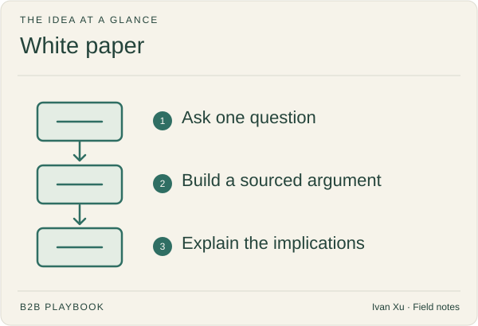

**Last reviewed:** 2026-09-02 · **Reading edit:** 2026-09-06

Use a white paper when a buyer needs a deeper explanation than a short article can provide. Develop one clear argument, support it with sources, and explain the practical implications. Length and a download form do not make the argument stronger.

*Reading guide: ask one question → build a sourced argument → explain the implications.*

## Use this when

- Buyers ask a *why / how should we think* question that a two-screen page cannot hold.
- Sales keeps pasting a founder essay that has no sources and no date.
- You have primary evidence (your data cut, a method, a regulatory change) that is not a single-customer story.

## Do not use this when

- Category, alternative, and comparison URLs are empty. Those are the first rows of [content strategy](content-strategy.md).
- The story is one named customer. That is a [case study](case-study.md).
- The goal is to generate MQLs. [Lead nurture](../08-lifecycle-and-customer-marketing/lead-nurture.md) already refuses that theater.
- You do not have sources. A long opinion is a thought-leadership draft—still planned—not a white paper.

## A few useful terms

| Word | Meaning here |
|---|---|
| **Claim** | One sentence the rest of the paper exists to support |
| **Source** | A dated, checkable citation—or a labeled primary cut you can defend |
| **Length** | As short as the claim allows. Pages are not a virtue |
| **Gate** | An email exchange. Default is off |

## Keep this in mind

**One claim, sources on the page, gate off unless the exchange is worth it.** If the PDF is still useful with the product name removed, it can be a white paper. If it only works as a pitch, it is enablement—put it behind the [demo](../02-product-marketing/demo.md), not a form.

## How to do it

### Step 1: earn the format

Write: *this question cannot be answered on the comparison or category page because ____.* If the because is “we want something that looks serious,” stop. If it is “the champion must take a method to a committee,” continue.

GACCS still applies ([campaign-brief](../../templates/campaign-brief.md)): goal (a perception), audience (the seat), unique take (survives without the logo), channels (who actually sends it), stakeholders (who approves, who ships).

### Step 2: outline the argument before the design

1. The question in their voice
2. The claim (one sentence)
3. The alternative way of thinking they already use
4. Evidence, each labeled fact / observation / assumption
5. What this does *not* prove
6. What to do next (a decision URL, not a calendar)

Numbered exhibits beat stock photography. A methodology note beats a slogan executive summary.

### Step 3: cite or cut

Every non-obvious number needs a source and a date. Your own product telemetry is allowed if you say it is yours and how it was counted. Do not launder a vendor survey as “the industry.” Do not invent a composite customer to fill a sidebar—that is a [case study](case-study.md) violation.

### Step 4: publish ungated; offer a file, not a prison

Default: HTML (or a PDF that is the same document) with no form. A downloadable file can sit *after* the reading, optional. Gate only if sales will use the submit for a real reason—and even then, do not call the fill a meeting. See [lead nurture](../08-lifecycle-and-customer-marketing/lead-nurture.md) and [forms and chat](../07-website-and-conversion/forms-and-chat.md).

### Step 5: put it on the map as education, not as row 1

White papers are later rows in [content strategy](content-strategy.md) unless a live deal is blocked on the method. Sales should finish “I send this when _____.” If they will not, you wrote for the brand blog.

## Worked example (illustrative)

Question: when is a shared inbox no longer enough for a paid queue owner?

| Field | Fill |
|---|---|
| Claim | Queue health becomes a management job when missed SLAs cannot be reconstructed after a weekend |
| Not a claim | “Our platform is the future of support” |
| Sources | Public ops write-ups + a dated, anonymized cut of ticket age (labeled ours) |
| Will not include | A fake composite “Acme” |
| Gate | Off. Optional PDF at the end |
| Next step | [Comparison page](../07-website-and-conversion/comparison-page.md) |

## Copy: white-paper brief (fill)

- Question (their voice):
- One claim:
- Why a page is not enough:
- Sources we already have / still missing:
- What this will not prove:
- Gate (default no):
- Map row and when sales sends it:
- Next URL:

Working file: [white-paper.md](../../templates/white-paper.md).

## Before you start

- [ ] Decision-page rows 1–3 exist or this paper is not the quarter’s first asset.
- [ ] One claim; product name can be removed and the argument still stands.
- [ ] Sources dated; no invented customers.
- [ ] “What this does not prove” is on the page.
- [ ] Ungated unless a written exchange reason exists.
- [ ] Sales will send it in a named situation.

## Metrics

| Metric | Diagnostic use |
|---|---|
| Sales forwards | Times the URL or PDF is pasted into an evaluation thread |
| Citation / reuse | Third parties or champions quoting the claim with the source |
| Gate junk | Fills that sales correctly refused (if you gated) |

Do not treat downloads, form-fills, or page count as success.

## Common mistakes

- Gating to manufacture MQLs.
- 40 pages of product.
- Unsourced industry numbers.
- Leading the map with a paper while comparison is empty.
- Calling a blog post a white paper.

## What to read next

The map is [content strategy](content-strategy.md). A named instance of the result is a [case study](case-study.md). How the file is found is [SEO and AEO](../04-channels-and-distribution/seo-and-aeo.md). If you gated, the form rules are [forms and chat](../07-website-and-conversion/forms-and-chat.md). Thought leadership as a repeating idea is still planned.

## Sources and evidence boundary

This is an owner-maintained operating synthesis. One-claim / sourced / ungated-default follows [content strategy](content-strategy.md) (GACCS, decide-then-educate) and Refine Labs–shaped resistance to gated MQL theater. Classic B2B “white paper as lead magnet” galleries are the **anti-pattern**. This page does not reproduce a paid research house’s template.

---

Copyright © 2026 Ivan Xu. All rights reserved. See the [copyright and reuse terms](../../LICENSE).

Canonical source: [github.com/weilun88313/B2B-Playbook](https://github.com/weilun88313/B2B-Playbook)
