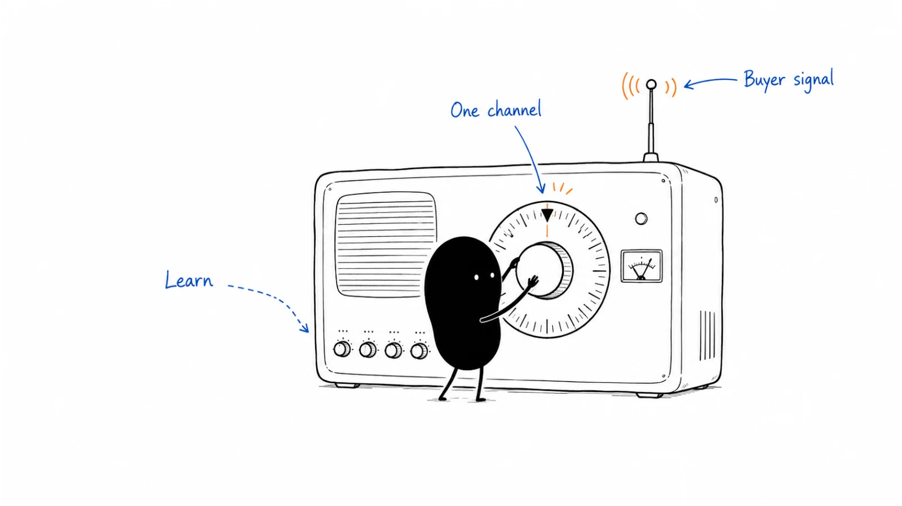

# 04 · Channels & distribution

Pick channels based on how your buyers learn and buy, and on what your team can run well. These guides cover search, LinkedIn, communities, creators, paid media, and launches.

**Status:** Domain guide published · 9 tactic playbooks published

**Last reviewed:** 2026-09-06

## Start here

- [Channel strategy](channel-strategy.md) — where customers come from.
- [LinkedIn organic](linkedin-organic.md) — share a real observation.
- [SEO and AEO](seo-and-aeo.md) — find real buyer questions.

## Playbook map

| Guide | What it helps you do |
|---|---|
| [Channel strategy](channel-strategy.md) | Which growth motion is primary, and which one channel is worth adding next? |
| [SEO and AEO](seo-and-aeo.md) | How should useful content become discoverable through search and answer engines? |
| [Community](community.md) | How do we participate in existing groups or host a useful, sustainable community? |
| [Creator partnership](creator-partnership.md) | How do we choose, scope, publish, and evaluate a useful creator collaboration? |
| [Product Hunt](product-hunt.md) | How do we prepare, run, and evaluate a launch beyond the leaderboard? |
| [Content syndication](content-syndication.md) | How do we arrange useful republication or a paid content program, then evaluate what follows? |
| [LinkedIn organic](linkedin-organic.md) | How do we turn real work into useful posts, relevant conversations, and measurable learning? |
| [Paid media](paid-media.md) | How do we choose, launch, and evaluate a paid test without confusing cheap actions with valuable customers? |
| [Review sites](review-sites.md) | How do we invite honest reviews, respond usefully, and evaluate evidence rights and paid services? |

## Coming later

These topics are on the writing list. There is no article to open yet.

| Planned topic | Question to cover |
|---|---|
| Paid search | Query, bidding, and search-specific execution. The shared decision process lives in [paid media](paid-media.md). |
| Paid social | Audience, creative, and social-specific execution. The shared decision process lives in [paid media](paid-media.md). |
| Retargeting | Follow-on frequency and exclusions. The job decision lives in [paid media](paid-media.md). |
| PR and media | Which genuinely newsworthy story can earn credible third-party attention? |
| Content distribution | How should each important owned asset reach the audiences it was built for? Syndication gates live in [content syndication](content-syndication.md). |
| Content repurposing | How should one strong idea become channel-native formats without losing meaning? |

## Where to go next

Pick a guide above for the task you are working on, or browse [Outbound & prospecting](../05-outbound-and-prospecting/) for a related part of the work.

[Back to the playbook index](../README.md)

---

Copyright © 2026 Ivan Xu. All rights reserved. See the [copyright and reuse terms](../../LICENSE).

Canonical source: [github.com/weilun88313/B2B-Playbook](https://github.com/weilun88313/B2B-Playbook)
