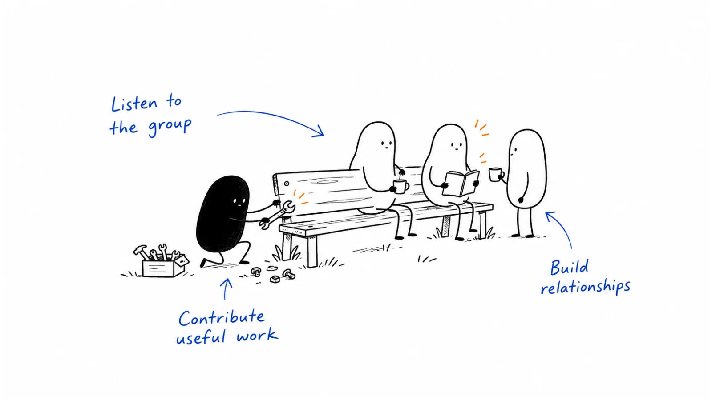

**Last reviewed:** 2026-09-08 · **Reading edit:** 2026-09-08

The group has a name, a logo, and a welcome message. A few people introduce themselves. The founder shares an article, someone reacts with an emoji, and then the conversation stops.

“What should we post to make it more active?”

Maybe nothing yet. The more useful question may be why those people would want to spend time with one another.

A community is not simply another place to distribute your content. People need a reason to return, a way to contribute without feeling exposed, and some confidence that the space will not become a sales list. The company hosting it also needs a reason to keep doing the work.

That balance is possible. A B2B community can help people learn a profession, use a product, solve recurring problems, find collaborators, and develop relationships. Those activities may support a business, but they do not all turn into introductions or sales opportunities.

This chapter covers two routes: participating in an existing community and building a community you help operate. You will work through the member promise, the first useful exchange, recurring programs, moderation, business connections, and measurement. The running example follows a small practitioner group through its first month without pretending that a month proves long-term success.

*Reading guide: find a shared need → choose where to participate → create useful exchanges → protect the experience → learn what is worth continuing.*

For an existing group, start with [where buyers already learn](#step-1-find-where-buyers-already-learn). For your own, jump to [the member promise](#write-the-member-promise-before-opening-the-space). If activity has faded, read [the quiet-community diagnosis](#when-the-community-goes-quiet). The [worked example](#worked-example-illustrative) shows the choices and numbers together.

## Use this when

People in your market benefit from learning with others who face related situations. They may want practical feedback, implementation help, local connections, professional development, or a place to compare approaches.

You can contribute relevant experience, organize useful encounters, or support people who already do that work. You do not have to be the most experienced person in the group. A thoughtful host can make other people's knowledge easier to exchange.

For a product company, a community may help users learn from one another. For a new category, it may help practitioners develop a shared vocabulary. For a founder, participation in an existing group may be a better first step than creating another destination.

Neither a high contract value nor ten existing customers is a universal entry requirement. What matters is the proposed member value, access to the relevant people, and the capacity to participate responsibly.

## Do not use this when

You need a predictable batch of qualified leads immediately. A community might eventually contribute to acquisition, but it should not be sold internally as an instant replacement for a working sales process.

You only want to broadcast announcements. A newsletter, documentation site, event series, or social account may serve that job more honestly. Those formats can later support a community, but they do not need to be renamed to sound more strategic.

You cannot provide moderation or a responsible point of contact. Opening a space creates expectations even when access is free.

You plan to collect member profiles for unsolicited outreach. Access to a discussion is not blanket permission to export its participants, contact them elsewhere, or republish their remarks.

If the useful interaction is a one-off workshop, run the workshop. You can ask afterward whether people want an ongoing connection. Do not require a permanent group to justify an event that already has a clear purpose.

## A few useful terms

A **community** here is a group whose members can develop repeated relationships and exchanges around a shared interest, practice, place, or product. There is no minimum size that automatically makes it one.

An **audience** primarily receives from a publisher. Community members can also learn from and contribute to one another. Many businesses have both, and the boundary can be gradual.

A **member promise** explains what someone can reasonably expect by participating. “Meet great people” is a starting sentiment, not yet a specific promise.

A **host** creates conditions for useful interaction. A **moderator** helps uphold the group's rules and handles problems. One person may do both, but the responsibilities are different.

**Activation** needs a local definition: the first meaningful action or experience you can reasonably observe. Joining a workspace is registration, not proof of receiving value.

A **cohort** is a defined group observed over time, such as members who joined in the same month. Comparing cohorts can be more informative than dividing this month's activity by everyone who has ever registered.

An **endorsement** is a person's actual recommendation. Membership, attendance, a sponsor logo, or permission to post does not by itself establish one.

## Keep this in mind

Write down what members should get and what the business hopes to learn or achieve. Keep both visible, but do not confuse them.

A member might want help preparing a difficult handoff. The company might hope to understand that workflow and become a credible option for future assistance. Those interests can coexist.

The relationship becomes misleading when a supposedly peer-led discussion is actually a disguised qualification call, or when a useful question triggers messages from several salespeople.

You can be openly commercial. A customer community can discuss your product. A sponsored event can identify its sponsor. A paid membership can charge for a clearly described experience. The test is whether the interaction matches what people were told to expect.

Also distinguish ownership from control. You may own the domain and pay for the platform. You do not own the members' relationships, opinions, or attention.

## How to do it

### Step 1: Find where buyers already learn

Ask people where they go when they need help with the work, not only which social platforms they use.

A person may read a public forum, ask a former colleague, attend a local association meeting, and follow a specialist newsletter. “They are on LinkedIn” does not explain which relationships or discussions they actually trust.

Look for evidence of a shared practice: repeated questions, useful replies, work people show one another, and reasons to return. A large membership count does not tell you whether your intended participants are active there.

#### Choose between participating and hosting

Participating lets you learn the existing norms and contribute without taking responsibility for the whole environment. Hosting lets you shape the experience, but adds recruitment, onboarding, moderation, programming, and continuity.

These are not mutually exclusive. You can contribute to an existing profession-wide group while running a small product-user circle. Explain the distinction and do not recruit from someone else's space in ways its rules prohibit.

Use the member's job to choose a starting format:

| Starting point | Member value | Work you must be ready to do |
|---|---|---|
| Existing practitioner group | Learn and exchange experience with established peers | Follow local norms and contribute consistently |
| Hosted community of practice | Improve at a recurring kind of work | Recruit relevant members and facilitate peer exchange |
| Product-user community | Learn implementation patterns and help others use a product | Connect discussion with documentation and official support |
| Time-limited learning cohort | Work through a defined learning goal together | Provide a beginning, progression, and clear ending |
| Local chapter or recurring meetup | Build relationships through repeated encounters | Organize accessible gatherings and continuity between them |

This chapter gives the foundations common to these routes. Detailed customer-lifecycle programs may need additional work on onboarding, support, and advocacy; a general practitioner group should not quietly become a customer-only program.

#### Learn the rules before offering a contribution

Read the host's guidelines, observe appropriate public discussions, and understand how newcomers ask questions. In a private group, participate only through the access you have been given.

Check how the group handles vendor affiliation, links, events, recruiting, research requests, and direct messages. Your own definition of “helpful content” may not match the host's rules.

For example, dbt's published community expectations require permission before direct messaging members, including on other platforms. They also specify vendor disclosure and designated places for promotional material. These are concrete rules for that community, not a universal waiting period or posting policy to apply everywhere. Read the [dbt community expectations](https://www.getdbt.com/community/rules-and-expectations?ref=b2b-playbook) before participating there.

If an activity is ambiguous, ask the host with enough detail for a decision: the subject, the proposed format, who benefits, whether there is a commercial link, and what follow-up you intend.

Do not ask for a vague permission to “add value” and then substitute a product launch.

#### Assess fit without turning members into a database

You can learn that a forum attracts implementation specialists by reading its public description and discussions. You do not need to build a personal dossier on every participant.

Record relevant observations at an appropriate level: common jobs, recurring questions, geography or language when relevant, and participation formats. If you cannot estimate the audience composition credibly, write that it is unknown.

Job titles are imperfect evidence. A senior executive may be there to help junior practitioners, and a student may make an excellent contribution while having no buying authority. Whether they belong depends on the community's purpose, not just your sales definition.

For your own group, explain admission criteria in terms members can understand. “People responsible for preparing operational requests” is clearer than “high-value ICP accounts.” Decide whether beginners, consultants, vendors, and adjacent roles can participate, and why.

If you exclude a role, be honest about the reason. Do not imply that someone lacks professional value because they are outside the format you are organizing.

#### Make the choice explicit

Here is an invented planning conversation.

**Founder:** “Should we launch a community for everyone interested in better operations?”

**Host:** “That's a very broad promise. The people we've spoken with mostly want help with incomplete requests and difficult handoffs.”

**Founder:** “Could we start with a monthly working session for them, even if they don't use our service?”

**Host:** “Yes. Let's test whether they want to exchange methods with each other. We can keep participating in broader groups instead of trying to replace them.”

The choice is not “small is always better.” It is that a clear first purpose makes recruitment and programming easier to evaluate. A broad community can work, but it needs a credible reason for different people to connect.

### Step 2: Choose one useful contribution

In an existing community, start with a contribution that fits a real discussion. It could be a considered reply, an editable example, a short demonstration permitted by the host, or a session helping people work through a problem.

A useful reply does not have to become a standalone asset. Sometimes the best contribution is asking a clarifying question that makes another person's answer possible.

Explain what you know, what you have not tested, and any commercial relationship. If someone has already given a good answer, you can improve or acknowledge it rather than repeating it under your own name.

#### Design the exchange, not just the content

“Share a template” describes an upload. “Help members identify which missing field causes their requests to come back” describes an interaction.

For the latter, you could bring a fictional request, ask members what they would need before reviewing it, compare their answers, and leave them with a revised checklist. People contribute their judgment rather than simply receiving your document.

Choose the format around the work:

- An office hour suits questions that benefit from live clarification.
- A working clinic suits a concrete artifact that can be reviewed safely.
- A discussion thread suits a question people can consider asynchronously.
- A roundtable suits multiple perspectives, especially when there is no single right answer.
- A short learning cohort suits a task that improves through practice and feedback.

There is no mandatory participant count for any of these. A format requiring everyone to speak must fit the available time. A large question-and-answer session needs a different facilitation plan from a small working clinic.

#### Write the member promise before opening the space

For a hosted group, write a short description covering four things: who it is for, what people do together, what the host provides, and what the group is not.

A possible promise for the fictional request-preparation business is:

“A working group for people who prepare and review recurring operational requests. We compare handoff methods, review fictional or safely anonymized examples, and improve reusable checklists. The host organizes two working sessions during the first month and keeps a shared resource index. The group is not an emergency-support channel, and joining does not enroll you in sales outreach.”

That is a limited promise a small team can test. It does not require claiming to be the leading community in the industry.

Show the sponsor or operating company in the description. If the program is a pilot, say how long it lasts and when members will hear what happens next. A time-limited promise is better than implying indefinite support you have not resourced.

#### Invite a founding group you can actually support

Start with people for whom the problem is relevant and with whom an invitation is appropriate. That may include existing contacts, customers, event participants who opted into follow-up, or people referred with permission.

Do not treat the member list of another community as your invitation list. Ask its host about an announcement or collaboration if that is the route you want to use.

Personalize the reason to join, not a compliment generated from a profile. Mention the shared problem, the first activity, the expected commitment, and the commercial context.

An invitation can be simple: “You mentioned that requests often arrive without an approver. I'm organizing a small session to compare how teams handle that. It's hosted by our company, but it isn't a demo. Would you like the details?”

If the person declines or does not respond, respect that. A community invitation does not need an automated persistence sequence.

Before the first session, make sure the group includes people willing to ask questions as well as people able to share experience. Avoid recruiting only speakers and assuming an audience will appear.

#### Make the first visit understandable

A new member should be able to answer three questions quickly: what happens here, where should I go, and what is a comfortable first action?

Provide a short welcome page, the current activity, the relevant rules, and a named contact. Offer a concrete first action: choose a question for the next clinic, look at an annotated example, or ask for help using a small question template.

Do not require someone to disclose their employer's problems publicly as the price of entry. Introductions can be optional or lightweight. A member may want to observe before contributing.

Check the experience from a new account or an appropriate test view. Can a newcomer see the promised material? Are old links broken? Do default notifications overwhelm them? Is the welcome message pointing to an event that already happened?

The first response also matters. A new person asking a reasonable question should not be met with silence while established members receive immediate attention. Set a host review routine that fits your capacity.

#### Start with fewer places to get lost

Choose the platform after the interaction, not before it.

Live discussion, searchable questions, persistent resources, and private reporting have different needs. Evaluate the platform's actual access controls, moderation tools, search, export, notification settings, accessibility, and cost for your intended use. Check current plan limits before committing.

For a small pilot, you might need only a place for questions, a calendar or event link, a resource index, and a private way to contact the host. You may not need a new chat workspace at all.

As the group grows, add structure around repeated needs. Do not create twenty empty channels because a large community has them.

dbt's Developer Hub announcement, last edited June 3, 2024, described bringing community entry points, forum discussions, and events closer to documentation. It is a useful example of making participation easier to navigate, not proof that every small group needs the same architecture. See the [Developer Hub account](https://www.getdbt.com/blog/introducing-dbt-developer-hub-community-home-base?ref=b2b-playbook).

#### Give useful exchanges a way to continue

After a session, summarize the practical question, the alternatives discussed, and any open work. Ask permission before including identifiable contributions or material that was not intended for redistribution.

A summary can say, “We discussed three ways to identify the approver before a request reaches engineering,” without publishing who admitted their current process fails.

Make the next action clear and modest. Someone might try the checklist, bring an example next time, or add a missing condition to the resource. Do not assign unpaid follow-up work to volunteers without agreement.

If nobody wants another session, find out why. The topic may have been resolved, the timing may be wrong, or the format may not justify a return. You have learned something useful even if the correct next step is not a permanent community.

### Step 3: Protect the member experience

The rules should describe behavior people can recognize, and someone must be available to apply them.

“Be nice” leaves too much unresolved. Explain how the group handles harassment, repeated unwanted contact, promotional posts, confidential material, attribution, and disagreements. Identify a private reporting route and what a reporter can expect next.

A short, usable policy is preferable to copying a long code of conduct that nobody is prepared to enforce.

#### Make moderation part of the operating work

Moderation is not limited to removing spam. It includes helping newcomers participate, keeping conversations understandable, recognizing useful help, and managing conflict without turning it into entertainment.

Discourse's introductory moderation guide treats welcoming members, encouraging helpful contributors, and communication among moderators as part of the role. Its page shows a June 27, 2026 edit. Use the [moderation guide](https://meta.discourse.org/t/discourse-moderation-guide-part-1-getting-started/63116?ref=b2b-playbook) as one operational reference, not as a substitute for your own policy or your platform's current controls.

Separate ordinary disagreement from harmful behavior. A member can criticize the sponsor's product without violating the rules. A polite tone does not make repeated unwanted sales messages acceptable.

Choose a response proportionate to the situation. A misplaced link may need a reminder or move. Harassment, threats, or exposed credentials may require immediate restriction and escalation. You do not need to issue a sequence of warnings before responding to a serious incident.

For contested decisions, document the reason privately and provide a review path where practical. If the complaint concerns the main host, identify another person who can receive it. A policy that requires reporting misconduct only to the person accused is not a useful safeguard.

#### Set expectations for contact and promotion

Tell members whether unsolicited commercial messages are permitted. Make the rule apply to the host's company as well as external vendors.

If a member asks for vendor suggestions, decide where and how vendors can respond. If there is a promotional channel, describe what belongs there and how often people may use it.

Do not let payment silently buy an exemption. A sponsor should not be able to contact everyone merely because it funded refreshments.

An introduction should have consent on both sides. Ask the receiving person whether they want the connection, and agree on the context that can be shared. A host's willingness to introduce two people is not permission to circulate a private thread.

Here is an invented exchange about that boundary.

**Sales lead:** “Three members asked about the checklist. Can I message all three about our service?”

**Host:** “They asked for the checklist, not a sales call. I'll provide it in the place they requested. If someone asks about the service, we can offer a separate conversation.”

**Sales lead:** “What about the member who specifically requested an introduction to us?”

**Host:** “Confirm what they want to discuss and who can receive their details. Then make that introduction without forwarding the rest of the private discussion.”

#### Treat confidentiality as a design problem

A private workspace reduces the audience; it does not guarantee secrecy.

Before a clinic or discussion, explain whether it is recorded, who can access materials, and what may be summarized afterward. If people need a non-recorded conversation, do not enable recording or an AI note-taker by default.

Use fictional or properly sanitized examples whenever possible. Removing a company name may not be enough if screenshots still contain customer identifiers, internal URLs, account details, or recognizable circumstances.

The person sharing a document may not have authority to publish everything inside it. Encourage them to check before presenting, and provide a way to withdraw material from the activity.

Do not promise a legally protected confidential environment merely by naming a meeting rule. Where genuine contractual confidentiality is required, use an appropriate agreement and qualified review rather than relying on a welcome slide.

<Accordion title="A member posts a private customer screenshot. What should the host do?">

Limit further exposure using the moderation controls you are authorized to use. Do not quote the screenshot in a public reply or copy it into a widely accessible incident document.

Contact the member privately, explain the concern, and ask for a safe replacement if the discussion can continue. If credentials or sensitive account information are exposed, involve the responsible security or account owner through the established route.

Keep only the incident information needed for review, with appropriate access. Check whether copies were included in a recording, recap, notification, or connected service, and involve the relevant owners rather than assuming deletion of the original removes everything.

Give the group a general reminder if useful, without repeating the private details. The purpose is to contain the problem and improve the process, not embarrass the person who posted it.

This is an operating response, not a complete incident-response or legal procedure.

</Accordion>

#### Recognize contributors without creating an unpaid support desk

Thank people for specific help. Ask before highlighting their work publicly, and preserve the credit they prefer.

As some members become regular contributors, offer bounded ways to help: welcome a new cohort, host one session, review a resource, or moderate a particular area. Explain the commitment, permissions, support, and how to stop.

Do not make the most helpful member the default responder to every unanswered question. Repeatedly tagging the same person can turn voluntary participation into an obligation.

If a role becomes essential, substantial, and recurring, budget for it rather than relying on enthusiasm indefinitely. Paid facilitation, honoraria, or other compensation can be appropriate; make the arrangement clear.

Recognition should not depend only on post volume. Good judgment, careful answers, welcoming behavior, and quiet organizational work may matter more than being the most visible person.

#### Use AI to assist the host, not impersonate members

AI can help draft a schedule, organize approved resources, or suggest a summary for review. It can also make a group feel busy without making it useful.

Do not create fictional members, invented conversations, or automated praise presented as human participation. A question from the host is acceptable; pretending it came from a customer is not.

Before sending private discussions to an AI service, establish the relevant permissions and handling rules. A public article, an internal moderator report, and a private member conversation should not be treated as interchangeable input.

If a bot answers questions, label it, identify its sources where possible, and provide a way to reach a person. Do not let an automated answer claim that an issue is solved when the member has not confirmed it.

Use human review for consequential moderation decisions and sensitive situations. Automated flags can help triage, but sarcasm, disagreement, and context can be difficult to interpret. Give people a way to challenge mistakes.

### Step 4: Connect the community to the business honestly

A community can have several business effects. Choose which ones justify your involvement instead of requiring every activity to produce a meeting.

Learning may improve documentation. Peer help may support adoption. Relationships may lead to collaboration. A useful public discussion may make the company easier to discover. A member may eventually request a commercial conversation.

These outcomes need different processes and different evidence.

#### Keep support and peer help distinct

If the group discusses your product, explain which questions belong in the community and which require official support.

A billing problem, urgent outage, or private account issue should have a clear destination. Do not make a paying customer expose details publicly or wait for a volunteer to receive support they are entitled to elsewhere.

In the community, acknowledge a question even if the answer requires investigation. State what is known, ask for safe clarification, or point to an appropriate existing resource.

GitLab's forum workflow explicitly allows clarifying questions as useful replies and describes cooperation between staff and volunteer contributors. It also asks staff to review AI-generated material before publishing. This is a concrete example of a supported response process, not evidence that community replies replace official support. See the [GitLab forum workflow](https://handbook.gitlab.com/handbook/marketing/developer-relations/workflows-tools/forum/?ref=b2b-playbook).

Track unanswered requests as work to review. Distinguish a first acknowledgment, a substantive response, and a confirmed useful answer. They are not the same service event.

#### Turn feedback into a visible loop

When a recurring problem appears, collect the context needed to understand it, not just the requested feature.

What was the person trying to do? What stopped them? What workaround do they use? How often does it happen? Ask permission before moving identifiable material into another system or involving another team.

Bring an appropriately scoped summary to product or documentation owners. Then tell the group what happened: investigated, documented, planned, declined, or still unresolved.

Do not promise a roadmap item to make a discussion end pleasantly. A clear explanation that something is outside the current scope is more useful than a vague commitment nobody owns.

Remember that active members are a selected group. Their feedback can be valuable without representing every customer or the whole market. Compare it with other evidence before making broad product decisions.

#### Make commercial follow-up an actual choice

When a person asks about your product, offer a next step appropriate to the request: a documentation page, an answer in the thread, or a separate conversation.

Keep that choice separate from membership. Someone should not have to agree to a sales sequence to receive the resource promised by the community.

If an introduction becomes a real opportunity, record the relevant context in your normal sales process. Do not automatically create lead records for everyone who joined or attended.

A community-related opportunity needs a clear definition. Did the person first discover you there? Did the group help an existing evaluation? Did a member make an introduction? Those are different relationships to the deal.

It is reasonable to report an observed introduction or a person's stated influence. It is not reasonable to attribute every member's company's revenue to the community.

#### Use stories and public content with permission

A useful discussion can suggest a public article, but the conversation itself is not automatically available for publication.

Ask for permission to use quotes, names, examples, and screenshots. Agree on attribution and review where appropriate. Do not label the whole community a customer because one member tried your service.

You can write a general explanation inspired by a recurring question without exposing the original participants. Distinguish that synthesis from a reported customer case.

If the content includes an actual commercial result, apply the standards in [case study](../03-brand-story-and-content/case-study.md): define the result, preserve relevant conditions, verify the source, and get the appropriate approval.

The community should not become a research panel or content-production team without members choosing those roles.

### Step 5: Build a rhythm you can sustain

A calendar can help people know what to expect. It should not require the host to manufacture discussion every day.

Start with one or two repeatable activities that have a clear job. A monthly clinic plus an asynchronous question thread may be enough. A technical forum may need frequent response coverage instead of scheduled social prompts.

Choose the rhythm with members' work schedules in mind. Consider time zones, language, accessibility, and whether a live meeting is actually necessary. Offer a useful asynchronous route when the material allows it.

#### Give each activity a beginning and an ending

For a working session, tell people the question, any preparation, and what can safely be shared. Open by restating the purpose and relevant boundaries.

Bring people into the conversation deliberately. Ask for different approaches, give quieter members room to contribute, and avoid turning the session into an extended exchange between the host and one expert.

Close with what became clearer, what remains unresolved, and the next step. Do not require a neat consensus if the discussion revealed legitimate differences.

Afterward, complete the promised follow-up. A short, accurate resource delivered reliably can matter more than an ambitious recap that never appears.

#### Plan the host's week, not only the member calendar

A solo host needs protected time for welcoming people, checking unanswered questions, preparing activities, moderation, and updating resources.

Write those responsibilities beside other work. If the plan assumes spare time that never exists, reduce the promise before inviting more members.

Have a backup for essential issues. That person does not need to run the whole program, but should know how to receive a serious report or update members if the host is unavailable.

Track effort honestly. A one-hour session might require several hours of preparation and follow-up. Platform fees are only part of the cost. If members help facilitate, distinguish their time from the company's paid work.

Do not turn a rough time estimate into a precise return-on-investment claim. First use it to decide whether the operation is sustainable.

#### When the community goes quiet

Silence can mean several things. People may be receiving value by reading. They may only need the group during particular projects. The topic may be too broad, the first action unclear, the responses unhelpful, or the environment uncomfortable.

Inspect the experience before increasing the posting frequency.

Did new members receive a useful welcome? Were questions answered? Are discussions dominated by promotional links or a small inner circle? Did the event move to a time most people cannot attend? Did members say the problem was solved?

Ask a few members directly, using a contact route they have accepted. Keep the question open: “What, if anything, has been useful here? What makes it difficult to participate?” Do not demand that quiet members explain themselves.

A view or a digest click can indicate exposure, where measured appropriately. Neither proves learning. A short voluntary note about how someone used the material can add context, without making every reader complete a survey.

<Accordion title="There are members, but nobody answers the host's prompts">

Look at the prompt itself. “Any thoughts on operations?” asks people to invent both the topic and the contribution. A bounded question with a safe example is easier to respond to.

Then inspect the social risk. Would answering expose a mistake at work, invite a sales message, or require expertise a newcomer does not yet have? Offer an alternative such as a fictional example, a private question for the host, or an anonymous submission process with clearly explained limits.

Check whether people want the format. If they value a monthly clinic but ignore daily chat, the clinic may be the community's useful center.

Try one specific change and review the response. Do not solve silence by adding bots that impersonate interested members, repeatedly tagging everyone, or removing people solely for reading quietly.

If the need is better served by a resource library or occasional event, make that change openly.

</Accordion>

#### Evaluate sponsorship on its actual terms

Paid participation is not inherently a failure of community strategy. A relevant sponsor may help fund a useful program, and a company may legitimately buy clearly labeled access to an audience.

You do not need to earn an introduction before you are allowed to consider sponsorship. You do need to understand what you are buying and what members have been promised.

Separate the deliverables: an advertisement, a workshop, a venue contribution, an exhibit, or an opt-in follow-up opportunity. A logo placement is not a peer recommendation. Attendance is not consent to a contact-list sale.

Ask how promotion is labeled, who controls the content, what data is shared, and what follow-up is allowed. Assess the cost against the specific purpose and agree on a review point.

For your own community, make sure a sponsor's role does not remove the host's ability to enforce the rules. If members believe criticism of a sponsor is forbidden, the group's value may change.

#### Grow the responsibility along with the membership

When activity grows, the work may become more specialized. A host can no longer personally welcome every person, answer every thread, and review every report.

Look for repeated needs before adding channels or leadership titles. Create bounded roles, train people, give them appropriate access, and make escalation clear. Remove access when a role ends.

Keep checking whether experienced members and newcomers can still meet each other. A large resource archive can be useful, but a newcomer may need a short path through it rather than another index containing everything.

If you pause or close the community, communicate the date, the reason at an appropriate level, what will happen to material, and where people can go next. Preserve contributions only within the permissions and commitments that apply. Do not surprise members by making a previously private archive public.

A graceful ending is sometimes the responsible outcome of a pilot.

## Worked example (illustrative)

This example is entirely fictional. It is not a Lensmor community, customer result, or observed growth experiment.

The business helps operations teams prepare one supported type of correction request. The service uses substantial human assistance. Customer engineers still approve and execute changes; the service cannot write to production.

The founder notices a recurring discussion among existing contacts: people preparing requests and engineers reviewing them disagree about what “complete” means.

### The first decision

The founder could publish another checklist, join existing practitioner conversations, or host a short working group. These are all plausible options.

Several contacts say they would value comparing real approaches with peers, provided they do not have to share private customer information. The founder chooses a four-week pilot focused on preparing reviewable requests.

This is not evidence of broad market demand. It is enough interest to test a limited format.

The pilot welcomes both preparers and reviewers. They have different roles but a shared handoff problem. The host does not require them to be customers.

### The invitation and setup

The founder invites twenty-four existing contacts through appropriate, previously accepted contact routes. Eighteen accept, and sixteen complete registration before the pilot starts. The two hosts are excluded from member counts.

The welcome page explains the sponsor, the two planned sessions, a question thread, and a small resource index. It states that the group is not an emergency-support channel and that membership does not trigger sales follow-up.

The host provides a fictional request missing an approver and a clear desired state. Members can comment on that example instead of disclosing their own customers' details.

A backup host can receive moderation concerns. No recording or automated meeting transcription is enabled for the working sessions. The recap will contain agreed general lessons, not identifiable accounts.

### The first session

The host asks: “What would you need before accepting this request for review?”

One member asks for a record identifier. Another wants the requested change separated from the explanation of why it is needed. A reviewer points out that the proposed approver may not have authority for this type of request.

Instead of declaring one universal template, the group distinguishes common information from conditions that depend on the organization.

The shared checklist gains an “approval responsibility” section and a note that the host's service does not execute changes. The group has produced something more useful than a product pitch, but has not demonstrated a time-saving result.

### The gap between sessions

A member posts a question that requires more context. It receives a friendly acknowledgment but no substantive help for several days.

In the review, the host notices that “we replied to every thread” concealed this problem. The next operating check separates acknowledgment from help.

Another member contributes a resource privately and asks not to be named. The host records the permission and uses only the approved general explanation in the recap.

These are small decisions, but they shape whether people will trust the next request to participate.

### What the first month shows

All sixteen registered members have access for the full four-week observation period. “Contributed” means posted a substantive question, answer, or resource. “Participated” means contributed or attended at least one working session. Reading alone is not captured by that measure.

| Observation | Count | What it establishes |
|---|---|---|
| Registered non-host members at launch | 16 | Size of the defined pilot cohort |
| Members who contributed | 9 | Recorded contribution, not total value received |
| Members who attended a session | 10 | Attendance at least once |
| Members who contributed or attended | 12 | Unique observed participants across both routes |
| Unique members participating in each of weeks 3 and 4 | 7 | Repeat participation across those two weeks |
| Questions with a substantive response within the pilot's two-working-day target | 6 of 8 | Response coverage under this local definition |

The contribution rate is 9/16, or 56.25%. Observed participation is 12/16, or 75%.

Do not add nine contributors and ten attendees and report nineteen participating members. Seven people belong to both groups: 9 + 10 − 7 = 12.

Seven members participated in both weeks 3 and 4. That is 7/16, or 43.75% of the launch cohort, under this specific weekly definition. It is not an industry retention benchmark or proof that the group will sustain itself.

Six of eight questions received a substantive response within two working days, or 75%. The two-working-day target is this pilot's stated service aim, not a universal community standard. It does not mean six problems were solved. The two late or unanswered questions stay visible in the review.

Four registered members had no observed attendance or contribution. The host does not label them failures. They may have read, been unavailable, or decided the format was not useful. Those possibilities remain unknown until there is appropriate evidence.

### The business result stays separate

Two members request a conversation about the service. One already had an open evaluation before the pilot; the other is a new inquiry. Neither has become a customer during the observation window.

The host can report two requested conversations and describe their contexts. They cannot claim two community-sourced customers, count the existing evaluation as newly sourced, or assign a revenue return to the program.

A customer who found the checklist useful also agrees to a separate interview. That permission is for the interview, not automatic publication of a testimonial.

The business has learned about handoff requirements and produced a clearer resource. Whether those benefits justify continued investment requires a decision, not a fabricated pipeline total.

### The workload changes the decision

The founder planned two hours of hosting work per week but records eighteen hours over the four-week pilot: six preparing sessions, two facilitating them, six on responses and moderation, and four on onboarding and recaps.

That is an average of 4.5 hours per week, not two. A co-host contributes another four hours, bringing combined host effort to twenty-two hours. Member participation time and any platform costs are outside those figures.

The founder can keep the pilot's useful parts while reducing the promise. Perhaps the next cycle has one clinic rather than two, a clearer question format, and a specific backup review slot.

Here is the invented closing conversation.

**Founder:** “Twelve people participated and two asked about the service. Should we invite a hundred more?”

**Co-host:** “We spent more than twice your planned weekly time, and two questions missed our response target. More members would add work before we know what makes the group worth returning to.”

**Founder:** “So we keep the group small forever?”

**Co-host:** “Not necessarily. Let's fix the response routine, ask what members want next, and run another bounded cycle. We can expand when the promise and the capacity fit.”

That is a credible first-month conclusion. The pilot shows useful exchanges and operational problems worth addressing. It does not establish a repeatable acquisition channel.

## Copy: room card (fill)

The original room card is still useful for participating in an existing group. Use this expanded brief when choosing between participation and hosting.

~~~text
COMMUNITY BRIEF

Route:
Existing community / hosted group / time-limited pilot

Who is it for?
What recurring situation connects these people?
What evidence suggests they want peer exchange?
What do members get?
What does the business hope to learn or achieve?
What is outside the promise?

For an existing community:
- Host, rules, and relevant participation route
- Contribution and why it fits
- Commercial disclosure
- Permission needed before posting or following up

For a hosted group:
- First activity and comfortable first action
- Founding-member invitation route
- Public/private access and recording expectations
- Places for questions, resources, and private reports
- Host, backup, and available time
- Promotion, contact, and moderation rules

What happens after the first activity?
What will we observe, with which denominator?
What would justify continuing, changing, or stopping?
Review date and decision owner:
~~~

Working file: [community.md](../../templates/community.md). Keep a private operating copy. Its one-room, one-contribution prompts are a planning aid for the participation route, not a requirement that every community follow that format.

Do not put private member information or moderation reports into a public planning document.

## Before you start

Check the promise from a member's perspective. Is it clear why they might join, what they can do first, and what the host will actually provide?

For an existing community, verify the current rules and any permission needed for the proposed activity. For your own, verify access, reporting, moderation coverage, and communication preferences before sending invitations.

Test the practical journey: registration, welcome, event access, resources, and leaving the group. A thoughtful program still fails if people cannot enter the space or stop unwanted notifications.

Agree on what gets recorded and where it lives. Separate operating observations, member feedback, moderation information, and commercial follow-up rather than putting all of them into one widely shared spreadsheet.

Use a review record that makes the next decision explicit:

~~~text
COMMUNITY CYCLE REVIEW

Period and cohort:
Member counts exclude:
Participation definition:
How reading or other quiet use is observed, if at all:

Member experience:
- What members asked for
- What useful exchanges occurred
- Questions acknowledged / substantively answered / confirmed useful
- Unanswered requests and responsible owner
- Voluntary feedback and its limits

Participation:
- Unique contributors
- Unique attendees
- Overlap and unique total
- Repeat participation, with cohort and time window
- Newcomer experience and unexplained drop-off

Operations:
- Host and co-host time
- Costs tracked separately
- Moderation themes (no private incident details here)
- Contributor workload and backup coverage
- Resources or expectations that need updating

Business observations:
- Learning, support, adoption, or relationship evidence
- Requested commercial follow-up and permission
- Existing versus new evaluations
- What cannot be attributed to this program

Decision:
Continue / change / pause / close
What changes, who owns it, and when members will hear:
~~~

A short review after each meaningful cycle is enough to start. Do not create a reporting burden larger than the program itself.

## Metrics

Choose measures that match the member promise and the business purpose. A small professional group, a large support forum, and a learning cohort should not be judged by an identical activity score.

| Measure | Useful question | What it does not establish |
|---|---|---|
| New-member first useful action | Can people get started? | That every registrant needs to post |
| Substantive response coverage | Do requests receive meaningful attention? | That the problem was solved |
| Unique and repeat participation | Are people returning to the available activities? | That all value is visible in posting |
| Member-reported usefulness | What did people actually use or learn? | An unbiased view of all members |
| Contributor concentration | Does help depend on too few people? | That frequent contributors should do more |
| Permission-based business follow-up | Are relationships leading to relevant next steps? | Causal revenue attribution |

Member count, attendance, reactions, and views are not automatically meaningless. They can help diagnose reach and participation. They become misleading when presented as proof of trust, learning, or revenue.

For response-time reporting, define working hours and show unresolved questions. An average calculated only from answered threads can hide the people who received no help.

For repeat participation, name the action, cohort, and interval. “Active this month” cannot be compared with “ever attended” as though they measure retention.

If community members retain or expand more than non-members, investigate the relationship carefully. More engaged customers may be more likely to join in the first place. An observed difference is not sufficient to claim the community caused it.

Costs also need a clear boundary. Host time, paid facilitation, platform fees, event expenses, and volunteer effort should not disappear simply because the group is free to join.

## Common mistakes

**Opening a space before defining its purpose.** A platform provides features, not a reason for members to care about one another.

**Treating every member as a prospect.** Participation can include customers, practitioners, learners, partners, and people who will never buy. Define membership around the promise.

**Confusing activity with value.** Frequent messages can be useful, distracting, or mostly promotional. Inspect what happens, not just how much.

**Treating quiet members as a problem to remove.** Some people learn by reading or participate only when a relevant need appears. Diagnose the experience without demanding visible performance.

**Giving the sponsor different rules.** Disclosure, respectful contact, and moderation should still apply when the host's own company is involved.

**Letting volunteers absorb essential support work.** Appreciate their help, but maintain the support obligations and staffing your business has actually promised.

**Turning private discussion into public proof.** Ask for permission and preserve context. A recognizable story can expose someone even without their name.

**Expanding before the operation can support it.** More invitations may amplify unanswered questions, unclear onboarding, and host overload.

**Refusing to stop.** A successful workshop does not require an indefinite community. Explain changes and endings as carefully as launches.

## What to read next

Use [channel strategy](channel-strategy.md) to decide how community participation fits alongside other routes to customers. [Creator partnership](creator-partnership.md) covers working with someone who already has an audience.

For live formats, continue with [event marketing](../06-account-field-and-partner/event-marketing.md) and [executive dinners](../06-account-field-and-partner/executive-dinners.md). [Ecosystem](../06-account-field-and-partner/ecosystem.md) covers broader partner relationships.

Use [content strategy](../03-brand-story-and-content/content-strategy.md) to turn permitted, useful learning into a publishing plan. If someone requests a commercial introduction, follow it through the appropriate [account research](../05-outbound-and-prospecting/account-research.md) and sales process rather than importing the whole membership.

## Sources and evidence boundary

This is an owner-maintained operating guide. It does not report this repository's community results, recommend buying a particular membership, or grant permission to collect member information.

Primary sources were reviewed September 8, 2026. The linked dbt participation rules illustrate explicit local expectations. The Developer Hub account, last edited June 3, 2024, illustrates navigation between community resources. GitLab's forum workflow displays a June 1, 2026 modification, and Discourse's introductory moderation guide displays a June 27, 2026 edit.

These references describe published practices, not independently verified business effects. No private Slack workspace, member directory, internal moderation record, or underlying community dataset was accessed. No membership-size or revenue claim from those organizations is used as a benchmark.

The proposed operating sequence, dialogues, planning records, and all pilot figures are this guide's teaching synthesis. Pilot sizes, schedules, response targets, and participation definitions are examples to adapt, not thresholds proven to work across communities.

Community ownership, privacy, recording, and contractual questions depend on the actual setting. This guide supplies practical boundaries, not a substitute for the responsible owners' policies or qualified advice.

---

Copyright © 2026 Ivan Xu. All rights reserved. See the [copyright and reuse terms](../../LICENSE).

Canonical source: [github.com/weilun88313/B2B-Playbook](https://github.com/weilun88313/B2B-Playbook)
