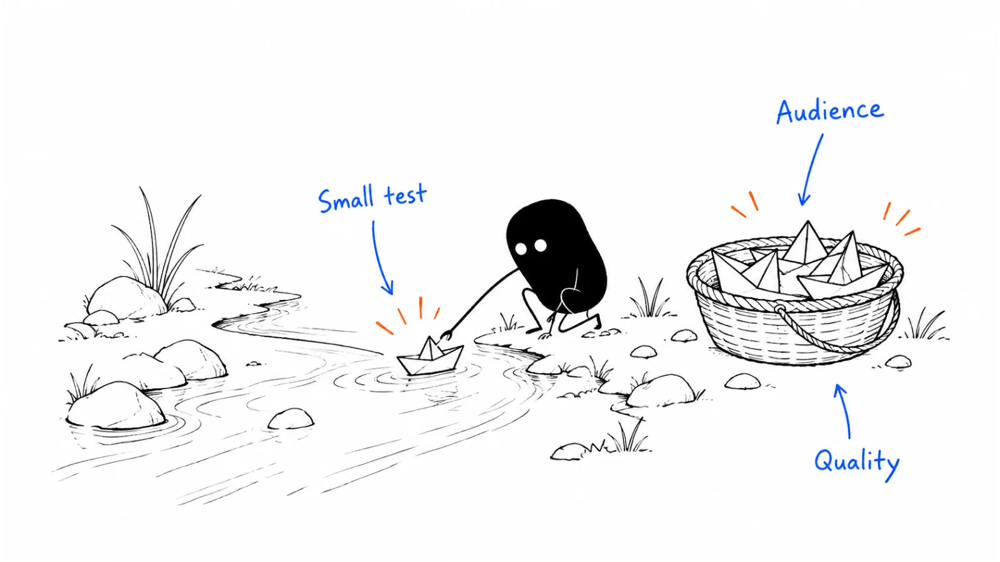

**Last reviewed:** 2026-09-08 · **Reading edit:** 2026-09-12

The report arrives on Friday: 250 leads delivered, every one within the agreed cost per lead. The campaign is marked complete.

On Monday, sales starts calling. Several people remember downloading a report but have never heard of your company. Two already work with your customer success team. One asks why a software vendor has their details.

Meanwhile, a specialist newsletter has republished a section of the same report. It sent fewer visitors, but one reader has forwarded the worksheet to their team and asked a useful question.

Both activities may be called content syndication. They are different purchases, different reader experiences, and different things to measure.

This chapter covers two paths: **editorial republication**, where another publisher shares your work with its audience, and **paid content lead programs**, where a provider distributes an asset and delivers contact records under an agreement. Either can be useful. Neither turns an unfamiliar reader into a ready buyer by changing the label in your CRM.

The job is to know what you are arranging, make the content worth encountering, and connect the next action to what the reader actually asked for.



*Reading guide: choose the distribution job → check the audience → agree on publication or record acceptance → serve the reader → review the real cost.*

If you want another publication to carry your writing, start with [editorial republication](#arrange-editorial-republication). If you are reviewing a vendor proposal, start with [the audience check](#step-1-ask-for-an-audience-sample) and [the acceptance agreement](#write-the-acceptance-agreement-before-delivery). The [worked example](#worked-example-illustrative) follows a small paid program from proposal to renewal decision.

## Use this when

You have useful material that deserves distribution beyond the people who already follow you. A research report, implementation guide, practical worksheet, or well-supported explanation can travel well when it addresses a problem another audience recognizes.

There is a specific reason to work with a publisher. Perhaps its readers include a hard-to-reach professional group. Perhaps its editor can help adapt your material to a different context. Perhaps it has a transparent way to introduce relevant people to an asset they want.

You can describe the intended outcome without falling back on “more exposure.” That might be qualified readership, use of a diagnostic, newsletter subscriptions, coverage within named accounts, or conversations with people actively evaluating a problem.

You also have someone who can handle what comes next. A solo founder can run a modest editorial partnership. A paid lead program needs enough operational capacity to inspect records, respect preferences, and respond appropriately. The budget includes that work.

## Do not use this when

You need revenue immediately and are treating a guaranteed number of downloads as a guaranteed number of sales conversations.

The content is a thin product brochure dressed up as independent research. Distribution can make that disappointment more visible; it cannot repair the underlying promise.

The provider will not explain where records come from, what people see, or what your team is entitled to do with their information. A familiar publisher logo is not an answer to those questions.

You cannot agree internally on what makes a delivered record acceptable. If finance expects a cheap contact, marketing expects an interested reader, and sales expects a scheduled meeting, the campaign will be judged against three different contracts.

You may simply need to improve the distribution of your own work: a useful email to existing subscribers, a contribution to a community where you participate, or a clear explanation on LinkedIn. Syndication is an option within [Channel strategy](https://b2-b-playbook.mintlify.app/playbooks/04-channels-and-distribution/channel-strategy), not a prerequisite for having one.

<a id="words-you-will-use"></a>

## A few useful terms

**Editorial republication** means another publication carries all or part of work you have already published, with an agreed permission scope. It may be unpaid, paid, or part of a wider relationship.

**Guest writing** usually means creating an original piece for another publication. It can lead to republication relationships, but it is not the same deliverable.

**Content repurposing** means adapting an idea into another format. Turning a report into a short video is repurposing; arranging for a partner to distribute it is a separate decision.

**Content lead generation** means distributing an asset and collecting records from people who take a defined action. The action and the collection process matter more than the product name on the proposal.

**Cost per lead**, or CPL, is a price or ratio. It is incomplete until you know what counts as a lead, which costs are included, and whether rejected records are removed from the denominator.

**Acceptance** is your decision that a delivered record meets the agreed criteria. **Sales readiness** is a different decision about whether a person has a relevant reason to speak with sales now.

**Account coverage** describes which organizations and people within them you have reached. Ten contacts from one company are not ten potential customer accounts.

<a id="one-rule"></a>

## Keep this in mind

Ask two questions separately: **Did we receive what we agreed to buy? What did the reader ask to happen next?**

A record can meet the delivery agreement without being ready for sales. A reader can be interested in your subject without wanting any contact. Someone who explicitly asks for a demonstration should not have to download another asset to prove that request is real.

This distinction also makes publisher reviews fairer. If the agreement was for qualified downloads, poor meeting conversion deserves investigation, but it does not automatically establish that the provider failed to deliver.

Conversely, meeting the volume target does not make the campaign commercially worthwhile. You can receive every contracted record and still decide not to renew.

<a id="operating-method"></a>

## How to do it

Start with the reader's situation, then choose the arrangement. There is little value in negotiating the price of a lead before deciding whether a lead file is what you need.

### Choose between readership and contact delivery

Imagine a company selling software for multi-location finance teams. It has written a practical guide to fixing exceptions during month-end close.

One possible job is to help controllers recognize an avoidable problem. An industry publication might run a useful excerpt, with a worked example and a link to the complete guide.

Another job is to introduce the guide to finance leaders at companies within an agreed size range, then invite readers to a related workshop where appropriate. That could involve a paid content program.

A third job is to book calls with teams currently replacing their close-management software. A general guide download is weak evidence for that job. A separate, explicit consultation request would be much closer.

| Arrangement | What you are arranging | A sensible first review |
| --- | --- | --- |
| Editorial republication | A useful article or excerpt for another audience | Did the right readers encounter and use it? Were publication terms met? |
| Sponsored content placement | Paid distribution of clearly identified sponsor material | Was the placement delivered, and what relevant actions followed? |
| Gated content lead program | Records from a specified content action and collection process | Did records meet acceptance criteria, and what did those people do next? |
| Explicit meeting or consultation program | A separately defined request to speak with your team | Were requests genuine, suitable, and handled as promised? |

A provider may combine these arrangements. Ask it to separate the deliverables and reporting rather than treating every activity as one undifferentiated campaign.

Do not assume editorial means free or that paid means low quality. A specialist publication may charge for valuable distribution. The important questions are whether the reader understands the arrangement and whether the price makes sense for the job.

### Arrange editorial republication

An editor needs a reason to publish your work, not a description of how much traffic you want.

Start with a piece that stands on its own. It should have a clear reader, a specific problem, and something worth carrying into a working day. A close checklist that identifies who owns unresolved exceptions is easier to evaluate than a broad promise to “transform finance.”

Read the publication before proposing a format. Does it publish full contributed articles, short practical columns, newsletter excerpts, or interviews? Does it already republish outside work? Who makes that decision?

A useful pitch explains why this particular piece belongs in this particular publication. Point to the section its readers can use, offer an adaptation if needed, and make the publication status clear. Do not offer something as exclusive when the full text is already public.

The following conversation is fictional.

**Editor:** We already have several articles about faster month-end close. What would this add?

**Marketer:** This one walks through a single unresolved exception, including the handoff between the controller and the local team. The worksheet is usable without our software.

**Editor:** Could we run that example as a shorter piece rather than republish the whole guide?

**Marketer:** Yes. We can agree on the excerpt, preserve the assumptions beside the numbers, and link to the full worksheet for readers who need it.

That is an editorial decision. It gives both sides something concrete to review.

Before publication, write down the permitted version, publication locations, attribution, links, modification rights, and any exclusivity or reuse restrictions. Identify who approves substantive edits, how corrections will be handled, and who to contact if the material becomes outdated.

Check rights in the whole asset, not just the words. Your permission to use a customer's logo, photograph, quote, or licensed chart may not include giving another publisher permission to reproduce it. Remove or replace elements you cannot authorize.

This is especially important for a continuously updated knowledge base. Give the publisher a dated version and a route back to the current source. If an excerpt includes a changing product limitation, say who will update it and whether the publisher is willing to do so.

You do not need a complex arrangement for every short excerpt. You do need enough clarity to avoid discovering later that the publisher expected permanent, unrestricted reuse across its network.

### Make a deliberate search decision

Attribution and search indexing solve different problems. A visible source link helps readers identify the original. It does not guarantee that your page will be the version a search engine displays.

Google describes canonicalization as a selection process influenced by several signals, not a way to force a preferred result. A canonical annotation is therefore not a promise that a partner's copy cannot appear in search. See [Google's canonicalization documentation](https://developers.google.com/search/docs/crawling-indexing/consolidate-duplicate-urls?ref=b2b-playbook).

For syndicated news articles, Google's publisher guidance recommends blocking indexing of the partner copy when the objective is to prevent that duplication. It distinguishes a News-only instruction from one covering Google Search as well, and does not recommend relying on the canonical element for this purpose. See [Google's syndication guidance](https://support.google.com/news/publisher-center/answer/9606800?hl=en&ref=b2b-playbook).

Decide with the publisher which outcome you want. An independently useful adaptation may reasonably be discoverable. If your agreement requires the syndicated copy to stay out of search, have the responsible technical owner verify the actual implementation. Do not apply that instruction to your original page by mistake.

Publication credit, contractual permission, and indexing settings should each be checked on their own terms.

### Learn from an editorial example without borrowing its forecast

In its May 8, 2014 account, Buffer described building publishing relationships through roughly 150 guest posts in nine months, then offering proven articles for republication. It reported 949 new conversions from its top four syndication sites in the preceding month. The source does not establish those as paid customers. [Buffer's original account](https://buffer.com/resources/how-to-become-a-columnist-guest-posting-syndication/?ref=b2b-playbook)

This is a historical company report, not a current acquisition benchmark. The useful lesson is the relationship between worthwhile material and an editor's willingness to carry it. It does not tell you what a present-day lead vendor should charge.

The [Buffer company case](../../use-cases/buffer-syndication.md) keeps that evidence boundary explicit. Use current Google guidance, not the historical article's search advice, when planning a republication today.

<a id="step-1-refuse-the-kit-demand-the-sample"></a>

### Step 1: Ask for an audience sample

For paid programs, move from the media kit to the audience you would actually buy.

A publisher may have millions of registered readers across many topics and countries. Your campaign might reach only a small subset, or it might be fulfilled partly by another company. Neither possibility is automatically bad. Both need to be visible before you commit.

Ask where the asset will appear, how it will be promoted, and which organizations are involved in collecting or supplying records. A publication's own newsletter, a registration page in its resource library, a partner network, and a telephone collection process create different reader experiences.

Then ask for evidence relevant to your audience: role categories, company characteristics, geography, recent delivery from comparable programs, and the method used to classify those records. “Senior decision-makers” is not a usable definition if your product is operated by a specialist manager.

The initial evidence does not have to be a spreadsheet of hundreds of named people. Aggregate breakdowns, redacted examples, a controlled review, or a small permitted test may be sufficient. Do not create unnecessary personal-data transfers just to feel thorough.

A sample is evidence about its selection process as well as its contents. Ask whether it was randomly drawn, selected as representative, or chosen to show the best records. A polished handful of ideal accounts is not an estimate of the full campaign.

Write down unresolved questions. “Company size is modeled and not independently checked” is more useful than silently treating an estimate as a verified fact.

### Inspect the actual collection journey

Ask to see the page, promotion, form, confirmation, and proposed follow-up. If calls are used, review the script and how answers are recorded.

Would a person know who produced the content? Would they understand why your company might contact them? Does a question ask about an active project, or merely interest in a broad subject?

A form can create misleading data even when nobody is fabricating records. A required “purchase timeframe” field may force a reader with no project to select the least inaccurate option. A broad job-title dropdown may turn an individual contributor into a “decision-maker” in the export.

The following conversation is fictional.

**Vendor:** Everyone in this package has indicated interest in finance transformation.

**Marketer:** What did they do or answer to receive that label?

**Vendor:** They selected a topic preference when registering for the resource library. Some registrations are from last year.

**Marketer:** Then we can use it as an audience filter, but not as evidence of a current project. Please keep the collection date and the actual content action separate.

This is not an argument about whether the audience is valuable. It is a request to describe what you know accurately.

If the vendor uses an intent score, ask what the score summarizes and whether the evidence is about an individual, an account, or a broader group. Do not convert account-level topic activity into a claim that a particular employee requested contact.

You do not need access to proprietary scoring code to make a decision. You do need enough explanation to avoid using the score for a purpose it cannot support.

<a id="step-2-verify-like-outbound"></a>

### Step 2: Verify the sample accounts

Verification is not one pass-or-fail flag. Separate identity, fit, duplication, collection provenance, and the next permitted action.

A person may be real but outside your market. A person may fit perfectly but have an unusable address. A contact may already exist in your CRM but represent a valuable new interaction. These situations require different decisions.

Start with company fit. Check whether the industry, operating model, location, and size are relevant to the problem you solve. A payroll provider and a manufacturer might have similar employee counts but very different reasons to read your report.

Then check the role. Titles are inconsistent across companies. Look for likely responsibilities instead of assuming that seniority alone establishes buying relevance.

Review duplicate rules at both person and account level. “New names only” is appropriate for some programs. A campaign designed to reach more members of a buying committee should not automatically reject every person at an account you already know.

Personal email addresses are not automatically fraudulent. Depending on your audience, they may make company verification harder or fall outside the agreed delivery standard. State the actual reason for acceptance or rejection rather than treating the domain as a moral judgment.

Unknown is also a legitimate result. A company size that cannot yet be confirmed should not quietly become “within range” because the campaign needs more accepted records.

### Write the acceptance agreement before delivery

Your agreement should make it possible for two people to inspect the same record and usually reach the same decision.

Specify required fields and their meanings, collection dates, audience criteria, duplicate lookback rules, excluded customers or accounts, and the evidence required for any claimed qualification.

Agree on delivery frequency and format. A small regular batch can be easier to inspect than a file arriving after the campaign has consumed the entire budget.

Set the review window, rejection process, replacement or credit rules, and escalation contact. Define what happens to a disputed record while the disagreement is unresolved. A replacement should meet the same standards as the original promise, not create a second stream of lower-quality inventory.

Be careful with claims like “100% verified.” Verified by whom, for which fields, using which method, and how recently? Email verification is not the same as company-fit verification or an explicit request for contact.

| Check | Evidence to request | Decision it supports |
| --- | --- | --- |
| Audience fit | Defined role, company and location fields with known sources | Whether the record belongs in the agreed campaign |
| Identity and contact route | A documented validation method and required-field checks | Whether the record is usable under the delivery standard |
| Duplicate status | Person and account matching rules, including a lookback period | Whether this interaction is new, useful existing coverage, or excluded |
| Collection provenance | Placement or collection source, timestamp, and form or script version | Whether you can explain how the record was obtained |
| Reader request | The actual action or response, separate from vendor scoring | What follow-up is appropriate |
| Commercial acceptance | Review deadline and specific rejection or credit terms | Whether the record should be counted and billed |

If a provider cannot supply every field, that is not automatically disqualifying. Decide which unknowns are tolerable for this job and which make the program unworkable. The decision should happen before the missing information becomes an expensive surprise.

### Review privacy and contact permissions separately

Do not treat downloading content as blanket permission for every future contact method.

The UK ICO explains that B2B marketing rules vary by channel and business type. Corporate subscribers and sole traders can be treated differently under PECR, while processing named business contacts can still fall under UK GDPR. Its guidance also addresses transparency, lawful basis, and objections. The page was marked under review when checked. [ICO: business-to-business marketing](https://ico.org.uk/for-organisations/direct-marketing-and-privacy-and-electronic-communications/business-to-business-marketing/?ref=b2b-playbook)

That is a UK-specific example, not a worldwide permission rule. Have the responsible privacy or legal owner review the actual collection and follow-up arrangement for the applicable jurisdictions.

Operationally, keep the source and collection wording available, honor suppression and deletion workflows, and identify who handles requests that reach either partner. A vendor's assurance does not replace understanding your own intended use.

This chapter provides planning questions, not a legal assessment of a particular list or campaign.

<Accordion title="The publisher will not share a named sample">

Ask what evidence it can share safely: audience aggregates, redacted records, a description of sampling, collection screenshots, or a narrowly scoped pilot with review rights.

A refusal to export personal data before an agreement may be appropriate. It is different from refusing to explain how the audience is assembled.

If the remaining uncertainty prevents you from making a responsible decision, do not purchase the program yet. Write down the unanswered question and the evidence that would resolve it.

Do not respond by asking someone to scrape the publisher's audience or obtain the same personal information through an unapproved route.

</Accordion>

<a id="step-3-write-the-post-fill-signal-before-you-buy"></a>

### Step 3: Define what a useful lead would do next

Build the follow-up around the reader's request, not around the pressure to make the campaign look productive.

Someone who downloaded a general guide has expressed interest in that guide. You may have a lawful and appropriate reason to offer related help, but you should not open with “Thanks for your interest in buying our platform.”

Someone who explicitly requested a demo has asked for a sales interaction. Route that request promptly after the relevant checks. Do not wait for a second download because your generic nurture rule requires one.

A person at an existing customer may need help using the product rather than a new-business pitch. A current opportunity may belong with the account owner. Make those paths part of the campaign design.

Define the evidence sales needs for each route. It may be an explicit request, a substantive reply describing a relevant problem, or another locally agreed signal. A high score assembled from weak behaviors should not silently substitute for the evidence.

Your team may call some accepted records MQLs. That is a local process choice. Make the definition visible and keep it separate from a sales-ready claim. Renaming the stage will not solve disagreement about what sales is expected to do.

### Make the first follow-up useful on its own

A good first interaction connects to the content, explains the relationship, and gives the person a reasonable choice.

For a guide about finance exceptions, a useful next asset might be a completed example or a short explanation of when not to use the worksheet. A generic “just checking in” message contributes nothing to the reason the person downloaded the guide.

If the approved program includes follow-up from your company, identify the publisher and asset accurately. Do not pretend the person visited your website or spoke to a rep if they did not.

The following conversation is fictional. It illustrates tone only; it is not a ready-to-send message or a substitute for permission checks.

**Marketer:** You requested our exception-handoff guide through the finance newsletter. The completed example shows how to assign one owner without removing local responsibility. Would that be useful?

**Reader:** Yes. We are still working out who should own the process. We are not evaluating software.

**Marketer:** Understood. I can point you to the example without setting up a product call.

**Reader:** That would help. I will share it with the controller.

That exchange contains useful information. The reader has a relevant problem and no current evaluation. Record both rather than turning a positive reply into an invented buying timeline.

### Avoid making the asset a trap

Deliver what was promised without requiring the reader to navigate a second sales funnel.

If someone gives their details to obtain a report, the delivery page should make the report easy to find. Optional next steps can be visible, but a surprise qualification call should not become the only route to the asset.

A report should also be usable after download. Preserve source notes, dates, assumptions, readable charts, and links to maintained versions. The more it circulates inside a buying team, the less you can rely on the landing page to explain what it is.

This is why content quality belongs in the campaign review. A disappointing asset can make a relevant audience look unresponsive. Ask a few representative readers to use it before paying to distribute it.

You do not need an expensive research report for every program. A concise, genuinely useful worksheet may be better than thirty pages of vague advice. Match the format to the task, not to a belief that a larger PDF creates more intent.

### Give sales context without creating a call list by default

A handoff should show the content action, collection source, date, known fit, and the reason for the handoff. Where appropriate, include the person's actual question or requested next step.

“Downloaded through Publisher A; asked whether the method works across six subsidiaries; requested a conversation next week” is actionable.

“Hot syndication lead, score 82” leaves the rep guessing. It also makes it easier to overstate familiarity.

Agree on response ownership and timing before the campaign starts. If the designated person is away, another owner should receive explicit requests. If no one can respond, pause the relevant promotion or change the promise before collecting more requests.

A small team can keep this simple. One shared review queue and a few clearly defined routes may be enough. Automation should implement those decisions, not invent them.

<a id="step-4-cap-the-test"></a>

### Step 4: Set a test budget and review date

A pilot needs a question narrow enough to answer.

“Does content syndication work?” is too broad. “Can this publisher introduce our exception worksheet to finance operators at companies we can serve, with acceptable record quality and manageable follow-up?” is more useful.

Choose a spending cap, delivery period, acceptance checkpoint, and outcome review. These are different dates. You may need to reject malformed records quickly, assess early replies over several weeks, and observe actual sales outcomes for longer.

There is no universal ninety-day rule. The appropriate window depends on the promised delivery, the reader action, your sales cycle, and the decision you need to make. An editorial correction should not wait for a quarterly campaign review.

One publisher and one asset are a manageable starting point for a small team. A larger team may compare several defined cells. The requirement is interpretability: do you know what changed and what each result refers to?

### Count more than the vendor invoice

Include asset adaptation, operations, review, follow-up, and any other incremental campaign work. You can track cash and internal hours separately if assigning an hourly value would create false precision.

If you do value time, state the assumption. Do not call an internal planning rate an audited cost or ignore the hours just because nobody sent an invoice.

Separate the cost of creating an asset for the whole business from the incremental cost of this campaign. Charging every channel the full cost of the same report overstates the total; allocating none of it can make the work look free. Pick a treatment that answers your decision and document it.

The quoted CPL, effective cost per accepted record, cost per relevant conversation, and cost per customer answer different questions. Keep the labels attached.

A provider may offer a lower price for a longer commitment. That discount only helps if the additional inventory is useful. Before expanding, ask whether the new volume comes from the same audience and collection method as the pilot.

### Decide what would make you pause

Pause delivery when the collection experience differs materially from the approved version, the provenance is unclear, or your team cannot honor the promised follow-up.

Pause and investigate a sudden change in audience composition or record quality. A late batch from a different source may deserve a different review from the first batch.

Commercial disappointment is a different issue. If the right people receive useful content but there is little downstream action, examine the asset, expected next step, audience timing, and economics before declaring the records defective.

You do not have to finish spending the cap to learn that the arrangement is unsuitable. Equally, do not shut down a long-cycle program merely because it has no closed customers after a few days.

Write the decision you can support now and the uncertainty you still need to observe.

<Accordion title="The provider delivered every record, but sales is unhappy">

First, compare the records with the signed delivery criteria. Document actual failures separately from expectations that were never part of the agreement.

Then inspect the handoff. Were downloads routed as demo requests? Did sales receive the asset and source context? Were existing customers or active opportunities sent to the wrong owner?

Finally, review the content and the next-step offer. If the campaign was meant to support education, immediate meeting volume may be an incomplete measure. If it was bought to create qualified conversations, continued absence of those conversations matters even when every record is technically acceptable.

You can honor a fulfilled contract and decline to renew it. You can also dispute genuinely nonconforming records without claiming that everyone who declined a meeting was a bad lead.

</Accordion>

<a id="step-5-keep-syndication-off-the-primary-motion"></a>

### Step 5: Compare the test with your main channel

Compare routes to the same business objective, not whichever ratios happen to look attractive.

An editorial excerpt might be economical for reaching practitioners with a useful idea. A targeted workshop might be better for substantive conversations. A paid lead program might increase contact coverage in a defined market. These outcomes do not share a natural denominator.

If the decision is where to spend the next budget on qualified conversations, include the follow-up cost and use a consistent definition of conversation. If it is where to build readership, assess relevant use and reach instead.

Do not compare a publisher's delivered contacts with another channel's sales-accepted opportunities and call the lower number more efficient. One is an earlier stage.

Also inspect audience overlap. A publisher may help you reach people you already know in a new context. That can be valuable, but it is different from acquiring a wholly new audience. Preserve existing CRM history so you can tell the difference.

Syndication does not have to remain a secondary channel forever. It earns a larger role by repeatedly producing useful outcomes at a cost and workload you can sustain. A single successful batch does not establish that the next ten batches will behave the same way.

### Renew the useful part, not the whole proposal

A mixed program may contain one strong placement and several weak ones. Ask whether the next agreement can keep the useful audience, asset, or format without buying all the surrounding inventory.

For editorial work, that might mean a recurring practical column with a limited review burden. For a lead program, it might mean fewer records from a narrower source, with better delivery context.

If the provider cannot separate those elements, judge the package as offered. Do not forecast the strong component's performance across the entire bundle.

Document what would be different next time. “Try again with a larger budget” is not a learning plan. “Test whether an implementation worksheet produces more relevant replies than the general trend report, within the same audience and cap” is.

A stopped program can still produce useful assets, publisher relationships, or audience understanding. Retain those lessons without treating them as proof that the financial outcome was good.

<a id="teaching-fill-inventednot-a-customer"></a>

## Worked example: illustrative

The company, publisher, costs, and outcomes below are fictional. They demonstrate a review method, not a market benchmark or a Lensmor campaign.

A small software company helps finance teams coordinate exception handoffs across multiple locations. It already has a useful guide and a worksheet. Its customers usually need several conversations before deciding whether to run a pilot.

The team is considering two arrangements: an editorial excerpt in a specialist publication and a paid program distributing the guide to a defined finance audience.

### The editorial arrangement

The editor wants a practical explanation of why unresolved exceptions keep returning to the same weekly meeting. The company proposes a shorter version of an existing guide, preserving the example and linking to the worksheet.

They agree on a specific excerpt, clear authorship, a source link, a named correction contact, and approval for substantive changes. The arrangement does not include a lead file or a promise of subscriber identities.

During the agreed review period, the company observes 120 attributed sessions on the linked page and 18 worksheet-download events. Three readers send questions. Those numbers do not establish eighteen distinct companies, and the download events are not automatically distinct people.

One question turns into a useful product conversation. The other two improve the worksheet's instructions. The team regards the placement as useful distribution, but does not claim that it caused every later visit from those companies.

Its next proposal is another focused excerpt, not a demand that the editor turn every reader into a contact record.

### The paid program brief

The vendor offers 120 submitted records at a quoted price of &#36;50 each, subject to agreed rejection and credit terms.

Before approving the program, the team reviews audience aggregates, a redacted delivery example, and the live collection journey. It confirms the relevant company range, finance responsibilities, approved locations, required fields, and collection wording.

The goal is to find suitable readers who will engage with the worksheet and, where there is a real reason, discuss the problem. The team is not purchasing 120 demo requests.

The agreement excludes specified existing customers, duplicate submissions within the campaign, and records lacking required provenance. It defines a review window and credits for accepted rejection reasons. The scenario assumes applicable privacy and contact requirements have been separately cleared; these financial calculations do not establish permission.

### The first acceptance review

The 120 submissions contain several issues. The team assigns each rejected submission one primary reason so the rejection categories below do not overlap.

| Delivery review | Submitted records | Treatment |
| --- | --- | --- |
| Meet the agreed criteria | 90 | Accepted for the defined content program |
| Outside the agreed audience | 12 | Rejected under the fit criteria |
| Duplicate submissions under the agreed rule | 8 | Rejected; original records retain their history |
| Missing required provenance | 6 | Rejected unless resolved within the review window |
| Invalid required contact fields | 4 | Rejected under the delivery standard |
| Total | 120 | 90 accepted and 30 rejected |

The vendor agrees to credit the thirty rejected submissions at the quoted unit price. The final media cost is therefore &#36;4,500 rather than the original &#36;6,000.

The campaign also uses &#36;700 of paid design and production help. The team records thirty hours of internal work: reviewing the arrangement, preparing delivery, inspecting records, handling responses, and reporting. For this decision only, it values that time at &#36;60 per hour, or &#36;1,800.

That produces an assumed all-in cost of &#36;7,000. The original guide's prior production cost is excluded because this review is about the incremental distribution decision; the team notes that choice rather than calling the content free.

The media-only cost per accepted record remains &#36;50 after the credits. The all-in cost per accepted record is about &#36;77.78. Both are true, and neither is a customer acquisition cost.

### What happens after delivery

Of the ninety accepted people, nine make an explicit request for a conversation through a separate, clearly described step. The remaining eighty-one requested the content only.

The nine requests go to an appropriate owner. The other readers receive only the follow-up appropriate to the reviewed arrangement and their preferences. No one is described as having asked for a demo merely because they downloaded the guide.

By the agreed early-outcome review, six of the nine requested conversations have taken place. Four involve a suitable company and a relevant problem. Two are genuine conversations but outside the product's current scope.

Two of the four suitable conversations become opportunities under the team's existing definition: a confirmed problem, a plausible project, an involved owner, and an agreed next step. None has closed by the review date.

The team reports ninety accepted records, nine explicit requests, six held conversations, four suitable held conversations, and two opportunities. It does not add these stages together as separate people.

The assumed all-in cost per suitable held conversation is &#36;1,750: &#36;7,000 divided by four. The cost per opportunity is &#36;3,500. There is no observed cost per acquired customer yet.

### The renewal discussion

The provider highlights the &#36;50 CPL. Marketing shows the full chain and the missing revenue outcome.

The company does not reject the program just because some readers were not buying. It also does not approve a larger annual contract on the basis of four conversations.

The follow-up capacity was manageable. The accepted records were mostly relevant. However, the all-in cost is high enough that the team needs better evidence before scaling, and the small cohort is too uncertain for a confident forecast.

It chooses a narrower second test with the same transparent collection process and a more practical asset, subject to a new cap. It continues observing the original opportunities separately rather than moving them into the new campaign's results.

This is a bounded learning decision, not a declaration that syndication works everywhere.

### What would change the decision?

If the original collection wording had misrepresented the follow-up, the team would have paused before using the records. Better economics would not fix that problem.

If most accepted readers had clearly misunderstood the asset, the next step would have been a content and landing-page review, not simply a narrower audience.

If the same quality could only be supplied for the first batch, the team would not assume the discounted annual package offered the same inventory.

If one opportunity later closed, the team would update the cohort's observed outcome and document the attribution rule. It would not retroactively turn every accepted reader into an in-market lead.

The value of the review is that each of these situations leads to a different action.

## Copy: syndication test (fill)

Use this card to decide what you are arranging before you compare prices. The two paths share an audience question, but they do not share all the same delivery requirements.

```text
SYNDICATION DECISION CARD

Reader and problem:
Asset / version / maintained source:
Job: editorial readership / content records / explicit requests
Why this publisher reaches the intended audience:
Evidence reviewed and important unknowns:

Editorial path, if relevant:
Permitted excerpt or version:
Locations, attribution, links, and modification approval:
Search-indexing decision and technical owner:
Correction / withdrawal contact:

Lead-program path, if relevant:
Collection sources and reader journey reviewed:
Audience, fields, duplicate rules, and exclusions:
Provenance and contact-permission review owner:
Acceptance window / rejection and credit terms:
Routing: content only / explicit request / existing account:

Pilot cash cap and internal-hours allowance:
Delivery, acceptance, and outcome review dates:
One useful outcome and its exact definition:
Pause conditions:
Decision owner:
```

The [existing working file](../../templates/content-syndication.md) is a shorter paid-program worksheet. Its one-publisher, ninety-day structure is a starting convention, not a universal requirement. Adapt the time window and routing to your actual program; an explicit request does not need another action before an appropriate response.

### Copy: end-of-test review

Keep delivery quality and business usefulness visible on the same page. This makes it possible to discuss a renewal without relitigating the meaning of “lead.”

```text
SYNDICATION REVIEW

Publisher / asset / campaign dates:
Original job and success definition:
What was delivered:
Acceptance criteria met / not met:
Rejected records by non-overlapping primary reason:
Credits or replacements agreed and received:

Reader outcomes by distinct stage:
Explicit requests / held conversations / suitable conversations:
Opportunities / closed customers, with observation date:
Existing-account involvement and audience overlap:
Attribution rule and what it cannot establish:

Media and other cash cost:
Internal hours and any valuation assumption:
Cost per relevant outcome, with numerator and denominator:
What readers misunderstood or found useful:
Any collection, permission, or suppression issues:

Decision: stop / change / repeat / expand
Specific change or evidence needed:
Next cap, owner, and review date:
```

<a id="pre-flight-checklist"></a>

## Before you start

Read the asset as if you had never heard of the company. Does it keep its promise without requiring a product conversation?

Inspect one complete reader journey. Know where the material appears, what the form says, how access works, and who might contact the reader.

Confirm the applicable publication permissions or record-use review. These are separate checks; one does not substitute for the other.

Walk a sample record through the actual routing process. Check a content-only reader, an explicit request, an existing customer, and a duplicate. Make sure the team can distinguish them.

Agree on rejection terms while the provider still has time to change the proposal. Do not leave the definition of a usable record for an end-of-campaign argument.

Finally, ask the follow-up owner whether the expected volume is manageable. If not, reduce delivery or change the plan. A campaign that creates more requests than you can responsibly serve is not ready to scale.

## Metrics

### For editorial distribution

Track the agreed placements and whether they meet the publication terms. Then look at relevant readership signals you can legitimately observe: attributed visits, use of the linked resource, substantive questions, subscriptions, or suitable conversations.

Some valuable reading happens entirely on the publisher's property. An absence of clicks does not prove an absence of reading. Equally, a claimed audience size is not evidence that everyone saw your piece.

Ask which reporting the publisher can actually provide. Treat estimates, aggregates, sessions, and people as different units. Do not assume you are entitled to individual reader identities because your article was published.

### For paid content programs

Report submitted and accepted records separately. Keep rejection reasons clear, including how overlapping problems were assigned for counting.

Track time to delivery, time to review, and the completeness of provenance. These can expose an operational problem before outcome data is mature.

Then follow distinct people and accounts through the locally defined stages. Show content actions, explicit requests, held conversations, suitable conversations, opportunities, and customers without collapsing them into one “engagement” total.

Use the cost relevant to the decision. Media-only CPL helps reconcile a vendor invoice. All-in cost per suitable conversation helps compare acquisition work. Revenue and contribution require actual outcomes and appropriate accounting assumptions, not an estimated pipeline multiplier.

### Keep attribution modest

Preserve prior account history and other known touches. If an existing opportunity downloads the report, the campaign may have supported it; that does not automatically make it newly sourced pipeline.

Use a documented attribution rule and retain the underlying events. A consistent label helps reporting, but does not prove causation.

Small cohorts are particularly easy to overread. One additional opportunity can change a ratio substantially. Review individual cases alongside the aggregate instead of publishing a precise forecast from a handful of outcomes.

For a larger program, a properly designed comparison may help test incremental impact. It needs enough scale, a meaningful comparison group, and a plan for contamination or overlapping exposure. A casual before-and-after chart is not the same experiment.

## Common mistakes

**Buying the word “intent.”** Ask which observed action the label summarizes and whether it belongs to a person or an account.

**Treating every CRM match as waste.** Distinguish a duplicate submission from valuable involvement by another member of a known account. Apply the agreed objective.

**Requiring a named sample at any cost.** Evidence can be aggregate or redacted. The goal is confidence in the process, not unnecessary possession of personal data.

**Calling an accepted download sales-ready.** Record what the person actually requested and route accordingly.

**Forcing a demo requester through nurture.** A meaningful explicit request already supplies the next-step signal. Respond rather than manufacturing more scoring events.

**Using attribution as an indexing strategy.** Source credit helps readers. Search behavior needs a separate, technically reviewed decision.

**Renewing on discounted CPL alone.** Include acceptance, internal work, downstream outcomes, and changes in the audience being supplied.

**Blaming distribution for a weak asset.** Read the report and watch someone try to use it before buying more reach.

**Treating syndication as permanently inferior or automatically scalable.** Let repeated, well-defined outcomes determine its role.

## What to read next

Use [Content strategy](../03-brand-story-and-content/content-strategy.md) to choose material worth distributing and [Channel strategy](https://b2-b-playbook.mintlify.app/playbooks/04-channels-and-distribution/channel-strategy) to decide where it belongs.

[Creator partnership](https://b2-b-playbook.mintlify.app/playbooks/04-channels-and-distribution/creator-partnership) covers collaborations that involve a creator's judgment and original treatment. [Community](https://b2-b-playbook.mintlify.app/playbooks/04-channels-and-distribution/community) covers participation and relationships that cannot be reduced to a purchased contact file.

For related search decisions, read [SEO & AEO](https://b2-b-playbook.mintlify.app/playbooks/04-channels-and-distribution/seo-and-aeo). For routing and evaluation, continue with [Lead scoring](../09-operations-pipeline-and-measurement/lead-scoring.md) and [Experimentation](../09-operations-pipeline-and-measurement/experimentation.md).

The [Buffer syndication case](../../use-cases/buffer-syndication.md) is an editorial example, not a paid-lead benchmark. Use [content distribution](content-distribution.md) to plan owned, partner, and other relevant routes to an asset.

## Sources and evidence boundary

Primary Google documentation, the ICO's B2B marketing guidance, and Buffer's May 8, 2014 account were checked on September 8, 2026. Links beside the relevant claims identify the source.

Google's syndicated-news guidance has a specific context and should not be confused with its advice for duplicate URLs within one site. Neither source makes publication credit a guarantee of search selection.

The ICO source is jurisdiction-specific and was marked under review. It does not establish that a particular international campaign, record transfer, or follow-up is lawful. Obtain a review of the actual arrangement.

Buffer's historical, company-reported conversions are not stated here as paid customers or as a forecast of present-day results.

The campaign design, acceptance method, templates, conversations, and numerical example are original teaching material. All worked-example names, costs, and outcomes are fictional. No vendor audit, customer campaign, publisher outreach, record purchase, or contact-data review was conducted for this chapter.

---

Copyright © 2026 Ivan Xu. All rights reserved. See the [copyright and reuse terms](https://github.com/weilun88313/B2B-Playbook/blob/main/LICENSE).

Canonical source: [github.com/weilun88313/B2B-Playbook](https://github.com/weilun88313/B2B-Playbook)
