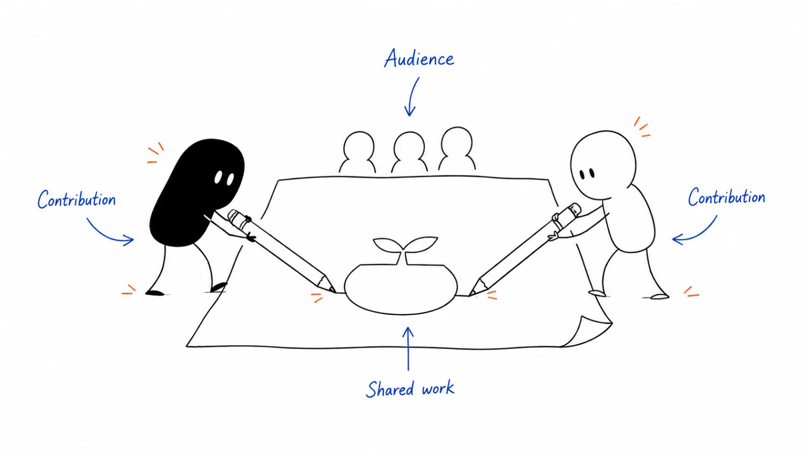

**Last reviewed:** 2026-08-30 · **Reading edit:** 2026-09-06

A creator partnership works when the audience, the topic, and your contribution fit together. Find someone your buyers already learn from and make something useful with them. Agree on the deliverable, sponsorship disclosure, distribution, and how you will evaluate it.

*Reading guide: the creator's audience · your useful contribution · a shared piece of work.*

## Use this when

- A creator already teaches the seat you sell to, in their words.
- You have a dated fact, dataset, or working file the audience cannot get from a homepage.
- The default brief is “can you mention us to your list?”
- You are about to buy a newsletter slot the way you buy a banner.

## Do not use this when

- You need a reading list. That is [RESOURCES.md](../../RESOURCES.md).
- The asset does not exist. Write the [content](../03-brand-story-and-content/content-strategy.md) first.
- Follower count is the selection reason and composition is unknown.
- Legal must clear endorsement, data rights, or paid-promotion labels. Qualified owners; this page will not.

## A few useful terms

| Word | Meaning here |
|---|---|
| **Overlap** | Share of *their* regular audience that matches *our* ICP. Opens are not this. |
| **Co-create** | One artifact with both names on the method—not a swipe-file ad. |
| **Operating problem** | A job their readers already argue about. Not “our launch.” |
| **Unique cut** | A dated slice only you can source (your book, your events, your sample)—labeled, checkable. |
| **Placement** | A paid mention with no shared work. Last resort. |

## Keep this in mind

**Partner on an artifact the reader can use without you.** If the piece dies when the product name is removed, it is an ad. Prefer a benchmark, a research cut, or a “what changed before this event” note over a quote. A grade-A newsletter in [RESOURCES.md](../../RESOURCES.md) is not automatically a partner.

## How to do it

### Step 1: Check audience fit

Write the seat, the job, and why *this* audience already cares. Ask for a composition sample (titles, company size, geo)—or refuse the deal. High fame and low overlap is a brand tax.

### Step 2: Choose a problem their readers care about

Steal the question from their last ten issues or episodes, the way [content strategy](../03-brand-story-and-content/content-strategy.md) steals from live deals. If you cannot point to a dated piece of theirs on that job, you are pitching a stranger.

### Step 3: Bring something useful to the collaboration

The creator has voice. You need a fact they cannot invent: a method, a working file, or a **labeled dataset**.

Teaching pattern (not a product requirement): if you uniquely see pre-show account and seat density, turn that into a public **benchmark**, a short research note, or a “buyer-signal before the show” cut—what changed, on what date, for which seat. Do not dump a customer list. Do not imply the cut is a complete census.

Lensmor is built and maintained by Ivan Xu, the owner of this repository. If that event graph is the cut, disclose the relationship in the piece the same way [TOOLS.md](../../TOOLS.md) discloses it. Any other unique book (your win/loss, your CS workspace, your sample) follows the same rule: source, date, limitation, no invented rows.

### Step 4: Agree on benefits and disclosure

> We get ___. They get ___. The reader gets ___.

If the third blank is “awareness of our launch,” stop. Paid placements must say they are paid. Unpublished customer facts stay unpublished.

### Step 5: Plan one piece and its distribution

They publish. You amplify on channels you already run—see [ecosystem](../06-account-field-and-partner/ecosystem.md). You do not stand up a creator program of twelve names. Day-90 test: a champion forwarded it, or a qualified conversation named the piece. Otherwise you bought a mention.

## Worked example (illustrative)

A weekly ops newsletter. Readers are heads of customer ops. We do not buy the Friday slot. We co-write a two-page cut: “what buying seats show up in the exhibitor graph 30 days before [named show type]”—method, sample limits, no account names. Host owns the narrative; we own the dated table.

| Field | Fill |
|---|---|
| Overlap | High composition, modest coverage. |
| Problem they already cover | “How do we pick which shows are worth the week?” |
| Unique cut | Pre-show seat-density table. Sources labeled. Not a customer list. |
| Reader win | A way to say no to a booth. |
| Our win | Two T1 conversations that cite the cut. |
| Disclose | If the graph is Lensmor: owner product, same as the tool directory. |

## Copy: partnership card (fill)

- Creator / format (newsletter, podcast, operator essay):
- Overlap evidence (seat / size / geo)—not subscriber count:
- Operating problem (link to *their* dated piece):
- Artifact (benchmark / research cut / working file / other):
- Unique cut (source / date / what it is not):
- Disclosure required (owner product, paid, customer permission):
- We get / they get / the reader gets:
- Amplification we will actually do:
- Stop rule:

Working file: [creator-partnership.md](../../templates/creator-partnership.md).

## Before you start

- [ ] Overlap is evidenced, not assumed from fame.
- [ ] The problem already appears in their archive.
- [ ] The artifact survives without our product name.
- [ ] Unique cut has a source, date, and limitation.
- [ ] Owner-product or paid labels are written into the brief.
- [ ] No customer or registrant list will be published.
- [ ] One piece this quarter; [RESOURCES.md](../../RESOURCES.md) is not the roster.

## Metrics

| Metric | Diagnostic use |
|---|---|
| Champion forwards | Times the piece is pasted into an evaluation thread |
| Named conversations | Qualified talks that cite the artifact |
| Overlap quality | Partners whose audience matched the seat we wrote |
| Placement restraint | Pure mentions we correctly refused |
| Disclosure intact | Pieces that kept the owner/paid label |

Do not count opens, downloads, or “they have 40k.” Do not import their media kit’s CPM as pipeline.

## Common mistakes

- Buying a slot because the newsletter is grade A on our reading list.
- Co-branding a recap that is still an ad.
- Handing over a unique dataset with no limitation line.
- Forgetting to disclose an owner product.
- Standing up a KOL roster before one artifact worked.
- Treating Product Hunt upvotes as this motion—see [Product Hunt](product-hunt.md).

## What to read next

Who to read (not hire) is [RESOURCES.md](../../RESOURCES.md). The room without a celebrity is [peer community](community.md). The company system is [ecosystem](../06-account-field-and-partner/ecosystem.md). The pages the piece should point at are [content strategy](../03-brand-story-and-content/content-strategy.md). Pre-show facts still have to survive [buying signals](../05-outbound-and-prospecting/buying-signals.md) and [trade shows](../06-account-field-and-partner/trade-shows.md).

## Sources and evidence boundary

This is an owner-maintained operating synthesis. It is not a creator rate card.

Overlap, co-create-on-an-operating-problem, and “unique cut before a placement” are judgments in this library. Lensmor appears only as a **disclosed owner-product example** of an event graph that can become a public cut—not as a required partner stack and not as a complete census of any show.

---

Copyright © 2026 Ivan Xu. All rights reserved. See the [copyright and reuse terms](../../LICENSE).

Canonical source: [github.com/weilun88313/B2B-Playbook](https://github.com/weilun88313/B2B-Playbook)
