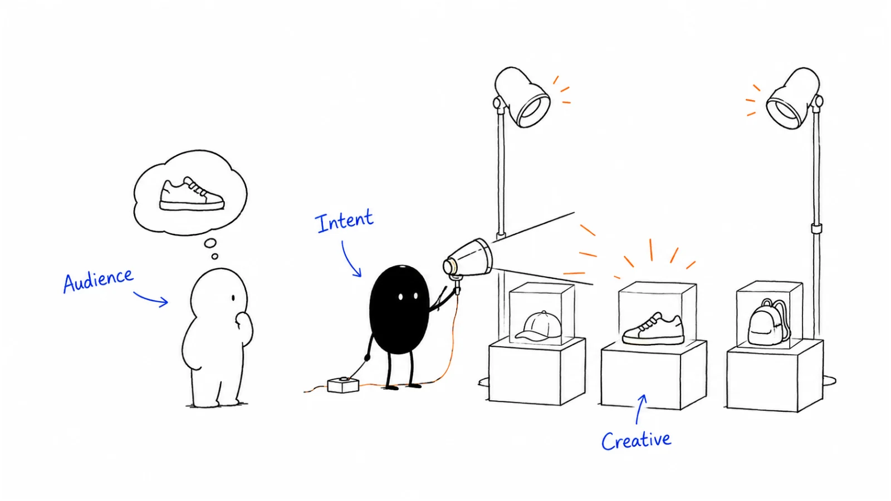

**Last reviewed:** 2026-09-08 · **Reading edit:** 2026-09-09

The campaign report looks good. Clicks are cheaper than last month, the form is converting, and the platform says the ads generated a healthy return.

Sales has a different report. Several submissions are duplicates. Some people wanted a template, not a conversation. A few requests are relevant, but nobody responded while the buyer was still interested.

The question is not simply whether the ads worked. You need to know which part worked: reaching someone, earning a click, collecting a request, creating a useful conversation, or acquiring a customer.

Paid media buys distribution. It does not automatically supply a clear offer, an appropriate destination, a working follow-up process, or a reliable account of what caused the result.

This guide covers the decisions before launch, the first bounded test, and the review that determines whether to stop, change, or expand. It includes search, paid social, and retargeting, but it is not a button-by-button setup tutorial for every platform.

You can use it with a small budget and a simple operation. You do not need an enterprise advertising stack before learning whether a specific paid route is worth pursuing.



*Reading guide: define the job → choose a plausible audience and channel → keep the ad's promise → measure the right action → test within a cap → review real outcomes.*

If someone has already proposed a budget, start with [the campaign purpose](#step-1-define-the-purpose-of-the-campaign). If leads look cheap but sales is unhappy, use [the conversion check](#choose-what-the-platform-should-optimize). The [worked example](#worked-example-illustrative) follows a fictional search test from initial spend to a later customer review.

## Use this when

You have a specific audience, a plausible way to reach it, and a useful action you want to make easier. The action might be learning about a problem, using a diagnostic, requesting a demonstration, starting a trial, or buying.

You want to test a paid route with a loss you can afford. You can name the uncertainty the test should reduce rather than assuming a platform will discover your strategy.

You have something ready for the attention: a clear explanation, a usable product experience, a relevant resource, or a person able to respond to a request.

You are reviewing an existing program whose reports disagree. The platform shows conversions, the website shows fewer sessions, and the CRM shows a different set of opportunities. This guide helps separate measurement differences from genuine operating problems.

You also want to make room for future buyers without pretending all advertising should produce a form submission immediately.

## Do not use this when

You need ads to solve an immediate cash emergency and cannot afford a test that fails. A campaign can spend money faster than a B2B buying process produces cash.

The offer is misleading or not deliverable. Do not advertise immediate access to a product that actually requires an uncertain approval process, or claim an outcome the evidence does not support.

You cannot inspect whether a request reached the right person. More traffic will not repair a broken form, an inaccessible page, or an unattended inbox.

The plan depends on using contact data without a reviewed right to use it, bypassing consent choices, or making sensitive inferences about individuals.

There is no universal requirement to have ten customers before running an ad. An early company can use a small paid test to learn about language, demand, or a first-use path. The boundary is what the result can establish: a few clicks or signups do not prove product-market fit or repeatable acquisition.

For the earliest customer work, read [First ten customers](../01-strategy-and-buyers/first-ten-customers.md) alongside this guide. Direct conversations can help you understand why an ad did or did not attract the right person.

<a id="words-you-will-use"></a>

## A few useful terms

**Demand creation** means helping relevant people recognize a problem, understand an approach, or remember a company before they are actively buying.

**Demand capture** means making a useful offer available when someone is expressing a relevant need. A search can suggest a need, but the query still needs interpretation.

**Retargeting** means advertising to an audience defined by an earlier interaction. It describes an audience method, not proof that everyone in that audience is ready to buy.

An **optimization event** is the action you ask the advertising system to pursue, such as a form submission or a later qualified outcome.

A **qualified lead** needs your definition. A reachable person at a relevant company is not necessarily someone with an active project.

An **attribution window** is the period within which a system may credit an ad interaction for a later conversion. It is not the same as the time needed to make a buying decision.

**Incrementality** asks what changed because of the advertising compared with what would have happened without it. Attributed conversions do not automatically answer that question.

**CPL**, **CAC**, and **ROAS** are ratios: cost per lead, customer acquisition cost, and return on ad spend. Each needs a defined numerator, denominator, and observation window. Revenue, contract value, and cash received are different measures.

<a id="one-rule"></a>

## Keep this in mind

Match the promise, the optimization event, and the review.

If an ad offers a worksheet, evaluate whether the right people wanted and used the worksheet. Do not tell sales that everyone who requested it asked for a product demo.

If the objective is suitable sales conversations, a low cost per form is only an early diagnostic. Follow the requests far enough to see whether they meet the intended job.

If the objective is useful reach among future buyers, do not pretend that a short-term last-click report captures the full outcome. But do not use “brand” to excuse weak creative, irrelevant delivery, or unlimited spending either.

Different objectives can coexist in the wider program. Keep them distinguishable enough to make decisions without requiring a separate campaign for every minor variation.

<a id="operating-method"></a>

## How to do it

Start with a testable proposition: a defined audience, a relevant situation, an offer, a destination, and a result you can inspect.

Then decide whether paid distribution is a reasonable way to connect those pieces. The platform comes after that decision, not before it.

<a id="step-1-refuse-the-budget-until-the-job-is-one-sentence"></a>

### Step 1: Define the purpose of the campaign

Write one sentence that names the primary job and the reader's next action.

For example: “Introduce our review workflow to support leaders who are beginning to use AI drafts, and help them understand which replies need human judgment.”

That is different from: “Reach teams searching for an AI reply-review tool and generate suitable requests to evaluate the product.”

The first needs a clear explanation and evidence of useful delivery. The second needs a relevant offer, a working request path, and a way to determine suitability.

A program can support both, and one ad may have several effects. The point is to avoid changing the success definition after seeing the report.

The following conversation is fictional.

**Founder:** We need more pipeline, so let's promote the guide and call every download.

**Marketer:** The guide promises help with the workflow, not a product conversation. Do we want readers, or people who want to evaluate the tool?

**Founder:** We need evaluation conversations this month, but the guide might help people understand the problem.

**Marketer:** Then let's make the evaluation offer explicit and use the guide as supporting evidence. We can test educational distribution separately when we can review it on its own terms.

The conversation does not ban gated content. It identifies a mismatch between what the reader is offered and what the team expects afterward.

### Name the decision the test should support

A pilot should change a decision.

You might be asking whether a specific search theme contains enough suitable demand, whether a practical demonstration attracts the right roles, or whether a native form creates useful requests at an acceptable total cost.

“Get more leads” is not enough. It does not tell you what to change if the campaign gets many contacts from unsuitable companies.

Write the next decision before launch: stop this route, improve the offer, repeat the same test, or explore a larger audience. Identify the evidence you would need for each.

You can have supporting diagnostics, but resist a brief with fifteen equally important success metrics. If every possible result counts as success, the test cannot guide a budget decision.

| Primary job | Reader's likely next action | What to examine first |
| --- | --- | --- |
| Explain a problem or approach | Read, watch, remember, or explore | Relevant delivery, understanding, and the quality of the explanation |
| Distribute a useful resource | Request or use the promised material | Fit, access, meaningful use, and appropriate follow-up |
| Generate evaluation requests | Ask about suitability, a trial, or a demonstration | Valid requests, suitable conversations, and later commercial outcomes |
| Help an existing audience return | Revisit a relevant page or complete a useful next step | Audience eligibility, recency, repetition, and actual additional value |

These rows are not permanent funnel boxes. A reader may move between them, and different people at one account may be in different situations.

### Decide what you can afford to learn

Separate the test's learning value from its revenue forecast.

An early company might spend a limited amount to learn which problem language attracts relevant conversations. That can be worthwhile even before the process produces customers, provided the team can afford it and does not mislabel the result.

A mature acquisition program has a higher burden. It should eventually be judged against customer economics, capacity, and the value of spending elsewhere.

A small test cannot answer every question about a market. If the budget can support only a few relevant clicks, it may expose a broken page or confusing offer, but not provide a stable customer acquisition estimate.

It is acceptable to decide that paid testing is not currently the best use of money. The alternative should be concrete: interview buyers, improve the destination, clarify the offer, or use a channel where the team already has access.

<a id="step-2-audience-first-table-stakes-before-you-scale-spend"></a>

### Step 2: Check audience fit before increasing spend

Describe the business situation you need to reach, then examine how a platform approximates it.

Job titles, industries, company lists, search terms, interests, and prior visits are different signals. None is a complete description of a buying committee.

A support director may influence a review-tool purchase, but so may an operations specialist who manages the actual workflow. A seniority filter can remove a useful participant as easily as it removes irrelevant traffic.

For search, the query gives context but not a complete profile. “AI support review” might mean buying software, researching a policy, or reviewing a product category.

For a named-account campaign, check whether the selected accounts and relevant roles are actually reachable. Do not treat an uploaded list as proof that all its members can be shown an ad.

You do not need a fully enriched total-addressable-market database for every small test. A query-based experiment or a contextual placement may not use a contact list at all.

### Treat exclusions as part of the audience design

Decide whom the campaign should not reach and why.

A new-customer offer may exclude known customers. An education campaign for customers should obviously not do that. An active opportunity may deserve different content rather than automatic exclusion from all advertising.

Keep campaign purpose attached to suppression rules. Otherwise a sensible acquisition exclusion can accidentally remove the very audience a customer program is meant to help.

Check how lists are refreshed, how quickly exclusions take effect, and what the platform can actually match. A CRM update and an advertising audience update may not be simultaneous.

Do not assume an excluded account means every person at that company is excluded under every targeting method. Verify the available controls and their limits for the specific buy.

Competitor exclusions, geographic limits, and placement controls may also matter. Avoid treating any single filter as a guarantee; inspect actual delivery where reporting permits it.

### Choose a measurable path without overbuilding

At minimum, know which ad and destination belong to the test, what action you are observing, where a request is recorded, and who checks its quality.

For a small campaign, a simple, lawful tracking setup plus consistent CRM records may be enough to begin. You do not need to install every integration before validating the offer.

As volume grows, reliable first-party event collection and feedback from later stages can improve the information available to the platform and your team. Design the event definitions before buying a connector.

Google's enhanced-conversions documentation describes using hashed, first-party user-provided information with online or imported offline events to improve matching and measurement. That is a specific mechanism, not a guarantee of complete attribution. [Google enhanced conversions](https://support.google.com/google-ads/answer/9888656?hl=en&ref=b2b-playbook)

Server-side collection does not create permission to collect or share data. Hashing is also not a substitute for reviewing the proposed use: the matching mechanism still links information about people.

Choose the least data you need for the approved purpose. Avoid transmitting free-text form answers, sensitive details, or unnecessary identifiers to an advertising platform.

### Test the event, not just whether a tag appears

A tag can load correctly while the business event is wrong.

Check whether a form submission fires once, whether a page refresh records another conversion, whether test submissions are distinguishable, and whether the CRM receives the expected source context.

If browser and server events describe the same action, inspect the platform's supported deduplication method. Two delivery routes should not quietly become two customers.

Check a declined or withdrawn tracking choice as well as an accepted one. A visually correct banner does not establish that the underlying implementation respects the choice.

The UK ICO says storage and access technologies used for online advertising require consent, including associated tracking and profiling. Its guidance also addresses information sharing and withdrawal across the advertising chain. This is UK-specific guidance, not global clearance for a particular implementation. [ICO online-advertising guidance](https://ico.org.uk/for-organisations/direct-marketing-and-privacy-and-electronic-communications/guidance-on-the-use-of-storage-and-access-technologies/how-do-the-rules-apply-to-online-advertising/?ref=b2b-playbook)

Have the responsible privacy and technical owners review the actual arrangement. This chapter provides planning questions; it does not establish that your pixel, customer-list upload, or conversion API is compliant.

### Choose what the platform should optimize

A conversion event is an instruction as well as a report label.

If the system is asked to maximize a low-friction download, it may find people willing to download. Do not expect that event to reliably stand in for a suitable sales opportunity without checking the connection.

For a sales-assisted business, consider how valid requests, suitable conversations, or later outcomes can inform optimization. The deepest business event is not automatically the best immediate bidding signal if it is too sparse, delayed, or inconsistently recorded.

A useful early event should be meaningful enough to guide the system and frequent enough for the chosen approach. Track later quality even when you cannot yet optimize directly toward it.

Google distinguishes primary conversion actions used for bidding under selected standard goals from secondary actions generally used for observation. Its documentation notes an important exception: secondary actions included in a custom goal can also be used for bidding. Check the campaign's actual goal configuration, not just the label beside an event. [Google conversion-action settings](https://support.google.com/google-ads/answer/11461796?hl=en&ref=b2b-playbook)

Do not change the success event to whichever action currently looks cheapest. A page view, a guide request, and a qualified opportunity are not interchangeable because they appear in one dashboard.

<a id="step-3-default-the-split-toward-the-95once-you-can-afford-a-second-buy"></a>

### Step 3: Plan for future buyers as well as active demand

A company needs people who are buying now and people who may buy later. That does not mean every small team needs two paid programs immediately.

You might use search to test existing demand while founder content and customer relationships do much of the educational work. Another company may need to explain a new problem before many people know what to search for.

LinkedIn's 95-5 explanation argues for considering category buyers who are not currently shopping. It does not measure your specific audience or prescribe an exact split of your budget. [LinkedIn's 95-5 framework](https://www.linkedin.com/business/marketing/blog/research-and-insights/why-you-should-follow-the-95-5-rule?ref=b2b-playbook)

Allocate money according to the available opportunity, the maturity of the offer, the evidence you need, and the time you can afford to observe. Do not copy a large brand's budget ratio because it looks more strategic.

If a program is intended to build recognition, give it a coherent message and a sensible review period. It still needs a spending cap and reasons to stop if delivery or creative is unsuitable.

If a program is intended to capture active demand, recognize that the demand pool may be limited. Increasing the budget does not necessarily create more relevant searches or more ready buyers.

### Keep branding and usefulness together

An educational ad should leave the reader with a useful idea and some understanding of who provided it.

An anonymous checklist may earn attention without building an association with your business. A large logo attached to a vague claim may do the opposite: identify the company without making it useful.

Show the problem, the relevant distinction, and the connection to your work. A product can be part of that explanation without becoming the answer to every possible situation.

A recognizable visual system can help continuity across exposures. It should not make different offers look indistinguishable or reduce a complex explanation to unreadable text.

The objective is not simply to repeat the company name. It is to make the company easier to remember for an appropriate reason.

### Set separate review clocks

Delivery quality can often be reviewed sooner than commercial outcomes.

You can check whether ads are reaching the intended geography, whether the page loads, whether forms are valid, and whether the promise is understood without waiting for a full sales cycle.

Suitable conversations and opportunities take longer. Closed customers and recurring value may take longer still.

A longer outcome window is not permission to ignore an operational failure. A broken request path should be fixed immediately, even in a brand-building program.

Equally, no customers after a few days does not by itself prove a long-cycle test has failed. State what is knowable at each checkpoint and avoid silently shortening the window when someone becomes anxious.

<a id="step-4-hire-the-channel-for-the-job"></a>

### Step 4: Choose the channel for the purpose

There is no mandatory two-platform starting package.

Google Search and LinkedIn can both be relevant to B2B, but their usefulness depends on the query landscape, audience, offer, costs, and your ability to operate the campaign.

A specialist newsletter, industry publication, another search engine, video environment, or contextual placement may be a better fit. Choose based on a plausible path to the intended reader, not a platform's broad category reputation.

For a small test, one channel and a limited set of offers can make the result easier to interpret. Add complexity when it answers a real question, not to make the media plan look complete.

| Route | A plausible reason to use it | A question that can rule it out |
| --- | --- | --- |
| Paid search | People already express a relevant problem or solution need | Are the actual searches mostly informational, unrelated, or too limited? |
| Professional or other paid social | The audience can be reached with a useful explanation or offer | Can you reach relevant people at a workable cost without relying on title assumptions alone? |
| Video or broader display | Demonstration, explanation, or sustained recognition matters | Can the creative communicate clearly in the placements and attention available? |
| Specialist publisher placement | A publication has a relevant audience and a transparent distribution offer | Can you verify the placement, audience claims, and reporting terms? |
| Retargeting | An earlier interaction supports a relevant reason to return | Is the audience eligible, large enough, and receiving something useful rather than repetitive pressure? |

This is a selection guide, not a claim that one route always creates demand while another only captures it. Search can educate; social can generate explicit requests.

### Read search intent before buying the keyword label

Separate your brand name, category terms, problem queries, competitor queries, and searches for jobs or support. They can have very different economics and expectations.

A brand query may come from someone already familiar with you. Its apparent efficiency should not be treated as proof that the ad created all of that demand.

A competitor query might be an evaluation opportunity, but it might also be someone trying to log in to the competitor's product. Make the comparison honest, review the applicable platform and legal requirements, and do not imply affiliation.

A problem query can be valuable even when the person is not yet choosing software. Its destination should answer the problem rather than forcing a demo request without context.

Google's search-terms report helps inspect queries that triggered ads, and its documentation explains that reported search terms can differ from the keyword list, including close variants. The report does not expose every individual search. [Google search-terms documentation](https://support.google.com/google-ads/answer/2472708?hl=en-EN&ref=b2b-playbook)

Review available query evidence and exclusions during the test. Do not assume a keyword's name or match-type label guarantees the exact audience you intended.

### Give paid social a reason to interrupt

A person in a feed did not necessarily arrive with a buying question. Make the first few seconds or lines useful enough to earn attention.

An explanation of a recognizable problem, a clear product demonstration, a credible customer example, or a relevant invitation can each work as an offer. Avoid treating one format as the only legitimate B2B ad.

Keep the audience and the creative connected. A message about implementation risk may matter to an operator; a budget-owner version may need a different explanation of the same work.

Do not make a superficial creative change and call it a new strategy. Changing the background color does not fix an offer that attracts the wrong use case.

If you amplify a person's post, confirm the permissions and available platform workflow for that use. A post doing well organically is useful evidence, but its paid audience may respond differently.

### Evaluate native forms on their promise and follow-up

A native lead form is not inherently worse than a website form. It can make a legitimate request easier.

LinkedIn describes prefilled Lead Gen Forms and routes for accessing responses or integrating them with marketing and CRM systems. That establishes the collection mechanism, not the quality of every resulting lead. [LinkedIn Lead Gen Forms](https://business.linkedin.com/en-us/marketing-solutions/native-advertising/lead-gen-ads?ref=b2b-playbook)

Review the offer, required fields, confirmation, and next step. A person should know whether they are requesting a resource, registering for an event, or asking to speak with your team.

Ask only for information that supports the job. More fields can create friction without reliably identifying better buyers. Fewer fields can increase volume while leaving important qualification work unresolved.

Test how the response enters the actual workflow. A low-friction form is of little use if it sends requests to a system nobody checks.

### Give retargeting a reason to exist

An earlier visit provides context, not unlimited permission or intent.

A reader of a practical article might find a related demonstration useful. A pricing-page visitor may need an explanation of implementation or fit. A customer should not repeatedly see an introductory acquisition offer they already accepted.

Choose the audience, duration, exclusions, and creative according to the earlier interaction and the next useful step. There is no universal fourteen-day or ninety-day window that fits every B2B product.

Review repetition and audience size. If a small group sees the same message repeatedly, increasing spend may mostly buy more exposures to the same people.

Do not imply surveillance in the copy. “We saw you on our pricing page” is usually unnecessary to explain a relevant offer.

Frequency controls and reporting differ by platform and campaign type. Use what the actual product supports, and do not promise a precise per-person cap if you cannot enforce it.

<Accordion title="The audience is too small to deliver">

Check what makes it small: account matching, geographic limits, job filters, exclusions, or the number of eligible prior visitors.

Decide which constraint represents a real business requirement and which is merely a convenient targeting assumption. Broadening a title filter may be reasonable; removing a service-region restriction may not be.

A small audience can also mean that another route is more appropriate. A direct relationship, a specialist publication, or organic participation may reach the same people more sensibly.

Do not upload additional contact data or remove privacy controls simply to make the campaign eligible. More delivery is not useful if it changes the audience or permissions that justified the test.

</Accordion>

<a id="step-5-creative-is-the-leverage-the-auction-is-not-the-strategy"></a>

### Step 5: Test the creative

Begin with a concrete promise, not a collection of ad sizes.

For a review-workflow product, one concept might explain the cost of unclear approval ownership. Another might show the actual review screen. A third might address a specific concern about implementation.

Those are different ideas worth testing. Five versions of “Transform support with AI” may not teach you much, even if their click-through rates differ.

Keep the important facts consistent: what exists, who it serves, what the next step involves, and what is not included. A more aggressive claim can increase clicks while making the business outcome worse.

Use a small number of understandable variations. If audience, offer, format, destination, and follow-up all change together, the comparison may reveal which package worked better but not why.

### Keep the promise from ad to destination

Read the ad and landing page as one experience.

If the ad promises a practical checklist, the page should make that checklist easy to obtain or use. If it offers a consultation, explain the consultation rather than disguising a sales qualification call.

A dedicated page can help maintain context, but it is not mandatory for every campaign. A clear homepage, pricing page, product page, or article may be appropriate when it answers the reader's question directly.

Show who the offer is for and what happens next. Include meaningful limitations, access requirements, and pricing context where they affect the decision.

Check the page on a phone. Test loading, readable text, form errors, confirmation, and the route to the promised material. A desktop screenshot is not enough to validate a mobile ad journey.

The following conversation is fictional.

**Marketer:** The ad gets clicks, but almost nobody completes the form.

**Designer:** The ad offers a workflow checklist. The page asks visitors to book a thirty-minute product demo before seeing it.

**Marketer:** Then we are testing a surprise sales gate, not the checklist's usefulness.

**Designer:** Let's deliver the checklist clearly and make the product conversation a separate, explicit option.

That change may reduce the number of people labeled sales-ready. It improves the honesty of the path and makes later results easier to interpret.

### Test meaningful differences and preserve the record

Write down the hypothesis for each concept. “Showing the review task will help suitable teams understand the product faster than a general benefit claim” is a clearer hypothesis than “video will win.”

Record the audience, offer, creative version, destination, optimization event, budget, and dates. Keep a note of substantive changes during the test.

If the platform distributes unevenly across variants, do not assume the resulting comparison is a controlled experiment. Automated allocation can favor different audiences or circumstances.

Use a properly designed experiment when you need a stronger causal comparison and have enough scale to run one. Otherwise, describe the result as directional evidence.

Do not keep every losing variant alive forever in the name of learning. Once you have enough evidence for the decision at hand, remove or revise it and record why.

### Review requests before scaling

Read a sample of actual requests with the people who handle them.

Are they real? Do they match the stated audience? Did they understand the offer? Can your team serve the problem? Were they contacted as promised?

Keep duplicate, invalid, unsuitable, and not-yet-ready categories separate. A genuine person outside your market is not necessarily spam. Someone who wants a resource is not a bad demo lead if the ad offered only the resource.

Ask sales for examples, not only a verdict that the leads are poor. A repeated mismatch can point to the creative, the audience, or the qualification process.

The following conversation is fictional.

**Sales lead:** The leads are bad. We only got two worthwhile calls.

**Marketer:** Which requests failed because the company was unsuitable, and which people simply wanted the guide we advertised?

**Sales lead:** Most wanted the guide. The two calls came from people who explicitly asked about implementation.

**Marketer:** Then let's keep those routes separate. We can evaluate the guide as content distribution and the implementation request as a sales offer.

A shared definition is more useful than asking the ad platform to compensate for an internal disagreement.

### Give follow-up an owner and a reasonable promise

Tell people what to expect after submitting. If a human response takes one business day, do not imply instant access to a live expert.

Route explicit requests promptly to someone who understands the source and offer. Include the person's actual question where appropriate, not just a campaign name and a score.

A suitable request can be wasted by a generic reply, a broken booking link, or an owner who is away. Review those failures before changing the audience.

If you cannot handle more requests, reduce delivery or change the offer. Paid volume is not success when the team cannot serve it responsibly.

When someone declines or asks not to be contacted, respect that preference across the relevant workflow. A second platform should not become a way to continue an unwanted conversation.

### Put a real cap around the test

Budget the media, creative production, landing-page work, campaign operation, and follow-up. Separate external cash from internal time if that makes the decision clearer.

Use a written spending ceiling and a named owner who can pause the campaign. Check the actual billing and pacing controls rather than assuming a daily input is a hard daily cap.

Google explains that an average daily budget may be exceeded on a given day. For most campaigns, its stated daily spending limit is twice that average and its monthly limit is 30.4 times the average. Campaign types and budget changes require checking the applicable rules. [Google average daily budgets](https://support.google.com/google-ads/answer/6385083?hl=en&ref=b2b-playbook)

Do not turn a short pilot's total budget into a daily number and assume the platform will pace it evenly. Verify start and end dates, total-budget options where available, alerts, and who will monitor actual spend.

A budget alert is not necessarily an automatic stop. A scheduled stop may not undo charges already incurred. Leave operational room for reporting delays and check the documented behavior of the controls you use.

### Avoid changing everything during the first difficult week

Inspect failures quickly, but distinguish repairs from optimization.

A broken form, incorrect geography, misleading ad, or invalid conversion event needs attention. Waiting for “learning” does not make those problems acceptable.

A temporary fluctuation in cost may not justify changing the audience, bidding approach, creative, and goal at once. That can make it impossible to understand what the test has learned.

Review the platform's current learning guidance for the strategy you selected, while keeping your own commercial and safety limits in place. Do not treat a universal day count as an excuse to ignore either.

A small campaign with sparse outcomes may remain uncertain even after a nominal learning period. The calendar does not manufacture enough evidence.

<a id="step-6-read-hybrid-then-decide-what-to-cut"></a>

### Step 6: Use several kinds of evidence to review results

Start with the facts each system can actually observe.

The ad platform reports delivery and attributed actions under its own rules. Website analytics observes visits and events under another set of collection and attribution rules. The CRM records people, companies, conversations, and sales stages.

Those systems can disagree without any of them being entirely useless. They can also contain genuine configuration errors.

LinkedIn's conversion-window documentation distinguishes view-through from post-click credit and explains that advertisers can choose lookback windows. The credited total depends partly on those settings; it is not a direct measure of how many buyers the campaign created. [LinkedIn conversion windows](https://www.linkedin.com/help/linkedin/answer/a426359/?lang=en-US&ref=b2b-playbook)

Keep the window, event definition, counting method, and view-versus-click treatment attached to a report. Changing them can change the reported result without changing what buyers did.

### Reconcile before drawing a channel conclusion

Check whether the same event is recorded twice, whether the date range follows the ad interaction or the conversion, and whether the systems use different time zones.

Distinguish unique people from submissions, and companies from people. Several employees may request information about one purchase.

Separate test data, duplicates, existing opportunities, and new records according to documented rules. Do not quietly remove difficult records to improve a rate.

Review whether all relevant outcomes have had enough time to appear. A form submitted yesterday may not have become a scheduled conversation yet.

If the reports cannot be fully reconciled, state the remaining gap. You can still make a cautious decision using consistent cohorts and known limits.

### Calculate the ratio that matches the decision

Media-only CPL is useful for understanding collection cost. It does not include all the work required to turn a request into a customer.

Cost per suitable conversation can help compare acquisition approaches, but it is still earlier than customer acquisition cost.

ROAS needs a clear definition of return. A pipeline value, an annual contract value, recognized revenue, and cash received should not share the same label.

For B2B subscriptions, a first-year contract value may be far larger than the cash received by the review date. Do not treat it as money already available to fund more ads.

Include customer fit, retention risk, delivery cost, and capacity when judging scale. Cheap acquisition of customers you cannot serve well may be expensive in the longer run.

### Do not confuse attribution with incrementality

A person can see a social ad, search for your name later, and submit a form. Several systems may claim credit for some part of that path.

Do not add each platform's credited conversions and call the sum new customers. Preserve the underlying business records and define how you will report overlap.

Branded search and retargeting deserve particular care because their audiences may already be familiar with the company. Their attributed performance can be useful without establishing what would have happened in their absence.

Where scale and circumstances allow, a well-designed holdout or other controlled comparison can help estimate incremental effect. It needs a credible comparison, enough observations, and attention to spillover between groups.

For a small test, be honest about the limit. You can say the campaign produced observed suitable requests under a stated attribution rule without claiming a causal return you did not measure.

### Decide whether to stop, change, repeat, or expand

Stop when the route cannot reach a useful audience at a tolerable cost, when the offer is inappropriate, or when the team cannot operate the process responsibly.

Change one important part when you have evidence of a specific weakness. A clear audience mismatch may require different targeting or creative. A confused request may require a better explanation. Slow follow-up needs an operating fix.

Repeat a bounded test when the early evidence is promising but too sparse for a larger commitment. State what the next test should resolve.

Expand when you have enough confidence in quality, economics, measurement, and capacity to accept the additional risk. Expect marginal performance to change as the audience or auction expands.

A twenty-percent budget increase is not a universal safe scaling rule. Neither is doubling spend after a good week. Choose an increase you can monitor and afford, then review what actually happens.

<Accordion title="The dashboard looks profitable, but cash and sales disagree">

Identify what the dashboard calls revenue. Is it collected cash, booked contract value, an assigned conversion value, or estimated pipeline?

Check for overlapping attribution, duplicate events, existing opportunities, and view-through credit. Then follow the corresponding business records far enough to see their current state.

Add the costs omitted from the dashboard: creative, operations, follow-up, sales work, and any directly relevant delivery cost. Keep assumptions visible rather than presenting a rough allocation as audited accounting.

Do not dismiss the platform report outright. Use it for the part it measures, then make the spending decision with the fuller picture. If you cannot explain the result, keep the next commitment small while resolving the gap.

</Accordion>

<a id="teaching-fill-inventednot-a-customer"></a>

## Worked example: illustrative

The company, campaign, costs, and results below are fictional. They demonstrate a review method, not current CPC benchmarks or a Lensmor campaign.

A small software company provides a workspace for teams reviewing AI-drafted support replies. A human reviewer sees the draft, the relevant policy note, and the approval record. The product does not automatically resolve every exception.

The company has spoken with relevant teams and has a working product explanation. It wants to learn whether a narrow group of non-brand search queries can produce suitable evaluation requests.

It is not trying to answer whether every paid channel works. It is not using a general educational download as the primary sales-request event.

### The brief before spending

The team chooses a defined set of problem and solution searches in the region it can serve. It reviews the available query landscape and prepares exclusions for clearly irrelevant intent, such as jobs and customer-support login searches.

The offer is an evaluation conversation about the review workflow. The page shows what the workspace does, what remains a human decision, and what the conversation involves.

A useful guide is available as supporting material. Reading it does not automatically enroll someone in a sales sequence.

The team sets a media cap of &#36;4,000, an initial delivery period, an early quality review, and a later commercial review. It checks the actual campaign pacing controls and gives one person responsibility for monitoring spend.

It also allows &#36;500 of external creative help and twenty hours of internal campaign work. For planning, internal time is valued at &#36;75 per hour, or &#36;1,500.

The resulting campaign cost assumption is &#36;6,000: media, creative, and valued internal work. Direct sales effort will be recorded separately.

### The first operational review

Before launching, a test submission reveals that a confirmation-page refresh can record the same request again. The team fixes the event before spending.

During delivery, it reviews the available query report and finds some unrelated searches. It narrows the relevant controls and records the change rather than treating the whole period as an untouched experiment.

Two creative concepts run: one explains review ownership, and one shows the workspace. Delivery is not evenly randomized, so their performance is directional evidence rather than a clean causal comparison.

The request owner reads submissions regularly and checks that the stated response promise is being met. Requests are not allowed to accumulate until the campaign review.

No other paid channel or retargeting campaign is launched in this test. That keeps the scope manageable; it is not a claim that those routes could never help.

### The request review

By the delivery cutoff, media spend is exactly &#36;4,000 in this fictional example. The website has recorded forty submissions associated with the campaign under the team's chosen source rule.

The team assigns each rejected submission one primary reason so the categories do not overlap.

| Review stage | Count | Interpretation |
| --- | --- | --- |
| Submitted forms | 40 | Raw records, not forty distinct buying opportunities |
| Duplicate submissions | 4 | Removed from the unique-request count |
| Invalid or spam submissions | 6 | Rejected on documented validity checks |
| Outside the service or audience scope | 10 | Genuine or potentially genuine requests the offer cannot serve |
| Valid, in-scope individual requests | 20 | Twenty people across sixteen companies |
| Company conversations held by the later review | 10 | Deduplicated at company level |
| Companies with a suitable problem and plausible project | 8 | Qualified under the team's stated criteria |
| New opportunities | 4 | An agreed evaluation next step and responsible buyer-side owner |
| Closed customers by the commercial cutoff | 2 | Observed wins, not a forecast for the remaining opportunities |

The twenty accepted requests are all explicit requests for the advertised conversation. They are not guide downloads relabeled as demos.

The sixteen companies include more than one person from some teams. Ten company-level conversations have taken place by the later review. The other requests have not all become conversations, and that difference remains visible.

Eight conversations reveal a suitable problem and plausible project. Four become opportunities under the team's normal definition. At the commercial cutoff, two have closed and two remain open.

The example assumes these are newly recorded opportunities, with no already-open deals counted as new campaign-sourced pipeline. The attribution rule still does not prove what would have happened without advertising.

### The cost calculation

Media-only cost per submitted form is &#36;100: &#36;4,000 divided by forty.

Media-only cost per valid, in-scope individual request is &#36;200: &#36;4,000 divided by twenty.

Using the assumed &#36;6,000 campaign cost, cost per suitable company conversation is &#36;750: &#36;6,000 divided by eight. Campaign cost per observed closed customer is &#36;3,000.

The team also records &#36;2,000 of allocated sales effort for this cohort. Including that effort gives &#36;8,000 and a campaign-plus-sales cost of &#36;4,000 per observed customer.

That last figure is broader than media CAC, but it is not a claim to include every company overhead. The cost basis is stated explicitly.

The inexpensive-looking &#36;100 form is not wrong. It simply answers a much earlier question than the &#36;4,000 customer figure.

### Contract value is not cash received

Each of the two customers signs a first-year contract worth &#36;12,000, billed at &#36;1,000 per month. Together, the signed first-year value is &#36;24,000.

By this example's cutoff, each customer has paid the first monthly invoice. Cash received is therefore &#36;2,000, not &#36;24,000.

The ratio of signed first-year contract value to media spend is six to one. Calling that “six times cash return” would be false.

For planning only, the team assumes an eighty-percent gross contribution margin before acquisition costs and overhead. Under that assumption, the two customers would contribute &#36;1,600 per month before those costs.

An &#36;8,000 campaign-plus-sales cost divided by &#36;1,600 is five months of modeled contribution. That is a simplified payback illustration, not an observed cash-payback date. It assumes both customers continue paying, the margin holds, and timing and other costs are ignored.

At the cutoff, only one month's payment from each customer has been observed. The team keeps the actual cash record separate from the model.

### The next decision

The team sees evidence that this narrow route can produce suitable requests and some customers. It also sees substantial differences between raw forms, qualified companies, and cash received.

It does not immediately multiply the budget by ten. The next spend may reach less relevant queries or a more expensive part of the auction.

Instead, it repeats a bounded test, keeps the working request path, and improves the explanation around the most common qualification issue. It continues following the two open opportunities without assigning their full possible value to realized return.

It also asks whether the response workload is sustainable. If sales cannot handle more suitable requests, the next investment may belong in the operating process rather than the auction.

This is a decision based on a small observed cohort and explicit assumptions. It is not proof that the channel has become a predictable revenue machine.

### What would have changed the outcome?

If most submissions had been requests for the guide, the team would have had an offer-definition problem.

If the requests were suitable but unattended, it would have had a follow-up problem.

If the query report showed mostly unrelated intent, the audience method or search proposition would need revision.

If the platform claimed many more conversions than the business records supported, the event definitions and attribution settings would need reconciliation before a larger commitment.

These problems can coexist. Naming them separately prevents the team from asking a cheaper click to solve all of them.

## Copy: paid-media brief (fill)

Use this to agree on the test before opening the campaign builder. It is a decision record, not permission to spend outside the approved cap.

```text
PAID MEDIA TEST BRIEF

Primary job and business decision:
Reader / company situation:
Offer and exact next action:
Channel and evidence of audience fit:
Audience source, exclusions, and known limitations:
Ad concepts and destination URLs:
Claims, permissions, and privacy review owners:

Optimization event and campaign goal configuration:
Validity / fit / qualification definitions:
CRM route and follow-up promise:
Event testing and deduplication check:
Attribution window and counting rules:

Media ceiling:
Other cash costs:
Internal hours and any valuation assumption:
Delivery, quality, and commercial review dates:
Who can pause delivery:
Immediate pause conditions:
What evidence permits a repeat or expansion:
```

The [existing working file](../../templates/paid-media.md) is a shorter brief. Its CRM-tier and conversion-API prompts are relevant when those methods fit the campaign; they are not mandatory infrastructure for every pilot. Adapt its creation, capture, and follow labels without losing a clear primary job.

### Copy: campaign review

Keep the original promise visible beside the result. This makes it harder to declare success by changing the definition after the money is spent.

```text
PAID MEDIA REVIEW

Campaign / delivery dates / outcome cutoff:
Original job and offer:
Material changes during the test:
Media spend and other cash costs:
Internal and sales effort, with allocation assumptions:

Platform event, attribution window, and reported result:
Observed website actions:
Valid requests and non-overlapping rejection reasons:
Distinct people / distinct companies:
Suitable conversations / new opportunities / closed customers:
Existing-account involvement and cross-channel overlap:

Cost ratios, each with numerator and denominator:
Contract value / recognized revenue / cash received:
Any modeled margin or payback assumptions:
Measurement gaps and privacy or delivery issues:

Decision: stop / change / repeat / expand
Specific reason and next uncertainty:
Next cap, owner, and review dates:
```

<a id="pre-flight-checklist"></a>

## Before you start

Read the ad, destination, and first follow-up together. Do they describe the same offer?

Test a request from a phone and follow it into the real operating system. Confirm the owner receives it and knows what the person asked for.

Review the actual campaign goal, not just the event's name. Check that a minor action has not accidentally become the outcome the system is paid to maximize.

Inspect audience scope, exclusions, geography, placement choices, and any automated expansion options that affect the test.

Verify the tracking and data-sharing arrangement with the responsible owners. A technical integration that works is not, by itself, a permission review.

Check the billing controls, dates, and pause owner against the written cap. Make sure an alert is not being mistaken for an enforced stop.

Finally, write what you expect to know at the first quality review and what must wait for the later commercial review. Do not require a sales cycle to fit a reporting slide.

## Metrics

### Delivery and attention

Spend, impressions, reach estimates, frequency, clicks, and click-through rate help describe delivery. They can reveal poor targeting, repetition, or a message that is not earning attention.

They do not establish buyer understanding or profitable acquisition on their own.

Compare like with like. A video view, a link click, and a form submission represent different actions. Platform definitions may differ, so keep the exact metric names.

If a campaign is meant to build recognition, examine creative clarity and relevant delivery as well as later evidence. Do not declare mental availability measured simply because impressions increased.

### Requests and quality

Report raw submissions, valid unique requests, suitable people or companies, and held conversations separately.

Use a small, stable set of rejection reasons. Allow an unknown category when the evidence is incomplete rather than forcing every record into qualified or unqualified.

Review whether the person understood the offer. A campaign that systematically creates the wrong expectation needs attention even when the forms are technically valid.

Include response time and request handling. Marketing and sales jointly shape the outcome after a click.

### Commercial outcomes

Track opportunities and customers with a dated cutoff and a documented source rule. Preserve existing opportunity history.

Use cost per customer only when there are actual customers in the observed group, or label a planning estimate clearly as a model.

Keep contract value, revenue recognition, contribution, and cash separate. A large attributed pipeline figure does not pay the next invoice.

For recurring products, continue observing whether acquired customers receive value and stay. A campaign's apparent efficiency can change when early customers leave or require more service than expected.

### Decision quality

Record what the team changed because of the evidence. Did it fix a broken event, narrow an unsuitable audience, improve a promise, or stop an uneconomic route?

A test can be useful without earning a renewal. Learning that a specific combination is unsuitable may prevent a much larger loss.

Do not keep spending only to avoid admitting that the first idea did not work. Do not stop a promising route solely because a short-term report cannot yet show its full outcome.

## Common mistakes

**Starting with a platform rather than an offer.** Name the audience, situation, and next action before choosing where to buy distribution.

**Requiring an enterprise stack for a small learning test.** Build the measurement and controls the decision actually needs, then improve them as the program matures.

**Using a cheap event as a substitute for a useful outcome.** Check whether the optimization signal is connected to the business result.

**Treating every form as a sales request.** Preserve the distinction between content access and an explicit conversation.

**Assuming daily budget means hard daily ceiling.** Check pacing, billing limits, dates, and campaign-specific behavior.

**Rejecting native forms or educational destinations on principle.** Judge whether they keep the promise and produce the intended result.

**Retargeting without a new reason to return.** An earlier interaction is context, not a complete strategy.

**Calling attribution causal proof.** Reconcile systems and acknowledge the counterfactual you did not observe.

**Scaling on contract value while ignoring cash and capacity.** Review what has actually been collected and what the team can serve.

## What to read next

Use [Channel strategy](channel-strategy.md) to compare paid distribution with other routes. [LinkedIn organic](linkedin-organic.md) and [SEO & AEO](seo-and-aeo.md) cover unpaid work that can support or overlap with advertising.

For the destination, read [Homepage](../07-website-and-conversion/homepage.md), [Pricing page](../07-website-and-conversion/pricing-page.md), [Comparison page](../07-website-and-conversion/comparison-page.md), and [Demo request](../07-website-and-conversion/demo-request.md).

[Content syndication](content-syndication.md) covers publisher-delivered content and records. [Lead nurture](../08-lifecycle-and-customer-marketing/lead-nurture.md) helps distinguish an appropriate follow-up program from repeated advertising.

[Measurement model](../09-operations-pipeline-and-measurement/measurement-model.md) and [Experimentation](../09-operations-pipeline-and-measurement/experimentation.md) provide the deeper measurement and comparison methods.

Paid search, paid social, and retargeting remain planned as dedicated execution pages in the [chapter guide](README.md). This article supplies the shared decision process without claiming those deeper pages are already written.

## Sources and evidence boundary

Google Ads, LinkedIn, and ICO primary materials were checked on September 8, 2026. Links beside the relevant statements identify the source.

Google's budget guidance applies its stated multipliers to most campaigns, not every possible arrangement. Its conversion-action guidance includes the custom-goal exception. Its search-terms and enhanced-conversions materials describe reporting and matching mechanisms, not a guarantee of profitable acquisition or complete observability.

LinkedIn's lead-form documentation explains a collection method, while its conversion-window help explains credited outcomes. Neither establishes that a particular form, audience, or attribution setting produces incremental customers.

The ICO source is jurisdiction-specific. This chapter is not a privacy, legal, or accounting assessment of an actual campaign.

The 95-5 framework supports considering future buyers; it is not a measured budget requirement. No current CPC benchmark, ad-account export, proprietary media-mix model, or private vendor data was used to set the fictional numbers.

The operating method, conversations, templates, and worked example are original teaching material. All example costs and outcomes are fictional. No Lensmor advertising results are claimed, and no ad account, campaign, budget, pixel, audience upload, or conversion integration was created or changed while writing this chapter.

---

Copyright © 2026 Ivan Xu. All rights reserved. See the [copyright and reuse terms](../../LICENSE).

Canonical source: [github.com/weilun88313/B2B-Playbook](https://github.com/weilun88313/B2B-Playbook)
