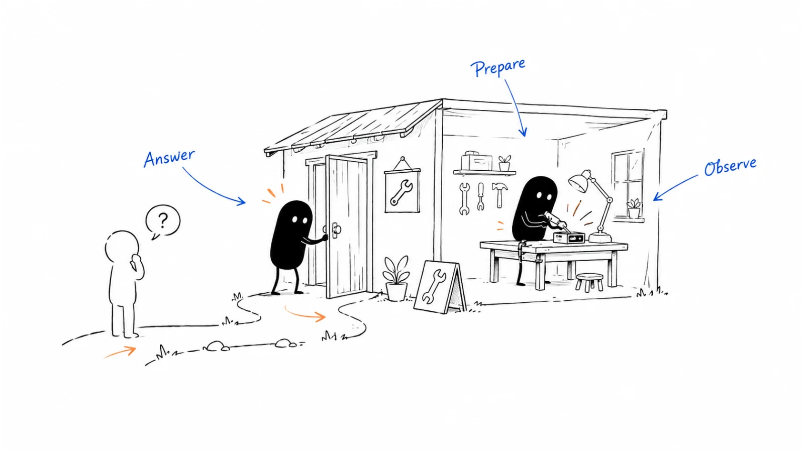

**Last reviewed:** 2026-09-08 · **Reading edit:** 2026-09-08

**Reading edited:** 2026-09-11

The team has spent the morning refreshing the leaderboard. Someone posts a screenshot in the company chat. There are new comments, a burst of traffic, and a signup notification every few minutes.

Meanwhile, a new user cannot get past the verification email. Another has signed up expecting a capability that is still on the roadmap. A third looks like exactly the right customer, but nobody has answered their question.

A Product Hunt launch can create a useful moment of attention. The work is turning that moment into a clear product experience, useful learning, and appropriate follow-up.

That can include acquiring customers. It can also include finding early users, testing whether people understand the product, or starting relationships with practitioners. The mistake is not measuring acquisition. It is treating a leaderboard position as if it already measures acquisition.

This guide covers the decision to launch, the product and page preparation, the operating plan for the day, and the weeks that follow. It is not a recipe for a particular rank, and it does not require you to abandon other ways of reaching customers.

*Reading guide: decide whether the audience fits → prepare a usable experience → explain the product → run the day → follow what happens next.*

Before spending time on a campaign, read [platform fit](#check-the-current-featuring-rules). If you have picked a date, start with [the new-user rehearsal](#step-2-test-the-product-with-new-users). For a live launch, use [the day-of operating plan](#run-the-day-with-a-small-operating-plan). The [worked example](#worked-example-illustrative) connects the preparation to a realistic review.

## Use this when

You have something people in a product-discovery community can understand, explore, or use, and there is a plausible connection between those people and your intended users.

Developer tools, design products, productivity software, and founder-facing software may attract relevant attention, but a category label alone does not establish fit. Read comparable launches and ask actual customers whether they use the platform.

The product can give a credible account of its current state. A visitor should be able to tell what exists, who it helps, what access costs, and what requires additional setup or contact.

Your team has enough capacity to receive the attention. That may mean a few people sharing responsibility, or a solo founder with a modest plan and stated response windows. It does not require someone to stay awake for every minute of the platform's daily cycle.

You can define a useful outcome within a budget you can afford. A first launch does not require ten existing customers, a professional launch video, or a famous person to submit it.

## Do not use this when

You are relying on a high rank to solve an unclear product, missing onboarding, or an immediate revenue emergency.

You plan to buy votes, manufacture comments, trade engagement, or hire someone who promises a leaderboard position. Those are not launch preparation tasks.

Your main goal is access to a specific buying committee whose members are unlikely to encounter or use the product here. A direct conversation, industry event, specialist publication, or partner introduction may be more useful.

You only have a signup form but are planning the budget around homepage distribution. Check the platform's eligibility guidance before assuming that a teaser will receive the same treatment as an available product.

If you are coordinating a broader market release across sales, customers, press, partners, and product availability, use [Product launch](../02-product-marketing/product-launch.md) as the overall plan. Product Hunt can be one part of that release, not a replacement for it.

## A few useful terms

A **maker** is someone who helped create the product. A **hunter** is the person submitting it. They can be the same person.

A **launch** is the particular release or announcement. The product's longer-lived presence and the launch-day conversation serve different purposes; keep the correct link in each part of your plan.

**Featured** means selected for the platform's featured distribution. Submission, approval, and featuring are not interchangeable promises.

**Activation** is a defined first useful action, such as completing a supported task. Account creation is usually an earlier step.

A **cohort** is a defined group observed over time. For example, new accounts attributed to the launch under a stated rule, excluding accounts that already existed.

**Qualified** needs a local definition. It might mean a person has the relevant role and use case, or that a team meets your requirements for a pilot. It should not mean “they left a positive comment.”

A **relaunch** is a later submission involving an existing product or company. It has platform-specific conditions, not just a new date in the marketing calendar.

## Keep this in mind

Plan a concentrated launch effort and a proportionate follow-up period. End the special launch-day staffing when it is no longer needed, but keep serving users and measuring the source while it remains useful.

You do not need to erase Product Hunt from your CRM the next morning. If it brings identifiable inquiries or ongoing referral traffic, preserving that information helps you learn.

You also do not need to keep a launch campaign running indefinitely because it once received attention. Review what is happening, what work it requires, and what another activity could achieve with the same resources.

A launch page can show that you released something and how people responded. It is not, by itself, proof that the product is reliable, buyers receive a return, or the business has product-market fit.

## How to do it

### Step 1: Define a useful launch outcome

Start with the business situation rather than the badge you want.

A new product might need people to try one workflow and reveal where they get stuck. A mature product releasing a substantial capability might want the right practitioners to understand what changed. A self-serve business might want to test whether the resulting users activate and pay.

Pick a primary purpose, then a few supporting observations. “Acquire suitable trial users while learning where onboarding fails” is coherent. You can measure both without pretending they are the same outcome.

Set a spending and effort limit. Include preparation, design, product changes made specifically for the launch, support, and follow-up. A free submission does not make the campaign free to run.

#### Check the current featuring rules

Product Hunt's [featuring guidelines](https://help.producthunt.com/en/articles/9883485-product-hunt-featuring-guidelines?ref=b2b-playbook), dated March 10, 2026, focus on available products and consider usefulness, novelty, craft, and creativity. They list categories not featured, including directories or lists, templates, reports, and services, and exclude waitlists without immediate access. The page's broad opening also mentions digital services, so do not infer that every service business qualifies from that sentence alone.

Use those conditions to check your intended submission, not to predict approval. If the category is ambiguous, seek clarification before investing heavily. Do not rename a consultancy as software to fit a category.

The separate [unreleased-product guidance](https://help.producthunt.com/en/articles/484932-can-i-submit-an-unreleased-product?ref=b2b-playbook) allows that some pre-launch submissions may be considered, but says an email-signup-only product is not homepage eligible. A public demo can help someone understand an offer; it is not an automatic exception to featuring criteria.

A curated knowledge library, a report, and an interactive software product are different offerings. If you are launching a resource collection, evaluate it as that collection rather than assuming GitHub hosting makes it a software launch.

#### Decide whether the audience can do something meaningful

For a self-serve product, the path may be straightforward: visit, sign up, try the task, decide whether to continue.

For a product that normally involves sales or implementation, the visitor may need a public demonstration, a realistic sample environment, or a clearly described evaluation path. Sales assistance is not inherently a reason to dismiss the audience. However, a call-only experience may make immediate exploration harder and may not fit the platform's distribution priorities.

Make the access conditions explicit. If only a certain region, integration, or team type is supported, say so. If setup takes an hour, do not make a two-minute screen recording imply otherwise.

A small and accurately described experience is preferable to a broad promise nobody can fulfill. It also gives you something concrete to evaluate afterward.

#### Write the decision you want to make afterward

Instead of “Get 500 upvotes,” write something like:

“We want to know whether relevant operations users can complete the sample workflow without founder assistance, and whether some choose to try it with their own permitted data.”

That suggests a product event, a support record, and a follow-up question. It does not require a claim that every visitor is a buyer.

If acquisition is the main objective, define the funnel and acceptable cost before launch. If learning is the main objective, identify the uncertainty and the decision it will inform. “We learned a lot” is weak unless the team can name what changed.

You can record rank and votes as platform observations. Keep them in their own row rather than using them as the definition of success.

*The following conversation is invented.*

**Founder:** “If we do not finish near the top, was the launch a waste?”

**Marketer:** “Not necessarily. We might learn that the right users can use the product and want to continue.”

**Founder:** “And if we finish first but nobody returns?”

**Marketer:** “Then we earned attention, but we have not yet shown that the attention was useful to the business.”

#### Consider the opportunity cost

A launch can take as much preparation as a small campaign. Ask what you would otherwise do with that time.

If the first-use experience is broken for existing customers, fixing it may matter more than making a new gallery. If the product is usable and the team lacks fresh feedback, a bounded launch may be worthwhile even before revenue is established.

Avoid a false choice between “launch everywhere” and “never launch until everything is perfect.” You can choose a narrow audience, a smaller announcement, or a later date.

### Step 2: Test the product with new users

The most important rehearsal starts outside your own logged-in account.

Ask someone who has not seen the setup process to begin at the public landing page. Watch where they hesitate and what they think the product will do. Explain only when you would have a support person explain in the real experience.

A friendly tester who knows the product can be useful, but they may fill in missing steps without noticing. Include people with the relevant work context who do not already know your internal vocabulary.

There is no magic number of rehearsal users. A few can expose obvious failures; they cannot establish a statistically reliable conversion rate.

#### Walk through the entire first-use path

Check the page, signup, email verification, login, empty state, sample data, core task, result, and next step.

Test the paths you will actually offer. If a visitor chooses a free plan, do not silently send them into a paid-only flow. If a credit card is required, make that clear before they invest time. If an invitation needs manual approval, tell them what happens after requesting it.

For software used at work, include the likely constraints. A company may block an OAuth app, restrict installation, or prohibit uploading customer data into an unapproved tool. An approved sample mode can help people explore without asking them to ignore those rules.

Record each issue with its effect on the user. “Button spacing” and “cannot access the result” should not receive the same urgency merely because both appear on a checklist.

#### Define the first useful action

Choose an action that reflects the promise of the product.

For a request-preparation tool, exporting a usable sample request may be meaningful. Opening the dashboard is weaker evidence. For a monitoring product, configuring a relevant watch and understanding an observed result may matter more than browsing a list of companies.

A product can have several routes to value. Define which route the launch is emphasizing and keep other valid actions visible in the analysis.

Do not create an artificial event just because it is easy to count. A forced welcome click does not become activation by giving it that name.

Keep completion separate from quality where necessary. A user may generate an output that is inaccurate, incomplete, or inappropriate for the task. Plan a way to learn about that without collecting more sensitive content than you need.

#### Prepare a truthful product story

The page should explain the product through a small number of concrete questions:

What is it? Who is it for? What can someone do with it now? What remains outside its scope? What does using it cost?

Write a description that a relevant practitioner can repeat in their own words. If they describe a different product, revise before paying for more reach.

For an AI product, explain the actual action rather than using “agent” as the whole description. Does it draft, classify, recommend, monitor, or execute? Where does a person review the output? What data is required? What happens when it cannot complete the task?

If people are doing substantial work behind the interface, distinguish that service from the software's capability. A launch is a poor time to create expectations the team will spend months correcting.

#### Build a compact set of launch assets

Treat the listing as an explanation with a sequence, not a miniature pitch deck.

The first gallery image can establish the job and the product's role. The next can show the real workflow or output. Additional images should answer specific questions, not repeat the same promise with different gradients.

Use readable interface details and captions. A screenshot covered with tiny annotations may look impressive at full resolution and become useless in the actual listing.

The [posting instructions](https://help.producthunt.com/en/articles/479557-how-to-post-a-product?ref=b2b-playbook) describe the submission fields, recommend a square thumbnail and a 1270×760 gallery, and require at least two gallery images for display. They also describe full, non-private YouTube links for video. Check the live form before exporting final assets.

Prepare a short description and a slightly longer version. The official [preparation guide](https://www.producthunt.com/launch/preparing-for-launch?ref=b2b-playbook) and posting help currently disagree on the description limit, so the live form should settle the usable limit. Do not build a campaign around an unverified character count.

A video is optional. If you use one, show the actual task, keep text readable, provide captions where appropriate, and label samples or edited waiting time. A modest accurate demonstration is more useful than a cinematic promise of nonexistent behavior.

#### Write a first comment with something to discuss

The first comment should sound like someone who made the product and is ready to talk about it.

Explain the problem that led to the product, the available scope, and one or two questions on which feedback would be useful. Mention the team honestly. Avoid a generic founder story that could sit beneath any app.

You can invite people to try the product and describe where it helps or fails. Do not ask them to perform enthusiasm.

Useful questions are specific: “Was the missing-context warning understandable?” or “Which part of your current handoff would this leave unresolved?” A broad “What do you think?” may still work, but it gives people less to start with.

Do not paste an AI-generated wall of thanks and adjectives. Use assistance to edit a real explanation, then have a maker check the facts and tone.

#### Plan access, pricing, and capacity together

A launch discount is optional. If you offer one, state eligibility, duration, what is included, and what happens afterward. Do not condition access or benefits on voting.

Be particularly careful with lifetime offers or expensive AI usage. A surge of discounted signups can create an ongoing delivery obligation. Model the actual support and compute needs before announcing an offer.

If capacity is limited, describe the limit honestly and offer a clear next step when it is reached. Do not display artificial scarcity to create urgency.

An unavailable product should not keep presenting a working “start now” path. If you need to pause access, update the destination and explain the situation to people already affected.

#### Prepare the operational fallback

Know who can fix login, billing, permissions, and a broken primary workflow. Decide what can be paused safely and how users will be informed.

For a solo founder, this might be a simple incident note, a support inbox, and a list of functions that can be disabled independently. For a larger team, it may involve existing incident response and customer support procedures.

Do not conduct a risky production migration simply to make the launch screenshot cleaner. Freeze nonessential changes before the event if that helps the team maintain a reliable experience.

The fallback does not need to predict every problem. It needs to stop the team from improvising a dangerous response under public pressure.

### Step 3: Prepare to answer questions

The day goes better when you prepare the people and the handoffs, not only the announcement copy.

Someone should own the public conversation, someone should be able to address product problems, and someone should notice relevant inquiries. Those may be three people or three responsibilities held by one person.

Give each responsibility a response window and a backup where possible. “Everyone keep an eye on it” often means nobody notices the problem until it has been copied into another chat.

#### Set up the right account and submission path

Use a real personal account and confirm posting access ahead of time. Product Hunt's [company-account guidance](https://help.producthunt.com/en/articles/484973-can-our-company-account-vote-comment-or-post-on-product-hunt?ref=b2b-playbook) says company accounts cannot participate through votes, comments, or forums. The posting guide also calls for a personal account and completed onboarding for new users.

You can submit your own product. An outside hunter is not a required gatekeeper, and their follower count should not become your launch strategy. Product Hunt explicitly [permits self-posting](https://help.producthunt.com/en/articles/479581-can-i-post-my-own-product-on-product-hunt?ref=b2b-playbook).

If someone else is genuinely submitting a product they found useful, coordinate factual details and maker attribution. Do not buy the submission. The platform's [overview](https://www.producthunt.com/launch/how-product-hunt-works?ref=b2b-playbook) prohibits paid hunting or traffic schemes and distinguishes its legitimate advertising from leaderboard placement.

Check whether the product or company has appeared before. Do not create duplicate listings or a new domain to evade the relaunch process.

#### Use a draft before committing the date

The dedicated [Launch Now update](https://help.producthunt.com/en/articles/9823193-where-did-launch-now-go?ref=b2b-playbook), dated February 24, 2025, says that immediate launch was replaced by draft creation and scheduling. Some older overview copy still mentions Launch Now; use the specific update and current interface.

The [scheduling help](https://help.producthunt.com/en/articles/2724119-how-to-schedule-a-post?ref=b2b-playbook), dated February 2, 2026, describes choosing a date within the next 30 days. It also says scheduled posts can be edited and are not open for voting before launch.

Visibility is a separate setting. The [June 30, 2026 sharing instructions](https://help.producthunt.com/en/articles/15706445-how-to-share-a-scheduled-launch?ref=b2b-playbook) say scheduled launches are restricted to associated makers and team members by default, with an option to make them viewable by anyone with the link.

Do not assume a draft is a public teaser or send an access-restricted preview as if it were a live launch. Test the intended sharing state before sending the link to anyone outside the team.

#### Choose a date you can support

Choose a date around product readiness, customer availability, and the people who must be present. If the launch is part of a broader release, check embargoes and other commitments.

There is no reliably best weekday for every product. You cannot know all competing launches, news events, or audience distractions. Spend more effort on the experience you control than on predicting the day's competition.

The posting help describes the daily launch cycle using 12:01 a.m. PST. Before coordinating a global team, confirm the scheduled instant shown by the platform and convert that actual date and time for each location. Do not reuse a fixed Shanghai-to-U.S. conversion across the year or assume every source uses PST and Pacific daylight time consistently.

Plan coverage around the confirmed schedule. You can use handoffs and sensible response windows instead of requiring the whole team to stay awake overnight.

#### Share the launch without organizing votes

Product Hunt's [sharing guidance](https://help.producthunt.com/en/articles/2690626-how-do-i-share-my-post?ref=b2b-playbook) welcomes organic links and relevant discussion but rejects mass vote requests, rewards for votes, and coordinated voting. Its [upvote-request policy](https://help.producthunt.com/en/articles/484935-can-i-ask-my-community-friends-family-to-upvote-a-product?ref=b2b-playbook) also says not to ask friends or a community to vote.

Make your announcement about the product and the feedback you want. “We have released the sample workflow and would value your thoughts” is different from “Everyone vote at midnight.”

Share in places where the update is relevant and promotion is allowed. A launch does not override a community's rules or turn every contact into an outreach recipient.

Ask existing users for authentic product feedback if that is appropriate to the relationship. Do not supply a script that makes them sound like independent strangers, and do not make a reward depend on a positive comment.

An agency may help with design, copy, project management, or product preparation. Do not confuse those services with a package selling votes, hunter access, guaranteed rank, or manufactured launch traffic. Clarify the methods before paying.

#### Run the day with a small operating plan

| Moment | Main job | Owner and handoff |
|---|---|---|
| Before the scheduled start | Check access, materials, product health, and support routes | Launch owner confirms readiness |
| When the post appears | Verify the live listing and actual visitor path | Launch owner escalates publication issues |
| During staffed windows | Answer questions and resolve first-use problems | Maker and product/support owner |
| At a handoff | Summarize unresolved problems, promises, and inquiries | Current owner gives context to the next |
| After the concentrated window | Close special staffing and preserve follow-up work | Launch owner assigns remaining actions |

This is a teaching schedule, not a requirement to check the page every few minutes. Adapt it to the expected attention and the team.

When the post goes live, check the actual page. Verify the product link, gallery, description, maker names, pricing, access state, and first comment. Open the visitor destination as a new user.

Then stop treating the leaderboard as an operations dashboard. Product health, unanswered questions, and access failures should be easier to notice than rank changes.

Keep a short shared record of issues and promises. If someone says a bug will be fixed tomorrow, the person doing that work needs to know.

#### Answer the question behind the comment

A short question may reveal an important misunderstanding.

“Does this replace our engineer?” is not an invitation to repeat your tagline. Explain the actual boundary: what the product prepares, what a person reviews, and what it cannot execute.

A comparison question deserves a specific answer about the relevant use case, not a blanket claim that every alternative is outdated. If you do not know a competitor's current behavior, say what you can verify about your own product.

Thank people for praise without filling the thread with repetitive replies. Give difficult questions enough detail to help the next reader too.

*The following conversation is invented.*

**Visitor:** “Can I connect this to production and let it make the correction?”

**Maker:** “No. This release helps prepare the request. It does not approve or execute changes.”

**Visitor:** “Then what should I try first?”

**Maker:** “Use the fictional sample to see which context is missing, then export the prepared request. No production access is needed.”

If a question includes account details, billing information, or sensitive records, move the troubleshooting to an appropriate private support channel. Explain the public outcome later without exposing the person's information.

<Accordion title="The product is live but it is not featured">

Check the actual listing state and the current eligibility guidance before assuming there is a technical error.

A submitted product can exist without receiving featured distribution. A high vote count does not create an entitlement to a particular placement, and featuring is not a verdict on the long-term value of the business.

Look for a material factual omission or a real problem: an incorrect access state, a broken destination, or missing context that changes how the product is understood. If there is critical information the reviewers did not have, use the official support route with that information.

Do not repeatedly message staff, delete and repost to reset the day, or purchase engagement to force a different outcome. If the launch is functioning, continue answering the people who do arrive.

At the review, record the distribution you actually received. A limited-distribution launch may not answer a question about broad demand, but it can still reveal whether visitors understand and use the product.

</Accordion>

#### Handle incidents before polishing the celebration

If signup is failing, pause promotional activity that sends more people into the failure. Keep the product's status and support path clear.

If the issue risks data or account security, follow your existing incident process. A public launch is not a reason to bypass access controls, request passwords, or expose private records in a comment thread.

A short factual update can say what is affected, what users should do, and when the next update will be available. Do not promise an exact repair time unless the team has a basis for it.

Once the issue is resolved, confirm the affected path works for a new user. Follow up with people who asked for help through the appropriate channel. Do not assume that restoring the homepage repairs everyone's unfinished signup.

#### Use AI to reduce administration, not simulate a community

AI can help cluster questions, draft a handoff summary, or turn approved product facts into reply options. Review the output before using it.

It should not create fake accounts, customer experiences, maker identities, votes, or enthusiastic comments. It should not answer a technical question confidently when the team has not verified the answer.

For a small launch, a shared note and a human who understands the product may be enough. Add automation only where it helps the real work.

Keep private support information out of public replies and unapproved external tools. The public thread and the support queue are related, but they are not the same dataset.

### Step 4: Review the signups after launch

The next morning is the beginning of the review, not the end of the product relationship.

Separate visitors, accounts, meaningful use, suitable inquiries, existing customers, and paid outcomes. A spike may contain all of them.

Do not call everyone outside the target segment a tourist. Some are curious learners, potential collaborators, future users, or practitioners with a valid adjacent need. They may not belong in a sales queue, but they do not need to be treated as a problem to eliminate.

Use qualification to allocate help and follow-up appropriately. A person's lack of buying authority does not make their usability feedback worthless.

#### Preserve source data with honest limits

Keep Product Hunt as a source where the data supports it. Document the rule: referrer, first tracked visit, a self-reported answer, or another observable signal.

The preparation guide says the primary submission URL should be direct and excludes shortened or tracking links. Do not automatically append campaign parameters to that field. Use a clean canonical product URL and verify the live form's requirements.

Elsewhere, use permitted campaign tracking where appropriate and test it. Separate direct traffic from the launch page, your own announcements, and other concurrent activity when you can. A broader release may involve several influences.

Do not pretend analytics identifies every visitor. Referrers may be missing, people may return later, and visits may happen on different devices. A person who upvoted is not automatically the person behind a signup.

Record a self-reported source as a person's account, not as proof that all other channels had no influence.

#### Follow up according to what someone actually did

A person who requested assistance should receive it. A new user who opted into onboarding can receive relevant guidance. A suitable team that asked about an evaluation can enter the appropriate sales process.

Someone who merely voted or commented has not thereby requested an email sequence. Do not scrape participants into outbound lists.

A useful welcome message refers to the task, not the leaderboard. “Did the sample help you prepare your own request?” is more useful than “Thanks for helping us reach number three.”

For account problems, keep follow-up focused on the issue. For marketing messages, respect the permissions and preferences that apply. Ask the appropriate privacy or legal owner when the planned use is unclear.

#### Turn questions into product and content work

Group the questions by what they reveal.

Some indicate missing explanation. Some reveal unsupported use cases. Some are actual defects. Some suggest a potential direction that needs more evidence.

Assign an owner and a next step. A frequently asked integration question may deserve a clear support-status note today and product research later. It does not automatically justify adding the integration to the roadmap.

Update the landing page, documentation, or onboarding when the evidence supports it. A launch thread is a useful source of reader language, but it is not a representative survey of your market.

Keep the date and context of the observation so a future reader knows which version of the product people were discussing.

#### Watch a cohort long enough to observe use

Define the event and the time window before calculating retention.

For example, you might observe whether accounts that completed a first task return to complete another within seven days of their own first completion. If some accounts have not yet had seven days, do not count them as failures or include them in a fully observed denominator.

That behavior may still be only a proxy. A monthly workflow should not be judged solely by daily usage. Choose a window that matches the job.

Look at the relevant segment as well as the total. A product may activate a broad group poorly but serve one intended use case well—or attract many enthusiasts while failing for the intended team.

Small cohorts remain noisy. Use the results to decide what to investigate, not to announce a universal retention benchmark.

<Accordion title="There are many signups but very little meaningful use">

Check whether the event is recording correctly and whether every counted account had a real opportunity to use the product.

Then inspect the path between signup and the first useful action. People may be waiting for approval, missing an integration, confused by an empty state, or unable to use work data under company policy.

Compare suitable and unsuitable use cases where you have reliable information. If the intended users also stop at the same step, an audience explanation is not enough.

Ask a few people who are willing to talk what they tried to do. Avoid a leading question such as “Was the setup too complicated?” Let their account identify the problem.

You may decide to improve onboarding, narrow the promise, offer a better sample, or stop investing in this source. A larger second traffic spike will not by itself repair the first-use experience.

</Accordion>

#### Close the event without deleting the learning

At an agreed review point, end the launch-specific staffing and spending. Keep unresolved customer work in the normal operating system.

Retain a short launch record: what was available, what was published, what distribution occurred, what users did, what it cost, and what changed as a result.

Use any award or quoted response accurately and with appropriate permission. State the relevant date or category rather than turning a launch badge into a claim of overall market leadership.

A later launch needs a new reason. The [July 7, 2026 relaunch guidance](https://help.producthunt.com/en/articles/484934-can-i-relaunch-my-product?ref=b2b-playbook) calls for a significant update and generally a six-month gap for the same product or company, including root-domain restrictions. Earlier launches require review; approval does not guarantee featuring. Cosmetic or pricing-only changes are not presented as sufficient.

Treat that as a planning constraint, not an invitation to disguise repeated submissions. If eligibility is unclear, clarify it before making another campaign calendar.

The useful question is what has changed for users—not whether the team would enjoy another day of notifications.

## Worked example (illustrative)

This example is entirely fictional. It is not a Lensmor launch, a report from an actual Product Hunt account, or a claim about expected launch performance.

Earlier chapters use an assisted request-preparation service as a teaching business. For this example only, imagine that the team separately builds a small, usable software workspace. People can complete a fictional correction request, see missing-context prompts, and export a structured draft.

That software is not the same thing as the human-assisted service. It does not approve requests or execute production changes. The example assumes the team has checked the applicable submission requirements; it does not assume that a software interface guarantees featuring.

### The decision before the launch

The team wants to learn whether operations practitioners can understand and complete the request workflow without a founder explaining each step.

It also wants suitable users to consider a paid workspace, but it does not expect one day to prove a repeatable acquisition channel.

The founder limits the project to a manageable preparation effort, a modest external production budget, and staffed support windows. Existing customer work continues.

The team does not hire a hunter. The founder prepares the post from a personal account and credits the actual co-maker.

### The rehearsal changes the plan

A new tester reaches an empty screen and assumes the product requires a production integration. Another completes the form but cannot find the export.

The team adds a clearly labeled fictional sample and makes the next action easier to find. It also rewrites the opening explanation to say that no production connection is required for the sample.

The first attempt at a tagline says, “Automate operations with AI.” The revised working line is, “Prepare clearer correction requests before review.”

The point is not that this is a perfect slogan. It is that the revised line describes the available task instead of promising autonomous execution.

The description explains the workspace, the missing-context prompts, and the export. The gallery shows the sample input and the resulting draft. The team leaves product-specific legal and security claims out unless they can support them.

### The first comment

The fictional maker comment reads:

“We built this after seeing how often a correction request reaches engineering without enough context to review it. This first version helps you assemble one supported type of request and export a draft. It does not approve the request or make production changes.

“You can try the fictional sample without connecting a live system. We would especially like to know whether the missing-context prompts make sense and what information your reviewer would still need. The sample is free to explore; the pricing page explains the paid workspace.”

The invitation asks people to try and discuss the work. It does not ask for a vote or offer a reward for one.

### The launch-day response

After the listing appears, the team checks the public link, images, pricing, and sample flow. During the first staffed window, several people ask whether the workspace can execute corrections.

The maker answers directly and puts the limitation closer to the top of the landing page. The team records the misunderstanding for the next messaging review.

A verification-email delay then affects some new accounts. The team pauses its next announcement, adds a support update, and investigates. It resumes the announcement only after testing the affected path again.

*The following conversation is invented.*

**Teammate:** “We are getting more visits. Should we send the next announcement now?”

**Founder:** “Not while the verification path is failing.”

**Teammate:** “But we might miss the busy part of the day.”

**Founder:** “Sending more people into the same failure is not useful distribution. Fix the path, then continue.”

The team answers appropriate inquiries and keeps unresolved issues in a shared note. It does not message voters or pressure customers to participate.

### The measurement setup

For this teaching exercise, the team defines the launch cohort as new accounts attributed to Product Hunt under its documented first-tracked-referral rule. Existing accounts and duplicate submissions are excluded.

This is an attribution convention, not proof that Product Hunt was the only influence. Other announcements may have helped people notice or remember the product.

Activation means completing and exporting a sample request. It does not establish that the output is suitable for production or that a real engineer accepted it.

Repeat use means completing another request within seven days of that account's first completion. The review waits until every activated account in the cohort has had the full observation window.

### What the team observes

The site records 1,000 Product Hunt-referred sessions during the defined launch window. Those are sessions, not confirmed unique people.

There are 140 signup records associated with the launch analysis. After removing 12 records linked to existing accounts and eight duplicate submissions, the team has 120 new accounts in the defined cohort.

Eighty of the 120 start the sample workflow. Forty-eight complete and export it.

Those counts support two different rates: 48/120 = 40% activation among new accounts, and 48/80 = 60% completion among accounts that started. Calling both “conversion” without a denominator would hide where the drop-off occurred.

Using voluntarily provided information, the team identifies 30 accounts with the intended use case, 50 with a different use case, and 40 whose fit is unknown.

The 48 activated accounts include 18 from the intended group, 20 from the different-use group, and 10 from the unknown group. Intended-use activation is therefore 18/30 = 60%, compared with 40% overall.

That difference is worth investigating. It does not mean the unknown group is unqualified, or that a small observed sample has established product-market fit.

### The later review

Once all 48 activated accounts have a complete seven-day observation window, 12 have completed another request within that window.

Repeat use is 12/48 = 25% among activated accounts, or 12/120 = 10% of the original new-account cohort. These are different denominators, not conflicting answers.

Six new accounts have paid for the first month by the commercial review date: four from the intended-use group and two from the different-use group. That is 6/120 = 5% paid conversion for the defined new-account cohort at that date.

The team does not yet know renewals, annual retention, or lifetime value. Payment is real within the fictional example; it is not proof of long-term fit.

### The cost review

The team spent &#36;300 in external production costs and 20 internal hours. For planning, it values those hours at an assumed &#36;50 each.

| Observation | Calculation | What the number means |
|---|---|---|
| Cash launch spending | &#36;300 | External production only |
| Allocated planning cost | 300 + 20 × 50 = &#36;1,300 | Includes an assumed value for internal time |
| Cost per activated account | 1,300 / 48 ≈ &#36;27.08 | Descriptive ratio using the defined cohort |
| Cost per paid account | 1,300 / 6 ≈ &#36;216.67 | Observed campaign ratio, not causal CAC |
| First-month revenue | 6 × 30 = &#36;180 | Assumes all six paid the fictional monthly price |
| Contribution before launch cost and other overhead | 180 − 36 = &#36;144 | Uses &#36;36 in direct delivery cost for these accounts |

The &#36;144 contribution has not covered either the &#36;300 cash spending or the &#36;1,300 allocated planning cost.

The shortfall is &#36;156 against cash launch spending and &#36;1,156 against the allocated view. Those views answer different cost questions. Neither should be presented as audited company profit.

The team does not multiply the first month's contribution by twelve and call the campaign profitable. It has no evidence yet that all six accounts will remain, pay the same amount, or cost the same to serve.

### What changes next

The team ends the launch-specific staffing. It keeps the Product Hunt source in reporting and continues helping the users.

It prioritizes the verification path, the explanation that no production connection is required, and research into why intended-use accounts activated more often. It also asks willing users what they needed after exporting the first request.

It does not plan an immediate relaunch to get a better rank. The product needs meaningful improvement and the next release must meet the platform's current conditions.

The launch produced some paid users and useful observations, but it has not yet demonstrated profitable acquisition. That is a more actionable conclusion than either “Product Hunt works” or “Product Hunt is useless.”

## Copy: launch card (fill)

Use the plan to coordinate the actual experience, not only the public announcement.

~~~text
PRODUCT HUNT LAUNCH PLAN

Product / release / current availability:
Intended user and first useful task:
Primary purpose and decision this launch should inform:
Platform eligibility checked on / remaining questions:
Previous launches / relaunch requirements:

Account and maker details:
Draft visibility and approved sharing state:
Confirmed launch instant / local team times:
Public product URL and access conditions:
Listing copy, gallery, demo, pricing, and first comment:
First-use rehearsal issues and readiness decision:

Announcement channels and community permissions:
Public conversation owner / response windows:
Product and support owner / backup:
Incident path / conditions for pausing announcements:
Unresolved questions and handoff location:

Source definition and known attribution gaps:
New-account / activation / fit definitions:
Observation windows and review dates:
Cash budget / internal effort budget:
Follow-up permissions and owner:
When special staffing ends:
~~~

Use a separate review once the relevant observation windows are complete.

~~~text
PRODUCT HUNT LAUNCH REVIEW

Release and launch date:
What users could actually access:
Distribution received / featuring or delivery limits:
Published page and any corrections:

Visitor metric and definition:
New-account cohort rule:
Existing accounts and duplicates excluded:
First useful action:
Started / completed / fully observed for repeat use:
Known fit / different use / unknown:
Paid outcomes to date / still pending:
Reported rates with denominators:

Cash spending:
Internal hours and valuation assumption:
Direct customer-delivery costs:
Revenue observed / costs or outcomes still unknown:

Product issues and owners:
Useful questions and content changes:
User follow-up still owed:
Continue / improve / stop additional promotion:
Why this decision / what would change it:
Normal owner after launch staffing ends:
~~~

## Before you start

A relevant new user should understand what is available and how to try it. The team should have tested that path without relying on an already configured account.

The listing should describe the real product, not the roadmap. Current eligibility, access, schedule, and sharing state should be checked rather than assumed from an old launch checklist.

Someone should be responsible for questions, incidents, and the people who ask for help. Announcements should respect both Product Hunt's rules and the rules of the communities receiving them.

Finally, the measurement plan should distinguish attention from use and use from a sustainable business result. If you cannot explain the denominator, do not put the percentage in the launch recap.

## Metrics

Keep the report short enough to inform a decision. A dashboard full of launch activity can still miss the only question the team needed to answer.

| Question | Useful measure | Important limit |
|---|---|---|
| Did people encounter the launch? | Defined listing activity or referred sessions | Not necessarily unique people or buyers |
| Did they begin using the product? | New accounts and task starts | Exclude duplicates and existing accounts where appropriate |
| Did they reach the promised first result? | A defined activation event | Completion may not establish output quality |
| Did relevant users receive value? | Fit-segment activation and willing-user feedback | Missing fit data is unknown, not failure |
| Did they come back or pay? | Fully observed repeat use and dated paid outcomes | Not lifetime retention or incremental revenue |
| Was the effort justified? | Cash, internal work, contribution, and decision value | Do not invent asset value to rescue the result |

### Keep rank and votes in context

The [homepage ranking explanation](https://help.producthunt.com/en/articles/484938-how-is-the-homepage-ranked?ref=b2b-playbook) says ranking uses points and that one vote does not always equal one point. Product Hunt does not disclose all factors.

Do not reverse-engineer a guaranteed launch formula from a handful of public examples. A successful product may have an existing audience, different distribution, or an unusually suitable release.

A rank can be worth recording and celebrating accurately. It should not substitute for the user and business observations in the table.

### Avoid mismatched funnels

A session-based visit count, an account count, and a company-level opportunity count are not interchangeable units.

You can report all three, but explain how they connect and where they do not. Do not label an accounts-per-session ratio as the percentage of people who converted if you cannot identify distinct people.

Keep the reporting window consistent or label differences. Launch-day traffic and three-month sales outcomes may both matter, but they should not be silently presented as if collected over the same period.

For B2B, several people may belong to one buying team. A larger number of user accounts does not automatically mean a larger number of potential customers.

### Separate learning from proof

A few clear comments can identify a confusing phrase. They cannot establish market-wide demand.

A cohort can show what happened to the users you observed. It cannot tell you what the same business would have achieved without launching unless you have a credible comparison.

Use uncertainty to choose the next action, not to avoid a decision. You can stop a campaign with limited data when the cost is too high, or continue a bounded test when there is a specific reason to learn more.

## Common mistakes

**Optimizing the badge before the experience.** A broken first-use path wastes relevant attention. Rehearse the product before polishing the celebration.

**Treating submission as guaranteed distribution.** Check eligibility and record what actually happened. A live page is not a promise of featuring.

**Buying or coordinating votes.** A launch should invite genuine interest, not manufacture platform signals.

**Hiding access requirements.** If the product requires approval, a paid plan, or an implementation step, say so. A misleading self-serve promise attracts the wrong expectations.

**Removing Product Hunt from reporting on principle.** Retain useful source information while acknowledging attribution limits.

**Calling all unmatched signups worthless.** Separate buying fit from legitimate learning and feedback. Unknown fit is not a rejection category.

**Leaving the campaign permanently in launch mode.** Move users into normal support and onboarding, and return the team to its next priorities.

**Treating a new tagline as a relaunch.** A later submission needs substantive user value and compliance with current platform requirements.

## What to read next

Use [Product launch](../02-product-marketing/product-launch.md) for the wider release plan, and [Channel strategy](https://b2-b-playbook.mintlify.app/playbooks/04-channels-and-distribution/channel-strategy) to compare Product Hunt with other ways to reach buyers.

If the first-use explanation is weak, read [Messaging](../02-product-marketing/messaging.md) and [Demo](../02-product-marketing/demo.md). Questions that deserve a permanent answer can feed [Content strategy](../03-brand-story-and-content/content-strategy.md).

For early customer work, continue with [First ten customers](../01-strategy-and-buyers/first-ten-customers.md). To judge whether users receive recurring value, read [Product-market fit](../01-strategy-and-buyers/product-market-fit.md).

[Community](https://b2-b-playbook.mintlify.app/playbooks/04-channels-and-distribution/community) covers ongoing participation beyond a launch. [Creator partnership](https://b2-b-playbook.mintlify.app/playbooks/04-channels-and-distribution/creator-partnership) covers collaboration with publishers; it is not permission to buy Product Hunt engagement.

## Sources and evidence boundary

Primary Product Hunt materials were checked on September 8, 2026. The links throughout this chapter identify the specific policy or feature being discussed.

The March 10, 2026 featuring guidance, February 2 scheduling help, June 30 scheduled-sharing instructions, and July 7 relaunch guidance provide dated references. The dedicated Launch Now update explains a workflow change that older overview copy still misses.

The general preparation guide and posting help disagree on the description limit. This chapter does not select an unsupported universal limit; readers should verify the current form. Timezone wording also requires checking the actual scheduled instant rather than assuming a fixed local conversion.

Platform guidance is not independent evidence that a launch generates customers or proves product-market fit. No rankings, traffic exports, private accounts, or live submission settings were audited for this article.

The operating plan, templates, conversations, and numerical example are original teaching material. All example results and prices are fictional. No Lensmor launch was conducted or reported here, and no Product Hunt post, message, or vote was created while writing this chapter.

---

Copyright © 2026 Ivan Xu. All rights reserved. See the [copyright and reuse terms](https://github.com/weilun88313/B2B-Playbook/blob/main/LICENSE).

Canonical source: [github.com/weilun88313/B2B-Playbook](https://github.com/weilun88313/B2B-Playbook)
