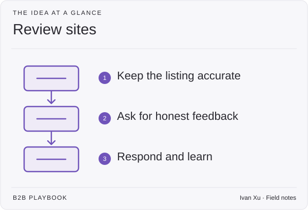

**Last reviewed:** 2026-08-30 · **Reading edit:** 2026-09-06

Review sites help buyers hear from people who have used a product. Keep your listing accurate, invite honest feedback after customers have experienced value, and respond helpfully. Avoid treating the rating itself as the goal.

*Reading guide: keep the listing accurate → ask for honest feedback → respond and learn.*

## Use this when

- Buyers ask “what does G2 say?” and you have three old reviews and a paid profile you never maintain.
- Marketing wants a 4.8 as a campaign KPI.
- CS is told to “get reviews” in the same week as a shaky [renewal](../08-lifecycle-and-customer-marketing/renewal-marketing.md).
- SEO treats the review site as a page you can ghostwrite.

## Do not use this when

- You have no customers who have realized value. Stay in [customer onboarding](../08-lifecycle-and-customer-marketing/customer-onboarding.md).
- You need a named, approved story. That is a [case study](../03-brand-story-and-content/case-study.md).
- You intend to write reviews as the customer. Stop.
- Category and comparison pages are empty and you want the profile to replace them.

## A few useful terms

| Word | Meaning here |
|---|---|
| **Ask** | A request after realization, to a person who can honestly write |
| **Profile** | What you control: category, product description, response to reviews |
| **Citation** | How buyers and models find you *through* the listing |
| **Incentive** | Anything of value for a review. Default: none. If legal allows something, write it; this page is not that opinion |

## Keep this in mind

**Ask after value, never for a score.** A review requested in week one, or while a save is open, is coercion. A review you drafted for them to paste is fraud. The unit is an honest public sentence from someone who did the work.

## How to do it

### Step 1: Keep the product listing accurate

Fill category, alternative, and constraints so the profile does not contradict [positioning](../02-product-marketing/positioning.md). Link to the [comparison](../07-website-and-conversion/comparison-page.md) and [pricing](../07-website-and-conversion/pricing-page.md) you already own. Do not dump the homepage into the vendor’s CMS and call it done.

[SEO and AEO](seo-and-aeo.md): models cite review pages. Keep facts accurate. Do not stuff keywords into fake “reviewer” copy.

### Step 2: Ask customers after they have received value

Who: a champion who has used the product through a real job, not a procurement CC. When: after a dated result, not after a kickoff, not during a [renewal](../08-lifecycle-and-customer-marketing/renewal-marketing.md) fight. How: a short human note—what to compare against, that honesty includes the hard parts. Volume targets (“12 this quarter”) recreate the blast.

### Step 3: Respond helpfully to reviews

Thank, correct facts, take product issues offline. Do not argue a 3-star into a 5. Do not offer a discount in the reply. A pattern of defensive replies is a [CS](../08-lifecycle-and-customer-marketing/customer-success.md) signal.

### Step 4: Use reviews as supporting evidence

A line a champion already wrote can sit on the [homepage](../07-website-and-conversion/homepage.md) or a [case study](../03-brand-story-and-content/case-study.md) **with permission**. Buying a “best of” badge as the quarter’s story is [paid media](paid-media.md) capture theater unless the listing already has enough authentic volume to survive a click-through.

### Step 5: Avoid programs that promise a rating

If the motion is “pay to place” or “guaranteed stars,” you are buying advertising. Call it that on [paid media](paid-media.md). Do not file it under advocacy.

## Worked example (illustrative)

| Field | Fill |
|---|---|
| Profile | Same category and alternative as the site; link to comparison |
| Ask | CSM sends after a dated SLA result; one customer a month, not a list |
| Will not ask | At-risk, unlaunched, or week-of-renewal |
| Response | Facts only; product bugs → ticket, not a public fight |
| Use | One quoted line on homepage if they agree; no “4.9” campaign |

## Copy: review-site card (fill)

- Surfaces we will maintain (G2 / other)—and why buyers already look there:
- Profile facts that must match positioning:
- Who may ask, and the realization rule:
- Who we will not ask:
- Incentive (default none):
- How we will use a review on owned pages (permission):
- Paid placement we will label as ads, or refuse:

Working file: [review-sites.md](../../templates/review-sites.md).

## Before you start

- [ ] Realization exists for anyone we ask.
- [ ] We do not draft their review.
- [ ] Profile matches positioning and live URLs.
- [ ] Renewal/save accounts are excluded.
- [ ] Paid badges are labeled as paid or refused.
- [ ] Legal/comms has a response rule. This page is not FTC/ASA counsel.

## Metrics

| Metric | Diagnostic use |
|---|---|
| Eligible asks | Requests sent only after dated realization |
| Authentic new reviews | Reviews we can pair with a real customer, not a volume spike |
| Profile match | Contradictions vs the site (category, price, alternative) |
| Paid-vs-earned | Badges we correctly called ads |

Do not treat star average, review count, or “share of voice” on the vendor dashboard as the program.

## Common mistakes

- Kickoff-day review asks.
- Ghostwritten reviews.
- Buying the rating.
- Using a badge to replace a comparison page.
- Asking during a save.

## What to read next

Findability is [SEO and AEO](seo-and-aeo.md). A longer approved story is a [case study](../03-brand-story-and-content/case-study.md). Customer programs (advocacy, referral, review *operations* as lifecycle) stay planned on [lifecycle](../08-lifecycle-and-customer-marketing/). Paid amplification of a listing is [paid media](paid-media.md).

## Sources and evidence boundary

This is an owner-maintained operating synthesis. Review listings as citation surfaces follow [SEO and AEO](seo-and-aeo.md). Ask-after-value and no ghostwriting are this library’s judgments, consistent with [case study](../03-brand-story-and-content/case-study.md) approval rules. G2/Capterra/Gartner are **surfaces**, not methods. Their award programs are vendor products. This page is not advertising-law advice.

---

Copyright © 2026 Ivan Xu. All rights reserved. See the [copyright and reuse terms](../../LICENSE).

Canonical source: [github.com/weilun88313/B2B-Playbook](https://github.com/weilun88313/B2B-Playbook)
