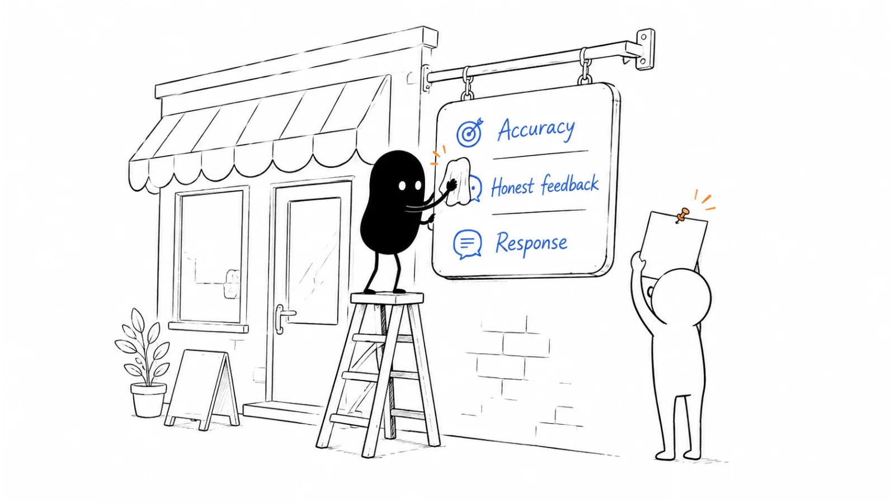

**Last reviewed:** 2026-09-09 · **Reading edit:** 2026-09-09

A buyer reaches the end of your demo and says, “The product looks useful. I found a few reviews, but they mostly talk about the old version. What is implementation like now?”

That is a different problem from not having enough stars.

The buyer is looking for another person's experience of the work: what was difficult, what improved, who had to get involved, and which promises held up after purchase. A polished profile helps them understand what you sell. A useful review helps them judge what using it might feel like.

The same review page can also be an advertising destination, a source of referral traffic, a place to answer criticism, or part of a paid research-signal product. Those jobs overlap, but they should not share one success metric.

This guide explains how to choose the surfaces worth maintaining, invite a fair range of experienced users, handle the responses, and evaluate the commercial extras without confusing a public rating with customer acquisition.

You do not need a reputation-management department to begin. You need an accurate listing, a respectful invitation, someone who reads what comes back, and a clear boundary between the customer's voice and your marketing.



*Reading guide: choose a useful surface → fix the listing → invite experienced users fairly → respond and learn → reuse with the right permissions → evaluate paid services separately.*

If your immediate problem is a thin profile, start with [the listing](#step-1-keep-the-product-listing-accurate). If a review campaign is being planned, read [who gets invited](#choose-an-eligible-group-without-selecting-for-praise). If the problem is a public complaint, jump to [responding](#step-3-respond-helpfully-to-reviews). The [worked example](#worked-example-illustrative) follows a fictional program through its first review.

## Use this when

Buyers actually encounter a review platform while researching your category, or you have a reasonable, testable hypothesis that they do. A prospect mentioning a page is useful evidence; a platform's total visitor count is not enough by itself.

Your listing describes a version, category, price, or implementation process that no longer matches the product. A buyer can get confused before they ever reach your website.

You have people with enough firsthand experience to describe the product, but invitations depend on whoever remembers to ask. You want a repeatable process that remains voluntary and does not select only enthusiasts.

Reviews are being collected, but nobody turns recurring comments into better documentation, product decisions, or more realistic sales expectations.

You are considering a sponsored listing, review-collection service, badge license, or intent-data subscription and want to know what exactly you would be buying.

You also need to coordinate marketing and customer success. A review request, support conversation, reference call, and renewal negotiation can involve the same person without being the same activity.

## Do not use this when

The plan is to have employees, an agency, or an AI system impersonate customers. A believable writing style does not create firsthand experience.

You need a carefully approved account of one company's implementation and results. Read [Case study](../03-brand-story-and-content/case-study.md) for that work. A review can suggest a story worth exploring, but it does not supply every approval or substantiate every result.

You have no appropriate users to invite and want public reviews to substitute for learning from actual use. Start with the product experience and [customer onboarding](../08-lifecycle-and-customer-marketing/customer-onboarding.md).

A seller promises a guaranteed score, favorable reviews, or removal of truthful criticism. Investigate the mechanism before buying anything; an impressive package name does not make manipulation legitimate.

You cannot maintain the profile or respond to a serious issue. A basic, accurate presence may be sufficient until someone can own the work. An annual platform contract will not create that owner.

Do not read these boundaries as a requirement to have a large customer base, a perfect product, or a particular number of months in business. An early user may have a useful experience to describe. An unhappy user may have one too.

<a id="words-you-will-use"></a>

## A few useful terms

A **listing** or **profile** is the product information presented on the review platform. Some fields may be vendor-managed; others may require moderation or come from the platform.

A **review** is an individual's account of experience. It is not automatically an endorsement by that person's employer, a controlled product test, or an approved company case study.

**Review gating** means steering likely-positive feedback toward public review channels while directing likely-negative feedback elsewhere. A satisfaction survey followed by different public-review invitations is one way this can happen.

An **incentive** is something of value offered in connection with a review. A gift card, credit, or donation still needs examination even when it is described as a thank-you.

A **badge** communicates a particular recognition under a platform's criteria. Earning recognition and obtaining permission to promote the badge can be separate matters.

A **sponsored placement** buys visibility or another stated advertising service. It is not the same thing as an independent review, an earned ranking, or a guaranteed customer.

An **intent signal** describes observed research activity under a provider's definitions. It is not automatically a named person asking to hear from sales.

<a id="one-rule"></a>

## Keep this in mind

Give people room to describe what happened, including the inconvenient parts.

That means the eligibility rule should be about relevant experience, not the opinion you hope to receive. The invitation should make the choice clear. The response should help the reviewer or the next reader, not negotiate a better score.

You can make the process easier without supplying the answer. A correct link, an explanation of the steps, and a contact for access problems are useful. A paragraph written in the customer's voice for them to paste is a different intervention.

There is no universal rule that a request in the first week is coercion. Timing matters because of experience, context, and pressure—not because a particular day on the calendar changes the nature of the request.

Likewise, customer dissatisfaction is not a reason to remove someone from public feedback. Resolving a problem and leaving a review must remain independent choices.

<a id="operating-method"></a>

## How to do it

Treat this as four connected operations: maintaining facts, collecting feedback fairly, responding to experience, and making careful use of what is published.

The commercial decision sits beside those operations. A platform may sell useful services, but paying for them does not remove the need to do the underlying work well.

A small team can begin with one relevant platform, one invitation process, and one short recurring review of what has changed. More surfaces become useful when they reach a different audience or serve a real buying question.

<a id="step-1-treat-the-listing-as-a-citation-surface-not-as-the-website"></a>

### Step 1: Keep the product listing accurate

Start by looking at the page as a buyer, not as the person who wrote it.

Can someone tell what the product does, which kind of team it serves, what they would need to implement it, and where its limits are? Do the screenshots show the current experience? Does the next link take them somewhere that answers the question the profile raised?

A directory entry should not force a reader to reconcile two different products: the autonomous platform described in the listing and the human-reviewed workflow shown in the demo.

For an AI product, be specific about which task is automated, where a person remains responsible, and what the user needs to supply. “AI-powered” is not a useful substitute for explaining the work.

Do not imply a certification, integration, geography, or deployment option because it is on the roadmap. If a capability is limited to a plan or still requires manual setup, make that distinction visible where the available fields allow it.

### Choose the surface before buying the package

Ask recent buyers where they looked, what they searched for, and whether any review changed a question they brought to the team. Keep their answer separate from your guess about their journey.

Then inspect the actual category page. Are the listed products alternatives a buyer would reasonably compare? Are reviews recent enough and detailed enough to answer a useful question? Is the relevant market, language, or company size represented?

A large review platform can be important in one category and peripheral in another. A smaller specialist directory may have fewer visitors but a closer match to the buying situation.

Do not create ten profiles because ten competitors have them. A neglected page can keep circulating an outdated price or a feature you stopped supporting.

| What you observe | What it might mean | A sensible first action |
| --- | --- | --- |
| Buyers repeatedly mention the same category page | The surface is part of their research | Maintain an accurate presence and learn what they compare |
| A relevant category exists, but buyers have not mentioned it | There is an untested distribution hypothesis | Start with a limited presence and inspect actual referrals |
| The nearest category describes a different job | The listing could attract misleading comparisons | Ask the platform about fit before committing |
| Most visible reviews discuss an old product version | Readers may be evaluating outdated experience | Correct current facts and invite eligible users fairly |
| A paid offer is justified only by platform-wide reach | The commercial case lacks audience detail | Request category-level scope and a bounded evaluation |

These are decision prompts, not a scoring system that claims to predict channel performance.

If the evidence does not justify paid expansion, keep the useful maintenance work. “We are not buying a subscription this quarter” does not mean “we should leave our public description wrong.”

### Build a compact profile fact sheet

Collect the approved product name, category rationale, description, current screenshots, pricing context, website destinations, and implementation limitations in one place.

Assign an owner to each fact that can change. Product marketing may maintain the description; product or security teams may need to verify technical claims. A small company can have one person perform several roles, but that person still needs to know which claims require checking.

Pricing needs enough context to prevent a false impression. A monthly figure billed annually is not the same offer as a cancel-anytime monthly plan. A per-user starting price may exclude a minimum commitment or a required service.

Use the destination that fits the next question. Sometimes that is a comparison page, sometimes pricing, a product explanation, or a demo request. Do not add tracking parameters that break the destination or put personal information in the URL.

A visitor arriving from an evaluation page may need implementation detail more than a generic category introduction. Make the handoff coherent without assuming that every referral is ready for sales.

### Maintain the public result, not just the submitted edit

A saved change in a vendor dashboard may still be awaiting publication. Verify the buyer-facing page after important updates.

Check product renames and major packaging changes carefully. Do not request duplicate profiles or a merger simply to leave uncomfortable history behind. Ask how the platform handles legitimate product changes and preserve an accurate account of what users reviewed.

Look for stale screenshots, broken links, discontinued plans, and descriptions of integrations that no longer work the same way. Record material corrections so another teammate does not restore the old wording next month.

A workable rhythm is event-driven maintenance after significant product changes, plus a periodic check at a frequency the team can sustain. Weekly is not inherently better than monthly if nothing has changed.

Reviews and profiles may appear in search or answer-engine research. That is a reason for accuracy, not evidence that a listing or badge guarantees rankings, citations, or discovery in an AI assistant. Use [SEO and AEO](seo-and-aeo.md) for the broader findability work.

<a id="step-2-ask-from-realization-one-at-a-time"></a>
<a id="step-2-ask-customers-after-they-have-received-value"></a>

### Step 2: Invite people with relevant firsthand experience

The central question is whether someone can describe the product from their own use.

A daily operator may understand the workflow better than the executive who approved the contract. An administrator may have a useful account of setup. A trial participant may be able to explain what they evaluated and where they stopped.

Check the platform's eligibility rules rather than assuming only paying champions qualify. G2's guidelines allow trial or evaluation experiences, while noting that insufficient exposure may not pass moderation. That is not a promise that every signup qualifies. [G2 community guidelines](https://legal.g2.com/community-guidelines?ref=b2b-playbook)

Ask users to describe the experience they actually have. Someone who evaluated the product for a week should not be encouraged to imply a year of production use.

Do not use contract value as a substitute for experience. A large account with an inactive sponsor may contribute less useful detail than a small team whose administrator did the implementation.

### Choose an eligible group without selecting for praise

Define the group before looking at who is likely to recommend you.

For example, a product might invite users who completed a relevant workflow during a recent period. Where the platform permits it, the group can also include people whose real attempt exposed a failure. The point is sufficient experience to comment, not successful completion at any cost.

If volume is large, use an appropriate random sample or a documented rotation across relevant user groups. Selection by role or use case can answer coverage gaps, but it should not become a hidden satisfaction filter.

Do not send the review link only after a high NPS answer. Let service feedback reach the people who can act on it without making private feedback the only route available to dissatisfied users.

The FTC's marketer guidance advises against soliciting only customers expected to leave positive reviews. It also warns that platform rules may be stricter than a general approach to incentives or connected reviewers. This is US guidance; an actual program needs review for its market and platform. [FTC guidance for marketers](https://www.ftc.gov/business-guidance/resources/soliciting-paying-online-reviews-guide-marketers?ref=b2b-playbook)

The following conversation is fictional.

**Founder:** We have thirty promoters in the survey. Can we send them the public-review link and send everyone else to support?

**Marketer:** We can follow up on the support issues, but that split would select public feedback for praise. Let's define who has relevant experience before looking at their scores.

**Customer success lead:** Some users are frustrated because setup failed. They did try the workflow, even though they did not reach the result.

**Marketer:** Then we should not erase that experience from the invitation pool. We can explain the review option and handle their issue independently.

A review campaign is not the same as choosing a willing reference customer for a particular sales conversation. Different activities have different selection purposes; do not quietly turn the public review process into a reference roster.

### Separate timing from sentiment

It can be reasonable not to add an optional marketing request in the middle of an urgent service exchange. That is a communication decision, not permission to exclude negative experience indefinitely.

Keep a reason, an owner, and a revisit point for a temporary pause. Apply the rule consistently to comparable situations. Do not make “customer may be unhappy” the reason.

A renewal date alone does not prove that an invitation is inappropriate. The risk is the connection you create: suggesting that renewal terms, service attention, a discount, or access to a person depends on the review.

Keep those negotiations separate. If a customer asks whether declining will affect their account, answer plainly and make sure operations honor the answer.

A person who has asked not to receive review requests should not be chased through another channel. Check the applicable communication permissions before launching bulk invitations; an existing customer relationship is not a universal permission for every campaign.

A reminder may be appropriate if the original request was welcome and the platform permits it. Decide the limit in advance. Repeated personal follow-up can make an optional request feel like an obligation even when the words say otherwise.

### Make the invitation easy to understand

Explain where the review will appear, that participation is optional, and that useful feedback includes limitations as well as benefits.

Use a direct, correct submission route. Do not ask the reviewer to send their draft to marketing for approval or to share credentials so someone can “help publish.”

Avoid writing the desired result into the question. “How much time did we save you?” assumes a saving. “What changed in the work, if anything?” leaves room for no improvement or an unexpected tradeoff.

You can tell someone what kind of context is helpful without providing sentences in their voice. Their role, task, period of use, setup, and limitations are useful prompts; suggested praise and required brand phrases are not.

The following is a fictional invitation for a non-incentivized program. Replace the placeholders, check the platform's current invitation rules, and use it only through an appropriate communication route.

```text
Subject: Would you share your experience with [product]?

Hi [name],

You have used [product] for [relevant task]. If you would like to,
you can share your experience on [review platform] here:
[approved review-submission link]

An honest account of what worked, what did not, and the context of
your use is useful to other people evaluating the product.

This is optional. Your decision and rating will not affect your
support, account terms, or access. We are not offering an incentive
for this invitation, and there is no need to send us a draft.

Please avoid confidential company or customer information. Check
the platform's visibility options and your employer's policies
before submitting.

Thank you,
[name / role]
```

Do not keep the “no incentive” sentence if another team or the platform is offering one through the same campaign. Check the entire route, not just the email you can see.

If the recipient asks how long the form takes, give a measured estimate for the current flow or say you do not know. Do not promise two minutes for a form nobody on your team has inspected.

### Decide whether an incentive is appropriate

Start with the simplest workable option. A program without incentives avoids several operational questions, though it still needs fair selection and a respectful request.

If you consider an incentive, distinguish permission from convenience. You need to understand the applicable law, the platform's rules, the recipient's employer policy, and the actual administration process.

The FTC explains that its rule does not prohibit every review incentive, but prohibits compensation conditioned expressly or implicitly on a particular sentiment. Disclosing an incentive does not make a five-star requirement acceptable. Other FTC Act obligations can also apply. [FTC review-rule questions and answers](https://www.ftc.gov/business-guidance/resources/consumer-reviews-testimonials-rule-questions-answers?ref=b2b-playbook)

Capterra's published guidelines, updated May 4, 2026, identify incentive restrictions including public-sector employees and people whose employer policies prohibit accepting gifts. They describe incentive labeling as well. Do not infer that another platform has identical eligibility rules. [Capterra community guidelines](https://www.capterra.com/legal/community-guidelines/?ref=b2b-playbook)

Before approving a campaign, answer who funds the offer, who fulfills it, what eligibility conditions apply, how the connection is disclosed, and what happens if moderation delays or rejects a submission.

A platform's approved-review condition is different from a positive-review condition. Explain the actual terms without promising publication or payment you do not control.

Keep records of the approved offer and the version of the rules used. Have the responsible owners review exceptions rather than improvising a special reward for the person whose review marketing most wants.

### Keep AI assistance on the right side of authorship

AI can help your team draft a neutral invitation, check profile consistency, or organize themes in material you are authorized to process. None of those tasks requires pretending to be the reviewer.

Do not feed support notes to a model and generate first-person reviews for customers to paste. An accurate support transcript is still not permission to manufacture a public statement in someone else's voice.

Platform policies on reviewer-side assistance differ and can change. G2's current community guidelines permit generative drafting under specified identity-verification or submission conditions, while still requiring genuine experience and review for accuracy. This is conditional permission, not a blanket approval of AI-written reviews. [G2 AI policy within its guidelines](https://legal.g2.com/community-guidelines?ref=b2b-playbook)

There is a documentation inconsistency worth knowing about: G2's Review Activity page still gives an unqualified rejection statement for generative-AI content. Its reviewer rejection help explicitly directs readers to the community-guideline exceptions. Check the current policy and ask platform support about an uncertain submission instead of relying on the shortest help-page sentence. [Review Activity](https://documentation.g2.com/g2/docs/review-activity?ref=b2b-playbook), [reviewer rejection help](https://documentation.g2.com/help/docs/why-was-my-review-rejected?ref=b2b-playbook)

The practical boundary for your team is straightforward: make the process accessible, but leave the customer's experience, judgment, and submission with the customer.

### Let moderation remain independent

Invitations sent, reviews submitted, reviews published, and reviews still in moderation are different counts.

A review not appearing immediately does not establish that the user ignored the request or that the platform rejected it. Use the status information actually available and leave unknowns as unknowns.

If a reviewer asks for help with rejection, point them to the platform's explanation and support route. Do not tell them to change their opinion to improve the chance of publication.

G2's reviewer help describes verification, duplicate submissions, and other moderation reasons; it also allows users to keep identifying information out of the public display. Public anonymity therefore does not establish that a review is fake. [G2 reviewer help](https://documentation.g2.com/help/docs/why-was-my-review-rejected?ref=b2b-playbook)

Do not demand a public identity, a screenshot of the submitted rating, or access to the person's account for your reporting convenience. Use the information the platform legitimately provides and the person voluntarily shares.

Keep the request list separate from any internal attempt to match public reviews to customers. You do not need to identify every reviewer to notice that onboarding instructions are confusing.

<a id="step-3-respond-in-public-like-an-operator"></a>

### Step 3: Respond helpfully to reviews

A response has two audiences: the person who wrote the review and the next buyer reading it.

The first may need help. The second wants to see whether the company understands the issue, communicates clearly, and behaves reasonably when the experience is imperfect.

Read the whole review before replying. A low rating can contain a useful recommendation. A high rating can describe a serious limitation. Do not let the score determine whether the substance receives attention.

Agree on a response owner and an escalation route. A marketer can handle a simple acknowledgment; a technical claim may need product input. A security allegation, personal information, or a threat should go to the appropriate internal owner before anyone improvises a public answer.

This does not require a committee for every sentence. Prepare a clear boundary for routine responses and a small number of situations that need specialist review.

### Answer the actual issue

A useful reply acknowledges the specific experience, states what you can verify, and gives a practical next step where one exists.

“Thank you for your valuable feedback” repeated under every review gives a future buyer very little information. “We understand that assigning the initial reviewer was confusing; the setup guide now explains that step” is more useful if the change has actually happened.

Do not promise a release date because a public complaint feels urgent. If a capability is not available, explain the current limitation. If a workaround exists, check whether it genuinely solves this person's situation before recommending it.

You can correct a factual misunderstanding without treating the reviewer as the problem. Explain the relevant plan, configuration, or current behavior and acknowledge when the product or documentation made it hard to find.

Never disclose account details, invoice history, support transcripts, employee names, or customer data to win the argument. A public review does not authorize you to publish everything you know about the account.

The following exchange is fictional.

**Customer success lead:** The review says approvals disappear, but our records show that the reviewer filter was hiding completed items.

**Founder:** Can we post a screenshot of their workspace to prove it?

**Customer success lead:** No. We can explain the filter in general and offer help through the normal support route. The confusion is also worth fixing.

**Founder:** Then let's acknowledge that the status was unclear and make sure the instructions are better before we claim the issue is solved.

The response can be accurate without being defensive. Being right about the database is not the same as making the experience understandable.

### A response that helps the next reader

Consider this fictional review: “The review history is useful, but initial setup was harder than the demo suggested. We could not see who owned the first approval.”

A weak response would say that all customers receive onboarding, imply that the reviewer ignored instructions, and ask for a higher rating after a call.

A more useful response could read:

> Thank you for explaining the setup difficulty. The first approval needs an assigned reviewer, and we did not make that dependency clear enough in the guide. We have updated the setup instructions to show the assignment step. If you still cannot see the owner, our support team can help inspect the configuration through the usual private support channel. We appreciate the detail about the review history as well.

This fictional reply assumes the guide has already been updated. If it has not, change the statement to the action actually underway and avoid a delivery promise the owner has not accepted.

Do not append a request to change the review. The response and service improvement should stand on their own.

### Handle suspected violations through evidence

An unfavorable opinion is not a moderation violation. Neither is a writing style you dislike or an inability to locate a matching name in the CRM.

If you suspect the wrong product was reviewed, a conflict of interest, exposed private information, or another policy violation, record the specific concern and use the platform's reporting route.

Separate observable evidence from inference. “This feature belongs to another named product” is more actionable than “this must be a competitor.”

The FTC's marketer guidance cautions against using reporting mechanisms to remove honest negative feedback and against deceptive reputation-management services. Hiring an intermediary does not make the method unimportant. [FTC marketer guidance](https://www.ftc.gov/business-guidance/resources/soliciting-paying-online-reviews-guide-marketers?ref=b2b-playbook)

If the review describes a possible real product issue as well as a suspected policy problem, investigate the product issue too. A moderation request is not a substitute for support.

Keep threats and bargaining out of the response. Do not connect a refund, repair, or contractual obligation to deleting criticism. Obtain appropriate advice for genuinely serious legal or safety matters rather than using a marketing playbook as a legal script.

<Accordion title="We cannot identify the reviewer">

You may not need to. Start with the behavior described: can the team reproduce the setup confusion, missing information, or failure without knowing who posted it?

Use the platform's own verification and reporting mechanisms for an authenticity concern. Do not search for a person's identity merely to pressure them, and do not publish a guessed identity.

A general public response can acknowledge the described problem and offer an optional private support route. Let the person choose whether to use it.

If the account remains unknown, record the issue as an unverified report rather than either a confirmed incident or a fake review. Those are different conclusions. You can improve a confusing instruction while remaining uncertain about the specific incident.

</Accordion>

### Turn individual comments into a learning record

Read for the task and context, not just positive and negative keywords.

“Easy to use” may refer to the daily operator's screen, while “hard to use” may refer to an administrator configuring permissions. Those statements can both be true.

Keep a short internal record of the reported task, friction, context, date, and next investigation. Distinguish what the reviewer said from your explanation of why it happened.

When the same theme appears in several reviews, compare it with support, onboarding, and research evidence. The pattern may deserve attention, but the public sample alone does not tell you how common it is across all customers.

Give important themes an owner and a next action. “Setup confusion mentioned three times” is a note. “Documentation owner will test whether a new administrator can assign the first reviewer without assistance” is an actionable investigation.

AI summarization can help sort authorized material, but have a person inspect the original comments before turning a theme into a decision. Keep public material separate from confidential account records, and do not send customer information to an unapproved model.

Read positive specifics with equal care. They may reveal a capability worth explaining better, not merely a phrase to put on a banner.

<a id="step-4-use-reviews-as-proof-not-as-the-campaign"></a>

### Step 4: Use reviews as supporting evidence

Choose a review because it answers a buyer's question, not simply because it contains an enthusiastic adjective.

A prospective administrator may care about setup and permissions. An operator may care about the daily workflow. A budget owner may need a fuller business case that a short review cannot substantiate.

A useful quote can support those conversations, but it should not carry a claim larger than the reviewer made. “The review history helped us find the decision” is not evidence that the product cut labor costs by thirty percent.

Keep the original context available through the permitted source route. Identify the product, period, and relevant user context without presenting a person's opinion as an employer-approved statement.

You can curate a small selection of relevant testimonials. Do not present that selection as the complete review record, a representative survey, or the view of every customer.

### Check both the person's permission and the platform's rights

A public review is not automatically a free advertising asset.

The reviewer may agree to participate while the platform imposes separate reuse conditions. Conversely, a platform tool may expose a quote while your intended use still requires checking the person's consent, employer approval, or the scope of a company-logo permission.

G2's current vendor-content rules distinguish reuse rights by content type and plan, and specify customer opt-in for reusing product reviews. Check the applicable terms for the exact asset; a customer email alone does not resolve the platform license. [G2 content-use rules](https://legal.g2.com/community-guidelines?ref=b2b-playbook)

Keep a record of the approved excerpt, attribution, source, permitted locations, required disclosures, duration, and any restrictions. Include a way to retire the asset if the permission or license ends.

Do not silently edit a quotation to make it stronger. If you need a new statement, ask for a separately approved testimonial and label it accurately instead of presenting your rewrite as the original review.

For a translation, preserve the meaning and disclose that it is translated where appropriate. For a short excerpt, retain qualifications that materially change the claim. An ellipsis should not turn mixed feedback into unconditional praise.

If rights are unclear, ask the platform or use another approved form of evidence. Do not make a screenshot to bypass a reuse restriction.

### Understand what the badge actually recognizes

Before adding a badge, write its full meaning in ordinary language.

Which product, category, segment, region, reporting period, and criterion does it represent? Does it recognize a particular score, report placement, or number of qualifying reviews? Which usage rights come with your plan?

G2's badge documentation separates recognition from access to download and share assets. It says free profiles remain eligible for report recognition, while sharing most newly earned badges requires an upgraded profile; Users Love Us is an exception described in the documentation. [G2 badge documentation](https://documentation.g2.com/docs/g2-badges?ref=b2b-playbook)

Paying for a license to use an earned asset is not the same transaction as buying a favorable rating. Buying a clearly identified placement is different again.

Neither distinction guarantees that a package is worth its cost. You still need a reason to use the asset and enough context for the reader to understand it.

Avoid turning a narrow seasonal recognition into “the best software.” Use the required wording and attribution, and check whether an older badge can still be used under the current license.

Do not assume that a badge or review widget guarantees search stars, higher rankings, or conversion lift. Those are separate claims requiring their own evidence.

### Read ratings and rankings without collapsing them

An average star rating is a summary of a particular set of reviews. It does not explain who responded, which experiences are missing, or how the current product differs from what was reviewed.

Report the count and date alongside the average when that use is permitted. A small rating movement can arise from a few additional reviews or platform-specific calculation rules; it need not indicate that the product suddenly improved or deteriorated.

G2's scoring methodology describes software scores using Satisfaction and Market Presence components, with inputs beyond a simple star average, including review recency and volume. Its page was updated August 26, 2026. Do not reconstruct a report position by averaging the visible stars. [G2 scoring methodology](https://documentation.g2.com/docs/research-scoring-methodologies?ref=b2b-playbook)

Separate the questions: what customers report, what the platform's metric measures, and what a buyer should conclude. A vendor dashboard can help with the second without answering the other two.

### Help sales use evidence without overselling it

Make relevant, approved evidence easy to find by buying question. A folder called “great reviews” is less useful than a small collection organized around setup, daily use, support, and limitations.

Attach the source and usage boundaries. A salesperson should know whether an excerpt may be sent externally, whether it needs a link, and whether the named company has approved broader use of its brand.

A review mentioning implementation can help open a conversation. It should not be used to promise that the prospect's implementation will take the same time.

If a buyer brings a critical review, discuss it directly. Explain what is still true, what changed, and what you can demonstrate. Do not hide behind the overall rating.

Sometimes the correct response is to show the current workflow and let the buyer test the concern. A product demonstration may answer the question more effectively than another five-star quote.

<a id="step-5-refuse-the-marketplace-that-sells-the-rating"></a>
<a id="step-5-avoid-programs-that-promise-a-rating"></a>

### Step 5: Evaluate paid services without buying a conclusion

Start with an itemized description of the offer.

A commercial bundle may combine profile features, traffic, review-collection administration, asset licenses, and research signals. If you evaluate only the bundle's total “influence,” you may never learn which part you use.

Ask what remains available without the upgrade. Then identify the decision each additional service should help you make or the work it should help you perform.

| Service | What you may be paying for | What would not follow automatically |
| --- | --- | --- |
| Enhanced profile | Additional content or profile features | More suitable buyers or a better rating |
| Sponsored placement | Defined visibility, clicks, or another advertising deliverable | Independent endorsement or incremental customers |
| Review-collection administration | Campaign operations and an approved invitation process | Positive sentiment or guaranteed publication |
| Content or badge license | Permission to use specified eligible assets | Ownership of the review or a right to expand its claim |
| Buyer-intent subscription | Defined research signals and available integrations | A named contact's consent or a confirmed purchase project |

Ask the seller to separate facts about the product from projections about your results. Historical platform-wide averages are not a forecast for your category, offer, and sales process.

A service that promises favorable scores or concealed influence over supposedly independent rankings is not rescued by calling it advertising. A transparent placement and a purchased deceptive conclusion are different things.

### Write the purchase decision before the renewal date

For a paid placement, define the category, audience, geography, destination, billing basis, budget ceiling, and reporting window. If leads are included, ask what qualifies as a lead, how duplicates are treated, and what sharing permissions accompany the record.

For a content license, identify the assets you can actually use and the work needed to deploy them. A large library has little value if the sales team needs one approved implementation example.

For collection services, inspect the invitation logic and incentive administration. Do not delegate review selection to a vendor and then avoid asking how it works.

For intent data, ask which signal types are included, how accounts are matched, what coverage limitations exist, and how much work a person must do before taking an appropriate action.

Record the minimum commitment, renewal date, cancellation notice, price changes, data retention or export rights, and what happens to embedded assets after the term ends. Have the responsible owner review the actual contract; this chapter is not a contract review.

The following conversation is fictional.

**Seller:** The package includes badges, category traffic, and buyer-intent signals. Together they will influence your pipeline.

**Marketer:** Which assets can we license, what traffic is included, and what does one intent signal represent?

**Seller:** They are separate features with different access and reporting.

**Marketer:** Then we should evaluate them separately too. We need a bounded test and an operating owner, not just a larger influence number.

You are not obliged to buy every available module to establish that reviews matter to buyers.

### Use intent signals as research context

G2 describes Buyer Intent signals from activities such as profile visits, comparisons, and alternatives research. Its documentation presents company-level insights and distinguishes company records from individual signal rows in exports. [G2 Buyer Intent documentation](https://documentation.g2.com/docs/buyer-intent?ref=b2b-playbook)

A company appearing in that dataset is not automatically a net-new opportunity. It may be an existing customer, an open deal, a poor fit, or a team researching without an immediate project.

Do not tell a particular contact that you know they read a review unless you actually have a sound basis and an appropriate reason to say so. Account-level activity is not evidence that the person you found on LinkedIn performed it.

Combine a signal with account fit, relationship history, and an appropriate next step. Sometimes it helps an account owner prepare for an existing conversation. Sometimes it just suggests further research. Sometimes no action is justified.

Avoid turning every signal into an automated message. More alerts can consume selling time without improving decisions, especially when several rows describe repeated activity from one company.

Check the provider's current definitions when comparing periods. A change in coverage or included sources can increase reported signals without a corresponding increase in demand for your product.

### Measure what the program can actually show

Keep invitation operations separate from commercial outcomes.

You may know how many invitations were delivered and how many platform-attributed reviews were published. That tells you something about the process, not how many new customers those reviews created.

Referral sessions, requests, suitable conversations, opportunities, and customers are later observations with different units. Several sessions can belong to one person; several people can be involved in one purchase.

A buyer who says a review helped them feel comfortable is reporting useful influence. Preserve that statement without assigning the entire contract to the review platform.

For a paid test, use [Paid media](paid-media.md) to define costs, attribution limits, and the outcome window. Separate a directory's organic referrals from its paid placements where the reporting allows it. State the gap when it does not.

If you cannot measure a small maintenance program's revenue impact precisely, do not invent a number. You can still justify correcting public facts and answering substantive feedback as useful work.

<Accordion title="We paid for the platform, but cannot show pipeline">

First identify the job you bought. A badge license cannot be evaluated as if it were a lead-delivery contract. A profile upgrade with no deployed content may have an implementation problem before it has a demand problem.

Review what was delivered, what your team used, and whether enough time has passed for the intended outcome. Check the destination, request handling, and account matching before blaming the whole channel.

If the commercial case still rests only on impressions, badges downloaded, or accounts labeled “active,” keep those as activity measures. Do not rename them pipeline to justify renewal.

You can retain an accurate basic listing while ending or reducing a paid package. You can also repeat a smaller test when the early evidence is useful but inconclusive. State the new question, cap, owner, and review date instead of renewing on habit.

</Accordion>

<a id="teaching-fill-inventednot-a-customer"></a>

## Worked example: illustrative

Everything in this example—the company, users, reviews, costs, and outcomes—is fictional. It is not a Lensmor result, a G2 campaign report, or a benchmark for review conversion.

A small software company provides a workspace for reviewing AI-drafted support replies. People assign a reviewer, inspect the draft and policy context, and keep an approval record. Human judgment remains necessary for exceptions.

A few prospects have mentioned a review platform during evaluation. The company's profile still shows the old setup screen, describes an integration too broadly, and has only a handful of older reviews.

The team wants to fix those facts and learn whether a fair invitation process can produce useful current feedback. It is not buying a ranking or setting a target average rating.

### Establish the baseline

The owner records the existing profile description, screenshot version, destinations, and visible review dates. The product team verifies the integration wording.

The team replaces the old screenshot, clarifies the human-review step, and changes the destination to an explanation of the current workflow. It checks the published profile rather than stopping at the saved edit.

For the invitation cohort, it identifies fifty distinct users across twenty-four customer companies who recently attempted the core workflow. The criterion includes users who encountered setup failures; it does not require a positive survey answer.

Eight people are excluded from this outreach because they have opted out or cannot be contacted through the approved route. They remain able to review independently. The team does not infer their opinions from the exclusion.

The remaining forty-two receive the same optional, non-incentivized invitation. A support route remains available to everyone, and the invitation does not change with satisfaction score.

### Review what actually happened

In this fictional platform report, the campaign can attribute fourteen published reviews to its invitation route. One other submission is pending at the cutoff and one was rejected as a duplicate. The team does not infer submission status for the remaining recipients.

| Observation at the cutoff | Count | What it does and does not establish |
| --- | --- | --- |
| Experienced users identified | 50 | Eligibility pool, not fifty promised reviews |
| Contact exclusions | 8 | Permission or opt-out reasons, not satisfaction filters |
| Invitations delivered | 42 | Distinct recipients of this campaign |
| Published reviews attributed by the platform | 14 | Published feedback, not fourteen new customers |
| Submission still pending | 1 | No assumed publication outcome |
| Duplicate submission rejected | 1 | An operational status, not a negative review removed |
| Recipients with no submission status known | 26 | Unknown, not proof that they chose not to participate |

The counts reconcile: fourteen plus one plus one plus twenty-six equals forty-two.

Fourteen published reviews divided by forty-two delivered invitations is about thirty-three percent for this fictional cohort. The team reports the count, denominator, cutoff, and attribution method rather than calling it the platform's expected response rate.

A reviewer can be verified by the platform without publicly identifying themselves. The program does not require the company to link every published opinion to a CRM record.

### Read for the buying questions

Several reviews describe the usefulness of seeing the approval history. Three mention difficulty assigning the first reviewer. One says the product did not fit the team's exception-handling process.

Those are different findings. The first may help explain a strength; the second suggests a setup investigation; the third may expose a limitation that should be clearer before purchase.

The team does not rewrite the third review as a customer-success failure simply because it is negative. Product and marketing check whether the product was oversold for that use case.

A documentation owner tests the setup with someone unfamiliar with the process. After correcting the instructions, the response owner acknowledges the reported confusion in public without posting account details.

Nobody asks for a new score in exchange for the fix. If a reviewer independently updates their opinion later, it remains their decision and goes through the platform's process.

### Keep reuse separate from collection

Two reviews contain specific comments about the approval record that would be useful in an evaluation guide.

The team checks platform reuse terms before requesting approval for the exact excerpts and intended use. One reviewer agrees; the other does not have employer clearance.

That produces one potential approved asset, subject to the applicable platform rights—not permission to use both company logos or to turn either review into a case study.

If the required license is not worth buying, the team can choose another approved evidence format. The work of collecting honest feedback does not become a failure because every review cannot be republished.

### Calculate the operating cost honestly

The profile correction, invitation setup, responses, and first review take twelve internal hours. The team values that time at &#36;75 per hour for planning.

The assumed operating cost is therefore &#36;900. There is no paid platform package or review incentive in this first phase, and no incremental external cash spend is included.

Dividing &#36;900 by fourteen published reviews gives about &#36;64.29 per published review under this allocation. It is an internal planning ratio. Some of the work also improved the listing and documentation, so the ratio should not be presented as the market price of a review.

It is certainly not customer acquisition cost. The denominator contains existing users who supplied feedback.

The team could track hours without assigning a monetary value instead. The important thing is to state the basis rather than making internal time disappear or treating an estimate as audited cost.

### Evaluate a separate paid placement

Later, the same fictional company considers a limited sponsored-placement test. The offer contains no promised review sentiment, rank, or badge.

The agreed media cost is &#36;1,500. Preparing the destination and reviewing the test takes eight additional internal hours valued at &#36;75, or &#36;600. The assumed campaign cost is &#36;2,100, excluding any later allocated sales effort.

The platform reports one hundred outbound clicks. The company's analytics records eighty associated sessions. Different counting and collection methods remain visible; the team does not assume eighty distinct buyers.

Six explicit evaluation requests come from five companies. One is an existing open opportunity. Of the four newly recorded companies, three have a suitable conversation and one is outside the supported use case.

Two of the three suitable companies become new opportunities with an agreed next step. None has closed by the review date.

Media cost per raw request is &#36;250: &#36;1,500 divided by six. Assumed campaign cost per suitable new-company conversation is &#36;700: &#36;2,100 divided by three. Cost per newly created opportunity on that same cost basis is &#36;1,050.

There is no observed customer acquisition cost because there are no closed customers. Potential contract values do not change that.

The existing opportunity may have benefited from the placement, but it is not counted as newly sourced. The two open opportunities are followed beyond the delivery period without being reported as realized revenue.

### Make two decisions, not one

The basic listing and review process are worth maintaining because they correct public information, surface useful feedback, and support buyer research at a manageable workload.

The paid placement remains uncertain. Three suitable conversations and two opportunities justify examining the route further, but they do not establish repeatable acquisition.

The company may repeat a smaller test, change the destination, or wait for the open opportunities to develop before spending more. The next decision depends on its budget, capacity, and remaining uncertainty.

Neither decision requires buying more reviews. Neither requires making the rating the target.

## Copy: review-site card (fill)

Use this as the operating agreement for the profile and invitation process. It is a record of decisions, not a script for what reviewers should say.

```text
REVIEW-SITE OPERATING CARD

Platform / product / category:
Why relevant buyers may use this surface:
Profile owner and last buyer-facing check:
Facts, screenshots, pricing context, and links to maintain:

Eligibility based on firsthand experience:
How we include a fair range of experiences:
Contact permissions, opt-outs, and reminder limit:
Temporary communication pauses and revisit owner:
Invitation route and approved wording:
Incentive, if any: rules, disclosure, funding, fulfillment:
Current policy sources and review date:

Response owner and escalation route:
How reviewers can get help without changing their review:
How suspected violations are reported:
Product / documentation themes and responsible owners:

Reuse permissions and platform rights:
Approved assets, attribution, locations, and expiry:
Next operating review and unresolved questions:
```

The [existing working file](../../templates/review-sites.md) is a shorter card. Treat its “after value” and “realization” wording as a reminder to seek real experience, not a rule to exclude dissatisfied users. Its paid-placement field applies to advertising; an earned badge's usage license is a separate decision. You do not need to overwrite an already-filled worksheet to adopt those distinctions.

### Copy: paid-service decision

Separate the commercial add-on from the ongoing responsibility to maintain accurate information.

```text
REVIEW-PLATFORM PAID-SERVICE DECISION

Service and exact deliverables:
What remains available without paying:
Audience / category / geography / product scope:
Assets, traffic, collection operations, or signal types included:
What this offer does not guarantee:

Cash cost and commitment:
Internal work and valuation assumptions:
Billing basis, cap, cancellation notice, and renewal date:
Data / content rights during and after the term:
Disclosure and policy checks:

Operating owner and implementation tasks:
Baseline and outcome cutoff:
Delivered service versus actual team usage:
Referrals / requests / distinct companies:
Existing relationships versus newly recorded opportunities:
Closed outcomes, if any:
Attribution limits and unresolved measurement gaps:

Decision: keep / change / repeat a bounded test / stop
Reason, next uncertainty, owner, and next review:
```

<a id="pre-flight-checklist"></a>

## Before you start

Open the buyer-facing listing. Check the product facts, screenshots, category, pricing context, and destination rather than assuming the internal record is current.

Inspect the eligibility rule without the satisfaction scores attached. Would the same experienced user be invited after a disappointing result?

Read the invitation as someone worried about their account relationship. Is declining genuinely easy? Does the support team know that the answer and rating do not change service?

Check the actual campaign route for incentives, permission requirements, and visibility options. Do not copy another platform's rules or an old help article into a new campaign without review.

Confirm that someone will read the reviews and handle serious issues. Set a route for privacy, security, and legal escalation; do not ask the social-media owner to improvise.

For reuse, check the exact asset and its rights before designing the page. A reviewer's approval, a company-logo approval, and a platform license answer different questions.

For a paid package, write the delivery and renewal criteria before signing. If no one can explain what a useful result would look like, the bundle is not ready for a commercial decision.

## Metrics

### Collection and coverage

Track the eligible group, delivered invitations, known submissions, published reviews, and unresolved statuses separately.

Record contact exclusions and sampling decisions without building an unnecessary dossier on reviewers. Review whether the process reaches different relevant roles and experiences.

Freshness and coverage matter alongside volume. A large set of reviews about a retired product may answer fewer current questions than a smaller set describing the work buyers are evaluating now.

Do not interpret invitation conversion as product satisfaction. Form length, timing, access, moderation, and willingness to speak publicly can all affect participation.

### Experience and response

Track recurring themes, unanswered substantive issues, and whether the owner completed the promised investigation or correction.

Response time can be useful, but a fast empty acknowledgment is not the same as a helpful answer. Check quality with a small sample of actual replies.

Keep rating and count in context if you report them. Neither a high average nor a decline replaces reading the underlying experience.

A fixed number of invitations or reviews can be a planning estimate, but do not pay people for favorable scores or make quota pressure override eligibility and voluntary participation.

### Evidence and commercial use

Track whether approved evidence answers real buyer questions and whether the team can find and use it within its permissions.

For paid services, distinguish delivery, usage, and outcomes. Downloading an asset is usage; sending it appropriately is another step; a buyer finding it useful is a different observation.

Use consistent definitions for referrals, requests, companies, opportunities, and customers. Preserve existing relationships instead of relabeling them as new acquisition.

A useful program review can end with “this remains an inexpensive way to keep our public facts and customer feedback current.” It does not need an invented pipeline multiplier.

## Common mistakes

**Inviting only promoters.** Base review eligibility on relevant experience; do not make public feedback the reward for a high satisfaction score.

**Confusing a respectful pause with permanent exclusion.** Keep operational pauses narrow, consistent, and revisitable rather than hiding unhappy customers from the process.

**Writing the customer's answer.** Help with access and neutral context, not first-person praise for someone else to submit.

**Treating anonymous or critical reviews as fake.** Examine evidence and use legitimate platform channels without trying to expose or pressure a reviewer.

**Responding to the score instead of the issue.** A future reader needs a useful explanation, not a public negotiation over stars.

**Reusing a public review without checking rights.** Verify the exact excerpt, attribution, consent, and platform conditions.

**Calling every paid badge a purchased ranking.** Separate earned recognition, licensing, and advertising; investigate any promise to sell the conclusion itself.

**Buying signals without an action owner.** More account activity in a dashboard is not automatically a useful sales process.

**Reporting influence as new revenue.** Retain buyer feedback and observed referrals without claiming an unmeasured causal result.

## What to read next

[Channel strategy](channel-strategy.md) helps decide whether a review platform deserves attention alongside other routes. [Paid media](paid-media.md) covers the budget and outcome review for sponsored distribution.

Use [Case study](../03-brand-story-and-content/case-study.md) when a reviewer has a fuller story worth developing with the right approvals. [Comparison page](../07-website-and-conversion/comparison-page.md) helps turn evaluation questions into an owned explanation rather than relying only on a third-party profile.

[Customer success](../08-lifecycle-and-customer-marketing/customer-success.md) and [Customer onboarding](../08-lifecycle-and-customer-marketing/customer-onboarding.md) cover the experience behind the review. Keep those services independent of participation.

For the next channel family, browse [Outbound and prospecting](../05-outbound-and-prospecting/). Review activity can provide context for research, but does not turn unsolicited outreach into an explicit request.

## Sources and evidence boundary

Primary G2 and FTC materials were checked on September 9, 2026. Capterra's May 4, 2026 community-guideline text was available through the search result; its full page returned an error during verification. The Capterra paragraph is limited to the incentive restrictions and labeling visible in that retrieved text.

G2's community guidelines, badge documentation, scoring methodology, Buyer Intent documentation, reviewer help, and Review Activity page support the specific adjacent statements. They are descriptions of the platform's rules and products, not independent evidence of commercial effectiveness.

The G2 AI wording inconsistency is identified above. No account-specific moderation decision, license entitlement, current quote, or contractual promise was verified. Check current terms for a real program, especially when an older announcement and current policy differ.

FTC materials describe US rules and guidance. They do not establish how every provision applies to a particular B2B arrangement or another jurisdiction. This is an operating guide, not legal clearance for solicitation, incentives, content reuse, or data processing.

The workflow, conversations, invitation, decision cards, and campaign calculations are original teaching material. All example people, companies, reviews, costs, and outcomes are fictional. No customer was contacted, no public review was written or challenged, and no platform subscription or advertising purchase was made while preparing this chapter.

---

Copyright © 2026 Ivan Xu. All rights reserved. See the [copyright and reuse terms](../../LICENSE).

Canonical source: [github.com/weilun88313/B2B-Playbook](https://github.com/weilun88313/B2B-Playbook)
