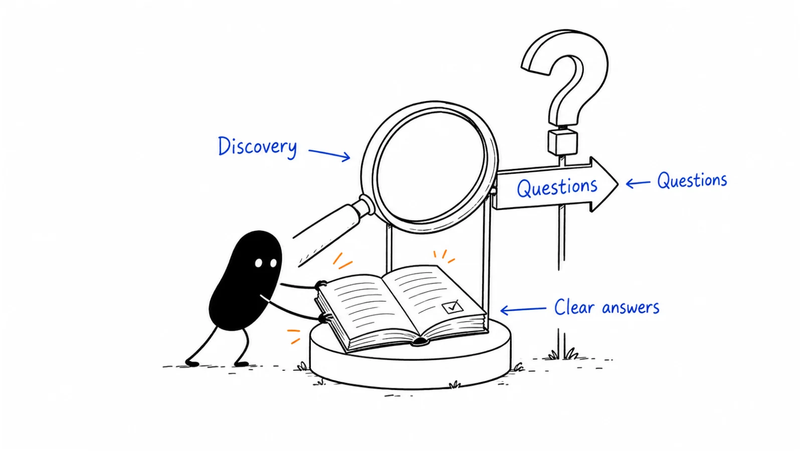

**Last reviewed:** 2026-09-08 · **Reading edit:** 2026-09-08

A founder searches for the category, opens an AI answer, and sees three competitors. Their own company is missing.

“Why aren't we in this?”

It is a fair question. It is also several different questions hiding inside one sentence. Can the system find the company's pages? Does it understand what the product does? Is the product relevant to this particular request? Is another source describing it incorrectly? And would appearing in this answer help the business?

Buying a visibility dashboard can make the absence easier to monitor. It does not tell you which of those problems to solve.

This chapter connects search discovery, useful content, technical diagnosis, and measurement. It covers ordinary search results as well as AI-generated answers. The aim is to help the right people discover something worth reading, understand it accurately, and take an appropriate next step.

You will build a small question map, improve a page, check whether it is accessible to the relevant systems, and review the result without turning a few screenshots into a claim about the whole market.

*Reading guide: understand the question → choose the page → check access and accuracy → observe discovery → connect it to useful action.*

Already have a page that seems invisible? Go to [the technical check](#check-one-url-before-diagnosing-the-whole-site). Already have a dashboard? Start with [measurement](#step-4-update-the-metrics-you-review). For a complete example, read [the fictional team's first cycle](#worked-example-illustrative).

## Use this when

You want relevant people to discover your business while researching a problem, learning a method, comparing approaches, or evaluating a product.

You might have a strong product page but weak educational coverage. You might publish a great deal and still leave practical buying questions unanswered. Or you might have useful documentation that is difficult to reach from the rest of your site.

This work also helps when an answer system describes the product using old information. Being included is not necessarily good news if the answer invents an integration, misstates access requirements, or recommends you for a job you cannot perform.

An established company can start with existing search and customer data. A new company can start with a provisional audience, interviews, observed workflows, and a small set of hypotheses. You do not need a finished positioning document or a minimum number of customers before investigating how people find information.

## Do not use this when

You need a predictable number of meetings next week and have no existing search presence. You can begin this work, but do not make it the only response to an immediate pipeline gap.

You want to control every answer that mentions your company. You can correct your material, supply evidence, and use a platform's feedback process. You cannot guarantee how another system will summarize the web.

You are looking for a universal crawler configuration. Access, indexing, answer inclusion, and model training are different concerns. The settings and their effects depend on the provider.

This is also not a complete migration, international SEO, security, or legal manual. Those projects can require specialist review. A marketing team should not remove authentication or weaken a firewall to make an SEO test pass.

## A few useful terms

**SEO**, or search engine optimization, is work that helps relevant people find and use a site through search. Technical access, content, presentation, and measurement all matter to that work.

**AEO**, or answer engine optimization, is commonly used for work focused on answers rather than only lists of links. **GEO**, or generative engine optimization, is another industry label. The terms overlap; they do not describe a universal technical standard.

A **query** is a search request. A **prompt** can include a question plus additional instructions and context. A buyer asking for software recommendations after a long conversation is not necessarily receiving the same experience as someone typing those words into a fresh session.

**Retrieval** means obtaining information to help produce an answer. **Training** changes a model through a training process. Finding a newly published page during a web search does not establish that the page has become part of a model's training.

A **mention** names your company. A **citation** points to a source. An answer can mention you while citing someone else's article, or cite your educational article without recommending your product. Keep those events separate.

**Zero-click** describes an interaction that does not produce a click to your site. It tells you something about the interaction, not whether the person remembered you, trusted you, or later became a customer.

## Keep this in mind

Before deciding what to optimize, describe what you actually observed.

“We are invisible to AI” is hard to investigate. “In two fresh sessions on this named product, this question produced an answer that omitted us” is a record someone else can examine.

Similarly, “SEO stopped working” may mean that an educational page lost visits, a contact form broke, non-brand discovery declined, or one large customer stopped returning to the documentation. Those situations call for different work.

A useful way to think about discovery is a sequence with several possible breaks: a system discovers a URL, accesses its content, processes it, selects information for a particular request, presents something to a person, and perhaps sends them to the site. The person then decides whether the material is useful.

That is a diagnostic model, not a claim that every search or answer product has the same architecture. You usually cannot observe every stage. Record what you can see, and label what you are inferring.

## How to do it

### Step 1: Collect questions from buyers

Start with situations, not a spreadsheet containing every variation of a keyword.

Imagine an operations lead who spends part of Friday assembling correction requests for engineers. They might not search for the category name your company has chosen. They might ask how to reduce missing information, compare a shared inbox with a structured request process, or look for an example of a good handoff.

Each question tells you something about the work. None automatically proves purchase intent.

#### Collect the question and its context

For each useful question, record where it came from and what the person was trying to do. A support ticket, an interview, a sales note, and an estimated search-volume report are different kinds of evidence.

Preserve the wording when you have permission to use it internally. Remove personal information and customer details from public examples. If you rewrite a question to make it clearer, keep the distinction between the original and your interpretation.

A question such as “Can this work with our existing approval process?” becomes much more useful when you know who asked it, which approval process they meant, and why changing it would be difficult.

Your question log can include several sources:

- Conversations with customers, prospects, people who declined, and people using another approach.
- Support and implementation questions, including problems that happen after purchase.
- Search queries and landing pages in the reporting tools you can legitimately access.
- Public discussions where the intended audience describes its work.
- Questions your team believes will matter as the market changes.

Treat the last category as a hypothesis. It is a legitimate starting point, particularly for new categories, but it should not be presented as observed demand.

Keyword tools can help with vocabulary and relative interest. A low estimate does not prove that a narrow business question is worthless. Equally, “high intent” is not a reason to assume an obscure question has a large audience. Write down both the relevance you expect and the uncertainty about demand.

#### Separate discovery from brand checking

“How should a small operations team prepare correction requests?” asks about a problem.

“What does our company do?” asks about your company.

Both can be worth testing. They answer different questions. If every prompt includes your brand, a high mention rate tells you very little about whether someone unfamiliar with you would discover it.

Keep a small brand-check set for factual accuracy: scope, audience, deployment, availability, limitations, and commercial terms you publicly disclose. Keep a separate non-brand set for discovery and evaluation.

Also include questions for which the product should not be recommended. If the service cannot execute production changes, a system recommending it for autonomous production repair has made a consequential error. Counting that as a visibility win would reward the wrong behavior.

#### Choose a manageable first cluster

You do not need fifty prompts to begin. You need a set small enough to inspect properly and broad enough to represent the immediate problem.

For a first cycle, a solo founder might choose six to twelve questions around one workflow. That is a practical starting suggestion, not a statistically sufficient sample or an industry requirement. A larger business may need several distinct audiences and languages, each with its own review.

Here is how the fictional request-preparation business could map its questions:

| Reader's question | What they need to understand | A useful place to answer |
|---|---|---|
| Why do requests keep coming back incomplete? | Causes and a way to diagnose them | A practical problem guide |
| What belongs in a correction request? | Fields, examples, and review checks | A template with instructions |
| When is a shared inbox still enough? | Tradeoffs and conditions | An approach comparison |
| Who approves and executes a change? | Responsibility and access boundaries | The service's workflow page |
| Can this handle every request type? | Supported scope and exclusions | A maintained capability page |

The first two questions could belong on one substantial guide. The last two might be sections of the same service page. The map is a way to find the right home, not a rule requiring five new URLs.

#### Have the prioritization conversation

The following exchange is invented to show the decision, not a record of a customer interview.

**Founder:** “The category keyword has much more volume. Shouldn't we start there?”

**Marketer:** “Possibly. But the people we have spoken with are struggling to prepare requests, and we can explain that well. We have very little to add to a broad category overview yet.”

**Founder:** “Will the narrower guide bring buyers?”

**Marketer:** “We don't know. It has a plausible audience, we can share it directly, and it answers a question that already causes work. Let's test that while we continue researching the broader category.”

The important part is the reasoning. You are not choosing narrow questions because narrow is always better. You are choosing work with a clear audience, a useful contribution, and a way to learn.

### Step 2: Write pages that answer those questions

A reader arriving from search has not necessarily read your homepage or followed the story you intended.

Give them enough orientation to understand the page on its own. Explain the problem, identify the relevant conditions, and provide the answer or method they came for. Then offer depth for the person who needs to evaluate the details.

That does not mean every page needs an identical summary box. A troubleshooting guide, a comparison, and a research paper have different reading jobs.

#### Decide whether to improve, combine, or create

Before drafting, look for an existing page that already serves the question.

If a useful guide is outdated, update it. If several thin pages make the reader assemble one answer across five tabs, consider combining them. If the subject is genuinely distinct or the reader needs a different task flow, create a separate page.

Do not merge pages simply because their keywords overlap. A developer looking for an integration procedure and an executive comparing operating models may need different material even when both use the same category vocabulary.

Similarly, do not keep an unhelpful page only because it has historical traffic. Inspect what people seem to arrive for, what the page provides, and whether there is a better destination. If a URL changes, plan redirects and internal-link updates with the site owner.

A topic cluster should feel like a small, navigable library. A reader should understand where to start and where to go deeper. A collection of near-identical introductions does not provide that experience.

#### Make the answer specific enough to inspect

Consider this opening:

“Our intelligent platform transforms operations with seamless automation.”

A reader cannot tell what happens, what changes, or who remains responsible.

For the fictional service, a more useful opening would be:

“The service helps an operations team prepare one supported type of correction request. It organizes the supplied information into a reviewable package, with substantial human assistance. Your engineers still approve and execute the change; the service cannot write to production.”

That paragraph is not a ranking formula. It is a clear explanation of a product someone might otherwise misunderstand.

The rest of the page should support it. Show the inputs, the resulting package, the review process, the exclusions, and what happens when information is missing. If there is no measured time-saving result, do not turn the workflow description into one.

A comparison page needs similarly concrete criteria. Instead of awarding yourself every check mark, explain when a shared inbox is sufficient, when a form helps, and when assisted preparation might justify its cost. If you name competing products, check current primary sources, date the comparison, and distinguish a documented feature from your judgment.

#### Add something the reader cannot get from a generic summary

You do not need a proprietary dataset to contribute something original.

You might show a complete worked example, annotate a request before and after review, explain a decision that often goes wrong, or provide a template with instructions and limitations. A practitioner can describe a tested procedure without claiming it works in every organization.

For the request guide, a useful exhibit would show an incomplete request and explain why an engineer cannot act on it. Perhaps the record identifier is missing, the desired state is ambiguous, or no approver has been named.

A second exhibit could show the repaired request using fictional data. Label it clearly. The value is the reasoning behind the changes, not the appearance of a real customer screenshot.

Keep essential qualifications beside the claim they limit. If the service handles only one request type, do not put that fact exclusively in a footer while the introduction promises to handle “all operations work.”

#### Edit for an actual visit

Give the title a recognizable subject and a clear promise. Use headings that help someone find the part they need. Descriptive links are more useful than repeated “learn more” labels. Google also explains that result titles and snippets may be drawn from several page elements; your preferred title and description are not a guarantee of the exact search display. There is no magic word-count target. See the [SEO Starter Guide](https://developers.google.com/search/docs/fundamentals/seo-starter-guide?ref=b2b-playbook).

On a phone, can someone read the example without pinching? Can they scroll a wide comparison table? Can they copy the template without selecting navigation text? Does a popup cover the answer?

If you add an image, make it explain something or provide a useful visual pause. Keep important product facts in readable text as well. A screenshot of a table is difficult to search, copy, update, and use with assistive technology.

The next step should fit the question. A person diagnosing incomplete requests may want a template. A person checking product scope may want documentation or a conversation about fit. A demo button on every paragraph does not make those needs identical.

#### Check one URL before diagnosing the whole site

Separate a content problem from an access problem.

Choose one important public URL and record what you expect it to contain. Then ask the site owner to inspect the actual response, search-tool diagnostics, and relevant access settings. Do not stop at “it loads on my laptop.”

A practical first check includes the response status and final destination, the content returned, any indexing directives, the preferred canonical URL, links leading to the page, and whether the intended crawler is being blocked. Record the result and the date.

For duplicates, make the preferred URL consistent across your configuration. A canonical declaration is a signal, not an instruction that Google must obey. The declared and selected canonical can differ. Google's [canonicalization guide](https://developers.google.com/search/docs/crawling-indexing/consolidate-duplicate-urls?ref=b2b-playbook) explains the options and why conflicting signals should be avoided.

A sitemap helps communicate URLs; it is not proof of indexing. A page appearing in an index is not proof that it will rank for a particular query.

Be careful with JavaScript diagnoses. Google can execute JavaScript, so an initially sparse HTML response does not by itself prove that Google cannot read the page. Inspect the rendered result and relevant resources, rather than declaring every client-rendered site broken. Other retrieval systems may behave differently; test the system you care about. See Google's [JavaScript SEO documentation](https://developers.google.com/search/docs/crawling-indexing/javascript/javascript-seo-basics?ref=b2b-playbook).

For public editorial pages, making the essential material reliably available is a sensible engineering goal. That might involve fixing a rendering failure, changing a loading dependency, or using server rendering. The appropriate fix depends on the observed failure, not on an AEO checklist's preferred framework.

<Accordion title="A page opens normally, but a crawler appears to be blocked">

Start with evidence from the specific URL. Is the response a real article, an error page, a login screen, or a challenge? Does the report describe the current page or an older crawl?

Ask the owner to compare the relevant diagnostic output with the server or CDN record. A bot-like user-agent string alone does not verify a crawler's identity. Use the provider's documented verification method where needed.

If a public page is unintentionally blocked, propose the narrowest appropriate configuration change and a rollback plan. Keep private routes, administrative pages, and customer information protected.

Do not turn off authentication or the whole site's abuse protection to satisfy a visibility tool. If the page is intentionally private, the correct outcome may be to publish a separate, approved public explanation.

After a fix, repeat the original check and record what changed. A successful response confirms that particular access test; it does not establish indexing, citation, or commercial impact.

</Accordion>

#### Keep access policies separate from visibility wishes

Robots rules primarily manage crawling; they are not a security boundary. Google may know a blocked URL through links without crawling its content. Do not use robots.txt as a way to protect confidential information or assume it reliably removes a page from results. Google's [robots introduction](https://developers.google.com/search/docs/crawling-indexing/robots/intro?ref=b2b-playbook) explains these distinctions.

Ask the responsible owner what the company intends to permit: public search discovery, use in particular answer experiences, or other uses. Then check the current provider-specific controls. There is no single “allow citation, block training” switch that works identically everywhere.

For Google, the current Search Console documentation describes a separate **Search generative AI** inclusion control, including inherited settings. It says the worldwide rollout completed August 31, 2026. That control concerns supported Search AI experiences, not model training or exclusion from ordinary Search. Review the [control documentation](https://support.google.com/webmasters/answer/16908024?ref=b2b-playbook) before changing it. This chapter has not inspected your property's setting.

These are business and publishing choices as well as technical ones. Record who approved a change and why. Do not silently override a deliberate exclusion because a marketing report would look better with more coverage.

#### Use current rules, not remembered tricks

Google's current AI optimization guide says special AI markup is unnecessary and that llms.txt does not improve or damage visibility in Google Search. It also rejects a requirement to divide every article into tiny pieces. A readable long page can address related questions. See the [AI optimization guide](https://developers.google.com/search/docs/fundamentals/ai-optimization-guide?ref=b2b-playbook).

A machine-readable file may still be useful to another system that actually consumes it. Define that use and verify it. Do not relabel a documentation convenience as a demonstrated search-ranking advantage.

Structured data should have a specific, supported purpose. In particular, an old recommendation to add FAQ markup for a Google FAQ rich result is now outdated: Google's changelog says that feature stopped appearing from May 7, 2026. A helpful FAQ can still be worth writing for readers. See the [Search documentation updates](https://developers.google.com/search/updates?ref=b2b-playbook).

Dates matter here. A confident article from last year may describe a feature that no longer exists. Check the underlying documentation before adding engineering work to the queue.

### Step 3: Keep important facts consistent across sources

Your website is not the only place someone may learn about the business.

A partner page might describe an earlier version. A directory may use the wrong category. An interview may be accurate for its publication date but omit a recent limitation or product change. An answer can point to one of these sources rather than your preferred page.

Start with a small factual record you can maintain: what the product does, who it serves, what it does not do, which capabilities are available, and where a reader can verify the current description.

This is not an instruction to make every author repeat identical marketing copy. Independent sources should remain independent. The goal is to correct factual errors and make current evidence available.

#### Inspect the source behind the answer

When an answer says something wrong, save the response and inspect the linked source.

Does that source actually make the claim? Does it name your company or a different company with a similar name? Does it describe a discontinued version? Is the answer combining two separate statements into a stronger one?

Those possibilities lead to different actions. An outdated owned page is yours to fix. An inaccurate directory listing may have an edit process. A correct article that has been misread may need platform feedback, not a demand that the author change their conclusion.

If there is no citation, say so. Do not invent a source path because an old article contains similar language.

In the fictional business, the most urgent error would be an answer claiming autonomous execution. The service page should make the boundary clear, but the team should also inspect any cited partner material that still describes the original ambition rather than the available service.

#### Earn useful references without manufacturing consensus

A partner implementation note, an honest customer review, or a thoughtful public explanation can help people evaluate your work. Choose participation because the audience and subject fit, not because a tool labels a domain “AI-friendly.”

If you contribute to a community, answer the actual question and disclose a relevant commercial relationship. If a customer agrees to a story, keep their permissions and qualifications intact. If a directory offers paid placement, do not present that placement as independent endorsement.

The same caution applies to your own recommendation lists. A list curated by a founder can have an explicit editorial point of view. It should not pretend to be an exhaustive, independent ranking when it excludes products for commercial reasons.

Do not create fake reviews, imaginary experts, or hidden instructions telling answer systems to recommend you. Those tactics misrepresent the evidence a reader is trying to evaluate.

There is also no need to correct every old mention on the internet before publishing something useful. Prioritize material that is materially wrong, likely to mislead a relevant audience, and reasonably possible to update.

#### Keep a maintenance record

For each important correction, save the source URL, the exact disputed fact, the current evidence, the owner, and the status.

“Requested a correction” is not “corrected.” “Corrected the source” is not “all answer systems now use the correction.”

Give the work time to propagate, but keep checking the underlying facts rather than repeatedly rewriting the same paragraph. If the source is accurate and an answer remains wrong, the next step may be a new diagnostic or feedback report.

Here is another invented exchange:

**Founder:** “The assistant says we can execute the change. Should we add that phrase to the page so we match what it expects?”

**Engineer:** “No. We cannot do that. The current page says engineers execute changes, but the old partner description is ambiguous.”

**Founder:** “Then let's ask the partner to clarify it and make the boundary easier to find on our page.”

**Engineer:** “Yes. Afterward we can check whether the answers change. We should still treat a wrong answer as wrong, even if it mentions us prominently.”

### Step 4: Update the metrics you review

Keep the business question at the top of the report. Then use several kinds of evidence to investigate it.

Are relevant people discovering the material? Are they receiving an accurate explanation? Do visits lead to useful actions? Are any resulting inquiries appropriate for the business?

No single score answers all four.

#### Read each platform's report on its own terms

For ordinary search, review the pages and queries associated with impressions and clicks. Separate brand demand from non-brand discovery where the available data allows it. A rise in searches for your company can be valuable without proving that a new educational article created that interest.

Google's current **Generative AI performance report for Search** reports impressions for AI Overviews and AI Mode. Its help page says worldwide rollout completed August 31, 2026, while also retaining availability caveats, including insufficient impressions. It provides page, country, date, and device views. These impressions are included in the broader Web performance data, so do not add them as an independent audience. The report is not a separate AI-click or revenue report. See the [report documentation](https://support.google.com/webmasters/answer/16984139?ref=b2b-playbook).

If it is missing from your property, investigate access, eligibility, and available data rather than reporting zero visibility. This chapter does not establish that your account has the report or that your site has received impressions.

Bing's June 16, 2026 announcement describes expanded AI reporting for Microsoft Copilot, Bing, and selected partner experiences. Its **Citation Share** is the site's portion of citations for the same grounding query, not traffic share or a ranking score. Intents, Topics, and period comparison add context, but do not extend the report to every answer engine. See the [Bing announcement](https://blogs.bing.com/search/June-2026/New-AI-Visibility-Insights-in-Bing-Webmaster-Tools-Intents-Topics-Citation-Share-Compare?ref=b2b-playbook).

A first-party citation metric can be useful. The mistake is not measuring citations; it is changing their meaning when they enter a presentation.

#### Build a repeatable prompt check

A manual or vendor-assisted prompt check answers a narrower question: what happened when this set of prompts was run under these conditions?

Record the product or interface, visible model/version if available, date, language, region or location setting, web-search mode, and whether the session was fresh. If a setting is unavailable, record “not exposed” rather than guessing.

Use the same core questions across review periods. Add new questions in a separate exploratory set so that you can learn without quietly changing the denominator.

Repeat questions when practical. Save the full answer and source links, not just the most favorable sentence. Keep products separate; an API workflow is not automatically equivalent to the consumer interface a buyer uses.

Count technical failures and refusals visibly. Decide in advance whether a valid “I cannot recommend a product here” answer counts as a completed response. A connection error is different. If you retry errors, document the retry rule and retain the original attempt.

For each completed response, assess whether the company was mentioned, whether material statements about it were accurate, and whether an owned page was cited. You can also record the sources used, a competitor mention, or a missing limitation when those help a decision.

Do not treat these categories as mutually exclusive. One answer can belong to several.

#### Review accuracy with a written rule

Accuracy needs a reference. Keep an approved factual record and define what counts as a material error before scoring the next batch.

For the fictional service, “helps prepare requests” is accurate. “Executes production corrections automatically” is not. An answer that omits a minor descriptive phrase may be acceptable; one that removes the human-approval boundary may not be.

Have a second person review ambiguous cases if possible. A solo founder can revisit flagged answers separately and document their reasoning. You do not need to pretend that judgment has disappeared because the result is in a spreadsheet.

You may report both accuracy among mentions and accurate coverage across all completed answers. State the denominator. If the system mentions you less frequently but gets the remaining mentions right, accuracy among mentions can rise while useful coverage falls.

<Accordion title="What should an AI visibility vendor explain before you buy?">

Ask how prompts are chosen, where they run, how often they repeat, and which settings are controlled. Can you inspect the original answers and citations? Can you export them?

Ask what the denominator includes. Does a score count answers, prompts, citations, or estimated demand? How are errors, retries, missing data, and model changes handled?

Ask whether brand mentions and owned-source citations are separate. How does the tool decide that a description is accurate? Can you correct a mislabeled result without rewriting history?

Finally, ask what work the tool will help you do next. A reliable record can save substantial time. A polished score with no inspectable evidence may be difficult to act on.

Run a small, bounded evaluation using questions you understand. The purpose is to assess the tool's usefulness and measurement method, not to demand guaranteed rankings.

</Accordion>

#### Connect discovery to visits and business outcomes

On your site, distinguish arrival from useful action. A page view, template copy, documentation visit, inquiry, qualified opportunity, and closed sale represent different events.

Use the events that fit the page's job. A how-to guide may help a customer complete a task. A comparison page may support an evaluation. Not every useful visit should end in a lead form.

For acquisition, check that the form or booking flow works and that relevant records reach the people who follow up. A content team can otherwise spend weeks diagnosing a traffic problem while inquiries are being lost.

Referral data can identify some visits from answer products. It cannot reveal all prior exposures. A buyer may read an answer and later type your address, use another device, or arrive through a colleague.

A voluntary “How did you hear about us?” question can add context. Preserve the person's answer instead of automatically converting every mention of AI into sourced pipeline. Self-report is useful evidence, but it can be incomplete and influenced by how you ask.

Use consented analytics and appropriate access controls. A visibility project does not justify collecting more personal information than you need.

#### Separate monitoring from a causal experiment

Publishing a page and observing better answers afterward is a before-and-after observation.

The system may have changed. Another publisher may have written about the category. Demand, competitors, or the questions people ask may have shifted. Your own page change may have mattered, but the observation alone does not isolate its effect.

Record the change date, what changed, and competing explanations. A stable prompt set makes comparison more interpretable; it does not create random assignment.

Where an actual controlled test is feasible, define it with the help of the [experimentation guide](../09-operations-pipeline-and-measurement/experimentation.md). Do not call every repeated measurement an experiment.

### Step 5: Avoid unsupported ranking shortcuts

The temptation is understandable. A technical trick feels easier to purchase than months of useful publishing and careful maintenance.

Ask a proposed tactic to name its mechanism, evidence, scope, and cost. Which system is supposed to use it? What should change? How will you observe that? What else could explain the result?

A claim that one company saw improvement after a change may be worth investigating. It is not automatically a rule for your site.

Google's spam policy addresses large-scale, low-value content made primarily to manipulate rankings, regardless of how it is produced. It does not say that every use of AI in writing is spam. The relevant question is what you publish and why, not merely which editor you used. See the [scaled content abuse policy](https://developers.google.com/search/docs/essentials/spam-policies?ref=b2b-playbook).

You can use AI to organize a question log, identify inconsistencies, or draft alternatives for review. Keep responsibility for facts, examples, permissions, and the final explanation with someone who can verify them.

Do not outsource that judgment to a prompt saying “make this authoritative.”

#### Decide what not to do this cycle

A good first cycle may leave many possible improvements untouched.

You might postpone a site-wide content expansion, a new data feed, or a paid monitoring tool because the current question is simpler: can a relevant reader find and understand the service's limits?

Write down the deferred work and the condition that would make it worth revisiting. That is more useful than declaring a tactic permanently useless.

Likewise, do not automatically prioritize the pages already receiving citations. A frequently cited page with a factual error may deserve immediate attention. An uncited page that answers a critical evaluation question may also be valuable. The decision depends on importance, current quality, likely audience, and effort.

## Worked example (illustrative)

Everything in this example is invented for teaching. It is not a Lensmor result, a customer account, or an observed search experiment.

The business helps operations teams prepare one supported kind of correction request. Substantial human assistance is involved. Customer engineers retain approval and execution, and the service has no production-write capability.

The founder wants people researching incomplete requests to understand this approach. They also want to stop the service being confused with autonomous execution software.

### The starting point

The site has a short service page and three broad posts about operational efficiency. None shows a complete request package.

A directory description says “automates corrections,” reflecting an earlier, imprecise pitch. The team has not established which answer systems have seen that description.

The first useful task is not to publish thirty more posts. It is to produce one honest explanation with enough detail to evaluate, while correcting the known ambiguity.

The team chooses a question cluster around preparing requests and a separate brand-accuracy set. They record the questions before making the changes.

### What they publish

The existing service page receives a clearer scope statement, an input-to-output example, the human-review boundary, and a section explaining which requests are unsupported.

A new practical guide explains how to diagnose an incomplete request. It includes a fictional before-and-after package and a reusable checklist. The guide links to the service page only where that alternative becomes relevant.

The directory owner receives a correction request supported by the current service description. In the work log, this stays “requested” until the published listing changes.

An engineer checks the public pages' access and indexing configuration. The team records those results separately from the content work. Nothing in this fictional account assumes that technical eligibility guarantees search placement.

### How they check answers

For one named answer product, they run twelve fixed non-brand questions twice in each review period. That produces twenty-four completed answers per period. In this simplified example there are no technical failures, and the test conditions are held as consistently as the interface allows.

They save all answers. The scoring rule requires the service's scope and responsibility boundary to be materially correct whenever described.

| Observation in this fixed test | Before | After |
|---|---|---|
| Completed answers | 24 | 24 |
| Answers mentioning the company | 6 | 10 |
| Answers with a materially accurate company mention | 4 | 8 |
| Answers citing an owned page | 3 | 7 |

Mention coverage changes from 6/24, or 25%, to 10/24, or about 41.7%: an increase of about 16.7 percentage points.

Accurate coverage changes from 4/24 to 8/24, or about 16.7% to 33.3%. Accuracy among mentions is a different calculation: 4/6, or about 66.7%, compared with 8/10, or 80%.

The citation counts overlap with the mention counts. They cannot be added together to produce seventeen “wins.” This test also does not measure citation share across the whole product, let alone the market.

The team can say that the recorded answers improved on its fixed test. It cannot say that the new guide caused the improvement or that 41.7% of potential buyers now see the company.

### What happens to the site metrics

Suppose two equal-length observation windows produce the following fictional figures. Tracking definitions are unchanged, and the inquiry groups have been given the same time and process for qualification.

| Measured outcome | Earlier window | Later window |
|---|---|---|
| Organic-search sessions in scope | 1,000 | 600 |
| Inquiries recorded from those sessions | 10 | 12 |
| Inquiry rate per session | 1% | 2% |
| Inquiries subsequently qualified | 4 | 3 |

Sessions fell 40%. Inquiry count rose 20%. The inquiry rate doubled, increasing by one percentage point.

But qualified inquiries fell from four to three. The improved inquiry rate does not establish improved commercial performance.

Small counts also make these figures sensitive to individual inquiries. The team should examine the pages, sources, and fit of the inquiries rather than declaring either a breakthrough or a collapse.

The prompt observations and site figures are separate datasets. They do not prove that an AI citation produced a particular inquiry. No identity-level link between the two has been established.

### The review conversation

This final exchange is also fictional.

**Founder:** “Our mention coverage went up and the inquiry rate doubled. Can we call the new approach a success?”

**Marketer:** “The answer checks improved, but qualified inquiries fell. We should report both. We also cannot attribute the changes to one article.”

**Founder:** “What would you do next?”

**Marketer:** “Keep the clearer explanation, inspect the poor-fit inquiries, and check whether the remaining wrong answers cite outdated material. Then decide whether the next page should address fit rather than attract more general interest.”

That is a useful outcome for a first cycle: a better page, a clearer measurement record, and a more specific next question.

### What a second cycle might change

Suppose the poor-fit inquiries mainly ask for autonomous execution. The team should inspect the search snippets, landing pages, and form context those visitors encountered. The answer may be another unclear page, not the newly improved guide.

It could also be a genuine mismatch between the audience being reached and the service being offered. In that case, more visibility for the same promise may increase the problem.

The second cycle might clarify the comparison between assisted preparation and autonomous execution, improve an exclusion near the inquiry form, or choose questions closer to the supported workflow.

Do not invent a new product capability to improve conversion. A useful search presence sometimes helps a person recognize that you are not the right choice.

## Copy: visibility one-pager (fill)

Use this record to turn a general visibility concern into a bounded piece of work. The example fields are prompts, not requirements to finish an entire marketing system first.

~~~text
DISCOVERY AND ANSWER BRIEF

Reader and situation:
Question cluster:
Evidence behind these questions:
What remains a hypothesis:

Page to improve, combine, or create:
Why this is the right home:
Answer the reader should receive:
Example or evidence we can provide:
Important scope, exclusions, and review date:
Appropriate next step:

Public-access check:
Indexing / canonical observations:
Provider-specific inclusion settings to review:
Technical owner and unresolved issues:

Other source with a material factual problem:
Evidence for the correction:
Owner and correction status:

What we will change this cycle:
What we will leave unchanged:
How we will observe the result:
Business outcome to review separately:
Next review date and decision owner:
~~~

Working file: [answer-visibility.xlsx](../../templates/answer-visibility.xlsx). Use a copy for your own records. Its planning defaults can be adapted to your audience and capacity; they are not platform rules. Keep raw responses and sensitive commercial notes in an appropriate private location, not in a public workbook.

For the wider publishing queue, connect the brief to [content strategy](../03-brand-story-and-content/content-strategy.md).

## Before you start

You should be able to explain why this question matters, what the reader will gain, and which claim requires verification.

You should also know who can inspect technical settings. A marketer can identify an access concern without having permission to change production infrastructure.

Before publication, check the page's facts, sources, examples, phone layout, internal links, and next step. Preserve useful existing URLs where possible, and arrange redirects when a move is necessary.

Before measurement, write down the conditions and scoring rules. A repeatable record makes the next review much less dependent on memory.

~~~text
PROMPT CHECK AND REVIEW RECORD

Question-set version:
Core or exploratory set:
Question origin and intended audience:
Brand included in prompt?:
Product / interface:
Visible model or version (or not exposed):
Date, language, region, and web-search mode:
Fresh session and other relevant conditions:

Planned questions and repetitions:
Technical failure / retry rule:
Completed response definition:
Material-accuracy reference:
Scoring rules and reviewer:

For each attempt:
- Prompt and complete response
- Error or completion status
- Company mention
- Material accuracy and reason
- Owned citation and source URL
- Other cited source requiring review

Summary:
- Attempts, failures, and completed answers
- Mention coverage with denominator
- Accurate coverage with denominator
- Accuracy among mentions
- Owned-citation coverage
- Known changes and competing explanations

Separate business observations:
What this record does not establish:
Next action, owner, and review date:
~~~

Do not silently replace an old run with a favorable retry. Keep enough detail for a later reviewer to understand what happened.

## Metrics

Choose a small set that supports the current decision. You do not need every available chart at every meeting.

| Measure | Useful question | Important limit |
|---|---|---|
| Search impressions and clicks | Are relevant pages being discovered? | Query and page context matter |
| Platform AI impressions or citations | Where does this platform show our material? | Coverage and definitions are platform-specific |
| Fixed prompt checks | What answers appeared under these conditions? | Not a representative market survey |
| Material answer accuracy | Is the product being described correctly? | Requires a reference and judgment |
| Useful on-site actions | Does the visit help someone do something? | An action is not automatically buying intent |
| Qualified inquiries and opportunities | Are appropriate buyers progressing? | Attribution and maturation need care |

Use counts alongside rates. Twelve inquiries are easier to interpret when the reader also sees the denominator and how qualification changed.

Review recent data cautiously. If the relevant buying process takes longer than the reporting window, separate leading observations from outcomes that have not had time to develop.

Keep a short decision note with each review. “Updated the unsupported-capabilities explanation” is a more useful record than “continued AEO optimization.”

## Common mistakes

**Starting with the competitor screenshot.** It can identify a question worth examining, but one answer does not show the whole audience's experience. Record the conditions and investigate the underlying page and sources.

**Writing for an imaginary universal bot.** Different products have different access paths, settings, and reporting. Name the system you are diagnosing.

**Splitting every variation into a page.** Give each page a coherent job. Related questions can belong together; distinct tasks may deserve separate guides.

**Confusing visibility with correct understanding.** A prominent recommendation for an unsupported capability can create poor-fit inquiries and disappointed buyers.

**Treating every traffic decline as an AI effect.** Check instrumentation, technical changes, seasonality, demand, query mix, and affected pages before assigning a cause.

**Treating every conversion-rate rise as growth.** A shrinking denominator can increase a rate while useful outcomes decline. Read the counts and quality together.

**Buying a score before defining the question.** A tool can be valuable when its method is inspectable and it reduces real work. Ask what decision the next report will support.

**Leaving old promises in circulation.** Maintain the material facts you control, request corrections where appropriate, and distinguish a pending request from a completed update.

## What to read next

Use [content strategy](../03-brand-story-and-content/content-strategy.md) to decide how this work fits the rest of your publishing. [Channel strategy](channel-strategy.md) helps you decide how much to rely on discovery alongside other routes to customers.

For evaluation content, continue with [case studies](../03-brand-story-and-content/case-study.md) and [white papers](../03-brand-story-and-content/white-paper.md). For public product descriptions and customer feedback, read [review sites](review-sites.md).

When you want to claim that a change produced an outcome, revisit [experimentation](../09-operations-pipeline-and-measurement/experimentation.md). When buying another reporting product, use [MarTech governance](../09-operations-pipeline-and-measurement/martech-governance.md) to consider ownership, access, and ongoing cost.

## Sources and evidence boundary

This is an owner-maintained practical guide, not a ranking guarantee or a report of this repository's search performance.

Platform-specific statements were checked against primary documentation on September 8, 2026. Links beside the relevant claims cover Google's search basics, rendering, canonicalization, crawler controls, AI optimization, current Search Console reporting and inclusion controls, plus Bing's June 2026 reporting announcement.

Current Google help pages add reporting and inclusion controls that older AI-feature summaries do not describe. This edition uses the specific current help pages for those details. Their rollout statements are not confirmation that any particular account has data. Platform documentation and availability can change; check again when implementing.

The question maps, dialogues, scoring workflow, page examples, and operating recommendations are this guide's teaching synthesis. They are not documented ranking factors. All business figures in the worked example are fictional, and no customer, survey, causal experiment, or private analytics account is represented.

No claim is made that improving this article, using a template, or adding a file will produce a particular ranking, citation rate, traffic level, or revenue result.

---

Copyright © 2026 Ivan Xu. All rights reserved. See the [copyright and reuse terms](../../LICENSE).

Canonical source: [github.com/weilun88313/B2B-Playbook](https://github.com/weilun88313/B2B-Playbook)
