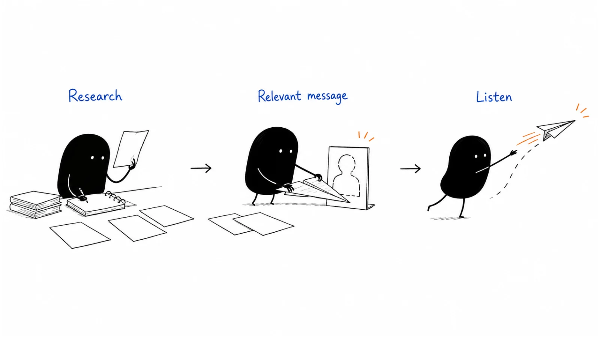

# 05 · Outbound & prospecting

Reaching out is easier when you can explain why the conversation might help the other person. Work from a relevant company and a real question toward a short message, an appropriate contact route, and a thoughtful response.

**Last reviewed:** 2026-09-06 · **Reading edit:** 2026-09-12

## Start here

1. [Find a reason to start a conversation](account-research.md) — Gather the few facts that matter to your question.
2. [Write a useful first message](cold-email.md) — Make the relevance and next step easy to understand.
3. [Continue the conversation well](reply-handling.md) — Answer what the person actually asked and keep your promises.

## Playbook map

| Guide | What it helps you do |
|---|---|
| [Account research](account-research.md) | What do we need to know before starting a conversation with this company? |
| [Buying signals](buying-signals.md) | Does a recent change give us a relevant reason to reach out? |
| [Message-market fit](message-market-fit.md) | Do suitable people understand and care about the offer? |
| [Cold email](cold-email.md) | How do we write a short first email with a useful reason to respond? |
| [Multichannel sequence](multichannel-sequence.md) | When does another contact step help, and when should we stop? |
| [SDR onboarding](sdr-onboarding.md) | How do we help a new prospecting teammate learn the work? |
| [Contact data](contact-data.md) | Can we trust and appropriately use the contact details we have? |
| [Cold call](cold-call.md) | How do we open a relevant conversation and handle the response? |
| [LinkedIn outbound](linkedin-outbound.md) | Which LinkedIn approach fits the relationship and the reason for contact? |
| [Contact research](contact-research.md) | Who is responsible for this task, and how can we approach them appropriately? |
| [Email deliverability](email-deliverability.md) | What keeps expected emails arriving reliably? |
| [Reply handling](reply-handling.md) | What did the person ask for, and what should happen next? |
| [SDR handoff](sdr-handoff.md) | What context should move from prospecting into the sales conversation? |

## Try one thing

Review one draft message. Underline the reason this particular person might care and the question you are asking. If either is missing, revise it before sending.

## Where to go next

Pick a guide above for the task you are working on, or browse [Account, field & partner marketing](../06-account-field-and-partner/) for a related part of the work.

[Back to the playbook index](../README.md)

**Status:** Domain guide published · 13 tactic playbooks published

---

Copyright © 2026 Ivan Xu. All rights reserved. See the [copyright and reuse terms](../../LICENSE).

Canonical source: [github.com/weilun88313/B2B-Playbook](https://github.com/weilun88313/B2B-Playbook)
