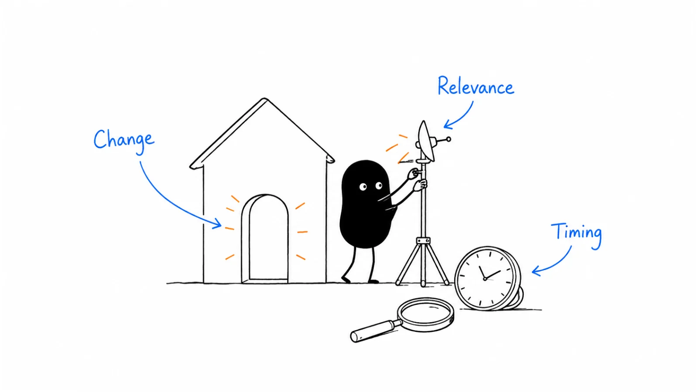

**Last reviewed:** 2026-09-09 · **Reading edit:** 2026-09-09

The alert arrives at 9:14: a company on your target list has hired a new VP.

By 9:20, the account is marked “high intent.” By lunchtime, three people have written versions of the same congratulations email. Nobody has checked what the new VP is responsible for, whether the company already uses your product, or whether the role has anything to do with the problem you solve.

The news is real. The buying intent is a guess.

That does not make the alert useless. A change in leadership, an upcoming renewal, a new operating region, or a request for pricing can help you decide where to pay attention. The useful part is understanding what changed and what that change makes possible. Sometimes it earns a conversation. Sometimes it earns a little more research. Sometimes it tells you to stop.

This guide is about making those decisions without turning every digital footprint into a reason to contact someone. You will build a small signal workflow, work through a fictional batch of accounts, and learn how to tell whether the extra information improves your decisions.

You do not need an expensive intent platform to begin. You do need to keep “we noticed something” separate from “the buyer asked for help.”



*Reading guide: notice a change → verify what happened → connect it to the work → choose an appropriate action → learn from the response.*

Already collecting alerts? Start with [choosing a signal to test](#step-2-choose-one-kind-of-signal-to-test). Wondering whether a pricing-page visit deserves a call? Read [website and content activity](#website-and-content-activity). The [worked example](#worked-example-illustrative) shows how a queue of eighteen alerts becomes a much smaller set of useful actions.

## Use this when

Your team has more alerts than attention. Someone needs to decide which ones deserve a response, a research check, an internal handoff, or no action.

You have suitable accounts but struggle to explain why a conversation would be useful now. You want to look for relevant changes without inventing urgency.

Marketing calls an account “engaged,” sales hears “ready to buy,” and the person who downloaded the document gets a conversation they did not request.

You want to evaluate a signal vendor or an AI research workflow. Before buying more data, you need to define the decision the information should improve.

You have an existing customer, former user, or open opportunity whose circumstances have changed. The useful action may belong to an account owner rather than an outbound rep.

You also want a way to learn from being wrong. A buyer saying “that hiring is for another division” is information the next person should not have to rediscover.

## Do not use this when

Someone has already made a clear, legitimate request and your signal process would delay answering it. A pricing question does not need two additional pieces of external evidence before someone responds.

The objective is to identify a private individual behind an anonymous visit or collect sensitive personal information. Keep the work tied to an appropriate business purpose, the information you can legitimately use, and the limits of what you actually know.

You are trying to overcome a known product mismatch with an exciting headline. Funding does not remove a deployment requirement you cannot meet.

You need the underlying account brief, the contact route, or the email itself. Use [account research](account-research.md), [contact data](contact-data.md), and [cold email](cold-email.md) for those tasks.

Signals are also not a prerequisite for all prospecting. A relevant offer to a suitable company can be worth testing without a recent announcement. Do not manufacture a trigger just to satisfy a field in the CRM.

<a id="words-you-will-use"></a>

## A few useful terms

A **signal** is an observation that might change a decision. It can be something a person directly tells you, an activity in a system, or a change in a company.

**Intent** is what someone is trying to do. Sometimes they state it clearly. Often your team is inferring it from incomplete evidence.

**Fit** is whether the offer could help with the account's work and constraints. **Timing** is whether there is a reason to consider that help now. **Permission** concerns whether and how you may use information or contact someone. These are different questions.

The same account can be a strong fit, have no current project, and have asked not to receive marketing. A score that combines everything into one number must not erase those distinctions.

| What you have | What it supports | What it does not establish |
|---|---|---|
| A direct request | Someone wants the response they asked for | Budget, authority, or agreement to a purchase |
| Known engagement | Someone interacted with content or a service | An active evaluation or permission for every channel |
| A relevant company change | A reason to investigate a possible new need | That a specific person has that need |
| An inferred account signal | A reason to review account-level context | The identity or intentions of a particular visitor |
| No observed signal | No additional timing evidence from your sources | That the company has no need or buying project |

Earlier versions of this page used “raised-hand,” “engaged,” “premise,” and “cold” as shorthand. Those labels can be useful if your team defines them, but they are not four universal stages every buyer passes through.

A person can request a demo without having known you yesterday. An existing customer can research a competitor. A stranger can have an urgent need without leaving any detectable signal.

When a label causes disagreement, go back to the observation: “This person asked whether the product supports their approval process” is clearer than “This is a hot account.”

<a id="one-rule"></a>

## Keep this in mind

Ask what the evidence is strong enough to justify.

A public job advertisement might justify checking which team owns a workflow. It does not justify telling that team you know its current process is failing.

A buyer's direct request might justify arranging a technical conversation. It does not justify assuming the contract will close.

A signal can also change your view of fit. If the company has genuinely introduced the workflow your product serves, an account that was unsuitable last year may now be worth revisiting. Verify the material change instead of insisting that fit can never change.

You are not looking for a magic number of facts. You are looking for a reasonable connection between the observation, the proposed action, and the consequences of being wrong.

<a id="operating-method"></a>

## How to do it

Start with a decision you already need to make: which account to research, which request to answer, which customer owner to notify, or which conversation to revisit.

Then work backward to the information that would improve that decision.

This is easier to manage than starting with every signal a tool can collect. A useful first workflow might cover one type of operational change in one segment. Another might simply make sure explicit requests reach the right person with their original context intact.

Keep those workflows separate enough that a news-alert backlog cannot bury a buyer who is waiting for an answer.

<a id="step-1-name-the-temperature-before-the-sentence"></a>

### Step 1: Separate interest from purchase intent

Read the actual action before deciding what it means.

“Downloaded the security guide” means a guide was requested. “Asked for our security documentation for an evaluation next month” gives you a purpose and a timetable. The two actions may look similar in an activity feed, but they call for different responses.

For a direct request, preserve the buyer's wording. If they ask for pricing for a particular team size, answer that question or explain what information is needed to answer it. Do not replace it with a generic qualification sequence.

For content engagement, fulfill what was promised. A webinar registration or white-paper download may belong in an inbound marketing report, but that reporting label does not establish a request for a sales call. Any additional follow-up needs its own appropriate basis, context, and restraint.

For a company change, write the possible business connection explicitly. “New regional warehouse → possibly a new local onboarding process” is a hypothesis to examine. “New warehouse → ready to buy software” skips most of the work.

For a vendor's inferred signal, keep the inference visible. A provider's category label is not the same thing as a buyer describing their project.

A practical note can be one sentence: “We have a company-level comparison signal, no identified evaluator, and no direct request; the next step is an account-owner review.”

That sentence tells the next person what not to assume as well as what to do.

### Start with the relationship you already have

Before creating a new outreach task, check whether the account is already a customer, an open opportunity, a partner, or a company with a recent conversation.

If an account owner is discussing a renewal, a fresh pricing-page alert should not trigger an unrelated cold email. If someone has a support problem, route the issue to the team that can resolve it rather than treating frustration as a new-logo opportunity.

A former user deserves similar care. Knowing the product at a previous company can make a conversation easier, but it does not tell you whether they liked it, chose it, administered it, or want it again.

Keep the relationship specific: “Used the reporting feature at their previous employer” is not “our champion.” Do not share their former employer's private usage, commercial terms, or internal difficulties in a new conversation.

A respectful reintroduction can ask whether the relevant work is part of the new role. It should not imply an endorsement the person has not given.

The relationship check is also where you catch instructions that must carry forward: no further marketing, contact through procurement, speak with the existing owner, or return only after an agreed date.

A new alert does not reset those instructions.

<a id="step-2-pick-one-family-this-week"></a>

### Step 2: Choose one kind of signal to test

Choose a signal because you can explain how it changes the work your product supports.

For an onboarding product, opening a new operating location may be relevant if each location introduces staff, responsibilities, and approval steps. For a translation service, a new language market might be more useful. The same announcement can matter to one offer and tell you almost nothing about another.

Start with this sentence:

> When this kind of company makes this change, we think this part of the work may change. We will check this missing fact before deciding whether to approach them.

The missing fact matters. It gives a researcher something to investigate and a reviewer a way to reject a weak account.

Do not choose a signal only because it is easy to collect. Funding and senior hires are visible, but visibility is not the same as relevance. A less dramatic update to an implementation plan may be more useful than a major press announcement.

Also consider whether the signal happens often enough to learn from, whether you can obtain it appropriately, and whether someone can act on it. A weekly review may suit a slowly developing expansion. An explicit request requires a response process that does not wait for the weekly meeting.

One initial workflow is often easier to inspect than several. That is a practical starting point, not a rule against running multiple well-owned programs.

### Leadership changes and new responsibilities

The useful question is not merely “Did someone get a new title?” It is “What responsibilities changed, and could those responsibilities include the work we help with?”

A new VP of Operations might inherit the same operating model and be asked to preserve it. Another might be hired specifically to standardize a process across regions. The title alone does not distinguish the two.

Look for an announced remit, a team description, a relevant hiring plan, or something the person has chosen to say publicly about their work. If none of that exists, keep the uncertainty instead of writing an imaginary ninety-day mandate.

There is no universal best week to contact a new leader. A genuine relationship or a requested introduction can make an early conversation appropriate. A complex transition may make a later approach more considerate. An old appointment can still matter if a current project has finally started.

Congratulating someone is not inherently wrong. The problem is using congratulations as a thin wrapper around a pitch that has no connection to the role.

If you have a relevant reason to speak, say it plainly. If you only have news of the appointment, it may be enough to update the account record and wait for more meaningful context.

### Hiring, cuts, and changes in capacity

A job description can reveal the work a team expects someone to do. Read the responsibilities, not just the title or the count of open roles.

“Build a process for onboarding regional partners” is more informative for a partner-operations offer than “Operations Manager.” Even then, the company might plan to solve the work by hiring a person rather than buying a product.

Check whether the role is current, which team it belongs to, and whether the wording describes internal operations or the product the company sells. Those distinctions can completely change your conclusion.

Several job postings can be one initiative, a long-running recruitment effort, or duplicate listings across locations. Count distinct roles and responsibilities only when the distinction is relevant. A large number in an alert does not establish sudden growth.

Cuts need more care, not a more aggressive pitch. Reduced headcount can mean a workload problem, a spending freeze, a change of strategy, or the closure of the very activity your product supports.

Do not write “You must be struggling after the layoffs.” If a legitimate business conversation is appropriate, keep it about the work and acknowledge that another purchase may not be sensible.

The useful outcome might be to pause an evaluation, narrow the proposed scope, or stop pursuing an account whose relevant team no longer exists.

### Funding, expansion, and new operating requirements

Funding is evidence of a financing event, not a category-specific spending plan.

Read what the company says the capital is for. A product-development investment, acquisition, debt refinancing, and geographic rollout imply different work. Even a clear expansion plan does not identify who has budget for your offer.

An operational change is often easier to connect to a task. A company opening a second distribution center may need to decide whether the new site will inherit the existing onboarding process or build a local one.

The important question is where the work will happen. A new region run entirely by a partner may not create a new internal team. A new product sold to existing customers may reuse current infrastructure.

Check the status as well as the announcement. Planned, approved, launched, delayed, and cancelled are different facts. An article published this week can describe a decision made last year.

Do not turn an announcement date into an invented buying deadline. If there is a real launch date, work backward from the decisions that must precede it, then confirm which ones remain open.

### Technology changes and commercial dates

A tool appearing in a technology dataset is a lead for research, not a complete migration story.

It might be used by one team, embedded in a customer-facing product, present in a trial, or left in a page after a previous implementation. Check what the source actually detects and how recently the underlying evidence was observed.

An integration listing can establish that products connect. It does not establish that a particular account uses the integration.

When a buyer tells you about a renewal, preserve the exact date and what it means. The renewal date, cancellation-notice deadline, evaluation deadline, and implementation date can be months apart.

Ask a relevant question: “When would you need to decide for a change to be practical?” That is more useful than assuming an agreement ending in December can be replaced in the final week of December.

Do not label an estimated renewal date as confirmed. Record who supplied it, the scope it covers, and when it was last checked.

A commercial date can also tell you that the timing is wrong. If a team has just completed a difficult implementation and is satisfied, another migration may be the last thing it wants.

### Website and content activity

A pricing visit can be worth noticing. It is still a visit.

Consider what your system actually observes: an anonymous session, an organization match, a known signed-in user, or a person who submitted a form. Each supports a different level of confidence about identity, and none should be silently upgraded to something more precise.

Someone reading documentation might be evaluating a product, helping an existing customer, implementing an integration, doing research, or looking for a specific answer. You cannot resolve those possibilities by renaming the page “high intent.”

Email activity has its own measurement limits. HubSpot documents filtering for suspected bot activity, including privacy filters and corporate email screeners. An apparent open or click should therefore not be treated as proof that a person read the message. Filtering helps, but it does not make every remaining interaction a buying request. [HubSpot's bot-filtering documentation](https://knowledge.hubspot.com/marketing-email/understand-bot-filtering-in-marketing-email-analytics?ref=b2b-playbook).

For a known account, a useful action may be an internal check: is this activity consistent with an existing evaluation, a support issue, or an agreed next step? For an unknown visitor, aggregate activity may help improve the page without creating an individual sales task.

Avoid messages that imply surveillance: “You visited our pricing page three times last night” is not a substitute for a helpful reason to speak.

Do not solve that problem by inventing a public reason for contact. If the underlying data use or approach would be inappropriate, softer wording does not make it appropriate.

### Third-party intent data

Ask what the provider observed before using the label it assigns.

G2, for example, documents signals from profile, pricing, comparison, and other research activity, with company-level insights. Its current documentation also describes broader platform coverage that can increase signal volume. A company-level record should not be turned into a claim that a named executive visited a particular page; a volume increase may also reflect a coverage change rather than stronger market demand. [G2 Buyer Intent documentation](https://documentation.g2.com/docs/buyer-intent?ref=b2b-playbook).

For any provider, ask how a record is matched to an organization, what timestamp is available, how duplicates are handled, and what uncertainty is exposed. Ask what the export leaves out as well as what it includes.

A score called “decision” or “surge” is a provider's model output. Keep that label distinct from a buyer-confirmed stage in your own pipeline.

Try the data on a limited, inspectable workflow. Can reviewers find a relevant question faster? Does the signal distinguish accounts with the work you serve? Can you honor corrections and stop rules across the connected systems?

If the only visible improvement is a longer account list, you have not yet demonstrated that the data improves selling.

<a id="step-3-write-the-windowand-the-stale-date"></a>

### Step 3: Record when the signal expires

A signal needs more than a timestamp.

Distinguish when the event happened, when a source published it, when your system observed it, and when someone checked it. These dates often differ.

A vendor discovering an old job advertisement today has produced a new alert, not necessarily a new job opening. A repost of a financing story does not restart the financing event.

Next, decide how time affects the proposed action. An unanswered request calls for a response. A future expansion may require occasional review. A confirmed cancellation deadline can make an otherwise relevant project impractical.

Use an expiry date to prevent stale assumptions from staying active forever. It means “check this again before relying on it,” not “the buyer's need disappears at midnight.”

| Situation | Sensible timing question | When to revise the action |
|---|---|---|
| Explicit request | What response was promised, and by when? | The request is answered, withdrawn, or changes |
| Announced expansion | Which decisions are still open before launch? | The plan changes, a partner owns it, or the work is complete |
| New responsibility | Is the relevant remit confirmed and current? | The role changes or the assumed responsibility is disproved |
| Known renewal | What is the real decision or notice deadline? | The buyer corrects the date or renews |
| Inferred online activity | Is the observation recent and interpretable? | The match is doubtful, context changes, or evidence ages |
| Agreed later conversation | What event did the buyer ask us to wait for? | That event occurs or the buyer changes the instruction |

Your team can set internal review intervals based on workload and observed results. Make clear which timings are service commitments, which come from the buyer, and which are merely your own scheduling choices.

Do not present “two days,” “six weeks,” or “ninety days” as laws of buying behavior. A useful window is specific enough to guide work and flexible enough to change when the facts do.

<a id="step-4-require-a-second-independent-fact"></a>

### Step 4: Confirm another relevant fact

Corroboration is valuable when it resolves an uncertainty that matters.

Suppose an expansion announcement suggests a new onboarding requirement. A current job description assigning someone responsibility for that process could strengthen the connection. A second article repeating the same press release does not add a separate observation.

Even two independent facts can be irrelevant to each other. A new customer-operations leader and security-engineering vacancies might both be real without implying that the leader owns security questionnaires.

Write the connection in a full sentence. If you cannot explain it without words such as “probably overwhelmed” or “must need,” the gap may be larger than you think.

The original version of this guide required two independent facts for every signal. That is too rigid. A direct request can be enough to justify a response. An expensive account campaign may need considerably more than two observations. A small internal research task may need only one plausible lead.

Match verification to the action and its risk.

For uncertain information, use “unknown” rather than filling a second field with something unrelated. An honest blank is more useful than a complete-looking card that hides the missing evidence.

### Look for evidence against the story

Before recommending contact, ask what would make your interpretation wrong.

The expansion might be a relocation rather than added capacity. The job might replace a departing employee. The technology change might belong to the engineering team while your product serves finance.

Check the most important alternative explanation, not every conceivable one. You are trying to avoid an obvious mistaken approach, not prove a theory beyond all doubt.

Pay particular attention to contradictions in your own records. A buyer saying “We have postponed this project” should carry more weight than an unchanged alert score. Record the correction where the automation can use it.

Do not treat every correction as permanent. “Not this quarter” differs from “We do not perform that work.” Preserve the scope and any date the buyer gave you.

This is how signal research improves over time: not by accumulating more positive facts, but by learning which interpretations fail and why.

<Accordion title="Two sources repeat the same story. Do we have two signals?">

Trace each claim to the underlying event.

A press release, a news article based on it, and a vendor alert summarizing the article may all describe one announcement. They can help locate or verify the original material, but counting them as three independent events exaggerates the evidence.

Now compare an expansion announcement with a buyer's separate statement that local onboarding is being redesigned. Those observations address different parts of the hypothesis: a business change and a confirmed workflow project.

Independence alone is not enough. A verified funding round plus a verified office address may still tell you nothing useful about your category.

Record what each observation adds. If removing the second item would not change your decision or confidence, it may be background rather than corroboration.

You can respond to a clear request without searching for a second source. The purpose of checking evidence is to improve judgment, not to make the buyer wait while you complete a template.

</Accordion>

<a id="step-5-refuse-the-catalog"></a>

### Step 5: Use signals to make a decision

Give each reviewed account a next action that another person can understand.

**Respond** when someone has made a clear request. Keep the response aligned with that request and the route they used.

**Investigate** when one important missing fact could change the decision. Name that fact and limit the research rather than assigning “learn more about the company.”

**Approach** when the account, work, timing, contact route, and proposed message are sufficiently supported for a relevant conversation.

**Route internally** when an existing relationship or active process makes another owner the right person to handle it.

**Wait** when there is a specific reason to revisit later. Record the event or date that would make another review worthwhile.

**Stop** when the premise is disproved, the account is unsuitable, the route is inappropriate, or the person has told you not to continue.

These are work decisions, not buying stages. “Approach” does not create an opportunity. “Wait” does not mean a buyer agreed to receive a nurture sequence.

A good decision note is compact: “Regional onboarding may be changing; the current role description assigns it to local operations; no request or budget confirmed; check the existing account owner, then ask whether the process is still being designed.”

Someone should be able to challenge that note without reopening twenty tabs.

### Make ownership visible

A signal workflow needs a responsible person, not merely a Slack channel.

Decide who checks incoming items, who handles direct requests, who reviews customer accounts, and who resolves uncertain matches. In a small team, one person may hold several roles. The distinction still matters.

When an alert moves between people, pass along the observation, uncertainty, previous interaction, and proposed next step. “Hot account—please follow up” transfers urgency without transferring understanding.

Avoid creating several tasks from the same event. A parent account, subsidiary, and contact record can easily generate overlapping notifications. Group related items where appropriate while preserving differences that matter to the buying process.

Check capacity before expanding coverage. If your team can review ten new accounts carefully but the workflow creates sixty each day, the answer is not to mark fifty as overdue. Narrow the sources, refine the filter, or accept a slower cadence for low-urgency items.

Keep direct requests out of that compromise. If you cannot meet a promised response time, change the promise or staffing rather than quietly treating the request as another research alert.

### Use automation for the repeatable parts

Automation can gather permitted sources, normalize dates, flag duplicate records, check existing ownership, and prepare a draft for review.

It is less reliable when asked to turn a vague change into a definite business problem. Give an AI assistant a bounded extraction task: identify what the source actually says, distinguish publication from event dates, and leave the business implication as a separate hypothesis.

Require a reviewer to open the supporting source before relying on a consequential claim. A polished summary with a link can still misstate which company, team, or date the source describes.

Keep source text separate from instructions in the workflow. A webpage is material to inspect, not an instruction to send messages, change CRM stages, or install another system.

Preserve the evidence behind a correction. If a rep identifies the wrong subsidiary, fix the account-matching rule or mark the ambiguous record for review. Editing one draft while the same automation regenerates it tomorrow is not a complete fix.

Do not let a new alert automatically remove a stop instruction, create a purchase deadline, or mark a deal as qualified. Those changes need the appropriate business evidence and authority.

The useful test for automation is whether a person can quickly see what happened, what remains uncertain, and how to override the recommendation.

### Respect the data boundary before choosing the wording

Checking whether a message sounds natural is not enough. Check whether the information and contact route may be used for this purpose.

For the UK, ICO guidance explains that publicly available business contact information can still be personal data, and that public availability does not establish agreement to direct marketing. Applicable obligations depend on the data and channel, including distinctions between corporate subscribers and sole traders or some partnerships. Have a qualified reviewer assess lawful basis, transparency, objections, and channel requirements for the actual workflow. This is not a universal permission rule for B2B outreach. [ICO's B2B marketing guidance](https://ico.org.uk/for-organisations/direct-marketing-and-privacy-and-electronic-communications/business-to-business-marketing/?ref=b2b-playbook).

Tracking has a separate review. In its UK guidance, the ICO says storage and access technologies used for online advertising, including associated tracking and profiling, require consent. Do not assume a visitor-identification script or a vendor's compliance badge resolves your implementation's obligations. Check the technologies, purposes, disclosures, data sharing, and withdrawal handling before activating the workflow. [ICO's online-advertising guidance](https://ico.org.uk/for-organisations/direct-marketing-and-privacy-and-electronic-communications/guidance-on-the-use-of-storage-and-access-technologies/how-do-the-rules-apply-to-online-advertising/?ref=b2b-playbook).

For other jurisdictions, obtain the relevant local review rather than exporting the UK explanation.

As an editorial operating standard, keep irrelevant personal details out of the card, restrict access to what colleagues need, and avoid retaining raw activity indefinitely merely because storage is cheap. Set retention and suppression handling with the people responsible for privacy and operations.

A useful business observation should remain useful without speculation about someone's health, family, financial vulnerability, or private life.

### Write a message the evidence can support

The signal can help you choose a question. It does not have to dominate the opening sentence.

Start with the relevant work, mention a verified public change only if it helps the recipient understand the question, and make the uncertainty visible.

Compare these approaches:

> “Congratulations on your expansion. Fast-growing companies struggle with onboarding. We can transform your operations.”

This uses a real event but invents a problem. The recipient has to do the work of deciding whether any of it applies.

A more grounded version might be:

> “Your new distribution-center announcement mentions local hiring. Are the new site's onboarding steps being managed centrally, or is the local team designing them? We help operations teams document that handoff.”

The second message still needs a suitable account, a permissible route, and an accurate offer. It is not automatically good because it names a location. But the question connects to a real decision and allows a short, useful correction.

Do not disguise a weak premise with more personal detail. A hobby, university, or unrelated post does not repair the connection between the change and your offer.

The following conversations are fictional teaching examples. They are not customer transcripts, tested scripts, or promises about response rates.

### Conversation: the visitor was not the person you planned to contact

**Rep:** “Our account report shows pricing activity from this company. Should I email the VP saying we noticed their visit?”

**Manager:** “Do we know the VP visited, or do we have an organization-level match?”

**Rep:** “Only the organization match. We selected the VP from a separate contact list.”

**Manager:** “Then do not attribute the visit to them. Check whether the account already has an owner and whether there is an independently appropriate reason for a conversation.”

The important correction is not a gentler phrase for “we saw you.” It is removing an unsupported identity claim and checking whether contact is justified at all.

A company signal and a contact database answer different questions. Combining their rows does not prove that the chosen contact produced the signal.

### Conversation: the expansion does not create the expected work

**Seller:** “The new site announcement mentions a regional team. Are onboarding approvals being set up locally, or will the existing process cover them?”

**Buyer:** “The site is operated by a partner. Our internal onboarding process is not changing.”

**Seller:** “Understood. I connected the announcement to the wrong workflow. I will correct the note rather than keep following up on that assumption.”

**Buyer:** “Thanks. The partner handles it, and we are not evaluating anything.”

The useful outcome is a corrected premise and a stopped approach. Do not reinterpret the correction as an invitation to contact the partner, ask for an introduction, or pitch another department.

There may be a future opportunity somewhere, but this conversation did not establish one.

### Conversation: a direct request gets a direct response

**Buyer:** “Can your product support separate approval owners at each site? We need to understand that before Friday.”

**Seller:** “I can explain the supported setup and its limits. Is the question about one approval owner per site, or several people who can approve at the same site?”

**Buyer:** “One owner per site, with a central reviewer able to step in.”

**Seller:** “I will send the relevant configuration example and flag whether the central-reviewer requirement needs a workaround. If it is a fit, we can decide whether a short technical call would help.”

The seller clarifies the requirement instead of making the buyer complete an unrelated discovery form. The answer still needs to be checked against the real product; this example does not assert that any particular product supports the configuration.

The request is enough to justify a useful response. It is not enough to promise a capability, enter a forecast, or assume the buyer has approved a purchase.

<Accordion title="The account keeps showing activity but never replies">

First check whether the records actually represent new, interpretable activity. Repeated imports, the same source event, or uncertain organization matching can make a quiet account look unusually active.

Then check the relationship history. An existing account owner may already know what is happening. A previous reply may have asked the team to wait or stop.

If there is no request and no reply, do not treat additional activity as permission to increase pressure. Reassess whether your offer, contact, route, or inferred problem is wrong.

You may choose a bounded follow-up under your approved outreach process, but the next step should not be an endless loop in which every new alert restarts the sequence.

If the underlying account remains relevant, retain only the appropriate account context and wait for genuinely material information. If it does not, close the task. Silence is not proof of interest, rejection, or a secret buying committee.

</Accordion>

<a id="teaching-fill-inventednot-a-customer"></a>

## Worked example: illustrative

Everything in this example is invented: the seller, accounts, dates, records, conversations, costs, and outcomes. It demonstrates a decision process, not a reported customer result or a Lensmor case.

Imagine a small software company that helps operations teams manage employee-onboarding approvals across several locations. Its product does not serve customer onboarding or manage agency workers employed and onboarded entirely by an external partner.

The team wants to test whether location-expansion news helps identify relevant conversations. One rep reviews the queue; an account owner handles existing customers and open evaluations. Direct requests follow the team's normal response process.

The starting hypothesis is specific: when a company adds a location with its own employees, it may need to decide how local and central teams share onboarding approvals. The team does not assume a new system is needed.

### The eighteen-alert queue

On Monday, the team receives eighteen alerts.

Five are duplicate records of events already present in the batch. Removing those leaves thirteen distinct events across ten accounts. Three accounts have two distinct events each; the other seven have one.

That arithmetic matters. Eighteen alerts are not eighteen companies, and three events from an account are not three independent opportunities.

The ten accounts fall into five groups:

| Accounts | What review finds | Next action |
|---|---|---|
| 1 account | A direct question about site-level approvals | Answer the request |
| 2 accounts | Existing customers or active evaluations | Route to their current owners |
| 3 accounts | Verified changes connected to employee onboarding | Prepare appropriate first approaches |
| 2 accounts | Plausible changes with a decisive fact missing | Investigate, then review |
| 2 accounts | Wrong workflow or withdrawn project | Close this signal task |

The numbers sum to ten accounts. No group is counted twice. The table describes decisions after review, not the order in which the rep works: the direct request does not wait until the entire batch is processed.

The two existing-relationship accounts are not automatically new pipeline. One may need a useful check-in; the other may already be discussing the same issue.

For the two uncertain accounts, the rep names the missing facts. One needs confirmation that the new site will employ people directly. The other has an announcement with no clear status or opening date.

Those are narrower tasks than “research the account.”

### The signal card for Harborline

Harborline is a fictional logistics company in the group of three accounts selected for a first approach.

Its own announcement says a new distribution center is expected to open in January. A current regional-operations job description assigns responsibility for employee onboarding at that location.

The two observations support a possible connection to the seller's product. They do not establish that Harborline lacks a process, wants software, has a budget, or has delegated purchasing authority to the person named in the job description.

The rep also checks that Harborline has no active opportunity, customer owner, or stop instruction in the seller's records. The proposed professional contact route has passed the team's applicable data and outreach review.

The decision is to ask whether onboarding approvals will follow the existing central process or be designed locally. The message does not say the company is struggling.

The card records the announcement's publication date, the planned opening date, the job listing's observed date, and the review date separately. For the example, the team schedules an internal recheck in two weeks if the task is still unresolved. That is a workload choice, not a claim that expansions become stale after fourteen days.

The stop condition is equally clear: if the new site does not create the relevant internal workflow, stop pursuing this premise.

### The first reply changes the scope

Harborline replies that the central onboarding process already exists. The open question is how to handle temporary replacements for absent local approvers.

That correction changes the conversation. A broad “build your new onboarding workflow” pitch is no longer appropriate.

The rep checks with the product specialist whether temporary delegation is supported and what limits apply. If it is not supported, the seller should say so. The signal does not justify hiding a gap because the account looks attractive.

If the capability is relevant, the next step might be a short configuration review focused on delegation. That is narrower and more useful than a generic demonstration.

The team records the confirmed issue in the account notes and downgrades the original broad hypothesis. The expansion still explains why the team is reviewing responsibilities, but it is not itself the problem to solve.

This is what a useful signal does: it helps start a conversation that can become more accurate.

### What the team learns after two weeks

At the two-week checkpoint, all three planned first approaches have been made.

Two accounts replied. One is Harborline, which confirmed a narrower workflow question. The other explained that an external partner handles onboarding; the rep closed the task. The third account did not reply.

The team records:

- Three accounts approached.
- Two accounts replied.
- One account confirmed a relevant workflow question.
- One account corrected the premise and was closed.
- One account remains without a reply at the checkpoint.

The reply rate for this tiny group is two divided by three, or about 67%. The relevant-question confirmation rate is one divided by three, or about 33%. Neither is a stable benchmark, and neither is a purchase rate.

The two investigation accounts also resolve differently. One now has enough relevant evidence for a later approach, but has not yet been contacted and is not included in the three-account outreach denominator. The other's expansion has been postponed; its review date is moved to a specific future planning update.

The direct request and the two existing-relationship accounts remain in their own reporting categories. Including them in the outbound reply rate would mix very different starting conditions.

At this checkpoint, no sale has been reported. The team can honestly say it answered a request, avoided duplicate contact, started one relevant conversation, and corrected several assumptions. It cannot say eighteen intent signals generated ten opportunities.

### Was the extra work worth it?

For this fictional batch, suppose the incremental signal-review and research work took three hours. Using an assumed internal cost of &#36;60 per hour, that work costs &#36;180.

Suppose the team also allocates &#36;120 of the data subscription to the same review period. The total assigned signal cost is &#36;300.

Dividing &#36;300 by the three approached accounts gives &#36;100 per approached account. That is a rough allocation of the whole batch's signal cost, not a customer-acquisition cost. It includes work that answered, routed, deferred, or rejected other accounts, and it excludes other selling costs.

The one confirmed workflow question is not yet a financial return. There is no defensible payback calculation without later outcomes and a fuller cost view.

The team should also ask whether ordinary account selection would have found the same conversation. A promising reply shows usefulness in one instance, not that the signal caused an improvement over the existing process.

For a larger test, the team can compare similarly eligible accounts assigned to signal-assisted review and its usual review process, with the design agreed in advance. If random assignment is feasible, it helps reduce selection bias. Keep direct requests and service obligations outside experiments that would delay promised responses.

This small batch is a reason to refine the hypothesis and continue a bounded test. It is not a reason to buy every available feed.

<a id="copy-signal-card-fill"></a>

## Copyable signal card

Use this for one decision. Delete fields that do not apply rather than inventing evidence to fill them. An explicit request can be recorded without a second external fact.

```text
SIGNAL DECISION CARD

Account / business unit:
Existing owner or relationship:
Review owner / review date:

OBSERVATION
What actually happened:
Source:
Event date:
Publication / observation date:
Identity level: person / account / uncertain
Direct request, if any:

INTERPRETATION
Work this might affect:
What is confirmed:
What is inferred:
Important unknown:
Alternative explanation:
Additional evidence needed, if any:

DECISION
Respond / investigate / approach / route / wait / stop:
Reason:
Responsible person:
Next action / due date:
Recheck event or date:
Condition that would stop this action:

BOUNDARIES
Relevant prior instructions:
Data and contact-route review:
Claims we must not make:

RESULT
What happened:
Buyer correction:
What changed in the record or workflow:
```

The existing [working file](../../templates/buying-signals.md) is preserved for readers who already use it. Its older “two facts” and timing prompts are not mandatory requirements: adapt your private copy using the distinctions above, especially for direct requests and changes that genuinely alter account fit.

### Copyable workflow brief

Use this before connecting a new source to a sales queue. It is a way to define the work, not a procurement requirement that every small experiment needs a committee to approve.

```text
SIGNAL WORKFLOW BRIEF

Decision we want to improve:
Account segment and relevant workflow:
Signal to test:
Why it might change that work:
What would disprove the connection:

DATA
Source and collection method:
What the source observes:
Account / person matching limits:
Event and observation dates available:
Duplicate handling:
Data-use review owner:
Retention and suppression handling:

OPERATIONS
Who reviews incoming items:
How direct requests bypass this queue:
Existing-account ownership check:
Allowed next actions:
Actions requiring human approval:
Review capacity:
Expiry / recheck rule:
How a buyer correction stops recurrence:

EVALUATION
Test period and review date:
Eligible-account definition:
Comparison process, if feasible:
Outcome and denominator:
Work and data costs included:
Conditions to continue, revise, or stop:
```

### Copyable review note

Keep this close to the work so the next review starts with what happened, not with the same alert count.

```text
SIGNAL REVIEW NOTE

Period:
Workflow / source version:

COUNTS
Raw alerts:
Distinct events:
Distinct accounts:
Direct requests:
Existing relationships routed:
Accounts researched:
Accounts approached:
Accounts deferred or closed:
Keep account decision groups non-overlapping.

OUTCOMES
Replies / accounts approached:
Relevant work confirmed / accounts approached:
Buyer corrections:
Agreed next steps:
Opportunities meeting our actual criteria:
Later outcomes still unknown:

QUALITY
Duplicate or incorrect matches:
Old events presented as new:
Wrong-team or wrong-workflow assumptions:
Stop instructions respected:
Corrections applied upstream:
Coverage or filtering changes:

COST AND DECISION
Review and research time:
Data cost allocated:
Other costs excluded:
Comparison and its limitations:
Continue / revise / stop:
One change for the next review:
Owner / due date:
```

<a id="pre-flight-checklist"></a>

## Before you start

Choose one small workflow and make sure someone can explain why the signal should matter for the offer.

Before acting on an account, check the following:

- The observation is clear enough to distinguish fact from inference.
- You know whether it is person-level, account-level, or uncertain.
- A direct request will receive the response it actually asks for.
- The connection to the relevant work is plausible and specific.
- Important dates are distinguished rather than collapsed into “new.”
- Existing ownership, prior replies, and stop instructions have been checked.
- Additional evidence is requested only when it changes the decision.
- The proposed data use and contact route have the required review.
- There is one responsible person and a bounded next action.
- A correction can change the workflow, not just one draft message.

If one item is unresolved, the next action may be to resolve it. You do not need to pretend every account is ready for outreach.

## Metrics

Measure whether the information improves a decision, not merely whether the system can collect it.

Start with **distinct accounts reviewed**, alongside raw alerts and distinct events. That separation makes duplicate volume visible and keeps a highly active account from looking like a large market.

Track **decision outcomes**: respond, investigate, approach, route, wait, or stop. Use non-overlapping categories for a given review snapshot, or explain clearly if an account moves between categories over time.

For outreach, report **replies per account approached** and **accounts confirming relevant work per account approached**. State the time window, sample size, and what counts as confirmation. A polite acknowledgment is different from a described workflow need.

For direct requests, track whether the response addressed the request and met the promise made to the buyer. Do not compare that response rate with cold outreach as if both started from the same relationship.

For data quality, review wrong company matches, duplicate events, stale observations, and unsupported identity claims. A low error rate is only meaningful if someone actually checked a defined sample.

For operations, look at review time, unresolved items, ownership collisions, and whether stop instructions propagated. A queue can have attractive reply numbers while creating avoidable problems for customers and colleagues.

For economics, include the costs relevant to the decision: data, research, review, and any additional work. Avoid labeling cost per reply as acquisition cost or pipeline value as realized revenue.

### Separate prediction from additional impact

Two questions are worth asking.

First: do accounts with this signal more often have the relevant work or a current project? That concerns the signal's ability to help select accounts.

Second: does acting on this information improve outcomes compared with what the team would otherwise do? That concerns the additional value of the workflow.

The answers can differ. A signal might identify companies already in your active pipeline without creating additional conversations. Another might produce no immediate sale but prevent duplicate contact or help a rep answer a real request accurately.

Compare like with like where possible. A group of former customers and a group of unfamiliar companies are not a fair test of two signal sources. Neither are a heavily researched enterprise cohort and an unreviewed list of small firms.

Decide what you are testing before seeing the results: the source, the filter, the research process, the message, or the entire workflow. Changing all of them at once may be practical, but it limits what you can attribute the result to.

Keep uncertainty visible. A small test can reveal obvious errors and useful conversations; it rarely establishes a stable conversion lift.

### Notice when the measurement changed

Before celebrating a spike, ask whether the source added coverage, changed matching logic, imported older events, or altered its score.

Also check your own definitions. If “engaged” now includes a new content type, the trend is not directly comparable with last month's definition.

Version the important rules and note changes in the review log. You do not need a complicated data platform to write “new platform added on this date; volume comparison is affected.”

Keep known unknowns visible too. Some accounts research privately or leave no observable trail. “No signal” usually means no observation in your available sources, not proof that buying activity is absent.

A mature workflow can explain both why an account was prioritized and why the team remains cautious about the signal that prompted it.

## Common mistakes

**A real event becomes an invented problem.** The company raised money; the message says it cannot manage growth. Keep the operational connection as a question until it is supported.

**A company match becomes a named person's behavior.** An account signal is joined to a contact record, and the email claims the contact visited. Preserve the identity boundary.

**Newly collected means newly happened.** An old announcement arrives in a fresh alert. Record the underlying event date and check status.

**Two facts become a ritual.** The second item is unrelated, or a buyer waits for a response while a rep searches for it. Ask what uncertainty needs resolving.

**The signal overrides the relationship.** A customer gets a prospecting sequence during an active support case. Check ownership and existing context first.

**A scoring label becomes a sales stage.** “High intent” is treated as qualification. Use the buyer evidence required by your actual opportunity criteria.

**Silence restarts the automation.** Each new visit creates another first touch. Apply bounded follow-up and persistent stop rules.

**Corrections stay in a conversation.** A rep learns the account is the wrong subsidiary, but the feed recreates the task. Fix or flag the underlying match.

**The team optimizes for visible activity.** It approaches companies because their announcements are easy to find, then overlooks less public accounts with the right work. Signals should supplement account selection, not define the whole market.

**The pilot becomes a success story too soon.** One useful reply is presented as predictable revenue. Report the observed outcome and leave later results open.

## What to read next

If the signal is interesting but the business connection remains unclear, return to [account research](account-research.md). If the change genuinely alters who the offer serves, revisit [ICP](../01-strategy-and-buyers/icp.md).

Once you have a plausible account and question, use [message-market fit](message-market-fit.md) to test whether the offer and language connect with the market. Then use [cold email](cold-email.md) or [cold call](cold-call.md) for the channel-specific execution.

For coordinated follow-up, read [multichannel sequence](multichannel-sequence.md). For the actual contact route, use [contact data](contact-data.md).

If the question is how to prioritize and route records after their context is understood, continue with [lead scoring](../09-operations-pipeline-and-measurement/lead-scoring.md). For the role of external comparison activity, see [review sites](../04-channels-and-distribution/review-sites.md).

Choose products from [Tools](../../TOOLS.md) after you can name the observation you need, the decision it should improve, and who will act on it.

## Sources and evidence boundary

This is an owner-maintained operating guide. The decisions, fictional dialogue, sample workflow, and arithmetic are teaching material, not a validated scoring model or a promise of sales performance.

Sources were checked on September 9, 2026:

- [HubSpot: bot filtering in marketing email analytics](https://knowledge.hubspot.com/marketing-email/understand-bot-filtering-in-marketing-email-analytics?ref=b2b-playbook) supports the caution about machine-generated and privacy-related email activity. It does not establish a universal bot rate or guarantee perfect filtering.
- [G2: Buyer Intent](https://documentation.g2.com/docs/buyer-intent?ref=b2b-playbook) documents the provider's signal definitions, company-level insights, and coverage changes. Product labels and suggested actions are the provider's interpretation, not buyer confirmation or evidence of incremental revenue.
- [ICO: business-to-business marketing](https://ico.org.uk/for-organisations/direct-marketing-and-privacy-and-electronic-communications/business-to-business-marketing/?ref=b2b-playbook) supports the UK-specific distinction between public business information and unrestricted marketing use. It is not worldwide legal advice.
- [ICO: online advertising and storage/access technologies](https://ico.org.uk/for-organisations/direct-marketing-and-privacy-and-electronic-communications/guidance-on-the-use-of-storage-and-access-technologies/how-do-the-rules-apply-to-online-advertising/?ref=b2b-playbook) supports the separate UK tracking-consent boundary. It does not certify a particular vendor or implementation.
- [ColdIQ GTM Skills](https://github.com/Cold-IQ/ColdIQ-s-GTM-Skills?ref=b2b-playbook) is retained as provenance for the earlier edition's signal-family and temperature vocabulary. This edition does not adopt fixed contact windows, a mandatory two-fact rule, marketplace requirements, or performance claims from that library.

The fictional example intentionally reports no sale. The cost allocation is a teaching assumption, not a market price, recommended budget, or acquisition-cost benchmark.

---

Copyright © 2026 Ivan Xu. All rights reserved. See the [copyright and reuse terms](../../LICENSE).

Canonical source: [github.com/weilun88313/B2B-Playbook](https://github.com/weilun88313/B2B-Playbook)
