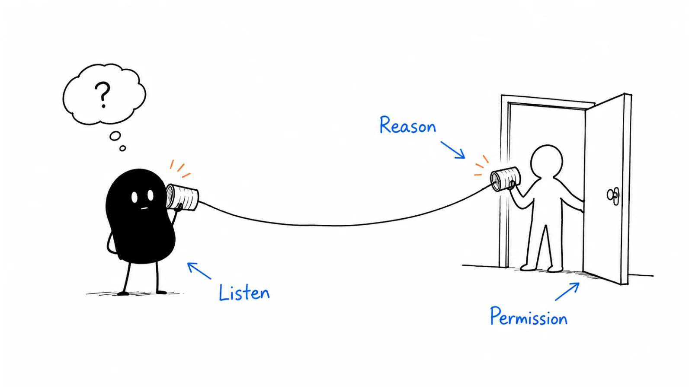

**Last reviewed:** 2026-09-10 · **Reading edit:** 2026-09-10

You have prepared a good opening. The account looks relevant, the contact appears to own the work, and you can explain what your product does.

The person answers.

“I'm going into a meeting.”

This is where a cold-call guide earns its place. Not by supplying a clever line that forces the pitch through, but by helping you make a sensible decision in a conversation you do not control.

A cold call is an unexpected business approach. Your first job is to make your identity and purpose understandable, find out whether the person is willing to continue, and listen well enough to choose an appropriate next step.

Sometimes that step is a meeting. Sometimes it is a requested example, a correction to your account research, a specific callback, or a clear end to the approach.

A useful call does not have to become a long call. Nor does a short call necessarily mean the rep failed. Someone who ends promptly after a stop request has handled an important part of the job correctly.

This guide describes human-led calling in an approved B2B workflow. It does not authorize a campaign, establish legal permission to call, or provide instructions for automated voice outreach. The examples are fictional teaching material, not proven scripts or customer results.



*Reading guide: prepare the account and route → identify yourself → explain the reason → listen and clarify → agree on a proportionate next step → record what actually happened.*

Preparing a first calling block? Start with [the call card](#copy-cold-call-card-fill). Struggling after the opening? Read [how to respond](#step-3-handle-the-reaction-like-redirection-not-combat). The [worked example](#worked-example-illustrative) follows a small fictional batch from eligibility checks through held meetings.

## Use this when

You have a plausible account and buyer hypothesis and want to test whether a direct conversation is useful. The hypothesis can still be exploratory; label it that way rather than presenting the offer as already proven.

You need a live channel in an existing outbound workflow. A call may clarify something that an email cannot, provided the route and approach are appropriate.

Your reps can deliver the pitch but struggle when someone interrupts, corrects the premise, asks about price, or declines.

You are coaching a new SDR and need observable behaviors to practise: clear identification, accurate explanation, a relevant question, listening, handling uncertainty, and reliable follow-through.

Your team books meetings that the account executive cannot make sense of. You need to connect the call to the promised next conversation, not just to a calendar event.

Calling does not require a successful email campaign first. It does require a reason to approach the account, a suitable route, and a bounded way to learn. Equally, you do not need to add calls simply because a sequence template includes them.

## Do not use this when

The account is outside your intended market, the number is unsupported, or a restriction blocks the contact. Work through [account research](https://b2-b-playbook.mintlify.app/playbooks/05-outbound-and-prospecting/account-research) and [contact data](https://b2-b-playbook.mintlify.app/playbooks/05-outbound-and-prospecting/contact-data) first.

You want to get around an unanswered email, an explicit rejection, or an opt-out by switching to a more intrusive route. Silence and a stop request are different, but neither creates permission by itself.

You are returning a requested callback or responding to an inbound enquiry. Those conversations can use similar listening skills, but identify the actual context instead of pretending they are cold outreach.

You already have agreement for a discovery meeting. Use the relevant [sales enablement](../02-product-marketing/sales-enablement.md) and [demo](../02-product-marketing/demo.md) guidance to prepare that conversation.

You need a legal ruling on calling hours, recording, consent, caller identification, dialer technology, or a specific jurisdiction. An approved operating policy should settle those questions before the rep starts.

<a id="words-you-will-use"></a>

## A few useful terms

| Term | Meaning in this guide | Important distinction |
|---|---|---|
| Attempt | One outbound dial to a route | Not evidence anyone answered |
| Human answer | A person answers, including a switchboard or wrong person | Not necessarily the intended contact |
| Intended-person connection | The relevant named person or intended role is reached | Not automatically a substantive conversation |
| Substantive conversation | Enough exchange to understand something about relevance or a next step | Not defined by a universal duration |
| Agreed next step | A specific action the person actually accepted | Different from an action the rep hopes will happen |

**Context** is the truthful reason this topic may belong with this account or role. It can be a public change, an observed workflow, or a relevant role hypothesis. It does not have to be a unique news event.

**A problem hypothesis** is your tentative explanation of where your offer may help. It should be easy for the person to correct.

**An objection** is a concern about the proposed offer or action. Do not use the term to flatten every response into something to overcome. “Stop calling” is an instruction, not an invitation to negotiate.

**A callback** is another call at a time or condition the person actually agreed to. “They were busy” is not the same as a callback request.

**A booked meeting** is an agreed calendar event. A held meeting is one that took place. A qualified opportunity requires your team's separate definition and evidence.

<a id="one-rule"></a>

## Keep this in mind

Make it easy for the person to understand the approach and give you a real answer.

That means saying who you are, explaining the business purpose, asking a question they can answer without a presentation, and accepting the answer even when it changes your plan.

You do not need to earn curiosity through mystery. You do not need to imply a referral you never received. And you do not need to turn every objection into a demonstration invitation.

A clear “not relevant” is more useful than a meeting obtained through an inaccurate promise. The first improves your research. The second creates work for the buyer and your team.

The method below is an editorial practice framework. It is not a claim that one opener, call length, or speaking ratio wins in every market.

<a id="operating-method"></a>

## How to do it

<a id="step-1-earn-the-number-then-earn-context"></a>

### Step 1: Verify the contact and prepare context

Start with the CRM, not the dial button.

Is a colleague already in a conversation with this account? Is it a customer, an active opportunity, a former prospect with a relevant restriction, or a new target? Has the person already replied elsewhere?

Check the current state. An export prepared yesterday can be stale if a reply arrived this morning.

Then confirm why the route is appropriate. A number that can ring is not proof of current identity or permitted use. Keep the evidence and uncertainties from [contact data](https://b2-b-playbook.mintlify.app/playbooks/05-outbound-and-prospecting/contact-data) visible to the caller.

#### Set the rules before the calling block

Your responsible owner should define the permitted audience, route types, local calling windows, suppression checks, caller identification, dialing method, recording policy, and process for questions or complaints.

The UK ICO describes screening live B2B marketing calls against TPS/CTPS and internal objections, with identification requirements and specific exceptions. Its page is currently marked under review. These are UK-specific considerations, not a worldwide calling checklist. [ICO B2B marketing guidance](https://ico.org.uk/for-organisations/direct-marketing-and-privacy-and-electronic-communications/business-to-business-marketing/?ref=b2b-playbook).

In the US, the FTC's 2024 amendment expanded prohibitions on misrepresentations to B2B telemarketing. “Business call” therefore should not be treated as a blanket exemption from rules. Have your owner assess the applicable federal, state, channel, and number-type requirements. [FTC announcement](https://www.ftc.gov/news-events/news/press-releases/2024/03/ftc-implements-new-protections-businesses-against-telemarketing-fraud-affirms-protections-against-ai?ref=b2b-playbook).

Do not make the caller invent a legal answer mid-session. If the review is incomplete, hold the affected work.

#### Prepare a compact account note

You need enough preparation to explain the reason and recognize when your assumption is wrong. You do not need a biography.

A useful note contains:

- The work you think this person owns.
- The evidence supporting that hypothesis.
- The specific problem your offer can address.
- The product limitation most likely to matter.
- One question that could confirm or reject relevance.
- One useful next step, if the person wants it.

For an illustrative onboarding-software call, that might be: the person leads implementation; a current job posting mentions customer handoffs; the product helps teams assign and track handoff steps; it does not replace a services-planning system.

The job posting supports a question. It does not establish that their current process is broken.

#### Prepare to answer ordinary questions

Reps should know how to explain what the company sells, which customers it is intended for, what a first conversation involves, and what they can responsibly say about pricing and implementation.

If the person asks “What does it cost?”, an evasive “Let's save that for the demo” can make the next step less credible.

Use approved pricing information when you have it, including what changes the cost. If you do not know, say so and offer an accurate follow-up rather than guessing a low starting number.

Likewise, do not promise an integration, security certification, deployment date, or customer result from memory when you are unsure.

#### Make the calling block manageable

Prepare a batch you can review, contact appropriately, and follow up on within your capacity. Leave time for notes, requested materials, callbacks, and corrections.

A block that generates more commitments than the rep can fulfil is not improved by adding more dials.

Choose a quiet environment and reliable audio. Check the displayed caller identity and approved callback route. An accidental personal number or misleading local-looking identity is not a conversion tactic.

<a id="step-2-build-a-problem-proposition-not-a-value-prop"></a>

### Step 2: Describe a relevant problem

An opening needs to answer three ordinary questions: who is this, why are they calling, and what are they asking from me now?

There are several workable ways to do that. The precise order can vary with language, local expectations, and whether the call reached a direct line or a shared business route.

Do not conceal identity while trying to create curiosity. Context should make the purpose clearer, not postpone it.

#### A direct opening

Here is a fictional example:

> “Hi Morgan, I'm Alex from an onboarding-software company called Handoff Example. This is a sales call about how implementation teams pass new customers to customer success. Is that part of your work, and are you open to a brief question?”

The company name is invented. Replace every claim with your actual company and offer; this is not a phrase with measured conversion performance.

This opening gives the person enough information to decline, correct the role, or continue. It does not imply prior contact or say that the caller is “not selling anything.”

You can make it shorter if your company and category are easier to explain. You can also acknowledge that the call is unexpected. What matters is that your words match the situation.

#### An opening with a real observation

When an observation genuinely helps:

> “Hi Morgan, Alex from Handoff Example. This is a sales call. Your implementation-operations posting mentions handoffs to customer success. We build software for that handoff. Are you the right person to ask about how the process works?”

Use this only if you actually checked the posting and the description is accurate. Do not turn “a role is advertised” into “you are struggling with handoffs” or “you just hired a new team.”

If the posting is old or ambiguous, do not force it into the opening. A clear role-based reason is better than decorative personalization.

#### An opening without a trigger

You can be honest about a hypothesis:

> “I'm calling because your role appears to cover implementation operations. Our software helps teams keep customer handoffs from getting lost between systems. I don't know whether that's a problem for your team. Is it something you own?”

The uncertainty is useful. It lets the person correct you without first having to reject a claim about their business.

A call does not become relevant merely because you mention a recent funding round, location, hobby, or investor. Use only context that helps explain the business question.

#### Describe the work before the category

“An AI-powered orchestration platform for customer lifecycle transformation” gives a listener several abstract ideas to decode.

A more concrete explanation is:

> “When implementation finishes, the team can assign the handoff tasks and see which customer-success owner accepted them.”

That is a product capability, not an outcome guarantee. If your product only creates reminders and does not confirm acceptance, describe the reminder function instead.

Then ask a question with room for a different reality:

> “How do you handle that handoff today?”

Avoid loading the question with a failure assumption: “How much time are you wasting on manual handoffs?” The person may have a good process, use a different model, or not consider this task important.

#### Ask one question and leave space

Do not stack process, budget, authority, urgency, and procurement questions into the first response window.

A person who agrees to a brief question has not agreed to a qualification interview.

Listen to the answer before selecting a follow-up. If they say the process already lives in their existing system, asking how many spreadsheets they use shows that you are following the script rather than the conversation.

A short pause is not necessarily an objection. Give them time to finish. If the connection is poor, check the audio rather than talking over them.

If you promised a short explanation, keep it short. Ask before extending into a longer discussion; do not use “thirty seconds” as a pretext for a monologue.

<a id="step-3-handle-the-reaction-like-redirection-not-combat"></a>

### Step 3: Respond to the person's concern

The next sentence should follow what the person actually said.

A rushed response may reflect the interruption. It may also be a straightforward refusal. You cannot reliably infer the difference from tone alone, and you do not need to diagnose their psychology to behave well.

Use a simple sequence: acknowledge, decide whether clarification is welcome, and either answer or end. Clarification is optional, not a required step after every no.

| Response | A reasonable action | What to avoid |
|---|---|---|
| “I'm busy” | End promptly; accept a callback only if actually agreed | Treating busyness as consent to schedule |
| “Not interested” | Accept the decline; stop the pitch | Reframing every no as a hidden objection |
| “Send information” | Clarify the requested item if welcome, then send only what was agreed | Counting a brochure request as a demo booking |
| “We already use something” | Discuss a relevant difference only if they want to compare | Inventing problems with the incumbent |
| “Stop calling” | End and apply the restriction across affected systems | Another question, another number, or another rep |

#### “I'm going into a meeting”

“Understood. I'll let you go.”

That can be the complete response. If the person volunteers a time, confirm it briefly, including the time zone where relevant.

“Call Thursday at two” supports a callback. “Maybe later” does not support placing a calendar hold in their inbox.

A callback should record what was agreed, not “interested” because the person did not explicitly dislike the product.

#### “Not interested”

“Understood. Thanks for taking the call.”

Do not require the person to explain the refusal. Do not say “Before I go, just one question” as an automatic way to keep the pitch alive.

Record the refusal and its scope as accurately as possible. A topic-specific decline and a broad request to stop all marketing are not identical, but do not exploit ambiguity to recycle the same pitch through another channel.

Your team should have a conservative approved process for unclear restrictions. The rep should not make a narrow interpretation simply because it preserves a sequence task.

#### “Send me something”

You may ask, if the conversation remains open:

> “Would an example of the handoff view be useful, or were you looking for general product information?”

If they say “Just send the overview,” send the overview. Do not use the clarification to start a discovery interview.

Confirm the appropriate business address through the approved process; do not read unnecessary personal details aloud or assume a vendor-supplied address is the one they want used.

A request for one item is not blanket consent for recurring marketing. Record the requested delivery separately from any agreed follow-up.

#### “We already have a tool”

“That makes sense. If the current process works well, there may be no reason to change it.”

If they invite discussion, explain one truthful difference. For example: your product may focus on cross-team acknowledgement while their current system handles task creation. Only make that distinction if you understand both sides well enough to support it.

Do not claim that a competitor cannot do something because an old battlecard says so. If you do not know, say you would need to check.

Existing tools can make your offer irrelevant. They can also reveal an integration need. Let the person's description determine which question, if any, comes next.

#### “We have no budget”

Budget can be a real constraint. A product may be relevant and still not justify a meeting.

If the person wants to discuss future options, agree on a next step that fits that intent. If they are closing the conversation, accept it.

Do not substitute “just a test drive” for a meeting whose real purpose is sales qualification. Explain what will happen and let them decide whether it is useful.

#### “How did you get my number?”

Answer accurately using the approved source and privacy process.

If the record does not show the source, do not guess “from your website.” A suitable response is to acknowledge that you need to verify the source and offer the established privacy contact or process.

If they ask to stop, handle that immediately; do not make the request conditional on explaining the source first.

This situation also belongs in the data-quality review. A caller should not repeatedly face a question the system ought to be able to answer.

#### “Can you do this specific thing?”

Answer within your knowledge. If the feature is unsupported, say so clearly.

If you need a technical colleague, distinguish “I will ask” from “Yes, we can.” Do not book a meeting under a false premise and expect the account executive to repair it.

A relevant technical question can justify a scoped follow-up without requiring a general demo. The next step should resolve the uncertainty, not make the person sit through unrelated slides.

<Accordion title="Three fictional responses worth practising">

**A clear decline**

Buyer: “We're not interested. Please take us off your calling list.”

Rep: “Understood. I'll update that. Goodbye.”

Record: stop request, stated scope, time, and required propagation. No objection-handling question follows.

**An uncertain capability**

Buyer: “Can your system move the customer between our regional instances automatically?”

Rep: “I don't know that it can. The workflow I described handles handoff ownership, not necessarily cross-instance migration.”

Buyer: “Then that's probably not what we need.”

Rep: “Understood. I won't book you for a demo that doesn't answer that problem.”

Record: capability mismatch; no meeting and no invented roadmap promise.

**A bounded request**

Buyer: “Send me a screenshot. I don't want to book anything.”

Rep: “Of course. I'll send the screenshot, without a meeting invitation.”

Buyer: “Use the business address on our team page.”

Rep: “Thanks. That's the item I'll send.”

Record: requested screenshot only; no booking, no implied recurring follow-up.

</Accordion>

<a id="step-4-book-or-leave-do-not-discover-on-a-cold-call"></a>

### Step 4: Agree on a next step or end the call

A next step is useful when both people can explain why it exists.

“Let's connect sometime” leaves the purpose unclear. “Let's spend fifteen minutes looking at whether the handoff acknowledgement works with your current system” gives the buyer something concrete to evaluate.

Use an honest duration and agenda. Do not promise a five-minute overview if the standard session is a half-hour qualification call.

#### Check the purpose before the calendar

Summarize what you heard:

> “You said the issue isn't assigning the work; it's knowing that customer success accepted it. I can show the acknowledgement workflow and explain the integration limits. Would that be useful?”

The summary is an opportunity for correction. If they say that is not the issue, revise your understanding before scheduling.

Do not infer purchasing authority, urgency, or budget from willingness to look. Those may remain unknown.

#### Agree on the practical details

Confirm who should join, what will be covered, the time and time zone, and whether there is anything necessary to prepare.

Do not require a colleague's private contact information as a condition of booking. The buyer can choose whether to forward an invitation or involve someone else.

Use the correct meeting type. A technical compatibility check should reach someone who can answer it. A product overview should not be labelled a consultation if it is primarily a sales presentation.

If the buyer only wants a document, send that document. Do not attach a calendar invitation as a surprise.

#### A longer conversation can be appropriate

There is no rule that discovery must never happen on a cold call.

If the person asks questions, has time, and wants to explore the issue, you can continue with their agreement. Say what you propose to discuss and check that it fits their time.

The problem is not the number of minutes. It is continuing beyond the person's interest or ability to participate, or running a full qualification sequence after they agreed only to a short explanation.

If the conversation becomes substantive, take useful notes and avoid making them repeat everything in the next meeting.

#### End clearly

If there is no next step, do not leave an ambiguous promise to “circle back.”

If a callback is agreed, repeat the specific arrangement. If an item is requested, confirm what you will send. If the answer is no, close politely.

There is no need to rescue every call with another offer. A correct ending is part of a reliable process.

## Handle the calls that do not become conversations

Many attempts will not reach the intended person. Plan these branches before starting so reps do not improvise an escalating series of interruptions.

### No answer

Record no answer. It does not establish that the number is wrong or the person rejected the offer.

Any retry should follow your approved cadence, relevant local timing rules, and current account state. Do not keep redialing immediately to create urgency.

Varying a permitted calling window can be a reasonable experiment, but do not infer a universal “best time” from a handful of pickups. Account mix, time zones, roles, and chance can affect the result.

### Voicemail

A voicemail is an optional channel action, not a mandatory step after every missed call. Its use needs the same review of purpose, channel rules, and restrictions.

If appropriate, keep it truthful: identity, business reason, and a usable callback route. Do not imply a personal relationship or urgent account problem that does not exist.

Do not say “returning your call” unless that is true. Do not leave sensitive details where other people might hear them.

In the UK, the ICO includes voicemail within its broad electronic-mail discussion; do not assume the rules for a live conversation automatically settle the voicemail decision. [ICO guidance](https://ico.org.uk/for-organisations/direct-marketing-and-privacy-and-electronic-communications/business-to-business-marketing/?ref=b2b-playbook).

This article does not prescribe a voicemail script because the permitted format and disclosure requirements should come from your approved workflow.

### Switchboard or assistant

Identify yourself and explain the business reason. Ask about an appropriate business route if that is welcome.

Do not pretend to be a friend, customer, or expected caller to obtain a transfer. Do not ask an assistant to disclose private contact information.

If the organization provides a supplier inbox or submission process, use that route appropriately rather than treating it as an obstacle.

A transfer refusal is not a challenge to social-engineer access.

### Wrong person or changed role

Apologize, correct the record, and stop the irrelevant pitch. If the person voluntarily offers a business route, review it before use.

Do not ask a stranger to prove that the number is not theirs. Do not assume the former employee's new workplace belongs in the campaign.

Pass the correction back to the source record so the next rep does not repeat the error.

### A dropped connection

Do not infer agreement from a disconnected call. Whether a single return attempt is appropriate depends on what happened, the person's wishes, and the approved process.

A deliberate hang-up after a refusal should not be treated as a technical fault to bypass.

When the intent is uncertain, prefer a conservative decision over repeated redials.

## Write notes that help the next person

The call is not finished when the line goes quiet. It is finished when commitments, corrections, and restrictions are recorded and routed.

Keep factual notes separate from interpretation.

“Interested, good fit, follow up” is hard to act on. A stronger note says:

> “Owns implementation operations. Says handoff tasks are already assigned in the existing system; acceptance by customer success is unclear. Requested one screenshot, explicitly declined a meeting. No budget or timeline discussed. Send screenshot only; no calendar hold agreed.”

That note protects both sides. The next rep does not invent a buying project, and the buyer does not receive a meeting they declined.

Record the account and contact, outcome, relevant facts, remaining unknowns, product statements that need confirmation, and exact next commitment with an owner.

Use direct quotations sparingly and only when necessary. Avoid personal judgments such as “difficult” or “bad attitude.” Record the behavior relevant to the work: declined, requested stop, corrected role, asked for technical clarification.

If a stop request arrived, apply it to the affected action systems promptly under your approved policy. Merely putting it in free-text notes is not enough if the dialer continues to schedule tasks.

A data correction and a stop request can coexist. Preserve both rather than allowing one status to erase the other.

<a id="step-5-score-the-tape-on-the-three-moves"></a>

### Step 5: Review calls for specific improvements

Coaching should help a rep make a better decision in the next conversation. “Be more confident” rarely identifies what to change.

Review preparation, identification, relevance, listening, factual accuracy, response to boundaries, and follow-through. Then select one or two concrete behaviors to practise.

For example: the rep explained the product accurately but asked three questions at once. The practice task is to ask one process question, stop speaking, and respond to the answer.

Another rep may have a clear opening but promise an unsupported integration. That is not a pacing problem; the product explanation and escalation path need work.

### Use recordings only within an approved policy

Recording, transcription, storage, sharing, and AI processing can create separate obligations. Have the responsible owner define the applicable notice or consent process, access, retention, and permitted uses before enabling them.

A recording button in a dialer is not approval. Neither is a vendor's default setting.

When recording is not appropriate, use approved notes and fictional role-play. Do not secretly record to improve coaching.

Do not upload real calls to an unapproved assistant. A transcript can contain personal information, commercial details, and statements the buyer did not expect to be shared broadly.

### Review more than successful calls

A library consisting only of booked meetings can teach the wrong lesson. Include calls that ended correctly, conversations where the premise was corrected, and examples of a specific skill needing improvement.

Do not penalize a rep for a correct stop, a truthful capability limitation, or an unsuitable account that should have been excluded earlier.

Separate the rep's execution from the quality of the list, the offer, the assigned territory, and the system. Coaching cannot repair all of those through delivery alone.

### Practise a moment, then vary the answer

Start with a short fictional scenario. The learner tries the opening and receives a response. Pause, identify the specific decision, try again, then change the response so they cannot succeed by memorizing a single branch.

One rehearsal can test a busy person. Another can test someone who wants technical detail. A third can test a firm stop.

Readiness means responding sensibly across these cases, not sounding polished in one rehearsed conversation.

<Accordion title="A coaching loop for a rep who keeps pitching through replies">

First attempt:

Buyer: “We already manage that in our existing system.”

Rep: “Exactly, and our AI platform gives you one place for all your workflows—”

Coach: “Pause. What did the buyer just tell you?”

Rep: “They already have a process.”

Coach: “Then the next step is to learn whether any relevant gap exists, if they want to discuss it. You don't yet have a reason to repeat the pitch.”

Second attempt:

Rep: “Understood. If it works well, there may be no reason to change it.”

Buyer: “Task assignment works. The team still misses the acceptance step.”

Rep: “That distinction helps. Do you mean the next owner gets the task but doesn't confirm they've taken it?”

Coach: “Good: you clarified the actual gap. Now explain only the capability that addresses it, including its limits.”

Variation:

Buyer: “It works fine, and I'm not looking at alternatives.”

Rep: “Understood. Thanks for your time.”

Coach: “Also correct. The skill isn't producing the same meeting from every answer.”

This is fictional practice, not a transcript or evidence of conversion improvement.

</Accordion>

## Use AI for preparation and practice, not invented certainty

AI can help turn an approved account note into a shorter opening, generate fictional practice responses, or flag a mismatch between a call summary and the underlying notes.

Ask it to preserve uncertainty. A job posting that mentions handoffs should not become “the company is struggling with handoffs.” A request for a screenshot should not become “buyer agreed to a demo.”

For reviewed transcripts, require evidence for material conclusions. If the person did not mention budget, leave budget unknown. If the next step is ambiguous, send it for human review.

Do not infer emotional state, personality, buying authority, or willingness to purchase from voice tone. A rushed speaker may simply be late for something.

AI-generated calls are a different workflow from a human using AI to prepare. The FCC's 2024 declaratory ruling classifies AI-generated voices as artificial voices under the TCPA. That does not make this guide a compliance assessment for an AI dialer; the technology and applicable consent requirements need separate review. [FCC ruling](https://docs.fcc.gov/public/attachments/FCC-24-17A1_Rcd.pdf?ref=b2b-playbook).

Do not clone a colleague's voice, conceal automation, or imply a human relationship that does not exist.

For this playbook, keep the live conversation human-led. Start with draft-only assistance for preparation and records, and have the caller verify any proposed CRM changes before they affect another action.

<a id="teaching-fill-inventednot-a-customer"></a>

## Worked example (illustrative)

A fictional team sells software for implementation handoffs. It wants to learn whether its offer is relevant to operations owners at a defined account segment.

The team prepares 50 candidate accounts. Before calling, it excludes six: two current customers, two active opportunities owned elsewhere, one account outside the segment, and one with an applicable stop restriction.

That leaves **44 eligible accounts**, with one reviewed contact route each. Assume the responsible owner has approved this limited human-led test and its use rules. All counts and costs are invented; this is not a legal conclusion about any actual list.

### The first calling block

The rep makes one initial attempt per eligible account: **44 attempts**.

Twenty-eight do not reach a human. Sixteen reach a human: two are wrong-person connections, and 14 reach the intended person.

The 14 intended-person connections produce:

- Four direct declines, with no continued pitch.
- Two requests to stop calling.
- Three people who are busy and end without agreeing to a callback.
- One specifically agreed callback.
- Four substantive conversations about the workflow.

These categories are mutually exclusive at this checkpoint: 4 + 2 + 3 + 1 + 4 = 14.

Of the four substantive conversations, two lead to agreed meetings, one leads to a requested screenshot only, and one establishes that the existing process is sufficient. The last is not a product opportunity.

The two wrong-person routes are blocked for the intended contacts and assigned for correction. The two stop requests propagate to the relevant systems. Nobody is required to answer another question before that happens.

### The agreed callback

The rep makes the one agreed callback at the requested time. This is **one additional attempt**, not another unique account.

The person answers, explains a relevant handoff problem, and agrees to a scoped meeting. The call creates a third booking.

The example now has **45 attempts across 44 unique accounts**, 17 human answers, and 15 intended-person connection events across 14 distinct intended contacts.

There are five substantive conversation events: four in the initial block and one on the callback. Three of those lead to bookings, one to a screenshot request, and one to a conclusion that the current process is sufficient.

No additional retries are included in this teaching example. That is a boundary of the example, not a universal one-attempt policy.

### What happens to the meetings

By the review date, two of the three meetings have been held. The third has been moved to a future date by agreement.

Of the two held meetings, one meets the team's documented opportunity criteria after discovery. The other reveals that a required integration is not supported and does not become an opportunity.

There are **no sales** in the example.

The rep should review whether the integration issue could have been surfaced earlier without forcing a technical interview into the first call. If the need only emerged during discovery, that is different from having knowingly promised the integration on the phone.

The screenshot was sent as requested. It did not become an unsolicited invitation or a recurring sequence.

### Calculate rates with the right units

| Measure | Example calculation | What it means |
|---|---|---|
| Human answers per attempt | 17 ÷ 45 ≈ 37.8% | Includes wrong people and the callback |
| Intended-person connection events per attempt | 15 ÷ 45 ≈ 33.3% | Includes one person reached twice |
| Unique intended contacts reached | 14 ÷ 44 ≈ 31.8% | Counts each eligible account contact once |
| Bookings per substantive conversation event | 3 ÷ 5 = 60% | A small conditional count, not a benchmark |
| Held meetings per booking as of review | 2 ÷ 3 ≈ 66.7% | Includes one still-future meeting, not a final show rate |
| Opportunities per held meeting | 1 ÷ 2 = 50% | Too small to project a reliable future conversion rate |

The callback was arranged during an earlier connection, so it should not be presented as another cold first-contact success.

The 28 unanswered attempts do not establish that those contacts were unsuitable or that the routes were false. The four direct declines do not establish that the opening was poor. The data alone cannot identify those causes.

Suppose the pilot uses eight hours of preparation, calling, follow-up, and review at an assumed internal cost of &#36;50 per hour, plus &#36;80 in allocated data and telephony charges.

The defined pilot cost is **&#36;480**. That is &#36;160 per booking and &#36;240 per held meeting as of this review.

These figures exclude later sales work and do not establish customer acquisition cost. With no sale, there is no revenue return to report.

### Decide what to change

The team has several different findings.

Two wrong-person connections require a data review. The unsupported integration requires a clearer product boundary. The screenshot request shows that a non-meeting next step can be appropriate. The callback shows why explicit agreement is worth recording separately from “busy.”

The team does not announce that its opener converts 60% of buyers. That rate is conditional on five substantive conversation events, in a small selected pilot, with no controlled comparison.

Before another batch, the manager improves the integration explanation, checks the two disputed routes, confirms that stop propagation worked, and practises one-question listening with the rep.

That is a useful outcome from a small test: specific changes, not a sweeping verdict that cold calling works or does not work.

## Copy: cold-call card (fill)

Use this to prepare the conversation, not to write a paragraph the rep must recite.

```text
COLD-CALL CARD

Account / contact reference:
Current owner and relationship:
Route evidence and unresolved issues:
Approved use / calling window / restriction check:

Why this work may be relevant:
Supporting source and observation date:
What is a hypothesis rather than a fact:

Truthful identification and business purpose:
Short capability explanation:
One opening question:
Important limitation / answer to verify:

Possible next step and actual purpose:
What would make us end or hold the approach:
Notes and correction destination:
```

Working file: [cold-call.md](../../templates/cold-call.md).

The existing working file contains earlier prompts about a handmade email pattern, unique context, and a test-drive ask. Those are optional preparation ideas, not prerequisites or mandatory tactics. Preserve any filled work; the call card above reflects this revised guide.

## Copy: call outcome and handoff (fill)

Complete the relevant fields after the call. Unknown is better than a confident guess.

```text
CALL OUTCOME

Account / contact / owner:
Attempt date and time:
Result: no answer / wrong person / intended person / other
Facts learned:
Our hypothesis corrected:
Product answer still unverified:
Restrictions or requested stop and stated scope:
Systems updated / pending propagation:

Agreed next step, or no next step:
Exact item or meeting purpose:
Time / time zone / participants, if agreed:
Commitment owner and due date:
What the person explicitly declined:

For the next colleague:
What is known:
What remains unknown:
What must not be promised:
```

Do not copy unnecessary personal details into broadly shared notes. Use the appropriate access and retention rules for your systems.

## Copy: coaching review (fill)

Focus on observable work and one actionable improvement.

```text
CALL COACHING REVIEW

Approved evidence used: notes / recording / role-play
Reviewer / learner / date:
Scenario and intended task:

Identity and purpose were clear:
Account premise was supported or labelled uncertain:
Question matched the person's answer:
Claims stayed within product evidence:
Declines and stops were respected:
Next step matched actual agreement:
Notes and system actions were accurate:

One behavior to keep:
One behavior to practise:
Revised attempt:
Different response to test next:
System, data or offer issue outside the rep's control:
```

<a id="pre-flight-checklist"></a>

## Before you start

- [ ] Account relevance and current ownership have been checked.
- [ ] The contact route and permitted use are supported.
- [ ] Applicable calling, identification, suppression, and recording rules are settled.
- [ ] The caller can state their identity and business purpose plainly.
- [ ] The account observation is separated from the problem hypothesis.
- [ ] Product limitations and unresolved questions are visible.
- [ ] The caller is ready to listen after one question.
- [ ] A refusal can end the pitch without another objection track.
- [ ] Requested materials, callbacks, and meetings have separate outcomes.
- [ ] Corrections and restrictions reach the systems that schedule actions.
- [ ] Time is reserved for follow-through, not just dialing.
- [ ] Coaching uses approved evidence and specific behaviors.

## Metrics

Keep attempts, human answers, intended-person connections, unique contacts, substantive conversations, agreed next steps, bookings, held meetings, and opportunities separate.

Activity counts are useful for understanding workload and where the process breaks. They should not be dismissed as meaningless, nor mistaken for buyer value.

A low human-answer rate suggests examining the route, timing, dialing setup, and sample before rewriting the entire offer. A high wrong-person count points toward contact data. Many relevant conversations but few useful next steps may call for an offer or expectation review.

These are diagnostic possibilities, not automatic causal conclusions.

Measure restriction failures and unsupported claims as quality incidents. Do not reward a high meeting count while ignoring the promises used to obtain it.

Avoid universal talk-time targets. A long call can be a useful discussion or a rep ignoring signals to stop. A short call can be a clean rejection or an unclear opening. Review enough context to distinguish them.

When testing an opening, keep the audience, offer, route, and outcome definition comparable where possible. If all of those change, describe the result as a new batch, not proof that one sentence caused the difference.

Use a larger, appropriately designed comparison before making confident performance claims. A small pilot is for finding problems and deciding the next bounded test.

## Common mistakes

### Borrowing familiarity

“Has my name come up?” and similar lines can imply a relationship or referral. Do not use that implication unless it is true.

A clear introduction is enough. You can explain a relevant category without inventing social proof.

### Diagnosing the person instead of hearing the answer

Calling every refusal an interruption reaction makes it easier to dismiss what the person said.

Respond to the observable request. You do not need a theory of their mood to end politely.

### Forcing a calendar outcome

A document request, a role correction, and a callback are not failed demos. Record them accurately and fulfil only the commitment that exists.

Do not disguise a sales meeting as a casual look with no expectations.

### Assuming the phone deserves a place in every sequence

Some audiences and offers may fit other routes better. Calling is an option to evaluate, not a test of the rep's courage.

Coordinate through [multichannel sequence](https://b2-b-playbook.mintlify.app/playbooks/05-outbound-and-prospecting/multichannel-sequence), including its stop rules, rather than adding attempts independently.

### Over-researching the opening

A researched fact should improve the reason for the call. Ten minutes finding a personal detail that has nothing to do with the buyer's work does not make the pitch useful.

Prepare the business question and the product boundary first.

### Keeping the script unchanged after the buyer corrects it

If the person says their process is different, update the question. Repeating the original problem statement does not make it more relevant.

The useful skill is adapting accurately, not remembering every branch.

### Coaching confidence while ignoring operational failures

A confident rep can still call the wrong person, miss a stop, or promise the wrong feature.

Check the data, rules, product knowledge, and follow-through alongside conversational delivery.

## What to read next

Use [contact data](https://b2-b-playbook.mintlify.app/playbooks/05-outbound-and-prospecting/contact-data) to evaluate the route and maintain corrections. [Account research](https://b2-b-playbook.mintlify.app/playbooks/05-outbound-and-prospecting/account-research) and [buying signals](https://b2-b-playbook.mintlify.app/playbooks/05-outbound-and-prospecting/buying-signals) help develop a supported reason for the approach.

The written channel has its own constraints: see [cold email](https://b2-b-playbook.mintlify.app/playbooks/05-outbound-and-prospecting/cold-email). Coordinate the overall account workflow with [multichannel sequence](https://b2-b-playbook.mintlify.app/playbooks/05-outbound-and-prospecting/multichannel-sequence), and treat [LinkedIn outbound](https://b2-b-playbook.mintlify.app/playbooks/05-outbound-and-prospecting/linkedin-outbound) as a separate channel rather than another place to paste the call script.

For an agreed conversation, prepare through [sales enablement](../02-product-marketing/sales-enablement.md) and [demo](../02-product-marketing/demo.md). Teach these habits through [SDR onboarding](https://b2-b-playbook.mintlify.app/playbooks/05-outbound-and-prospecting/sdr-onboarding).

## Sources and evidence boundary

This is an owner-maintained editorial guide. The conversation examples, coaching method, templates, and numerical pilot are illustrative. No response rate, timing rule, or opener is presented as a proven universal benchmark.

Sources checked on **September 10, 2026**:

- [ICO B2B marketing guidance](https://ico.org.uk/for-organisations/direct-marketing-and-privacy-and-electronic-communications/business-to-business-marketing/?ref=b2b-playbook): UK calling and channel context; its under-review notice is material.
- [FTC March 2024 announcement](https://www.ftc.gov/news-events/news/press-releases/2024/03/ftc-implements-new-protections-businesses-against-telemarketing-fraud-affirms-protections-against-ai?ref=b2b-playbook): the specific expansion of misrepresentation protections to B2B telemarketing, not a complete current compliance checklist.
- [FCC 2024 declaratory ruling](https://docs.fcc.gov/public/attachments/FCC-24-17A1_Rcd.pdf?ref=b2b-playbook): classification of AI-generated voices; not permission to operate an automated campaign.
- [30MPC's public cold-calling framework](https://www.30mpc.com/newsletter/the-ultimate-30mpc-cold-calling-framework?ref=b2b-playbook), published July 19, 2024: earlier editorial inspiration for a clear problem explanation and next step. Its public page was revisited, but its opener statistics and objection scripts are not adopted here. Paid course material is not reproduced.

The earlier edition's general reference to Gong opener research is not used as evidence in this revision. There is no supported reason here to declare a particular polite opening question universally wrong.

---

Copyright © 2026 Ivan Xu. All rights reserved. See the [copyright and reuse terms](https://github.com/weilun88313/B2B-Playbook/blob/main/LICENSE).

Canonical source: [github.com/weilun88313/B2B-Playbook](https://github.com/weilun88313/B2B-Playbook)
