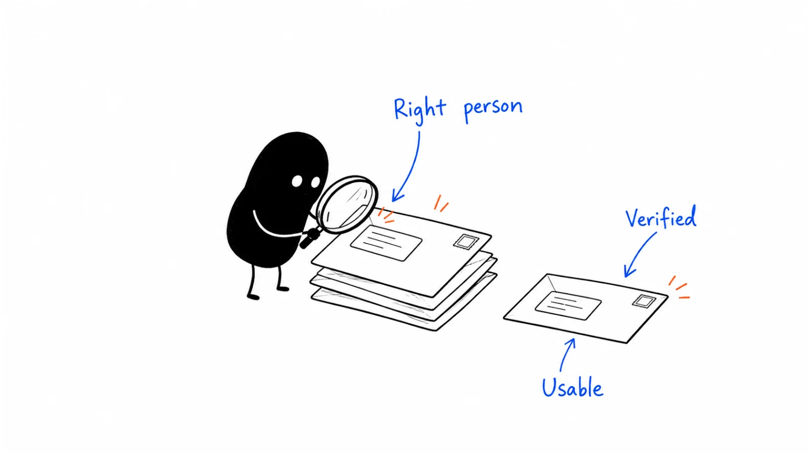

**Last reviewed:** 2026-09-10 · **Reading edit:** 2026-09-10

The export looks excellent: company names, senior titles, work emails, phone numbers, and a reassuring column of green checks.

Then someone tries to use it.

One contact left the company. Another works at a different business with the same name. A third is already speaking with your account executive. The email verifier approves a fourth address, but that person asked you to stop contacting them last month.

None of these problems is solved by buying more credits.

Good contact data helps your team approach an appropriate person through an appropriate route, with enough evidence to understand what is known and what still needs checking. It also helps the team avoid an approach when the data, relationship, or rules do not support one.

That makes contact data a workflow, not just a subscription. You need a definition of the people you want, a way to evaluate sources, rules for importing and updating records, and a reliable path for corrections to reach every system that acts on the data.

This guide covers business contact information for prospecting. It is not a vendor ranking, a permission to collect personal details, or a substitute for qualified privacy and legal review.



*Reading guide: define the contact need → inspect sources → evaluate a common sample → resolve conflicts → release an appropriate batch → carry corrections forward.*

Choosing a provider? Start with [the sample test](#step-2-test-coverage-and-accuracy-on-the-same-sample). Cleaning a messy CRM? Start with [the import rules](#keep-the-crm-from-undoing-your-review). The [worked example](#worked-example-illustrative) compares two fictional providers without pretending that more returned rows mean more usable contacts.

## Use this when

Your reps spend their calling block correcting names and numbers instead of having conversations.

You have several enrichment tools, but nobody can explain which one adds contacts you could not obtain from the others.

A vendor claims strong coverage, yet your actual buyers are difficult to find. You need to test the segment you sell to rather than the population used in a sales presentation.

You are moving into another geography, company size, or buyer role. A provider that worked for one segment may deserve a fresh evaluation for the next.

You are preparing an import, connecting an enrichment workflow, or giving an AI assistant access to contact records. You want to know what can be updated automatically and what needs a person to decide.

You have recurring problems with duplicate outreach, reappearing opt-outs, or contacts who changed jobs. The problem may sit in the handoffs between tools rather than in the original data source.

## Do not use this when

You have not decided which accounts are relevant. Start with [account research](https://b2-b-playbook.mintlify.app/playbooks/05-outbound-and-prospecting/account-research); collecting names does not establish a reason to approach a business.

You need to write the first email or conduct the call. Use [cold email](https://b2-b-playbook.mintlify.app/playbooks/05-outbound-and-prospecting/cold-email) and [cold call](https://b2-b-playbook.mintlify.app/playbooks/05-outbound-and-prospecting/cold-call). A clean record supports those tasks but does not replace preparation.

You want to discover private contact details, bypass a person's preferred route, evade a platform restriction, or reach someone through another channel after a broad request to stop. Those are not data-quality improvements.

You need a legal determination about a particular list, jurisdiction, channel, or processing purpose. Have the responsible owner resolve that before the data is released for use.

<a id="words-you-will-use"></a>

## A few useful terms

A record can pass one test and fail the next. Keeping these questions separate makes both vendor evaluation and daily work easier.

| Layer | What it establishes | What it does not establish |
|---|---|---|
| Account match | The record refers to the intended business entity | That every employee there is relevant |
| Role match | Evidence connects the person to the work you care about | That they own budget or want a meeting |
| Route quality | A particular email or number passed stated checks at a stated time | Certain delivery, current ownership, or permission |
| Use approval | The proposed purpose and channel passed your applicable review | Interest in the offer or guaranteed compliance forever |
| Observed outcome | What happened during an approved interaction | A universal prediction for every other contact |

**Coverage** needs a denominator. “We found 80 contacts” could mean 80 people at eight companies or one relevant person at each of 80 companies. Those are very different results if the task is to approach 100 target accounts.

**Enrichment** means adding or updating information on a record. It can improve a record, introduce an error, or restore an old value that someone already corrected.

**Verification** needs a named test. “Verified” could describe mailbox checks, a source match, a recent employment check, or a vendor's own scoring method. Ask which.

**A waterfall** queries sources in a sequence, usually moving to the next when the previous source does not produce an acceptable result. The useful question is what counts as acceptable and which missing field the next query is meant to resolve.

**Suppression** is a restriction that prevents an inappropriate action. A contact-level marketing stop, a blocked route, and an account reserved for an existing owner are different restrictions. Store enough context to apply the correct one.

<a id="one-rule"></a>

## Keep this in mind

A usable contact is not simply a filled row.

For the workflow you are running, you need a suitable account, a relevant person or role, an adequately supported route, an allowed purpose, and no unresolved restriction that should stop the action.

The required evidence depends on the action. A public procurement inbox may be an appropriate route for a supplier application without identifying a named employee. A direct call to an executive requires a different level of confidence about whose number it is.

Do not force every task into a model that rewards named mobile numbers. Sometimes the right answer is a department route, a partner introduction, an existing account owner, or no contact yet.

There is also no required number of data providers. One may be enough. A second may add valuable coverage. Several may create more conflicting records than your team can sensibly review. Make that decision using the work they improve.

<a id="operating-method"></a>

## How to do it

<a id="step-1-write-who-you-call-before-you-shop-a-vendor"></a>

### Step 1: Define the contacts you need

Start with a sentence a researcher can act on.

“Find decision-makers at SaaS companies” leaves too much room for interpretation. A senior title is easy to find and can still be unrelated to the problem.

Try something closer to:

> We need one current owner of customer onboarding operations at each approved software account. We want to understand how handoffs between implementation and customer success are managed. Begin with work contact routes that our team has approved for this use. Do not replace existing customer or opportunity ownership.

This is an illustrative brief, not a recommendation to contact those people. Its value is that it specifies the job, the account boundary, and the route constraint.

#### Define the role through the work

A small company may give onboarding to a customer success lead. A larger company may have implementation operations, professional services operations, or a dedicated onboarding function.

Create a short role map: likely owner, adjacent role, and clear mismatch. The map helps a researcher investigate unfamiliar titles without treating every variation as either a perfect match or an automatic exclusion.

Keep ownership and budget separate. Someone can understand the workflow without controlling the purchase. If the first conversation is meant to learn how the work happens, the workflow owner may be useful. If you need procurement requirements, a different role may be appropriate.

Write down the intended conversation before collecting the title.

#### Define the account unit

Decide whether the target is the parent company, a subsidiary, a regional operation, or an individual location. Record a stable internal account ID and supporting company context.

A shared domain is useful evidence, not a complete corporate structure. Separate entities can share infrastructure; one business can use several domains. Acquisitions and rebrands make simple matching even less reliable.

If your campaign is about a regional process, a contact at global headquarters may not count as coverage of the local operation. Make that rule visible before the provider test.

#### Collect the minimum useful fields

For a small reviewed batch, an account ID, person or role, current-company evidence, business route, source, check date, owner, and action status may be enough.

Do not ask for personal mobiles, home addresses, or unrelated profile details simply because the export offers them. Each additional field creates another maintenance and access question.

A useful field changes a decision. If nobody can explain how the team will use it appropriately, leave it out of the brief.

<a id="step-2-measure-four-layers-on-your-sample"></a>

### Step 2: Test coverage and accuracy on the same sample

Choose the sample before asking providers to demonstrate their coverage.

Include the segments that matter to your actual plan: smaller and larger accounts, relevant regions, familiar and less common titles, and accounts with existing records as well as genuine gaps. Do not let a provider remove difficult accounts from the denominator after seeing the results.

There is no magic sample size. A small pilot can reveal obvious workflow defects. A purchasing decision covering several markets needs enough representation to avoid confusing success in one easy segment with broad coverage.

State the size, selection method, and limits. A handpicked sample is useful for debugging but is not a representative estimate of your entire market.

#### Keep the task identical

Give each provider the same account list, role definition, allowed route types, and time window. If one provider receives person names and another must discover the people, you are testing different jobs.

You can run separate tests for those jobs:

- **Discovery:** find an appropriate person at a target account.
- **Enrichment:** find or update a route for an already identified person.
- **Maintenance:** detect whether a current record needs correction.

Do not combine their results into an unexplained “accuracy” number.

Save the raw returned result separately from your reviewed decision, subject to approved retention and access rules. Otherwise, after correcting the file, nobody can reconstruct what the provider actually supplied.

#### Decide what counts before looking at the score

Define a usable result in ordinary language. For example: one relevant current role at the intended account, an approved work-email route with acceptable verification evidence, and no unresolved ownership or suppression conflict.

That is a policy for this test, not proof that every accepted address belongs to the intended person forever.

Use distinct outcomes such as accepted for this workflow, unresolved, mismatch, restricted, duplicate, and no result. “Unresolved” matters: a reviewer who cannot establish current employment should not silently count the record as accurate or call it false.

Review important failures individually. A provider can have moderate overall coverage while being uniquely helpful for the exact roles you struggle to find. Another can perform well on average but repeatedly confuse two subsidiaries that matter to your campaign.

#### Reduce avoidable reviewer bias

Use a simple rubric and periodically have a second reviewer independently inspect a small shared subset. If they disagree, discuss the evidence and improve the rule before scoring the rest.

This is especially useful for role relevance. One person may treat “Customer Experience” as a match while another requires explicit onboarding responsibility.

Where practical, hide provider names during the initial assessment. You are checking a record, not defending the tool you recommended last quarter.

Keep the effort proportionate. A founder reviewing a small list does not need an elaborate evaluation committee. They do need consistent decisions and notes that explain ambiguous cases.

<a id="step-3-stack-two-then-stop-decorating"></a>

### Step 3: Add a second source only if it helps

Start with the unresolved needs, not with a list of integrations.

If the first source supplies enough appropriate contacts for the next batch, using another source on every record may add cost without changing the work. If it misses a valuable region or role, a complementary source may be worthwhile.

Measure **new usable coverage after overlap**, not the second provider's total returned rows.

A provider that supplies 40 contacts, 35 of whom you already have, contributes at most five new contacts before further review. It might still improve stale records among the 35; count that as a separate maintenance benefit, not as new coverage.

#### Give the waterfall a stopping rule

A practical sequence might be:

1. Check the existing approved CRM record and current restrictions.
2. Look for the specific missing field in the primary approved source.
3. Review whether the result meets the defined need.
4. Use a complementary source only for the remaining permitted gaps.
5. Hold unresolved cases instead of continuing indefinitely.

A stop request is not a missing-data problem. Neither is a current opportunity owned by another colleague. Those cases should not enter a waterfall designed to find another way in.

Stop the automated process when sources disagree about identity or account association. A third result is not necessarily a deciding vote: providers may share upstream sources.

#### Count the cost of operating the stack

Credits are only part of the expense. Include the time needed to review conflicts, maintain integrations, process corrections, and support the people using the records.

A more expensive provider can be cheaper for a particular task if its records require less repair. A cheaper provider may be entirely sufficient when your team already has strong first-party records and only needs occasional enrichment.

Do not generalize either conclusion into a permanent ranking. Recheck when the audience, provider behavior, pricing, or workflow changes materially.

<a id="step-4-validate-before-the-session-like-you-already-do-for-email"></a>

### Step 4: Check details before using them

Verify the fields that support the intended action. Avoid a single green “verified” flag that hides several unrelated judgments.

#### Current company and role

Keep the source and the observation date. A conference bio from two years ago and a current company team page do not answer the same question.

When evidence conflicts, record the conflict. Do not quietly overwrite a recent direct correction with an older provider result just because the import is newer.

A useful record might say:

> Current company page lists this person in implementation operations; reviewed September 10. Scope includes implementation, but ownership of customer-success handoff is not established. Work-email route remains under review.

That note gives the next person a usable starting point without pretending the research established more than it did.

#### Email checks

A verifier's result is a technical assessment with limitations. Hunter's current documentation distinguishes valid, invalid, accept-all, and unknown results, and says verification cannot be certain because mailbox conditions can change. Accept-all behavior prevents full certainty about the specific mailbox; unknown means the check did not establish validity. These are the vendor's documented meanings, not an independent accuracy test. [Hunter verification FAQ](https://help.hunter.io/en/articles/15899247-email-verification-faqs?ref=b2b-playbook).

For your workflow, retain the original status, provider, and check time. Do not translate an unknown result into valid merely because another step needs a yes/no field.

Make a separate release decision. You may decide to hold accept-all and unknown results in a particular batch. That is your operating choice, not a claim that all such addresses are false.

Do not send test messages to guessed address variations to discover which one works. A generated address is a hypothesis, not a verified contact record.

#### Phone checks

Separate number format, line type, business context, person association, and applicable calling restrictions.

A line-type check can help distinguish routes. It does not prove that the intended person currently uses the number. A number that rings is not automatically a correct number; a number that does not answer is not automatically wrong.

When the source is weak or conflicting, hold the direct route. A published business switchboard may be appropriate for some workflows, but label it as a switchboard rather than as the executive's direct line.

Do not treat a personal mobile as inherently better than a work route. The task and permitted use determine whether it belongs in the process.

#### Permission and restrictions

In the UK, the ICO explains that B2B personal-data use remains subject to UK GDPR, and that channel rules and subscriber types matter. Public availability is not agreement to direct marketing. Its guidance also describes screening live marketing calls against applicable TPS/CTPS and internal restrictions. The page is marked under review following legislative changes; obtain a current, situation-specific decision from your responsible owner. [ICO B2B marketing guidance](https://ico.org.uk/for-organisations/direct-marketing-and-privacy-and-electronic-communications/business-to-business-marketing/?ref=b2b-playbook).

In the US, the FTC says CAN-SPAM covers commercial B2B email and requires opt-out handling; hiring another company does not remove the sender's responsibility. That is not a worldwide permission rule or a complete assessment of your list. [FTC compliance guide](https://www.ftc.gov/business-guidance/resources/can-spam-act-compliance-guide-business?ref=b2b-playbook).

Ask the owner to define what evidence of approved use belongs in the record and what blocks release. Do not have a rep improvise that decision from a vendor badge.

<a id="step-5-do-not-confuse-pickup-with-identity"></a>

### Step 5: Verify that you reached the right person

Even a carefully reviewed record can be wrong. Build a calm correction path into the interaction.

If someone says the number is not theirs, stop the pitch. Apologize briefly, record the mismatch, and prevent the same mapping from being reused.

If someone says they no longer work at the company, do not assume their new employer belongs in the campaign. Update the old relationship and review any new one separately.

If the person works there but does not own the process, record that distinction. An incorrect role hypothesis is different from an invalid contact route.

A reply can improve your data without becoming a sales success. “Wrong team” is useful feedback, not a qualified opportunity.

<Accordion title="Three replies that should change the record">

**Wrong number**

Rep: “Hello, is this Morgan at the implementation team?”

Recipient: “No. You have the wrong number.”

Rep: “Sorry about that. I'll correct the record so we don't repeat this.”

Record: disputed person-number association; route blocked for this prospect; correction assigned to the data owner. Do not ask the stranger to help locate Morgan.

**Changed employer**

Recipient: “I left that company last year.”

Rep: “Thanks for letting me know. I'll update our record.”

Record: old employment relationship ended; old campaign task stopped. A new employer is not inferred, and the reply is not treated as permission for another campaign.

**Wrong responsibility**

Recipient: “I'm in customer support. Implementation belongs to another team.”

Rep: “Understood. Thanks for correcting me.”

Record: route reached the named person; role hypothesis rejected. Any suggested team route still needs its own relevance and use review.

These are fictional exchanges. They illustrate recording decisions, not scripts that require an extra question after someone wants the interaction to end.

</Accordion>

## Keep the CRM from undoing your review

The spreadsheet is clean. The integration runs overnight. By morning, an old number is back and the contact is eligible for a sequence again.

That is an update-rule failure.

Before connecting a provider, define which fields it can populate, which it can propose for review, and which it must never overwrite automatically.

### Match the person, account, and relationship separately

Do not merge people by name alone. Common names, transliterations, missing middle names, and shared inboxes make that unsafe.

Use the CRM's stable IDs and a reviewed combination of identifying business context. Preserve account relationships explicitly. A person moving between companies is not the same as a company changing its name.

Do not infer that two contacts are one person solely because they share a team mailbox or switchboard. Conversely, do not create a fresh person every time a known contact supplies a new work address.

When the match is uncertain, hold the proposed merge. A manual review is cheaper than combining two people's conversation histories and restrictions.

### Prefer evidence over import recency

Store when a source observed a fact separately from when your system fetched it. A record imported today can contain a job title last checked a year ago.

Define field-specific precedence. A recent direct correction may outweigh an enrichment result for employer or route association. Account ownership should follow your internal assignment process, not a vendor's account name.

Keep enough change history to see the previous value, new value, source, time, and reviewer. Do not preserve unnecessary personal data indefinitely in the name of auditability; retention belongs in the approved data policy.

### Treat restrictions as protected records

Enrichment should not reset an opt-out, erase a wrong-person flag, or reassign an account already under active ownership.

Define whether each restriction applies to a route, person, account, purpose, or channel. A broad request to stop marketing should not become a narrow email-only flag just because the current integration has only that field.

The ICO specifically recommends maintaining a suppression record rather than simply deleting all trace of an objection, so future lists can be screened. The operational design and retention still need appropriate review. [ICO B2B marketing guidance](https://ico.org.uk/for-organisations/direct-marketing-and-privacy-and-electronic-communications/business-to-business-marketing/?ref=b2b-playbook).

For your system, test the actual path: a stop enters the engagement tool, reaches the CRM, cancels pending work, and survives the next import. A policy document is not evidence that the connection works.

### Release a batch, not the entire database

Use a reviewed staging area and a clearly defined release step. The person approving the batch should be able to see exclusions and unresolved records, not just the accepted export.

A batch record can contain the source versions, review time, approved purpose, allowed channels, owner, counts, and outstanding limitations.

Recheck dynamic restrictions at the point of action. A record approved on Monday can be inappropriate on Tuesday if the person opts out or a colleague starts a conversation.

If a suppression synchronization fails, pause the affected release or action path. Do not assume a later retry will undo a message already sent.

## Make AI useful without letting it invent the database

AI can help normalize job-title variants, extract stated roles from approved source material, flag conflicting employer claims, and summarize why a record needs review.

Give it a narrow job: extract the stated information, cite the source, preserve the date, and use unknown when the evidence does not support a field.

Do not ask it to guess an email, infer a private number, decide legal permission, or invent a purchasing role from a confident-sounding title.

A useful output separates:

- **Observed:** the source explicitly states the person leads implementation.
- **Inferred:** that role may be involved in onboarding handoffs.
- **Unknown:** whether they own the process at this account.
- **Action:** reviewer checks the role; no automatic sequence enrollment.

A confidence score does not resolve these distinctions. It is especially risky to combine a likely name, a likely company, and a likely email pattern into a record that looks fully sourced.

Review source access as well as model output. LinkedIn prohibits unauthorized software that scrapes or automates activity on its service; an AI label does not establish authorization. [LinkedIn prohibited software guidance](https://www.linkedin.com/help/linkedin/answer/a1341387/prohibited-software-and-extensions?lang=en&ref=b2b-playbook).

Use approved tools and data agreements. Check what a connected assistant can read, what it sends to another service, how outputs are retained, and whether it has permission to write into live systems.

For the first implementation, draft-only output is often enough. A reviewer can accept proposed changes while protecting ownership and restriction fields. Add automation only to a rule you can explain, test, and reverse.

<Accordion title="A small pre-release test for an enrichment integration">

Use synthetic records or an approved sandbox. Do not experiment on real people to see whether the workflow fails.

Include a normal missing field, an existing opt-out, a wrong-person route, two people with the same name, a changed employer, an account with an active owner, and an unresolved source conflict.

Check that a permitted missing field can be proposed or filled as intended. Then check the exceptions: restrictions survive, protected fields remain unchanged, uncertain matches stay separate, and no test record enters real outreach.

Run the same batch again. It should not create duplicates or spend repeatedly on work already completed without a reason.

Simulate a provider timeout or partial response. The system should retain an explicit incomplete state rather than interpret absence of a restriction field as permission.

Finally, test a late stop after batch approval but before the scheduled action. This checks whether the action path reads current restrictions instead of relying entirely on the old export.

Keep the test result and an owner for failures. A successful API response is not the same as a successful workflow.

</Accordion>

<a id="teaching-fill-inventednot-a-customer"></a>

## Worked example (illustrative)

A fictional software team wants to evaluate work-email coverage for one relevant onboarding-operations contact at each of 100 target accounts.

All counts, provider names, costs, and decisions below are invented for teaching. They are not Lensmor results, a vendor benchmark, or evidence that any real list is lawful to use. Assume the fictional team's responsible owner has approved the limited evaluation and defined its release rules.

### Establish the denominator

Before provider testing, the team removes 12 accounts from this campaign: five existing customers, four active opportunities assigned elsewhere, and three outside the approved segment.

That leaves **88 eligible accounts**. The exclusions are not data-provider failures. Keep the original 100 visible so the selection process is understandable.

The evaluation asks each provider for one relevant current contact and an acceptable work-email route per eligible account. Multiple names at one account do not earn extra account-coverage credit.

Provider A returns candidates for 72 accounts. Review accepts 54; ten have a role or current-employer mismatch, and eight have unresolved route evidence. Sixteen accounts receive no candidate.

Provider B returns candidates for 65 accounts. Review accepts 49; six have a role or employer mismatch, and ten have unresolved route evidence. Twenty-three accounts receive no candidate.

For this simplified example, each returned candidate is assigned to one mutually exclusive review outcome. In a real review, keep multiple underlying defects if a record has them, but do not accidentally count the same record twice in the summary.

| Result on the same 88 accounts | Provider A | Provider B |
|---|---|---|
| Accounts with a returned candidate | 72 | 65 |
| Accepted account coverage | 54 | 49 |
| Role or employer mismatch | 10 | 6 |
| Route evidence unresolved | 8 | 10 |
| No candidate returned | 16 | 23 |

A's raw coverage is 72 ÷ 88, or about 81.8%. Its accepted coverage is 54 ÷ 88, or about 61.4%.

B's raw coverage is 65 ÷ 88, or about 73.9%. Its accepted coverage is 49 ÷ 88, or about 55.7%.

Among returned candidates, A's acceptance rate is 54 ÷ 72, or 75%; B's is 49 ÷ 65, or about 75.4%. These are review acceptance rates under the example's rules, not independently measured identity accuracy or guaranteed delivery.

A supplies more accepted account coverage here. B has a slightly higher acceptance rate among its returned candidates. Neither observation establishes a universal winner.

### Calculate overlap before buying more

Of B's 49 accepted accounts, 41 are already covered by A. B adds **eight accepted accounts** that A did not cover.

The union is therefore 54 + 49 − 41 = **62 accounts**, not 103.

Combined accepted coverage is 62 ÷ 88, or about 70.5%. B adds about 9.1 percentage points of coverage over A alone on this sample.

The remaining 26 eligible accounts are still unresolved or uncovered. They do not become acceptable because the team wants a larger campaign.

The team can examine whether the eight incremental accounts cluster in a strategically useful segment. If all eight belong to a priority market, the complement may matter more than its average score suggests. If they sit outside the team's near-term capacity, the extra purchase may not help this quarter.

### Compare cost without inventing revenue

Assume A's test costs &#36;180 in provider charges and five review hours at an assumed internal cost of &#36;40 per hour. Total evaluation cost: **&#36;380**.

Assume B's comparable standalone test costs &#36;120 and four review hours at the same assumed hourly cost. Total: **&#36;280**.

A costs about &#36;7.04 per accepted account; B costs about &#36;5.71. These figures include the stated evaluation work only. They are not market prices, customer acquisition cost, or lifetime operating cost.

Buying and reviewing both full samples costs &#36;660. Across 62 accepted accounts, that is about **&#36;10.65 per accepted account**.

From the perspective of an A-only workflow, the full B evaluation adds &#36;280 for eight incremental accounts: **&#36;35 per incremental accepted account**.

A production waterfall that queries B only on A's gaps may cost less. This experiment did not measure that price or the associated review effort, so the team should test it before claiming the saving. Minimum commitments, credit rules, and integration work could change the conclusion.

No emails have been sent in this example. There are no meetings, opportunities, or revenue to attribute. The result is a data-purchasing and workflow decision, not a pipeline story.

### Recheck before release

Before the planned batch is released, two of the 62 accepted accounts become active opportunities with existing owners. One different contact submits a broad marketing stop request.

Those three records leave this campaign, leaving **59 releasable accounts as of the final review**.

The provider-test result remains 62 accepted accounts at the earlier snapshot. The campaign-release count is now 59. Both are correct when their date and purpose are stated.

This distinction matters. If you overwrite the original test result every time a sales condition changes, the provider evaluation becomes impossible to interpret. If you ignore the new conditions, the campaign becomes inappropriate.

The team chooses A for the initial workflow, tests B on the remaining permitted gaps before a longer commitment, and assigns an owner to unresolved role matches. Another team could reasonably choose B alone if 49 accounts meet its immediate need at lower cost.

The decision follows the task and constraints, not the desire to operate the largest stack.

## Copy: data card (fill)

Use this before evaluating a provider. Keep it short enough that the researcher and the person approving the purchase can use the same brief.

```text
CONTACT DATA BRIEF

Business task:
Account unit and approved segment:
Relevant work / likely roles / excluded roles:
Contact routes needed and routes excluded:
Minimum fields:

Original sample / exclusions / eligible denominator:
Selection method and known sample limits:
Evaluation period:
Definition of an accepted result:
How unresolved cases are handled:

Providers and identical inputs:
Source and observation dates retained:
Reviewer / use-approval owner:
Protected CRM fields and suppression checks:
Budget and included review costs:
Decision this test must support:
```

Working file: [contact-data.xlsx](../../templates/contact-data.xlsx).

The existing workbook is a starting point from the earlier phone-focused edition. Keep any filled work intact. Its prompts do not require two providers or make a mobile number the preferred route; use the broader definitions in this article and add separate notes where the workbook does not capture them.

## Copy: record review (fill)

Use a stable record reference rather than pasting unnecessary personal information into a shared task or document.

```text
CONTACT RECORD REVIEW

Internal account / contact ID:
Intended purpose and action:
Current owner and relationship:

Account match evidence:
Current role evidence and observation date:
Route source / verification result / check time:
Conflicts or unknowns:
Reviewer conclusion and reason:

Use-approval reference:
Restrictions and their scope:
Release decision: approve for stated use / hold / exclude
Next review trigger and owner:

Proposed field changes:
Protected fields preserved:
Correction destinations:
Retention / access policy reference:
```

“Approve for stated use” is deliberately narrower than “good contact.” A later channel, offer, or relationship may need a different decision.

## Copy: provider comparison (fill)

The overlap calculation should be explicit enough that a second person can reproduce it.

```text
PROVIDER COMPARISON

Sample and date:
Eligible account denominator:
Same task and inputs confirmed:

A: returned / accepted / unresolved / mismatch / no result
B: returned / accepted / unresolved / mismatch / no result
Accepted account overlap:
Combined accepted accounts = A accepted + B accepted - overlap
Incremental accepted accounts from B:
Important segment differences:

Provider charges:
Review hours and assumed hourly cost:
Other included costs / excluded costs:
Cost per accepted account:
Cost per incremental accepted account:

Decision and evidence limits:
Next bounded test:
Owner and review trigger:
```

If your unit is contacts rather than accounts, change the labels consistently. Do not divide a contact count by an account denominator and call the result account coverage.

<a id="pre-flight-checklist"></a>

## Before you start

- [ ] The business task, account unit, and role definition are clear.
- [ ] Existing customers, opportunities, and ownership rules have been checked.
- [ ] Collection and use have an appropriate review owner.
- [ ] The sample and acceptance rules were defined before provider scoring.
- [ ] Unresolved evidence is visible rather than silently accepted.
- [ ] Source observation dates are distinct from import dates.
- [ ] Email and phone checks are described accurately, without guarantees.
- [ ] New coverage is counted after duplicates and overlap.
- [ ] Restrictions survive imports and reach the action systems.
- [ ] The released batch has an owner, purpose, date, and current restrictions.
- [ ] AI outputs remain proposals wherever evidence or authority is missing.
- [ ] A correction can stop pending work and prevent the same mistake returning.

## Metrics

Choose measures that identify a decision you can improve. A large dashboard is less useful than a few counts whose denominators everyone understands.

| Measure | Calculation or definition | What to investigate |
|---|---|---|
| Accepted account coverage | Accounts with an accepted contact ÷ eligible accounts | Whether the source meets the actual account need |
| Unresolved share | Unresolved returned candidates ÷ returned candidates | Missing evidence or review capacity |
| Incremental coverage | Accepted accounts added beyond the existing source | Whether a complementary provider is useful |
| Cost per accepted account | Defined data and review cost ÷ accepted accounts | Purchase and maintenance economics |
| Wrong-person feedback | Confirmed mismatches, with attempted and reached counts shown separately | Identity mapping or stale associations |
| Correction propagation | Time from a correction to protection in all affected action systems | Operational exposure after discovery |

Also inspect duplicate creation, stale-field overrides, and restriction failures as concrete incidents. A small total can still reveal a serious flaw if one import repeatedly restores a broad stop request.

Keep contact-route outcomes separate from sales outcomes. A correct contact who declines is not necessarily bad data. A meeting booked with the wrong role does not prove the list was good.

For phone work, report the attempted, answered, and confirmed-person counts separately. An unanswered number leaves identity uncertain; it is not evidence either way. Do not turn a rate calculated only on answered calls into a claim about all supplied numbers.

For email, distinguish technical rejection, no response, role correction, stop request, and substantive reply. No response cannot tell you by itself whether the address was wrong, the message unhelpful, or the person simply uninterested.

The goal is to learn where the workflow breaks without forcing every outcome into a vendor-quality score.

## Common mistakes

### Buying a familiar name instead of testing the current audience

Experience with a provider is a reasonable starting point. It is not a substitute for checking a new geography, role, or account type.

Run a bounded test before a large commitment. Ask which segment the result actually supports.

### Treating a green badge as several different approvals

A verification result, a role match, and a use decision answer different questions. Keep their evidence and owners separate.

When someone asks “Is this safe to use?”, clarify the intended action instead of forwarding a screenshot of a green status.

### Collecting extra routes to compensate for a weak offer

A personal mobile is not a remedy for an irrelevant pitch. More addresses do not create a reason for the person to engage.

Return to the account hypothesis and [message-market fit](https://b2-b-playbook.mintlify.app/playbooks/05-outbound-and-prospecting/message-market-fit) when appropriate.

### Re-enriching restrictions away

An import that restores an old address can undo a careful correction. A new contact record can also hide an existing restriction if identity matching is poor.

Test the exception cases before enabling a write integration, and inspect actual downstream behavior after changes.

### Calling every unresolved result inaccurate

Some records are genuinely wrong. Others lack enough evidence for your current action. Combining them makes the vendor comparison less informative and encourages reviewers to guess.

Keep the unknowns visible and assign a next step only when resolving them is worth the effort.

### Keeping everything because it might be useful

A large archive of contact exports can become harder to control than the CRM. Limit access, follow approved retention rules, and avoid leaving duplicate files in shared folders and personal downloads.

A suppression requirement is not a reason to retain every enrichment field forever. Keep the minimum information your approved process needs.

### Declaring success before anyone can maintain the workflow

A one-time clean file is useful. A repeatable process needs an owner for source evaluation, import rules, corrections, restrictions, and unresolved cases.

In a small team, one person can cover several responsibilities. The important point is that none is left implicit.

## What to read next

Use [account research](https://b2-b-playbook.mintlify.app/playbooks/05-outbound-and-prospecting/account-research) to decide which company and work problem justify attention. [Buying signals](https://b2-b-playbook.mintlify.app/playbooks/05-outbound-and-prospecting/buying-signals) helps distinguish a useful change from a weak inference.

When the account, person, route, and intended use are ready, move to [cold email](https://b2-b-playbook.mintlify.app/playbooks/05-outbound-and-prospecting/cold-email) or [cold call](https://b2-b-playbook.mintlify.app/playbooks/05-outbound-and-prospecting/cold-call). [Multichannel sequence](https://b2-b-playbook.mintlify.app/playbooks/05-outbound-and-prospecting/multichannel-sequence) explains how to coordinate actions and stops across channels.

[SDR onboarding](https://b2-b-playbook.mintlify.app/playbooks/05-outbound-and-prospecting/sdr-onboarding) helps teach the review and correction habits to a new teammate. Browse [tools](../../TOOLS.md) only after defining the data task and the test a provider must pass.

## Sources and evidence boundary

This is an owner-maintained operating guide, not a comparative product test or legal opinion. The workflow, acceptance rubric, templates, and fictional calculations are editorial methods you should adapt to your organization.

Primary-source documentation was checked on **September 10, 2026**:

- [Hunter verification FAQ](https://help.hunter.io/en/articles/15899247-email-verification-faqs?ref=b2b-playbook) explains its verification statuses and limitations. It supports the narrow technical discussion, not a vendor endorsement, independent accuracy claim, or permission to send.
- [ICO B2B marketing guidance](https://ico.org.uk/for-organisations/direct-marketing-and-privacy-and-electronic-communications/business-to-business-marketing/?ref=b2b-playbook) provides UK-specific context. Its under-review notice matters; the guide does not supply a global compliance rule.
- [FTC CAN-SPAM compliance guide](https://www.ftc.gov/business-guidance/resources/can-spam-act-compliance-guide-business?ref=b2b-playbook) supports the US commercial-email scope and responsibility discussion. This article does not attempt a complete compliance checklist.
- [LinkedIn prohibited software guidance](https://www.linkedin.com/help/linkedin/answer/a1341387/prohibited-software-and-extensions?lang=en&ref=b2b-playbook) supports the platform-access boundary, not a judgment about every third-party integration.

The earlier phone-focused edition cited an Outbound Kitchen mobile-data benchmark as inspiration. That benchmark was not reverified for this revision. No provider rankings, sample results, mandatory two-source rule, or financial claims from it are used as evidence here.

---

Copyright © 2026 Ivan Xu. All rights reserved. See the [copyright and reuse terms](https://github.com/weilun88313/B2B-Playbook/blob/main/LICENSE).

Canonical source: [github.com/weilun88313/B2B-Playbook](https://github.com/weilun88313/B2B-Playbook)
