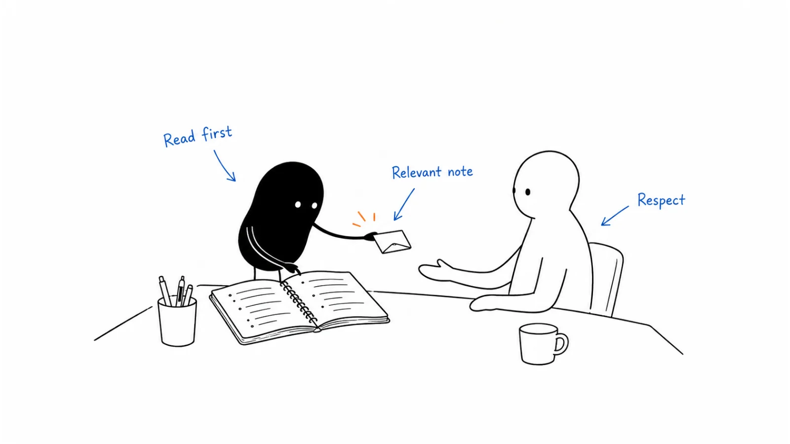

**Last reviewed:** 2026-09-10 · **Reading edit:** 2026-09-10

Someone accepts your connection request.

You send a thank-you, a paragraph about your product, a customer logo list, and a calendar link.

They never reply.

It is tempting to blame the opening line or the timing. But the more basic problem may be that you treated one action—joining a professional network—as agreement to a different action: entering a sales conversation.

LinkedIn outreach works better as a set of distinct decisions. Why this person? Why this route? What relationship already exists? What would be useful to ask or share? What did the person actually agree to?

A public comment, a connection invitation, a direct message, and an InMail do not mean the same thing. A profile view is not a request for a demo. A like is not a buying project. A thoughtful exchange can be valuable without becoming a meeting.

This guide explains how to make an appropriate business approach, respond naturally, and coordinate what happens next. It is not a growth hack for maximizing requests, a scraping guide, or permission to use someone's profile data for any purpose you choose.



*Reading guide: check the account and relationship → choose an appropriate route → understand the context → write a clear note → respond to the actual answer → coordinate the next action.*

Choosing between a connection request and InMail? Start with [the route decision](#step-1-check-whether-linkedin-fits-this-contact). Writing a first message? Read [the message method](#step-3-write-a-short-relevant-message). The [worked example](#worked-example-illustrative) keeps invitations, replies, and meetings separate in a small fictional pilot.

## Use this when

A relevant person uses LinkedIn as part of their professional work, and a message there is a reasonable way to raise a specific business topic.

You have an existing professional relationship and want to discuss a new, relevant issue without pretending the connection is warmer than it is.

Someone publicly asks for an example, explanation, or recommendation that you can contribute to honestly. You need to decide whether to answer publicly, disclose your product connection, or ask before moving the discussion.

Your team uses LinkedIn alongside email and calls, but the same account is receiving disconnected approaches from several people.

Reps keep treating accepted invitations, short thank-yous, or reactions as qualified interest. You need a clearer definition of a real conversation.

You want to test an offer in a small, reviewed workflow. Email does not have to succeed first, but the account hypothesis and limits of the test should be explicit.

## Do not use this when

You want broad reach, publishing habits, and a body of useful ideas. Start with [LinkedIn organic](../04-channels-and-distribution/linkedin-organic.md). Publishing may support later conversations, but it is not the same workflow as direct outreach.

A person has declined the approach, blocked contact, or asked you to stop. Do not use a comment, colleague, alternative account, or another channel to reopen the same pitch.

Your only rationale is that you have unused InMail credits or a Sales Navigator subscription. A feature makes an action available; it does not make the action useful.

You intend to scrape profiles, automate invitations through unauthorized tools, simulate engagement, or operate somebody else's personal identity. This guide does not provide a safe-volume recipe for those activities.

You need a legal determination about a particular jurisdiction, purpose, data source, or message. Have the appropriate owner resolve it before you release the outreach.

<a id="words-you-will-use"></a>

## A few useful terms

| Action | What it is for | What it does not establish |
|---|---|---|
| Public comment | Contributing to a public discussion | Permission to send a sales sequence |
| Connection invitation | Asking to join a professional network | Agreement to discuss a purchase |
| Direct message | A private exchange through an available messaging route | Interest merely because it was delivered |
| InMail | A LinkedIn route that may reach someone outside your connections | A guaranteed reply or an exemption from rules |
| Agreed next step | A particular action the person accepted | Blanket permission for future marketing |

An **artifact** is a specific piece of work: a post, comment, talk, article, or project. It can provide useful context, but you do not need to find one for every appropriate business conversation.

A **role hypothesis** is your reason to think the person's responsibilities may relate to the topic. It remains a hypothesis until supported or corrected.

A **substantive reply** gives you information about the work, relevance, a real question, or a meaningful next step. “Thanks for connecting” is a reply, but not necessarily substantive.

An **account owner** is the person coordinating your company's current relationship with the business. It is an internal responsibility, not a claim of ownership over the prospect.

A **stop** is a restriction on further action. Record its stated scope accurately and make sure the systems and people scheduling outreach can see it.

<a id="one-rule"></a>

## Keep this in mind

Write something the recipient can understand and answer without having to uncover your motive.

If you sell a product, say so when that context matters. If you are asking a research question, be honest about why you are asking and do not disguise a sales call as independent research.

Relevance does not require flattery. Personalization does not require a recent post. A message can be short without being cryptic, and commercial without being pushy.

The point is to make a proportionate approach and respect the response—not to perform enough public engagement that a private pitch feels inevitable.

There is no mandatory comment → connect → message sequence. There is also no rule that a connection must receive a welcome pitch, or that silence must trigger an email.

<a id="operating-method"></a>

## How to do it

<a id="step-1-decide-this-route-is-better-than-email-for-this-person"></a>

### Step 1: Check whether LinkedIn fits this contact

Begin with the relationship and the task.

Is this an existing customer contact, someone in an active opportunity, a person you met at an event, a genuine professional connection, or someone you have never interacted with?

Check the shared account record before preparing a new approach. A prospect may already have answered an email, booked a call with a colleague, or requested a stop elsewhere.

Then identify the topic. “Talk to the VP” is not enough. “Ask how implementation handoff ownership is managed, because that may relate to our product” is a clearer starting point.

You still need to assess whether the proposed use and route are appropriate. A visible profile is not a general license to collect details or send marketing.

#### Know which route is actually available

LinkedIn's current help page describes free messaging to first-degree connections, and other routes that may be available through Open Profile, certain message requests, or InMail. Availability depends on the relationship, settings, and product. Check the current interface rather than assuming every profile can receive the same message. [LinkedIn messaging help](https://www.linkedin.com/help/linkedin/answer/a554575/send-messages-on-linkedin?lang=en&ref=b2b-playbook).

Use that distinction to plan the conversation, not to find a way around someone's settings.

For an existing connection, a direct message may be appropriate. For someone you do not know, consider an available, appropriate non-connection route or a genuine introduction. If no suitable route exists, you can decide not to contact them.

A subscription does not create a need to use all available credits. Do not buy a tool before deciding what job it must perform.

#### Use invitations for real network-building

LinkedIn recommends invitations to people you know and trust, and notes that ignored, pending, or spam-marked invitations and excessive activity can lead to restrictions. Both Basic and Premium members are subject to limits. This guide does not supply a universal numerical quota. [LinkedIn invitation restrictions](https://www.linkedin.com/help/linkedin/answer/a551012/types-of-restrictions-for-sending-invitations?ref=b2b-playbook).

A useful invitation can explain an actual connection: a conversation at an event, a collaboration, a professional introduction, or another genuine relationship.

For example:

> “Good speaking with you after the implementation session yesterday. I'd be glad to stay connected here.”

Use this only if that conversation happened. Do not imply that you met someone because you both appeared on an attendee list.

If you do not know the person, do not manufacture familiarity through a few likes and a generic comment. An appropriate direct approach through a permitted route is clearer than pretending a relationship already exists.

#### Make your own profile understandable

The recipient may inspect your profile before responding. It should make your identity, company relationship, and work understandable.

Use accurate role information and a clear description of what you do. A founder profile should not hide the product behind an invented advisory role, and an SDR should not imply they are an independent researcher.

You do not need an elaborate creator profile to have a useful conversation. You do need to avoid a mismatch between the message and the identity behind it.

Make evidence easy to inspect where appropriate: a real product explanation, a useful article, or a clearly attributed customer case. Do not fill the profile with unsupported revenue claims or logos presented as customers when they are not.

#### Treat privacy review as a separate decision

The UK ICO includes social-media direct messages in its electronic-mail discussion and cautions that professional-network use may be in an individual's personal professional capacity, not simply as a corporate representative. Its B2B guidance remains marked under review. Public data and a visible job title do not settle the applicable marketing rules. [ICO B2B guidance](https://ico.org.uk/for-organisations/direct-marketing-and-privacy-and-electronic-communications/business-to-business-marketing/?ref=b2b-playbook).

Have your responsible owner define the applicable data-use, messaging, transparency, and stop process for your audience. This article is not a global legal checklist.

<a id="step-2-go-public-first-or-do-not-go"></a>

### Step 2: Read and understand the person's public work

If you refer to a post, read it. If it links to an article that changes the meaning, inspect the relevant source before presenting a conclusion.

Record what the person actually said and when they said it. Separate that from your interpretation.

A post saying “we are hiring implementation operations” does not prove that handoffs are failing. A complaint about a workflow last year does not establish a current buying project. A comment praising a tool does not mean the company is evaluating alternatives.

Use the evidence to ask a better question, not to declare a diagnosis.

#### A useful comment stands on its own

Suppose someone discusses the difficulty of tracking whether customer success accepted a handoff. A useful comment might contribute a specific distinction:

> “We've found it helpful to distinguish assigning the task from acknowledging ownership. Otherwise the task can look complete before the next team has taken it.”

This is an illustrative comment. Use “we've found” only when it describes your actual experience. If it is an idea rather than experience, say “One distinction that may help is…”

The comment should remain useful even if the author never visits your profile.

Do not turn every thread into a product demonstration. If you recommend your own product and the context welcomes recommendations, disclose the relationship clearly. A relevant commercial answer can be more honest than pretending to be a neutral observer.

#### You do not have to comment first

Sometimes the relevant point is better discussed privately. Sometimes you have no useful public addition. Sometimes the person rarely posts.

None of those facts requires you to invent a comment.

A role-based message can be appropriate when the account, relationship, route, and purpose support it. Public interaction is optional, not a prerequisite that earns access to the inbox.

Likewise, an email can truthfully refer to a public post. There is nothing inherently dishonest about using a public observation in another appropriate channel. The question is whether the approach is relevant and permitted, not where you noticed the fact.

#### Do not overstate the relationship

“I enjoyed our discussion” should refer to an actual exchange, not a reaction you left on their post.

“Your team is looking for a new system” should refer to evidence of that need, not a title change or an inferred intent score.

If someone corrects your reading of their post, acknowledge it and update the premise. Do not keep the original claim because it makes the pitch stronger.

#### Keep public and private information separate

Do not mention an active deal, private complaint, pricing discussion, or personal contact detail in a public comment unless you have appropriate permission to disclose it.

If the conversation moves into account-specific detail, ask whether the person wants to continue privately through an appropriate route.

Moving to a private channel is not a reason to collect more information than the task needs. A short explanation or a generic example may be enough.

<a id="step-3-write-the-note-like-email-shorter"></a>

### Step 3: Write a short, relevant message

A first note needs enough context for the recipient to decide whether to respond.

Usually that means who you are, why the topic may be relevant, what you can usefully offer or ask, and one proportionate next step.

There is no universal two-sentence rule. A short message can still be vague or manipulative. A slightly longer message may be necessary to explain an unfamiliar product or avoid an inaccurate implication.

Write for the phone screen: short paragraphs, straightforward language, and no long list of benefits before the question.

#### Start with the actual reason

Weak:

> “Loved your recent post. We help innovative teams unlock growth with an AI-powered platform. Would you have fifteen minutes next week?”

The compliment does not establish relevance, the product is unclear, and the meeting arrives before the reader knows why it might help.

More useful, when the stated context is true:

> “Your post distinguishes assigning an onboarding task from knowing the next owner accepted it. I build software for that handoff. Is acknowledgement still difficult in your current setup, or was the post describing an earlier process?”

This asks a real question and gives the recipient a way to reject the premise.

Do not send it merely because the wording is polished. If your product does not address the described handoff, it is the wrong message.

#### A role-based note without a public post

You can state uncertainty plainly:

> “I work on software for implementation-to-customer-success handoffs. Your role appears to cover implementation operations, though I may have that wrong. Is ownership of that handoff something you manage?”

This is fictional teaching copy, not a recommendation to message a particular person. It demonstrates that the note does not need a flattering opening or a manufactured trigger.

A reply identifying the right function is useful research. It is not automatically a referral, and it does not give you permission to contact a named colleague by any route available.

#### A note to an existing connection

Do not assume the recipient remembers how you know each other. Briefly restate the real context.

> “We spoke after the operations roundtable in May about handoff ownership. I'm now working on a product for that workflow. Would a short example be useful, or is the current process working well for you?”

Only use the event and prior topic if they are accurate. An old connection with no remembered interaction should not receive invented nostalgia.

Also be clear when the purpose has changed. A professional connection made years ago is not an obligation to discuss your new product.

#### An InMail needs a clear subject

If the interface provides a subject field, make it describe the topic. “Implementation handoff ownership” is more informative than “Quick question,” “Following up,” or a false reply prefix.

Do not imply an existing thread when there is none. Do not manufacture urgency or use a job-opportunity subject for a sales approach.

Keep the body understandable on its own. The recipient should not have to open an external attachment to learn what you sell or what you want.

Do not rely on fixed character limits, credit allowances, or refund rules copied from an old guide. Check the current product and interface when preparing the actual message.

#### Make the ask match the available evidence

A first message may ask whether the person owns the work, whether a specific issue is relevant, or whether a small example would be useful.

If the person has explicitly asked for a demo or vendor recommendation, a more direct next step may fit. Do not make them pass through artificial small-talk stages before answering a clear request.

The key is proportionality. “Would a screenshot help?” should lead to a screenshot, not a qualification meeting disguised as a helpful resource.

If you ask for a meeting, say what it will cover. “Compare how the acknowledgement step would work with your current system” is more concrete than “explore synergies.”

#### Use links and attachments deliberately

There is no blanket rule that a first message must never contain a link. A requested document or an essential public reference can be appropriate.

But do not make the reader navigate a link maze to understand the message. Avoid unexplained attachments, misleading labels, and concealed destinations.

If you offer an example, state what it is. If it contains a form, account requirement, or sales follow-up, make that expectation clear rather than calling it a simple screenshot.

Do not treat a link click as agreement to a call. It is an interaction with an item, not a complete statement of buying intent.

#### Remove the parts you cannot defend

Before sending, ask whether each claim is true and necessary.

Did you really read the post? Is the named company a customer? Is the integration available? Does the example actually show the promised capability? Are you implying a problem the person never described?

Remove claims that only exist to make the note feel warmer or more urgent.

A useful editing test is to imagine the recipient forwarding the message to a colleague with “Is this accurate?” Your message should survive that simple check.

## Respond to the conversation, not the sequence step

After a reply, the task changes. Stop treating the person as a scheduled prospect and start responding to what they said.

Read the thread before drafting. A short reply can change the role hypothesis, channel preference, or next action.

### They accept the invitation but say nothing

Acceptance changes the connection state. It does not establish product interest.

You do not owe the system a welcome pitch. If you have a genuine, appropriate business reason to write, explain it clearly. If not, leave the new connection alone.

Do not start a chain of automated thank-yous, product introductions, and calendar reminders simply because the platform now permits messages.

### They say “Thanks”

Acknowledge naturally if a response is useful, but do not count politeness as qualification.

If your original question remains unanswered, do not assume the person agreed with its premise. There may be no next action.

A reaction emoji or a brief courtesy message can be the end of the exchange.

### They ask for the example

Send the item you offered. Add just enough explanation to make it understandable.

If the example has limitations, state them. A mock-up should not be presented as a live product feature; a fictional workflow should not be represented as a customer deployment.

Do not turn delivery into a compulsory meeting request. You can offer to answer questions without creating a scheduled follow-up the person never requested.

### They describe a relevant problem

Ask one useful clarifying question or explain the capability that directly addresses it.

Avoid pasting the full product pitch. If they say the difficulty is acceptance by the next owner, start there rather than discussing every feature of your platform.

If a meeting would genuinely help, summarize the purpose and ask. Keep the distinction between interest in the topic, interest in the product, and an active buying process.

### They say the topic is not relevant

Accept the correction. Update the account or role hypothesis rather than treating the reply as an objection to overcome.

If they voluntarily point to another function, record the suggestion accurately. “Try operations” is not the same as “I recommend you to our operations director.”

Do not ask for a colleague's private email as an automatic parting question.

### They ask you to stop

End the marketing approach and apply the stated restriction through the shared workflow.

Do not ask why as a condition of honoring it. Do not move to email, another rep, a comment thread, or a different profile to continue the same pitch.

A public profile remaining visible does not cancel the stop.

<Accordion title="Three fictional exchanges that lead to different outcomes">

**A requested item**

Recipient: “The screenshot would help. No call for now.”

Sender: “Understood. Here's the screenshot, with the acknowledgement step highlighted.”

Recipient: “Thanks.”

Record: requested item delivered; no meeting and no agreed follow-up. Courtesy is not product qualification.

**A corrected premise**

Recipient: “That post was about our old process. We solved it last year.”

Sender: “Thanks for clarifying. I read it as a current issue, which was incorrect.”

Recipient: “No problem.”

Record: timing hypothesis rejected; do not continue a sequence based on the old problem.

**A real question with a limitation**

Recipient: “Would this work across separate regional instances?”

Sender: “I need to verify that. The example shows ownership acknowledgement within one workflow, not cross-instance migration.”

Recipient: “That's the part we'd need to understand.”

Record: specific technical question; confirm the capability before promising a demonstration or marking the account as a fit.

These are teaching exchanges, not transcripts or evidence of response rates.

</Accordion>

## Follow up only when there is a useful reason

Silence does not tell you whether the person saw the message, found it relevant, was busy, or chose not to respond.

Do not claim to know. “I saw you read this” is often an unnecessary and uncomfortable way to reopen the approach, even when an interface displays a read state.

If an appropriate follow-up is part of your approved process, it should clarify something, add genuinely relevant information, or fulfil an agreed timing request.

A reminder that repeats the same demand in different words rarely adds much for the reader.

### A useful clarification

Suppose the original note made the product scope unclear. A short correction may help:

> “One clarification to my earlier note: the example is about confirming who accepted the handoff, not replacing your project-management system. If that distinction isn't relevant, I'll leave it here.”

Send a clarification only if it is accurate and useful, not as a mandatory second message.

If you say you will leave it there, do so. Do not follow it with a “final final” message or a guilt-based breakup note.

### An agreed timing request

“Send this after our September review” creates a specific future task. Record what should be sent and why.

It does not necessarily create permission for several interim messages. Respect the timing rather than filling the gap with reminders.

Before the future action, check whether the account state or restrictions changed.

### A channel change needs its own rationale

A bounced email is a route problem, not proof that LinkedIn is now appropriate. A silent LinkedIn thread does not automatically justify a call.

If another channel is part of an approved account plan, coordinate it through [multichannel sequence](multichannel-sequence.md). Make sure the next person can see prior messages, replies, and stops.

Avoid simultaneous versions of the same pitch from several colleagues. The recipient experiences one company, even when your tools report separate channels.

### Close the open task

When no useful follow-up remains, close the task instead of leaving it in an endless overdue queue.

Record no response as no response. Do not turn it into “not interested” unless that was expressed, or into “nurture” if no appropriate future action has been defined.

You can preserve an account-level learning note without keeping an individual in perpetual outreach.

<a id="step-4-cap-volume-and-automation"></a>

### Step 4: Limit volume and review automation rules

Capacity is not the number of messages the interface lets you send. It is the number of approaches you can research, review, answer, and follow through on responsibly.

A small team can lose track of a modest batch if every reply creates a different commitment. Reserve time for the work after the send.

Do not treat account limits as targets to reach. Warnings, restrictions, or recipient complaints should trigger a review of the activity, not an experiment to find a less detectable method.

LinkedIn prohibits unauthorized tools that scrape data or automate activity, including messaging, and its community policies address spam and inauthentic behavior. Human review of a draft does not make an otherwise prohibited sending tool acceptable. [Prohibited software guidance](https://www.linkedin.com/help/linkedin/answer/a1341387/prohibited-software-and-extensions?lang=en&ref=b2b-playbook), [Professional Community Policies](https://www.linkedin.com/legal/professional-community-policies?ref=b2b-playbook).

### Distinguish assistance from account operation

An assistant can help shorten a message from approved notes, identify unsupported claims, or draft possible replies for a human to review.

That is different from an extension collecting profiles or sending invitations through your account.

Review what a tool actually accesses and does. A description such as “AI copilot,” “human-like,” or “safe automation” does not establish platform authorization.

Do not share session cookies or credentials to let an unapproved service impersonate you. Use authorized capabilities and the correct access model for any integration.

This guide does not declare every integration prohibited. It asks you to verify authorization and scope rather than assume them from the product category.

### Start AI assistance with evidence-labelled drafts

A useful drafting instruction is:

> Use only the approved notes below. Identify which statements are observed, inferred, or unknown. Draft a concise message that explains our commercial relationship and asks one relevant question. Do not invent familiarity, product capabilities, customer results, or permission. Do not send or modify records.

Review the output against the actual source. A model can turn “may own implementation” into “you lead implementation” while making the sentence sound smoother.

Do not paste a person's entire history into a prompt when one relevant business observation is enough. Follow your approved privacy, access, and retention policies.

AI can also classify replies provisionally. Require a human check for stops, ambiguous timing, capability questions, and changes to account ownership. A wrong label can create an unwanted follow-up.

### Keep the sender responsible

The person whose name appears on the message should understand and be able to stand behind it.

Do not have a team write as the founder while the founder has no awareness of the conversation. Supporting preparation is different from pretending the founder personally read, used, or experienced something.

If a conversation needs another colleague, introduce them honestly through an appropriate route. Do not quietly swap identities mid-thread.

### Treat restrictions as a reason to pause

If LinkedIn restricts an action, read and follow the notice and official guidance. Disable prohibited tooling and inspect how the activity was generated.

Do not rotate accounts, manufacture engagement, change fingerprints, or spread the same activity across colleagues to avoid a restriction.

A genuine operating correction may include reducing the batch, improving relevance, or stopping a workflow. It is not enough to resume at a guessed “safe” number.

<Accordion title="A review checklist for an AI-assisted message">

The source says: “Our implementation team is growing.”

A poor AI draft says: “Congrats on the rapid expansion. Your onboarding process must be under pressure, and our platform can cut the handoff workload in half.”

The problems are separate:

- Growth is stated; “rapid” may not be.
- Process pressure is inferred.
- The claimed reduction needs real evidence.
- The person may not own the relevant work.

A better draft keeps those limits visible:

“Your team update mentions implementation growth. I work on software for handoff ownership between implementation and customer success. Is that workflow within your scope, or am I looking at the wrong role?”

That is still only a draft. The human reviewer must decide whether the account, relationship, route, and proposed use justify sending it.

An improved sentence does not resolve a missing permission decision.

</Accordion>

<a id="step-5-keep-organic-and-outbound-on-different-calendars"></a>

### Step 5: Keep publishing separate from direct outreach

Publishing and outreach can support each other without becoming the same thing.

A useful post may lead someone to ask a question. A prospect may read your articles after receiving a message. A real customer conversation may inspire a later, appropriately anonymized or authorized educational post.

None of that means everyone who reacts to a post should enter an SDR sequence.

### Give public conversations a clear owner

When someone asks a product question under a founder's post, one appropriate person should respond. Do not send several reps into the replies and inbox at once.

The answer can remain public if it is useful and does not expose private information. If account-specific details are needed, ask whether the person wants to continue privately.

A public answer should not be withheld merely to collect a lead. If the question can be answered in the thread, answer it.

### Do not turn engagement into undisclosed qualification

A person can like an idea without wanting the product. A competitor, student, former colleague, or interested practitioner may engage with the content.

Treat the engagement as what it is. If you later make a relevant commercial approach, explain that purpose rather than claiming that the like expressed demand.

Do not use artificial comments, engagement exchanges, or staged conversations to create the appearance of interest.

### Connect the account record without copying everything

Record enough context for coordination: relationship, relevant observation, outreach purpose, latest response, next commitment, owner, and restrictions.

Do not export every post, reaction, or profile detail into the CRM simply because it may be accessible. Keep the collection proportionate to an approved purpose.

A useful note might say:

> “Existing professional connection. Asked about handoff acknowledgement after receiving a product example. Wants a technical answer on cross-instance support; no meeting agreed. Capability remains unverified. Product specialist to review before reply.”

That note is more useful than “warm LinkedIn lead.”

### Make handoffs visible to the recipient

If a technical colleague should answer, explain why and ask about a suitable next step.

You may say that you will check with the product team and reply yourself. You do not always need to add the buyer to another channel or ask them to repeat the question.

If they agree to a meeting, preserve the exact topic, known constraints, and unresolved questions. The next person should not open with a generic discovery script that ignores the existing conversation.

## Build a small learning loop

The first reviewed batch should answer a manageable question.

For example: can a clearly described handoff-ownership offer create relevant conversations with a defined operations role through an appropriate LinkedIn route?

Do not try to test the entire market, every seniority level, several products, and four message styles at once.

Keep the account criteria and outcome definitions visible. Record which messages were exploratory and which responded to an explicit request.

### Review the actual replies

Useful patterns may include a repeated role mismatch, confusion about the product category, a missing capability, a request for a smaller example, or a consistent reason the topic is not timely.

Those findings point to different actions.

If the role is wrong, more polished copy is unlikely to solve the problem. If people understand the problem but cannot tell what the product does, improve the explanation. If the required capability is absent, do not promise it to keep the thread alive.

### Compare like with like

Existing connections, people you met at an event, and strangers reached through InMail start with different relationships. Their raw reply rates are not a controlled channel comparison.

Likewise, people who explicitly requested a resource should not be mixed into a cold-first-message denominator.

If you test two messages, keep the account selection, route, relationship, timing, and outcome definition comparable where possible. If several factors change, describe the result as another exploratory batch.

Do not call a small difference a winner without enough evidence. The useful result may simply be a clearer question for the next test.

### Learn from silence without inventing its cause

A low response count can reflect the audience, route, relevance, explanation, timing, or sample size. You usually cannot determine which from silence alone.

Review the controllable inputs and any actual replies. Avoid adding a speculative narrative such as “senior buyers hate long messages” to explain a handful of unanswered notes.

A bounded test can justify stopping a motion for now without proving that the channel never works.

<a id="teaching-fill-inventednot-a-customer"></a>

## Worked example (illustrative)

A fictional software team wants to discuss implementation handoff ownership with a defined group of operations contacts.

All numbers, messages, costs, and decisions here are invented. They are not Lensmor results, a platform benchmark, or evidence that any actual list is lawful to contact. Assume the responsible owner has approved the limited use and reviewed each route.

### Define the population

The team starts with 40 candidate contacts at 40 distinct accounts.

Six are excluded before outreach: two existing customers, two active opportunities owned elsewhere, one relevant stop restriction, and one person whose role does not fit.

That leaves **34 eligible contacts**.

The team separates them into three mutually exclusive groups:

- Twelve existing first-degree professional connections with an appropriate reason for a business message.
- Fourteen people outside the network for whom an appropriate InMail route is available.
- Eight people the sender genuinely met during a recent professional event, to whom a connection invitation is appropriate.

The groups are not randomized or equivalent. They are different relationship contexts, not an experiment proving which LinkedIn feature is best.

### Invitations are measured separately

The sender invites the eight event contacts with truthful notes referring to their actual interaction.

Five accept. Three remain pending at the review date.

Acceptance is **5 ÷ 8 = 62.5%** for this tiny fictional group. It measures connection acceptance, not product interest.

Of the five accepted contacts, only three have a specific, previously discussed business topic that supports a further message. The other two receive no product approach. The three pending invitations do not receive a workaround through another identity or route.

The pilot therefore has **eight invitations** and **29 initial business messages**: 12 to existing connections, 14 InMails, and three messages following the relevant event discussions.

### Review the initial responses

The 12 messages to existing connections yield two substantive replies, one courtesy reply, and nine no replies.

The 14 InMails yield two substantive replies, one direct decline, one stop request, and ten no replies.

The three messages to event contacts yield one substantive reply and two no replies.

Across the 29 initial messages, the outcome is:

| Initial message result | Count | Interpretation |
|---|---|---|
| Substantive reply | 5 | A relevant question, work detail, or meaningful next step |
| Courtesy reply | 1 | A response without product qualification |
| Direct decline | 1 | End the pitch |
| Stop request | 1 | Apply the restriction |
| No reply | 21 | No cause inferred from silence |

The counts reconcile: 5 + 1 + 1 + 1 + 21 = 29.

There are eight human replies in total, so the initial any-reply rate is **8 ÷ 29 ≈ 27.6%**. The initial substantive-reply rate is **5 ÷ 29 ≈ 17.2%**.

Those are different measures. Combining them into “positive replies” would hide the decline and stop.

### Add a bounded follow-up, not another campaign

The team reviews the 21 silent threads. In six, a specific clarification is useful and the approved process permits one follow-up. It sends six clarifications; the other 15 receive no additional message in this pilot.

One of the six replies with a relevant technical question. Five remain silent.

The pilot now has **35 prospecting messages to 29 unique contacts**: 29 initial messages plus six clarifications. The eight invitations are counted separately. Requested resource delivery and ordinary back-and-forth replies are excluded from the prospecting-message count.

There are now six distinct substantive-reply contacts and nine distinct human-reply contacts. Twenty contacts remain silent. The overall unique-contact states reconcile: six substantive + one courtesy + one decline + one stop + twenty silent = 29.

One reply after six follow-ups does not establish that a second message is universally effective. The six were deliberately selected, and there is no comparable control group.

### Track the next steps

Of the six substantive contacts, three request an example only, two agree to scoped meetings, and one wants an answer about a capability the team must verify.

The three requested examples are delivered without surprise invitations. The technical question remains open until the product team provides a factual answer.

By the review date, one of the two meetings has been held and the other is scheduled for a future date. The held conversation does not yet meet the team's opportunity criteria.

There are **zero qualified opportunities and zero sales** in this example.

That is not a reason to pretend the replies were worthless. It is a reason to report the result accurately and decide what remains worth learning.

### Review the cost and decision

Assume nine hours of research, drafting, replies, coordination, and review at an internal planning rate of &#36;50 per hour, plus &#36;90 in allocated subscription cost.

The defined pilot cost is **&#36;540**. That is &#36;90 per substantive-reply contact, &#36;270 per booking, and &#36;540 per held meeting as of this review.

These are invented planning figures, not LinkedIn prices. They exclude later sales work and are not customer acquisition cost or a revenue return.

The useful findings are specific: the role definition produced some relevant exchanges; examples were preferred by several contacts; one capability question needs a better prepared answer; connection acceptance did not justify messaging everyone.

The team improves the capability explanation and next-step options before deciding whether another small batch is worthwhile. It does not buy more accounts or declare that the InMail group won based on incomparable relationship groups.

## Copy: LinkedIn outbound card (fill)

Use this as a brief for a reviewed approach, not a fixed sequence.

```text
LINKEDIN OUTBOUND BRIEF

Account / contact reference:
Current owner and existing relationship:
Relevant work or role hypothesis:
Evidence source / observation date / uncertainty:
Why this route is appropriate:
Available route and use review:
Current restrictions checked:

Truthful identity and commercial context:
Specific topic or useful item:
One question or proposed next step:
Claims and product limitations checked:
Public comment needed? If yes, its standalone value:
Connection invitation appropriate? Actual relationship:

Next action if reply:
Next action if silence, including no action:
Stop / correction propagation:
Owner and review date:
```

Working file: [linkedin-outbound.md](../../templates/linkedin-outbound.md).

The existing working file reflects the earlier artifact-first approach. Its public-comment and next-channel prompts are optional, not mandatory steps. A dated artifact is useful when available, but a supported role hypothesis can also inform an appropriate message. Preserve any filled work and use this revised guide for the decision rules.

## Copy: reply and handoff record (fill)

Use factual notes rather than broad labels such as warm or interested.

```text
LINKEDIN CONVERSATION RECORD

Account / contact / owner:
Route and relationship:
Original purpose:
Latest reply, summarized accurately:
Facts learned:
Assumptions corrected:
Product answer still unverified:

Outcome: courtesy / relevant question / item request /
meeting agreed / decline / stop / no response / other
Exact next commitment:
What was explicitly declined:
Owner and due date:
Meeting purpose / time / participants, if agreed:

Restriction scope and systems updated:
Existing email / phone tasks reviewed:
What the next colleague needs to know:
What remains unknown:
```

Keep access and retention appropriate to the information. Do not paste unnecessary profile details or private messages into broadly shared documents.

## Copy: batch review (fill)

Keep connection-building and business-message results distinct.

```text
LINKEDIN BATCH REVIEW

Period and business question:
Original candidates / exclusions / eligible contacts:
Relationship groups and why they differ:
Invitations sent / accepted / still pending:
Initial business messages by route:
Follow-ups and reason for each:
Unique contacts messaged:

Courtesy / substantive / decline / stop / no reply:
Requested items / technical questions / meetings:
Booked / held / future / opportunities / sales:
Counting rules and excluded message types:

Time cost and assumptions:
Allocated tool cost:
Data, message or capability issue:
Restriction or coordination failure:
What to change / stop / test next:
Owner:
```

<a id="pre-flight-checklist"></a>

## Before you start

- [ ] The account, role, relationship, and business purpose are clear.
- [ ] Current ownership and restrictions have been checked.
- [ ] The route is available and appropriate, not a workaround.
- [ ] Any invitation reflects a genuine professional connection.
- [ ] A cited post was actually read and its date matters.
- [ ] Observations, hypotheses, and unknowns remain separate.
- [ ] Identity and commercial context are honest.
- [ ] The message asks one proportionate question or proposes a clear action.
- [ ] Any public comment has value without an inbox conversion.
- [ ] Product claims, examples, and links match what is promised.
- [ ] AI drafts are reviewed and no unauthorized account automation is used.
- [ ] Replies, corrections, and stops can interrupt pending tasks.
- [ ] The team has capacity to fulfil the commitments it creates.

## Metrics

Measure the steps needed to understand the work, not just the numbers that look encouraging.

| Measure | Useful definition | Do not confuse it with |
|---|---|---|
| Invitation acceptance | Accepted invitations ÷ invitations sent, at a stated date | Product interest |
| Any-reply rate | Unique people replying ÷ unique people messaged | Positive or qualified replies |
| Substantive-reply rate | People with a relevant exchange ÷ people messaged | Opportunities |
| Agreed next steps | Requested items, technical answers, and meetings separately | A single meeting count |
| Held meetings | Meetings that actually occurred | All bookings, including future ones |
| Quality incidents | Stops missed, misleading claims, duplicate approaches, restrictions | A cost to ignore because replies increased |

Read receipts, profile views, connection counts, and product-specific scores may provide context, but they do not establish purchase intent or channel contribution.

Count unique people and accounts separately where multiple people at one company are involved. Five replies at one account are not five companies showing demand.

Keep booked, held, accepted opportunity, and sale stages distinct. Define your review window so future meetings are not treated as no-shows.

For attribution, record where the first meaningful conversation occurred and what other interactions were already present. LinkedIn may introduce a topic, support an email conversation, or help someone evaluate your credibility. Do not assign all revenue to the last visible message without evidence.

If you cannot observe something reliably, leave it unknown. A precise-looking dashboard built on guessed states is harder to trust than a small, well-defined report.

## Common mistakes

### Commenting as a hidden prerequisite for pitching

A useful comment is a contribution. A generic comment posted only to make the next message feel warmer is activity without much value for the reader.

Do not require reps to manufacture public interaction for every account.

### Assuming acceptance means interest

Connection acceptance and a sales reply are different events. Keep them separate in both the workflow and the report.

No automated pitch is owed after acceptance.

### Rejecting honest commercial context

A message does not become more respectful by pretending it is not commercial. Explain the relationship and purpose clearly, then make an appropriate ask.

If someone asked for vendor suggestions, a disclosed product recommendation can be useful.

### Moving every silent thread to another channel

Silence does not create permission or a new reason to contact. Review the account plan and restrictions before any different route.

A broad stop should stop the approach, not merely change the interface.

### Copying a vendor's safe-volume number

Limits and restrictions depend on the product and activity. A blog's number is not authorization, and staying below it does not make irrelevant or prohibited behavior acceptable.

Use official rules and a batch sized to actual research and response capacity.

### Letting AI polish uncertainty out of the message

The sentence may become smoother while the facts become less accurate. Review the source, not just the tone.

Use AI to make the message clearer, not more certain than the evidence.

### Mixing creator engagement with buyer demand

People may enjoy the idea without needing the product. Preserve that distinction so the public work stays useful and the outbound report stays credible.

## What to read next

Use [account research](account-research.md) and [buying signals](buying-signals.md) to build a supported reason for the approach. [Message-market fit](message-market-fit.md) helps diagnose whether the offer is understood and relevant.

For another channel, read [cold email](cold-email.md) or [cold call](cold-call.md), and coordinate the account through [multichannel sequence](multichannel-sequence.md).

[Contact data](contact-data.md) covers source quality, corrections, and restrictions. [LinkedIn organic](../04-channels-and-distribution/linkedin-organic.md) covers the separate work of publishing and participating publicly.

## Sources and evidence boundary

This is an owner-maintained editorial method, not a claim of guaranteed platform performance. Message examples, templates, and the pilot calculations are fictional or illustrative, not copied customer results.

Primary sources checked on **September 10, 2026**:

- [LinkedIn messaging help](https://www.linkedin.com/help/linkedin/answer/a554575/send-messages-on-linkedin?lang=en&ref=b2b-playbook): available relationship and messaging routes; actual access depends on settings and product.
- [LinkedIn invitation restrictions](https://www.linkedin.com/help/linkedin/answer/a551012/types-of-restrictions-for-sending-invitations?ref=b2b-playbook): invitation guidance and restrictions, not a universal sending quota.
- [LinkedIn prohibited software guidance](https://www.linkedin.com/help/linkedin/answer/a1341387/prohibited-software-and-extensions?lang=en&ref=b2b-playbook): unauthorized automation and data-access boundaries.
- [LinkedIn Professional Community Policies](https://www.linkedin.com/legal/professional-community-policies?ref=b2b-playbook): professional conduct, authenticity, and spam boundaries.
- [ICO B2B marketing guidance](https://ico.org.uk/for-organisations/direct-marketing-and-privacy-and-electronic-communications/business-to-business-marketing/?ref=b2b-playbook): UK-specific privacy and electronic-message context; under review and not a global legal checklist.

The earlier edition's general attribution to 30MPC social sequences is not used as evidence for a mandatory public-first order or follow-up limit. There is no paid sequence template reproduced here.

---

Copyright © 2026 Ivan Xu. All rights reserved. See the [copyright and reuse terms](../../LICENSE).

Canonical source: [github.com/weilun88313/B2B-Playbook](https://github.com/weilun88313/B2B-Playbook)
