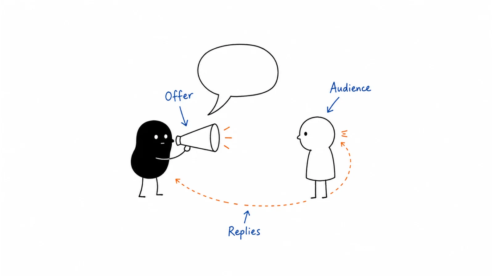

**Last reviewed:** 2026-08-30 · **Reading edit:** 2026-09-06

Before automating outreach, find out whether a specific group of buyers responds to your offer. Keep the audience and offer narrow, write the first messages yourself, and review the replies. Change one important variable at a time so you can learn from the test.

*Reading guide: one audience and offer → a small manual test → learn from the replies.*

## Use this when

- Someone wants to “stand up outbound” by buying seats and a sequence.
- Open rate is green and meetings are junk—or there are no meetings.
- The same paragraph is being generated for every logo and called personalization.
- Leadership asks why the AI SDR is not working yet.

## Do not use this when

- The account would fail the field test. Stay in [ICP](../01-strategy-and-buyers/icp.md).
- You still need the research brief. That is [account research](account-research.md).
- You need the written first touch for one logo. That is [cold email](cold-email.md).
- You need the calendar of meetings. That is [sales operating cadence](../09-operations-pipeline-and-measurement/sales-operating-cadence.md).

## A few useful terms

| Word | Meaning here |
|---|---|
| **Offer** | The specific job we claim to finish for this slice—not the product name. |
| **Sentence** | The first two lines a stranger will read. Observable evidence → consequence → one ask. |
| **Handmade batch** | 25–50 sends the founder or AE actually wrote, to logos that already pass ICP. |
| **Pattern** | The same objection or the same yes, repeating. One lucky reply is not fit. |

## Keep this in mind

**Do not automate a sentence you have not sold.** If the handmade batch cannot produce a qualified conversation or a clear, repeating no, more infrastructure is a volume tax. Message-market fit is the offer working on this slice—not a clever subject line.

## How to do it

### Step 1: Choose one audience and offer

One ICP slice. One job. One current alternative. Write the offer as a sentence the buyer could repeat in a staff meeting without your deck. If the sentence dies when the product name is removed, you do not have an offer. You have a feature.

### Step 2: Write the first messages yourself

Use the [cold email](cold-email.md) shape. No generated “personalization” from a scraped About page. If you cannot name two independent facts, you are not ready to test the offer—you are still in [account research](account-research.md).

### Step 3: Run a small test with a review date

Defaults you will override with your own log:

| Gate | Default |
|---|---|
| Size | 25–50 ICP-passing logos, one seat |
| Author | Founder or the AE who will later coach the motion |
| Window | Two weeks, then stop |
| Success | Qualified conversation **or** a repeating disqualify you believe |
| Failure | Silence, polite “looks cool,” or five different objections |

Classify replies the way [cold email](cold-email.md) already does. Do not raise volume mid-batch to “get a read.”

### Step 4: Change one variable at a time

If the batch fails, change **one**: slice, offer, or sentence. Not all three. A new tool is not a change.

If the batch produces a pattern, write it on the [message-market-fit card](../../templates/message-market-fit.md). That card is what sequences and agents are allowed to scale. [AI workflow](../09-operations-pipeline-and-measurement/ai-workflow.md) still needs a send gate. [GTM AI maturity](../09-operations-pipeline-and-measurement/gtm-ai-maturity.md) still forbids climbing the ladder on a motion that does not work by hand.

### Step 5: Check demand before adding automation

A Clay table, a mailbox farm, or a 19-reply tool thread is not evidence of fit. Neither is a G2 score that will move next quarter. If you cannot show the handmade log, you may not buy the amplifier.

## Worked example (illustrative)

Founder selling a questionnaire pack for security reviews. Slice: VP Ops at 80–250 person SaaS. Alternative: intern + shared inbox.

| Field | Fill |
|---|---|
| Offer | Turn a customer’s security questionnaire around in days, not a sprint. |
| Sentence | Two facts: new VP (day 18) + three SecEng jobs. Ask: is questionnaire turnaround already owned, or worth a 20-minute compare? |
| Batch | 40 handmade. 6 replies. 3 meetings. Same objection twice: “legal owns the pack.” |
| Pattern | Offer works when Ops owns the SLA. Fails when Legal is the buyer. |
| Scale? | Yes—only the Ops-owned slice. Do not automate Legal. Do not buy an AI SDR. |

## Before you start

- [ ] Slice, offer, and sentence fit on one card.
- [ ] Handmade batch size, author, and kill date are written.
- [ ] Success is a qualified conversation or a repeating no—not opens.
- [ ] No sequence, waterfall, or agent is live on this sentence yet.
- [ ] If we scale, the card names what we will not change.

## Metrics

| Metric | Diagnostic use |
|---|---|
| Qualified conversations / handmade sends | Whether the offer exists |
| Repeating objection | Which slice or seat we still have wrong |
| Days from first send to a written pattern | Whether we are learning or just launching |

Do not count generated variants, domains warmed, or “personalization %” as fit.

## Common mistakes

- Automating to escape a quiet inbox.
- Treating open rate as the test.
- Changing slice, offer, and tool in the same week.
- Hiring SDRs to find the sentence the founder never wrote.
- Reading a long AI-SDR thread as a recommendation.

## What to read next

The brief for one logo is [account research](account-research.md). The temperature of the week is [buying signals](buying-signals.md). The written first touch is [cold email](cold-email.md). The live channel after the sentence works is [cold call](cold-call.md). Whether market, product, channel, and model are even the same company is [four fits](../01-strategy-and-buyers/four-fits.md). After the sentence works, a hired SDR still needs a curriculum: [SDR onboarding](sdr-onboarding.md).

## Sources and evidence boundary

This is an owner-maintained operating synthesis. It is not a Clay tutorial and not a verdict on any AI-SDR vendor.

The sequence—prove the offer and the sentence on a small human batch before scaling outbound automation—is the durable method behind a widely circulated outbound-validation essay (Clay, “How to validate cold outbound offers by finding message-market fit”). That page is a **method prompt** and a vendor blog. Workflow screenshots, product steps, and reply-rate tables there are not this library’s SLA. Community threads that fail to produce a reliable AI-SDR play are **negative evidence**: they are not a ranked bake-off. Score a vendor in [MarTech governance](../09-operations-pipeline-and-measurement/martech-governance.md) if you still want one.

---

Copyright © 2026 Ivan Xu. All rights reserved. See the [copyright and reuse terms](../../LICENSE).

Canonical source: [github.com/weilun88313/B2B-Playbook](https://github.com/weilun88313/B2B-Playbook)
