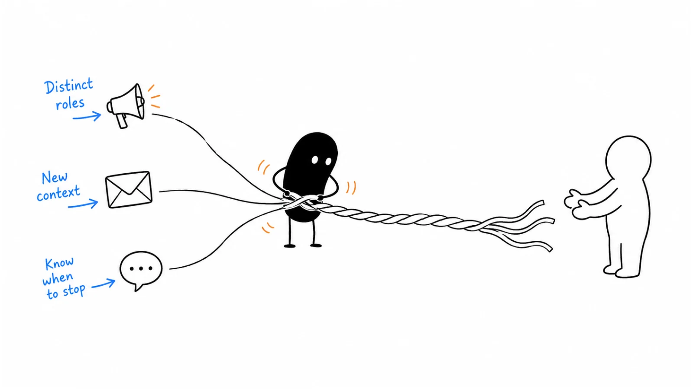

**Last reviewed:** 2026-09-10 · **Reading edit:** 2026-09-10

On Monday, a founder receives an email about speeding up security reviews. On Tuesday, a sales rep calls to ask whether the founder saw it. On Wednesday, someone else from the same company sends a LinkedIn message offering a quick introduction.

The founder replies to the email: “Our security lead handles this. We are not evaluating anything until November.”

On Thursday, the sequence sends: “Have you had a chance to think about my offer?”

There were three channels. There was still only one repeated pitch, and nobody seemed to be listening.

A multichannel sequence is a coordinated plan for approaching an account through more than one appropriate route. Its purpose is to make a useful conversation possible—not to make the same person harder to escape. The coordination matters more than the number of channels.

Sometimes a call resolves a question that would take several emails. Sometimes a written example is easier to share internally than a live explanation. Sometimes the buyer asks to continue on LinkedIn because that is where the conversation began. Those are useful reasons to change channels.

“Email did not work, so try everywhere else” is not enough on its own.

This guide shows how to choose the smallest useful combination, connect the messages, and change the plan when a person responds. It is an editorial operating method, not a universal cadence or permission to contact someone.



*Reading guide: define one conversation → give each channel a job → coordinate ownership → branch on responses → stop correctly → review the account outcome.*

Already have a sequence? Start with [the rewrite](#from-repetition-to-a-connected-conversation). Need to make it safe to operate? Read [the state rules](#make-the-sequence-respond-to-the-buyer). The [worked example](#worked-example-illustrative) follows a fictional pilot from selection to review.

## Use this when

You can explain why a particular account might find the offer relevant, but there is a practical reason for using more than one channel.

You have a written message that works as a clear introduction, and you need to decide whether a call, referral, event conversation, or professional-network exchange adds something different.

Several people on your team can contact the same account. You need one shared plan so the founder, SDR, account executive, and partner manager do not accidentally run four separate approaches.

You want to learn whether an additional channel produces useful conversations at an acceptable cost. That means observing what changes at the account, not merely celebrating a larger activity total.

You can also use the coordination method for an invited follow-up. The actual message should answer the request, however; someone who asked for your comparison sheet does not need to start at step one of a cold campaign.

## Do not use this when

The underlying offer is unclear. Repeating a confusing proposition on a phone call does not make it more relevant.

You have no reliable way to receive replies, reconcile contact records, or cancel pending work. Fix those operating gaps before adding channels.

A current customer, partner, or active opportunity already has an owner and an agreed conversation. Check with that owner rather than treating the company as an untouched prospect.

A recipient has declined the approach and the plan is to find a less visible route around that decision. A different sender, domain, profile, or colleague is not a reset button.

The proposed channel depends on unreviewed data, prohibited automation, deceptive identity, or a permission assumption nobody can explain. A contact appearing in a tool is not approval to use every field in the record.

If your actual question is whether buyers understand and value the offer, start with [message-market fit](https://b2-b-playbook.mintlify.app/playbooks/05-outbound-and-prospecting/message-market-fit). If the first email itself is the problem, start with [cold email](https://b2-b-playbook.mintlify.app/playbooks/05-outbound-and-prospecting/cold-email).

## Sequence design

A calendar tells the operator when a task is due. It does not tell them whether the task still makes sense.

A useful sequence needs both a default path and a way to leave that path. Write the default for a person who has not responded. Then write the response rules before enrolling anyone.

Start with one sentence:

> We want to learn whether the person responsible for security-questionnaire answers needs a clearer way to review ownership and freshness before the next enterprise deal.

This is a fictional teaching example. The problem is still a hypothesis. It does not claim that a specific company has stale answers, an urgent deal, or budget.

Now identify what is missing. Is the question whether this work exists, who owns it, whether the current process is adequate, or whether someone wants to see an example? Those are different uncertainties. They may need different actions.

| Decision to help with | Possible next action | What would change the plan |
|---|---|---|
| Is the work relevant? | A clear first email explaining the task and offer | A correction, objection, or request for information |
| Who owns this work? | An appropriate live call or an authorized introduction | A confirmed owner or a request not to continue |
| Would an example help? | Send the relevant artifact when requested | A question about fit, a limitation, or no further interest |
| Is a conversation worth having? | Agree a bounded discussion around the buyer's question | A named participant, agenda, and accepted next step |
| Is there a reason to continue now? | Review the evidence and either proceed or end the attempt | A specific buyer instruction or genuinely changed context |

These are decisions, not five mandatory touches. One reply may resolve three of them. Another account may receive one message and no further approach.

The plan should make shortening the sequence normal. If a recipient gives a clear answer after the first touch, completing every scheduled step would be a failure of coordination.

### What counts as something new?

New does not have to mean a new company fact in every message.

A follow-up can repeat enough context to be understood. “I help security teams review answer ownership” may still be the clearest explanation of what you do. You do not need to invent another trigger to avoid repeating that sentence.

The useful difference might be a concrete example, a narrower question, a relevant limitation, or a response to what the person said. It might also be a channel that fits the job better: a requested written summary after a call.

By contrast, changing “checking in” to “circling back” changes almost nothing for the buyer.

Ask: if the recipient sees both messages together, can they understand why the second one exists? If the only explanation is that three days passed, reconsider the task.

## Channel roles

Choose channels for the job and the relationship. Do not select them merely because your subscription includes them.

### Email: make the idea easy to inspect and share

Email is useful when the person needs to understand a specific offer, read an example, or forward context to a colleague.

Give enough information to make the message meaningful without opening an attachment or accepting a meeting. If you promise a sample, know which sample you will send and what it actually demonstrates.

A written follow-up after a call can record the question, the boundary, and the next step. “You asked whether answer owners can approve changes before export; here is the example” is more useful than replaying the entire first pitch.

Do not assume that delivery, an open, or a click means someone wants another channel added. These are different observations from an explicit request.

### Phone: resolve a question through conversation

A live call can clarify responsibility, test an assumption, or answer a question while the person is present.

The reason for calling should stand alone. “I sent you an email” explains your activity; it does not explain why the recipient should care.

For the questionnaire example, the question might be who reviews answer ownership before a completed response goes back to a customer. That is more specific than asking to speak to “whoever handles technology.”

Be clear about your identity and commercial purpose. If the person says the topic is not relevant, do not convert every answer into a new objection-handling exercise.

Choose an appropriate business contact route, and review the applicable calling rules first. A live call, an automated recorded call, and a voicemail are not interchangeable categories.

### LinkedIn: use the professional context honestly

LinkedIn may be a reasonable place for a conversation that genuinely belongs there: a reply to a relevant public discussion, a message within an existing relationship, or a follow-up the recipient requested.

A connection acceptance does not establish buying intent or permission for every other channel. A profile view does not establish that the person read your offer. Do not write “Following our conversation” when the only interaction was a connection request.

You can contribute to a public discussion without enrolling its author in a campaign. Read what they are saying and add something that belongs in the discussion; a scripted compliment followed by a pitch is not a meaningful contribution.

LinkedIn prohibits unauthorized automation and scraping, including bots that send messages or manufacture engagement. A vendor describing its tool as multichannel does not establish that its LinkedIn features are permitted. Review the actual method against [LinkedIn's rules](https://www.linkedin.com/help/linkedin/answer/a1341387/prohibited-software-and-extensions?lang=en&ref=b2b-playbook).

### Partners and referrals: preserve the relationship

An introduction can supply context that a cold message lacks. It also places someone else's reputation in the conversation.

Ask the relationship owner whether an introduction is appropriate. Give them a short description they can inspect and choose to forward. Do not supply a message that falsely suggests they have used the product or personally recommend it.

If someone says “Morgan owns that,” you have learned something about responsibility. You have not necessarily received an endorsement, an introduction, or Morgan's permission. Record the exact scope and review the route before acting.

An actual introduction changes the workflow. Continue that conversation; do not leave an unrelated cold sequence running underneath it.

### Events: follow the conversation that happened

An event can provide a bounded reason to speak. The useful context is what the person actually asked about, not simply that their badge was scanned.

If a buyer asked for a sample after a discussion at a booth, send the sample and remind them of the relevant question. If they attended a session but never spoke to you, do not pretend you met.

An attendee list and a personal invitation are different things. Review the source and permitted use of the data. Do not treat event participation as unlimited permission to email, call, message, and retarget.

A proposed event meeting should also be realistic. State the topic and available format; do not create false scarcity or imply the recipient already agreed.

### Direct mail: make the cost and context worthwhile

A physical item is rarely the first thing a small team needs to add. It introduces fulfillment, address handling, expense, and possible gift-policy concerns.

Use it only when there is a credible reason the format helps. A requested printed workshop pack might be useful. A generic gift sent to a personal address may create an entirely different reaction.

Check business-address appropriateness, organizational policies, and the recipient's preferences. Never imply that accepting an item creates an obligation to take a meeting.

The same coordination rule applies: an item queued for shipping should not go out after the owner learns that the approach must stop, if fulfillment can still be cancelled.

<a id="operating-method"></a>

## How to do it

### Step 1: write one account brief

Before choosing a cadence, write down the account, the work you think matters, the person or role you intend to approach, the evidence, and the uncertainty.

Separate facts from interpretation. A job listing for an enterprise sales role is a fact if you checked it. “Security questionnaires are delaying their pipeline” remains a hypothesis unless you have evidence for that claim.

Record current relationships and relevant restrictions next to the hypothesis. A technically suitable account may still be inappropriate for this campaign because a colleague is already handling it.

Choose a small desired decision: confirm the owner, request an example, or agree to discuss a particular workflow. “Create pipeline” is your business objective, not a concrete next decision the recipient can make from one message.

The brief should survive a handoff. Another operator should be able to understand the approach without reading ten disconnected activity notes.

### Step 2: choose the minimum useful route

For each proposed channel, finish this sentence:

> We need this channel because it helps the recipient or operator do ______, which the current route does not handle well.

“Resolve ownership in a live conversation” can be a reason. “Get another touch in” is an activity target.

You may choose email alone for the first batch. You may start with an existing professional conversation and move to email only when the person asks for material. You may decide not to use phone because you cannot verify an appropriate number.

There is no requirement to use email, phone, and LinkedIn together. Two well-coordinated channels can be sufficient. One appropriate channel can be sufficient.

Before approving the combination, distinguish channel rules from your operating preferences. Your chosen maximum number of attempts is an internal limit, not a legal entitlement to make those attempts.

For example, UK ICO guidance distinguishes live calls, automated calls, electronic mail, and subscriber types. Live B2B calls generally require checking TPS, CTPS, and previous objections; social direct messages and voicemail can fall within electronic-mail rules. Personal-data duties still matter in business contexts. The ICO flags this guidance as under review. Have a qualified owner assess the actual audience and method using its [B2B marketing guidance](https://ico.org.uk/for-organisations/direct-marketing-and-privacy-and-electronic-communications/business-to-business-marketing/?ref=b2b-playbook), rather than assuming one channel's permission carries across to another.

This example is UK-specific. Review other jurisdictions separately.

### Step 3: write the default path and its branches

Define a bounded path for an account that remains eligible and has not responded. Then define the alternatives for the responses you expect.

A plan might allow a first email, a later reviewed call task where appropriate, and an optional final written example if it genuinely helps. It should also allow no call, no further email, an immediate answer to a question, or a pause requested by the buyer.

Use a calendar to organize capacity, not to override those branches.

For each task, record the earliest appropriate window, the latest useful window, and what must still be true when it runs. If an event is over, a meeting invitation tied to that event may no longer make sense. If the person has replied, a scheduled cold follow-up no longer makes sense.

Give work an expiry. A missed task should return for review rather than automatically spilling into the next available hour.

### Step 4: assign one coordinating owner

The coordinating owner does not have to perform every action. They are responsible for keeping the account's plan coherent.

They should know who sent the first message, who can see replies, who is allowed to call, and who is responsible for a referral. If the founder adds a personal note, that is part of the same account history—not an invisible parallel effort.

Use one authoritative record for the current state. Other tools may hold tasks, messages, and activity details, but they should not independently decide that an account is still active after the owner has stopped it.

A lean setup can be a controlled shared record and a small manual queue. A sophisticated stack can still fail if nobody knows which field wins when systems disagree.

Document what happens if the owner is unavailable. Route incoming replies to a named backup, pause unattended queues, or both. “Someone will notice” is not a dependable handoff.

### Step 5: test interruption before testing scale

Create internal test records and exercise the difficult paths before any external enrollment.

Have a colleague reply to the test email while a phone task is pending. Check whether the task disappears or is visibly blocked. Test an opt-out, an out-of-office reply, a wrong-person correction, and a manual stop entered outside the sending tool.

Also test the failure case: temporarily unavailable synchronization, duplicate contact records, or a task that has already been opened by another operator.

The goal is not a perfect demo of your automation. It is to discover whether someone could still act on stale information.

If a stop cannot propagate reliably, reduce the workflow to a controllable manual process or pause that route. Do not compensate by asking recipients to repeat their instruction in several systems.

### Step 6: review a small batch as a whole

Inspect accounts from first action through final state. Do not review email in one meeting, calls in another, and LinkedIn activity in a third without reconciling them.

Read the actual exchanges. A positive-sounding reply may be a polite refusal. A short correction may be valuable evidence that your account hypothesis was wrong.

Look at whether the second channel served its stated purpose. Did it establish ownership? Resolve a question? Support a requested next step? Or did it simply add attempts to people who never engaged?

Keep the batch small enough to inspect those details. If you do not have time to read replies and correct the plan, you do not have capacity to enroll more accounts.

## From repetition to a connected conversation

The following messages are fictional teaching excerpts. They are not ready-to-send campaign assets: actual sender details, required disclosures, contact permissions, and opt-out handling must be reviewed for the real situation.

### The version that feels like pressure

First email:

> We help security teams save time. Would you be open to a quick call?

Phone task:

> Ask whether they saw the email. Try to book a demo.

LinkedIn message:

> Just making sure my email did not get buried. Do you have fifteen minutes?

Final email:

> I have reached out a few times. Is improving efficiency not a priority?

Each step asks for the same outcome while providing little additional reason to consider it. The final message also makes an unsupported judgment about the recipient's priorities.

The problem is not simply that the copy lacks personalization. The plan has no useful response to uncertainty other than more pressure.

### A version with distinct jobs

Suppose the fictional sender offers a workspace for reviewing reusable questionnaire answers. The relevant question is whether ownership and freshness are difficult to check before reuse.

First-email body:

> I work on a workspace for reviewing reusable security-questionnaire answers. It lets a team see the answer owner and review date before reusing a response.
>
> Does reviewing those answers sit with your security team, or somewhere else? I can share a short example if this is relevant.

This describes the work and gives the person a way to correct the seat. It does not assert that their process is broken.

A later live-call opening, only where the route is appropriate and the account still qualifies:

> Hi, I'm Alex from the questionnaire-workspace team. This is a sales call about reviewing reusable security answers. Is now a bad time for a brief question about who owns that review?

If the person agrees to the question, ask it. If they decline, handle that answer. Do not disguise the commercial purpose as independent research.

If they say, “I own it; email me the example,” the next email should do exactly that:

> You asked to see how the review works. The example shows an answer owner, its last review date, and what a teammate sees before reusing it.
>
> It does not prove the answer is accurate; someone still has to review the underlying claim. Would this fit the way your team checks answers today?

Now the written artifact supports a real question. The sender is not repeating an invitation to a generic demo.

Where is LinkedIn in this version? It may not be needed. Omitting an unnecessary channel is a legitimate design choice.

### Keeping the story consistent without copying every sentence

The product description should not change between channels. Neither should the claimed capability, the current uncertainty, or the person responsible for the next step.

The form can change. A phone opening needs to work aloud. An email can include a link to the requested example. A professional-network message may refer to a relevant discussion already taking place.

Imagine the recipient forwards all three messages to a colleague. They should tell a consistent story about who you are, what you offer, and why you approached them.

If the email presents you as a seller, the phone call presents you as a researcher, and the LinkedIn message implies you are a personal connection, the sequence needs to be rewritten.

## Make the sequence respond to the buyer

A state is a plain description of what should happen next. You do not need elaborate software to use one, but you do need meanings everyone understands.

| Current state | What it means | Operator action |
|---|---|---|
| Ready | The approach passed review; no task has started | Confirm current eligibility before the first action |
| Active | The bounded no-response plan is running | Recheck replies and restrictions before each task |
| Human review | A reply, data issue, or ambiguous event needs interpretation | Pause automated prospecting and assign an owner |
| Conversation | A person is discussing the subject | Cancel the cold path; respond to the actual exchange |
| Paused | There is a specific reason not to act now | Record the reason and a review condition |
| Stopped | This attempt must not continue | Cancel pending prospecting and apply the relevant suppression |
| Complete | The bounded attempt ended without a continuing conversation | Record the outcome; do not auto-enroll again |

These are suggested operating labels, not a required CRM schema. If your system uses different names, keep the behavior clear.

“Paused” should not mean “send again in thirty days because we need a date.” It might mean reviewing an explicit request in November, waiting for an owner to check a restriction, or investigating a delivery problem. Each has a different restart condition.

“Complete” is not “qualified.” It can simply mean the team reached its planned stopping point without enough evidence to continue.

### A human reply leaves the cold path

A response creates a new situation. Pause the scheduled prospecting tasks while someone interprets it.

If the reply asks a product question, answer it. If it corrects the premise, update the record. If it requests a stop, apply that instruction. Do not leave the person waiting for a relevant answer while the next generic follow-up goes out.

A conversation can have its own agreed next steps. Cancelling the cold path does not mean refusing to reply to a willing buyer; it means replacing an uninformed schedule with the conversation actually happening.

A meeting booking also needs reconciliation. A person should not receive “Would you like to meet?” after accepting the invitation through a different channel.

### A timing reply is not an unlimited nurture subscription

“Contact me in November” can support a specific follow-up in that context, subject to the applicable rules and the scope of the request. It does not mean “send monthly content until November.”

Record what the person asked for, the relevant topic, the expected window, and the owner. When the window arrives, review the context rather than resuming at step four of an obsolete sequence.

“Not this quarter” is less specific. It may be a timing constraint, or a polite way to decline. Do not convert it into permission that was never given.

Where the intent is unclear, stop the automatic path and use judgment consistent with the person's words and your reviewed policy. Silence after an ambiguous answer does not resolve the ambiguity in your favor.

### Out-of-office, bounce, and wrong number are different events

An out-of-office message is not a human expression of interest. Pause or reschedule only under your defined policy; do not count it as a qualified reply.

An alternate contact in an automated absence message may be intended for urgent operational matters. Do not automatically enroll that person in the campaign.

A hard bounce means the route has a delivery problem. Suppress the invalid address and review the record. It is not a reason to guess several alternate addresses or immediately find a personal number.

A wrong number should lead to correcting or removing that route. Do not insist that the person on the line help you locate the intended recipient.

If one type of failure starts appearing across several records, pause the relevant batch and investigate the source. A shared data problem needs more than individual task retries.

<Accordion title="Three replies that should change the plan">

These exchanges are fictional examples of operating judgment, not scripts to apply regardless of context.

**A request for an artifact**

Buyer: “Can you send the example rather than booking a call?”

Operator: “Yes. I'll send the sample and explain what it does and does not show.”

Record: Conversation; requested sample; one named owner.

Queue: Cancel the cold follow-ups and send the requested material through the agreed route.

**A corrected buying seat**

Buyer: “I don't own security reviews. Morgan does.”

Operator: “Thanks for correcting that. I'll update my notes.”

Record: Seat information supplied; no endorsement or permission invented.

Queue: Stop this person's cold path. Review whether a separate approach or an actual introduction is appropriate before contacting Morgan.

**A clear stop**

Buyer: “Please stop contacting me.”

Operator action: Apply the instruction and record its scope promptly.

Record: Stopped; suppression synchronized to relevant systems.

Queue: Cancel pending messages, calls, and other prospecting tasks covered by the instruction. Do not switch channels to continue the same approach.

</Accordion>

## Coordinate people, not just tools

An account is not a single inbox. Several people may have legitimate roles in an evaluation. That does not mean every role should receive the same campaign at the same time.

If the security lead is discussing answer approval with you, a separate message to the founder asking “Who handles security?” makes the team look disconnected.

Start from the open question. You may need the security owner to explain review policy, an operations lead to explain the workflow, and procurement later to explain purchasing. Approach those roles when the conversation calls for them and through appropriate routes.

Where possible, ask the engaged person how they want colleagues involved. Do not present them as a sponsor unless they actually agreed to that role.

Keep person-level and account-level decisions distinct. A person's channel preference is not automatically an account-wide prohibition. Conversely, a request to stop approaching the company must not be reduced to one email address because that is the only field your tool supports.

When scope is ambiguous, pause affected prospecting for review. Do not exploit ambiguity to keep the queue moving.

### Make duplicate prevention visible

A duplicate can appear as a work address, an alias, a profile, and a contact imported from an event. Four records may still describe one person.

Before enrollment, check existing identifiers and relationships. Use reviewed matching rules rather than confidently merging different people who share a name.

Before executing a task, display the recent account history and the current owner. The operator should not need to open five systems to discover that a colleague spoke with the buyer yesterday.

Do not solve deduplication by retaining every piece of personal data indefinitely. Agree appropriate data minimization, access, retention, and suppression practices with the responsible owner.

### Keep suppression stronger than the schedule

For this operating method, a stop instruction should block affected prospecting before the next action runs, including manual tasks. That is a workflow recommendation; it does not replace the particular legal requirements that apply.

For US commercial email, the FTC's CAN-SPAM guide covers B2B messages as well as bulk campaigns. It specifies truthful identification, required sender information and opt-out handling, including honoring opt-outs within ten business days. Outsourcing does not remove responsibility. See the [FTC compliance guide](https://www.ftc.gov/business-guidance/resources/can-spam-act-compliance-guide-business?ref=b2b-playbook) for the full requirements. This is not a global permission framework or a reason to wait until the deadline when you can stop sooner.

The difficult case is often a stale task. A rep opened the call list before an opt-out arrived; the CRM updated, but the screen did not. Build a fresh eligibility check into execution, not just list creation.

If a task escapes after a stop, contain the failure: pause the affected workflow, record what happened, correct the source of the mismatch, and review any required response with the responsible owner. Do not keep sending apology messages as a way to extend the unwanted conversation.

## Timing and workload

There is no universally correct gap between email and phone. The useful window depends on the context, channel, recipient, and capacity to respond.

A requested document may be due promptly. A cold follow-up may warrant a longer review window—or may not be appropriate at all. A dated event invitation has a natural expiry. A buyer who asked to revisit later has supplied a different timing signal from someone who said nothing.

Use business hours and verified time zones where relevant. Do not assume a phone area code tells you where someone currently works.

Account for holidays, absences, and your own availability. If the responsible rep is away next week, a batch that creates replies next week may be badly timed even if the sending calendar has space.

### Do not catch up by compressing the queue

Suppose a call task was due on Tuesday but the operator could not complete it. On Wednesday, the software now shows the call plus an email follow-up.

Executing both immediately may turn a spaced plan into a burst the team never intended.

Review the remaining path. Move or remove tasks, check whether the context is still useful, and retain the stopping point. The recipient should not experience extra pressure because your team missed its schedule.

Set capacity in terms of work you can complete responsibly: research, appropriate attempts, reply review, requested artifacts, and record updates. Sending is only part of the workload.

### A small planning calculation

Imagine one operator has six hours available for a pilot. They reserve two hours for responding to people and resolving exceptions. Four hours remain for account review and planned actions.

If preparation and execution take an assumed twelve minutes per account, that gives a planning capacity of twenty accounts: 240 minutes divided by twelve.

This is a made-up budgeting example, not a productivity benchmark. Calls can run longer; a requested artifact can take an hour; a data issue can stop the batch.

If replies use the reserve faster than expected, reduce new enrollment. A useful conversation is not an interruption to the campaign—it is part of the work the campaign exists to create.

## Copyable template

Use these three blocks together. The first defines the attempt, the second specifies an action, and the third records an interruption. Keep personal data in your approved system rather than copying it into unrestricted documents.

### Account sequence brief

```text
ACCOUNT SEQUENCE BRIEF

Account / coordinating owner:
Existing relationship / account restrictions:
Business task we may help with:
Checked evidence and date:
What remains a hypothesis:
Person or role / why this seat:
Contact source and channel review:
Decision we want to make easier:
Minimum channels and each channel's job:
Bounded no-response path / final review point:
Reply owner and backup:
Authoritative state / suppression location:
What pauses the path:
What stops the path:
Condition for any future review:
```

### Task specification

```text
SEQUENCE TASK

Account / person / owner:
Current state:
Channel and approved contact route:
Purpose of this action:
Relevant previous exchange:
What this adds or clarifies:
Message or question:
Earliest appropriate window:
Expiry / missed-task handling:
Checks immediately before execution:
- Current reply and meeting status
- Restrictions and suppression
- Duplicate or parallel account activity
- Contact route and context still valid
Outcome to record:
Next action only if:
Cancel this task when:
```

### Reply and interruption record

```text
REPLY / INTERRUPTION

Account and contact:
Received through / time:
Exact relevant wording:
Human reply, automated event, or data issue:
What the person confirmed:
What remains unknown:
Instruction and scope:
New state:
Tasks cancelled or held:
Suppression updates and verification:
Requested response or agreed next step:
Responsible owner / due window:
Other account owners informed:
Restart condition, if any:
If scope or synchronization is uncertain:
Pause affected prospecting and assign a reviewer.
```

A completed template is a decision aid, not proof of compliance. The owner still needs to check the actual situation and applicable requirements.

## Worked example (illustrative)

Everything in this example is fictional: the product, accounts, actions, time budget, and results. It demonstrates recordkeeping and decisions, not expected campaign performance.

A small team sells the questionnaire-review workspace used earlier. They want to learn whether adding a limited, reviewed phone step helps establish ownership when the first email receives no response.

They are not testing every available channel. LinkedIn is excluded from the default path because the team cannot name a distinct job for it in this pilot. Requested conversations through another appropriate route would be handled separately.

### Selection and preparation

The team reviews thirty candidate accounts.

Five are excluded before any action: two have existing account conversations, one has an applicable suppression, and two lack a sufficiently reviewed contact route. Twenty-five remain eligible for the pilot.

Each has one initial contact. That gives twenty-five enrolled accounts and twenty-five initial contacts, not fifty prospects.

The team prepares a clear first email and a sample showing answer ownership and review date. They approve a phone task only for accounts with an appropriate, separately reviewed business number and no conflicting reply or restriction.

The bounded plan allows the first email, a reviewed phone attempt for a subset, and an optional useful email follow-up for accounts still eligible. A final internal review closes the attempt; a “breakup email” is not mandatory.

The timing is a local pilot choice, not a recommendation to use these gaps everywhere. No-response tasks are reviewed over two working weeks, with fresh eligibility checks before execution.

### What happens after the first email

All twenty-five accounts receive one first-email attempt.

Two messages hard-bounce. The team suppresses those addresses, pauses those two accounts for data review, and checks whether the source problem affects the rest of the batch before proceeding. Twenty-three messages have an accepted delivery status; that is not proof that a person read them.

Among those twenty-three accounts:

- Three people request the example.
- One person corrects the buying seat.
- One person asks to revisit in a specified later month.
- One person asks for no further contact.
- One automated absence reply arrives.
- Sixteen accounts produce no reply at that review point.

The arithmetic is 3 + 1 + 1 + 1 + 1 + 16 = 23.

The six human replies leave the cold path immediately. The three sample requests become conversations. The seat correction enters human review, the timing request becomes a bounded pause, and the stop request becomes a suppression. The automated absence is recorded separately and paused for review.

No positive reply is required for a task cancellation to count as correct behavior.

### What the phone step actually adds

Of the sixteen no-reply accounts, eight have a suitable reviewed phone route and a reason to test ownership live. The other eight do not receive a call.

The operator makes one attempt at each of those eight accounts.

Two calls connect. One person confirms ownership and asks for the sample. The other says the current process is adequate and asks not to continue. Six attempts produce no live conversation.

The first connected account moves to Conversation; the second moves to Stopped. Both leave the default path.

The phone step therefore contributed one requested example and one clear negative answer. It did not contribute eight conversations, and it did not prove that the person who requested the sample would never have replied by email.

### The remaining email follow-up

Fourteen accounts now remain in the no-reply group: the six unconnected call accounts plus the eight accounts that were not called.

The owner reviews all fourteen again. For this fictional pilot, each still qualifies for one useful written follow-up describing the sample more concretely. No false urgency or complaint about the lack of response is added.

One person replies with a product question. Thirteen remain silent through the closing review point.

The product question becomes a conversation. The other thirteen are marked Complete for this attempt, with no automatic enrollment into another sequence.

The team does not send a mandatory final message simply to announce that it will stop.

### Reconciling the totals

| Measure | Pilot result | Interpretation |
|---|---|---|
| Enrolled accounts | 25 | Includes the two accounts whose first email bounced |
| Scheduled prospecting attempts | 47 | 25 first emails + 8 calls + 14 email follow-ups |
| Accounts with a human response | 9 | 6 by first-email stage + 2 connected calls + 1 later email reply |
| Accounts with a sample request or product question | 5 | 3 first-email requests + 1 phone request + 1 later question |
| Accounts completing a discussion by review close | 2 | A later outcome within those five, not two extra accounts |
| Confirmed opportunities / sales | 0 / 0 | No invented pipeline or revenue |

The forty-seven attempts exclude replies and delivery of requested material. Those are recorded as conversation work, so the activity definition stays consistent.

The twenty-five accounts reconcile to five conversations, one seat review, one timing pause, two stops, one automated-absence pause, two data-review pauses, and thirteen completed silent attempts.

The account-level human-response rate is 9/25, or 36%. The sample-request-or-question rate is 5/25, or 20%. Those are arithmetic descriptions of this invented batch, not benchmarks to copy.

A useful report shows both counts and definitions. Calling all nine human responses “interested leads” would include a correction, a timing instruction, and people who asked the team to stop.

### What the team learns—and does not learn

Phone helped the operator resolve two accounts. One response was useful for continuing; the other was useful for stopping. The review should retain both.

The pilot cannot estimate the causal lift of adding phone. The called accounts were selected for route suitability, not randomly assigned; they may differ from the uncalled accounts in important ways. The sample is also small.

The team can conclude that the operating path was feasible in this limited setting and identify the work involved. They cannot claim a universal multichannel response rate, a revenue multiplier, or proof that three channels beat one.

For the next batch, they keep the narrow phone role, improve how the sample explains its limitations, and investigate why the contact source produced two bounces. They do not add LinkedIn merely because the software offers it.

## Metrics

Report account outcomes, channel activity, and operating reliability separately. Combining them into one engagement score hides too much.

### Start with a denominator someone can reconstruct

An account-level response rate uses distinct accounts in both the numerator and denominator. A contact-level response rate uses contacts. An attempt-level connection rate uses attempts.

All can answer useful questions, but they are not interchangeable.

State whether bounced accounts remain in your enrolled denominator, what observation window you use, and which responses count. Show exclusions rather than silently removing inconvenient records after the results arrive.

For example, a call connection is not the same as a qualified response. A live answer that says “wrong number” is a connected call but evidence that the contact route needs correction.

### Separate contribution from causation

A channel can contribute to the observed conversation without being proven to cause an incremental result.

Record what happened: the buyer requested an example during a call, replied to a follow-up email, or asked a question after an introduction. Do not split one account into three wins because three channels appeared in the history.

If you later run a comparison, define the question before enrollment. Keep audience, offer, observation window, and outcome definitions comparable. Consider account-level assignment when several contacts from the same company could influence one another, and check whether you have enough data to learn anything reliable.

A small non-random pilot is better treated as operating evidence than as a channel-ranking experiment.

### Measure the cost of coordination

Track preparation, attempted contact, live conversation, reply review, artifact production, and record maintenance. Include the people who resolve exceptions, not just the person pressing Send.

An additional channel may improve access but consume more attention from a scarce founder or specialist. That trade-off matters even when the software cost is small.

In the fictional pilot, suppose total operator time is nine hours and the team's planning rate is &#36;60 per hour. Add &#36;60 of directly allocated calling and sending cost. The estimated pilot operating cost is &#36;600: 9 × &#36;60 + &#36;60.

Dividing by five sample-request-or-question accounts gives &#36;120 per such account. Dividing by two completed discussions gives &#36;300 per discussion. Neither number is customer acquisition cost: there were no customers, and these are only the costs included in the stated pilot definition.

### Check whether stops actually work

Review the interval between an incoming instruction and the blocked next action, any tasks executed after a stop, duplicate account activity, and unresolved reply queues.

Report the incidents even if the overall reply rate looks good. A sequence that generates interest while repeatedly ignoring stop instructions is not ready to expand.

Set a clear rule for operational failures. A broken suppression connection, lost reply routing, or widespread data problem should trigger a pause and an assigned fix, not merely a note in the next monthly report.

<Accordion title="How to review a sequence that looks busy but produces little">

Start with the accounts, not the channel dashboard.

Read several complete histories, including silence, corrections, stops, and useful conversations. Can you explain why each account entered the batch? Did the messages describe the offer consistently? Did anyone act on information that was already out of date?

Next, inspect the extra channel's job. If every call asks whether an email arrived, there may be no independent reason for the call. If a LinkedIn task exists only to raise a touch count, remove it from the next test rather than polishing its greeting.

Then inspect the transition after a reply. A team can generate genuine interest and lose it by answering slowly, sending an irrelevant artifact, or asking the buyer to repeat everything in a generic discovery meeting.

Finally, check the capacity assumption. If one operator cannot keep the queue current, a smaller active batch may produce a better experience and clearer learning than adding automation to the same backlog.

Change the part for which you have evidence. Low results alone do not tell you whether the issue is account selection, the offer, the route, the timing, or the response handling.

</Accordion>

<a id="pre-flight-checklist"></a>

## Before you start

- [ ] One account hypothesis and desired buyer decision are clear.
- [ ] Facts, assumptions, existing relationships, and restrictions are separated.
- [ ] Each channel has a distinct job and an appropriate reviewed contact route.
- [ ] The plan allows channels and tasks to be omitted.
- [ ] Every action has an owner, a useful window, an expiry, and a fresh eligibility check.
- [ ] Human replies and meeting bookings cancel the obsolete cold path.
- [ ] Automated replies, wrong routes, and unclear instructions go to review.
- [ ] Suppression scope is recorded and applied across affected tools and manual tasks.
- [ ] Duplicate and parallel account activity are checked.
- [ ] A backup can handle replies while the main owner is unavailable.
- [ ] The no-response attempt has an ending; a final message is optional.
- [ ] Metrics distinguish accounts, contacts, attempts, human responses, and actual opportunities.
- [ ] The team has tested cancellation and failure paths before external enrollment.

You do not need a complex stack to satisfy this checklist. You need a bounded plan someone can understand and operate.

## Common mistakes

### Making every channel say the same thing

Some context will repeat. The mistake is giving the buyer no additional help while demanding another response.

Rewrite the task's purpose before rewriting its wording. If there is no useful purpose, delete the task.

### Treating a refusal as a routing challenge

A recipient declines on email, so the operator calls. They decline on the phone, so a different colleague messages them.

That is not channel orchestration. Apply the actual instruction and review scope when necessary; do not use a new route to continue an unwanted approach.

### Confusing a named colleague with an introduction

A person tells you who owns the work. The next message says, “Your colleague recommended we connect.”

That may overstate what happened. Preserve the exact evidence and be honest about whether a referral, introduction, or recommendation actually exists.

### Letting an AI-generated signal change the account state

An AI summary says “high interest” because a reply contains the word “interested,” while the full sentence says “not interested.”

Drafting and classification assistance can reduce work, but consequential or ambiguous changes need review. Preserve the relevant original wording, make uncertainty visible, and do not let an unverified summary override a stop instruction.

Use approved tools and data handling. Do not upload private conversation histories into an unreviewed service merely to improve personalization.

### Restarting the same campaign under a new name

The account completed one silent sequence, so it enters a renamed version next week.

Keep history attached to the account. A future review needs a legitimate reason and fresh eligibility checks, not simply an available slot in another campaign.

A new public signal does not erase an earlier objection. Revisit only within the applicable rules and the actual scope of prior instructions.

### Counting a larger activity total as a better buyer experience

More touches may mean more opportunity to learn. They may also mean repeated confusion or poor coordination.

Read the exchanges and inspect the outcomes. If the additional channel did not help a decision, did not improve a relevant outcome, and cost more work, there may be no reason to retain it.

## What to read next

Use [account research](https://b2-b-playbook.mintlify.app/playbooks/05-outbound-and-prospecting/account-research) to establish what you know before approaching the account. Use [buying signals](https://b2-b-playbook.mintlify.app/playbooks/05-outbound-and-prospecting/buying-signals) to separate a reason to investigate from permission or confirmed intent.

For the written first approach, read [cold email](https://b2-b-playbook.mintlify.app/playbooks/05-outbound-and-prospecting/cold-email). If the offer itself still produces confusion, return to [message-market fit](https://b2-b-playbook.mintlify.app/playbooks/05-outbound-and-prospecting/message-market-fit).

Next in this chapter is [SDR onboarding](https://b2-b-playbook.mintlify.app/playbooks/05-outbound-and-prospecting/sdr-onboarding): how to teach a new operator the judgment, task handling, and handoff behind the sequence. [Sales enablement](../02-product-marketing/sales-enablement.md) covers the material and context needed when a prospecting exchange becomes a real evaluation.

## Sources and evidence boundary

Primary guidance checked on September 10, 2026:

- [ICO: Business-to-business marketing](https://ico.org.uk/for-organisations/direct-marketing-and-privacy-and-electronic-communications/business-to-business-marketing/?ref=b2b-playbook) — UK channel and subscriber distinctions; the page states that its guidance is under review.
- [LinkedIn: Prohibited software and extensions](https://www.linkedin.com/help/linkedin/answer/a1341387/prohibited-software-and-extensions?lang=en&ref=b2b-playbook) — platform restrictions relevant to scraping and automated activity.
- [FTC: CAN-SPAM compliance guide](https://www.ftc.gov/business-guidance/resources/can-spam-act-compliance-guide-business?ref=b2b-playbook) — US commercial-email obligations, including opt-out handling.

The channel jobs, state labels, templates, timing choices, and fictional pilot are editorial teaching tools. These sources do not validate a recommended number of touches, a conversion benchmark, or the effectiveness of this sequence.

Review applicable law, platform rules, provider requirements, data use, and organizational policies with qualified owners before real outreach. This article is not legal advice and does not authorize contact with a particular person.

---

Copyright © 2026 Ivan Xu. All rights reserved. See the [copyright and reuse terms](https://github.com/weilun88313/B2B-Playbook/blob/main/LICENSE).

Canonical source: [github.com/weilun88313/B2B-Playbook](https://github.com/weilun88313/B2B-Playbook)
