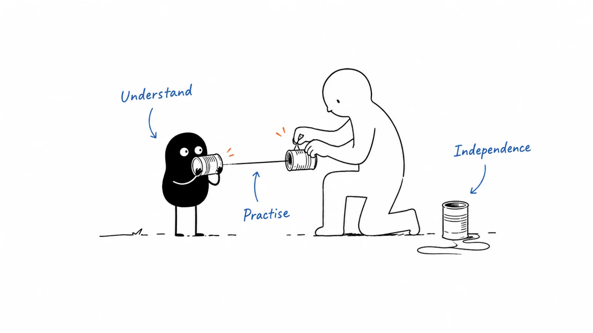

**Last reviewed:** 2026-09-10 · **Reading edit:** 2026-09-12

The new SDR has finished the product training, passed the quiz, and booked a first meeting.

Then the account executive opens the record.

There is no clear reason for the meeting. The contact thought they were receiving a sample, not joining a discovery call. A colleague is already talking to another person at the same company. The SDR is unsure whether the booking counts toward their target.

Nobody skipped a training slide. The training simply did not prepare them for this moment.

Sales development onboarding should help a person do the real work with increasing independence: understand the buyer, explain the offer accurately, choose an appropriate action, handle the response, and leave the next person with usable context.

Product knowledge matters. So do account ownership, contact restrictions, scheduling, recordkeeping, and knowing when to ask for help. These less glamorous parts determine whether a promising conversation survives the handoff.

A ramp calendar can organize that learning. It cannot establish readiness by itself. Being in week four is not evidence that someone can safely run a live sequence, and a slow first month does not tell you whether the issue is training, the assigned accounts, the offer, or the person's execution.

This guide builds an onboarding plan around observable work. It is an editorial operating method, not a universal quota, employment policy, or guarantee of time to productivity.



*Reading guide: define the role → teach the buyer's work → practise the complete workflow → review evidence → allow bounded independence → keep coaching.*

If you are preparing for a hire, start with [the role brief](#copy-job-before-day-one-fill). If a new rep knows the material but struggles in conversations, read [the practice loop](#practice-the-moment-not-the-whole-performance). The [worked example](#worked-example-illustrative) follows one fictional hire through a small supervised batch.

## Use this when

You are preparing for a first SDR or BDR and need to turn the founder's working knowledge into something another person can learn.

A new hire has experience with your CRM or engagement tool but not with your buyers, product boundaries, assignment rules, or definition of a useful handoff.

You have a training library, yet managers keep discovering the same gaps during live work. People can repeat the positioning statement but cannot answer a practical question without guessing.

SDRs and account executives disagree about meeting quality. You need a shared definition, examples, and a way to resolve disagreement rather than a recurring argument over whose number should change.

You are moving someone between inbound and outbound work, into a new segment, or onto a materially different offer. Prior experience may reduce some training needs without removing the need to learn the new context.

The same method can help a founder prepare for delegation before a hire exists. You do not need to build a large curriculum; start by documenting the decisions you repeatedly make in real conversations.

## Do not use this when

You are trying to make a new hire discover a sales motion that the company has not defined, while measuring them as if it already works.

A learning role can be legitimate. If that is the role, say so, provide support, and use appropriate expectations. Do not present an untested market as an established territory with a proven playbook.

You need to decide whether outbound belongs in your growth strategy. Start with [channel strategy](../04-channels-and-distribution/channel-strategy.md) and the evidence from your current selling work.

You need the mechanics of a particular message or sequence. Use [cold email](https://b2-b-playbook.mintlify.app/playbooks/05-outbound-and-prospecting/cold-email) and [multichannel sequence](https://b2-b-playbook.mintlify.app/playbooks/05-outbound-and-prospecting/multichannel-sequence); onboarding should teach people to apply those methods rather than invent a competing set of instructions.

You need employment terms, compensation-plan drafting, disciplinary procedures, or legal advice. This article helps explain and operationalize approved rules. It does not create those rules or determine an individual's employment outcome.

<a id="one-rule"></a>

## Keep this in mind

Define what the person needs to do before deciding what they need to read.

“Learn the product” is a topic. “Explain the relevant workflow, show one appropriate example, and avoid promising an unsupported integration” is an observable capability.

“Learn the CRM” is another topic. “Recognize that a colleague already owns the account, avoid duplicate outreach, and route the request correctly” is a task with a visible outcome.

The difference matters because a reading list can look complete while important work is still missing.

For each capability, identify the reference material, the exercise, the reviewer, and the evidence of readiness. Give the learner access to those expectations before assessing them.

Do not turn this into a test of memorizing every policy. Some information should be easy to recall during a conversation. Other information should be easy to find accurately. Knowing where to verify a product limitation or credit rule is often more useful than confidently remembering an old version.

## What an SDR needs to be able to do

This page uses SDR as a convenient label for a sales development role. BDR is another common title; companies divide responsibilities differently. The job description should make the actual scope clear rather than relying on the abbreviation.

An inbound role may spend more time understanding requests, routing them, and helping suitable buyers take the next step. An outbound role may spend more time selecting accounts, researching the work, and making an appropriate first approach. A mixed role needs an explicit way to prioritize the two.

Neither is simply “put meetings on the calendar.”

| Capability | Evidence you can observe | A gap worth addressing |
|---|---|---|
| Understand the buyer's work | Explains the task, current alternatives, and remaining uncertainty | Recites a persona description without understanding the workflow |
| Explain the offer accurately | Connects a relevant capability to the task and states its limits | Invents a result, integration, or product commitment |
| Choose an appropriate action | Checks ownership, context, contact route, and restrictions | Starts outreach because a record appeared in a list |
| Handle the response | Answers, clarifies, routes, pauses, or stops according to the situation | Treats every reply as a reason to book a meeting |
| Maintain a usable record | Separates confirmed facts from assumptions and names the next owner | Writes “interested” without evidence or a next step |
| Coordinate a handoff | Aligns buyer expectations, meeting purpose, and receiving owner | Transfers a calendar event without the conversation behind it |
| Learn from feedback | Changes the specific behavior and demonstrates it again | Completes training without changing the work |

These capabilities overlap. A good onboarding exercise often tests several at once.

For example, an inbound request about a product limitation tests product accuracy, request handling, escalation, and note quality. It does not need to become a meeting to count as a well-handled request.

<a id="operating-method"></a>

## How to do it

The steps below describe a preparation sequence, not a rigid timetable. Teach related skills together and revisit them through practice. The learner should see how the pieces connect before taking responsibility for live work.

<a id="step-1-write-the-job-before-day-one"></a>

### Step 1: Explain the role before day one

Prepare a short role brief covering purpose, scope, ownership, support, and expectations.

Start with the work. Is this person responding to explicit demo requests, researching named accounts, supporting event follow-up, or some combination? Which tasks remain with the founder, account executive, customer-success team, or marketing?

Write down the decisions they may make independently. They might choose between approved examples, correct a contact's job title, or propose an agenda. They may need approval before enrolling a new segment, using a new contact source, or making a nonstandard product claim.

Also define what they should not do. A prospecting role does not automatically include resolving support incidents, making security commitments, negotiating nonstandard pricing, or changing another rep's account ownership.

Name a manager and a backup. A new hire should know whom to contact when a buyer asks a difficult question and the usual coach is unavailable.

#### Prepare access and a place to practise

Make sure the necessary tools, references, calendars, and training records are ready. Missing access consumes learning time and can make a person look slow when the blocker belongs to the company.

Give access appropriate to the current work. A training account should not need permission to export the entire customer database or activate a large campaign.

Use a sandbox or clearly separated test records where possible. Label fictional contacts and prevent training exercises from sending real messages or invitations. If the tool cannot reliably separate test work, use an offline exercise until a safe practice route exists.

Do not ask the new hire to share credentials or use a colleague's personal account to get around provisioning delays.

#### Give the first week a manageable entry point

A welcome page should answer: What should I do first? Where is the current material? Who can help? What will we review together?

It should not open with seventy unexplained links.

Choose a few items that support the first exercise: the role brief, a buyer-workflow explanation, a current product example, and the ownership rules. Add detail when the learner has a task that needs it.

Explain the working arrangement and feedback process without making informal promises. If there is a career path, describe the current process and criteria; do not imply a guaranteed move into an account-executive role on a particular date unless that is an authorized commitment.

### Step 2: Teach the buyer's work before the product tour

A rep needs to understand what the buyer is trying to accomplish, not just which features your product has.

Use a concrete workflow. Who starts the work? What inputs do they need? Where does it get delayed or repeated? Who checks the result? What happens if the current method is good enough?

For the running fictional example, imagine a workspace that helps security teams review reusable questionnaire answers. The workflow includes finding a previous response, checking its owner and review date, confirming that it is still accurate, and returning the answer to a customer.

The product may make ownership and review status easier to inspect. It does not automatically establish that every answer is correct, remove the need for human review, or guarantee that a deal will close faster.

A new SDR should be able to explain those distinctions in ordinary language.

#### Teach alternatives and non-fit

Show the current alternatives: a shared document, a spreadsheet, a broader existing platform, or an internal process. Explain when they may be adequate.

This prevents the learner from treating every company using a spreadsheet as a problem account.

Ask them to describe a situation in which your product would not be a good next step. They might identify a team with little recurring questionnaire work, a required capability you do not support, or an existing process the buyer considers adequate.

A correct decision not to pursue is part of learning the role.

#### Separate claims by evidence

Give the learner a current approved explanation of the product, a small set of relevant examples, and a route for verifying uncertain claims.

A demo shows what the demo environment can do. A published customer case supports the specific reported outcome and context. A roadmap item is not a delivered capability. A buyer's question is not a confirmed requirement.

Practise saying, “I need to check that,” followed by a useful next step. For instance: “I can show how answer ownership appears in the sample. I need our technical owner to confirm whether your approval setup is supported.”

This is more useful than either guessing or abandoning the conversation.

Preserve the source and date of important claims. If a feature changes, update the reference and tell the team which explanation has changed.

<a id="step-2-put-the-number-in-writingincluding-the-ugly-parts"></a>
<a id="step-2-explain-targets-and-compensation"></a>

### Step 3: Explain targets and compensation

Teach expectations alongside the work that makes them possible.

Separate three things: the business outcome the team wants, the operational measures used to diagnose the work, and the formal rule used for compensation credit.

A company might track booked meetings, completed meetings, accepted handoffs, and opportunities. Those are different events. None should silently substitute for another in a training conversation.

Point to the current approved [compensation plan](../09-operations-pipeline-and-measurement/sales-compensation.md) and identify the owner who resolves questions. Onboarding should explain that plan, not create a second oral version.

#### Work through the ambiguous situations

Take a few examples and ask the learner to find the answer in the approved plan:

A meeting is booked this month but held next month. The buyer reschedules. The meeting is completed, but the account is outside the agreed segment. Two employees contributed to the same conversation. The receiving seller has not reviewed the handoff.

For each, distinguish what goes in the operational record from what the plan says about credit. If the policy does not answer the question, escalate it to the authorized owner rather than inventing an answer during training.

Do not change historical credit informally to make the dashboard look cleaner. Record facts accurately and resolve pay questions through the actual process.

This article does not recommend a particular payment trigger, clawback, ramp guarantee, or performance-improvement policy. Employment and pay decisions require the company's approved arrangements and qualified review.

#### Make the workload plausible

Ask the manager to demonstrate a realistic day or week: account review, appropriate outreach, live conversations, replies, learning, notes, and handoffs.

If the schedule assumes eight hours of activity plus two hours of training inside an eight-hour day, the plan does not fit. Change the work or the expectation rather than leaving the learner to absorb the conflict.

Activity counts can diagnose coverage or capacity. A dial is not inherently worthless, and a personalized email is not inherently useful. The interpretation depends on the quality of the selected account, the purpose of the action, and the outcome.

Avoid a universal ramp percentage just because a template contains one. The role, segment, lead flow, and training support may differ substantially from the template's assumptions.

Explain formal review processes using the approved policy. Do not frame coaching as a threat or invent a performance-improvement timetable in an onboarding worksheet.

<a id="step-3-crm-is-the-law-not-a-filing-cabinet"></a>
<a id="step-3-teach-the-crm-process"></a>

### Step 4: Teach the CRM process

Teach the record as a shared explanation of what is happening, not a collection of fields to fill for compliance with a manager's preference.

Start with ownership. Who is allowed to act on the account? What happens if a demo request arrives from a company already in an active opportunity? Who resolves a territory collision? What is the backup when an assigned person is absent?

Give examples that cross team boundaries. A new request might belong with support, a customer-success owner, a partner manager, or an existing account executive. Routing it correctly may be more valuable than adding it to the SDR queue.

Then explain the states and next actions. A label such as “Working” can be perfectly usable if everyone knows what it means, who owns it, and what should happen next. The label itself is not the problem; an indefinite state with no owner or next step is.

#### Teach confirmed facts and unknowns separately

A record saying “interested in demo” should contain the evidence behind that statement.

Did the person ask for a demonstration? Agree to discuss a specific question? Download a document? Or merely reply that somebody else owns the work?

Those observations should not all produce the same summary.

Allow an explicit Unknown where the information is not yet established. Do not train people to invent budget, authority, timing, or pain simply because the form requires a value.

If required fields force unsupported certainty, the manager and operations owner need to fix the workflow. That is not a copywriting problem for the new hire.

#### Practise exceptions in the actual working view

Use test records to practise a duplicate, a wrong contact, a reply in another channel, a reschedule, an opt-out, and a request received while the owner is away.

Ask the learner to show the outcome, not merely say what they would do. Can they stop pending tasks, update the authoritative record, and check that the change reached the relevant tool?

Include a stale-task scenario: the call list was opened before a stop instruction arrived. The learner should recheck current eligibility before acting rather than relying on yesterday's export.

Explain which fields they may change and which require an operations owner. Do not teach bulk editing, data export, or new automation before there is a justified need and appropriate access.

<a id="step-4-the-meeting-is-the-producttrain-the-last-mile-first"></a>
<a id="step-4-practise-qualifying-and-handing-over-a-meeting"></a>

### Step 5: Practise qualifying and handing over a meeting

A useful meeting has a reason both sides understand. The exact qualification threshold depends on the motion, but it should be explicit and shared.

For an early conversation, you might need a relevant business task, a plausible account fit, an appropriate participant, and agreement about the discussion. You may not yet know budget, purchasing process, or an implementation date.

For a more mature sales motion, additional criteria may be necessary. Write them down and explain why they matter. Do not borrow an enterprise qualification checklist and force every early-stage buyer through it before answering a simple question.

An SDR should distinguish between a reason to continue and evidence that a commercial opportunity exists. A sample request can justify sending a sample without justifying a pipeline amount.

#### Ask for a meeting that matches the conversation

If the person wants written information, provide the appropriate information. Do not turn every request into a mandatory discovery call.

When a meeting is useful, agree the purpose before the time. “Review how your team checks answer ownership” is an agenda. “Quick chat” leaves more for the buyer and receiving seller to reconstruct.

Offer scheduling options that fit the situation. A calendar link may be convenient; specific times may be clearer. Confirm the time zone and the intended participants.

Send a readable invitation with the agreed purpose, duration, meeting link, and host. Follow the team's approved reminder practice and the recipient's preferences. A separate day-before confirmation is not a universal requirement, nor does its absence mean the meeting never existed.

#### Transfer the question, not just the event

The receiving seller needs to know who is attending, why the conversation is happening, what the buyer said, what remains unknown, and what was promised.

A useful note might say:

> Security lead asked to inspect how an answer owner and review date appear before reuse. They currently use a shared document. They have not said that the process is failing. Sample sent as requested; no integration or time-saving claim made. Next conversation is a walkthrough of that review step. Budget and procurement process are unknown.

This gives the seller a starting point without pretending that discovery has already happened.

Make the receiving owner explicit. A record reassignment, an invitation, and a briefing may all be necessary in your setup. Verify that the owner received the context and knows what they need to do.

The SDR should also know what happens if the seller is unavailable, declines the handoff, or does not review it in the agreed window.

#### Resolve quality disagreements with evidence

Ask the SDR and account executive to assess the same sample records before the new hire starts live work.

One record might contain a clear task and an agreed discussion but no budget. Another might contain a prestigious company name and an accepted invitation but no understood purpose. Discuss which meets the actual threshold and why.

After live meetings, use specific rejection or rework reasons. “Bad lead” does not teach anything. “The contact asked only for a document, but the invitation implied an evaluation meeting” identifies a correctable mismatch.

A seller discovering new disqualifying information during a meeting does not automatically mean the SDR performed badly. Ask whether that information was available, reasonably discoverable, and part of the agreed pre-meeting standard.

Conversely, a deal eventually closing does not excuse misleading promises made to obtain the first meeting.

#### Handle reschedules and no-shows without inventing outcomes

Record the real meeting state. A reschedule is not a second new meeting. A future meeting should not count as a no-show because your report closed before its date.

If someone misses a meeting, check the invitation, time zone, host attendance, and any message from the buyer before interpreting the event.

Use the team's bounded recovery practice where appropriate. Do not assume a missed appointment authorizes a new multichannel campaign.

If the company misses the meeting, acknowledge and correct that failure through the appropriate owner. It should not be recorded as the buyer failing to attend.

<a id="step-5-then-teach-how-they-create-the-conversation"></a>
<a id="step-5-teach-how-to-start-conversations"></a>

### Step 6: Teach how to start conversations

Once the learner understands the whole workflow, practise the entry points they will actually handle.

Do not introduce every channel and segment at once. Choose a bounded scope and expand it when the person can demonstrate the relevant judgment.

An experienced rep may move quickly through tool basics while needing more practice with your product boundaries. A new rep may need more support with conversation structure and recordkeeping. The plan should reflect the gap rather than the job title alone.

#### Inbound: respond to the request in front of you

A demo request, a pricing question, an event follow-up, and a support problem are different starting points.

Read the request before applying a qualification script. A buyer asking whether you support a required feature should not have to complete a general discovery exercise before learning that the feature is unavailable.

Practise identifying the request, checking the existing relationship, answering what can be answered, and routing the rest.

Response-time expectations should specify coverage hours, assignment, and backup handling. If marketing promises a reply window that the team cannot staff, the manager needs to resolve it. Do not quietly make the new hire responsible for permanent after-hours coverage.

#### Outbound: connect evidence to a reasonable question

Use [account research](https://b2-b-playbook.mintlify.app/playbooks/05-outbound-and-prospecting/account-research) to distinguish known account facts from hypotheses. A current job listing may suggest a relevant workflow; it does not prove a budget or a painful problem.

Ask the learner to explain why the account belongs in the batch and why the proposed role is a reasonable starting point. Then review whether the contact route and planned use are appropriate.

Have them write a clear message that describes the work and offer without fabricated familiarity or unsupported claims. Practise saying it aloud if calling is part of the role.

Teach the cancellation and reply-handling paths before increasing volume. The same person who can personalize an opening should be able to stop an approach when the premise is corrected or the recipient declines.

Use the current [multichannel sequence](https://b2-b-playbook.mintlify.app/playbooks/05-outbound-and-prospecting/multichannel-sequence) as the operating reference. A new channel needs a job and its own review; it is not a reward for finishing a training module.

#### Teach tools after the purpose is clear

The engagement platform should help execute the reviewed plan. Show how to inspect upcoming tasks, see replies, pause a record, and identify failed synchronization.

Do not equate tool access with approval to use every feature. Recording, enrichment, AI assistance, exports, and automated outreach each need the appropriate organizational review and controls.

A learner should know where to report a problem and what work to pause while it is unresolved.

<a id="step-6-show-them-how-the-company-will-look-at-them"></a>
<a id="step-6-explain-coaching-and-performance-reviews"></a>

### Step 7: Explain coaching and performance reviews

Tell the learner what a normal coaching session looks like before the first one.

Choose a small number of complete examples: an account that was correctly excluded, a conversation that progressed, and a reply that required a pause or correction. Review the decisions, not just the activity summary.

Ask the learner to describe what they thought was happening, what evidence they used, and what they would change. Then compare that explanation with the record and the actual exchange.

Give specific feedback. “Be more confident” leaves the learner guessing. “State the commercial purpose before asking the ownership question” identifies an action they can practise.

Keep developmental feedback distinct from formal employment decisions. Use the company's approved processes, qualified owners, and appropriate confidentiality for the latter. This playbook is not an individual performance assessment.

#### Make the manager's work visible

The manager should prepare examples, attend agreed practice sessions, review early work, and close unresolved policy questions.

If the reviewer is repeatedly unavailable, the learner cannot produce evidence of readiness on schedule. Record that as a support constraint rather than treating the elapsed time as a capability gap.

A buddy can help with practical questions and navigating the company. They should not become the unofficial owner of compensation rules, product commitments, or disputed certification decisions.

GitLab's public [sales-development handbook](https://handbook.gitlab.com/handbook/sales/sales-development/?ref=b2b-playbook) provides a useful organizational example: it separates general onboarding, role-specific work, training, and manager responsibilities. Its particular programs and timelines belong to GitLab. They are not evidence that another company should copy its ramp duration or quota.

<a id="step-7-ramp-is-a-calendar-not-a-vibe"></a>
<a id="step-7-set-a-dated-ramp-plan"></a>

### Step 8: Set a dated ramp plan with readiness gates

Put the learning and reviews on a calendar, but make increased responsibility depend on demonstrated capability.

For each stage, record what the person can do, what still needs review, the evidence required, and who decides. The possible outcomes should include ready for this scope, ready with named support, and needs another practice cycle.

A failed exercise should lead to an explanation and a targeted retry. It should not be a mysterious score followed by another week of the same reading.

Use a different but comparable scenario for the retry. Repeating an answer the coach just supplied is not the same as applying the principle.

If the scope changes—new segment, new channel, different product, or more complex account ownership—review the relevant capabilities again. Prior certification does not make every future workflow familiar.

## A ramp plan you can adapt

The following is an illustrative four-stage plan. It is not a claim that every SDR should be fully productive by day thirty, sixty, or ninety.

Place the stages on dates that reflect the role, prior experience, access readiness, coaching availability, and actual supply of suitable work.

| Stage | Main work | Evidence before expanding scope |
|---|---|---|
| Orientation | Learn the buyer workflow, offer boundaries, role, and current rules | Explain a use case and non-fit case; find the correct owner and policy |
| Rehearsal | Work through test records, replies, scheduling, and handoffs | Complete the workflow accurately, including a stop or exception |
| Supervised live work | Handle a small approved slice with available review | Maintain truthful context, appropriate actions, and reliable next steps |
| Bounded independence | Run the certified slice with sampled review and escalation | Repeat good judgment across varied cases; ask for help when the scope changes |

The stages can overlap. A learner might handle straightforward inbound routing independently while still rehearsing outbound calls.

Write that distinction down. “Not fully ramped” is too broad to guide tomorrow's work.

### If you use 30/60/90 days

Use the dates as review checkpoints, not automatic promotions in permission.

At the first checkpoint, you might review core workflow capability and unresolved access or training gaps. At the next, you might review whether the person can consistently operate a defined book of work. Later, you might evaluate a broader scope and the quality of resulting handoffs.

The actual timing is a local planning decision. Avoid filling every calendar cell with a task just to make the plan look thorough.

Include time for preparation, practice, feedback, and revision. If every day is booked with live sessions, the learner may have no time to apply what was taught.

Record when a review is delayed because no appropriate live case was available. Do not create unnecessary buyer interactions just to satisfy an onboarding milestone.

### For a first hire

Keep the system small: one current role brief, one buyer workflow, a few approved examples, a clear record process, and regular time with the founder or designated coach.

You may not have a large library of customer calls. Use clearly fictional exercises and whatever real material you are authorized to use. Do not imply that a synthetic conversation is evidence of actual customer behavior.

The founder should also learn from the exercise. If every reasonable question needs an unwritten exception, onboarding is exposing work the company needs to clarify.

Do not make the first hire the default answer to all of marketing, prospecting, discovery, closing, and customer support. If the role genuinely spans those functions, describe the scope and capacity honestly.

### For an experienced hire

Check what transfers before repeating training.

They may already know how to write a concise email, navigate a CRM, and run a professional call. Focus assessment on your buyer context, product limits, rules of engagement, and handoff expectations.

Do not assume that experience with another company's qualification framework establishes readiness here. Their previous company may have used a different target customer, buying process, credit event, and definition of an accepted opportunity.

Allow the person to challenge unclear rules. A good question about a contradictory field or ownership policy is useful evidence about the process, not resistance to learning.

## Practice the moment, not the whole performance

A long role-play can be useful, but it can also make it difficult to identify what needs improvement.

If the learner keeps turning a sample request into a meeting, isolate that moment. Give them a short request, ask them to respond, and review whether the answer matches what the person asked.

If they overstate a product capability, practise explaining the supported part and routing the uncertain part. If they lose the next owner during a handoff, practise the record and notification together.

Use a simple loop: show an example, ask the learner to explain the decision, let them attempt a similar task, give specific feedback, and revisit it later.

The US Institute of Education Sciences' [learning practice guide](https://ies.ed.gov/ncee/wwc/practiceguide/1?ref=b2b-playbook) recommends spaced learning, worked examples paired with problem solving, and retrieval practice in educational settings. Applying those ideas to workplace practice here is an adaptation, not direct evidence of faster SDR ramp or higher sales conversion.

### Give shadowing a question

Before a learner observes a call or reads an exchange, tell them what to look for.

For example: Where did the seller distinguish a fact from a hypothesis? What did the buyer actually ask for? When did the conversation shift from explanation to an agreed next step? What information was missing from the handoff?

Afterward, compare observations. Ask the learner to draft the note before showing the actual note, where that is appropriate and authorized.

Use more than the best-performing call. Include a polite refusal, a corrected assumption, a request that should be routed elsewhere, and a conversation that ends without a meeting.

A top performer's successful improvisation is not automatically a safe default for a beginner. Explain the context behind the choice rather than telling the learner to imitate the tone.

Use only recordings and customer material approved for this training purpose. Respect access, consent, confidentiality, retention, and any applicable recording requirements; use a fictional exercise when authorized material is unavailable.

### Coach one behavior at a time

Suppose a practice response says:

> Our platform removes security-review delays. Let's get you booked with an expert so we can get this moving.

The scenario only established that the buyer wanted to see an example of answer ownership.

The coach could give ten suggestions. A more useful first intervention is narrower: remove the unsupported outcome and answer the actual request.

A revised response might be:

> I can send the example. It shows the answer owner and review date before reuse. It does not establish that the answer is accurate; your team still reviews that. If the example raises a question, we can bring in the right person.

Now review whether the learner can do the same thing with a different product limitation or request. The goal is not memorizing that wording.

Next, practise recording the request and assigning the sample delivery. A good spoken answer still needs a reliable follow-through.

### Let references support the work

Do not force closed-book tests for information people should verify in real life.

It is reasonable to expect a rep to explain the product's basic purpose without searching. It is also reasonable to expect them to consult the current policy for a disputed credit event or verify a technical boundary before answering.

Assess whether they can find the authoritative source, interpret it correctly, and ask for help when it does not resolve the question.

A polished answer based on an outdated deck should not score better than a careful answer that checks the current reference.

<Accordion title="A coaching exchange that produces a specific next attempt">

This is a fictional practice conversation.

**Learner:** “I thought asking for a meeting was the safest way to avoid answering the integration question incorrectly.”

**Coach:** “Avoiding a guess was right. What did the buyer ask us to do?”

**Learner:** “Confirm whether their approval setup is supported.”

**Coach:** “What can you answer now, and who can confirm the rest?”

**Learner:** “I can explain the standard review step. The technical owner needs to check their setup. I should send that question with the relevant context rather than make the buyer attend a general discovery call.”

**Coach:** “Good. Write the response, create the internal question, and record who owes the buyer an answer. Then we'll try a different request.”

The feedback preserves the correct instinct—do not invent an answer—while improving the action that follows.

It does not tell the learner to become more aggressive, more charismatic, or more like the coach. It identifies a decision they can practise.

</Accordion>

## Certify a scope, not a personality

Certification here means an internal readiness decision for a defined set of tasks. It is not a professional credential or proof that every future conversation will go well.

Use a short assessment with scenarios the learner has not simply memorized. Include a normal case, an ambiguous case, and a case where the correct action is to stop or escalate.

State the allowed references and support. The learner should know whether they may consult the current product guide, ask the technical owner, or look up the credit policy.

Score behavior against the role, not confidence, accent, similarity to the manager, or performance style. A quiet person can run an accurate conversation; an energetic performance can still contain an unsupported promise.

### Choose observable readiness criteria

For the certified scope, the learner should be able to explain why the account or request is relevant, describe the supported offer, choose an appropriate action, record the evidence, and complete the next step without losing ownership.

They should also recognize their limits. An escalation can be the correct result, not an automatic failure to work independently.

Some mistakes need to be corrected before external work continues. Examples include ignoring a stop instruction, contacting the wrong person from an unverified record, exposing restricted information, or inventing a consequential product promise.

Other issues may be suitable for continued coaching within a bounded scope: an overly long introduction, a note that needs clearer structure, or a question that could be simpler.

Do not let a high average score cancel out an unresolved serious issue. Record the specific gap, the temporary scope restriction, the support provided, and the next review.

### Calibrate reviewers

Ask two reviewers to assess the same fictional record independently. Compare the evidence behind their decisions before assessing the learner.

If one reviewer requires budget confirmation for every first conversation and another does not, the learner cannot satisfy both until the team resolves the definition.

Record the agreed interpretation in the current guide. Do not leave a private exception in the manager's memory.

When reviewers disagree during a live assessment, explain the uncertainty and resolve it through the defined owner. The learner should not need to guess which person's preferences will govern the next review.

### Give a useful result

A result might read:

> Ready to handle the standard inbound demo-request queue and send approved product examples. Continue manager review before any new outbound enrollment. Escalate integration commitments to the technical owner. Recheck outbound record handling after the next two practice scenarios.

This is more actionable than “passed onboarding.”

If the learner needs more practice, name the task, show the evidence, provide a targeted exercise, and set the next review. Do not restart the entire curriculum unless the gaps justify doing so.

Certification should remain separate from formal pay and employment decisions. Those follow the approved plan and process, not an ad hoc score generated by this article.

## The manager's weekly review

A short review can connect learning, execution, and the health of the process.

Start with unresolved buyer requests and operational risks. Then inspect a few complete records. Finally, choose one capability to practise and one process problem the manager will resolve.

A possible agenda is: what needs action now, what the evidence shows, what the learner will try next, and what the manager owes them. The exact duration matters less than leaving with clear owners.

Review positive examples as carefully as mistakes. If the learner correctly stopped an inappropriate approach, explain why that decision was good. Otherwise the visible reward may remain “book something at any cost.”

### Diagnose before prescribing more activity

Low meeting volume can have several causes: too few suitable assigned accounts, delayed access, an unclear offer, weak outreach execution, unresolved data problems, or slow handling of interested replies.

Those require different responses.

Increasing activity may help a genuine coverage problem. It will not fix an unsupported product claim, a broken reply queue, or a territory full of accounts that do not meet the agreed criteria.

Look at the opportunities to perform the work as well as the outcomes. Someone handling ten relevant requests and someone receiving two cannot be compared as though the inputs were identical.

Do not turn a small early sample into a confident forecast about the person's long-term performance.

### Keep process changes visible

New hires often discover contradictions because they do not yet know which unwritten exception everyone else uses.

If the team changes a definition, sequence, product explanation, or routing rule, update the authoritative material and tell affected people what changed and when.

Do not retroactively judge earlier work against a new rule without acknowledging the change. Separate correction of inaccurate records from changes to the policy itself.

Maintain a small change log or dated note in the training reference. Avoid sending another slide deck without indicating which version it replaces.

<Accordion title="When the new hire is struggling, check the support system too">

Ask whether the work was clearly defined, the required access was available, the examples were current, and feedback arrived soon enough to use.

Then ask whether the learner had enough appropriate practice opportunities. A week spent waiting for a tool account is not a week of supervised execution. Shadowing without an observation question may produce familiarity without usable judgment.

Check the reviewer standard. If the SDR receives praise for booking a meeting and then loses credit because an AE applies an unwritten rule, the next coaching conversation needs to include the rule owner.

None of this means that individual skill gaps should be ignored. It means distinguishing them from conditions the manager needs to fix.

Choose the smallest useful intervention: clarify one rule, demonstrate one task, practise one difficult response, repair one workflow, or reduce the live scope while a serious issue is addressed.

Formal performance or employment actions belong to the company's approved process and qualified owners, with the appropriate context and confidentiality. Do not derive them mechanically from a training score or a small pilot's meeting count.

</Accordion>

<a id="teaching-fill-inventednot-a-customer"></a>

## Worked example (illustrative)

This example is fictional. The people, product, dates within the ramp, counts, and results are teaching assumptions, not a customer story or expected performance.

A small company sells the questionnaire-review workspace used earlier. It has one account executive, a founder who can resolve product questions, and one new SDR, Riley.

The role combines straightforward inbound requests with a small outbound slice. The team has enough clarity to teach a defined workflow, but it does not claim that every segment or message is proven.

### Before the start date

The AE prepares a role brief and confirms which requests Riley may handle. Existing customer issues go to the customer owner. Technical commitments go to the founder. The AE reviews the first live handoffs.

The team defines a meeting as suitable for the pilot when the account fits the reviewed segment, the person has a relevant role, the discussion has an understood purpose, and the buyer agrees to that discussion.

Budget and procurement process may remain unknown at this stage. The note must say so rather than filling them with assumptions.

For this fictional operating report, a qualifying result requires a held meeting that the AE reviews and accepts against the pilot definition. This is a reporting rule only. The actual compensation plan is separate and is explained from its approved source; the example does not invent pay terms.

The manager reserves review time and sets up test records that cannot send real outreach.

### Orientation and rehearsal

Riley explains the product workflow and initially says it “keeps all security answers accurate.”

The coach asks which part the product actually supports. Riley revises the explanation: it makes ownership and review dates visible, but the team still needs to verify the underlying answer.

This is recorded as a capability correction, not just a wording preference. Riley practises again with a different question about unsupported approval requirements.

Next, Riley handles six fictional records: a direct demo request, an existing customer question, a wrong contact, a sample request, a stop instruction, and a referral without an introduction.

On the first attempt, Riley handles five correctly but fails to cancel a pending task after the stop instruction. The manager does not average that away as a passing score.

They inspect the workflow, practise the cancellation and verification steps, and repeat with a new scenario involving a reply in another channel. Riley demonstrates the correct stop behavior before live enrollment is allowed.

The assessment records what changed and the scope approved. It does not claim that one successful retry guarantees future compliance.

### A bounded live slice

After the relevant readiness checks, Riley receives twelve fictional inbound requests during the observed pilot period.

Two concern existing customers and are routed to the customer owner. Two are outside the reviewed product scope and receive an appropriate response rather than a forced meeting. Eight are suitable for SDR handling.

Of those eight, four agree to meetings, two request written examples only, one asks to revisit later, and one does not respond by the review cutoff.

Riley sends the requested examples, records the bounded timing request, and handles the unanswered request under the approved follow-up policy. The two sample requests do not become meeting bookings just to improve the count.

Separately, Riley reviews ten candidate outbound accounts with the manager.

Two are excluded before outreach: one already has an active owner, and one lacks an appropriately reviewed route. Eight receive a first approach after review.

One person agrees to a meeting, one asks for no further contact, and six do not reply by the cutoff. The stop instruction is applied and verified across the affected tasks. No additional channel is added automatically.

Inbound requests and outbound accounts remain separate in the report. They have different starting contexts and should not be blended into a single conversion percentage.

### What happens to the five meetings

Four bookings came from inbound requests and one from outbound. There are five distinct booked meetings, not five opportunities.

By the review cutoff, three have taken place, one has been rescheduled to a future date, and one was missed by the buyer. The rescheduled meeting remains the same booking, and the future date is not counted as a no-show.

The AE accepts two of the three held meetings against the pilot definition. The third reveals a required approval capability the product does not support.

The team reviews that third record. Riley had accurately recorded the buyer's known requirement and escalated the uncertain detail; the exact technical limitation only became clear in the meeting. The rejected commercial fit is useful learning, not automatically evidence of poor SDR work.

The product reference is updated with a clearer screening question for future similar requests.

### The report at the cutoff

| Measure | Fictional result | What it does and does not mean |
|---|---|---|
| Inbound requests received | 12 | Includes the four routed or out-of-scope requests |
| Inbound requests suitable for SDR handling | 8 | Four meetings booked; other appropriate outcomes remain visible |
| Outbound candidate accounts / approached accounts | 10 / 8 | Two exclusions occurred before outreach |
| Distinct meetings booked | 5 | Four inbound and one outbound; not five opportunities |
| Held / future reschedule / missed | 3 / 1 / 1 | These reconcile to the five bookings |
| AE-accepted held meetings | 2 of 3 | One held meeting did not meet the commercial-fit threshold |
| Opportunities created / sales | 0 / 0 | No pipeline value or revenue is invented |

For the four appointments that had reached their latest scheduled time by the cutoff, three were held and one was missed. Under this defined denominator, show rate is 3/4, or 75%. The future reschedule is excluded from that denominator, not silently classified as a failure.

Acceptance among held meetings is 2/3, about 66.7%. Overall accepted-held results are 2/5 of all bookings as of the cutoff, but that second figure is not a final conversion rate because one meeting is still in the future.

The inbound booking rate among suitable handled requests is 4/8, or 50%. The outbound booking rate among approached accounts is 1/8, or 12.5%. These are arithmetic descriptions of the invented batch, not benchmarks or a fair ranking of the two motions.

### The readiness decision

The manager reviews more than the meeting totals.

Riley explains the offer accurately, distinguishes requests from buying intent, routes existing customers correctly, stops an unwanted approach, and produces usable notes. There is still limited evidence across more complex outbound situations.

The decision is bounded independence for the standard inbound queue, with sampled review. New outbound enrollment continues to receive manager review while Riley practises additional ownership and technical-escalation scenarios.

The next learning goal is not “book twice as many meetings.” It is to recognize the approval requirement earlier, ask the relevant question without claiming certainty, and route the answer appropriately.

The team also notes its own work: improve the product reference, maintain review availability, and ensure the live queue does not exceed the time available for careful handling.

Nothing in this pilot establishes a universal ramp duration, predicts Riley's annual performance, or proves that the onboarding method caused the two accepted meetings.

## Copy: job-before-day-one (fill)

Use this as a role brief, not as a replacement for an employment agreement or approved compensation plan.

```text
SDR ROLE BRIEF

Role and primary purpose:
Inbound / outbound / mixed scope:
Buyer workflow and reviewed segment:
Manager / backup / technical escalation:
Assignment and existing-account rules:
Decisions allowed independently:
Actions requiring review:
Current product reference and limits:
Approved contact routes and restrictions:
Meeting and handoff definition:
Current targets and diagnostic measures:
Approved compensation-plan location / owner:
Working coverage and available support:
First practice task and review date:
```

## Copy: CRM and last mile (fill)

Complete this using the actual system and shared team definitions. Keep customer data in the approved record rather than duplicating it into unrestricted training documents.

```text
RECORD AND HANDOFF CHECK

Account / contact / current owner:
Source and existing relationship:
Buyer's actual request or wording:
Confirmed facts:
Assumptions and unknowns:
Contact route and restriction checks:
Current state / next action / due window:
What we answered or sent:
What we promised and did not promise:
Escalation question / responsible owner:
Meeting purpose, participants, time zone:
Buyer agreement / invitation state:
Receiving owner and briefing status:
Held, rescheduled, missed, or cancelled:
Review outcome and specific reason:
Credit question, if any: route to plan owner.
```

## Copy: ramp calendar (fill)

Use dates to organize reviews and evidence to decide scope. Do not put formal employment decisions into this worksheet.

```text
RAMP AND READINESS RECORD

Learner / role / start date:
Scope being assessed:
Capability and observable standard:
Current reference:
Practice scenario:
Allowed tools, references, and support:
Reviewer / backup:
Practice date / review date:
Evidence observed:
Gap or process blocker:
Specific feedback and next attempt:
Retest scenario and date:
Approved independent tasks:
Tasks still requiring review:
Escalation and stop conditions:
Next scope review:
Manager actions still outstanding:
```

These templates are intentionally small. If completing one requires a long explanation, consider whether a policy or workflow needs to be clarified rather than adding more blank fields.

<a id="pre-flight-checklist"></a>

## Before you start

- [ ] The role's purpose and inbound/outbound scope are explicit.
- [ ] The manager and backup have time reserved for review.
- [ ] Required access works, and training records cannot accidentally contact real people.
- [ ] The learner can find current product claims, limitations, and escalation owners.
- [ ] The team shares a definition of a suitable meeting and usable handoff.
- [ ] Operational reporting and formal compensation credit are clearly distinguished.
- [ ] Assignment, duplicate, existing-account, and restriction rules have examples.
- [ ] The curriculum includes declines, unknowns, stop instructions, and routing—not only successful pitches.
- [ ] Practice and assessment standards are visible to the learner.
- [ ] Increased responsibility depends on demonstrated capability within a named scope.
- [ ] Feedback produces a specific next attempt and review date.
- [ ] AEs record useful review outcomes and reasons.
- [ ] Training material, recordings, and AI tools follow approved data-handling rules.
- [ ] The process has a way to update conflicting or outdated instructions.

You can satisfy this with a small set of documents and regular coaching. The quality of the decisions matters more than the size of the training portal.

## Metrics

Use measures to understand learning, opportunity to perform, execution, and downstream outcomes. Do not combine them into one score that hides the reason for a gap.

### Readiness and learning

Track which capabilities have been demonstrated, which scope is approved, which gaps remain, and when feedback or a retest is due.

Time to a first reviewed handoff can be useful, but include the context: when access became available, when appropriate work arrived, and when a reviewer was available.

A learner should not need to manufacture a meeting to make a readiness metric move. When live opportunities are scarce, use a clearly identified simulation to assess the skill and report live evidence separately.

Training completion is an administrative measure. It can show that material was delivered, not that the person can apply it.

### Workflow quality

Sample records for accurate facts, clear unknowns, ownership, next actions, and appropriate responses. Review whether stop instructions and routing decisions actually changed the pending work.

Distinguish an individual execution error from a system failure. A broken synchronization may affect every operator; a missed manual step may need focused practice. Both deserve correction, but the corrective work differs.

Check whether the learner can recognize and report a failure, not just avoid every possible error.

### Meeting and handoff outcomes

Track booked, held, future, cancelled, and missed meetings with explicit definitions. Keep the same meeting identifiable across reschedules.

Measure acceptance against the shared threshold, with a review window and specific reasons. Keep pending reviews visible rather than silently counting them as accepted or rejected.

Read the disagreement cases. A rising rejection rate might indicate weak qualification, a changed product boundary, a different account mix, or inconsistent AE review.

Opportunity creation and revenue belong further downstream. They may be important business outcomes, but they should not be invented from a booking or attributed solely to the SDR's training.

### Capacity and support

Track assigned suitable work, time spent learning, review availability, unresolved access issues, and the amount of work awaiting feedback.

A coaching plan that exists only on paper cannot be evaluated as though it was delivered.

Compare like with like where possible: role scope, segment, source, coverage, and observation window. Avoid ranking new hires using small samples from materially different books of work.

### Cost without false precision

Suppose a fictional onboarding period uses eight manager hours at an assumed loaded planning rate of &#36;90 per hour and twenty learner training hours at &#36;35 per hour. Add &#36;80 of incremental training-tool cost.

The estimated direct training cost under that definition is &#36;1,500: &#36;720 + &#36;700 + &#36;80.

Those rates are teaching assumptions, not salary benchmarks. The estimate excludes recruiting, ordinary selling time, broader company onboarding, and other overhead.

It is not customer acquisition cost, and dividing it by early meetings does not establish the return on onboarding. Use it to make support requirements visible, not to manufacture an ROI claim from a tiny ramp cohort.

## Common mistakes

### Starting with a tool instead of the work

The learner can enroll a sequence but cannot explain why the account belongs in it.

Teach the decision and its evidence, then the interface that supports it. Practice stopping and routing should be as real as practice sending.

### Making meetings the answer to every request

A buyer asks for a document and gets a discovery invitation. A support question becomes a new lead. A person who declines is treated as an objection to overcome.

Teach appropriate outcomes besides meetings. Correct routing, a useful answer, and a respectful stop can all be good work.

### Writing a detailed calendar without reserving coaching time

The curriculum promises daily feedback, but the manager has no room to review.

Reduce the plan to what the team can support, assign a backup, or change the start of live responsibility. Do not leave the learner to infer whether a silent reviewer means approval.

### Treating confidence as accuracy

A fluent product explanation contains a promise the company cannot keep.

Evaluate the content and judgment. Practise uncertainty handling and accurate escalation, not just delivery.

### Teaching a second compensation plan

The training deck says meetings count when booked; the approved plan says something else.

Resolve the inconsistency with the authorized owner and update the material. Do not ask the learner to guess which version will govern their pay.

### Requiring certainty that the buyer has not supplied

The CRM wants a budget, date, and decision-maker, so the learner fills in plausible values.

Provide a way to record unknowns and a next step for learning what matters. Unsupported detail makes the handoff less useful, not more qualified.

### Using AI as an unreviewed assessor

A model scores a call as confident and persuasive while missing the unsupported promise or stop instruction.

AI can help prepare fictional scenarios, organize authorized material, or propose questions for a human reviewer. It should not be the sole basis for readiness, compensation, or employment decisions.

Review summaries against the underlying exchange. Do not upload private recordings or customer histories into an unapproved service. Label generated practice content so it is not mistaken for customer evidence.

### Copying a larger company's ramp without its support

A published program may assume enablement staff, technical specialists, a mature lead flow, and experienced managers.

Borrow the useful questions and structure. Do not copy its dates, quotas, or tools as if those conditions were present in your company.

### Ending support at certification

A learner passes a test and receives a much larger book of work with no further review.

Keep sampled coaching and a clear escalation path. Revisit the relevant training when the offer, segment, channel, or workflow changes.

Independence means handling the approved scope with sound judgment—including knowing when help is needed.

## What to read next

Use [account research](https://b2-b-playbook.mintlify.app/playbooks/05-outbound-and-prospecting/account-research) to teach how an account hypothesis is built, [cold email](https://b2-b-playbook.mintlify.app/playbooks/05-outbound-and-prospecting/cold-email) for the first written approach, and [multichannel sequence](https://b2-b-playbook.mintlify.app/playbooks/05-outbound-and-prospecting/multichannel-sequence) for coordinating actions and replies.

[Sales enablement](../02-product-marketing/sales-enablement.md) goes deeper on the material, explanations, and practice that support buyer conversations. [Sales compensation](../09-operations-pipeline-and-measurement/sales-compensation.md) addresses the separate task of defining and explaining credit and pay.

Next in this chapter is [contact data](https://b2-b-playbook.mintlify.app/playbooks/05-outbound-and-prospecting/contact-data): how to check whether a contact record and route are accurate, appropriate, and usable before anyone acts on them.

Use [SDR handoff](sdr-handoff.md) for the acceptance contract, context transfer, and feedback loop. Converting a record alone does not complete the transfer.

## Sources and evidence boundary

Primary sources checked on September 10, 2026:

- [GitLab: Sales Development handbook](https://handbook.gitlab.com/handbook/sales/sales-development/?ref=b2b-playbook) — an example of an organization documenting role-specific onboarding and manager responsibilities, not a performance benchmark.
- [Institute of Education Sciences: Organizing Instruction and Study to Improve Student Learning](https://ies.ed.gov/ncee/wwc/practiceguide/1?ref=b2b-playbook) — educational guidance on learning and practice. Workplace applications here are explicitly adaptations.

An earlier edition identified an undated, three-page Pavilion-circulated training outline as an editorial prompt. That private outline was not reverified for this revision and is not used to substantiate current claims, reproduce a curriculum, or assert results. No membership is required to use this article.

The role briefs, assessment method, examples, counts, cost assumptions, and ramp stages are original editorial teaching tools. They are not evidence of a company's actual results, a guaranteed time to productivity, or a validated employment assessment.

Use the company's approved policies and qualified owners for employment, compensation, privacy, recording, and formal performance decisions. This article is not legal advice and does not replace those processes.

---

Copyright © 2026 Ivan Xu. All rights reserved. See the [copyright and reuse terms](https://github.com/weilun88313/B2B-Playbook/blob/main/LICENSE).

Canonical source: [github.com/weilun88313/B2B-Playbook](https://github.com/weilun88313/B2B-Playbook)
