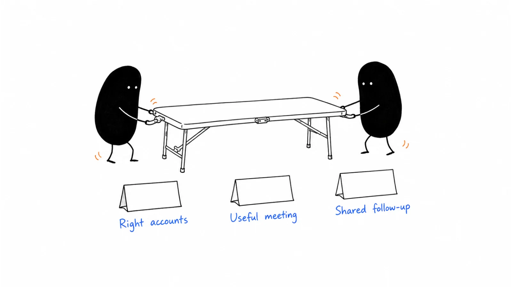

# 06 · Account, field & partner marketing

Some customer relationships grow through a focused account plan, an event, or a trusted partner. This chapter helps you choose a worthwhile interaction, prepare it with the people involved, and follow through afterward.

**Last reviewed:** 2026-09-06 · **Reading edit:** 2026-09-12

## Start here

1. [Plan the next step with one account](account-planning.md) — Connect what you know to a useful action and an owner.
2. [Decide whether an event is worth the effort](event-marketing.md) — Start with the people and conversations you hope to serve.
3. [Build a useful joint offer](partner-marketing.md) — Explain the customer benefit and each partner’s contribution.

## Playbook map

| Guide | What it helps you do |
|---|---|
| [Event marketing](event-marketing.md) | Is this event worth attending, and what would make participation useful? |
| [Trade shows](trade-shows.md) | How do we prepare for relevant conversations and follow up well? |
| [Executive dinners](executive-dinners.md) | What would make a small hosted conversation worth attending? |
| [Ecosystem](ecosystem.md) | Which complementary companies already help the customers we want to serve? |
| [Account planning](account-planning.md) | What is the next useful step with this account, and who owns it? |
| [ABM strategy](abm-strategy.md) | Which accounts justify a coordinated, tailored effort? |
| [One-to-one ABM](one-to-one-abm.md) | How do we plan and bound the work for one important account? |
| [One-to-few ABM](one-to-few-abm.md) | Which accounts share enough of a problem for a common program? |
| [Direct mail](direct-mail.md) | When would a physical item help the recipient do something useful? |
| [Partner marketing](partner-marketing.md) | What customer problem can we solve better with a partner? |
| [Affiliate program](affiliate-program.md) | What terms and economics make a paid recommendation program workable? |
| [Channel marketing](channel-marketing.md) | What do resellers or delivery partners need to serve customers well? |
| [Co-marketing](co-marketing.md) | How do two partners share the work of one useful campaign? |

## Try one thing

Choose one planned event or partner activity. Write who it helps, what they should get from it, and who will handle the next step.

## Where to go next

Pick a guide above for the task you are working on, or browse [Website & conversion](../07-website-and-conversion/) for a related part of the work.

[Back to the playbook index](../README.md)

**Status:** Domain guide published · 13 tactic playbooks published

---

Copyright © 2026 Ivan Xu. All rights reserved. See the [copyright and reuse terms](../../LICENSE).

Canonical source: [github.com/weilun88313/B2B-Playbook](https://github.com/weilun88313/B2B-Playbook)
