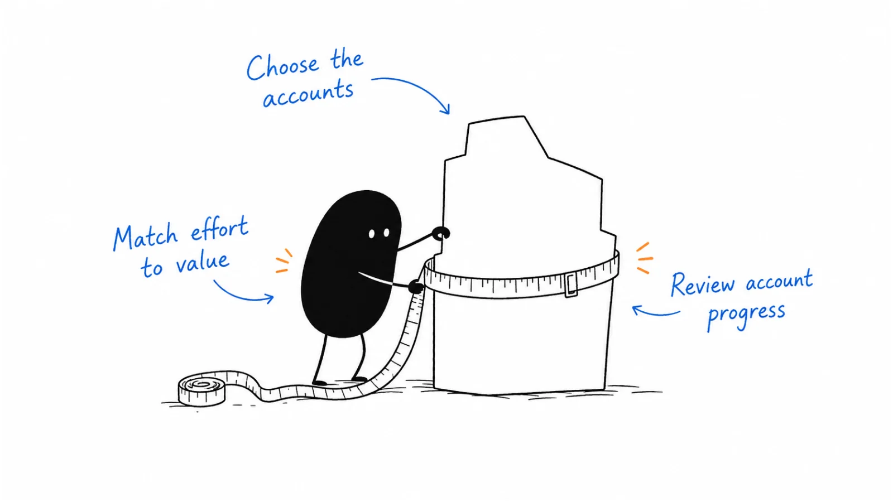

**Last reviewed:** 2026-09-03 · **Reading edit:** 2026-09-12

Account-based marketing puts extra effort into a selected group of companies. Choose that group based on fit and the time your team can realistically spend, then agree with sales on what each account will receive and what progress looks like.

*Reading guide: choose the accounts → match effort to value → review account progress.*

## Use this when

- Marketing and sales both “own” the same logos and neither can say the tier or the weekly move.
- Leadership wants ABM because ACV is high, and the plan is ads + a landing page per industry.
- The T1 list is fifty accounts and nobody has a plan file.
- You are about to buy an ABM platform to create the strategy.

## Do not use this when

- ICP is empty. Stay in [ICP](../01-strategy-and-buyers/icp.md).
- You do not yet have ~10 matching customers. Handmade rings are [first ten](../01-strategy-and-buyers/first-ten-customers.md).
- You need the 30/60/90 for one logo. That is [account planning](https://b2-b-playbook.mintlify.app/playbooks/06-account-field-and-partner/account-planning).
- The motion is unnamed. [Channel strategy](../04-channels-and-distribution/channel-strategy.md) first.
- You want papering and procurement. Outside this taxonomy.
- You want 1:1 creative on the entire GTM TAM. That is not ABM; map and signal the universe, then **cut** to capacity.

## A few useful terms

| Word | Meaning here |
|---|---|
| **Tier** | A resource class—not a feeling. T1 / T2 / T3 means different people-hours |
| **1:1** | Bespoke program for one account. Rare. Needs a living plan |
| **1:few** | A cluster that shares one problem, one asset, one table |
| **1:many** | ICP-wide motion (outbound, content, paid). Not ABM theater with a filter |
| **Progression** | A dated change in the account (new seat, scoped meeting, mutual plan)—not a click |
| **Account-driven** | TAM + ICP in the CRM, account **and** contact, signals. Broader than ABM. Not a reason to kill inbound |
| **Signal** | A dated fact that changes this week’s action (fit, intent, engagement)—not a mood |

## Keep this in mind

**Tier first, then tactics.** If you cannot say how many T1 accounts you can actually staff this quarter, you do not have ABM. You have a logo mood board. Use [one-to-one ABM](https://b2-b-playbook.mintlify.app/playbooks/06-account-field-and-partner/one-to-one-abm) and [one-to-few ABM](https://b2-b-playbook.mintlify.app/playbooks/06-account-field-and-partner/one-to-few-abm) for the corresponding execution plans.

## How to do it

### Step 0: List the addressable accounts in the CRM

[ICP](../01-strategy-and-buyers/icp.md) and [wedge](../01-strategy-and-buyers/wedge.md) define who belongs in the universe. Load those **accounts** (then contacts) into the CRM or warehouse. Write who is **not** TAM this year. Pitch-deck TAM for investors is not the operating list.

Then choose a few **signals** you will actually act on (fit change, intent, engagement, a [buying signal](../05-outbound-and-prospecting/buying-signals.md))—not fifty campaign ideas. Inbound form-fills are one signal among others. Stages belong on the account **and** the person; a lead-only funnel is how you forget the company. [CRM data model](../09-operations-pipeline-and-measurement/crm-data-model.md) is the record; this step is the GTM choice.

This is not “ABM everyone we could ever sell.” T3 stays 1:many. T1 stays scarce.

### Step 1: Match the account list to team capacity

Complete: *this quarter we can honestly run ____ T1 plans and ____ T2 clusters.* T1 is measured in **plans that get a weekly owner**, not in TAM rows. If sales headcount cannot cover the T1 list, cut the list. Do not hire a platform to hide the math.

Fit still comes from [ICP](../01-strategy-and-buyers/icp.md). Intent and relationship can upgrade a name; they do not create a tier you cannot staff.

### Step 2: Set the service level for each tier

| Tier | What it is | Default resources | Stop if |
|---|---|---|---|
| **T1 · 1:1** | One account, one [account plan](https://b2-b-playbook.mintlify.app/playbooks/06-account-field-and-partner/account-planning) | Named AE/CS + marketing hours + optional [dinner](https://b2-b-playbook.mintlify.app/playbooks/06-account-field-and-partner/executive-dinners) or custom proof | No plan file, or the list exceeds capacity |
| **T2 · 1:few** | 5–15 accounts, one shared problem | One asset, one table or [peer](../04-channels-and-distribution/community.md) cut, shared sequence | The cluster is just “same industry” |
| **T3 · 1:many** | Everyone else who passes ICP | [Outbound](../05-outbound-and-prospecting/) / [content](../03-brand-story-and-content/content-strategy.md) / [paid](../04-channels-and-distribution/paid-media.md) | You relabel this “ABM” to sound strategic |

Do not invent T4. Do not put T3 on a personalized microsite.

### Step 3: Use approaches the team can already run

ABM does not invent channels. It **concentrates** them:

- Outbound sentences still need [message-market fit](../05-outbound-and-prospecting/message-market-fit.md).
- Proof is a [case study](../03-brand-story-and-content/case-study.md) or comparison URL, not a new brand.
- Field is a [dinner](https://b2-b-playbook.mintlify.app/playbooks/06-account-field-and-partner/executive-dinners) or [show](https://b2-b-playbook.mintlify.app/playbooks/06-account-field-and-partner/trade-shows) aimed at named seats.
- Partners sit in [ecosystem](https://b2-b-playbook.mintlify.app/playbooks/06-account-field-and-partner/ecosystem).

A “personalized ebook” that no champion would forward is not a play.

### Step 4: Review progress at account level

Scoreboard: T1/T2 accounts that **progressed** (new relevant seat, scoped meeting, stage move you would defend in [forecasting](../09-operations-pipeline-and-measurement/forecasting.md)). [Measurement model](../09-operations-pipeline-and-measurement/measurement-model.md) still forbids one UTM to own the account. MQLs from an ABM landing page are capture theater unless the account was already on the list.

### Step 5: Revisit the list regularly

Monthly: which T1 plan is stale, which T2 cluster never met, which T3 name is being treated like T1. Promote/demote in writing. ABM lists that only grow are a grave.

## Worked example (illustrative)

Sales-assist. Six AEs. High ACV.

| Field | Fill |
|---|---|
| Capacity | 8 T1 plans (one per AE + two founder). Two T2 clusters. |
| T1 | Named accounts with a live plan and a weekly owner |
| T2 | “Queue owners still on shared inbox” — one comparison + one table |
| T3 | ICP outbound. Not “ABM light.” |
| Will not do | 80-logo ABM dashboard. Industry microsites. Platform before the list is cut. ABM ads on the entire GTM TAM. |

## Copy: ABM system card (fill)

- GTM TAM in CRM (account + contact) / still a spreadsheet:
- Signals we will act on this quarter (few):
- T1 capacity this quarter (number + why that is staffable):
- T2 clusters (problem, account count, one shared play):
- What T3 is allowed to be (and what we will not call it):
- Entry / exit rules for a tier:
- Progression we will count:
- Platform we refuse until ______:

Working file: [abm-strategy.md](../../templates/abm-strategy.md).

## Before you start

- [ ] ICP and primary motion are written.
- [ ] GTM TAM is in the CRM as accounts (and contacts), not only a TAM slide.
- [ ] A short signal list exists; inbound is not the only front door.
- [ ] T1 count ≤ plans we will actually keep alive.
- [ ] Every T1 has or will get an [account plan](https://b2-b-playbook.mintlify.app/playbooks/06-account-field-and-partner/account-planning).
- [ ] T2 shares a problem, not only a vertical.
- [ ] T3 is not branded as ABM.
- [ ] Scoreboard is account progression, not MQLs.
- [ ] Review date for promote/demote is on the calendar.

## Metrics

| Metric | Diagnostic use |
|---|---|
| Staffed T1 | Plans with a dated update in the last 14 days |
| T2 progression | Cluster accounts that gained a seat or a scoped next step |
| List honesty | Names demoted when they failed the tier |
| Platform restraint | Seats we did not buy before the list was cut |

Do not treat ABM-influenced pipeline, ad engagement on account lists, or “accounts reached” as the program.

## Common mistakes

- Calling the whole TAM “ABM.”
- Killing inbound and brand because the CRM now has accounts.
- Calling ICP outbound ABM.
- A T1 list larger than weekly coaching can see.
- Buying orchestration to postpone the plan file.
- Personalized assets nobody sends.
- Measuring MQLs from a tier-3 form.
- Skipping [account planning](https://b2-b-playbook.mintlify.app/playbooks/06-account-field-and-partner/account-planning) and running “plays” into a void.

## What to read next

The file for one T1 logo is [account planning](https://b2-b-playbook.mintlify.app/playbooks/06-account-field-and-partner/account-planning). A small table is [executive dinners](https://b2-b-playbook.mintlify.app/playbooks/06-account-field-and-partner/executive-dinners). Partners already in the building are [ecosystem](https://b2-b-playbook.mintlify.app/playbooks/06-account-field-and-partner/ecosystem). Person-level work inside the program is [outbound](https://b2-b-playbook.mintlify.app/playbooks/05-outbound-and-prospecting). After they buy, the book is [customer success](https://b2-b-playbook.mintlify.app/playbooks/08-lifecycle-and-customer-marketing/customer-success); expansion is [expansion marketing](https://b2-b-playbook.mintlify.app/playbooks/08-lifecycle-and-customer-marketing/expansion-marketing). Continue with [one-to-one](https://b2-b-playbook.mintlify.app/playbooks/06-account-field-and-partner/one-to-one-abm) or [one-to-few execution](https://b2-b-playbook.mintlify.app/playbooks/06-account-field-and-partner/one-to-few-abm) according to the account tier and available capacity.

## Sources and evidence boundary

This is an owner-maintained operating synthesis.

- **Treat selected accounts as the market; coordinate marketing and sales; measure the account.** Public ITSMA / Bev Burgess account-based marketing definition, stated as a **method**, not as a membership or a book you must buy. Vendor orchestration guides (including Demandbase, already cited on the master index) are **not** this page’s operating system.
- Capacity-before-list and “T3 is not ABM” are this library’s judgments, paired with [account planning](https://b2-b-playbook.mintlify.app/playbooks/06-account-field-and-partner/account-planning) and [channel strategy](../04-channels-and-distribution/channel-strategy.md).
- Account-driven GTM as the **foundation** (TAM and ICP in the CRM, account + contact, signals, inbound as one signal not the only door; not “ABM the whole TAM”; not a substitute for brand) draws on Emily Kramer ([MKT1, 2025-02-12](https://newsletter.mkt1.co/p/account-driven-gtm-part-1?ref=b2b-playbook) and [2025-02-27](https://newsletter.mkt1.co/p/account-driven-gtm-part-2?ref=b2b-playbook)). The paid 50+ tool list and 50+ campaign-idea sheet are not reproduced here. GTM TAM vs pitch TAM is the same split as [wedge](../01-strategy-and-buyers/wedge.md).
- This page is not a license to scrape account data or to ignore consent.

---

Copyright © 2026 Ivan Xu. All rights reserved. See the [copyright and reuse terms](https://github.com/weilun88313/B2B-Playbook/blob/main/LICENSE).

Canonical source: [github.com/weilun88313/B2B-Playbook](https://github.com/weilun88313/B2B-Playbook)
