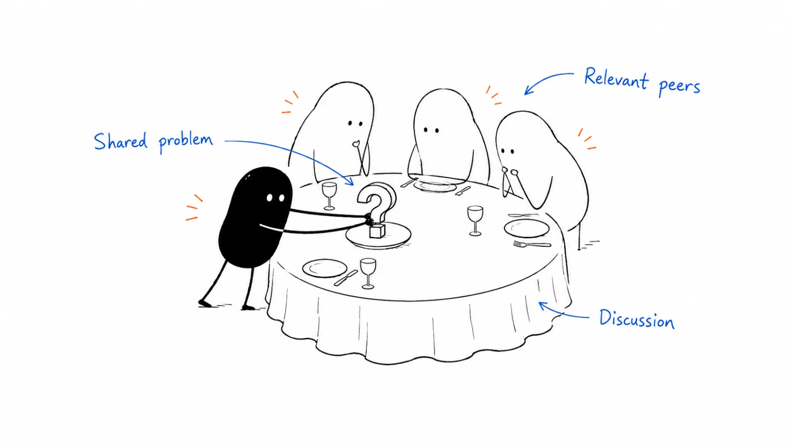

**Last reviewed:** 2026-08-30 · **Reading edit:** 2026-09-06

A small dinner can give senior buyers time to compare notes with peers. Invite people who share a meaningful problem, choose a focused discussion, and make the evening worth attending without a sales presentation. Follow up on what each person actually discussed.

*Reading guide: a shared problem · a relevant guest list · a useful peer discussion.*

## Use this when

- ACV and cycle justify a night for eight to twelve people who share a job.
- You can name the seat and the question before you book the room.
- The alternative is a large reception “to maximize pipeline.”
- A [peer community](../04-channels-and-distribution/community.md) intro needs a table, not a Slack thread.

## Do not use this when

- The ICP cannot name who should sit down. Stay in [ICP](../01-strategy-and-buyers/icp.md).
- You cannot staff follow-up the next morning. That is how dinners become theater.
- You need a booth. That is [trade shows](trade-shows.md).
- The goal is “brand” with no dated next action.

## A few useful terms

| Word | Meaning here |
|---|---|
| **Role lock** | One buying seat (or one tightly adjacent pair). A “mix of the industry” is a mixer. |
| **Table size** | Small enough that everyone speaks. Default 8–12. Twenty is a briefing. |
| **Question** | One operating problem the table came to argue. Not a product agenda. |
| **Host** | The person whose reputation filled the room—often a peer or [creator](../04-channels-and-distribution/creator-partnership.md), not only you. |
| **Next step** | A dated action for a named account, or a peer intro. A recap email is not this. |

## Keep this in mind

**Same role, small table, one question.** If you add seats so more titles can “get value,” you will get polite conversation and no pipeline. Operator rooms keep repeating that the smaller, role-consistent night beats the large generic one. Treat that as a method prompt, not a community’s ROI table.

## How to do it

### Step 1: Choose the guest profile and discussion

Write: *[seat] will sit for [question] because it is already costing them _____.* If the question needs a slide, it is a pitch. If the seat is “CMOs and their agencies and a few founders,” it is a mixer.

### Step 2: Research the guest list

Every name has a reason, a [account](account-planning.md) note if they are named, and a why-them. Invite fewer than you want. A no from the right seat is better than a yes from a tourist. Customers and peers can outnumber you at the table; that is the point.

### Step 3: Make room for peer conversation

Room, not stage. No booth kit. A short frame from the host, then the table. You may offer a working file or a data cut—see [peer community](../04-channels-and-distribution/community.md)—but the product demo stays home unless someone asks.

### Step 4: Capture relevant context with care

For each guest who is in-ICP: trigger, alternative, missing seat, what they asked, agreed next step, owner, date. A photo of the table is not capture. Consent and notes stay inside the rules you already use for events.

### Step 5: Follow up individually

One note per person from the conversation. Complete the action you promised before you ask for a demo. A shared recap is optional and never the CRM update.

## Worked example (illustrative)

Twelve heads of customer ops, one city, one question: “when does the questionnaire pack stop being a spreadsheet?” No AEs pitching. Two customers at the table. Three T1 next steps booked before dessert; the rest get a working-file link and no sequence.

## Copy: table card (fill)

- Date / city / host:
- Seat lock (one):
- Question (one interrogative):
- Guest list (name / account / why them)—target 8–12:
- Customers or peers at the table:
- What we will not do (demo, mixer titles, recap blast):
- Capture fields we will actually fill:
- Next-morning owner:

Working file: [executive-dinners.md](../../templates/executive-dinners.md).

## Before you start

- [ ] [Event](event-marketing.md) score still says host or attend.
- [ ] One seat, one question, ≤12 guests.
- [ ] Every name has a why-them.
- [ ] Host reputation is real; we are not renting a celebrity for a pitch.
- [ ] Capture and next-morning owner exist before the reservation.
- [ ] Demo and badge logic are off the table unless asked.
- [ ] We will not add titles to “fill the room.”

## Metrics

| Metric | Diagnostic use |
|---|---|
| Role purity | Guests who matched the locked seat |
| Qualified next actions | Dated steps a seller recognizes |
| Peer intros | Intros that happened because of the table |
| Follow-up next morning | Notes sent from the conversation / ICP guests |
| Mixer drift | Extra titles we added (should be zero) |

Do not count RSVPs, photos, or “everyone had a good time.”

## Common mistakes

- Growing the table so the venue looks full.
- Three personas “for energy.”
- A fifteen-minute product slot “because we paid.”
- One recap to the whole list.
- Skipping [event marketing](event-marketing.md) and hosting because dinners are fashionable.
- Calling a 40-person reception a roundtable.

## What to read next

Whether the night should exist is [event marketing](event-marketing.md). A booth week is [trade shows](trade-shows.md). The room you did not host is [peer community](../04-channels-and-distribution/community.md). Named accounts at the table need [account planning](account-planning.md). The story in follow-up is [sales enablement](../02-product-marketing/sales-enablement.md).

## Sources and evidence boundary

This is an owner-maintained operating synthesis. It is not a catering guide.

Role lock, small table, and “mixer ≠ pipeline” are judgments in this library. Practitioner communities often prefer smaller, same-role nights to large generic events; that pattern is a **method prompt**, not a source to copy and not a requirement to join any paid room.

---

Copyright © 2026 Ivan Xu. All rights reserved. See the [copyright and reuse terms](../../LICENSE).

Canonical source: [github.com/weilun88313/B2B-Playbook](https://github.com/weilun88313/B2B-Playbook)
