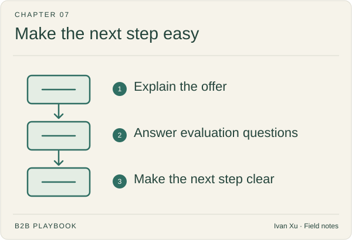

# 07 · Website & conversion

Your website should help a visitor understand the offer and decide what to do. Improve the homepage, comparisons, pricing, campaign pages, and the experience after someone asks for a demo.

**Status:** Domain guide published · 6 tactic playbooks published

**Last reviewed:** 2026-09-06

## Start here

- [Homepage](homepage.md) — what is this for?.
- [Comparison page](comparison-page.md) — where each option fits.
- [Demo request](demo-request.md) — set expectations.

## Playbook map

| Guide | What it helps you do |
|---|---|
| [Homepage](homepage.md) | What must a priority visitor understand within the first useful scan? |
| [Comparison page](comparison-page.md) | How should alternatives be compared fairly and credibly? |
| [Pricing page](pricing-page.md) | What pricing and packaging information helps a buyer self-qualify? |
| [Demo request](demo-request.md) | How should a high-intent buyer understand and enter the next step? |
| [Landing page](landing-page.md) | How should one campaign promise lead to one relevant next step? |
| [Forms and chat](forms-and-chat.md) | Which interaction collects enough context without creating avoidable friction? |

## Coming later

These topics are on the writing list. There is no article to open yet.

| Planned topic | Question to cover |
|---|---|
| Website strategy | Which audiences, questions, journeys, and conversions should the site support? |
| Product page | How should capabilities connect to outcomes, use cases, and proof? |
| Documentation and resource center | How should evaluators and users find authoritative implementation knowledge? |
| Lead magnet | When is an exchange of information valuable enough to justify a form? |
| Conversion-rate optimization | Which evidence-based change can improve a defined buyer progression? |
| Self-service buying | Which parts of evaluation and purchase can happen without a scheduled meeting? |

## Where to go next

Pick a guide above for the task you are working on, or browse [Lifecycle & customer marketing](../08-lifecycle-and-customer-marketing/) for a related part of the work.

[Back to the playbook index](../README.md)

---

Copyright © 2026 Ivan Xu. All rights reserved. See the [copyright and reuse terms](../../LICENSE).

Canonical source: [github.com/weilun88313/B2B-Playbook](https://github.com/weilun88313/B2B-Playbook)
