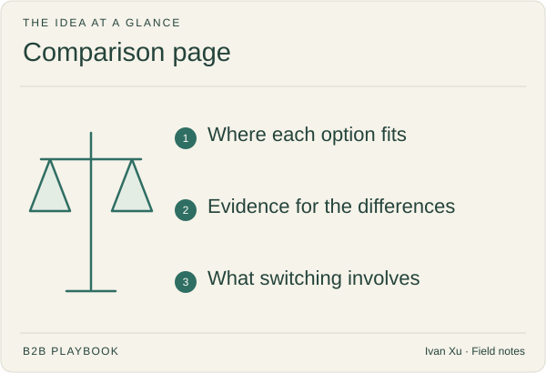

**Last reviewed:** 2026-08-30 · **Reading edit:** 2026-09-06

Buyers comparing products need a fair explanation of the trade-offs. Show where each option fits, back up specific claims, and explain the work involved in switching. A page that admits when another option is better is more useful than a table where you win every row.

*Reading guide: where each option fits · evidence for the differences · what switching involves.*

## Use this when

- The same named tool, category, or “keep the spreadsheet” shows up in the last ten serious conversations.
- Sales pastes a feature grid that never admits where the other option wins.
- SEO wants a `{you} vs {incumbent}` URL and product has not named the decision.
- A champion asked “how should we choose?” and the site has no answer they can send upstairs.

## Do not use this when

- Positioning and the decision-page map are empty. Stay in [positioning](../02-product-marketing/positioning.md) and [content strategy](../03-brand-story-and-content/content-strategy.md).
- The alternative has never appeared in a win/loss note. Do not manufacture a rival for search volume.
- Legal or brand has forbidden naming that company and you have not agreed a category-level frame instead.
- You need the commercial number. That is the [pricing page](pricing-page.md).

## A few useful terms

| Word | Meaning here |
|---|---|
| **Alternative** | What they would keep using if you vanished—tool, category, or status quo |
| **Criterion** | A job the committee will actually score (result, implementation, ownership, constraint, cost)—not a feature row you invented |
| **Honest trade-off** | A sentence where the other option is stronger |
| **Switching path** | What changes and what remains; “rip and replace” is a claim, not a default |

## Keep this in mind

**Name where the other option wins.** If every cell crowns you, a champion cannot use the page. Refusing the other side’s strengths is how comparison pages get ignored.

## How to do it

### Step 1: Choose a comparison buyers actually ask for

Write: *in the last ten serious conversations, they already had [alternative] on the short list because [evidence].* If the name comes from a market-map workshop, stop. One page per repeating alternative. “Us vs the category” is a different page, and usually weaker.

### Step 2: Use a clear comparison outline

From [positioning](../02-product-marketing/positioning.md#comparison-page-outline):

1. Decision: “[Product] vs [alternative] for [specific job]”
2. Short answer: who should choose each option
3. Decision context: trigger, buyer, current process
4. Criteria: outcome, implementation, workflow ownership, data/security, total operating cost
5. Honest trade-offs
6. Switching path
7. Proof that is dated and checkable
8. One next step

The short answer must include a line where **they should keep the alternative**. If you cannot write that line, you do not understand the deal yet.

### Step 3: Compare jobs and trade-offs

A 40-row feature table trains the buyer to pick the longer checklist. Use five to seven criteria the committee already argues. For each: current alternative / your approach / evidence still missing. Missing evidence stays visible. Inventing a checkmark is a claims incident.

### Step 4: Explain the switching process

What data moves. What stays. Who owns the week of cutover. What they can leave alone. “Zero disruption” is a slogan unless you can name the week.

### Step 5: Offer a relevant next step

A scoped walkthrough of *their* comparison, a security packet, or “forward this table to [seat].” “Contact us” is not a decision-specific action.

## Worked example (illustrative)

Same Help Scout *shape* used on positioning (not a claim about that company’s page): shared inbox vs a customer-service platform, champion = head of support.

| Criterion | Shared inbox | Proposed approach | Evidence still missing |
|---|---|---|---|
| Business result | Fast and familiar; reporting falls apart | Team will use it *and* the lead can run the queue | Dated proof a similar team switched and kept using it |
| Implementation | Already live | Migration of history and macros | Scope of what stays in email |
| Workflow ownership | Anyone with the inbox | Named roles, SLAs, collision handling | Who owns the queue today |
| Data and security | Whatever Google/Microsoft already granted | DPA, SSO, retention | Their questionnaire, not a slogan |
| Total operating cost | “Free” except lost tickets and heroics | Seat price vs the cost of missed SLAs | Their own missed-SLA story |

Short answer the page must be willing to print: *keep the inbox if volume is low and nobody is paid on queue health.*

## Copy: comparison brief (fill)

- Alternative (from win/loss, not a radar):
- Specific job this page decides:
- Who should keep the alternative:
- Who should switch, and what trigger:
- Five to seven criteria (jobs, not features):
- Where they are stronger (one sentence):
- Switching path (what changes / what remains):
- Proof we can date:
- Next step:
- Legal / naming constraint (if any):

Working file: [comparison-page.md](../../templates/comparison-page.md).

## Before you start

- [ ] The alternative appeared in live deals, not only on a slide.
- [ ] The page states who should *not* buy you.
- [ ] Criteria are committee jobs; the feature dump is gone or below the fold.
- [ ] Every claim is labeled fact / observation / assumption / still missing.
- [ ] Sales will paste this URL without adding a defensive paragraph.
- [ ] Next step is one action, not a generic form.
- [ ] [Content strategy](../03-brand-story-and-content/content-strategy.md) map has this row, and only this alternative.

## Metrics

| Metric | Diagnostic use |
|---|---|
| Champion forwards | Times the URL appears in an evaluation thread without a seller rewrite |
| Sales reuse | Deals where the AE sent this page instead of a custom deck |
| Honest-line survival | Reviews that did not strip “keep them if _____” |
| Wrong-alternative traffic | Sessions for a rival you never meet in deals (kill or noindex) |

Do not treat “vs” keyword rank as success if sales will not send the page.

## Common mistakes

- Publishing `{you} vs {famous vendor}` for search before that vendor appears in deals.
- A feature grid that always crowns you.
- Hiding status quo (“do nothing”) because it is not a logo.
- Legal-washing the name into mush so the page answers no decision.
- Making the homepage do this job.

## What to read next

The number they will defend next is on the [pricing page](pricing-page.md). The walk after they agree the job is [demo](../02-product-marketing/demo.md); the form that books it is [demo request](demo-request.md). If the alternative is still unnamed, return to [positioning](../02-product-marketing/positioning.md). Change cost that is not a feature fight lives in [change friction](../02-product-marketing/change-friction.md).

## Sources and evidence boundary

This is an owner-maintained operating synthesis. The eight-part outline and the shared-inbox teaching grid are the comparison method already on [positioning](../02-product-marketing/positioning.md), from April Dunford’s public comparison discipline: name the alternative, include where it is stronger, write for the champion who must forward the page.

“Only publish when the alternative repeats in deals” is this library’s gate, paired with [content strategy](../03-brand-story-and-content/content-strategy.md). Feature-table SEO pages and vendor battlecards are not this method. This page is not legal advice on comparative advertising.

---

Copyright © 2026 Ivan Xu. All rights reserved. See the [copyright and reuse terms](../../LICENSE).

Canonical source: [github.com/weilun88313/B2B-Playbook](https://github.com/weilun88313/B2B-Playbook)
