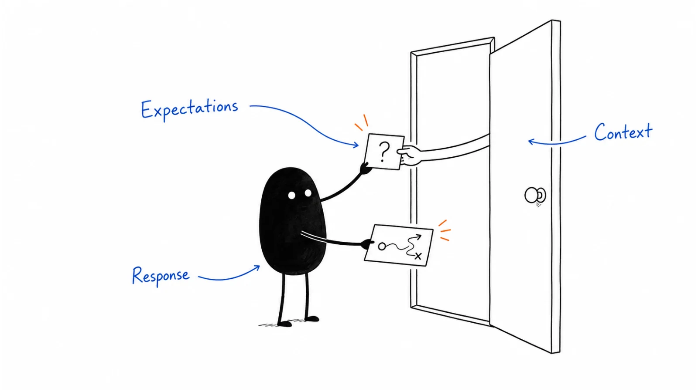

**Last reviewed:** 2026-08-30 · **Reading edit:** 2026-09-12

When someone requests a demo, tell them what will happen next. Ask only for information you will use, explain who will respond and when, and help the sales team prepare. The experience after submitting the form matters as much as the button.

*Reading guide: set expectations → ask for useful details → respond with context.*

## Use this when

- Demo submits sit for a day and sales works them as “MQLs from the site.”
- The form asks for budget, timeline, and a phone number before the buyer knows the category.
- Every CTA on the site says “Book a demo,” including blog posts and careers.
- Self-serve visitors are forced through a meeting to see a price.

## Do not use this when

- The motion is truly self-serve and nobody should walk the product live. That is [channel strategy](../04-channels-and-distribution/channel-strategy.md) plus a signup path.
- Positioning cannot name the job the walk will serve. Stay in [positioning](../02-product-marketing/positioning.md).
- You need the scored product walk. That is [demo](../02-product-marketing/demo.md).
- Volume is a handful of inbound names a week and a human already replies in an hour. Write the SLA; do not add fields for sport.

## A few useful terms

| Word | Meaning here |
|---|---|
| **Hand-raise** | They asked for a conversation or a walk—not a content download |
| **Scope** | Whose job, which queue or workflow, what they will see—written before the calendar hold |
| **Speed-to-lead** | Time from submit to a human who can accept or redirect |
| **HDYHAU** | “How did you hear about us?” — open text, no dropdown. Measurement, not a cute field |

## Keep this in mind

**Collect only what makes the first meeting useful—or what routes the wrong seat out.** Every extra field is a tax on a buyer who was ready. Company size and a work email are usually enough to start. Budget and “when will you buy?” are sales questions for the call, not a gate on the form.

## How to do it

### Step 1: Explain what the demo includes

The page title is the meeting: “Walk through *your* [job],” not “Request a demo.” One paragraph: who it is for, how long, what they should have ready (a sample queue, a short list, a constraint). If the homepage promised a scoped conversation, this page must not downgrade it to a platform tour.

### Step 2: Ask for information you will use

Awareness-stage forms stay short. This is a **decision** form: role, work email, company, and enough context to scope (one text field: “What should we look at?”). Progressive profiling belongs on later pages, not here.

Add a **mandatory open-text** “How did you hear about us?” with no suggested list. Dropdowns train people to pick “Google.” The field is for [measurement model](../09-operations-pipeline-and-measurement/measurement-model.md), not for a campaign report. Do not put it on every newsletter signup.

### Step 3: Set a response standard

Complete: *on submission, ____ is notified and will ____ within ____.* Someone explicitly requesting a demo needs an appropriate response without waiting to accumulate engagement points. If a visitor needs a different kind of help, explain the suitable route: a resource, signup, support, or another contact. Make those alternatives useful, too.

If nobody owns the first hour, you built a form, not a door.

### Step 4: Confirm the buyer's needs before the call

The auto-reply is not “thanks, a calendar link.” It restates the job they named and asks them to correct it. The [demo](../02-product-marketing/demo.md) still requires discovery. A calendar hold with no scope is how tours get booked and deals die as no-decision.

### Step 5: Use the request form where it fits

Blog, careers, and education pages get a next step that matches intent (read the comparison, join a list, see pricing). “Book a demo” on every footer trains junk volume and trains sales to ignore the queue.

## Worked example (illustrative)

Sales-assist. Champion = ops lead. Form lives on `/walkthrough`.

| Field | Fill |
|---|---|
| Promise | 25 minutes on *your* queue—not a platform tour |
| Fields | Work email, role, company, “What should we look at?”, HDYHAU (open text) |
| Will not ask | Budget, headcount bands, “when do you need this?”, phone as required |
| SLA | AE or founder notified immediately; first human touch in one business hour |
| Wrong-seat path | Practitioner with no queue ownership → comparison page, no calendar |
| Confirm | Reply names their queue; they can correct before the hold |
| Not on | Blog footer, careers, sitemap |

## Copy: demo-request brief (fill)

- URL and the sentence the button actually promises:
- Fields we will ask (and why each makes the meeting better):
- Fields we refuse:
- HDYHAU: open text, required on this form only (yes/no):
- Owner and SLA:
- Wrong-seat / student / customer / competitor path:
- Confirm message (scope they can correct):
- Pages that must *not* use this CTA:

Working file: [demo-request.md](../../templates/demo-request.md).

## Before you start

- [ ] The door matches [channel strategy](../04-channels-and-distribution/channel-strategy.md).
- [ ] The page states whose job and how long.
- [ ] Field list is short enough that a ready buyer will finish it.
- [ ] HDYHAU is open text with no prompts—if you are collecting it.
- [ ] SLA is written; scoring does not delay the notify.
- [ ] Auto-reply restates scope.
- [ ] This CTA is not the site-wide footer default.
- [ ] Consent/privacy owner has reviewed the form. This page is not that review.

## Metrics

| Metric | Diagnostic use |
|---|---|
| Speed-to-lead | Median time submit → human accept or redirect |
| Scope quality | Holds that arrive with a job the rep can open without a fishing intro |
| Wrong-door rate | Tours booked for seats you will not sell |
| Show rate | Held meetings that happen—after a scoped confirm, not a raw calendar blast |
| HDYHAU completion | Usable open-text share (not “idk” / blank-equivalent) |

Do not treat form-fill volume or “MQL from demo page” as the score. A smaller, scoped queue is the point.

## Common mistakes

- Calling every CTA a demo.
- Asking procurement questions on the form.
- Letting the MAP score the hand-raise overnight.
- Dropdown HDYHAU.
- Sending a generic calendar link with no scope.
- Using this form as the only “how did you hear” surface and then forgetting to read it.

## What to read next

The walk itself is [demo](../02-product-marketing/demo.md). How short this form is allowed to be—and whether chat is a second queue—is [forms and chat](https://b2-b-playbook.mintlify.app/playbooks/07-website-and-conversion/forms-and-chat). Routing math for *people who have not asked to speak to sales* is [lead scoring](../09-operations-pipeline-and-measurement/lead-scoring.md). How HDYHAU sits next to software attribution is [measurement model](../09-operations-pipeline-and-measurement/measurement-model.md). People who raised a hand too early, or who are not ready for a walk, are [lead nurture](../08-lifecycle-and-customer-marketing/lead-nurture.md). The number they may want before they submit is the [pricing page](https://b2-b-playbook.mintlify.app/playbooks/07-website-and-conversion/pricing-page).

## Sources and evidence boundary

This is an owner-maintained operating synthesis.

- Short decision forms, hand-raisers skipping the point ladder, and high-value URLs (pricing, demo) as routing—not “+1 per page view”—are already on [lead scoring](../09-operations-pipeline-and-measurement/lead-scoring.md).
- Open-text “How did you hear about us?” on **declared-intent** forms, with no leading suggestions, is the public Refine Labs method ([Attribution Mirage](https://www.refinelabs.com/blog/attribution-mirage?ref=b2b-playbook); hybrid framework note). Their 90% gap and podcast-revenue cut are **their** twelve-month study. Treat as a **method prompt**, not as your mix.
- Scoped meeting vs platform tour is this library’s judgment, paired with [demo](../02-product-marketing/demo.md). Calendar-tool vendors are not the method.

---

Copyright © 2026 Ivan Xu. All rights reserved. See the [copyright and reuse terms](https://github.com/weilun88313/B2B-Playbook/blob/main/LICENSE).

Canonical source: [github.com/weilun88313/B2B-Playbook](https://github.com/weilun88313/B2B-Playbook)
